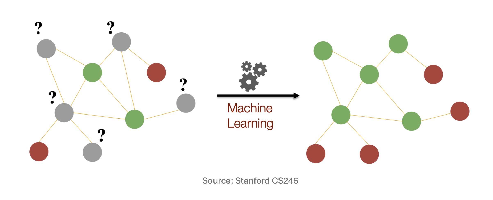
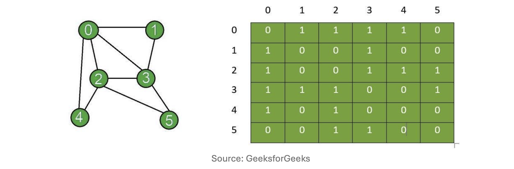
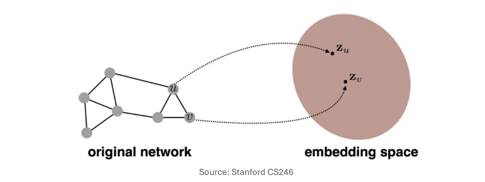
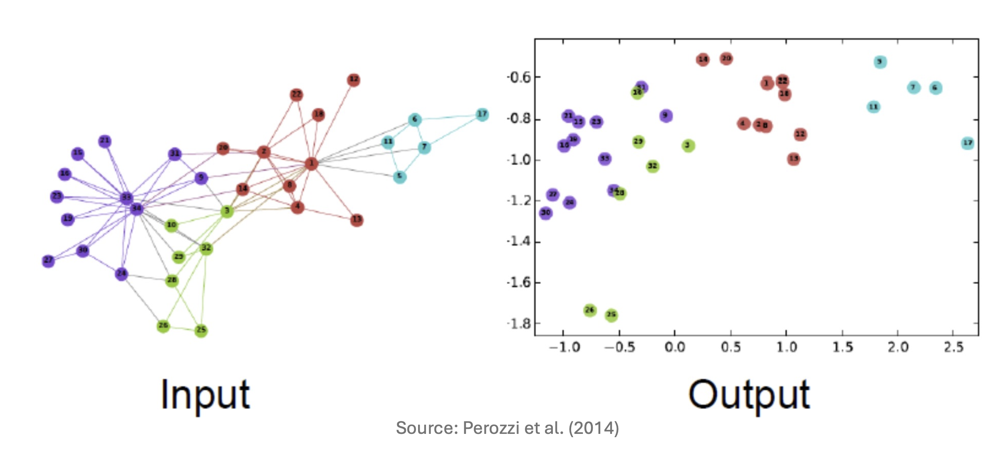
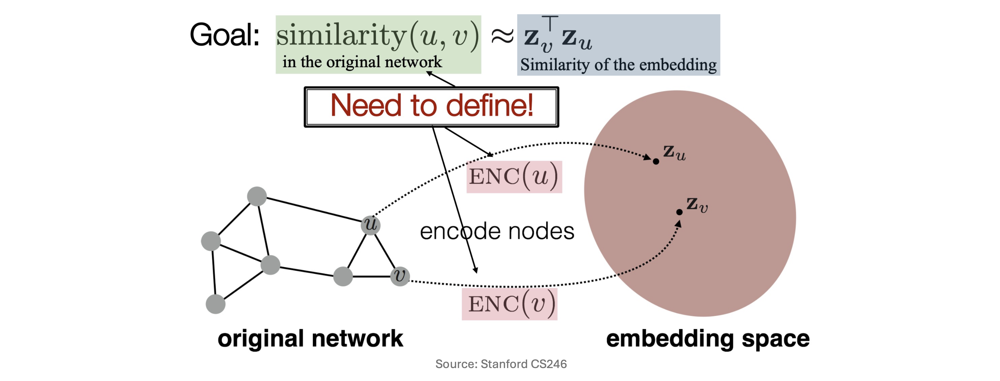
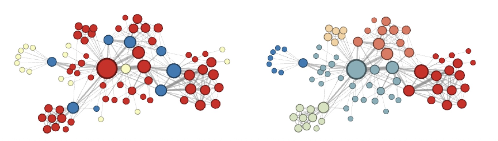
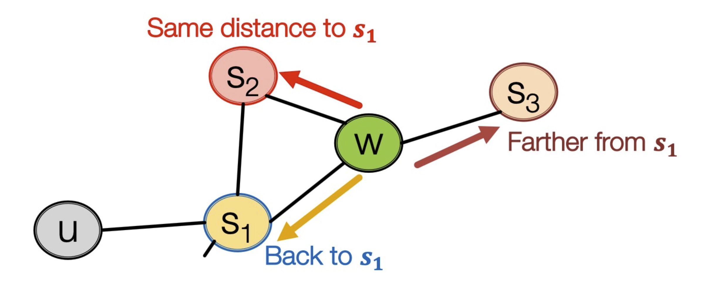
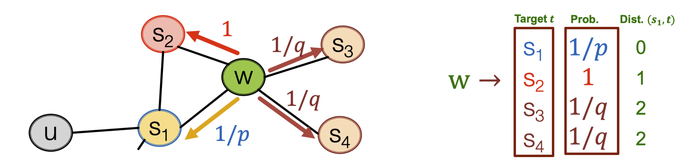

## 들어가며 (Recap)

지난 강의에서는 **임베딩 학습(Learning Embeddings)**의 두 핵심 모델을 살펴보았습니다.

- **Word2Vec**: 단어 시퀀스에서 문맥적 유사성을 학습합니다. 원-핫 벡터를 입력으로 받아 은닉층(hidden layer)에서 저차원 임베딩을 추출하고, 소프트맥스 출력을 통해 문맥 단어를 예측합니다.
- **Autoencoder**: 인코더–병목(bottleneck)–디코더 구조로 데이터를 압축·재구성합니다. 병목 계층의 표현이 데이터의 핵심 특징을 담습니다.

이번 강의에서는 이러한 임베딩 학습 아이디어를 **그래프(graph)** 도메인으로 확장합니다. 소셜 네트워크, 추천 시스템, 지식 그래프 등 현실 세계의 많은 데이터가 그래프 형태로 자연스럽게 표현되므로, 그래프 위의 머신러닝은 매우 중요한 연구 영역입니다.

---

## 1. 그래프 표현 학습 (Graph Representation Learning)

### 그래프에서의 태스크 (Tasks in Graphs)

그래프는 다양한 데이터 유형을 일반화할 수 있는 강력한 구조입니다. 이전에 공부한 PageRank(노드 중요도 계산), 근접도(Proximity), 커뮤니티 탐지(Community Detection)를 넘어, 이번에는 머신러닝을 활용한 보다 다양한 태스크를 다룹니다.

#### 노드 분류 (Node Classification)

**노드 분류**는 그래프의 각 노드에 레이블(label)을 부여하는 태스크입니다.

- 소셜 네트워크에서 사용자의 **정치적 성향 식별**
- 추천 시스템에서 **사용자·아이템의 카테고리 분류**

연결된 노드끼리는 비슷한 레이블을 가질 가능성이 높다는 직관이 핵심입니다.



#### 링크 예측 (Link Prediction)

**링크 예측**은 그래프에 새로운 엣지(edge)가 나타날 가능성을 예측하는 태스크입니다.

- 소셜 네트워크에서의 **친구 추천**
- Netflix 등 플랫폼에서의 **새 영화 추천**


---

### 그래프의 표현 (Representation of Graphs)

그래프 $G = (V, E)$를 머신러닝 모델에 입력하려면 수치적 표현이 필요합니다. 가장 기본적인 방법은 **인접 행렬(Adjacency Matrix)** $A \in \{0,1\}^{N \times N}$을 사용하는 것입니다.

$$A_{ij} = \begin{cases} 1 & \text{노드 } i \text{와 } j \text{가 연결된 경우} \\ 0 & \text{그 외} \end{cases}$$

이때 각 노드 $i$는 $N$차원 행 벡터 $\mathbf{a}_i$ (즉, $A$의 $i$번째 행)로 표현됩니다. 연결된 이웃의 위치에만 1이 위치한 **멀티-핫 벡터(multi-hot vector)**입니다.



#### 나이브한 표현의 한계 (Limitations of the Naïve Approach)

각 노드 $i$를 $\mathbf{a}_i$로 표현하면 두 가지 근본적인 문제가 발생합니다.

- **한계 1 — 고차원성과 희소성**: 노드 수 $N$이 수백만에 달하는 실제 그래프에서 $N$-차원 벡터는 너무 고차원이며, 각 노드가 극히 일부 노드와만 연결되어 있어 벡터 대부분이 0인 극단적인 **희소 벡터(sparse vector)**가 됩니다.

- **한계 2 — 인접 행렬의 비유일성**: 동일한 그래프도 노드 순서를 바꾸면 서로 다른 인접 행렬이 됩니다.

$$A_1 = \begin{pmatrix} 0 & 1 & 1 \\ 1 & 0 & 0 \\ 1 & 0 & 0 \end{pmatrix}, \quad A_2 = \begin{pmatrix} 0 & 0 & 1 \\ 0 & 0 & 1 \\ 1 & 1 & 0 \end{pmatrix}$$

두 행렬은 원소 구성은 다르지만 **동일한 그래프 구조**(예: 스타 그래프)를 나타냅니다. 이는 그래프가 **노드 순열에 대해 불변(invariant to permutation of nodes)**이기 때문입니다. 따라서 $\mathbf{a}_i$는 노드의 일관된 특성을 표현하는 데 부적합합니다.

---

### 그래프에서의 표현 학습 (Representation Learning in Graphs)

위의 한계를 극복하기 위해 **그래프 표현 학습(Graph Representation Learning)**은 다음 매핑을 학습하는 것을 목표로 합니다.

- **입력(From)**: 개별 노드, 부분 그래프(subgraph), 또는 전체 그래프
- **출력(To)**: 저차원 연속 벡터 공간(embedding space)의 점
- **조건(Such that)**: 임베딩 공간에서의 기하학적 관계가 원본 그래프의 구조적 유사성을 반영



#### 노드 임베딩 (Node Embeddings)

그래프 표현 학습에서 가장 중요한 것은 **노드 임베딩(Node Embedding)**입니다. 서브그래프·전체 그래프의 임베딩 역시 노드 임베딩으로부터 구성될 수 있기 때문입니다.

노드 임베딩이 학습되면 다음 태스크에 활용됩니다.

- **커뮤니티 탐지**: 임베딩 기반 클러스터링
- **노드 분류**: 노드 $v$의 레이블을 $\phi(\mathbf{z}_v)$로 예측
- **링크 예측**: 엣지 $(u, v)$의 존재 여부를 $f(\mathbf{z}_u, \mathbf{z}_v)$로 예측 (임베딩 연결(concatenate) 또는 거리 계산)

#### 예시: 자카리 가라테 클럽 네트워크

노드 임베딩의 강력함을 보여주는 고전적 예시가 **자카리 가라테 클럽(Zachary's Karate Club)** 네트워크입니다. 34개의 노드로 구성된 이 네트워크에서 각 노드는 원래 34차원 희소 벡터로 표현됩니다. DeepWalk를 적용하면, 단 2차원으로 압축하더라도 실제 커뮤니티(색상으로 표시)가 임베딩 공간에서 뚜렷하게 분리됩니다.



---

### 문제 공식화 (Problem Formulation)

그래프 $G = (V, E)$가 주어졌을 때 ($V$: 노드 집합, $E$: 엣지 집합, 인접 행렬 $A$와 동치), 각 노드 $i \in V$에 대해 **임베딩 벡터** $\mathbf{z}_i \in \mathbb{R}^d$를 학습하는 것이 목표입니다.

단, 아래 조건을 만족해야 합니다.

$$\text{similarity}(u, v) \approx \mathbf{z}_v^\top \mathbf{z}_u$$

즉, **임베딩 공간에서의 유사도**가 **원본 네트워크에서의 유사도**를 잘 근사해야 합니다.


#### 핵심 구성요소 (Key Components)

문제를 완성하기 위해 두 요소를 정의해야 합니다.

1. **인코더(Encoder)**: $\text{ENC}(i)$ — 각 노드를 임베딩으로 변환하는 함수
2. **유사도 함수(Similarity Function)**: 원본 네트워크에서 두 노드의 유사성을 측정하는 기준

특히 **유사도 함수를 어떻게 정의하는지**가 각 알고리즘(DeepWalk, Node2vec 등)의 핵심 차별점입니다.

$$\text{Goal:} \quad \underbrace{\text{similarity}(u, v)}_{\text{원본 네트워크에서의 유사도 (정의 필요!)}} \approx \underbrace{\mathbf{z}_v^\top \mathbf{z}_u}_{\text{임베딩 유사도}}$$



#### 왜 내적(Dot Product)인가?

임베딩 유사도 측도로 **내적(dot product)**을 선택하는 이유를 살펴보겠습니다.

- 내적 $\mathbf{z}_u^\top \mathbf{z}_v$는 두 벡터 사이의 **비정규화(unnormalized) 유사도**입니다.
- 코사인 유사도는 $\frac{\mathbf{z}_u^\top \mathbf{z}_v}{\|\mathbf{z}_u\| \|\mathbf{z}_v\|}$이므로, $\mathbf{z}_u^\top \mathbf{z}_v$가 크다는 것은 두 벡터가 **같은 방향을 가리킨다**는 의미입니다.
- **장점**: 행렬 곱셈으로 효율적으로 구현 가능합니다.
- **단점**: 벡터의 크기(scale)에 민감합니다. 단, 임베딩들의 스케일이 유사하다면 실용적으로 큰 문제가 없습니다.

#### 임베딩 룩업 (Embedding Lookup)

가장 단순한 인코더는 **임베딩 룩업(Embedding Lookup)** 방식입니다. 각 노드에 고유한 임베딩 벡터를 직접 할당합니다.

$$\text{ENC}(i) = \mathbf{Z} \cdot \mathbf{1}_i$$

- $\mathbf{Z} \in \mathbb{R}^{d \times N}$: 전체 노드의 임베딩 행렬. $j$번째 열이 노드 $j$의 임베딩 $\mathbf{z}_j$
- $\mathbf{1}_i \in \{0,1\}^N$: 노드 $i$에 대응하는 원-핫 벡터

행렬-벡터 곱 $\mathbf{Z} \cdot \mathbf{1}_i$는 $\mathbf{Z}$의 $i$번째 열을 추출하므로, 결과적으로 $\mathbf{z}_i$를 반환합니다. Word2Vec과 마찬가지로 각 노드에 고유한 벡터를 할당하는 방식이며, 학습 과정에서 $\mathbf{Z}$의 원소들이 업데이트됩니다.

---

## 2. DeepWalk

### 동기 (Motivation)

핵심 질문으로 돌아오겠습니다: **그래프에서 두 노드 간의 유사도를 어떻게 정의할까요?**

Word2Vec은 두 단어 $u$와 $v$가 유사하다는 조건으로, **문장 내에서 $k$-윈도우(window) 안에 함께 등장하는지** 여부를 사용했습니다.

DeepWalk의 핵심 착안점은 다음과 같습니다.

> **랜덤 워크(random walk)로 생성한 노드 시퀀스를 문장처럼 취급하면 어떨까?**

랜덤 워커가 방문하는 노드 시퀀스 $v_1, v_2, \ldots, v_l$을 하나의 "문장"으로 보고, 노드 $v_i$와 $v_j$가 **랜덤 워크 내 $k$-스텝 이내에 함께 등장하면 유사하다**고 정의하는 것입니다.

---

### 왜 랜덤 워크인가? (Why Random Walks?)

DeepWalk는 Word2Vec을 그래프로 일반화한 방법입니다.

**핵심 아이디어**:

$$\mathbf{z}_u^\top \mathbf{z}_v \propto \text{랜덤 워크에서 } u \text{와 } v \text{가 함께 등장하는 빈도}$$

두 노드 $u$와 $v$가 랜덤 워크에서 함께 자주 나타난다는 것은 두 가지 의미를 동시에 포함합니다.

1. $u$와 $v$가 그래프 상에서 **가깝다** ($k$-hop 이내)
2. $u$와 $v$가 **강하게 연결**되어 있다 (공통 이웃이 많다)

또한, 모든 노드 쌍에 대해 근접도를 직접 계산하는 것보다 훨씬 **효율적**입니다.

---

### 특징 학습을 최적화 문제로 보기 (Feature Learning as Optimization)

그래프 $G = (V, E)$가 주어졌을 때, 임베더(embedder) $f: V \to \mathbb{R}^d$를 학습하는 목표는 다음과 같이 정형화됩니다.

> 노드 $u$의 임베딩 $\mathbf{z}_u$가 자신의 랜덤 워크 이웃 $\mathcal{N}_R(u)$를 잘 예측하도록

이를 **최대 우도 추정(Maximum Likelihood Estimation)**으로 표현하면:

$$\max_{f} \sum_{u \in V} \log P\!\bigl(\mathcal{N}_R(u) \mid \mathbf{z}_u\bigr)$$

여기서 $\mathcal{N}_R(u)$는 랜덤 워커 $R$이 노드 $u$에서 시작하여 방문한 **이웃 집합**입니다.

#### 랜덤 워크 최적화 (Random Walk Optimization)

목적함수를 구체화하기 위해 두 가지 가정을 도입합니다.

**① 조건부 독립(Conditional Independence)**

이웃 노드를 하나 관찰하는 사건이 다른 이웃 노드를 관찰하는 사건과 독립이라고 가정합니다.

$$\log P\!\bigl(\mathcal{N}_R(u) \mid \mathbf{z}_u\bigr) = \sum_{v \in \mathcal{N}_R(u)} \log P(v \mid \mathbf{z}_u)$$

**② 소프트맥스 파라미터화(Softmax Parameterization)**

노드 $u$가 주어졌을 때 이웃 노드로 $v$가 등장할 조건부 확률을 $N$-클래스 소프트맥스로 표현합니다.

$$P(v \mid \mathbf{z}_u) = \frac{\exp(\mathbf{z}_u^\top \mathbf{z}_v)}{\sum_{n \in V} \exp(\mathbf{z}_u^\top \mathbf{z}_n)}$$

전체 노드 집합 $V$ 중에서 $v$가 $u$의 이웃으로 등장할 상대적 확률을 내적 기반으로 계산하는 방식입니다.

#### 특징 공간의 대칭성 (Symmetry in Feature Space)

Word2Vec에서는 입력 임베딩 행렬 $\mathbf{W}$와 출력 임베딩 행렬 $\mathbf{W}'$ 두 개를 별도로 학습합니다.

$$p_{ij} = \text{softmax}_j\!\bigl({\mathbf{W}'}^\top \mathbf{W} \mathbf{1}_i\bigr)$$

반면, DeepWalk에서는 **단일 임베딩 행렬** $\mathbf{Z} \in \mathbb{R}^{d \times N}$만을 사용합니다.

$$p_{ij} = \text{softmax}_j\!\bigl(\mathbf{Z}^\top \mathbf{Z} \mathbf{1}_i\bigr)$$

이는 **입력 임베딩과 출력 임베딩이 동일**하다고 가정하는 것으로, 두 가지 장점이 있습니다.

- **장점 1**: $p_{ij} \propto \mathbf{z}_i^\top \mathbf{z}_j$로 직접 해석 가능합니다. 임베딩의 내적이 유사도를 직접 나타냅니다.
- **장점 2**: 파라미터 수가 절반으로 줄어 불필요한 중복이 제거됩니다 ($2dN \to dN$).

#### 목적 함수 (Objective Function)

모든 요소를 결합하면 최종 **손실 함수(loss function)**가 완성됩니다.

$$\mathcal{L} = \sum_{u \in V} \sum_{v \in \mathcal{N}_R(u)} -\log \left( \frac{\exp(\mathbf{z}_u^\top \mathbf{z}_v)}{\sum_{n \in V} \exp(\mathbf{z}_u^\top \mathbf{z}_n)} \right)$$

각 항의 의미를 분해하면:

- $\displaystyle\sum_{u \in V}$: **전체 노드 $u$에 대한 합산**
- $\displaystyle\sum_{v \in \mathcal{N}_R(u)}$: **$u$에서 시작하는 랜덤 워크에서 방문한 노드 $v$에 대한 합산**
- $\dfrac{\exp(\mathbf{z}_u^\top \mathbf{z}_v)}{\sum_{n \in V} \exp(\mathbf{z}_u^\top \mathbf{z}_n)}$: **$u$에서 시작하는 랜덤 워크에서 $v$가 등장할 예측 확률**

이 손실함수를 최소화하는 것은 랜덤 워크 이웃 노드들의 임베딩 내적을 최대화하는 것과 동치입니다.

---

### 계산 비용과 해결책 (Computational Cost)

위 목적 함수의 계산 비용은 **$O(|V|^2)$** 입니다. 소프트맥스 분모인 $\sum_{n \in V} \exp(\mathbf{z}_u^\top \mathbf{z}_n)$ 계산 시 모든 노드를 참조하기 때문입니다. Facebook과 같이 수십억 개의 노드를 갖는 그래프에서는 이 비용이 **감당 불가능(intractable)**합니다.

이를 해결하는 세 가지 방법을 살펴보겠습니다.

#### 해결책 1: 정규화 항 제거 (No Normalization)

분모(정규화 항)를 완전히 제거하면 손실이 단순화됩니다.

$$\mathcal{L} = \sum_{u \in V} \sum_{v \in \mathcal{N}_R(u)} -\log \exp(\mathbf{z}_u^\top \mathbf{z}_v) = -\sum_{u \in V} \sum_{v \in \mathcal{N}_R(u)} \mathbf{z}_u^\top \mathbf{z}_v$$

- 목표 달성 여부: 손실을 최소화하면 $\mathbf{z}_u^\top \mathbf{z}_v$가 최대화되므로, 표면적으로는 목표에 부합합니다.
- **문제점**: **자명해(trivial solution)**가 존재합니다. 모든 임베딩을 동일한 상수 벡터로 설정하면 손실이 최소화되므로, 의미 있는 구조를 학습하지 못합니다.

#### 해결책 2: 계층적 소프트맥스 (Hierarchical Softmax)

**아이디어**: $N$-클래스 분류 $\approx$ $\log N$번의 이진 분류

모든 노드를 이진 트리의 잎(leaf)으로 배치하면, 특정 잎 노드 $v$에 이르는 경로 $\pi(v)$의 길이가 $O(\log N)$이 됩니다. 각 내부 노드에서 이진 분류를 수행하여 소프트맥스를 근사합니다.

**알고리즘**:

1. 모든 노드를 잎으로 하는 **이진 트리를 구성**합니다 (무작위 또는 빈도 기반).
2. 각 목표 노드 $v$에 대해 루트에서 $v$까지의 **경로 $\pi(v)$를 탐색**합니다.
3. 경로상의 각 분기점 $l$에서 이진 분류를 수행하여 다음 손실을 최소화합니다.

$$\mathcal{L} = \sum_{u \in V} \sum_{v \in \mathcal{N}_R(u)} \sum_{l \in \pi(v)} -\log \frac{\exp(\mathbf{z}_u^\top \mathbf{z}_l)}{\exp(\mathbf{z}_u^\top \mathbf{z}_l) + \exp(\mathbf{z}_u^\top \mathbf{z}_{l'})}$$

여기서 $l'$는 현재 분기점 $l$에서 반대 방향의 노드입니다. 이 방식은 계산 비용을 $O(|V|^2) \to O(|V| \log |V|)$로 줄여줍니다.


#### 해결책 3: 네거티브 샘플링 (Negative Sampling)

소프트맥스 정규화의 목적은 **이웃이 아닌 노드들에 대한 내적 $\mathbf{z}_u^\top \mathbf{z}_n$을 줄이는 것**입니다. 전체 노드를 참조하는 대신, **$k$개의 네거티브 샘플만으로 정규화를 근사**할 수 있습니다.

$$\log \frac{\exp(\mathbf{z}_u^\top \mathbf{z}_v)}{\sum_{n \in V} \exp(\mathbf{z}_u^\top \mathbf{z}_n)} \approx \log \sigma(\mathbf{z}_u^\top \mathbf{z}_v) - \sum_{i=1}^{k} \log \sigma(\mathbf{z}_u^\top \mathbf{z}_{n_i})$$

각 기호의 의미:

- $\sigma(\cdot)$: 시그모이드 함수 $\sigma(x) = \frac{1}{1 + e^{-x}}$
- $n_i$: 그래프에서 무작위로 샘플링된 **네거티브 노드** (이웃이 아닌 노드)
- $k$: 네거티브 샘플의 수 (각 쌍당 기여도의 상한)

**네거티브 샘플 선택 방법**:

- 노드의 **차수(degree)에 비례**하여 샘플링합니다.
- 이유: 고차도 노드는 랜덤 워크에 더 자주 등장하여 실제 비이웃 관계를 더 잘 대표하기 때문입니다.

**$k$ 값 결정 시 고려 사항**:

- $k$가 클수록 추정은 더 정확하지만, 계산 비용도 증가합니다.
- 실제로는 **$k \in [5, 20]$** 범위가 자주 사용됩니다.

---

## 3. Node2vec

### 동기 (Motivation)

DeepWalk의 단순한 랜덤 워크는 **동질성(homophily)** — 연결된 노드들이 비슷하다 — 만을 포착합니다. 그런데 그래프에는 또 다른 유형의 유사성이 있습니다.

> **관찰**: 물리적으로 멀리 떨어진 노드도 **역할(structural role)** 의 관점에서는 매우 유사할 수 있습니다.

예를 들어, 항공 네트워크에서 서로 다른 대륙의 **대형 허브 공항**들은 위치는 멀지만 "허브"라는 구조적 역할은 동일합니다. 반면 작은 지역 공항들끼리도 "소형 공항"이라는 역할을 공유합니다. 단순한 랜덤 워크(DeepWalk)는 국소적 이웃 구조만을 탐색하므로, 이러한 **구조적 동등성(structural equivalence)**을 포착하지 못합니다.



---

### Node2vec 개요 (Overview)

Node2vec의 핵심 아이디어는 **랜덤 워크를 유연하고 편향되게(flexible and biased)** 만드는 것입니다.

그래프 탐색 방법으로 잘 알려진 두 전략을 활용합니다.

- **BFS(너비 우선 탐색, Breadth-First Search)**: 현재 위치에서 가까운 노드부터 방문
- **DFS(깊이 우선 탐색, Depth-First Search)**: 한 방향으로 깊게 파고들며 방문

Node2vec에서는 랜덤 워커가 BFS 또는 DFS 방향으로 **편향되도록** 제어하며, 이 편향의 정도를 하이퍼파라미터로 조정합니다.


#### Node2vec와 DFS

**DFS(깊이 우선 탐색)**는 그래프를 트리처럼 따라가며 멀리 이동합니다.

DFS 방식으로 샘플링된 이웃 $\mathcal{N}_{\text{DFS}}(u) = [s_4, s_5, s_6]$을 사용하면:

- 진행 방향(outgoing direction)으로 이동하는 랜덤 워크와 유사
- **인접한 노드들이 비슷한 임베딩**을 갖게 됩니다 (DeepWalk와 유사)
- 즉, **지역적 이웃 구조(homophily)**를 포착

#### Node2vec와 BFS

**BFS(너비 우선 탐색)**는 현재 노드 주변의 가까운 노드를 우선 방문합니다.

BFS 방식으로 샘플링된 이웃 $\mathcal{N}_{\text{BFS}}(u) = [s_1, s_2, s_3]$을 사용하면:

- 단순 랜덤 워크와 달리 **먼 노드도 이웃으로 포함** 가능
- **비슷한 구조적 역할을 가진 노드들**이 유사한 임베딩을 갖게 됩니다
- 즉, **구조적 동등성(structural equivalence)**을 포착

---

### 편향된 랜덤 워크 (Biased Random Walks)

워커가 노드 $s_1$에서 노드 $w$로 이동한 상황을 가정합니다. 다음 방문지의 후보는 $s_1$(되돌아가기), $s_2$(같은 거리), $s_3$(더 먼 노드) 세 가지입니다.

- $s_2$: $s_1$과 **같은 거리(distance 1)**에 위치 — BFS 방향
- $s_3$: $s_1$보다 **더 먼 거리(distance 2)**에 위치 — DFS 방향
- $s_1$: 이전 노드로 **복귀(distance 0)**

**편향 제어 = 이들 각각으로 이동할 확률을 결정하는 것**입니다.



---

### BFS와 DFS 사이의 보간 (Interpolating BFS and DFS)

Node2vec는 두 하이퍼파라미터 $p$와 $q$로 BFS-DFS 편향을 조절합니다.

**① 복귀 파라미터 $p$ (Return Parameter)**:

- 이전 노드로 되돌아갈 비정규화 확률: $\propto 1/p$
- $p$가 작을수록 워커가 이전 노드 근처에 머물러 **국소 탐색 강화**

**② 진출-진입 파라미터 $q$ (In-Out Parameter)**:

- 이전 노드와 **같은 거리** 노드로 이동할 확률: $\propto 1$ (BFS 경향)
- 이전 노드보다 **더 먼** 노드로 이동할 확률: $\propto 1/q$ (DFS 경향)
- **직관**: $q$는 BFS 대 DFS의 "비율(ratio)"을 제어합니다.

전이 확률을 형식적으로 정리하면, 워커가 $t$에서 $w$로 이동한 뒤 $x$로 이동하는 비정규화 전이 확률 $\alpha_{pq}(t, x)$는:

$$\alpha_{pq}(t, x) = \begin{cases} 1/p & \text{if } d(t, x) = 0 \quad (\text{이전 노드로 복귀}) \\ 1 & \text{if } d(t, x) = 1 \quad (\text{같은 거리, BFS 방향}) \\ 1/q & \text{if } d(t, x) = 2 \quad (\text{더 먼 노드, DFS 방향}) \end{cases}$$

여기서 $d(t, x)$는 이전 노드 $t$와 후보 노드 $x$ 사이의 최단 거리입니다.

확률 표로 정리하면:

| 타겟 $t$ | 비정규화 확률 | $d(s_1, t)$ |
|:--------:|:------------:|:----------:|
| $s_1$     | $1/p$        | 0          |
| $s_2$     | $1$           | 1          |
| $s_3$     | $1/q$        | 2          |
| $s_4$     | $1/q$        | 2          |

세 가지 극단적 시나리오로 직관을 얻을 수 있습니다.

| 조건 | 탐색 패턴 | 경향 |
|:-----|:---------|:-----|
| $p \gg 1$, $q \gg 1$ | 삼각형 순환: $(s_2, s_1, w, s_2, \ldots)$ | 강한 BFS (지역 탐색) |
| $p \gg 1$, $q \ll 1$ | 바깥으로 진행: $(s_3, s_5, s_6, s_7, \ldots)$ | 강한 DFS (전역 탐색) |
| $p \ll 1$, $q \ll 1$ | 트리처럼 이동: $(s_3, w, s_4, w, s_1, w, \ldots)$ | 광범위한 BFS |



---

### Node2vec 알고리즘

Node2vec의 전체 학습 알고리즘은 다음과 같습니다.

```python
# Node2vec Algorithm
Z ← 노드 임베딩 초기화

for each node u in V:          # 루트 노드 u
    N_R(u) ← p, q 로 편향된 랜덤 워크로 u의 이웃 집합 샘플링
    
    for each node v in N_R(u):     # 타겟 노드 v
        for each node s around v in N_R(u):  # 소스 노드 s
            Z ← Z - η · ∇_Z L(u, v)    # u와 v 간 손실로 임베딩 업데이트
```

- 먼저 임베딩 행렬 $\mathbf{Z}$를 무작위로 초기화합니다.
- 각 노드 $u$에 대해 파라미터 $p$, $q$로 편향된 랜덤 워크를 수행하여 이웃 집합 $\mathcal{N}_R(u)$를 생성합니다.
- 이웃 집합 내 각 노드 쌍 $(u, v)$에 대해 손실 $\mathcal{L}(u, v)$를 계산하고, 학습률 $\eta$로 경사 하강법 업데이트를 수행합니다.

---

## 요약 (Summary)

이번 강의의 핵심 내용을 정리합니다.

**1. 그래프 표현 학습 (Graph Representation Learning)**

- 나이브한 인접 행렬 표현의 한계: 고차원 희소성, 노드 순열에 대한 비유일성
- 목표: 임베딩 공간의 내적 $\mathbf{z}_v^\top \mathbf{z}_u$가 원본 그래프의 similarity$(u, v)$를 근사하도록 임베딩 행렬 $\mathbf{Z}$를 학습
- 노드 임베딩은 커뮤니티 탐지·노드 분류·링크 예측 등 다양한 태스크에 활용 가능

**2. DeepWalk**

- Word2Vec의 그래프 일반화: 랜덤 워크 시퀀스를 "문장"으로 취급
- MLE 기반 목적함수: 랜덤 워크 이웃 노드들의 조건부 로그 우도 최대화
- 계산 비용 감소 기법 세 가지:
    - 정규화 제거 → 자명해 문제로 사용 불가
    - 계층적 소프트맥스 → $O(|V|^2)$ 에서 $O(|V| \log |V|)$로 개선
    - 네거티브 샘플링 → $k \in [5, 20]$ 범위의 샘플로 근사

**3. Node2vec**

- DeepWalk 한계 극복: 지역 인접성(homophily)에 더하여 **구조적 동등성(structural equivalence)** 포착
- 파라미터 $p$(복귀 경향)·$q$(BFS/DFS 비율)로 탐색 전략을 유연하게 제어
- 비정규화 전이 확률 $\alpha_{pq}(t, x)$: 이전 노드와의 거리 0·1·2에 따라 $1/p$·$1$·$1/q$ 할당
