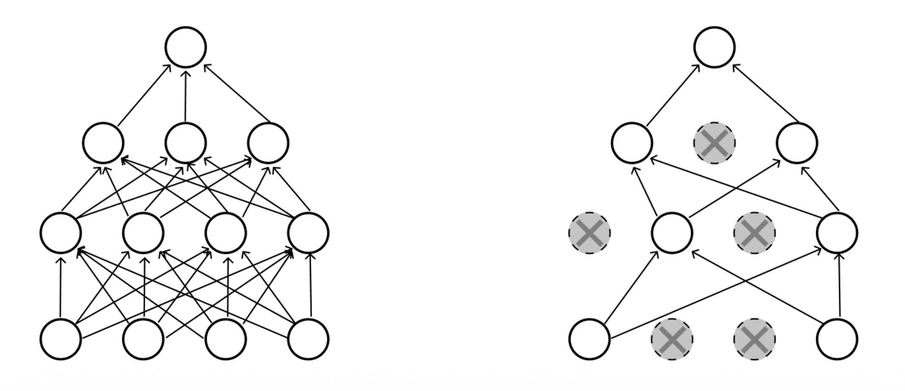
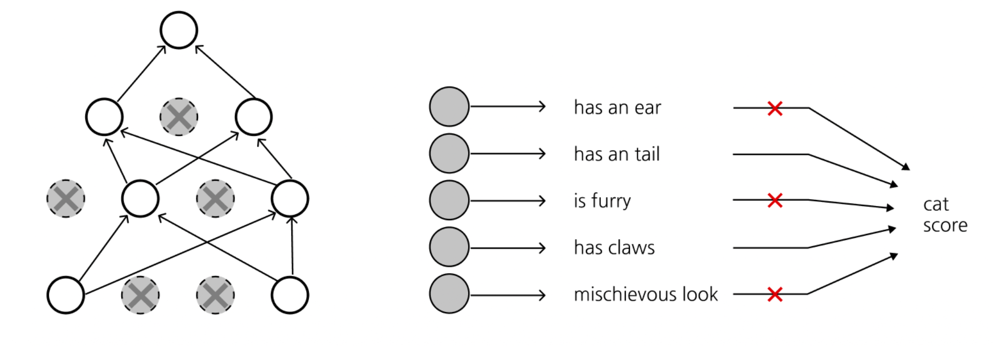

## 들어가며

지난 강의에서는 손실 함수(Loss Function)와 역전파(Backpropagation)를 다루었습니다. 이번 강의에서는 본격적으로 **신경망(Neural Network)** 의 구조로 들어갑니다.

선형 분류기에서 출발하여, 비선형성을 통해 표현력이 폭발적으로 증가하는 다층 신경망(MLP)을 살펴보고, 이미지에 특화된 **합성곱 신경망(CNN)** 의 구성 요소를 하나씩 분해해 보겠습니다. 이어서 깊은 신경망을 안정적으로 학습시키기 위한 세 가지 핵심 도구인 **가중치 초기화(Weight Initialization)**, **정규화 계층(Normalization)**, **정규화 기법(Regularization)** 을 차례로 정리합니다.

이 강의의 전체 목차는 다음과 같습니다.

* Neural networks
* Convolutional neural network
* Pooling layer
* Activation
* Weight initialization
* Normalization
* Regularization

---

# 1. 신경망 (Neural Networks)

## 1.1 선형 분류기에서 2층 신경망으로

기존의 선형 점수 함수(linear score function)는 다음과 같이 단순한 형태였습니다.

$$
f = Wx
$$

이는 입력 $x$에 가중치 행렬 $W$를 한 번 곱하는 것으로, 클래스마다 **하나의 템플릿(template)** 만을 학습하는 것과 같습니다. 예를 들어 CIFAR-10에서 '말(horse)' 클래스의 템플릿을 시각화하면 머리가 양쪽에 달린 듯한 형상이 나오는데, 이는 왼쪽을 보는 말과 오른쪽을 보는 말을 하나의 템플릿으로 평균 내려 했기 때문입니다. 즉, 선형 모델은 클래스 내부의 다양성(intra-class variation)을 포착하지 못합니다.

이를 해결하기 위해 **2층 신경망(2-layer Neural Network)** 을 도입합니다.

$$
f = W_2 \max(0, W_1 x)
$$

여기서 핵심은 다음과 같습니다.

* $W_1 x$ 는 입력을 **중간 표현(intermediate templates)** $h$로 변환합니다.
* $\max(0, \cdot)$ 는 **ReLU 비선형성**으로, 음수를 0으로 만듭니다.
* $W_2$ 는 이 중간 템플릿들의 **선형 결합(linear combination)** 을 통해 최종 점수를 만듭니다.

이렇게 하면 '왼쪽 보는 말 템플릿'과 '오른쪽 보는 말 템플릿'을 각각 따로 학습한 뒤, 둘 중 하나라도 활성화되면 '말'로 분류할 수 있게 됩니다. 즉, 신경망은 **중간 템플릿들의 선형 결합**으로 이해할 수 있습니다.


## 1.2 다층 퍼셉트론 (Multi-layer Perceptron, MLP)

같은 원리를 반복하면 **여러 층을 쌓아(go many layers deep)** 더 깊은 네트워크를 만들 수 있습니다.

* (이전) 선형: $f = Wx$
* (2층) $f = W_2 \max(0, W_1 x)$
* (3층) $f = W_3 \max(0, W_2 \max(0, W_1 x))$

각 층은 (선형 변환 → 비선형성)의 조합이며, 이 패턴을 깊게 쌓은 것이 MLP입니다.

## 1.3 비선형성의 역할 (Non-linearities)

여기서 자연스러운 질문이 생깁니다. **비선형성이 없다면 MLP는 어떻게 될까요?**

만약 $\max(0, \cdot)$ 같은 비선형 활성화를 제거하면, 예를 들어 3층 네트워크는

$$
f = W_3 (W_2 (W_1 x)) = (W_3 W_2 W_1) x = W' x
$$

가 되어 버립니다. 즉, 여러 선형 변환의 합성은 **다시 하나의 선형 변환**일 뿐이며, 아무리 층을 깊게 쌓아도 표현력은 단일 선형 모델과 동일합니다. **비선형성은 네트워크에 깊이의 의미를 부여하는 필수 요소**인 것입니다.

대표적인 활성화 함수들은 다음과 같습니다.

* **Sigmoid**: $\sigma(x) = \dfrac{1}{1+e^{-x}}$ — 출력 범위 $(0,1)$
* **tanh**: $\tanh(x)$ — 출력 범위 $(-1,1)$, 0 중심
* **ReLU**: $\max(0, x)$ — 가장 널리 쓰이는 기본 선택지
* **Leaky ReLU**: $\max(0.1x, x)$ — 음수 영역의 기울기 소실 완화
* **Maxout**: $\max(w_1^\top x + b_1, \; w_2^\top x + b_2)$
* **ELU**: $x \ (x \geq 0)$, $\alpha(e^x - 1)\ (x < 0)$


## 1.4 보편 근사 정리 (Universal Approximation Theorem)

신경망의 표현력을 이론적으로 뒷받침하는 것이 **보편 근사 정리**입니다.

### 1.4.1 정리의 진술

> **Theorem (Cybenko, 1989).** $\Omega \subset \mathbb{R}^n$ 을 컴팩트 집합이라 하고, $\sigma$ 를 원소별(element-wise) 시그모이드 함수라 하자. 그러면 임의의 $\epsilon > 0$ 과 임의의 연속 함수 $f : \mathbb{R}^n \to \mathbb{R}$ 에 대하여, 어떤 $m \in \mathbb{N}$, $W_1 \in \mathbb{R}^{m\times n}$, $b_1 \in \mathbb{R}^m$, $W_2 \in \mathbb{R}^{1\times m}$ 와 2층 신경망 함수
> $$ g(x) = W_2\, \sigma(W_1 x + b_1) $$
> 가 존재하여 $|f(x) - g(x)| < \epsilon, \ \forall x \in \Omega$ 를 만족한다.

즉, **은닉층 하나만 있어도(2층 신경망) 충분히 많은 뉴런 $m$ 을 쓰면 임의의 연속 함수를 원하는 정밀도로 근사**할 수 있다는 강력한 결과입니다. 자세한 증명은 Cybenko의 "Approximation by Superpositions of a Sigmoidal Function"을 참고하시기 바랍니다.

### 1.4.2 직관적 이해 ① — 가중치와 편향의 역할

1차원 시그모이드 $\sigma(wx + b)$ 를 생각해 봅시다.

* **가중치 $w$ 는 기울기(slope)를 조절합니다.** $w$ 가 커질수록 시그모이드는 점점 가파른 계단 함수에 가까워집니다 ($w = 1$ vs $w = 10$ 비교).
* **편향 $b$ 는 함수를 좌우로 이동(shift)시킵니다.** $b$ 를 음수로 키우면 계단이 오른쪽으로 밀립니다 ($b = 0$ vs $b = -20$).


### 1.4.3 직관적 이해 ② — 범프 함수(Bump Function) 만들기

위치가 다른 두 개의 가파른 시그모이드(예: $b=0$ 과 $b=-20$)를 **빼면(subtract)**, 특정 구간에서만 1에 가까운 값을 갖는 **범프 함수(bump function)** 가 만들어집니다.

* 가중치를 조절하면 범프의 **높이(scale)** 를,
* 편향을 조절하면 범프의 **위치(shift)** 를 자유롭게 설정할 수 있습니다.


### 1.4.4 직관적 이해 ③ — 범프의 선형 결합으로 임의 함수 근사

이러한 범프 함수들의 집합은 **연속 함수 공간의 기저(basis)** 역할을 합니다. 폭이 충분히 좁은 범프들을 적절한 높이로 여러 개 더하면, 마치 리만 합(Riemann sum)처럼 임의의 연속 함수를 계단 모양으로 근사할 수 있습니다. 따라서 **이 기저들로 표현 가능한 2층 신경망이 주어진 연속 함수를 근사할 수 있다**는 결론에 도달합니다.


> **주의:** 보편 근사 정리는 *존재성(existence)* 만을 보장합니다. 필요한 뉴런 수 $m$ 이 비현실적으로 클 수 있고, 그러한 가중치를 경사하강법으로 *찾을 수 있는지(learnability)* 는 별개의 문제입니다. 실무에서 깊은 네트워크를 선호하는 이유이기도 합니다.

---

# 2. 합성곱 신경망 (Convolutional Neural Network)

## 2.1 완전 연결 계층 (Fully Connected Layer)의 한계

지금까지의 MLP는 입력 이미지를 하나의 긴 벡터로 펼쳐서 처리했습니다. 예를 들어 $32 \times 32 \times 3$ 이미지를 $3072 \times 1$ 벡터로 **펼친(stretch)** 뒤, $10 \times 3072$ 가중치 행렬을 곱해 10차원 활성화를 얻습니다. 이때 출력의 각 숫자는 가중치 행렬의 한 행과 입력 전체의 내적(3072차원 내적)입니다.

이 방식의 문제는 두 가지입니다.

* **공간 구조 파괴:** 펼치는 순간 이미지의 2차원 공간 정보(인접 픽셀 관계)가 사라집니다.
* **파라미터 폭증:** 모든 입력과 모든 출력이 연결되어 가중치가 매우 많습니다.

CNN은 **가중치 공유(weight sharing)** 를 통해 파라미터를 획기적으로 줄이면서 공간 구조를 보존합니다.


## 2.2 합성곱 계층 (Convolution Layer)

합성곱 계층은 **입력의 공간 구조를 보존(preserves the spatial structures)** 합니다.

핵심 동작은 다음과 같습니다.

* $32 \times 32 \times 3$ 이미지에 대해, **필터(filter)** $w$ 는 $5 \times 5 \times 3$ 크기를 가집니다. 필터의 깊이(3)는 항상 입력의 깊이와 일치해야 합니다.
* 필터를 이미지 위에서 **공간적으로 슬라이드(slide over spatially)** 하면서 각 위치에서 점곱(dot product)을 계산합니다.
* 한 위치에서의 출력은 단 하나의 숫자입니다:
  $$ w^\top x + b $$
  이는 필터와 이미지의 $5 \times 5 \times 3 = 75$ 차원 패치 사이의 내적에 편향을 더한 값입니다.

필터를 모든 공간 위치에 대해 슬라이드하면, $32 \times 32$ 입력으로부터 $28 \times 28$ 크기의 **활성화 맵(activation map)** 이 하나 생성됩니다.


여러 개의 필터를 사용하면 각 필터마다 별도의 활성화 맵이 생깁니다. 예를 들어 **6개의 $5 \times 5$ 필터**를 쓰면 6개의 활성화 맵이 만들어지고, 이를 깊이 방향으로 쌓아 $28 \times 28 \times 6$ 의 "새 이미지"를 얻습니다. 즉, **출력 볼륨의 깊이는 필터의 개수와 같습니다.**

CNN은 이 (CONV → ReLU) 블록을 반복적으로 쌓아 깊은 표현을 학습합니다. 예를 들어 $32\times32\times3 \to 28\times28\times6 \to 24\times24\times10 \to \cdots$ 와 같이 진행됩니다.


## 2.3 합성곱 계층의 하이퍼파라미터

합성곱 계층의 출력 크기를 결정하는 세 가지 하이퍼파라미터가 있습니다.

* **필터 개수(number of filters):** 출력 볼륨의 깊이를 결정합니다. (필터 개수 = 활성화 맵 개수)
* **스트라이드(stride):** 필터를 한 번에 몇 픽셀씩 이동시킬지 결정합니다. stride=1이면 1픽셀씩, stride=2이면 2픽셀씩 건너뛰며, 클수록 공간적으로 더 작은 출력이 나옵니다.
* **제로 패딩(zero-padding):** 입력 가장자리를 0으로 둘러쌉니다. 출력의 공간 크기를 제어할 수 있다는 장점이 있습니다.


### 출력 크기 공식

입력 공간 크기 $W$, 필터 크기 $F$, 패딩 $P$, 스트라이드 $S$ 가 주어졌을 때, 출력의 공간 크기는 다음과 같습니다.

$$
\text{output size} = \frac{W - F + 2P}{S} + 1
$$

## 2.4 예제 1: 출력 활성화 크기 (Output Activation Size)

> **문제:** 입력 볼륨 $32 \times 32 \times 3$, $5\times5$ 필터 10개, stride 1, pad 2일 때 출력 볼륨의 크기는?

공식에 대입하면:

$$
\frac{32 + 2\cdot 2 - 5}{1} + 1 = \frac{31}{1} + 1 = 32
$$

따라서 공간 크기는 $32 \times 32$ 이고, 필터가 10개이므로 출력 깊이는 10입니다. 즉, 출력 볼륨은 $\boxed{32 \times 32 \times 10}$ 입니다.


## 2.5 예제 2: 파라미터 개수 (Number of Parameters)

> **문제:** 같은 설정(입력 $32\times32\times3$, $5\times5$ 필터 10개, stride 1, pad 2)에서 이 계층의 파라미터 개수는?

한 필터당 파라미터는 다음과 같습니다.

$$
\underbrace{5 \times 5 \times 3}_{\text{가중치}} + \underbrace{1}_{\text{편향}} = 76
$$

필터가 10개이므로 전체 파라미터는:

$$
76 \times 10 = \boxed{760}
$$

> 여기서 핵심은 **가중치 공유** 입니다. 동일한 필터가 모든 공간 위치에서 재사용되므로, FC 계층이라면 수백만 개가 필요했을 파라미터가 760개로 줄어듭니다.


---

# 3. 풀링 계층 (Pooling Layer)

풀링 계층의 목적은 다음과 같습니다.

* **표현을 더 작고 다루기 쉽게(smaller and more manageable)** 만듭니다 — 다운샘플링.
* **각 활성화 맵에 독립적으로(operates over each activation map independently)** 적용됩니다. 즉, 깊이(채널) 방향으로는 섞지 않고 공간 차원만 줄입니다.

예를 들어 $224 \times 224 \times 64$ 입력에 풀링을 적용하면 채널 수 64는 그대로 유지한 채 공간 크기만 $112 \times 112 \times 64$ 로 절반이 됩니다.


## 3.1 Max Pooling / Average Pooling

가장 흔한 방식은 **Max Pooling** 입니다. 예를 들어 $2\times2$ 필터, stride 2로 max pooling을 하면, 겹치지 않는 $2\times2$ 영역마다 최댓값 하나만 남깁니다.

* **Max pooling:** 각 영역의 최댓값 선택 (가장 강하게 반응한 특징 보존)
* **Average pooling:** 각 영역의 평균값 사용

![Figure: 4×4 단일 깊이 슬라이스에 2×2 max pooling(stride 2)을 적용하는 예시. 왼쪽 위 [[1,1],[5,6]] 영역에서 최댓값 6을, 다른 세 영역에서 각각 8, 3, 4를 골라 2×2 출력 [[6,8],[3,4]]를 만든다. 각 영역에서 가장 큰 활성화만 남겨 위치 변화에 다소 강건한 다운샘플링을 수행함을 보여준다.](./images/max_pooling.png)

---

# 4. 활성화 함수 (Activation)

대표적인 두 활성화 함수와 그 미분을 다시 살펴봅니다.

* **로지스틱(Logistic / Sigmoid):** $g_\text{logistic} = \dfrac{1}{1 + e^{-z}}$
* **하이퍼볼릭 탄젠트(tanh):** $g_\text{tanh} = \dfrac{e^z - e^{-z}}{e^z + e^{-z}}$

두 함수 모두 입력이 크거나 작아지면 출력이 평평해지는 **포화(saturation)** 특성을 가집니다. 포화 영역에서는 미분값이 0에 가까워지는데, 이것이 바로 다음 절에서 다룰 **기울기 소실(vanishing gradient)** 의 근본 원인입니다.

오른쪽 미분 그래프를 보면, 선형 함수의 미분은 항상 1로 일정한 반면, sigmoid의 미분은 최대 0.25, tanh의 미분은 최대 1이며 양 끝에서 모두 0으로 수렴합니다.


---

# 5. 가중치 초기화 (Weight Initialization)

깊은 네트워크를 학습할 때, 가중치를 어떻게 초기화하느냐는 생각보다 훨씬 중요합니다. tanh 활성화를 쓰는 10층 MLP를 예로 들어 문제를 살펴보겠습니다.

## 5.1 작은 가중치로 초기화하면? (Small Weights)

```python
W = 0.01 * np.random.randn(n_in, n_out)
```

이렇게 표준편차가 매우 작은 가중치로 초기화하면, **활성화가 0으로 붕괴(collapse to zero)** 합니다. 그 이유는 다음과 같습니다.

* **순전파(Forward):** 거의 0에 가까운 행렬을 계속 곱하므로, 층을 거칠수록 활성화의 표준편차가 0으로 수렴합니다.
* **역전파(Backward):** 마찬가지로 거의 0인 행렬을 계속 곱하므로, 상류 기울기(upstream gradient)도 0으로 붕괴합니다.
* 결과적으로 **모든 활성화와 기울기가 0이 되어 가중치가 업데이트되지 않습니다.**


## 5.2 큰 가중치로 초기화하면? (Big Weights)

그렇다면 큰 가중치로 초기화하면 될까요?

```python
W = 1.0 * np.random.randn(n_in, n_out)
```

이번에는 반대로 **활성화가 $-1$ 또는 $+1$ 로 포화(saturate)** 됩니다.

* **순전파:** 큰 가중치를 곱하므로 입력이 커지고, tanh가 이를 $\pm 1$ 로 포화시킵니다.
* **역전파:** tanh는 $\pm 1$ 근처에서 미분이 거의 0이므로, 기울기가 흐르지 않고 가중치가 업데이트되지 않습니다.

즉, 너무 작아도(0 붕괴), 너무 커도(포화) 문제가 발생합니다. 적절한 "황금 비율"을 찾아야 합니다.


## 5.3 Xavier 초기화

**Xavier 초기화(Glorot & Bengio, 2010)** 는 "각 층의 활성화 분산을 일정하게 유지한다"는 목표에서 출발합니다.

### 5.3.1 가정

* 가중치는 평균 0이며 i.i.d.로 추출됩니다.
* 편향 항은 없습니다.
* 입력 특징의 분산이 모두 동일합니다: $\mathrm{Var}(z^0_j) = \mathrm{Var}(z^0)$.
* 활성화 $f(\cdot)$ 는 0 근처에서 중심화되어 있고 선형이며 단위 기울기를 갖습니다 (tanh가 0 근처에서 그렇습니다).

### 5.3.2 순전파 분산 (Forward Variance)

$i$ 번째 층의 출력 $z^{i+1}_k$ 는 다음과 같습니다. 0 근처 선형 가정으로 $f$ 를 항등 함수처럼 근사합니다.

$$
z^{i+1}_k = f(s^i_k) = f\left( \sum_{j=1}^{n_i} W^i_{kj} z^i_j \right) \approx \sum_{j=1}^{n_i} W^i_{kj} z^i_j
$$

이제 분산을 계산합니다. 두 독립 확률변수 $X \perp Y$ 에 대한 곱의 분산 공식을 활용합니다.

$$
\mathrm{Var}(XY) = \mathbb{E}[Y]^2 \mathrm{Var}(X) + \mathbb{E}[X]^2 \mathrm{Var}(Y) + \mathrm{Var}(X)\mathrm{Var}(Y)
$$

가중치와 입력이 모두 평균 0이라는 가정($\mathbb{E}[W]=0,\ \mathbb{E}[z]=0$)에서 앞의 두 항이 사라지고, $\mathrm{Var}(W_{kj}z_j) = \mathrm{Var}(W_{kj})\mathrm{Var}(z_j)$ 만 남습니다. $n_i$ 개의 독립 항을 더하므로:

$$
\mathrm{Var}(z^{i+1}_k) \approx n_i\, \mathrm{Var}(W^i_{kj})\, \mathrm{Var}(z^i_j)
$$

층 간 활성화 분산을 동일하게 ($\mathrm{Var}(z^{i+1}) = \mathrm{Var}(z^i)$) 만들려면:

$$
\boxed{\mathrm{Var}(W^i_{kj}) = \frac{1}{n_i}}
$$

### 5.3.3 역전파 분산 (Backward Variance)

기울기 역시 층 간에 분산이 일정해야 합니다. 연쇄법칙으로 $z^i_j$ 에 대한 손실 기울기를 전개합니다. 여기서 $\partial z^{i+1}_k / \partial s^i_k \approx 1$ (0 근처 단위 기울기 가정)을 사용합니다.

$$
\frac{\partial \ell}{\partial z^i_j} = \sum_{k=1}^{n_{i+1}} \underbrace{\frac{\partial \ell}{\partial z^{i+1}_k}}_{\text{upstream}} \underbrace{\frac{\partial z^{i+1}_k}{\partial z^i_j}}_{\text{local}} \approx \sum_{k=1}^{n_{i+1}} \frac{\partial \ell}{\partial z^{i+1}_k} W^i_{kj}
$$

순전파와 동일한 분산 논리를 적용하면:

$$
\mathrm{Var}\!\left(\frac{\partial \ell}{\partial z^i_k}\right) \approx n_{i+1}\, \mathrm{Var}\!\left(\frac{\partial \ell}{\partial z^{i+1}_j}\right) \mathrm{Var}(W^i_{jk})
$$

기울기 분산을 층 간에 보존하려면:

$$
\boxed{\mathrm{Var}(W^i_{jk}) = \frac{1}{n_{i+1}}}
$$

### 5.3.4 두 조건의 절충 — 조화 평균

순전파는 $1/n_i$, 역전파는 $1/n_{i+1}$ 을 요구합니다. $n_i \neq n_{i+1}$ 이면 둘을 동시에 만족할 수 없으므로, 합리적인 절충안으로 **조화 평균(harmonic mean)** 형태를 사용합니다.

$$
\mathrm{Var}(W^i) = \frac{2}{n_i + n_{i+1}}
$$

* 일부 구현(Caffe)은 단순히 $\mathrm{Var}(W^i) = \dfrac{1}{n_i}$ 를 씁니다.
* 정규분포 $\mathcal{N}(0,1)$ 에서 샘플링한다면 $\sqrt{\dfrac{2}{n_i + n_{i+1}}}$ 를 곱합니다.
* 균등분포 $\mathrm{Uni}(-a, a)$ 에서 샘플링한다면 $a = \sqrt{\dfrac{6}{n_i + n_{i+1}}}$ 로 둡니다. (균등분포 $\mathrm{Uni}(-a,a)$ 의 분산이 $a^2/3$ 이므로, 이를 목표 분산 $2/(n_i+n_{i+1})$ 과 같게 놓으면 $a = \sqrt{6/(n_i+n_{i+1})}$ 가 됩니다.)

실제로 $W = \text{np.random.randn}(n_\text{in}, n_\text{out}) / \sqrt{n_\text{in}}$ 으로 초기화하면, 10층 tanh 네트워크에서도 활성화 분포가 층마다 잘 퍼진 종 모양을 유지합니다.


## 5.4 He 초기화

Xavier 초기화의 가정은 활성화가 0 근처에서 선형일 때 성립합니다. 그러나 $f(\cdot)$ 가 **ReLU** 인 경우 이 가정이 깨집니다.

* ReLU는 대략 **입력의 절반을 0으로 만들기(zeroes out half)** 때문에, 분산이 절반으로 줄어듭니다.
* 이를 보정하기 위해 분산을 2배로 키웁니다:
  $$ \mathrm{Var}(W^i) = \frac{2}{n_i} $$
* 자세한 내용은 He et al. (2015)를 참고하시기 바랍니다.

> 깊은 네트워크를 어떻게 초기화하는 것이 최선인지는 여전히 **활발한 연구 분야**입니다. 기울기 소실/폭발(vanishing/exploding gradients)과의 싸움은 전형적인 골칫거리이며, 상당한 시행착오를 요구합니다.

---

# 6. 정규화 계층 (Normalization)

## 6.1 배치 정규화 (Batch Normalization)의 아이디어

**배치 정규화(BatchNorm, Ioffe & Szegedy, 2015)** 의 핵심 아이디어는 **한 계층의 출력을 평균 0, 분산 1로 정규화**하는 것입니다.

* **왜 효과적인가?** 원래는 "내부 공변량 이동(internal covariate shift)" 으로 설명되었지만, 현대적 이해로는 **최적화 지형(optimization landscape)을 더 매끄럽게(smoother)** 만들기 때문으로 보고 있습니다.
* 정규화 연산은 다음과 같습니다:
  $$ \hat{x} = \frac{x - \mathbb{E}[x]}{\sqrt{\mathrm{Var}[x]}} $$
* 이 함수는 **미분 가능(differentiable)** 하므로, 네트워크 안의 연산자로 삽입하여 역전파를 통과시킬 수 있습니다.

## 6.2 배치 정규화의 수식

입력 $x \in \mathbb{R}^{N \times D}$ ($N$: 배치 크기, $D$: 데이터 차원)에 대해 다음을 계산합니다.

1. **채널별 평균** ($\mu \in \mathbb{R}^D$):
   $$ \mu_j = \frac{1}{N} \sum_{i=1}^{N} x_{i,j} $$
2. **채널별 분산** ($\sigma^2 \in \mathbb{R}^D$):
   $$ \sigma_j^2 = \frac{1}{N} \sum_{i=1}^{N} (x_{i,j} - \mu_j)^2 $$
3. **정규화** ($\hat{x} \in \mathbb{R}^{N\times D}$):
   $$ \hat{x}_{i,j} = \frac{x_{i,j} - \mu_j}{\sqrt{\sigma_j^2 + \epsilon}} $$
   ($\epsilon$ 은 0으로 나누는 것을 방지하는 작은 상수)


### 6.2.1 문제 ① — 너무 제약적이다

평균 0, 분산 1로 강제하는 것은 **지나치게 제약적(too restrictive)** 일 수 있습니다. 예를 들어 sigmoid 직전에 항상 분산 1로 만들면 비선형성을 제대로 활용하지 못할 수 있습니다.

이를 해결하기 위해 **학습 가능한 스케일 $\gamma$ 와 시프트 $\beta$** ($\gamma, \beta \in \mathbb{R}^D$)를 도입합니다.

$$
y_{i,j} = \gamma_j \hat{x}_{i,j} + \beta_j
$$

* 만약 $\gamma_j = \sigma_j$, $\beta_j = \mu_j$ 로 학습되면 정규화를 되돌려 **항등 함수(identity)를 기댓값 차원에서 복원**할 수 있습니다.
* 즉, 네트워크가 필요하다면 정규화를 "끌" 수 있는 유연성을 부여합니다.

### 6.2.2 문제 ② — 테스트 시점

$\mu, \sigma$ 의 추정치가 **미니배치에 의존**하므로, 배치 개념이 없는 **테스트 시점에는 그대로 적용할 수 없습니다.**

## 6.3 배치 정규화: 테스트 시점

해결책은 다음과 같습니다.

* **학습 중**에 평균($\tilde\mu$)과 표준편차($\tilde\sigma$)의 **이동 평균(running average)** 을 계산해 둡니다.
* **테스트 시점**에는 이 고정된 통계량을 사용합니다:
  $$ \hat{x}_{i,j} = \frac{x_{i,j} - \tilde\mu_j}{\sqrt{\tilde\sigma_j^2 + \epsilon}}, \qquad y_{i,j} = \gamma_j \hat{x}_{i,j} + \beta_j $$

이렇게 하면 테스트 시점에는 입력 하나하나에 대해 결정론적으로 동작합니다.

## 6.4 합성곱 신경망에서의 배치 정규화 (Spatial BatchNorm)

| 구분 | FC 네트워크 | Conv 네트워크 (Spatial BN / BatchNorm2D) |
|---|---|---|
| 입력 형태 | $x: N \times D$ | $x: N \times C \times H \times W$ |
| 정규화 통계 | $\mu, \sigma, \gamma, \beta : 1 \times D$ | $\mu, \sigma, \gamma, \beta : 1 \times C \times 1 \times 1$ |
| 출력 | $y = \dfrac{x-\mu}{\sigma}\gamma + \beta$ | $y = \dfrac{x-\mu}{\sigma}\gamma + \beta$ |

CNN에서는 **채널(C)마다 하나의 통계량**을 갖되, 배치($N$)와 공간 차원($H, W$) 전체에 걸쳐 평균/분산을 계산합니다.

## 6.5 배치 정규화: 위치

배치 정규화 계층은 보통 **완전 연결(FC) 또는 합성곱(Conv) 계층 직후, 비선형성 직전**에 삽입합니다.

$$
\cdots \to \text{FC} \to \text{BN} \to \tanh \to \text{FC} \to \text{BN} \to \tanh \to \cdots
$$


## 6.6 배치 정규화의 장단점

**장점(Pros)**

* 깊은 네트워크의 학습을 훨씬 쉽게 만듭니다.
* 더 높은 학습률(higher learning rate)을 허용하고, 수렴이 빨라집니다.
* 초기화에 더 강건(robust to initialization)해집니다.
* 학습 중 **정규화(regularization) 효과**도 부수적으로 가집니다.
* 테스트 시점에 추가 오버헤드가 없으며, Conv나 FC 계층에 융합(fuse)할 수 있습니다.

**단점(Cons)**

* 아직 이론적으로 완전히 이해되지 않았습니다.
* 학습과 테스트 시 동작이 다릅니다. 이는 **매우 흔한 버그의 원인**입니다.

## 6.7 다양한 정규화 계층

데이터 형태 $N \times C \times H \times W$ 에 대해, 어떤 축을 따라 통계량을 계산하느냐에 따라 정규화 종류가 나뉩니다.

* **배치 정규화 (Batch Norm):** 배치($N$), 높이($H$), 너비($W$)에 대해 정규화. 통계량 $\mu, \sigma \in \mathbb{R}^C$.


* **레이어 정규화 (Layer Norm, Ba et al. 2016):** 채널($C$), 높이($H$), 너비($W$)에 대해 정규화. 통계량 $\mu, \sigma \in \mathbb{R}^N$.
  - Transformer는 보통 BatchNorm 대신 **LayerNorm** 을 사용합니다. (단, CNN에서는 BatchNorm이 더 좋은 결과를 냅니다.)
  - 학습 시 **배치 크기와 독립적**입니다.
  - RNN, Transformer 같은 **시퀀스 모델에 적합**합니다.
  - **각 샘플을 독립적으로** 정규화합니다.


* **인스턴스 정규화 (Instance Norm, Ulyanov et al. 2017):** 높이($H$)와 너비($W$)에 대해서만 정규화. 통계량 $\mu, \sigma \in \mathbb{R}^{N\times C}$.
  - 배치 크기와 독립적입니다.
  - BatchNorm보다 **더 세밀한(finer)** 정규화입니다.
  - **스타일 변환(style transfer)** 이나 생성 모델에서 널리 쓰입니다.


* **그룹 정규화 (Group Norm, Wu & He 2018):** 채널을 여러 그룹으로 묶어 정규화. 인스턴스 정규화를 일반화한 것입니다.


## 6.8 요약: 합성곱 신경망의 구성 요소

지금까지 본 CNN의 핵심 빌딩 블록은 다음과 같습니다.

* **합성곱 계층(Convolution Layers):** 공간 구조를 보존하며 특징 추출.
* **풀링 계층(Pooling Layers):** 공간 다운샘플링.
* **완전 연결 계층(Fully-Connected Layers):** 최종 분류.
* **활성화 함수(Activation Function):** 비선형성 (예: ReLU).
* **정규화(Normalization):** $\hat{x}_{i,j} = \dfrac{x_{i,j} - \mu_j}{\sqrt{\sigma_j^2 + \varepsilon}}$.


---

# 7. 정규화 기법 (Regularization)

## 7.1 과적합 (Overfitting)

심층 신경망 학습의 주요 이슈 중 하나는 **과적합(overfitting)** 입니다. 학습 데이터에는 잘 맞지만 새로운 데이터에는 일반화하지 못하는 현상으로, 학습 정확도와 검증 정확도 사이의 **일반화 격차(generalization gap)** 로 나타납니다. 이를 줄이기 위해 다양한 **정규화 기법** 이 제안되었습니다.


## 7.2 손실에 항 추가하기 — 가중치 감쇠 (Weight Decay)

가장 전통적인 정규화 기법은 손실 함수에 가중치 크기에 대한 페널티 항 $\lambda R(W)$ 를 더하는 것입니다.

$$
L = \frac{1}{N} \sum_{i=1}^{N} \sum_{j \neq y_i} \max\bigl(0,\, f(x_i; W)_j - f(x_i; W)_{y_i} + 1\bigr) + \lambda R(W)
$$

흔히 쓰이는 정규화 항은 다음과 같습니다.

* **L2 정규화 (Weight Decay):** $R(W) = \sum_k \sum_l W_{k,l}^2$ — 가중치를 전반적으로 작게 유지
* **L1 정규화:** $R(W) = \sum_k \sum_l |W_{k,l}|$ — 희소성(sparsity) 유도
* **Elastic Net (L1 + L2):** $R(W) = \sum_k \sum_l \beta W_{k,l}^2 + |W_{k,l}|$

여기서 $\lambda$ 는 페널티의 강도를 조절하는 하이퍼파라미터입니다.

## 7.3 드롭아웃 (Dropout)

**드롭아웃(Srivastava et al., 2014)** 은 매 순전파마다 **일부 뉴런(활성화)을 무작위로 0으로 설정** 하는 기법입니다.

* 뉴런을 버릴(drop) 확률이 하이퍼파라미터이며, **0.5가 흔히 사용**됩니다.
* 매 forward pass마다 서로 다른 뉴런이 무작위로 꺼집니다.



### 7.3.1 드롭아웃 예제 코드

```python
p = 0.5  # 유닛을 활성 상태로 유지할 확률. 높을수록 드롭아웃이 약함

def train_step(X):
    """ X contains the data """
    # 3층 신경망의 순전파
    H1 = np.maximum(0, np.dot(W1, X) + b1)
    U1 = np.random.rand(*H1.shape) < p   # 첫 번째 드롭아웃 마스크
    H1 *= U1                              # drop!
    H2 = np.maximum(0, np.dot(W2, H1) + b2)
    U2 = np.random.rand(*H2.shape) < p   # 두 번째 드롭아웃 마스크
    H2 *= U2                              # drop!
    out = np.dot(W3, H2) + b3
    # 역전파 및 파라미터 업데이트 (생략)
```

### 7.3.2 해석 ① — 특징 간 공적응(co-adaptation) 방지

드롭아웃은 네트워크가 특정 소수의 특징에만 과도하게 의존하지 못하게 합니다. 예를 들어 "고양이" 점수를 계산할 때 '귀', '꼬리', '털', '발톱', '장난스러운 표정' 등 여러 단서가 있는데, 드롭아웃은 이 중 일부를 무작위로 차단합니다. 따라서 네트워크는 **남은 단서만으로도 판단할 수 있도록 중복적이고 견고한 표현을 학습**하게 됩니다.



### 7.3.3 해석 ② — 모델 앙상블

드롭아웃은 **파라미터를 공유하는 거대한 모델 앙상블(ensemble)을 학습**하는 것으로 해석할 수 있습니다. 각 forward pass마다 서로 다른 부분망(sub-network)이 샘플링되므로, $n$ 개의 뉴런이 있으면 $2^n$ 개의 가능한 부분망을 동시에 학습하는 셈입니다.


### 7.3.4 드롭아웃: 테스트 시점

테스트 시점에는 무작위성을 평균 내야 합니다. 모델을 $f$, 무작위 마스크를 $z$ 라 하면 출력은 $y = f(x, z)$ 이고, 이상적으로는 다음 적분을 계산해야 합니다.

$$
y = \mathbb{E}_z[f(x, z)] = \int p(z) f(x, z)\, dz
$$

그러나 이 적분을 해석적으로 푸는 것은 어렵습니다. 그래서 **근사** 합니다.

**단일 뉴런 예제로 직관 잡기:** 입력 $x, y$ 와 가중치 $w_1, w_2$ 를 받는 뉴런 $a$ 를 생각합니다.

* 테스트 시점(드롭아웃 없음)의 출력 기댓값:
  $$ \mathbb{E}[a] = w_1 x + w_2 y $$
* 드롭아웃 확률 0.5로 **학습 중** 의 출력 기댓값 (네 가지 마스크 경우를 평균):
  $$
  \begin{aligned}
  \mathbb{E}[a] &= \tfrac{1}{4}(w_1 x + w_2 y) + \tfrac{1}{4}(w_1 x + 0\cdot y) \\
  &\quad + \tfrac{1}{4}(0 \cdot x + w_2 y) + \tfrac{1}{4}(0 \cdot x + 0 \cdot y) \\
  &= \tfrac{1}{2}(w_1 x + w_2 y)
  \end{aligned}
  $$

즉, 학습 시 기댓값이 테스트 시 기댓값의 **절반(드롭아웃 확률 $p$ 배)** 이 됩니다.


이 불일치를 맞추기 위해, **테스트 시점에는 아무것도 버리지 않되 각 뉴런의 출력에 드롭아웃 확률 $p$ 를 곱합니다.**

* 드롭아웃 적용 시 뉴런의 기대 출력은 $p \cdot x + (1-p)\cdot 0 = px$ 입니다.
* 테스트 시 뉴런을 항상 활성화하면 출력이 $x$ 가 되므로, $x \to px$ 로 조정하여 기대 출력을 일치시킵니다.
* 이 감쇠(attenuation)는 모든 가능한 이진 마스크(지수적으로 많은 부분망)에 대한 앙상블 예측을 계산하는 과정과 관련됨이 보여질 수 있습니다.

### 7.3.5 드롭아웃 요약 (Vanilla)

```python
""" Vanilla Dropout: 권장되지 않는 구현 """
p = 0.5

def train_step(X):
    H1 = np.maximum(0, np.dot(W1, X) + b1)
    U1 = np.random.rand(*H1.shape) < p
    H1 *= U1                              # drop in forward pass
    H2 = np.maximum(0, np.dot(W2, H1) + b2)
    U2 = np.random.rand(*H2.shape) < p
    H2 *= U2                              # drop in forward pass
    out = np.dot(W3, H2) + b3

def predict(X):
    # 앙상블된 순전파
    H1 = np.maximum(0, np.dot(W1, X) + b1) * p  # scale at test time
    H2 = np.maximum(0, np.dot(W2, H1) + b2) * p # scale at test time
    out = np.dot(W3, H2) + b3
```

* **학습:** 순전파에서 마스크를 곱해 뉴런을 버립니다.
* **테스트:** 활성화에 $p$ 를 곱해 스케일을 맞춥니다.

### 7.3.6 더 흔한 방식: 역 드롭아웃 (Inverted Dropout)

테스트 시점에 스케일링을 하는 대신, **학습 시점에 미리 $1/p$ 로 나누어** 스케일을 보정하는 방식이 더 선호됩니다.

```python
p = 0.5

def train_step(X):
    H1 = np.maximum(0, np.dot(W1, X) + b1)
    U1 = (np.random.rand(*H1.shape) < p) / p  # 학습 중 drop & scale. /p 주목
    H1 *= U1
    H2 = np.maximum(0, np.dot(W2, H1) + b2)
    U2 = (np.random.rand(*H2.shape) < p) / p  # /p 주목
    H2 *= U2
    out = np.dot(W3, H2) + b3

def predict(X):
    # 스케일링 불필요 — 테스트 시점이 변하지 않음!
    H1 = np.maximum(0, np.dot(W1, X) + b1)
    H2 = np.maximum(0, np.dot(W2, H1) + b2)
    out = np.dot(W3, H2) + b3
```

* **역 버전이 선호되는 이유:** 테스트 시점의 네트워크가 변하지 않아(test time is unchanged) **추론이 훨씬 간단**해지기 때문입니다.


### 7.3.7 드롭아웃을 어디에 적용하는가

* AlexNet과 VGG는 대부분의 파라미터가 **완전 연결(FC) 계층** 에 몰려 있습니다 (특히 fc6). 따라서 드롭아웃은 주로 이 FC 계층에 적용됩니다.
* 그러나 **현대 아키텍처(ResNet, ViT)** 는 드롭아웃을 거의 또는 전혀 사용하지 않는 경향이 있습니다. (이들은 BatchNorm/LayerNorm 등 다른 정규화에 더 의존합니다.)


## 7.4 정규화의 공통 패턴

정규화 기법들에는 다음과 같은 **공통 패턴** 이 있습니다.

* **학습(Training):** 어떤 형태의 무작위성(randomness)을 추가한다.
* **테스트(Test):** 그 무작위성을 평균 내어 제거한다 (때로는 근사적으로).

이 패턴을 따르는 두 대표적 기법은 다음과 같습니다.

* **Dropout:** 학습 시 뉴런을 무작위로 끄고, 테스트 시 기댓값을 근사(스케일링)합니다.
* **BatchNorm:** 학습 시 무작위 미니배치 통계로 정규화하고, 테스트 시 고정된(이동 평균) 통계로 정규화합니다.

---

## 마치며

이번 강의에서는 신경망의 표현력을 보장하는 보편 근사 정리에서 출발하여, 공간 구조를 보존하는 CNN의 구성 요소들, 그리고 깊은 네트워크를 안정적으로 학습시키기 위한 세 가지 축(초기화 · 정규화 계층 · 정규화 기법)을 살펴보았습니다.

특히 가중치 초기화(Xavier/He)와 정규화(BatchNorm)는 모두 **"신호와 기울기의 분산을 층 사이에서 일정하게 유지한다"** 는 동일한 철학을 공유하며, Dropout과 BatchNorm은 **"학습 시 무작위성 추가 → 테스트 시 평균화"** 라는 공통 패턴으로 묶인다는 점이 핵심 통찰이었습니다.