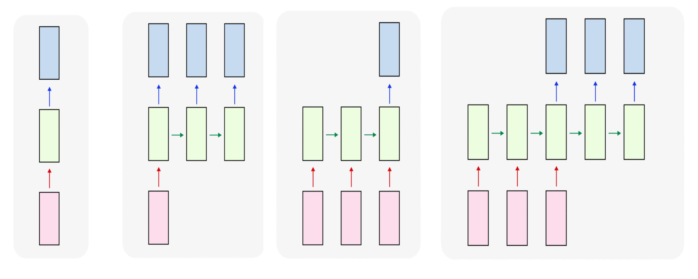
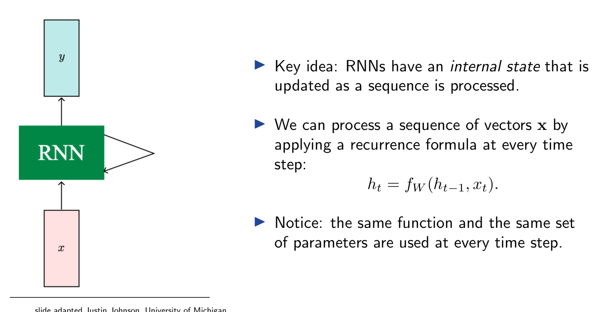
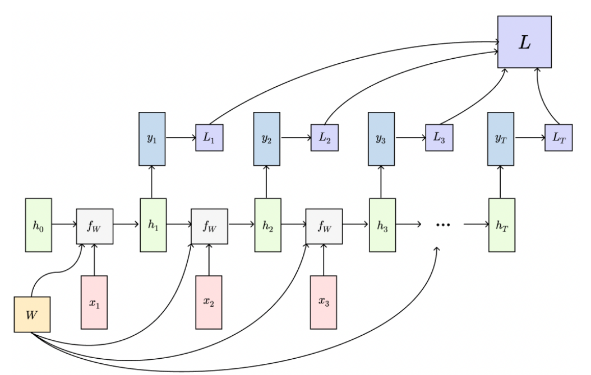
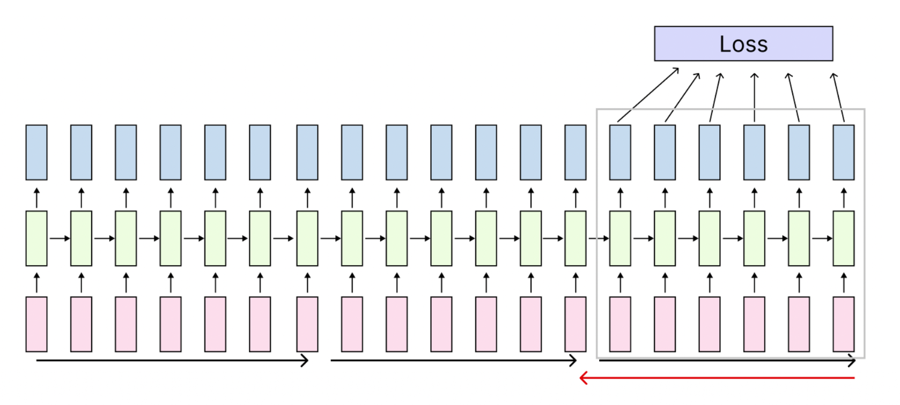
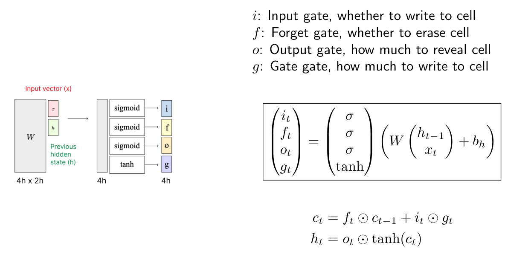
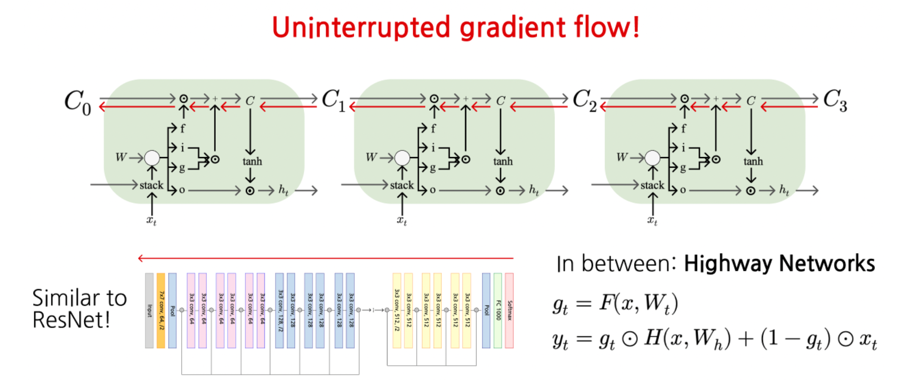
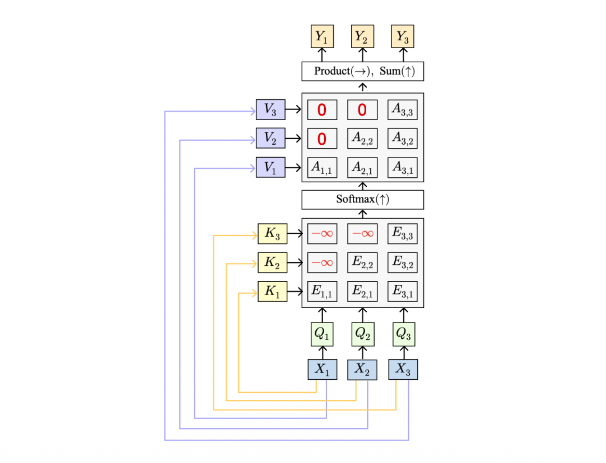

> 본 포스트는 서울대학교 컴퓨터공학부 **Hyun Oh Song** 교수님의 *Introduction to Deep Learning* (M2177.0043) 강의 자료(4강 *RNN, LSTM, Attention, Transformers*)를 바탕으로, 강의를 처음 듣는 독자도 논리적 흐름을 따라갈 수 있도록 재구성한 것입니다. 원본 슬라이드의 여러 그림은 Stanford cs231n 및 Justin Johnson(University of Michigan)의 강의 자료에서 차용된 것임이 강의 자료에 명시되어 있습니다.

## 한 줄 요약 (TL;DR)

> **"순차적 누적에서 병렬적 어텐션으로 — 각 단계의 전환은 모두 앞 구조가 부딪힌 벽에서 출발합니다."**
>
> 이 강의는 네 개의 아키텍처를 나열하는 것이 아니라, 하나의 실패가 다음 설계를 부르는 사슬로 읽어야 합니다. 고정된 입력·출력만 다루던 피드포워드 신경망의 한계에서 출발해 봅시다. **RNN**은 내부 상태와 가중치 공유로 가변 길이 시퀀스를 다루지만, 역전파할 때마다 $W^\top$ 가 거듭 곱해져 그래디언트가 지수적으로 폭발하거나 소실됩니다. 폭발은 클리핑으로 막을 수 있어도 소실은 아키텍처를 바꿔야만 하고, 그 답이 **LSTM**입니다. 셀 상태 $c_t$ 를 따로 두고 게이트로 덧셈적 갱신을 하면 그래디언트가 방해받지 않고 흐릅니다. 하지만 Seq2Seq에서는 입력 전체를 하나의 벡터 $h_T$ 에 밀어 넣는 **병목**이 남고, 이를 푸는 것이 **어텐션**입니다. 어텐션은 모든 위치가 서로 직접 상호작용하게 하지만 그 대가로 순서 감각을 잃어(순열 등변성) 위치 인코딩이 필요해집니다. 마지막으로 순환을 완전히 걷어내고 Self-Attention · Layer Norm · MLP · 잔차 연결만 남긴 블록이 **Transformer**이며, 이 구조가 병렬화 가능해진 덕분에 GPT-3 규모의 스케일업과 그 위의 디코딩 전략 · RLHF까지 이어집니다.

## 1. 순환 신경망 (RNN)

### 1.1 왜 시퀀스 처리가 필요한가

기존의 **피드포워드 신경망(Feedforward Neural Network)**은 본질적으로 **하나의 입력을 받아 하나의 출력을 내는(one-to-one)** 구조입니다.

* 예: 이미지 분류 (Image → label)

하지만 현실의 많은 문제는 입력 혹은 출력의 길이가 가변적인 시퀀스입니다. RNN은 입력과 출력의 개수에 따라 다음과 같은 다양한 처리 방식을 포괄합니다.

* **One to many**: 이미지 캡셔닝 (Image → 단어 시퀀스)
* **Many to one**: 비디오 분류 (이미지 시퀀스 → label)
* **Many to many**: 기계 번역 (단어 시퀀스 → 단어 시퀀스)
* **Many to many (per-frame)**: 프레임별 비디오 분류 (이미지 시퀀스 → label 시퀀스)



### 1.2 RNN의 핵심 아이디어

RNN의 핵심은 **시퀀스가 처리되는 동안 갱신되는 내부 상태(internal state)**를 갖는다는 점입니다. 벡터 시퀀스 $x$를 처리할 때, 매 시점(time step)마다 동일한 **순환식(recurrence formula)**을 적용합니다.

$$
h_t = f_W(h_{t-1}, x_t)
$$

여기서 중요한 점은 **모든 시점에서 동일한 함수 $f_W$와 동일한 파라미터 집합 $W$가 사용된다**는 것입니다. 이 가중치 공유(weight sharing) 덕분에 RNN은 임의 길이의 시퀀스를 고정된 수의 파라미터로 처리할 수 있습니다.



### 1.3 Vanilla RNN (Elman RNN)

가장 기본적인 RNN은 상태가 단일 은닉 벡터 $h$ 하나로 구성됩니다. 이를 **Vanilla RNN** 또는 Jeffrey Elman 교수의 이름을 따 **Elman RNN**이라 부릅니다.

$$
\begin{aligned}
h_t &= \tanh\!\left(W_{hh}\, h_{t-1} + W_{xh}\, x_t + b_h\right) \\
y_t &= W_{hy}\, h_t + b_y
\end{aligned}
$$

각 항의 의미를 살펴보겠습니다.

* $W_{hh}$: 이전 은닉 상태 $h_{t-1}$를 현재 상태로 전달하는 **순환 가중치(hidden-to-hidden)**
* $W_{xh}$: 현재 입력 $x_t$를 은닉 공간으로 사상하는 **입력 가중치(input-to-hidden)**
* $W_{hy}$: 은닉 상태로부터 출력을 만드는 **출력 가중치(hidden-to-output)**
* $\tanh$: 비선형 활성화 함수로, 상태 값을 $[-1, 1]$로 제한하여 안정적인 갱신을 돕습니다.

### 1.4 RNN 계산 그래프 (Computation Graph)

RNN을 시간축으로 펼치면(unroll) 하나의 큰 계산 그래프가 됩니다. 이때 **동일한 가중치 행렬 $W$가 모든 시점에서 재사용**된다는 점이 핵심입니다.

* **Many to many**: 각 시점 $t$마다 출력 $y_t$와 손실 $L_t$를 계산하고, 이를 모두 합쳐 전체 손실 $L = \sum_t L_t$를 구성합니다.
* **Many to one**: 마지막 은닉 상태 $h_T$로부터 단일 출력 $y$를 생성합니다.
* **One to many**: 단일 입력 $x$를 받아 매 시점 출력 $y_t$를 생성합니다.




#### Seq2Seq = Many-to-one + One-to-many

기계 번역과 같은 **시퀀스-투-시퀀스(Seq2Seq)** 구조는 두 단계의 결합으로 볼 수 있습니다.

* **인코더 (Many to one)**: 입력 시퀀스를 하나의 벡터로 압축합니다.
* **디코더 (One to many)**: 압축된 벡터로부터 출력 시퀀스를 생성합니다.

이때 인코더와 디코더는 서로 다른 가중치($W_1$, $W_2$)를 사용합니다.

### 1.5 예시: 언어 모델링 (Language Modeling)

문자 단위 언어 모델링을 통해 RNN의 동작을 구체적으로 살펴보겠습니다. 문자 $c_1, c_2, \ldots, c_{t-1}$가 주어졌을 때 다음 문자 $c_t$를 예측하는 과제입니다.

* **학습 시퀀스**: "hello"
* **어휘(Vocabulary)**: [h, e, l, o]

각 문자를 **원-핫 벡터(one-hot vector)**로 인코딩하여 입력합니다. 그러면 모델은 "h"가 주어지면 "e"를, "he"가 주어지면 "l"을, "hel"이 주어지면 "l"을, "hell"이 주어지면 "o"를 예측하도록 학습됩니다. 각 시점에서 출력층(output layer)의 점수가 가장 높은 문자가 타깃이 되도록 학습이 진행됩니다.

![Figure: "hello"를 학습하는 문자 단위 RNN의 펼쳐진 도식입니다. 맨 아래 입력층은 각 문자의 원-핫 벡터(예: "h" → [1,0,0,0])이며, 중간 은닉층은 $W_{hh}$로 연결되어 상태를 전달하고, 맨 위 출력층의 점수가 다음 문자(target chars: e, l, l, o)를 예측합니다. 굵게 표시된 숫자가 각 시점에서 정답 문자에 해당하는 점수로, 학습 목표가 이 값을 키우는 것임을 나타냅니다.](./images/rnn_forward_path_train.png)

#### 테스트 시점의 생성과 임베딩 층

* **테스트 시점(test-time)**에는 한 번에 한 문자씩 샘플링하고, 그 결과를 다시 모델의 입력으로 되먹임(feed back)하여 새로운 텍스트를 생성합니다.
* 입력을 원-핫 벡터로 인코딩하면, **가중치 행렬과의 곱은 단지 가중치 행렬에서 하나의 열(column)을 추출하는 연산**과 같습니다.

$$
\begin{bmatrix} w_{11} & w_{12} & w_{13} & w_{14} \\ w_{21} & w_{22} & w_{23} & w_{24} \\ w_{31} & w_{32} & w_{33} & w_{34} \end{bmatrix}
\begin{bmatrix} 1 \\ 0 \\ 0 \\ 0 \end{bmatrix}
=
\begin{bmatrix} w_{11} \\ w_{21} \\ w_{31} \end{bmatrix}
$$

* 이 점에 착안하여, 비효율적인 행렬곱 대신 별도의 **임베딩 층(embedding layer)**을 두어 해당 열을 직접 조회(lookup)하는 방식이 널리 쓰입니다.


### 1.6 시간 역전파 (BPTT)와 절단 역전파 (TBPTT)

#### BPTT (Backpropagation Through Time)

RNN의 학습은 **시간 역전파(BPTT)**로 이루어집니다.

* **순전파(forward)**: 시퀀스 전체를 통과시켜 손실을 계산합니다.
* **역전파(backward)**: 시퀀스 전체를 거슬러 그래디언트를 계산합니다.
* **문제점**: 긴 시퀀스에서는 **매우 많은 메모리**가 필요합니다. 모든 중간 상태를 저장해 두어야 하기 때문입니다.


#### TBPTT (Truncated BPTT)

이 메모리 문제를 완화하기 위해 **절단 시간 역전파(TBPTT)**를 사용합니다.

* 시퀀스 전체가 아니라 **작은 청크(chunk) 단위**로 순전파와 역전파를 수행합니다.
* **은닉 상태는 시간축을 따라 계속 앞으로 전달(carry forward)**하지만, 역전파는 일정한 스텝 수만큼만 수행합니다.
* 두 번째 청크의 순전파/역전파는 첫 번째 청크의 **마지막 은닉 상태**와 두 번째 청크 내부의 계산만으로 처리할 수 있습니다.
* 진행 순서: forward chunk 1 → backward chunk 1 → forward chunk 2 → backward chunk 2 → ⋯
* **BPTT와의 차이**: BPTT에서는 청크 1의 역전파가 청크 2로부터 오는 상류 그래디언트(upstream gradient)를 고려하지만, TBPTT에서는 **청크 1의 역전파가 청크 2의 상류 그래디언트를 무시**합니다.



### 1.7 RNN의 응용 예시

학습된 문자 단위 RNN은 다양한 텍스트를 생성할 수 있습니다.

* **셰익스피어 소네트** 학습: 학습 초기에는 의미 없는 문자열을 뱉지만, 학습이 진행될수록("train more") 점점 문법적이고 그럴듯한 영어 문장을 생성하게 됩니다.
* **C 코드 생성**: 리눅스 커널 소스로 학습하면 들여쓰기, 중괄호, 주석(`/* ... */`), 함수 호출 등 코드의 구조적 패턴까지 흉내 냅니다.

#### 이미지 캡셔닝 (Image Captioning)

RNN을 CNN과 결합하면 이미지를 입력받아 설명 문장을 생성할 수 있습니다.

* CNN으로 이미지에서 특징 벡터 $v$를 추출합니다.
* 기존 순환식에 이미지 특징 항 $W_{ih} v$를 추가합니다.

$$
\underbrace{h_t = \tanh\!\left(W_{hh} h_{t-1} + W_{xh} x_t + b_h\right)}_{\text{Before}}
\;\;\longrightarrow\;\;
\underbrace{h_t = \tanh\!\left(W_{hh} h_{t-1} + W_{xh} x_t + W_{ih} v + b_h\right)}_{\text{Now}}
$$

* `<START>` 토큰으로 시작하여 단어를 하나씩 샘플링하고, `<END>` 토큰이 나오면 생성을 종료합니다.


* **성공 사례**: "A cat sitting on a suitcase on the floor", "A dog is running in the grass with a frisbee" 등 정확한 캡션을 생성합니다.
* **실패 사례**: 거미줄을 보고 "A bird is perched on a tree branch"라고 오인하는 등, 학습 데이터의 편향이나 시각적 유사성 때문에 잘못된 캡션을 생성하기도 합니다.

## 2. LSTM (Long Short Term Memory)

### 2.1 Vanilla RNN의 그래디언트 흐름 문제

Vanilla RNN을 깊이 있게 학습하기 어려운 근본 원인은 **그래디언트 흐름(gradient flow)**에 있습니다.

먼저 순환식을 행렬 결합 형태로 다시 써 보겠습니다.

$$
\begin{aligned}
h_t &= \tanh\!\left(W_{hh} h_{t-1} + W_{xh} x_t + b_h\right) \\
&= \tanh\!\left( \begin{pmatrix} W_{hh} & W_{hx} \end{pmatrix} \begin{pmatrix} h_{t-1} \\ x_t \end{pmatrix} + b_h \right) \\
&= \tanh\!\left( W \begin{pmatrix} h_{t-1} \\ x_t \end{pmatrix} + b_h \right)
\end{aligned}
$$

여기서 핵심은 **$h_t$에서 $h_{t-1}$로 역전파할 때마다 $W$(정확히는 $W_{hh}^{\top}$)가 곱해진다**는 사실입니다.


따라서 $h_0$에 대한 그래디언트를 계산하려면 **$W$가 여러 번 반복적으로 곱해지고, $\tanh$의 미분도 반복적으로 곱해집니다.** $T$ 시점을 거슬러 올라가면 대략 $W$가 $T$번 곱해지는 셈이므로, $W$의 **최대 특이값(largest singular value)**에 따라 다음 두 가지 병리적 현상이 발생합니다.

* **최대 특이값 $> 1$ → 그래디언트 폭발(exploding gradients)**: 그래디언트의 크기가 지수적으로 커집니다.
  * **해결책 — 그래디언트 클리핑(Gradient clipping)**: 그래디언트의 노름이 너무 크면 스케일을 줄여줍니다.

```python
grad_norm = np.sum(grad * grad)
if grad_norm > threshold:
    grad *= (threshold / grad_norm)
```

* **최대 특이값 $< 1$ → 그래디언트 소실(vanishing gradients)**: 그래디언트가 지수적으로 작아져 장기 의존성을 학습하지 못합니다.
  * 클리핑으로는 해결할 수 없으며, **아키텍처 자체를 바꾸어야(change architecture)** 합니다. 이것이 바로 LSTM의 등장 동기입니다.

> 이 문제는 Bengio et al. (1994)와 Pascanu et al. (2013)에서 이론적으로 분석되었습니다.

### 2.2 LSTM의 구조

LSTM은 매 시점마다 **두 개의 벡터**를 유지합니다.

* **셀 상태(Cell state)** $c_t \in \mathbb{R}^H$: 장기 기억을 담당하는 "고속도로"
* **은닉 상태(Hidden state)** $h_t \in \mathbb{R}^H$: 외부로 노출되는 출력

그리고 매 시점마다 **네 개의 게이트(gate)**를 계산합니다.

$$
\begin{pmatrix} i_t \\ f_t \\ o_t \\ g_t \end{pmatrix}
=
\begin{pmatrix} \sigma \\ \sigma \\ \sigma \\ \tanh \end{pmatrix}
\left( W \begin{pmatrix} h_{t-1} \\ x_t \end{pmatrix} + b_h \right)
$$

$$
\begin{aligned}
c_t &= f_t \odot c_{t-1} + i_t \odot g_t \\
h_t &= o_t \odot \tanh(c_t)
\end{aligned}
$$

여기서 $\odot$는 원소별 곱(element-wise product)입니다. 각 게이트의 역할은 다음과 같습니다.

* **입력 게이트(Input gate) $i_t$** ($\sigma$): 셀에 **쓸지(write)** 여부를 결정합니다.
* **망각 게이트(Forget gate) $f_t$** ($\sigma$): 셀을 **지울지(erase)** 여부를 결정합니다.
* **출력 게이트(Output gate) $o_t$** ($\sigma$): 셀을 **얼마나 드러낼지(reveal)** 결정합니다.
* **게이트 게이트(Gate gate) $g_t$** ($\tanh$): 셀에 **얼마나 쓸지(how much to write)**, 즉 후보 값을 결정합니다.

세 게이트($i, f, o$)는 시그모이드를 거쳐 $[0,1]$의 "문 열림 정도"가 되고, $g$만 $\tanh$를 거쳐 $[-1,1]$의 후보 정보가 됩니다.



### 2.3 LSTM의 그래디언트 흐름: 핵심 직관

LSTM이 장기 의존성 문제를 해결하는 비결은 셀 상태의 갱신식 $c_t = f_t \odot c_{t-1} + i_t \odot g_t$에 있습니다.

* $c_t$에서 $c_{t-1}$로 역전파할 때 **오직 망각 게이트 $f$와의 원소별 곱(element-wise multiplication)만 필요**합니다.
* Vanilla RNN과 달리 **가중치 행렬 $W$와의 행렬곱이 없습니다.**

따라서 셀 상태를 따라 흐르는 그래디언트는 매 시점 동일한 $W$가 반복적으로 곱해지는 일이 없어, **방해받지 않는 그래디언트 흐름(Uninterrupted gradient flow!)**이 보장됩니다.

* 이는 **ResNet의 잔차 연결(residual connection)**과 매우 유사한 구조적 원리입니다. 셀 상태가 일종의 항등 경로(identity path) 역할을 합니다.
* 그 중간 형태로 **Highway Networks**가 있는데, 게이트로 변환과 우회를 혼합합니다.

$$
\begin{aligned}
g_t &= F(x, W_t) \\
y_t &= g_t \odot H(x, W_h) + (1 - g_t) \odot x_t
\end{aligned}
$$



### 2.4 다층 RNN (Multilayer RNNs)

성능을 높이기 위해 RNN을 **여러 층으로 쌓을(stack)** 수 있습니다. $l$번째 층의 갱신식은 다음과 같이 일반화됩니다.

$$
h_t^{l} = \tanh\!\left( W \begin{pmatrix} h_{t-1}^{l} \\ h_t^{l-1} \end{pmatrix} + b_h^{l} \right)
$$


LSTM의 경우도 동일하게 층 인덱스 $l$을 붙여 확장합니다.

$$
\begin{pmatrix} i_t^{l} \\ f_t^{l} \\ o_t^{l} \\ g_t^{l} \end{pmatrix}
=
\begin{pmatrix} \sigma \\ \sigma \\ \sigma \\ \tanh \end{pmatrix}
\left( W \begin{pmatrix} h_{t-1}^{l} \\ h_t^{l-1} \end{pmatrix} + b_h^{l} \right),
\quad
\begin{aligned}
c_t^{l} &= f_t^{l} \odot c_{t-1}^{l} + i_t^{l} \odot g_t^{l} \\
h_t^{l} &= o_t^{l} \odot \tanh(c_t^{l})
\end{aligned}
$$

핵심은 **한 RNN 층의 은닉 상태 $h_t^{l-1}$가 다음 층의 입력으로 전달**된다는 것입니다. 2-layer, 3-layer RNN 등으로 깊이를 늘릴 수 있습니다.

### 2.5 LSTM 관련 추가 주제

#### Neural Architecture Search (NAS)

* LSTM 셀 구조를 사람이 설계하는 대신, **강화학습으로 셀 구조 자체를 탐색**할 수 있습니다 (Zoph and Le, ICLR 2017).
* 학습된 아키텍처(Learned architecture)는 LSTM보다 훨씬 복잡하고 비직관적인 연산 그래프를 갖습니다.


#### 해석 가능한 은닉 유닛 (Interpretable hidden units)

* LSTM은 원리적으로 메모리 셀을 활용해 **장기 정보**를 기억하고 텍스트의 다양한 속성을 추적할 수 있습니다.
* Karpathy, Johnson, Fei-Fei (ICLR Workshop 2016)는 'Linux Kernel'과 'War and Peace' 데이터로 학습한 LSTM에서 $\tanh(c_t)$의 활성화를 시각화하여, 사람이 해석 가능한 셀들을 발견했습니다.
  * **줄 길이 추적 셀(line length tracking cell)**: 한 줄에서의 위치에 따라 활성화가 변합니다.
  * **if 문 셀(if statement cell)**: 조건문 내부에서 켜집니다.
  * **인용/주석 셀(quote/comment cell)**: 따옴표나 주석 안에서 켜집니다.
  * **코드 깊이 셀(code depth cell)**: 들여쓰기 깊이에 반응합니다.

## 3. 어텐션 (Attention)

### 3.1 Seq2Seq의 병목(Bottleneck) 문제

RNN 기반 인코더-디코더 구조를 다시 보겠습니다.

* **인코더(Encoder)**: 입력 시퀀스 $x_1, \ldots, x_T$를 읽으며 은닉 상태를 갱신합니다.
$$
h_t = f(x_t, h_{t-1})
$$
  최종 은닉 상태가 전체 입력을 요약하는 **단일 문맥 벡터(context vector)**가 됩니다.
$$
c = h_T
$$
* **디코더(Decoder)**: 이 문맥 벡터로부터 출력 시퀀스를 생성합니다.
$$
s_t = g(y_{t-1}, s_{t-1}, c)
$$

여기서 근본적인 **문제**가 발생합니다.

* 전체 입력 시퀀스가 **단 하나의 고정 크기 벡터 $c$로 압축**되어야 합니다.
* **긴 시퀀스** → 정보 병목(information bottleneck)이 생깁니다.
* 디코더가 **초기 토큰들에 직접 접근할 수 없습니다.**

**어텐션의 아이디어**는 단순하면서도 강력합니다. 단일 문맥 벡터에 의존하는 대신, **디코더가 모든 인코더 상태를 되돌아볼(look back) 수 있게** 하자는 것입니다.

### 3.2 Self-Attention 층

이제 어텐션을 입력 시퀀스 내부에 적용한 **Self-Attention(자기 어텐션)** 층을 정의하겠습니다.

#### 입력

* **입력 벡터** $X$ (형태: $N_X \times D_X$)
* **키 행렬** $W_K$ (형태: $D_X \times D_Q$)
* **값 행렬** $W_V$ (형태: $D_X \times D_V$)
* **쿼리 행렬** $W_Q$ (형태: $D_X \times D_Q$)

#### 계산 과정

각 입력 벡터로부터 쿼리(Query)·키(Key)·값(Value)을 만들어냅니다.

$$
\begin{aligned}
Q &= X W_Q && (\text{형태: } N_X \times D_Q) \\
K &= X W_K && (\text{형태: } N_X \times D_Q) \\
V &= X W_V && (\text{형태: } N_X \times D_V)
\end{aligned}
$$

다음으로 쿼리와 키의 내적으로 **유사도(similarity)**를 계산합니다.

$$
E = \frac{Q K^{\top}}{\sqrt{D_Q}} \qquad (\text{형태: } N_X \times N_X)
$$

* 여기서 $\sqrt{D_Q}$로 나누는 **스케일링(scaling)**은 매우 중요합니다. $D_Q$가 클수록 내적 값의 분산이 커져 소프트맥스가 극단적으로 뾰족해지고 그래디언트가 소실되기 때문에, 차원의 제곱근으로 나누어 분산을 안정화합니다.

그 다음 각 행(쿼리)에 대해 소프트맥스를 적용하여 **어텐션 가중치(attention weights)**를 얻습니다.

$$
A = \mathrm{softmax}(E, \, \dim = 1) \qquad (\text{형태: } N_X \times N_X)
$$

마지막으로 가중치로 값 벡터를 가중합하여 **출력 벡터**를 만듭니다.

$$
Y = A V \qquad (\text{형태: } N_X \times D_V)
$$

> 핵심 요약: **하나의 입력 벡터당 하나의 쿼리(One query per one input vector)**가 생성되며, 각 출력은 모든 입력의 값을 어텐션 가중치로 가중합한 결과입니다.


### 3.3 순열 등변성 (Permutation Equivariance)

Self-Attention의 중요한 성질은 **입력 벡터의 순서를 바꾸면 어떻게 되는가**를 통해 드러납니다.

* **LSTM이나 Vanilla RNN**: 입력 벡터를 치환(permute)하면 출력 벡터가 크게 달라집니다. (순차적으로 상태를 누적하기 때문)
* **Self-Attention 층**: 입력을 치환하면,
  * 쿼리와 키는 **동일하되 순서만 치환**됩니다.
  * 유사도 $E$도 **동일하되 치환**됩니다.
  * 어텐션 가중치 $A$도 **동일하되 치환**됩니다.
  * 값 $V$도 **동일하되 치환**됩니다.
  * 따라서 출력도 **동일하되 치환**됩니다.

결론적으로 **Self-Attention 층은 순열 등변성(permutation equivariant)**을 가지며, 본질적으로 **벡터의 집합(set)** 위에서 동작합니다.


### 3.4 위치 인코딩 (Positional Encoding)

순열 등변성은 양날의 검입니다. Self-Attention은 **처리하는 벡터들의 순서를 전혀 알지 못합니다.** 하지만 언어처럼 순서가 의미를 좌우하는 데이터에서는 위치 정보가 필수적입니다.

* 처리를 **위치 인식(position-aware)**하게 만들기 위해, 입력에 **위치 인코딩(positional encoding)**을 결합(concatenate)합니다.
* 위치 인코딩 함수 $E$는 **학습되는 룩업 테이블(learned lookup table)**일 수도 있고, **고정된 함수(fixed function)**(예: 사인/코사인)일 수도 있습니다.


### 3.5 마스크드 Self-Attention (Masked Self-Attention)

* **언어 모델링(다음 단어 예측)**에서는 각 위치가 **미래의 단어를 미리 보면(look ahead)** 안 됩니다.
* 이를 위해 미래 위치에 해당하는 유사도 $E_{i,j}$를 $-\infty$로 설정합니다. 그러면 소프트맥스를 거친 어텐션 가중치가 $0$이 되어 미래 정보가 차단됩니다.



### 3.6 멀티헤드 Self-Attention (Multihead Self-Attention)

* 단일 어텐션 대신 **$H$개의 독립적인 어텐션 헤드(Attention Heads)를 병렬로** 사용합니다.
* 입력을 $H$개로 분할(Split)하여 각 헤드가 독립적으로 어텐션을 수행한 뒤, 결과를 다시 연결(Concat)합니다.
* 각 헤드가 서로 다른 종류의 관계(문법적, 의미적 등)에 주목할 수 있어 표현력이 풍부해집니다.


## 4. 트랜스포머 (Transformer)

### 4.1 시퀀스를 처리하는 세 가지 방법

Transformer를 이해하기 전에, 시퀀스를 처리하는 세 가지 접근법을 비교해 보겠습니다.

* **순환 신경망 (RNN)** — 1D 정렬된 시퀀스에서 동작
  * (+) 이론적으로 긴 시퀀스에 강함: 길이 $N$에 대해 $O(N)$ 연산·메모리
  * (−) **병렬화 불가**: 은닉 상태를 순차적으로 계산해야 함
* **1D 합성곱 (1D Convolution)** — 다차원 격자에서 동작
  * (+) **병렬 가능**: 출력을 병렬로 계산 가능
  * (−) 긴 시퀀스에 약함: 전체 시퀀스를 보려면 많은 conv 층을 쌓아야 함
* **Self-Attention** — 벡터의 집합에서 동작
  * (+) 긴 시퀀스에 탁월: **각 출력이 모든 입력에 직접 의존**
  * (+) **고도로 병렬화 가능**: 각 출력을 병렬로 계산
  * (−) 비용이 큼: 길이 $N$에 대해 $O(N^2)$ 연산, $O(N)$ 메모리

Self-Attention은 RNN의 장기 의존성 강점과 CNN의 병렬성을 동시에 취하는 대신, 시퀀스 길이의 제곱에 비례하는 연산 비용을 지불합니다. 이 통찰이 바로 **"Attention is all you need"** (Vaswani et al., NeurIPS 2017)의 핵심입니다.


### 4.2 층 정규화 (Layer Normalization)

Transformer 블록을 정의하기에 앞서 **층 정규화**를 복습합니다. 벡터 $h_1, \ldots, h_N \in \mathbb{R}^D$, 스케일 $\gamma \in \mathbb{R}^D$, 시프트 $\beta \in \mathbb{R}^D$가 주어졌을 때:

$$
\mu_i = \frac{\sum_{j=1}^{D} h_{i,j}}{D} \in \mathbb{R}
$$

$$
\sigma_i = \left( \frac{\sum_{j=1}^{D} (h_{i,j} - \mu_i)^2}{D} \right)^{\frac{1}{2}} \in \mathbb{R}
$$

$$
z_i = (h_i - \mu_i) / \sigma_i \in \mathbb{R}^D
$$

$$
\text{출력: } y_i = \gamma z_i + \beta \in \mathbb{R}^D
$$

* $\mu_i$, $\sigma_i$는 **각 벡터(토큰) 내부의 특징 차원에 대해** 계산됩니다. 즉 배치 정규화와 달리 배치 크기에 의존하지 않아 시퀀스 모델에 적합합니다.
* $\gamma$, $\beta$는 학습 가능한 파라미터로, 정규화 후의 스케일과 위치를 복원할 자유도를 줍니다.

### 4.3 Transformer 블록

**Transformer 블록**은 벡터 집합 $x$를 입력받아 벡터 집합 $y$를 출력합니다. 구성 요소는 다음과 같습니다.

1. **Self-Attention**: 모든 벡터가 서로 상호작용
2. **잔차 연결(Residual connection)** + **Layer Normalization**
3. **MLP**: 각 벡터에 대해 독립적으로 적용
4. **잔차 연결** + **Layer Normalization**

핵심 특징을 정리하면 다음과 같습니다.

* **벡터들 사이의 유일한 상호작용은 Self-Attention뿐입니다.**
* **Layer norm과 MLP는 각 벡터마다 독립적으로 동작합니다.**
* 따라서 **고도로 확장 가능(scalable)하고 병렬화 가능(parallelizable)**합니다.

**Transformer는 이러한 Transformer 블록을 여러 개 이어 붙인 시퀀스(sequence of transformer blocks)**입니다. 원논문(Vaswani et al.)의 설정은 다음과 같습니다.

* **블록 수**: 12개
* $D_Q = 512$ (쿼리 벡터의 차원)
* $H = 6$ (어텐션 헤드의 수)


### 4.4 전이 학습 (Transfer Learning)

Transformer의 진정한 위력은 전이 학습에서 발휘됩니다.

* **사전학습(Pretraining)**: 인터넷에서 방대한 텍스트를 수집하여, 거대한 Transformer를 **언어 모델링** 과제로 학습시킵니다.
* **미세조정(Fine-tuning)**: 사전학습된 Transformer를 자신의 NLP 과제에 맞게 추가로 학습시킵니다.

### 4.5 현대적 변형 (Tweaking Transformers)

원래의 Transformer 아키텍처는 놀라울 정도로 안정적으로 유지되어 왔지만, 현대 대규모 모델에서는 다음 변형들이 표준이 되었습니다.

* **Pre-Norm**
* **RMSNorm**
* **SwiGLU**
* **Mixture of Experts (MoE)**

이러한 변경들은 주로 **학습 안정성, 최적화 효율, 파라미터 효율, 스케일링 거동**을 개선합니다. 대부분의 현대 LLM은 여전히 Transformer 백본을 사용하되, 정규화·MLP 설계·희소 전문가 라우팅을 개선한 형태입니다.

#### Pre-Norm Transformer

* **기존 (Post-Norm) 블록**:
  `x → Self-Attention → + → LayerNorm → MLP → + → LayerNorm`
* **Pre-Norm 블록**:
  `x → LayerNorm → Self-Attention → + → LayerNorm → MLP → +`

잔차 형태로 비교하면 차이가 명확합니다.

$$
\text{Post-Norm: } y = \mathrm{LN}\big(x + F(x)\big)
\qquad
\text{Pre-Norm: } y = x + F\big(\mathrm{LN}(x)\big)
$$

* **왜 Pre-Norm을 쓰는가?**
  * 정규화를 **잔차 분기(residual branch) 내부로** 이동시킵니다.
  * 최적화와 깊은 모델 학습을 더 안정적으로 만듭니다.
* **직관**: Pre-Norm은 잔차 연결을 통해 **더 깨끗한 항등 경로(identity path)**를 보존합니다. Post-Norm에서는 잔차 합 이후에 정규화가 끼어들어 항등 경로가 매 블록마다 변형되지만, Pre-Norm에서는 $x$가 변형 없이 끝까지 더해집니다.

#### RMSNorm

* **동기**: LayerNorm은 평균을 빼고(mean-subtraction) 표준편차로 다시 스케일합니다. **RMSNorm은 평균 빼기 단계를 제거하고, 오직 평균제곱근(root-mean-square)으로만 재스케일**합니다.
* 더 단순하며, 실무에서 종종 약간 더 안정적이고 효율적입니다.

정의: $x \in \mathbb{R}^D$에 대해

$$
\mathrm{RMS}(x) = \sqrt{\frac{1}{D} \sum_{i=1}^{D} x_i^2 + \epsilon},
\qquad
y_i = \frac{x_i}{\mathrm{RMS}(x)} \, \gamma_i
$$

여기서 $\gamma \in \mathbb{R}^D$는 학습되는 스케일 파라미터입니다. LayerNorm과 나란히 비교하면:

$$
\text{LayerNorm: } z_i = \frac{x_i - \mu}{\sigma}, \; y_i = \gamma_i z_i + \beta_i
\qquad
\text{RMSNorm: } y_i = \frac{x_i}{\mathrm{RMS}(x)} \gamma_i
$$

* **실무 포인트**: 많은 현대 LLM은 **Pre-Norm + RMSNorm** 조합을 사용합니다.

#### SwiGLU

* **고전적 Transformer MLP**: $X \in \mathbb{R}^{N \times D}$에 대해
$$
Y = \phi(X W_1) W_2, \qquad W_1 \in \mathbb{R}^{D \times 4D}, \; W_2 \in \mathbb{R}^{4D \times D}
$$
* **SwiGLU MLP**: 곱셈적 게이트를 도입합니다.
$$
Y = \big( \mathrm{SiLU}(X W_1) \odot X W_2 \big) W_3,
\qquad W_1, W_2 \in \mathbb{R}^{D \times H}, \; W_3 \in \mathbb{R}^{H \times D}
$$

* 활성화 함수 정의: $\phi$는 relu, $\mathrm{SiLU}(x) = x\,\sigma(x)$
* **해석**: SwiGLU는 단일 변환 $\phi(X W_1)$을 게이트 형태 $\mathrm{SiLU}(X W_1) \odot X W_2$로 대체하여, 네트워크가 **특징을 곱셈적으로 변조(modulate)**할 수 있게 합니다.
* **왜 효과적인가**: 더 풍부한 게이팅 메커니즘이 종종 더 나은 최적화와 강한 표현력을 제공합니다.
* 파라미터 수를 표준 FFN과 비슷하게 유지하기 위해 보통 $H = \frac{8D}{3}$로 선택합니다.

#### Mixture of Experts (MoE)

* **아이디어**: 단일 밀집(dense) MLP를 **여러 개의 전문가(expert) MLP**로 대체합니다.
* **라우터(router)**가 각 토큰을 소수의 전문가에게만 보냅니다.
* 이로써 **연산을 비례적으로 늘리지 않으면서 파라미터 수를 극적으로 증가**시킬 수 있습니다.

$E$개의 전문가 $\{\text{Expert}_1, \ldots, \text{Expert}_E\}$가 있고 각 전문가가 MLP라고 합시다. 라우터는 점수를 계산합니다.

$$
r(x) \in \mathbb{R}^E
$$

그리고 각 토큰마다 상위 $A$개의 전문가를 선택합니다 (보통 $A \ll E$). 출력은:

$$
y = \sum_{e \in \text{Top-}A} \alpha_e \, \text{Expert}_e(x)
$$

* **왜 MoE인가?**: 파라미터는 $E$에 비례하여 늘지만, 연산은 $A$에만 비례합니다 ($A \ll E$).
* **트레이드오프**: MoE는 막대한 모델 용량을 제공하지만, **라우팅 복잡성, 부하 균형(load balancing) 문제, 분산 통신 오버헤드**를 동반합니다.

### 4.6 Transformer의 스케일업

Transformer 아키텍처는 모델 크기를 키우는 데 매우 적합하여, 다음과 같이 점점 더 거대한 모델로 발전해 왔습니다.

| 모델 | 층 수 | Width | Heads | 파라미터 | 데이터 | 학습 |
|---|---|---|---|---|---|---|
| Transformer-Base | 12 | 512 | 8 | 65M | — | 8×P100 (12시간) |
| Transformer-Large | 12 | 1024 | 16 | 213M | — | 8×P100 (3.5일) |
| BERT-Base | 12 | 768 | 12 | 110M | 13GB | — |
| BERT-Large | 24 | 1024 | 16 | 340M | 13GB | — |
| XLNet-Large | 24 | 1024 | 16 | ~340M | 126GB | 512×TPU-v3 (2.5일) |
| RoBERTa | 24 | 1024 | 16 | 355M | 160GB | 1024×V100 (1일) |
| GPT-2 | 48 | 1600 | ? | 1.5B | 40GB | — |
| Megatron-LM | 72 | 3072 | 32 | 8.3B | 174GB | 512×V100 (9일) |
| Turing-NLG | 78 | 4256 | 28 | 17B | ? | 256×V100 |
| GPT-3 | 96 | 12288 | 96 | 175B | 694GB | ? |

층 수, width, 파라미터, 데이터가 함께 증가하는 일관된 추세를 확인할 수 있습니다.

### 4.7 GPT-3

* **175B 파라미터**를 가집니다.
* **미세조정이 필요 없습니다(No fine-tuning).**
* 입력과 출력이 모두 시퀀스입니다.
* **Zero-shot / one-shot / few-shot** 과제를 수행합니다.
* GPT-3는 **자기회귀(autoregressive) 모델**로, 토큰 $t_1, \ldots, t_{i-1} \in T$가 주어졌을 때 다음 토큰 $t \in T$를 예측합니다.
$$
p(t \mid t_1, \ldots, t_{i-1})
$$

#### GPT-3 학습 (언어 모델링)

* 데이터셋의 텍스트 $[t_1, \ldots, t_n]$을 GPT-3에 입력합니다.
* 그러면 GPT-3는 $[p_2, \ldots, p_{n+1}]$을 출력합니다. 여기서 $p_i$는 $t_1, \ldots, t_{i-1}$이 주어졌을 때 $i$번째 토큰에 대한 예측 분포입니다.
$$
p_i = p(t \mid t_1, \ldots, t_{i-1})
$$
* 출력 예측 $p_2, \ldots, p_n$과 정답 토큰 $t_2, \ldots, t_n$ 사이의 **교차 엔트로피 손실(cross-entropy loss)**로 학습합니다.


### 4.8 자기회귀 모델의 텍스트 생성 (디코딩)

학습된 자기회귀 모델로부터 텍스트를 생성하는 다양한 디코딩 전략을 살펴보겠습니다.

#### 그리디 탐색 (Greedy Search)

토큰 시퀀스 $[t_1, \ldots, t_n]$과 길이 제한 $L$이 주어졌을 때:

1. `ind = n`으로 초기화합니다.
2. 인덱스를 갱신합니다: `ind ← ind + 1`.
3. **그리디 생성**: 매 시점 가장 확률이 높은 토큰을 선택합니다.
$$
t_{\text{ind}} = \arg\max_{t \in T} p(t \mid t_1, \ldots, t_{\text{ind}-1})
$$
4. EOS 토큰이 생성되거나 `ind`가 $L$에 도달할 때까지 반복합니다.

* **단점**: 매 시점 국소적으로 최선을 택하므로 **전역적으로 차선(suboptimal)인 해**에 빠질 수 있습니다. 예를 들어 첫 단어에서 확률 0.5인 "nice"를 택하면, 확률 0.4인 "dog"를 택했을 때 이어지는 0.9의 고확률 경로(예: "dog has", 결합확률 $0.4 \times 0.9 = 0.36$)를 놓칠 수 있습니다.


#### 빔 탐색 (Beam Search)

* **아이디어**: 매 시점 모든 후보 시퀀스를 한 토큰씩 확장하고, **로그 확률이 가장 높은 상위 $B$개의 시퀀스만 유지**합니다.

접두사 $[t_1, \ldots, t_n]$, 빔 폭 $B$, 최대 길이 $L$이 주어졌을 때:

1. **초기화**: Beam $= \{([t_1, \ldots, t_n], 0)\}$ (시퀀스, 로그 확률)
2. 반복:
   * 빔의 각 시퀀스 $s$에 대해 $p(t \mid s)\;\forall t \in T$를 계산합니다.
   * 모든 후보를 확장합니다: $(s, \ell) \to (s + t, \ell + \log p(t \mid s))$
   * 확장된 시퀀스를 모두 풀(pool)에 모읍니다.
   * 로그 확률이 가장 높은 상위 $B$개를 유지합니다.
3. 모든 시퀀스가 EOS로 끝나거나 길이 $L$에 도달하면 멈춥니다.
4. 확률이 가장 높은 시퀀스를 출력합니다.

* **장점($B=2$의 예)**: 그리디 탐색보다 **더 확률이 높은 시퀀스**를 얻을 수 있습니다. 여러 경로를 동시에 추적하므로 국소 최적의 함정을 일부 피합니다.


#### Top-K 샘플링

* 결정론적 탐색은 텍스트가 단조롭고 반복적이 되기 쉽습니다. **다양성**을 위해 샘플링을 도입합니다.

정수 $K$, 토큰 시퀀스 $[t_1, \ldots, t_n]$, 길이 제한 $L$이 주어졌을 때:

1. `ind = n`으로 초기화합니다.
2. 인덱스를 갱신합니다: `ind ← ind + 1`.
3. **Top-K 토큰 찾기**: $t_{\text{ind}}$에 대해 확률 상위 $K$개의 토큰 집합 $T_{\text{top-}K}$를 찾습니다.
4. **다음 토큰 샘플링**: $T_{\text{top-}K}$ 안에서 예측 확률에 비례하여 $t_{\text{ind}}$를 샘플링합니다.
5. EOS가 나오거나 `ind`가 $L$에 도달할 때까지 반복합니다.

* **한계**: 분포가 평평할 때($K=6$ 예시에서 "The" 다음 상위 6개 합이 0.68)는 적절하지만, 분포가 뾰족할 때("The car" 다음 상위 6개 합이 0.99)는 굳이 6개를 다 고려할 필요가 없어 부적절할 수 있습니다. 즉 **고정된 $K$**가 문맥마다 적절하지 않다는 문제가 있습니다.


#### 뉴클리어스 샘플링 (Nucleus Sampling, Top-p)

* Top-K의 고정 $K$ 문제를 해결하기 위해, **누적 확률 임계값 $\eta$**를 사용해 후보 개수를 동적으로 정합니다.

임계값 $\eta$, 토큰 시퀀스 $[t_1, \ldots, t_n]$, 길이 제한 $L$이 주어졌을 때:

1. `ind = n`으로 초기화합니다.
2. 인덱스를 갱신합니다: `ind ← ind + 1`.
3. **$N$ 찾기**: 상위 $N$개 토큰의 확률 합이 $\eta$를 넘는 **가장 작은 $N \in \mathbb{N}$**을 찾습니다.
$$
p(t_{\text{ind}} \in T_{\text{top-}N} \mid t_1, \ldots, t_{\text{ind}-1}) > \eta
$$
4. **다음 토큰 샘플링**: $T_{\text{top-}N}$ 안에서 예측 확률에 비례하여 $t_{\text{ind}}$를 샘플링합니다.
5. EOS가 나오거나 `ind`가 $L$에 도달할 때까지 반복합니다.

* $\eta = 0.92$인 경우, 분포가 평평하면 자동으로 많은 토큰을 포함하고(예: "The" 다음 합 0.94), 분포가 뾰족하면 적은 토큰만 포함합니다(예: "The car" 다음 합 0.97). 이렇게 **문맥에 따라 후보 집합 크기가 적응적으로 변하는 것**이 핵심 장점입니다.


#### 생성 결과 예시

* GPT-3는 사람이 작성한 입력 텍스트(bold)에 이어 매우 자연스러운 기사 본문(italics)을 생성할 수 있습니다. 예를 들어 가상의 "United Methodists Agree to Historic Split" 기사 제목과 부제만 주어도, 연도·교단 명칭·통계 수치 등을 포함한 그럴듯한 장문의 기사를 이어 씁니다.

### 4.9 인간 피드백 기반 강화학습 (RLHF)

언어 모델을 사람의 의도에 맞게 정렬(align)시키는 핵심 기법이 **RLHF (Reinforcement Learning from Human Feedback)**입니다. 세 단계로 이루어집니다.

1. **언어 모델(LM) 사전학습**: 대규모 텍스트로 기본 언어 모델을 학습합니다.
2. **보상 모델(Reward Model) 학습**: 프롬프트에 대한 여러 출력을 사람이 순위 매긴(ranked) 데이터를 모아, $\{$샘플, 보상$\}$ 쌍으로 보상 모델 $r_\theta$를 학습합니다.
3. **강화학습 미세조정**: 학습된 보상 모델을 사용해 LM을 강화학습(예: PPO)으로 미세조정합니다.

* 강화학습 단계에서는 다음과 같은 목적을 최적화합니다.
$$
\theta \leftarrow \theta + \nabla_\theta J(\theta)
$$
* 이때 튜닝된 정책 $\pi_{\text{PPO}}$가 원래 모델 $\pi_{\text{base}}$에서 너무 멀어지지 않도록 **KL 발산 페널티**를 더합니다.
$$
-\lambda_{\text{KL}} \, D_{\text{KL}}\big( \pi_{\text{PPO}}(y \mid x) \,\|\, \pi_{\text{base}}(y \mid x) \big)
$$
  이 KL 예측 시프트 페널티는 보상 해킹(reward hacking)을 막고 언어 능력을 보존하는 역할을 합니다.
* 10B+ 파라미터 전체를 미세조정하는 것은 비싸므로, **LM의 일부 파라미터는 동결(frozen)**한 채 학습하기도 합니다.


## 정리하며 (Closing Remarks)

이번 강의의 논리 사슬을 한 장으로 요약하면 다음과 같습니다.

| 단계 | 내용 | 근거 |
|:---|:---|:---|
| **① 시퀀스의 요구** | 입력·출력의 길이가 고정되지 않는 문제(one-to-many, many-to-one, many-to-many)를 다루려면 고정 크기 신경망으로는 부족하다 | 시퀀스 유형 분류 |
| **② RNN의 해법** | 내부 상태 $h_t = f_W(h_{t-1}, x_t)$ 를 두고 **모든 시점에서 같은 $W$ 를 재사용**하면 길이와 무관한 파라미터로 시퀀스를 처리할 수 있다 | 펼친 계산 그래프의 가중치 공유 |
| **③ 학습의 비용** | BPTT는 시퀀스 전 구간을 거슬러 올라가므로 메모리가 감당되지 않는다. TBPTT는 은닉 상태만 앞으로 흘리고 역전파는 청크 안으로 제한한다 | BPTT · TBPTT 비교 |
| **④ RNN의 벽** | $h_t \to h_{t-1}$ 역전파마다 $W_{hh}^\top$ 와 $\tanh'$ 가 곱해져, 최대 특이값이 $>1$ 이면 폭발하고 $<1$ 이면 소실된다. 폭발은 클리핑으로 막지만 소실은 구조를 바꿔야 한다 | 반복 곱셈의 지수적 증폭 |
| **⑤ LSTM** | 셀 상태 $c_t = f_t \odot c_{t-1} + i_t \odot g_t$ 는 곱셈이 아닌 **덧셈적 갱신**이라 그래디언트가 게이트를 타고 방해받지 않고 흐른다. $i, f, o, g$ 네 게이트가 쓰기 · 지우기 · 드러내기 · 후보값을 나눠 맡는다 | 방해받지 않는 그래디언트 흐름 |
| **⑥ Seq2Seq의 병목** | 인코더의 마지막 은닉 상태 하나에 입력 전체를 압축하면 긴 입력에서 정보가 손실된다 | 병목(bottleneck) 문제 |
| **⑦ Self-Attention** | 쿼리와 키의 유사도로 어텐션 가중치를 만들고 값의 가중합을 내면, 모든 위치가 서로 **직접** 상호작용한다 | $Q, K, V$ 계산 과정 |
| **⑧ 순서의 상실과 회복** | Self-Attention은 순열 등변적이라 사실상 집합을 다루는 연산이다. 순서를 알려면 입력 단계에서 **위치 인코딩**을 더해야 하고, 자기회귀 생성에는 미래를 가리는 **인과 마스크**가 필요하다 | 순열 등변성 · 마스킹 |
| **⑨ Transformer 블록** | Self-Attention(벡터 간 상호작용) + MLP(벡터별 독립 변환) + Layer Norm + 잔차 연결을 한 블록으로 묶어 쌓는다. Pre-Norm · RMSNorm · SwiGLU · MoE는 그 위의 현대적 변형이다 | 블록 구성 |
| **⑩ 스케일과 정렬** | 병렬화 가능한 구조 덕분에 GPT-3 규모의 스케일업이 가능해졌고, 그 위에서 디코딩 전략(그리디 · 빔 · Top-K · 뉴클리어스)과 RLHF가 출력의 품질과 정렬을 결정한다 | GPT-3 · 디코딩 · RLHF |
