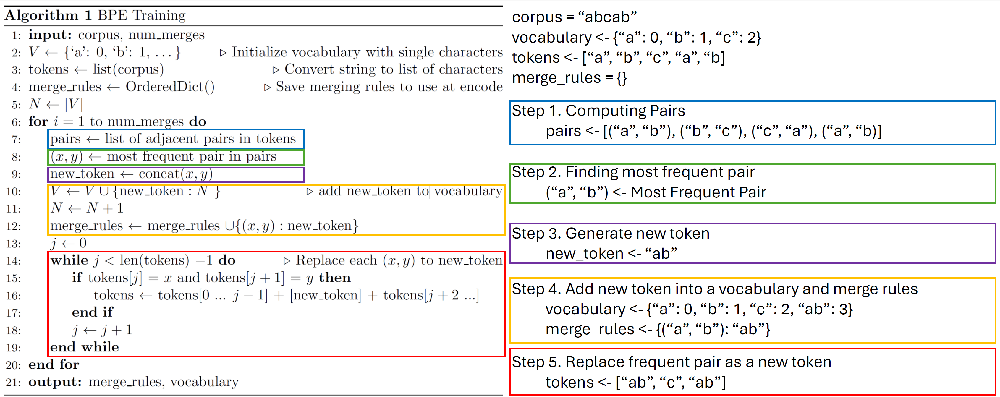
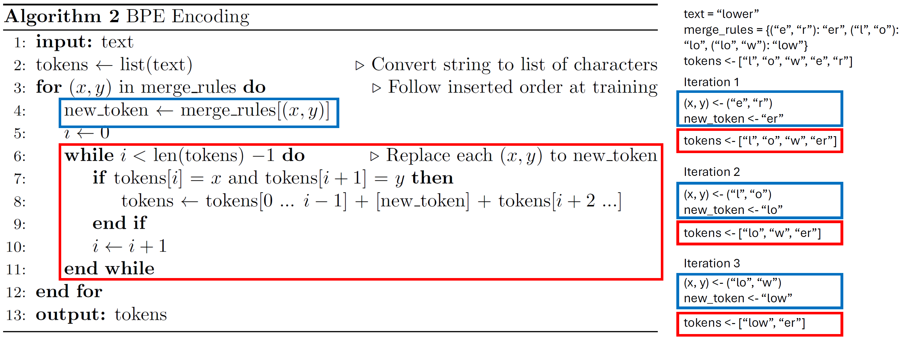
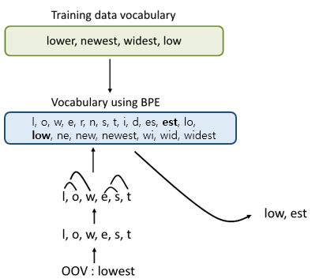
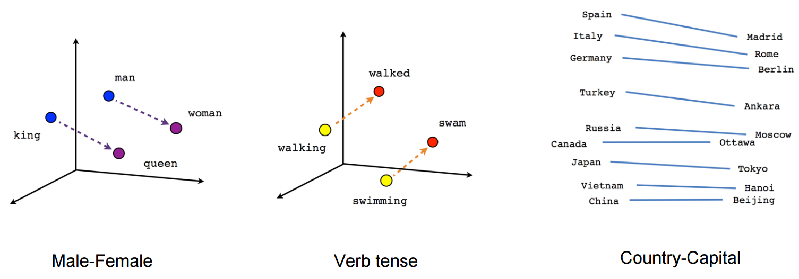

언어 모델(Language Model)에서 **토크나이저(Tokenizer)**는 가장 중요한 구성 요소 중 하나입니다. 토크나이저는 신경망이 인간의 자연어를 이해할 수 있도록 만들어 주는 다리 역할을 합니다.

이번 강의에서는 토크나이저가 무엇인지 살펴보고, 언어 모델을 위한 **완전히 작동하는 토크나이저를 직접 밑바닥부터 구현**해 보겠습니다. 전체 흐름은 다음과 같습니다.

- **언어 모델 소개 (Language Model Introduction)**
- **토큰화 (Tokenization)**
    - 단순 접근법: 코퍼스의 단어로 어휘 사전 만들기
    - 어휘 사전 밖 문제 (Out-of-Vocabulary Problem)
    - 바이트 페어 인코딩 (Byte Pair Encoding)
    - 사전 학습된 토크나이저 사용하기
- **임베딩 레이어 (Embedding Layer)**

> 본 실습은 Google Colab 또는 로컬 환경에서 진행한다고 가정합니다. Colab 사용 시 아래와 같이 드라이브를 마운트하고 작업 디렉터리를 설정합니다.
>
> ```python
> try:
>     import os
>     from google.colab import drive
>     drive.mount("/content/drive")
>     os.chdir("/content/drive/MyDrive/lec5")
> except Exception as e:
>     print(e)
> !ls
> ```

## 1. 언어 모델 소개 (Language Model Introduction)

ChatGPT와 같은 **대규모 언어 모델(Large Language Models, LLMs)**은, 본질적으로 **시퀀스에서 다음에 올 단어를 예측하도록 학습된 신경망**입니다.

예를 들어, 사용자가 다음과 같은 입력을 주었다고 합시다.

$$ \text{LLM}(\text{``<user> Hello, ChatGPT! Explain about yourself. </user>''}) = \text{``I''} $$

모델은 이 입력에 대해 다음 단어를 한 번 예측하고, **예측한 단어를 다시 입력에 이어 붙여** 그다음 단어를 예측하는 과정을 반복합니다.

$$ \rightarrow \text{LLM}(\text{``... </user> I''}) = \text{``am''} $$
$$ \rightarrow \text{LLM}(\text{``... </user> I am''}) = \text{``a''} $$
$$ \rightarrow \text{LLM}(\text{``... I am a''}) = \text{``language''} $$
$$ \rightarrow \text{LLM}(\text{``... I am a language''}) = \text{``model''} $$
$$ \vdots $$
$$ \rightarrow \text{LLM}(\text{``... trained by OpenAI''}) = \text{``.''} $$
$$ \rightarrow \text{LLM}(\text{``... trained by OpenAI.''}) = \text{``<EOS>''} $$

- 이렇게 자기 출력을 다시 입력으로 사용하는 생성 방식을 **자기회귀(autoregressive)** 생성이라고 부릅니다.
- 여기서 `<EOS>`는 **"End of Sentence(문장의 끝)"**를 나타내는 특수 토큰으로, 모델이 생성을 멈춰야 할 시점을 의미합니다.

#### 핵심 질문: 텍스트를 어떻게 신경망에 넣을 것인가?

여기서 한 가지 근본적인 문제에 부딪힙니다. 신경망은 결국 **텐서(tensor)를 입력받아 텐서를 출력하는 수학적 함수**일 뿐입니다. 즉, 신경망은 "Hello"라는 글자 그대로를 처리할 수 없습니다.

그렇다면 두 가지 질문이 생깁니다.

- 신경망이 처리할 수 있는 형태로 **텍스트를 어떻게 변환**할 것인가?
- 신경망의 출력을 어떻게 다시 **사람이 읽을 수 있는 텍스트로 되돌릴** 것인가?

이 질문에 답하는 것이 바로 **토큰화(Tokenization)**와 **임베딩(Embedding)**입니다.

## 2. 토큰화 (Tokenization)

텍스트를 신경망으로 처리하려면, **텍스트를 숫자로, 그리고 숫자를 다시 텍스트로** 변환하는 방법이 필요합니다.

이를 위해 우리는 먼저 텍스트를 **단어(word)와 같이 의미 있는 덩어리(chunk)들의 시퀀스로 분할**한 뒤, 각 덩어리마다 **고유한 정수 인덱스를 부여**합니다.

$$ \text{Tokenize}(\text{``Hello ChatGPT''}) \rightarrow [\text{`Hello'}, \text{`ChatGPT'}] \rightarrow [1, 4] $$

- 'Hello'와 같은 각 덩어리를 **토큰(token)**이라고 부릅니다.
- 텍스트를 토큰 시퀀스로 변환하는 과정을 **토큰화(tokenization)**라고 합니다.
- LLM 맥락에서는 각 정수 인덱스 자체도 토큰이라 부르며, **텍스트를 정수 인덱스 시퀀스로 변환하는 과정** 역시 토큰화라고 통칭합니다.

### 2.1. GPT 토크나이저 예시 (GPT Tokenizer Example)

실제 토크나이저가 어떻게 동작하는지 직관적으로 체험해 보고 싶다면 [tiktokenizer.vercel.app](https://tiktokenizer.vercel.app/) 사이트를 추천합니다. GPT-4o나 LLaMa 같은 인기 모델의 토큰화 과정을 인터랙티브하게 시각화해 줍니다. 여러 텍스트를 직접 입력해 보면서, 같은 문장이라도 모델마다 어떻게 다르게 쪼개지는지 관찰해 보시기 바랍니다.

### 2.2. 토크나이저 추상 클래스 (Tokenizer Abstract Class)

본격적인 구현에 앞서, 모든 토크나이저가 공유할 **추상 클래스(abstract class)**를 정의합니다. 이 설계를 따르면 어떤 토큰화 알고리즘이든 동일한 인터페이스로 사용할 수 있습니다.

핵심 멤버 변수와 메서드는 다음과 같습니다.

- **`vocab`**: 각 토큰(문자열)을 정수 인덱스로 매핑하는 딕셔너리 (어휘 사전)
- **`inverted_index`**: `vocab`의 역방향 매핑 (정수 → 토큰)
- **`train(corpus, vocab_size)`**: **코퍼스(corpus)**라 불리는 대량의 텍스트로부터 어휘 사전을 구축하는 핵심 메서드
- **`encode(text)`**: 텍스트를 토큰의 정수 인덱스 리스트로 변환
- **`decode(ids)`**: 정수 인덱스 리스트로부터 원본 텍스트를 복원

추가로, 학습된 어휘 사전을 파일로 저장(`save`)하고 다시 불러오는(`load`) 기능도 포함합니다.

```python
from abc import ABCMeta, abstractmethod
import pickle
from typing import Optional, List
import os

class Tokenizer(metaclass=ABCMeta):

    def __init__(self):
        self.vocab = {}
        self.inverted_index = {}

    @abstractmethod
    def train(self, corpus: str, vocab_size: Optional[int] = None):
        """코퍼스로부터 어휘 사전을 구축합니다."""
        raise NotImplementedError

    @abstractmethod
    def encode(self, text: str) -> List[int]:
        """텍스트를 토큰(정수) 리스트로 변환합니다."""
        raise NotImplementedError

    @abstractmethod
    def decode(self, ids: List[int]) -> str:
        """토큰 리스트를 원본 텍스트로 변환합니다."""
        raise NotImplementedError

    def save(self, prefix: str):
        path = f"{prefix}.model.pkl"
        with open(path, "wb") as f:
            pickle.dump(self.vocab, f)

    def load(self, prefix: str):
        path = f"{prefix}.model.pkl"
        if not os.path.exists(path):
            raise Exception(f"{path} not exists")
        with open(path, "rb") as f:
            vocab = pickle.load(f)
        self.vocab = vocab
        self.inverted_index = {v: k for k, v in vocab.items()}

def print_example(tokenizer: Tokenizer, text: str):
    ids: List[int] = tokenizer.encode(text)
    print("======Tokenizer example======")
    print(f'encode("{text}")\n= {ids}')
    print()
    print(f"decode({ids})\n=", [tokenizer.decode([tok]) for tok in ids])
    print("=============================")
```

- `@abstractmethod` 데코레이터는 `train`, `encode`, `decode`가 **반드시 하위 클래스에서 구현되어야 함**을 강제합니다. 추상 메서드가 구현되지 않은 채로 인스턴스를 만들려 하면 에러가 발생합니다.
- `print_example` 헬퍼 함수는 주어진 텍스트를 인코딩한 뒤, 각 토큰을 다시 디코딩해 봄으로써 토큰화 결과를 직관적으로 확인하게 해 줍니다.

### 2.3. 단순 접근법: 코퍼스의 단어로 어휘 사전 만들기 (Naïve Approach)

가장 단순하고 직관적인 접근법은 **코퍼스를 단어 단위로 쪼개고, 그 단어들을 그대로 어휘 사전으로 사용**하는 것입니다.

예를 들어 코퍼스가 다음과 같다고 합시다.

```
corpus = "Welcome to Intro to Deep Learning Class"
```

이를 공백 기준으로 분할하면 `["Welcome", "to", "Intro", "to", "Deep", "Learning", "Class"]`가 되고, 중복을 제거해 어휘 사전을 만들면 다음과 같습니다.

```python
vocab = {
    "Welcome": 0,
    "to": 1,
    "Intro": 2,
    "Deep": 3,
    "Learning": 4,
    "Class": 5,
}
```

이때 텍스트 `"Welcome to Class"`를 인코딩하면 결과는 `[0, 1, 5]`가 됩니다. 아래는 단순화를 위해 **공백만으로 분할**하는 단어 수준(word-level) 토크나이저 구현입니다.

```python
import json
from typing import List

class VocabTokenizer(Tokenizer):

    def train(self, corpus: str, vocab_size: Optional[int] = None):
        # 공백으로 분할하고 set으로 중복 제거
        words = list(set(corpus.split(" ")))
        self.vocab = {w: i for i, w in enumerate(words)}
        self.inverted_index = {i: w for w, i in self.vocab.items()}

    def encode(self, text: str) -> List[int]:
        tokens = text.split(" ")
        # 어휘 사전에 없으면 -1 반환
        ids = [self.vocab.get(w, -1) for w in tokens]
        return ids

    def decode(self, ids: List[int]) -> str:
        words = [self.inverted_index.get(i, "<Unknown>") for i in ids]
        text = " ".join(words)
        return text
```

구현의 핵심을 짚어 보겠습니다.

- **`train`**: `set(corpus.split(" "))`으로 고유 단어 집합을 만든 뒤, `enumerate`로 각 단어에 정수 인덱스를 부여합니다. `inverted_index`는 디코딩을 위한 역방향 매핑입니다.
- **`encode`**: 텍스트를 공백으로 쪼갠 후, 각 단어를 `vocab`에서 조회합니다. `dict.get(w, -1)`을 사용해 **사전에 없는 단어는 -1**로 처리합니다. (이 부분이 뒤에서 다룰 OoV 문제의 단초가 됩니다.)
- **`decode`**: 인덱스를 다시 단어로 복원하고 공백으로 이어 붙입니다. 알 수 없는 인덱스는 `<Unknown>`으로 표시합니다.

#### 실행 예시

```python
corpus = r"""<user> Hello, ChatGPT! Explain about yourself. </user> I am a language model trained by OpenAI."""
text = r"""Hello, ChatGPT!"""

tokenizer = VocabTokenizer()
tokenizer.train(corpus)

print_example(tokenizer, text)

import json
print("\nTokenizer Vocabulary:", json.dumps(tokenizer.vocab, indent=4))
```

이 코드를 실행하면 `"Hello, ChatGPT!"`가 `["Hello,", "ChatGPT!"]`로 분할되어 코퍼스 내에 존재하는 단어들의 인덱스로 인코딩됩니다. 출력되는 어휘 사전을 보면 구두점이 단어에 그대로 붙어 있음(`"Hello,"`, `"ChatGPT!"`)을 확인할 수 있는데, 이는 공백만으로 분할하는 단순 방식의 한계를 잘 보여 줍니다.

### 2.4. 어휘 사전 밖 문제 (Out-of-Vocabulary, OoV Problem)

위 접근법은 매우 단순하면서도 텍스트를 의미 있는 덩어리의 시퀀스로 표현하는 데 효과적입니다. 그러나 치명적인 약점이 있습니다. 바로 **코퍼스에 등장하지 않은 단어를 전혀 처리할 수 없다**는 점입니다.

예를 들어 앞서 만든 토크나이저로 `"Seoul National University"`를 인코딩하면, 이 단어들은 학습 코퍼스에 없으므로 모두 `-1`로 처리됩니다.

```python
# OoV 예시
print_example(tokenizer, "Seoul National University")
```

이렇게 학습 시 보지 못한 단어를 만나 처리하지 못하는 문제를 **어휘 사전 밖 문제(Out-of-Vocabulary, OoV)**라고 부릅니다. 어휘 사전을 아무리 크게 만들어도 세상의 모든 단어(신조어, 고유명사, 오타 등)를 담을 수는 없기 때문에, 이는 단어 수준 토큰화의 본질적 한계입니다.

### 2.5. 문자 수준 토큰화 (Character-Level Tokenization)

OoV 문제를 해결하는 가장 단순하고 직접적인 방법은, 텍스트를 단어가 아니라 **문자(character) 또는 바이트(byte) 단위의 시퀀스로 분할**하는 것입니다.

문자(ASCII)의 종류는 유한(256개)하므로, 어떤 텍스트가 들어와도 항상 표현이 가능합니다. 즉, **OoV 문제가 원천적으로 발생하지 않습니다.**

```python
class CharacterTokenizer(Tokenizer):

    def train(self, corpus: str = None, vocab_size: Optional[int] = None):
        # 0~255 ASCII 문자에 각각 정수 인덱스 부여
        self.vocab = {chr(i): i for i in range(256)}
        self.inverted_index = {i: w for w, i in self.vocab.items()}

    def encode(self, text: str) -> List[int]:
        tokens = list(text)  # 문자 단위로 분할
        ids = [self.vocab.get(t, -1) for t in tokens]
        return ids

    def decode(self, ids: List[int]) -> str:
        tokens = [self.inverted_index.get(i, "") for i in ids]
        text = "".join(tokens)
        return text
```

- **`train`**: 코퍼스가 필요 없습니다. 단지 `chr(i)`로 256개 ASCII 문자에 0부터 255까지 인덱스를 부여하면 끝입니다.
- **`encode`**: `list(text)`로 텍스트를 문자 단위로 쪼갠 뒤 각 문자를 조회합니다.
- **`decode`**: 인덱스를 문자로 되돌려 공백 없이(`""`) 이어 붙입니다.

```python
corpus = r"""<user> Hello, ChatGPT! Explain about yourself. </user> I am a language model trained by OpenAI."""
text = r"""Hello, ChatGPT!"""

tokenizer = CharacterTokenizer()
tokenizer.train()

print_example(tokenizer, text)
```

이제 어떤 텍스트든 문제없이 처리됩니다. 하지만 새로운 단점이 생깁니다.

- **의미 정보의 부재**: 각 토큰(문자 하나)은 그 자체로 거의 아무런 의미를 담지 못합니다. 'a', 'b', 'c'는 의미 단위가 아닙니다.
- **시퀀스 길이 폭증**: 단어 하나가 여러 개의 문자 토큰으로 쪼개지므로 시퀀스가 매우 길어지고, 이는 신경망의 **계산 비효율**로 직결됩니다.

### 2.6. 바이트 페어 인코딩 (Byte Pair Encoding, BPE)

문자 수준 토큰화는 임의의 텍스트를 처리할 수 있지만, 토큰이 의미를 담지 못하고 시퀀스가 너무 길어진다는 문제가 있었습니다. 따라서 우리는 **코퍼스 속 의미 있는 덩어리를 포착하면서도, 동시에 임의의 시퀀스를 처리할 수 있는** 알고리즘이 필요합니다.

현대 LLM의 토크나이저는 대부분 **바이트 페어 인코딩(Byte Pair Encoding, BPE)** 알고리즘을 사용합니다. BPE의 핵심 아이디어는 다음과 같습니다.

> **문자 수준 어휘 사전에서 출발하여, 코퍼스에서 가장 자주 등장하는 토큰 쌍(pair)을 반복적으로 병합(merge)하면서 어휘 사전을 상향식(bottom-up)으로 키워 나간다.**

자주 함께 등장하는 문자 쌍은 점차 하나의 토큰으로 합쳐지므로, 자연스럽게 빈도가 높은 부분 단어(subword)나 완전한 단어가 어휘에 포함됩니다.

#### 알고리즘: BPE 학습 (BPE Training)

학습 단계에서는 정해진 병합 횟수만큼 다음을 반복합니다.

1. 현재 토큰 시퀀스에서 **인접한 모든 토큰 쌍의 빈도**를 계산한다.
2. **가장 빈번한 쌍**을 선택한다.
3. 그 쌍을 하나의 **새로운 토큰**으로 병합하고, 어휘 사전과 병합 규칙(merge rule)에 추가한다.



#### 알고리즘: BPE 인코딩 (BPE Encoding)

인코딩 단계에서는, **학습 단계에서 배운 병합 규칙을 동일한 순서로 차례대로 적용**합니다. 즉, 텍스트를 일단 문자 단위로 쪼갠 뒤, 학습 때 기록해 둔 병합 규칙을 학습 순서 그대로 하나씩 적용하여 토큰을 합쳐 나갑니다.



#### 2.6.1. BPE는 OoV 단어를 어떻게 처리하는가?

이 병합 과정 덕분에 BPE는 단어를 **의미 있는 부분 단어(subword)**로 분해할 수 있고, 학습 때 보지 못한 단어라도 **이미 학습된 친숙한 구성 요소들로 토큰화**할 수 있습니다.

학습 시 한 번도 본 적 없는 단어 `"lowest"`가 들어왔다고 가정해 봅시다. 그리고 학습을 통해 아래와 같은 병합 규칙을 (순서대로) 배웠다고 합시다.

```
{("e","s"):"es", ("es","t"):"est", ("l","o"):"lo",
 ("lo","w"):"low", ("n","e"):"ne", ("ne","w"):"new",
 ("new","est"):"newest", ("w","i"):"wi", ("wi","d"):"wid",
 ("wid","est"):"widest"}
```



`"lowest"`를 토큰화하는 과정을 단계별로 따라가 보겠습니다.

- 먼저 문자 단위로 분할: `["l", "o", "w", "e", "s", "t"]`
- 이제 병합 규칙을 학습된 순서대로 적용합니다.

1. `("e","s") → "es"` : `["l", "o", "w", "es", "t"]`
2. `("es","t") → "est"` : `["l", "o", "w", "est"]`
3. `("l","o") → "lo"` : `["lo", "w", "est"]`
4. `("lo","w") → "low"` : `["low", "est"]`
5. `("n","e") → "ne"` : (적용 대상 없음) `["low", "est"]`
6. `("ne","w") → "new"` : (적용 대상 없음) `["low", "est"]`
7. 이후 규칙들도 더 이상 매칭되지 않음

결과적으로 `"lowest"`는 학습된 두 개의 어휘 내 토큰 `["low", "est"]`로 깔끔하게 토큰화됩니다. **OoV 문제를 해결하면서도, 문자 수준보다 훨씬 짧고 의미 있는 토큰열**을 얻은 것입니다.

#### 2.6.2. 헬퍼 함수 (Helper Functions)

BPE 구현을 위해 두 개의 헬퍼 함수를 먼저 만듭니다.

- **`compute_pair_frequency`**: 인접한 각 쌍의 빈도를 계산합니다.
- **`merge`**: 빈번한 쌍을 하나의 새 토큰으로 치환합니다.

```python
from collections import Counter
from typing import Tuple, List, Optional

def compute_pair_frequency(tokens: List[str]):
    """토큰 리스트에서 인접한 각 쌍의 빈도를 계산합니다."""
    n = len(tokens)
    counts = Counter()
    for i in range(n - 1):
        counts[(tokens[i], tokens[i+1])] += 1
    return counts

def merge(tokens: List[str], pair: Tuple[str, str], new_token: str):
    """
    토큰 리스트에서 연속으로 나타나는 pair를 모두 new_token으로 치환합니다.
    예: tokens=["a","b","c","a","b"], pair=("a","b"), new_token="ab" -> ["ab","c","ab"]
    """
    new_tokens = []
    i = 0
    while i < len(tokens):
        if tokens[i] == pair[0] and i < len(tokens) - 1 and tokens[i+1] == pair[1]:
            new_tokens.append(new_token)
            i += 2
        else:
            new_tokens.append(tokens[i])
            i += 1
    return new_tokens
```

- **`compute_pair_frequency`**: 길이 $n$의 토큰 리스트를 순회하며 인접한 두 원소 $(t_i, t_{i+1})$의 등장 횟수를 `Counter`에 누적합니다. 총 $n-1$개의 인접 쌍을 검사합니다.
- **`merge`**: 인덱스 `i`를 옮겨 가며, 현재 위치와 다음 위치가 정확히 `pair`와 일치하면 `new_token`으로 치환하고 **두 칸을 건너뛰며**(`i += 2`), 그렇지 않으면 한 칸씩 이동합니다(`i += 1`). 이렇게 하면 겹치는 병합 없이 좌→우 순서로 안전하게 치환됩니다.

```python
test_tokens = list("abaababb")
print(f"compute_pair_frequency({test_tokens})\n=", compute_pair_frequency(test_tokens), "\n")
print(f"merge({test_tokens}, ('a', 'b'), 'ab')\n=", merge(test_tokens, ('a', 'b'), 'ab'))
```

위 예시에서 `"abaababb"`에 대해 인접 쌍 빈도를 세면 `('a','b')`가 가장 빈번하며, 이를 `'ab'`로 병합한 결과를 확인할 수 있습니다.

#### 2.6.3. BPE 구현 (BPE Implementation)

이제 앞서 본 의사코드를 그대로 따라 BPE 토크나이저를 완성합니다.

```python
from tqdm.auto import tqdm
from collections import OrderedDict

class BPETokenizer(Tokenizer):

    def train(self, text: str, vocab_size: int = 512):
        """Byte Pair Encoding 토크나이저의 어휘 사전을 구축합니다."""
        assert vocab_size >= 256
        n_merges = vocab_size - 256  # 어휘 = 256개 바이트 + 병합된 토큰들

        # 문자 수준 토크나이저와 동일하게 초기화
        vocab = {chr(idx): idx for idx in range(256)}
        inverted_index = {v: k for k, v in vocab.items()}

        merge_rules = OrderedDict({})  # 병합 규칙 매핑: (x, y) -> z
        tokens = list(text)

        # 딕셔너리 값의 argmax를 구하는 헬퍼
        def argmax(d: dict):
            return max(d, key=d.get)

        for i in tqdm(range(n_merges)):
            freqs = compute_pair_frequency(tokens)   # (1) 인접 쌍 빈도 계산
            pair = argmax(freqs)                      # (2) 최빈 쌍 선택
            new_token = pair[0] + pair[1]             #     새 토큰 생성

            tokens = merge(tokens, pair, new_token)   # (3) 시퀀스에서 병합
            new_idx = i + 256

            merge_rules[pair] = new_token             #     병합 규칙 기록
            vocab[new_token] = new_idx
            inverted_index[new_idx] = new_token

        self.vocab = vocab
        self.inverted_index = inverted_index
        self.merge_rules = merge_rules

    def encode(self, text: str):
        """학습된 병합 규칙을 순서대로 적용하여 텍스트를 인코딩합니다."""
        tokens = list(text)
        for pair, new_token in self.merge_rules.items():
            tokens = merge(tokens, pair, new_token)
        ids = [self.vocab.get(tok, -1) for tok in tokens]
        return ids

    def decode(self, ids: List[int]):
        text = "".join(self.inverted_index[idx] for idx in ids)
        return text

    def save(self, prefix: str):
        super().save(prefix)
        path_merges = f"{prefix}.merges.pkl"
        with open(path_merges, "wb") as f:
            pickle.dump(self.merge_rules, f)

    def load(self, prefix: str):
        super().load(prefix)
        path_merges = f"{prefix}.merges.pkl"
        with open(path_merges, "rb") as f:
            merge_rules = pickle.load(f)
        self.merge_rules = merge_rules
```

구현의 요점을 정리하겠습니다.

- **`n_merges = vocab_size - 256`**: 어휘 사전의 최종 크기는 *기본 256개 바이트 토큰 + 병합으로 새로 생긴 토큰 수*입니다. 따라서 목표 어휘 크기에서 256을 뺀 만큼만 병합을 수행합니다. `assert vocab_size >= 256`은 최소한 모든 단일 바이트는 표현 가능해야 함을 보장합니다.
- **`OrderedDict` 사용 이유**: 병합 규칙은 **학습된 순서**가 매우 중요합니다. 인코딩 시 반드시 같은 순서로 규칙을 적용해야 학습과 일관된 결과가 나오기 때문에, 순서를 보존하는 `OrderedDict`에 규칙을 기록합니다.
- **`argmax(freqs)`**: `max(d, key=d.get)`는 딕셔너리에서 **값(빈도)이 가장 큰 키(쌍)**를 반환합니다.
- **`new_idx = i + 256`**: $i$번째 병합으로 생긴 토큰에는 256 이후의 인덱스를 순차적으로 부여합니다.
- **`encode`**: 학습 때 기록한 `merge_rules`를 순서대로 순회하며 `merge`를 반복 적용합니다. 이것이 바로 Figure 2의 인코딩 알고리즘을 그대로 구현한 부분입니다.
- **`save`/`load`**: BPE는 `vocab`뿐 아니라 `merge_rules`도 함께 저장/복원해야 하므로, 부모 클래스의 메서드를 `super()`로 호출한 뒤 병합 규칙 파일을 추가로 처리합니다.

#### 2.6.4. 실제 데이터셋으로 BPE 토크나이저 학습하기

이제 직접 구현한 BPE 토크나이저를 실제 데이터로 학습시켜 보겠습니다. 코퍼스로는 셰익스피어 희곡 약 40,000줄을 모은 **tiny Shakespeare** 데이터셋을 사용합니다.

```python
with open("tokenizer/input.txt") as f:
    corpus = f.read()
print("corpus example:")
print(corpus[:250])
print("corpus length:", len(corpus))
```

전체 데이터로 BPE를 학습하면 시간이 오래 걸리므로, 여기서는 **앞쪽 30,000자**만 사용하고 어휘 크기는 `256 + 1000`으로 설정합니다(즉 1,000번의 병합 수행).

```python
tokenizer = BPETokenizer()
tokenizer.train(corpus[:30000], 256 + 1000)
```

학습이 끝난 토크나이저로 예시를 확인해 봅니다.

```python
print_example(tokenizer, text)
```

`"Hello, ChatGPT!"`가 문자 수준보다 훨씬 짧은, 자주 등장하는 부분 단어 단위로 묶여 인코딩되는 것을 볼 수 있습니다.

이제 OoV 처리 능력을 검증해 봅니다. 학습 코퍼스(앞 30,000자)에 없는 단어가 어떻게 부분 단어로 쪼개지는지 확인합니다.

```python
print("This example shows subword segmentation of BPE encoding.\n")
example_word = "newest"
print(f'"{example_word}" in corpus:', example_word in corpus[:30000], "\n")
print_example(tokenizer, example_word)
```

`"newest"`가 코퍼스에 존재하지 않더라도(`False`), BPE는 이를 학습된 부분 단어들의 조합으로 토큰화하여 OoV 문제를 우아하게 해결합니다.

### 2.7. 사전 학습된 토크나이저 사용하기 (Using Pretrained Tokenizer)

실무에서는 토크나이저를 매번 직접 구현하기보다, 이미 잘 검증된 라이브러리를 사용합니다. **`sentencepiece`**는 BPE를 포함한 다양한 토큰화 알고리즘을 제공하는 오픈소스 라이브러리로, 이를 통해 유명 언어 모델의 사전 학습된 토크나이저를 손쉽게 불러올 수 있습니다.

여기서는 **LLaMa2 모델**의 사전 학습된 토크나이저를 실습용으로 불러옵니다.

```python
!pip install sentencepiece
import sentencepiece as sp

tokenizer = sp.SentencePieceProcessor(model_file="tokenizer/llama2_tokenizer.model")
```

동일한 예시를 이 사전 학습된 토크나이저로 확인해 봅니다.

```python
print_example(tokenizer, text)
print("\nThis example shows subword segmentation of BPE encoding.\n")
example_word = "newest"
print_example(tokenizer, example_word)
```

우리가 직접 구현한 BPE와 동일한 원리(부분 단어 분할)로 동작하지만, 대규모 코퍼스로 학습되어 훨씬 정교한 어휘 사전을 갖고 있음을 비교해 볼 수 있습니다.

## 3. 임베딩 레이어: 정수를 벡터로 (Embedding Layer)

지금까지 우리는 **텍스트를 정수 인덱스 시퀀스로 변환**하는 방법을 배웠습니다. 그러나 신경망은 단순한 정수 인덱스가 아니라 **실수 벡터(real-valued vector)**를 입력으로 받습니다. 이제 **정수를 벡터로 변환**하는 방법을 배워 보겠습니다.

### 3.1. 단순 접근법: 원-핫 인코딩 (One-Hot Encoding)

각 인덱스를 하나의 벡터로 바꾸는 가장 직관적인 방법은 **원-핫 벡터(one-hot vector)**를 할당하는 것입니다. 어휘 크기가 $V$일 때, 인덱스 $k$는 $k$번째 위치만 1이고 나머지는 0인 $V$차원 벡터로 표현됩니다.

```python
import torch

class OneHotEncoding():
    """원-핫 인코딩 레이어를 구현합니다."""
    def __init__(self, vocab_size: int):
        self.vocab_size = vocab_size

    def __call__(self, ids: List[int]) -> torch.Tensor:
        """
        주어진 토큰 리스트에 대한 원-핫 인코딩 텐서를 반환합니다.
        반환 shape: (len(ids), vocab_size)
        """
        n = len(ids)
        x = torch.zeros((n, self.vocab_size))
        x[list(range(n)), ids] = 1
        return x
```

- 여기서는 PyTorch를 아주 약간만 사용합니다. `torch.Tensor`는 NumPy의 `ndarray`와 유사한 다차원 배열이라고 이해하면 충분합니다.
- 핵심 연산은 `x[list(range(n)), ids] = 1`입니다. 이는 **고급 인덱싱(advanced indexing)**으로, $i$번째 행(`range(n)`)의 `ids[i]`번째 열을 1로 설정합니다. 즉 각 행마다 해당 토큰 위치에만 1을 채워 넣습니다.

```python
onehot = OneHotEncoding(8)
test_inputs = [1, 2, 3, 4, 0, 7]
print(f"One hot encoding:\nonehot({test_inputs})\n=", onehot(test_inputs))
```

각 입력 인덱스가 길이 8의 원-핫 벡터로 변환되어, 총 $6 \times 8$ 크기의 텐서가 출력됩니다.

### 3.2. 단어 임베딩: 더 나은 접근법 (Word Embeddings)

원-핫 인코딩은 직관적이지만 다음과 같은 심각한 단점이 있습니다.

1. **막대한 메모리·연산 비용**: 현대 LLM의 어휘 크기는 30k~50k 이상입니다. 이만큼의 차원을 가진 원-핫 벡터는 거의 대부분이 0인 거대한 희소 벡터라서 비현실적입니다.
2. **확장성 문제**: 새 단어를 추가할 때마다 벡터 차원이 커지므로, 신경망 전체 구조를 수정해야 합니다.
3. **의미 정보의 부재**: 원-핫 인코딩은 모든 단어를 서로 **독립적(orthogonal)**으로 취급합니다. 'king'과 'queen'처럼 의미가 비슷한 단어든, 'king'과 'apple'처럼 무관한 단어든, 두 원-핫 벡터의 내적은 항상 0입니다. 즉 **단어 간의 관계를 전혀 담지 못합니다.**

이를 해결하기 위해, 원-핫 벡터 대신 **밀집 벡터(dense vector)**를 단어에 할당합니다. 이를 **임베딩(embedding)**이라 부르며, 비슷한 의미의 단어가 비슷한 벡터로 표현되도록 만드는 것이 목표입니다. 구현상으로는 **임베딩 벡터들의 룩업 테이블(lookup table)**을 사용합니다.

#### 3.2.1. 임베딩 레이어의 구현

```python
class Embedding():
    """무작위로 초기화된 룩업 테이블을 가진 간단한 임베딩 레이어."""
    def __init__(self, vocab_size: int, embedding_dim: int):
        self.vocab_size = vocab_size
        self.embedding_dim = embedding_dim
        # 룩업 테이블을 무작위로 초기화
        self.lookup_table = torch.randn(vocab_size, embedding_dim)

    def __call__(self, ids: List[int]) -> torch.Tensor:
        """주어진 토큰 리스트에 대한 임베딩 벡터들을 룩업 테이블에서 가져옵니다."""
        ids = torch.tensor(ids, dtype=torch.long)
        return self.lookup_table[ids]
```

- `lookup_table`은 $(\text{vocab\_size} \times \text{embedding\_dim})$ 크기의 행렬로, **각 행이 하나의 토큰에 대응하는 임베딩 벡터**입니다.
- `__call__`에서 `self.lookup_table[ids]`는 인덱스 리스트에 해당하는 행들을 한 번에 꺼내 옵니다. 즉 임베딩은 **단순한 행 선택(룩업) 연산**입니다.
- 여기서는 무작위 초기화를 사용했지만, 실제 학습에서는 이 룩업 테이블이 **학습 가능한 파라미터**가 되어 데이터로부터 의미 있는 표현을 익히게 됩니다.

```python
n_vocab = 32
emb_dim = 16
emb = Embedding(n_vocab, emb_dim)
test_inputs = [0, 2, 4, 8]
print(f"Embedding layer:\nemb({test_inputs})\n=", emb(test_inputs))
```

4개의 입력 인덱스가 각각 16차원 벡터로 매핑되어 $4 \times 16$ 텐서가 출력됩니다.

#### 3.2.2. 사전 학습된 단어 임베딩 (Pretrained Word Embedding)

단어 간 의미 관계를 보존하도록 **미리 학습된 단어 임베딩 벡터**들이 존재합니다. 이러한 임베딩이 실제로 단어의 의미를 어떻게 포착하는지, **GloVe** 임베딩을 예시로 살펴보겠습니다.

#### 3.2.3. GloVe

**GloVe**는 스탠퍼드 대학교에서 개발한 단어 임베딩 기법입니다. 어휘 크기와 임베딩 차원에 따라 여러 파일이 제공되는데, 본 실습에서는 가장 작은 `glove.6B.50d.txt`(50차원)를 사용합니다. 파일의 각 줄은 *단어 + 공백으로 구분된 임베딩 벡터 값*으로 구성됩니다.

```
<word1> x1 x2 ... xn
<word2> y1 y2 ... yn
...
```

먼저 파일을 읽고 어휘 크기와 벡터 차원을 확인합니다.

```python
with open("tokenizer/glove.6B.50d.txt", "r") as f:
    data = f.read()
data = data.strip().split("\n")

N = len(data)
dim = len(data[0].split(" ")) - 1   # 첫 토큰은 단어이므로 1을 뺌
print(f"#vocab = {N}, dim = {dim}")
```

이제 파일을 파싱하여 어휘 사전과 룩업 테이블을 구축합니다.

```python
lookup_table = torch.empty((N, dim))  # 사전 학습 임베딩용 룩업 테이블
vocab = {}                            # 사전 학습 임베딩용 어휘 사전

for i in tqdm(range(N)):
    parsed = data[i].split(" ")
    word = parsed[0]                            # 단어 파싱
    v = [float(f) for f in parsed[1:]]          # 임베딩 벡터 파싱
    lookup_table[i].copy_(torch.tensor(v))      # 제자리(in-place) 복사
    vocab[word] = i
```

- 각 줄의 첫 원소는 단어, 나머지는 벡터 성분입니다.
- `lookup_table[i].copy_(...)`는 미리 할당해 둔 텐서의 $i$번째 행에 파싱된 벡터를 **제자리(in-place)로 복사**합니다.

파싱한 임베딩을 앞서 만든 임베딩 모듈에 로드할 수 있도록, 가중치 로드 기능을 추가한 하위 클래스를 정의합니다.

```python
class WordEmbedding(Embedding):
    """사전 학습된 룩업 테이블을 지원하는 임베딩 레이어."""
    def load_weights(self, weights: torch.Tensor):
        # 룩업 테이블을 사전 학습 벡터 크기에 맞게 리사이즈 후 복사
        self.lookup_table.resize_(lookup_table.size())
        self.lookup_table.copy_(lookup_table)
```

```python
emb = WordEmbedding(1, 1)
emb.load_weights(lookup_table)

example_word = 'hello'
print(f"Word vector for {example_word}: ", emb(vocab[example_word]))
```

`'hello'`라는 단어가 GloVe로 학습된 50차원 실수 벡터로 매핑되어 출력됩니다.

#### 3.2.4. 단어 임베딩 예시 (Word Embedding Example)

단어 임베딩의 가장 유명하고 직관적인 예시는 **선형 연산(linear operation)**입니다. 예를 들어 다음이 성립합니다.

$$ \text{vector(`king')} - \text{vector(`man')} + \text{vector(`woman')} \approx \text{vector(`queen')} $$

이 식의 의미를 해석해 보겠습니다.

- $\text{vector(`king')} - \text{vector(`man')}$ 은 'king'에서 **"남성(male)"이라는 개념을 제거**하는 것에 해당합니다 (대략 "왕족"이라는 개념만 남음).
- 여기에 $\text{vector(`woman')}$ 을 더하면 **"여성(female)" 개념이 주입**되어, 의미가 'queen' 쪽으로 이동합니다.



이것이 실제로 성립하는지 검증해 봅시다. 50차원 임베딩을 시각화하기 위해, scikit-learn의 차원 축소(random projection)로 2차원으로 투영합니다.

```python
from sklearn import random_projection
n_components = 2
model = random_projection.GaussianRandomProjection(n_components=n_components, random_state=0)
X_embedded = model.fit_transform(lookup_table.numpy())
```

- **가우시안 무작위 투영(Gaussian Random Projection)**은 고차원 데이터를 무작위 가우시안 행렬에 곱해 저차원으로 사영하는 기법입니다. 계산이 매우 빠르면서도, **점들 사이의 거리 구조를 근사적으로 보존**한다는 이론적 보장(Johnson–Lindenstrauss 보조정리)이 있어 시각화에 유용합니다.

2차원 평면에 점과 화살표를 그리는 헬퍼 함수들을 정의합니다.

```python
import matplotlib.pyplot as plt
import numpy as np

def get_2d_vector(word: str):
    """주어진 단어의 2D 임베딩을 가져옵니다."""
    idx = vocab[word]
    vec = X_embedded[idx]
    return vec

def draw_point(word: str, v: np.ndarray):
    """2D 평면에 단어 임베딩 점을 그립니다."""
    plt.scatter(*v)
    plt.annotate(word, v)

def draw_arrow(x1, x2):
    """두 점 사이에 화살표를 그립니다."""
    plt.quiver(*x1, *(x2 - x1), angles='xy', scale_units='xy', scale=1)
```

먼저 "king ~ queen"과 "man ~ woman" 사이의 관계를 그려 봅니다.

```python
king_vec = get_2d_vector('king'); draw_point('king', king_vec)
queen_vec = get_2d_vector('queen'); draw_point('queen', queen_vec)
man_vec = get_2d_vector('man'); draw_point('man', man_vec)
woman_vec = get_2d_vector('woman'); draw_point('woman', woman_vec)

draw_arrow(king_vec, queen_vec)
draw_arrow(man_vec, woman_vec)

plt.xlabel("Projection dim 1")
plt.ylabel("Projection dim 2")
plt.show()
```

두 화살표(king→queen, man→woman)가 서로 비슷한 방향과 크기를 가지는 것을 관찰할 수 있습니다. 이것이 바로 앞선 선형 관계의 시각적 증거입니다.

이번에는 **각 나라와 그 수도** 사이의 관계를 그려 봅니다.

```python
countries = ['korea', 'russia', 'france', 'uk', 'japan', 'china']
capitals = ['seoul', 'moscow', 'paris', 'london', 'tokyo', 'beijing']

for con, cap in zip(countries, capitals):
    con_vec = get_2d_vector(con)
    cap_vec = get_2d_vector(cap)
    draw_point(con, con_vec)
    draw_point(cap, cap_vec)
    draw_arrow(con_vec, cap_vec)

plt.xlabel("Projection dim 1")
plt.ylabel("Projection dim 2")
plt.show()
```

"나라 → 수도"를 잇는 화살표들이 대체로 비슷한 방향을 가리키는데, 이는 **"~의 수도"라는 관계 역시 임베딩 공간에서 일관된 방향 벡터로 표현**됨을 보여 줍니다.

이 성질을 이용해, `'russia'`에 `(london - uk)`라는 "수도 방향 벡터"를 더하면 어느 수도에 가까워지는지 확인해 봅니다.

```python
plt.figure(figsize=(7, 4))
dv = get_2d_vector('london') - get_2d_vector('uk')
russia_vec = get_2d_vector('russia')

for cap in capitals:
    cap_vec = get_2d_vector(cap)
    draw_point(cap, cap_vec)

draw_point('russia', russia_vec)
draw_arrow(russia_vec, russia_vec + dv)
draw_point("russia + (london - uk)", russia_vec + dv)

cir = plt.Circle(russia_vec + dv, 2.0, fill=False)
ax = plt.gca()
ax.add_patch(cir)

plt.xticks(list(range(-10, 6, 2)))
plt.yticks(list(range(-4, 6, 2)))
plt.xlim(-10, 4); plt.ylim(-4, 4)
plt.xlabel("Projection dim 1"); plt.ylabel("Projection dim 2")
plt.show()
```

`russia + (london - uk)` 위치에 원을 그려 보면, 그 근처에 `'moscow'`(러시아의 수도)가 위치함을 확인할 수 있습니다. 즉 임베딩이 "국가–수도" 관계를 산술 연산으로 포착하고 있음을 보여 줍니다.

#### 코사인 유사도로 검증하기

마지막으로, 시각화가 아닌 **원래 50차원 공간**에서 `king - man + woman` 벡터와 다른 단어들의 유사도를 정량적으로 계산해 봅니다.

```python
def get_embedding(word: str):
    """주어진 단어의 (원본 차원) 임베딩을 반환합니다."""
    idx = vocab[word]
    vec = lookup_table[idx]
    return vec

king = get_embedding('king')
man = get_embedding('man')
woman = get_embedding('woman')
v = king - man + woman
```

유사도 척도로는 **코사인 유사도(cosine similarity)**를 사용합니다. 두 벡터 $x, y$에 대해 다음과 같이 정의됩니다.

$$ \text{sim}(x, y) = \frac{x^{\top} y}{\lVert x \rVert \, \lVert y \rVert} $$

- 분자 $x^{\top}y$는 두 벡터의 내적이고, 분모는 각 벡터의 $L_2$ 노름의 곱입니다.
- 이는 곧 **두 벡터가 이루는 각도의 코사인 값**으로, 벡터의 크기와 무관하게 **방향의 유사성**만을 측정합니다. 값이 1에 가까울수록 같은 방향(유사), 0이면 직교, -1이면 반대 방향을 의미합니다.

```python
# 벡터 v와 모든 단어 임베딩 간 코사인 유사도 계산
similarity = (lookup_table * v).sum(dim=-1) / (lookup_table.norm(dim=-1) * v.norm(dim=-1))
```

- `lookup_table * v`는 브로드캐스팅을 통해 모든 단어 벡터에 $v$를 원소별 곱한 뒤, `.sum(dim=-1)`로 각 행의 내적($x^{\top}v$)을 한 번에 계산합니다.
- 분모는 각 단어 벡터의 노름 `lookup_table.norm(dim=-1)`과 $v$의 노름 `v.norm(dim=-1)`의 곱입니다.

마지막으로 유사도가 높은 상위 5개 단어를 출력합니다. 단, 질의에 사용된 `king`, `man`, `woman`은 제외합니다.

```python
rank = torch.argsort(similarity, descending=True).tolist()
topk = 5
count = 0
ignore = ["king", "man", "woman"]

inverted_index = {v: k for k, v in vocab.items()}
for idx in rank:
    word = inverted_index[idx]
    if word in ignore:
        continue
    count += 1
    sim = similarity[idx]
    print(f"Top {count}: {word:10s} ({sim:.4f})")
    if count >= topk:
        break
```

- `torch.argsort(..., descending=True)`로 유사도가 높은 순서대로 인덱스를 정렬합니다.
- 상위 결과에서 `'queen'`이 높은 순위로 등장하는 것을 확인할 수 있는데, 이는 우리가 처음에 세운 가설 $\text{king} - \text{man} + \text{woman} \approx \text{queen}$ 이 **고차원 원본 공간에서도 실제로 성립**함을 정량적으로 검증해 주는 결과입니다.

## 마무리 (Summary)

이번 강의에서 우리는 언어 모델의 입력 파이프라인 전체를 직접 구현하며 다음을 배웠습니다.

- **언어 모델**은 다음 토큰을 자기회귀적으로 예측하는 함수이며, 텍스트를 텐서로 바꾸는 과정이 필수적입니다.
- **토큰화**는 단어 수준 → (OoV 문제) → 문자 수준 → (의미 부재·길이 폭증) → **BPE**로 발전하며, BPE는 부분 단어 병합을 통해 OoV와 효율성 문제를 동시에 해결합니다.
- **임베딩**은 원-핫 인코딩의 한계(고비용·확장성·의미 부재)를 극복하기 위해 밀집 벡터를 사용하며, GloVe 같은 사전 학습 임베딩은 `king - man + woman ≈ queen` 같은 **의미적 선형 관계**를 실제로 포착합니다.

이렇게 만들어진 토큰 임베딩 시퀀스가, 이후 Transformer와 같은 신경망의 진짜 입력이 됩니다.