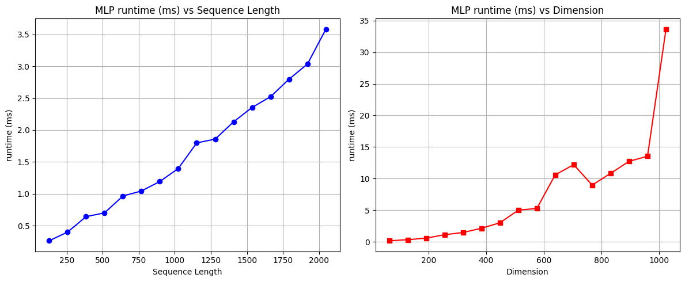
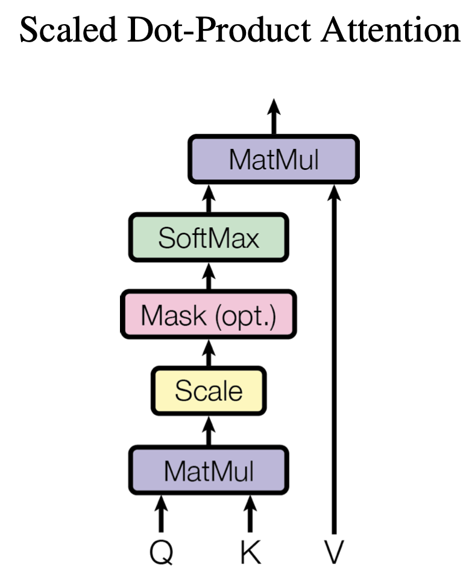
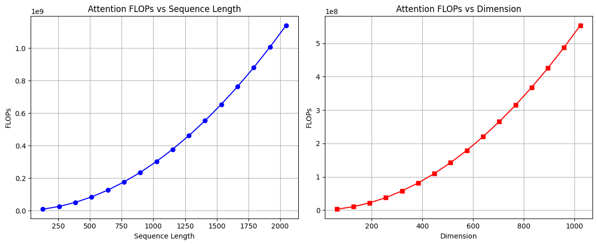
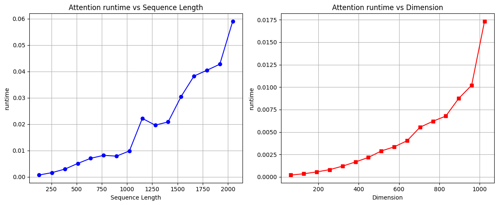
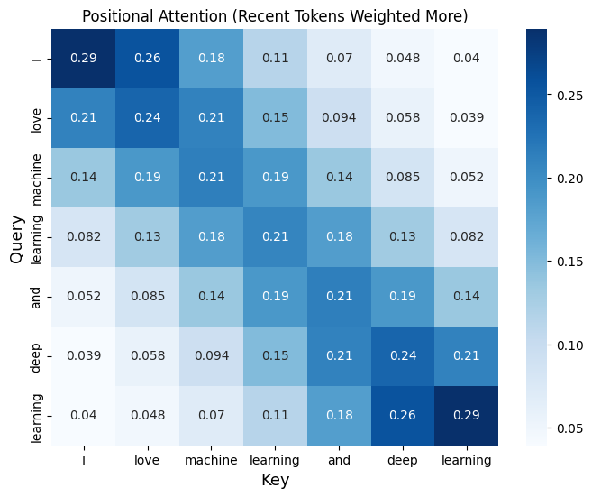
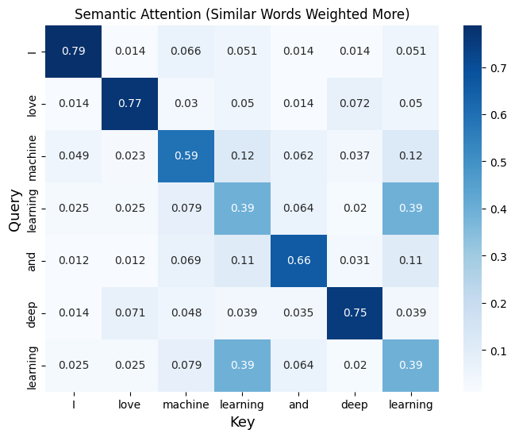
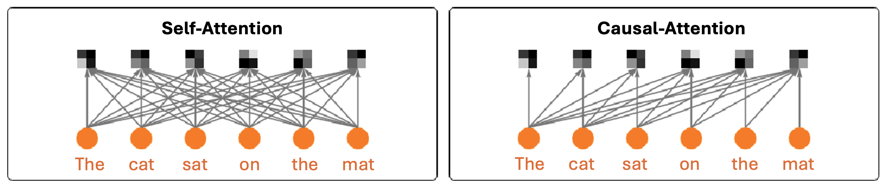
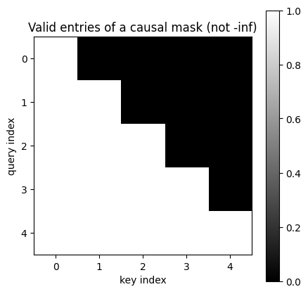
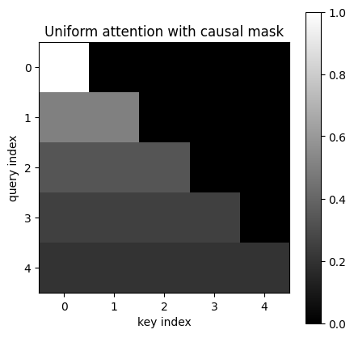
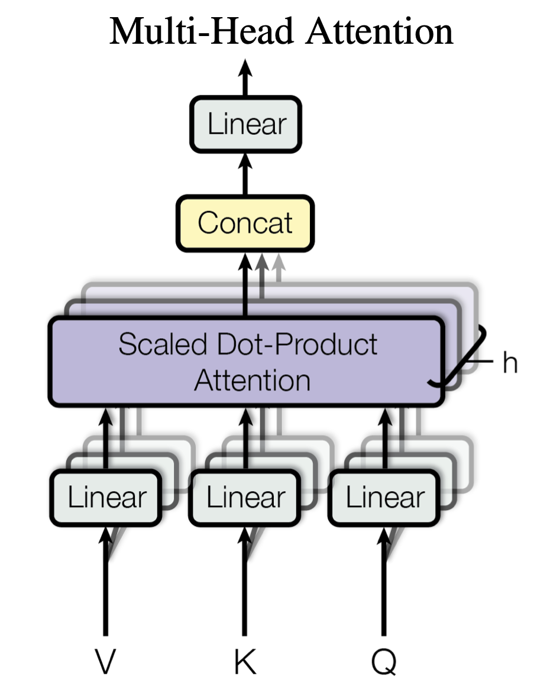

## 들어가며 (Goal & Outline)

이번 글에서는 트랜스포머(Transformer)를 구성하는 두 가지 핵심 모듈인 **MLP**와 **어텐션(Attention)**을 직접 코드로 구현해 보고, 각 모듈이 입력의 크기(시퀀스 길이 $s$, 특성 차원 $d$)에 따라 얼마나 많은 연산을 요구하는지를 **FLOPs**와 실제 **런타임** 관점에서 분석해 보겠습니다.

이 분석은 단순히 학술적 호기심에 그치지 않습니다. "왜 LLM의 컨텍스트 길이를 늘리기가 그토록 어려운가?"라는 실무적 질문에 대한 답이 바로 이 복잡도 분석 안에 들어 있기 때문입니다.

전체 흐름은 다음과 같습니다.

* **MLP layers in Transformers**: LLaMA 계열에서 채택한 게이트 구조(SwiGLU)의 MLP를 살펴봅니다.
* **Attention mechanism**: 토큰 간 정보를 교환하는 어텐션의 4단계 절차를 구현합니다.
* **Causal attention**: 자기회귀 생성을 위한 인과적 마스킹과, 그 확장인 멀티헤드 어텐션(MHA)을 다룹니다.

본문에서 사용하는 `Linear`, `Activation`는 강의에서 미리 제공된 기본 빌딩블록(선형 사상과 활성화 함수)이라고 가정합니다.

```python
import matplotlib.pyplot as plt
import seaborn as sns
import torch
import math
import time

from model import Linear, Activation

DEVICE = "cpu"
```

---

# 1. 트랜스포머의 MLP 레이어 (Multi-layer Perceptron in LLaMA)

[LLaMA](https://www.llama.com)는 Meta가 공개한 대표적인 오픈소스 LLM입니다. 여기서는 LLaMA 모델 내부에서 실제로 쓰이는 MLP 구조의 빌딩블록을 복습하고 재구성해 보겠습니다.

## 1.1 기존 MLP 복습

이전까지 우리는 선형 사상(linear map)과 활성화 함수(activation function)를 번갈아 쌓아 가장 단순한 형태의 MLP를 만들었습니다.

$$
\text{MLP}(x)= \text{Linear}_2 \circ \text{SiLU} \circ \text{Linear}_1(x)
$$

여기서 $\circ$는 함수의 합성(composition)을 의미합니다. 즉 입력 $x$에 먼저 $\text{Linear}_1$을 적용하고, 그 결과에 비선형 활성화 SiLU를 통과시킨 뒤, 다시 $\text{Linear}_2$를 적용하는 구조입니다.


> **보충: SiLU 활성화 함수**
> SiLU(Sigmoid Linear Unit, 또는 Swish)는 $\text{SiLU}(z) = z \cdot \sigma(z) = \dfrac{z}{1 + e^{-z}}$로 정의됩니다. ReLU처럼 음수 영역을 완전히 0으로 만들지 않고 부드럽게 억제하므로, 작은 음수 입력에 대해서도 기울기가 0이 되지 않아 학습에 유리한 성질을 가집니다.

## 1.2 LLaMA의 게이트 MLP (Gated MLP / SwiGLU)

단순히 선형층과 활성화를 번갈아 쌓는 패턴 대신, 최근의 트랜스포머들은 다음과 같은 세 가지 성질을 갖는 MLP를 채택합니다.

### (1) 게이팅 메커니즘 (Gating mechanism)

$$
\text{MLP}(x)= \text{Linear}_3 {\large(} \, \text{SiLU} \circ\text{Linear}_2(x) \;\cdot\; \text{Linear}_1(x) \, {\large)}
$$

* 여기서 $\cdot$는 **원소별 곱(element-wise multiplication, Hadamard product)**을 의미하고, $\circ$는 함수 합성입니다.
* 직관적으로, $\text{Linear}_1(x)$가 만들어 내는 "특성(feature)"에 대해 $\text{SiLU} \circ \text{Linear}_2(x)$가 만들어 내는 "게이트(gate)" 값을 곱해 줍니다. 즉, 어떤 특성을 얼마나 통과시킬지를 데이터에 따라 동적으로 조절하는 셈입니다.
* 이러한 게이트 구조(SwiGLU 계열)는 경험적으로 단순 직렬 구조보다 학습 성능이 더 우수한 것으로 알려져 있습니다.

### (2) 입력과 출력 차원의 일치 (Identical input/output dimension)

$$
\text{MLP}: \mathbb{R}^n \rightarrow \mathbb{R}^n
$$

* MLP의 입력 차원과 출력 차원을 동일하게 $n$으로 맞춥니다.
* 이렇게 하면 동일한 모듈을 그대로 여러 번 쌓을 수 있어, **레이어 수에 비례하여 모델 크기와 연산량이 선형적으로 증가**합니다. 모델을 깊게 확장하기가 매우 편리해지는 설계상의 이점입니다.

### (3) 은닉 특성 차원의 확장 (Expansion of hidden dimension)

$$
\text{Linear}_1,\ \text{Linear}_2: \mathbb{R}^n \rightarrow \mathbb{R}^m, \quad \text{where}\ n<m
$$

* 입출력 차원 $n$은 고정한 채, 중간(은닉) 차원 $m$만 $n$보다 크게 잡아 표현력을 확보합니다.
* 트랜스포머는 어텐션 레이어와 MLP를 번갈아 쌓는데, MLP의 입출력 차원은 어텐션 레이어의 복잡도에 직접 영향을 줍니다. 따라서 연구자들은 입출력 차원을 고정한 상태에서 **중간 차원 $m$만 조절**하며 최적의 구조를 탐색합니다.

## 1.3 구현: FeedForward 클래스

위 게이트 MLP를 코드로 옮기면 다음과 같습니다. $w_1, w_2$는 $\dim \to \text{hidden\_dim}$, $w_3$는 $\text{hidden\_dim} \to \dim$의 선형 사상입니다.

```python
class FeedForward():
    def __init__(self, dim, hidden_dim):
        # Linear generates a linear function
        self.w1 = Linear(dim, hidden_dim)  # dim -> hidden_dim
        self.w2 = Linear(dim, hidden_dim)
        self.w3 = Linear(hidden_dim, dim)

        self.act_fn = Activation('silu')

    def __call__(self, x):
        """
        Feed-forward layer of Transformers: y = MLP(x)

        Parameters:
            x (torch.Tensor): Input tensor of shape (..., dim)

        Returns:
            torch.Tensor: Output tensor of shape (..., dim)
        """
        feature = self.w1(x)               # Linear_1(x)
        gate = self.act_fn(self.w2(x))     # SiLU(Linear_2(x))

        feature = gate * feature           # element-wise gating
        output = self.w3(feature)          # Linear_3(...)

        return output
```

* `feature = self.w1(x)`가 식의 $\text{Linear}_1(x)$에 해당합니다.
* `gate = self.act_fn(self.w2(x))`가 $\text{SiLU} \circ \text{Linear}_2(x)$, 즉 게이트입니다.
* `gate * feature`는 두 텐서의 **원소별 곱**으로, 식의 $\cdot$ 연산을 그대로 구현한 것입니다.
* 마지막으로 `self.w3(...)`가 차원을 다시 $\dim$으로 되돌리는 $\text{Linear}_3$입니다.

## 1.4 차원 확인

입력 텐서의 형태가 `(batch, seq, dim)`일 때, 게이트 MLP는 마지막 차원(특성 차원)에만 작용하므로 입력과 출력의 형태가 동일하게 유지되어야 합니다. 또한 선형층은 앞쪽 차원들에 대해 브로드캐스팅(broadcast)되어, 배치·시퀀스 차원이 추가되어도 자연스럽게 동작합니다.

```python
batch_size, seqlen, dim = 2, 10, 64
hidden_dim = 2 * dim

x = torch.randn(batch_size, seqlen, dim)

mlp = FeedForward(dim, hidden_dim)
y = mlp(x)

print("input size  :", x.shape)
print("output size :", y.shape)
```

```
input size  : torch.Size([2, 10, 64])
output size : torch.Size([2, 10, 64])
```

* 핵심: MLP는 **각 토큰(feature) $x_i \in \mathbb{R}^d$에 동일하게(독립적으로) 작용**합니다. 토큰 간 정보 교환은 일어나지 않으며, 이는 다음 장에서 다룰 어텐션과 대비되는 결정적 차이입니다.

## 1.5 복잡도 분석: FLOPs

이제 MLP가 요구하는 부동소수점 연산 횟수(FLOPs, Floating Point Operations)를 계산해 보겠습니다. 먼저 분석에 필요한 행렬 곱 FLOPs의 기초를 정리합니다.

### 행렬 곱의 FLOPs 기초

두 행렬의 곱 $C = AB$를 생각해 봅시다. $A \in \mathbb{R}^{m \times k}$, $B \in \mathbb{R}^{k \times n}$이면 결과 $C \in \mathbb{R}^{m \times n}$입니다.

* $C$의 각 원소 $C_{ij} = \sum_{l=1}^{k} A_{il} B_{lj}$를 계산하려면 곱셈 $k$번과 덧셈 $(k-1)$번이 필요합니다.
* 따라서 원소 하나당 약 $2k$ FLOPs (곱셈 + 덧셈을 각각 1 FLOP으로 계산)이고, 전체 원소가 $m \times n$개이므로:

$$
\text{FLOPs}(AB) \approx 2 \cdot m \cdot n \cdot k
$$

선형층 $\text{Linear}: \mathbb{R}^{d_{\text{in}}} \to \mathbb{R}^{d_{\text{out}}}$를 길이 $s$인 시퀀스에 적용하면, 이는 $(s \times d_{\text{in}})$ 행렬에 $(d_{\text{in}} \times d_{\text{out}})$ 가중치를 곱하는 것과 같으므로:

$$
\text{FLOPs}_{\text{linear}} \approx 2 \cdot s \cdot d_{\text{out}} \cdot d_{\text{in}}
$$

### MLP의 FLOPs 유도

이제 게이트 MLP의 총 FLOPs를 단계별로 모아 봅시다. 여기서는 $\text{hidden\_dim} = 2 \cdot \dim$으로 둡니다.

* **세 선형층의 FLOPs**
  * $w_1:\ \dim \to \text{hidden\_dim}$ → $2 \cdot s \cdot \dim \cdot \text{hidden\_dim}$
  * $w_2:\ \dim \to \text{hidden\_dim}$ → 동일
  * $w_3:\ \text{hidden\_dim} \to \dim$ → $2 \cdot s \cdot \text{hidden\_dim} \cdot \dim$ (동일한 크기)
  * 세 층이 같은 규모이므로 합치면:
    $$
    \text{flops\_fc} = 3 \times \big(2 \cdot s \cdot \dim \cdot \text{hidden\_dim}\big)
    $$
* **활성화의 FLOPs**: SiLU는 원소별 연산이므로 $\text{flops\_act} = s \cdot \text{hidden\_dim}$ (선형층에 비해 무시할 만큼 작습니다).
* **게이팅의 FLOPs**: 원소별 곱이므로 $\text{flops\_gate} = s \cdot \text{hidden\_dim}$.

```python
def compute_flops(seqlen, dim):
    # We assume the input size of (1, seqlen, dim)
    # Here, we define hidden_dim of MLP as 2*dim
    hidden_dim = 2 * dim

    # multiplications + additions for three linear layers
    flops_fc = seqlen * dim * hidden_dim * 2
    flops_fc *= 3

    # FLOPs for activations (negligible)
    flops_act = seqlen * hidden_dim
    # FLOPs for gating
    flops_gate = seqlen * hidden_dim

    total_flops = flops_fc + flops_act + flops_gate
    return total_flops
```

* 지배항만 정리하면 $\text{hidden\_dim} = 2d$를 대입했을 때
  $$
  \text{FLOPs}_{\text{MLP}} \approx 3 \cdot 2 \cdot s \cdot d \cdot (2d) = 12 \, s \, d^2 = \mathcal{O}(s \cdot d^2)
  $$
* 즉 MLP의 연산량은 **시퀀스 길이 $s$에 대해 선형(linear)**, **특성 차원 $d$에 대해 이차(quadratic)**입니다. 이 점을 곧 어텐션과 비교하게 됩니다.

### FLOPs 시각화 헬퍼

복잡도 곡선을 그리기 위한 공용 함수를 정의합니다. 시퀀스 길이를 바꿔 가며(차원 고정), 그리고 차원을 바꿔 가며(시퀀스 길이 고정) 측정값을 그립니다.

```python
def draw_complexity(fn, yaxis, title):
    seqlens = torch.arange(128, 2049, 128)
    dims = torch.arange(64, 1025, 64)

    # varying sequence length, fixed dimension
    dim_fixed = 64
    flops_seq = [fn(seqlen, dim_fixed) for seqlen in seqlens]

    # varying dimension, fixed sequence length
    seq_fixed = 64
    flops_dim = [fn(seq_fixed, dim) for dim in dims]

    fig, axs = plt.subplots(1, 2, figsize=(12, 5))
    axs[0].plot(seqlens, flops_seq, marker='o', linestyle='-', color='b')
    axs[0].set_xlabel('Sequence Length'); axs[0].set_ylabel(yaxis)
    axs[0].set_title(f'{title} {yaxis} vs Sequence Length'); axs[0].grid()

    axs[1].plot(dims, flops_dim, marker='s', linestyle='-', color='r')
    axs[1].set_xlabel('Dimension'); axs[1].set_ylabel(yaxis)
    axs[1].set_title(f'{title} {yaxis} vs Dimension'); axs[1].grid()

    plt.tight_layout(); plt.show()
```

```python
draw_complexity(compute_flops, "FLOPs", "MLP")
```


## 1.6 런타임 측정

FLOPs는 이론적 연산량이지만, 실제 하드웨어에서의 체감 속도를 보기 위해 직접 시간을 측정해 보겠습니다. 첫 호출은 캐시·초기화 효과가 있으므로 워밍업(warm up) 후 반복 측정 평균을 취합니다.

```python
def measure_runtime_mlp(seqlen, dim, repeat=200):
    hidden_dim = 2 * dim

    mlp = FeedForward(dim, hidden_dim)
    x = torch.randn(1, seqlen, dim)
    _ = mlp(x)  # warm up

    total_time = 0
    for i in range(repeat):
        start_time = time.time()
        _ = mlp(x)
        end_time = time.time()
        total_time += end_time - start_time

    return total_time / repeat * 1000  # ms


draw_complexity(measure_runtime_mlp, "runtime (ms)", "MLP")
```



---

# 2. 어텐션 레이어 (Attention Layers)

## 2.1 동기: 토큰 간 정보 교환

앞서 보았듯, 시퀀스 특성 $x \in \mathbb{R}^{s \times d}$ ($s$는 시퀀스 길이)에 대해 **MLP는 각 토큰 $x_i \in \mathbb{R}^d$에 독립적으로 동일하게 작용**합니다. 그러나 언어 모델이 문맥을 이해하고 다음 토큰을 잘 예측하려면, 토큰들 사이를 가로질러 정보를 추출하고 교환할 수 있어야 합니다.



어텐션 $\text{Attention}: \mathbb{R}^{s \times d} \to \mathbb{R}^{s \times d}$은 토큰 간 통신을 위한 가장 효과적이고 효율적인 메커니즘 중 하나로, 다음 4단계로 동작합니다.

1. 선형 사상으로 입력 $x$로부터 **쿼리 $Q$(query), 키 $K$(key), 값 $V$(value)** $\in \mathbb{R}^{s \times d'}$를 얻습니다.
2. **어텐션 행렬**을 계산합니다.
   $$
   A=\text{softmax}\!\left( Q K^{\intercal} \right) \in [0, 1]^{s\times s}
   $$
3. 어텐션 가중치로 값들을 가중합하여 **토큰 간 통신**을 수행합니다.
   $$
   A\, V\in\mathbb{R}^{s\times d'}
   $$
4. 마지막으로 선형 사상 $\mathbb{R}^{s \times d'} \to \mathbb{R}^{s \times d}$을 적용해 출력을 얻습니다.

> **직관**: $Q K^\intercal$의 $(i, j)$ 원소는 쿼리 $i$와 키 $j$의 내적, 즉 두 토큰의 "유사도"입니다. softmax를 행 방향으로 취해 각 쿼리 토큰 $i$가 모든 키 토큰에 분배하는 확률 가중치 $A_{i,:}$를 얻고, 이 가중치로 값 $V$를 가중평균하여 $i$가 받아 갈 정보를 결정합니다.

## 2.2 구현: Attention 클래스

### 수치적으로 안정한 softmax

softmax는 지수 함수를 포함하므로, 입력이 크면 $e^{x}$가 오버플로(overflow)될 수 있습니다. 이를 막기 위해 각 행의 최댓값 $m$을 빼 줍니다. 이 변환은 결과를 바꾸지 않습니다.

$$
\text{softmax}(x)_i = \frac{e^{x_i}}{\sum_j e^{x_j}} = \frac{e^{x_i - m}}{\sum_j e^{x_j - m}}, \qquad m = \max_j x_j
$$

분자와 분모에 $e^{-m}$을 곱한 것과 같으므로 값은 동일하지만, 모든 지수의 인자가 0 이하가 되어 수치적으로 안정합니다.

### 스케일링 $1/\sqrt{d'}$

내적 $Q K^\intercal$은 차원 $d'$가 커질수록 분산이 커져, softmax가 한쪽으로 지나치게 쏠리면(포화되면) 기울기가 매우 작아집니다. 이를 완화하기 위해 점수를 $\sqrt{d'}$로 나누는 **스케일드 닷-프로덕트 어텐션(scaled dot-product attention)**을 사용합니다.

```python
def softmax(x):
    x_max, _ = torch.max(x, dim=-1, keepdim=True)  # for numerical stability
    exp_x = torch.exp(x - x_max)
    sum_exp_x = torch.sum(exp_x, dim=-1, keepdim=True)
    return exp_x / sum_exp_x


class Attention():
    def __init__(self, dim, head_dim):
        self.head_dim = head_dim
        self.wq = Linear(dim, head_dim)
        self.wk = Linear(dim, head_dim)
        self.wv = Linear(dim, head_dim)
        self.wo = Linear(head_dim, dim)

    def __call__(self, x, return_attn=False):
        """
        Attention layer of Transformers: y = Attention(x)
        x: (batch_size, seq, dim) -> output: (batch_size, seq, dim)
        """
        query, key, value = self.wq(x), self.wk(x), self.wv(x)  # (batch, seq, head_dim)

        scores = torch.matmul(query, key.transpose(1, 2))  # (batch, seq, seq)
        scores = scores / math.sqrt(self.head_dim)         # scaling
        attn_score = softmax(scores)                       # (batch, seq, seq)

        output = torch.matmul(attn_score, value)           # (batch, seq, head_dim)
        output = self.wo(output)

        if return_attn:
            return output, attn_score
        return output
```

* `query`, `key`, `value`는 각각 $W_q, W_k, W_v$ 선형층으로 얻습니다.
* `key.transpose(1, 2)`는 마지막 두 축을 바꿔 $K^\intercal$을 만들고, `matmul`으로 $Q K^\intercal \in \mathbb{R}^{s \times s}$를 얻습니다.
* `softmax`는 마지막 축(키 방향)에 대해 적용되어, 각 쿼리 행이 1로 정규화됩니다.
* `attn_score @ value`가 $A V$이며, 마지막 `wo`가 4단계의 출력 선형 사상입니다.

## 2.3 차원 확인

```python
batch_size, seqlen, dim = 2, 10, 64
head_dim = dim

x = torch.randn(batch_size, seqlen, dim)

attn = Attention(dim, head_dim)
y, score = attn(x, return_attn=True)

print("input size    :", x.shape)
print("output size   :", y.shape)
print("attention size:", score.shape)
```

```
input size    : torch.Size([2, 10, 64])
output size   : torch.Size([2, 10, 64])
attention size: torch.Size([2, 10, 10])
```

* 입력·출력은 모두 `(2, 10, 64)`로 동일합니다(어텐션도 $\mathbb{R}^{s\times d} \to \mathbb{R}^{s\times d}$).
* 어텐션 행렬은 `(2, 10, 10)`, 즉 시퀀스 길이 $\times$ 시퀀스 길이로 **토큰 쌍마다 하나의 가중치**를 가집니다. 바로 이 $s \times s$ 행렬이 어텐션 비용의 핵심입니다.

## 2.4 복잡도 분석: FLOPs

### 어텐션의 FLOPs 유도

여기서는 단순화를 위해 $\text{head\_dim} = \dim = d$로 둡니다.

* **네 선형층($W_q, W_k, W_v, W_o$)의 FLOPs**: 각각 $\dim \to \text{head\_dim}$ 규모이므로
  $$
  \text{flops\_fc} = 4 \times \big(2 \cdot s \cdot \dim \cdot \text{head\_dim}\big) = 8\, s\, d^2
  $$
* **어텐션 연산의 FLOPs** (softmax는 무시):
  * $Q K^\intercal$: $(s \times d')$와 $(d' \times s)$의 곱 → $2 \cdot s \cdot s \cdot d' = 2 s^2 d'$
  * $A V$: $(s \times s)$와 $(s \times d')$의 곱 → $2 \cdot s \cdot d' \cdot s = 2 s^2 d'$
  * 합치면 $\text{flops\_attn} = 4 s^2 d'$

```python
def compute_flops_attn(seqlen, dim):
    head_dim = dim

    # FLOPs for four linear layers
    flops_fc = seqlen * dim * head_dim * 2
    flops_fc *= 4

    # FLOPs for attention (neglect softmax)
    flops_attn = seqlen * head_dim * seqlen * 2   # Q K^T
    flops_attn += seqlen * seqlen * head_dim * 2  # A V

    total_flops = flops_fc + flops_attn
    return total_flops


draw_complexity(compute_flops_attn, "FLOPs", "Attention")
```

### 핵심: 시퀀스 길이에 대한 이차 복잡도

두 항을 정리하면 ($d' = d$일 때):

$$
\text{FLOPs}_{\text{Attn}} \approx \underbrace{8\, s\, d^2}_{\text{선형층 (}\mathcal{O}(s d^2)\text{)}} \;+\; \underbrace{4\, s^2 d}_{\text{어텐션 (}\mathcal{O}(s^2 d)\text{)}}
$$

* 선형층 항은 시퀀스 길이에 **선형**이지만, 어텐션 항 $4 s^2 d$는 시퀀스 길이에 **이차(quadratic)**로 증가합니다.
* 즉 시퀀스가 충분히 길어지면($s \gtrsim d$) $s^2 d$ 항이 지배하게 되며, 이것이 **트랜스포머가 긴 컨텍스트를 다루기 어려운 근본 이유**입니다. FlashAttention, 선형 어텐션, 희소 어텐션 등 수많은 후속 연구가 바로 이 $\mathcal{O}(s^2)$ 항을 줄이려는 시도입니다.



## 2.5 런타임 측정

```python
def measure_runtime_attn(seqlen, dim, repeat=100):
    head_dim = dim
    attn = Attention(dim, head_dim)
    x = torch.randn(1, seqlen, dim)
    _ = attn(x)  # warm up

    total_time = 0
    for _ in range(repeat):
        start_time = time.time()
        _ = attn(x)
        end_time = time.time()
        total_time += end_time - start_time

    return total_time / repeat


draw_complexity(measure_runtime_attn, "runtime", "Attention")
```



## 2.6 어텐션 시각화 (Positional vs Semantic)

학습된 어텐션이 실제로 어떤 패턴을 보이는지 두 가지 전형적 유형을 인위적 특성으로 만들어 살펴봅니다.

1. **위치 기반 어텐션(Positional Attention)**: 예를 들어 최근 토큰에 더 큰 가중치를 주는 패턴. 여기서는 토큰 인덱스에 사인·코사인 함수를 적용해 위치 특성을 만듭니다.
2. **의미 기반 어텐션(Semantic Attention)**: 의미가 비슷한 단어에 더 큰 가중치를 주는 패턴. 여기서는 단어의 문자 빈도 벡터를 특성으로 사용해, 철자가 비슷한 단어끼리 높은 유사도를 갖도록 합니다.

```python
def get_attn_score(query, key):
    scores = torch.matmul(query, key.transpose(0, 1))  # (seq, seq)
    attn_score = softmax(scores)                       # (seq, seq)
    return attn_score


def normalize_char_frequency(s):
    # normalized frequency of each alphabet character
    char_count = [0] * 26
    for char in s.lower():
        if 'a' <= char <= 'z':
            char_count[ord(char) - ord('a')] += 1
    norm = math.sqrt(sum(count ** 2 for count in char_count))
    return torch.tensor([count / norm for count in char_count])


tokens = ["I", "love", "machine", "learning", "and", "deep", "learning"]
n = len(tokens)

# case 1: positional attention (sinusoidal features of token index)
x = torch.arange(n) / 2
key = torch.stack([torch.sin(x), torch.cos(x)], dim=-1)
query = key
positional_attention = get_attn_score(query, key).numpy()

# case 2: semantic attention (character-frequency features)
key = 2 * torch.stack([normalize_char_frequency(token) for token in tokens])
query = key
semantic_attention = get_attn_score(query, key).numpy()


def plot_attention(attention_matrix, title, tokens):
    plt.figure(figsize=(8, 6))
    sns.heatmap(attention_matrix, annot=True, cmap="Blues",
                xticklabels=tokens, yticklabels=tokens)
    plt.title(title)
    plt.xlabel("Key", size=13); plt.ylabel("Query", size=13)
    plt.show()

plot_attention(positional_attention, "Positional Attention (Recent Tokens Weighted More)", tokens)
plot_attention(semantic_attention, "Semantic Attention (Similar Words Weighted More)", tokens)
```





---

# 3. 인과적 마스킹 (Causal Masking)

## 3.1 동기: 자기회귀 생성

ChatGPT와 같은 시스템은 토큰을 하나씩 순차적으로 만들어 내는 **자기회귀 생성(autoregressive generation)**을 수행합니다. 이를 보장하려면, 어떤 토큰에 대한 예측이 **오직 이전 토큰들에만 의존**하고 미래 토큰의 정보가 새어 들어오지(leakage) 않도록 해야 합니다.

미래 위치로 향하는 어텐션을 차단함으로써, 모델은 올바른 의존 관계를 학습하고 언어의 자연스러운 흐름을 모방할 수 있게 됩니다. 이를 **인과적 마스킹(causal masking)**이라 부릅니다.



## 3.2 인과 마스크 생성

핵심 아이디어는 간단합니다. 점수 행렬에서 **미래 위치(대각선 위쪽)를 $-\infty$로 채우면**, softmax의 $e^{-\infty} = 0$ 성질에 의해 그 위치의 가중치가 0이 됩니다.

```python
def generate_causal_mask(seqlength):
    """
    Generates a causal mask for self-attention.
    Returns a (seqlength, seqlength) mask where future positions are -inf.
    """
    mask = torch.triu(torch.ones(seqlength, seqlength), diagonal=1)  # 1s strictly above diagonal
    mask = mask.masked_fill(mask == 1, float('-inf'))                # 1 -> -inf
    return mask


def visualize_causal_mask(mask, title=""):
    plt.figure(figsize=(5, 5))
    plt.imshow(mask.float().numpy(), cmap='gray')
    plt.xlabel("key index"); plt.ylabel("query index")
    plt.colorbar(); plt.title(title); plt.show()


seqlen = 5
causal_mask = generate_causal_mask(seqlen)
visualize_causal_mask(causal_mask != float('-inf'), "Valid entries of a causal mask (not -inf)")
```

* `torch.triu(..., diagonal=1)`은 **대각선보다 엄격히 위쪽**(미래)에만 1을 둡니다. 대각선(자기 자신)은 0으로 남으므로 자기 참조는 허용됩니다.
* 따라서 쿼리 $i$는 $j \le i$인 키 $j$에만 접근할 수 있습니다(과거 + 자기 자신).



## 3.3 마스킹된 균등 어텐션

키와 쿼리가 동일하여 점수가 일정할 때, 마스크만 적용하고 softmax를 취하면 결과는 어떻게 될까요? 각 쿼리 행 $i$에서 유효한 위치는 $i+1$개뿐이므로, 그 위치들에 균등하게 $\frac{1}{i+1}$씩 가중치가 분배됩니다.

```python
attn_score = softmax(causal_mask)
visualize_causal_mask(attn_score, "Uniform attention with causal mask")
```



## 3.4 마스킹이 적용된 Attention

이제 마스크를 받아 점수에 더해 주는 형태로 어텐션을 갱신합니다. 마스크가 2차원 `(seq, seq)`이면 배치 차원을 추가해 브로드캐스트합니다.

```python
class Attention():
    def __init__(self, dim, head_dim):
        self.head_dim = head_dim
        self.wq = Linear(dim, head_dim)
        self.wk = Linear(dim, head_dim)
        self.wv = Linear(dim, head_dim)
        self.wo = Linear(head_dim, dim)

    def __call__(self, x, mask=None, return_attn=False):
        query, key, value = self.wq(x), self.wk(x), self.wv(x)  # (batch, seq, head_dim)

        scores = torch.matmul(query, key.transpose(1, 2))  # (batch, seq, seq)
        scores = scores / math.sqrt(self.head_dim)

        # Apply mask to the scores
        if mask is not None:
            if len(mask.shape) == 2:
                mask = mask.unsqueeze(0)  # expand batch dimension
            scores = scores + mask

        attn_score = softmax(scores)  # (batch, seq, seq)

        output = torch.matmul(attn_score, value)  # (batch, seq, head_dim)
        output = self.wo(output)

        if return_attn:
            return output, attn_score
        return output
```

* 마스크는 곱이 아니라 **덧셈**으로 적용됩니다. 허용 위치는 $+0$, 금지 위치는 $-\infty$를 더하므로, softmax 후 금지 위치가 정확히 0이 됩니다.

## 3.5 차원 확인

```python
batch_size, seqlen, dim = 2, 10, 64
head_dim = dim

x = torch.randn(batch_size, seqlen, dim)

attn = Attention(dim, head_dim)
mask = generate_causal_mask(seqlen)
y, score = attn(x, mask=mask, return_attn=True)

print("input size    :", x.shape)
print("output size   :", y.shape)
print("attention size:", score.shape)
```

```
input size    : torch.Size([2, 10, 64])
output size   : torch.Size([2, 10, 64])
attention size: torch.Size([2, 10, 10])
```

---

# 확장: 멀티헤드 어텐션 (Multi-head Attention, MHA)

## 4.1 동기

* 하나의 레이어 안에서 **여러 개의 어텐션 메커니즘을 병렬로** 수행하는 것이 멀티헤드 어텐션입니다.
* 각 헤드(head)가 서로 다른 종류의 관계(예: 어떤 헤드는 위치, 어떤 헤드는 의미)에 주목할 수 있어, 트랜스포머의 표현력이 향상됩니다.



## 4.2 구현

핵심은 한 번의 큰 선형층으로 $n\_head \times head\_dim$ 차원을 만든 뒤, 이를 헤드 축으로 분리하여 `(batch, n_head, seq, head_dim)` 형태로 만드는 것입니다.

```python
class Attention():
    def __init__(self, dim, head_dim, n_head):
        self.head_dim = head_dim
        self.n_head = n_head  # New
        self.wq = Linear(dim, n_head * head_dim)
        self.wk = Linear(dim, n_head * head_dim)
        self.wv = Linear(dim, n_head * head_dim)
        self.wo = Linear(n_head * head_dim, dim)

    def __call__(self, x, mask=None, return_attn=False):
        bsz, seqlen, dim = x.shape

        query, key, value = self.wq(x), self.wk(x), self.wv(x)  # (batch, seq, n_head*head_dim)

        # obtain q,k,v for MHA -> (batch, n_head, seq, head_dim)
        query = query.reshape(bsz, seqlen, self.n_head, self.head_dim)
        key   = key.reshape(bsz, seqlen, self.n_head, self.head_dim)
        value = value.reshape(bsz, seqlen, self.n_head, self.head_dim)

        query = query.transpose(1, 2)  # (batch, n_head, seq, head_dim)
        key   = key.transpose(1, 2)
        value = value.transpose(1, 2)

        scores = torch.matmul(query, key.transpose(2, 3))  # (batch, n_head, seq, seq)
        scores = scores / math.sqrt(self.head_dim)
        if mask is not None:
            scores = scores + mask    # broadcast
        attn_score = softmax(scores)  # (batch, n_head, seq, seq)

        output = torch.matmul(attn_score, value)  # (batch, n_head, seq, head_dim)

        # merge heads: (batch, seq, n_head*head_dim)
        output = output.transpose(1, 2).reshape(bsz, seqlen, -1)
        output = self.wo(output)  # (batch, seq, dim)

        if return_attn:
            return output, attn_score
        return output
```

* `reshape`로 `n_head * head_dim` 차원을 `(n_head, head_dim)`으로 나누고, `transpose(1, 2)`로 헤드 축을 앞으로 보내 헤드별 병렬 어텐션을 한 번의 배치 행렬곱으로 처리합니다.
* 어텐션 후에는 다시 `transpose(1, 2)` 후 `reshape`로 헤드들을 이어붙여 `wo`에 통과시킵니다.

## 4.3 보충: reshape vs transpose

`reshape`와 `transpose`는 결과가 전혀 다릅니다. `reshape`는 메모리에 저장된 순서(행 우선, row-major)를 그대로 두고 형태만 다시 끊어 읽는 반면, `transpose`는 축의 의미 자체를 바꿉니다. 이를 작은 예로 확인합니다.

```python
# input of shape (seq, n_head), seq=2, n_head=3
input = torch.tensor([[1, 2, 3], [4, 5, 6]])

print("Input (*shape is seq x n_head):\n", input.numpy())
print("\nInput.reshape(n_head, seq):\n", input.reshape(3, 2).numpy())
print("\nInput.transpose(0, 1):\n", input.transpose(0, 1).numpy())
```

```
Input (*shape is seq x n_head):
 [[1 2 3]
  [4 5 6]]

Input.reshape(n_head, seq):
 [[1 2]
  [3 4]
  [5 6]]

Input.transpose(0, 1):
 [[1 4]
  [2 5]
  [3 6]]
```

* `reshape(3, 2)`는 원소를 `1,2,3,4,5,6` 순서 그대로 읽어 다시 끊어 담습니다(행 우선).
* `transpose(0, 1)`은 행과 열을 교환하여 $(i, j) \to (j, i)$로 자리를 바꿉니다.
* 따라서 MHA에서 헤드를 분리할 때는, 단순히 `reshape`로 형태만 바꾸는 것이 아니라 `transpose`로 **헤드 축을 명시적으로 앞으로 보내야** 각 헤드가 독립적으로 어텐션을 계산할 수 있습니다.

## 4.4 차원 확인

```python
batch_size, seqlen, dim = 1, 10, 64
n_head, head_dim = 8, dim // 8

x = torch.randn(batch_size, seqlen, dim)

attn = Attention(dim, head_dim, n_head)
mask = generate_causal_mask(seqlen)
y, score = attn(x, mask=mask, return_attn=True)

print("sequence length:", seqlen)
print("the number of head :", n_head)
print()
print("input size    :", x.shape)
print("output size   :", y.shape)
print("attention size:", score.shape)
```

```
sequence length: 10
the number of head : 8

input size    : torch.Size([1, 10, 64])
output size   : torch.Size([1, 10, 64])
attention size: torch.Size([1, 8, 10, 10])
```

* 입력·출력은 여전히 `(1, 10, 64)`로 동일합니다.
* 어텐션 행렬은 `(1, 8, 10, 10)`로, **8개 헤드 각각이 자신만의 $10 \times 10$ 어텐션 패턴**을 가집니다. 단일 헤드 어텐션을 헤드 축으로 확장한 것이 바로 MHA입니다.

---

# 마치며 (정리)

이번 글에서는 트랜스포머의 두 핵심 모듈을 직접 구현하고 복잡도를 분석했습니다.

* **MLP**는 각 토큰에 독립적으로 작용하며, LLaMA는 게이트 구조(SwiGLU)·입출력 차원 일치·은닉 차원 확장을 채택합니다. 복잡도는 $\mathcal{O}(s \cdot d^2)$로, 시퀀스 길이에 선형입니다.
* **어텐션**은 토큰 간 정보를 교환하며, 복잡도는 $\mathcal{O}(s d^2) + \mathcal{O}(s^2 d)$입니다. 여기서 시퀀스 길이에 대한 **이차 항 $\mathcal{O}(s^2 d)$**가 긴 컨텍스트 처리의 근본적 병목이며, 이는 곧 효율적 어텐션 연구의 출발점이 됩니다.
* **인과적 마스킹**은 미래 토큰을 $-\infty$로 막아 자기회귀 생성을 가능하게 하고, **멀티헤드 어텐션**은 여러 어텐션을 병렬로 두어 표현력을 높입니다.
