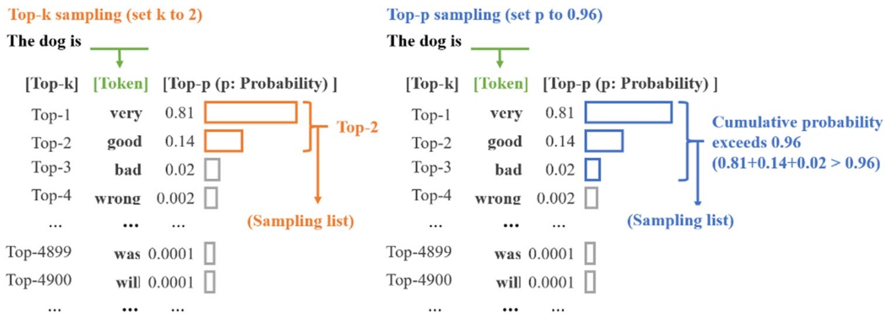
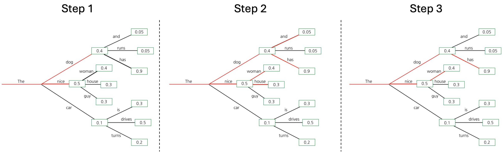
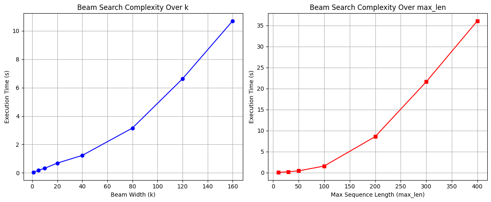
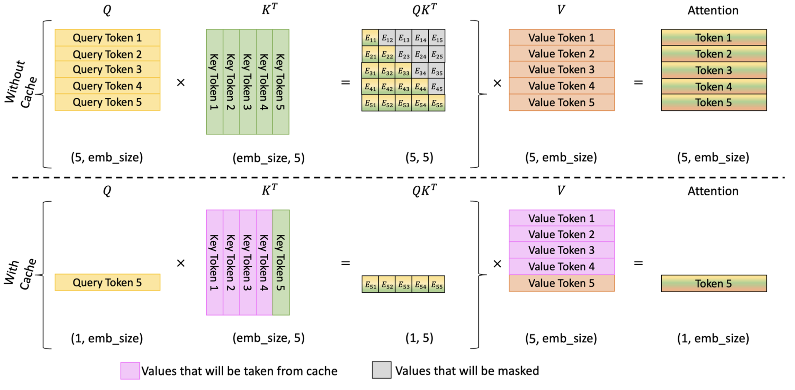

## 들어가며 (Overview)

이번 강의의 목표는 **Transformer의 추론(inference) 단계에서 사용되는 디코딩 알고리즘**과, 이를 **효율적으로** 수행하기 위한 핵심 테크닉을 학습하는 것입니다.

학습한 언어 모델 $p_\theta$가 주어졌을 때, 우리는 보통 "이 모델로 어떻게 문장을 *생성*할 것인가?"라는 질문에 부딪힙니다. 모델은 단지 "다음 토큰의 확률 분포"를 출력할 뿐이므로, 이 분포로부터 실제 토큰 시퀀스를 뽑아내는 **디코딩 전략(decoding strategy)** 이 별도로 필요합니다. 또한 이 과정은 추론 시간의 대부분을 차지하므로, 어떻게 하면 **불필요한 재계산을 줄일 수 있는지**가 실무에서 매우 중요합니다.

이번 글에서 다룰 내용은 다음과 같습니다.

1. **디코딩 알고리즘 (Decoding algorithms)** — 자기회귀 생성, Greedy / Top-k / Top-p / Beam search
2. **Key-Value (KV) 캐싱** — 어텐션 재계산을 제거하여 추론을 가속하는 방법

---

# 1. 디코딩 알고리즘 (Decoding Algorithms)

## 1.1 자기회귀적 생성: Transformer의 재귀적 계산

쿼리(query) $q$가 주어졌을 때, 우리의 목표는 여러 개의 토큰으로 구성된 응답(response) $r$를 모델 $p_\theta$로부터 생성하는 것입니다.

$$
r \sim p_\theta(\cdot \mid q)
$$

여기서 핵심은, Transformer는 **한 번의 forward pass마다 "다음 토큰 하나의 확률 분포"만 출력한다**는 점입니다. 즉, 전체 응답을 한 번에 뽑아낼 수 없습니다. 따라서 응답을 생성하려면 **Transformer를 재귀적으로(recursively) 반복 호출**해야 합니다.

$$
\begin{aligned}
r_1 &\sim p_\theta(\cdot \mid q) \\
r_2 &\sim p_\theta(\cdot \mid q,\ r_1) \\
r_3 &\sim p_\theta(\cdot \mid q,\ r_1,\ r_2) \\
&\ \ \vdots \\
r_k &\sim p_\theta(\cdot \mid q,\ r_1,\ r_2,\ \cdots,\ r_{k-1})
\end{aligned}
$$

여기서 $r = (r_1, r_2, \cdots, r_k)$이고, $r_k$는 생성을 종료하는 **End-of-Sequence(EOS)** 토큰입니다.

### 확률의 연쇄법칙(chain rule) 관점

이러한 재귀적 구조는 단순한 구현상의 편의가 아니라, **결합 확률을 인수분해(factorize)** 하는 자연스러운 방식입니다. 확률의 연쇄법칙에 의해 응답 전체의 확률은 다음과 같이 분해됩니다.

$$
p_\theta(r \mid q) = \prod_{i=1}^{k} p_\theta\big(r_i \mid q,\ r_1, \cdots, r_{i-1}\big)
$$

즉, "다음 토큰을 조건부로 예측하는 모델"을 반복 적용하는 것만으로 시퀀스 전체의 확률을 정확히 모델링할 수 있습니다. 이를 **자기회귀(autoregressive) 분해**라고 부릅니다.

## 1.2 왜 정확한 MAP 디코딩은 불가능한가

이상적으로는 $p_\theta(\cdot \mid q)$에서 **가장 가능도(likelihood)가 높은 시퀀스**를 선택하고 싶습니다.

$$
r^\star = \arg\max_{r} \ p_\theta(r \mid q)
$$

하지만 이는 계산적으로 **금지될 정도로(prohibitively) 비쌉니다**. 어휘 집합(vocabulary)의 크기를 $|V|$, 시퀀스 길이를 $k$라 하면, 가능한 시퀀스의 수는

$$
|V|^k
$$

로 **지수적으로(exponentially)** 증가하기 때문입니다. 예컨대 $|V| = 64{,}000$, $k = 50$ 정도만 되어도 우주의 원자 수를 가뿐히 넘기는 경우의 수가 됩니다. 따라서 전역 최적해를 직접 탐색하는 것은 불가능하며, **근사적인 탐욕(greedy) 알고리즘**을 사용합니다.

## 1.3 디코딩 전략 (Decoding Strategies)

대표적인 디코딩 전략은 다음과 같습니다.

- **Greedy decoding**: 매 스텝에서 *가장 확률이 높은 토큰 하나*만 선택합니다. 가장 단순하지만, 매 순간의 국소 최적이 전체 시퀀스의 최적을 보장하지 않습니다.
  $$
  r_i = \arg\max_{v \in V} \ p_\theta\big(v \mid q,\ r_{<i}\big)
  $$
- **Top-k**: 확률이 가장 높은 **상위 $k$개의 시퀀스(beam)** 를 동시에 유지합니다. Greedy를 $k$개의 후보로 일반화한 것으로 볼 수 있습니다.
- **Top-p (nucleus sampling)**: 누적 확률의 합이 임계값 $p$를 초과하는 **가장 작은 토큰 집합**을 동적으로 유지하여, 그 안에서 샘플링합니다. 분포가 뾰족할 때는 적은 후보만, 평평할 때는 많은 후보를 고려하게 됩니다.



### Top-k Beam Search의 동작 원리

이번 실습에서 구현할 핵심 알고리즘은 **Top-k beam search**입니다. 동작 절차는 다음과 같습니다.

1. 매 디코딩 스텝에서 최대 $k$개의 시퀀스 후보(beam)를 유지합니다.
2. 각 후보 시퀀스마다 다음 토큰 상위 $k$개를 선택하여, 총 $k \times k = k^2$개의 확장 후보를 만듭니다.
3. 이 $k^2$개의 후보 중 누적 확률이 가장 높은 **상위 $k$개**만 남기고 나머지는 가지치기(pruning)합니다.



## 1.4 Log-softmax: 왜 로그 확률을 더하는가

Beam search는 시퀀스의 누적 확률을 비교해야 합니다. 그런데 $p_\theta(r \mid q) = \prod_i p_\theta(r_i \mid \cdots)$ 는 여러 확률의 **곱**이므로, 길이가 길어질수록 값이 0에 가까워져 **수치적 언더플로(underflow)** 가 발생합니다. 이를 피하기 위해 로그를 취해 **합**으로 바꿉니다.

$$
\log p_\theta(r \mid q) = \sum_{i=1}^{k} \log p_\theta\big(r_i \mid q,\ r_{<i}\big)
$$

이때 각 스텝의 로그 확률은 **log-softmax**로 계산합니다. 모델이 출력하는 로짓(logit) 벡터 $z = (z_1, \cdots, z_{|V|})$에 대해 softmax는 다음과 같이 정의됩니다.

$$
\text{softmax}(z)_i = \frac{e^{z_i}}{\sum_{j=1}^{|V|} e^{z_j}}
$$

여기에 로그를 취하면, 곱셈과 나눗셈이 덧셈과 뺄셈으로 풀립니다.

$$
\begin{aligned}
\log \text{softmax}(z)_i
&= \log \left( \frac{e^{z_i}}{\sum_j e^{z_j}} \right) \\
&= \log e^{z_i} - \log \sum_j e^{z_j} \\
&= z_i - \log \sum_{j} e^{z_j}
\end{aligned}
$$

즉, **로짓에서 "log-sum-exp" 항을 빼주면** 곧바로 로그 확률이 됩니다. 아래 구현이 정확히 이 식을 따릅니다.

```python
def log_softmax(logits):
    """
    Computes the log softmax of a tensor.
    logits: (..., vocab_size)
    return: (..., vocab_size)
    """
    exp_logits = torch.exp(logits)
    sum_exp_logits = torch.sum(exp_logits, dim=-1, keepdim=True)  # 마지막 축에 대한 합
    log_sum_exp = torch.log(sum_exp_logits)                       # 로그 취하기
    return logits - log_sum_exp                                   # z_i - log Σ exp(z_j)
```

> **수치 안정성 보충**: 실무 구현에서는 $\log \sum_j e^{z_j} = m + \log \sum_j e^{z_j - m}$ ($m = \max_j z_j$) 형태의 **max-subtraction trick**을 적용해 $e^{z_j}$의 오버플로를 방지합니다. 위 코드는 학습 목적상 정의 그대로를 따른 버전입니다.

## 1.5 Top-k Beam Search 구현

이제 위 절차를 코드로 구현합니다. 핵심은 `(시퀀스, 누적 로그가능도)` 튜플의 리스트로 beam을 관리하면서, 매 스텝마다 **확장 → 가지치기**를 반복하는 것입니다. (배치 크기 1을 가정합니다.)

```python
def top_k_beam_search(model, tokens, k=5, max_len=50):
    """
    Top-K Beam Search 디코딩 (batch_size=1 가정)
    tokens: (1, seq_len)
    return: (1, seq_len + dec_len)
    """
    # 각 원소는 (시퀀스, 디코딩된 부분의 누적 로그가능도)
    beam = [(tokens, 0)]

    for _ in range(max_len):
        candidates = []

        for seq, cum_logprob in beam:
            logits = model(seq)                       # (1, seq, vocab_size)
            next_token_logits = logits[:, -1, :]      # 마지막 위치 로짓, (1, vocab_size)
            logprobs = log_softmax(next_token_logits) # (1, vocab_size)

            # 상위 k개의 로그확률과 토큰 인덱스, 각각 (1, k)
            top_k_logprobs, top_k_indices = torch.topk(logprobs, k, dim=-1)

            # === 후보 확장: 각 beam을 k개로 확장 → 총 k^2개 ===
            for i in range(k):
                next_token = top_k_indices[0, i]
                new_seq = torch.cat([seq, next_token.reshape(1, 1)], dim=1)  # (1, slen+1)
                new_cum_logprob = cum_logprob + top_k_logprobs[0, i]         # 누적 로그가능도 갱신
                candidates.append((new_seq, new_cum_logprob))

        # === 가지치기: 누적 로그가능도 기준 상위 k개만 유지 ===
        candidates = sorted(candidates, key=lambda x: x[1], reverse=True)[:k]
        beam = candidates

    return beam[0][0]  # 최종적으로 가장 좋은 시퀀스 반환
```

구현의 논리적 흐름을 정리하면 다음과 같습니다.

- **마지막 위치의 로짓만 사용**: `logits[:, -1, :]` — 다음에 올 토큰을 예측하는 것은 항상 시퀀스의 *마지막* 위치이기 때문입니다.
- **누적 로그가능도의 갱신**: `new_cum_logprob = cum_logprob + top_k_logprobs[0, i]` — 1.4절의 합산 공식 $\sum_i \log p_\theta(r_i \mid \cdots)$을 그대로 구현한 부분입니다.
- **확장 후 가지치기**: $k^2$개의 후보를 만든 뒤 상위 $k$개만 남깁니다.

### 입출력 형태 확인

```python
batch_size, seqlen = 1, 10
vocab_size = 64000
n_layers, dim, n_head = 4, 64, 8

x = torch.randint(0, vocab_size, (batch_size, seqlen))
model = Transformer(n_layers, vocab_size, dim, n_head)

max_decode_length = 50
output = top_k_beam_search(model, x, k=5, max_len=max_decode_length)

print("input size      :", x.shape)          # (1, 10)
print("decoding max len:", max_decode_length) # 50
print("output size     :", output.shape)      # (1, 60) = 입력 10 + 디코딩 50
```

출력 길이는 **입력 길이 + 디코딩 길이**가 됩니다. 매 스텝마다 토큰이 하나씩 시퀀스에 추가되기 때문입니다.

## 1.6 학습된 모델로 디코딩 (Shakespeare)

랜덤 가중치가 아니라 **셰익스피어 텍스트로 학습된 모델**에 디코딩을 적용해 봅니다. 학습된 토크나이저와 가중치를 불러옵니다.

```python
from util import Shakespeare

tokenizer = Shakespeare("./", "cpu", 512, 0.02).tokenizer
model = Transformer(4, vocab_size, 128, 16)  # n_layer, vocab_size, hidden_dim, n_head

weight = torch.load("weight.pt", map_location="cpu")
model.load_state_dict(weight)
```

이제 프롬프트를 주고 텍스트를 이어서 생성합니다.

```python
input_str = "First Citizen:\nBefore we proceed any further, hear me speak"

x = tokenizer.encode(input_str)
x = torch.tensor([x])

output = top_k_beam_search(model, x, k=2, max_len=50)
output_str = tokenizer.decode(output[0].tolist())
print(output_str)
```

학습된 모델은 입력 프롬프트의 문체와 맥락을 이어받아, 셰익스피어 희곡풍의 텍스트를 자기회귀적으로 생성합니다. 이는 1.1절에서 설명한 재귀적 생성 과정이 실제 모델에서 작동함을 보여줍니다.

## 1.7 복잡도 분석 (Complexity Analysis)

### (1) Forward pass를 상수 비용으로 가정할 때

모델의 forward pass 비용이 일정하다고 가정하면, beam search의 복잡도는 다음과 같습니다.

$$
O(n k^2)
$$

- $n$: 시퀀스(디코딩) 길이
- $k$: beam 크기

매 스텝마다 $k$개의 beam을 각각 $k$개로 확장하여 $k^2$개의 후보를 만들고 정렬·가지치기하므로, 한 스텝당 $O(k^2)$, 전체 $n$ 스텝에 대해 $O(nk^2)$가 됩니다.

### (2) 어텐션의 이차 복잡도를 고려할 때

문제는 **어텐션의 비용이 상수가 아니라는 점**입니다. 길이가 $L$인 시퀀스의 self-attention은 모든 토큰 쌍에 대해 점수를 계산하므로 $O(L^2)$의 비용이 듭니다.

KV 캐시가 없는 단순 디코딩에서는, 매 스텝마다 **지금까지 생성된 전체 시퀀스를 처음부터 다시 처리**합니다. 따라서 스텝 $t$에서의 시퀀스 길이가 $\sim t$라면, 그 스텝의 어텐션 비용은 $O(t^2)$입니다. 이를 모든 스텝에 대해 합산하면,

$$
\sum_{t=1}^{n} O(t^2) = O\!\left( \frac{n(n+1)(2n+1)}{6} \right) = O(n^3)
$$

즉, beam 하나당 디코딩 비용이 시퀀스 길이에 대해 **세제곱($n^3$)** 으로 커집니다. 이것이 긴 시퀀스 생성이 급격히 느려지는 근본 원인이며, 다음 절의 KV 캐싱이 해결하려는 핵심 비효율입니다.



```python
# 실행 시간 측정 (약 1분 소요)
k_values = [1, 5, 10, 20, 40, 80, 120, 160]
max_len_values = [10, 30, 50, 100, 200, 300, 400]

time_k = []
for k in k_values:
    start = time.time()
    top_k_beam_search(model, x, k=k, max_len=5)
    time_k.append(time.time() - start)

time_max_len = []
for max_len in max_len_values:
    start = time.time()
    top_k_beam_search(model, x, k=1, max_len=max_len)
    time_max_len.append(time.time() - start)
# (이후 두 곡선을 plot)
```

---

# 2. Key-Value (KV) 캐싱

## 2.1 동기: 무엇이 낭비되는가

자기회귀 디코딩의 핵심 관찰은 다음과 같습니다.

> **이미 생성된 과거 토큰들의 Key와 Value는 변하지 않는다.**

스텝마다 새로 추가되는 것은 **마지막 토큰 하나**뿐입니다. 그런데 KV 캐시가 없으면, 매 스텝마다 과거 토큰들의 Key/Value를 **처음부터 다시 계산**합니다. 이는 명백한 낭비입니다.

**KV 캐싱**의 아이디어는 간단합니다. 각 레이어에서 계산된 Key와 Value를 캐시에 저장해 두고, 다음 스텝에서는 **새 토큰에 대한 Key/Value만 계산하여 캐시에 이어 붙입니다(concatenate)**.



## 2.2 KVCache 클래스

캐시는 레이어별로 Key/Value 텐서를 보관하는 리스트입니다. 각 텐서의 형태는 `(batch_size, num_heads, seq_len, head_dim)`입니다.

```python
class KVCache():
    """
    레이어별로 Key/Value 상태를 텐서 리스트로 저장하는 캐시.
    각 텐서 형태: (batch_size, num_heads, seq_len, head_dim)
    """
    def __init__(self, num_hidden_layers):
        self.key_cache = [[] for _ in range(num_hidden_layers)]
        self.value_cache = [[] for _ in range(num_hidden_layers)]
        self._seen_tokens = 0

    def update(self, key_states, value_states, layer_id):
        # 처음 본 토큰 수를 갱신 (레이어 0에서만 누적)
        if layer_id == 0:
            self._seen_tokens += key_states.shape[-2]

        if self.key_cache[layer_id] == []:
            # 최초 호출: 그대로 저장
            self.key_cache[layer_id] = key_states
            self.value_cache[layer_id] = value_states
        else:
            # 이후 호출: seq 축(dim=-2)으로 이어 붙이기
            self.key_cache[layer_id] = torch.cat(
                [self.key_cache[layer_id], key_states], dim=-2)
            self.value_cache[layer_id] = torch.cat(
                [self.value_cache[layer_id], value_states], dim=-2)

        return self.key_cache[layer_id], self.value_cache[layer_id]
```

핵심 포인트는 다음과 같습니다.

- `_seen_tokens`는 **지금까지 캐시에 들어간 토큰 수**를 추적합니다. 레이어 0에서만 갱신하여 중복 카운트를 막습니다(모든 레이어가 같은 시퀀스를 처리하므로).
- `update`는 **시퀀스 축(`dim=-2`)** 을 따라 새 Key/Value를 기존 캐시에 이어 붙이고, 누적된 전체 Key/Value `(batch, num_heads, cache_len + seq_len, head_dim)`를 반환합니다.

### 초기 상태 확인

```python
kvcache = KVCache(num_hidden_layers=6)
print("kv layer num :", len(kvcache.key_cache))  # 6
print("kv seen token:", kvcache._seen_tokens)    # 0
```

## 2.3 어텐션 모듈에 KV 캐시 통합

이제 어텐션 내부에 캐시를 끼워 넣습니다. 변경의 핵심은, **Query/Key/Value를 계산한 뒤 RoPE(회전 위치 임베딩)를 적용하고, 그 Key/Value를 캐시에 갱신**한 다음, 캐시의 *전체* Key/Value에 대해 어텐션을 수행하는 것입니다.

```python
class Attention():
    def __init__(self, dim, head_dim, n_head, layer_id):
        self.head_dim = head_dim
        self.n_head = n_head
        self.wq = Linear(dim, n_head * head_dim)
        self.wk = Linear(dim, n_head * head_dim)
        self.wv = Linear(dim, n_head * head_dim)
        self.wo = Linear(n_head * head_dim, dim)
        self.layer_id = layer_id   # New: 캐시 인덱싱용 레이어 ID

    def __call__(self, x, position_embeddings=None, mask=None,
                 kvcache=None, return_attn=False):
        bsz, seqlen, dim = x.shape

        query, key, value = self.wq(x), self.wk(x), self.wv(x)  # (b, seq, n_head*head_dim)

        query = query.reshape(bsz, seqlen, self.n_head, self.head_dim)
        key   = key.reshape(bsz, seqlen, self.n_head, self.head_dim)
        value = value.reshape(bsz, seqlen, self.n_head, self.head_dim)

        query = query.transpose(1, 2)  # (b, n_head, seq, head_dim)
        key   = key.transpose(1, 2)
        value = value.transpose(1, 2)

        cos, sin = position_embeddings
        query, key = apply_rotary_pos_emb(query, key, cos, sin)  # RoPE 적용

        ### New: KV 캐시 갱신 ###
        if kvcache is not None:
            key, value = kvcache.update(key, value, self.layer_id)
            # 이제 key, value: (b, n_head, seq_full, head_dim)
        ########################

        scores = torch.matmul(query, key.transpose(2, 3))  # (b, n_head, seq, seq_full)
        scores = scores / math.sqrt(self.head_dim)         # 스케일링

        if mask is not None:
            scores = scores + mask
        attn_score = softmax(scores)                       # (b, n_head, seq, seq_full)

        output = torch.matmul(attn_score, value)           # (b, n_head, seq, head_dim)
        output = output.transpose(1, 2).reshape(bsz, seqlen, -1)
        output = self.wo(output)                           # (b, seq, dim)

        if return_attn:
            return output, attn_score
        return output
```

### 어텐션 점수의 스케일링 보충

어텐션 점수에 $\tfrac{1}{\sqrt{d_k}}$ ($d_k$ = `head_dim`)를 곱하는 이유는, 내적값의 분산을 안정시키기 위해서입니다. 두 독립적인 $d_k$차원 벡터의 내적은 차원에 비례하여 분산이 커지므로, $\sqrt{d_k}$로 나누어 주면 softmax의 입력이 지나치게 뾰족해져 그래디언트가 사라지는 현상을 완화할 수 있습니다.

$$
\text{Attention}(Q, K, V) = \text{softmax}\!\left( \frac{QK^\top}{\sqrt{d_k}} \right) V
$$

이때 KV 캐시를 사용하면, `query`는 **새 토큰에 대한 것만**(길이 `seq`)이지만 `key`/`value`는 **캐시된 전체**(길이 `seq_full`)이므로, 점수 행렬의 형태는 `(b, n_head, seq, seq_full)`이 됩니다. `TransformerBlock`도 동일하게 `kvcache`를 어텐션으로 전달하도록 수정됩니다.

```python
class TransformerBlock():
    # ... __init__ 생략 (attention, feed_forward, RMSNorm 두 개) ...
    def __call__(self, x, position_embeddings=None, mask=None, kvcache=None):
        x_norm = self.attention_norm(x)
        ### New: kvcache 전달 ###
        attn_residual = self.attention(x_norm, position_embeddings, mask, kvcache)
        ########################
        h = x + attn_residual                       # residual connection
        h_norm = self.ffn_norm(h)
        mlp_residual = self.feed_forward(h_norm)
        out = h + mlp_residual                       # residual connection
        return out
```

## 2.4 Causal Mask와 Position Embedding 업데이트

KV 캐시를 쓰면 입력 토큰 중 **캐시에 이미 들어 있는 부분은 다시 처리하지 않습니다**. 따라서 `Transformer`의 forward에서 세 가지를 그에 맞게 수정해야 합니다.

1. **토큰 임베딩**: 새 토큰(`tokens[:, cache_len:]`)만 임베딩합니다.
2. **Position IDs**: 위치 인덱스를 `cache_len`부터 `seqlen`까지로 부여합니다(이미 처리된 토큰의 위치를 건너뜀).
3. **Causal mask**: 전체 $L \times L$ 인과 마스크를 만든 뒤, **새 토큰에 해당하는 행만**(`mask[cache_len:, :]`) 잘라냅니다.

```python
class Transformer():
    # ... __init__ 생략 ...
    def __call__(self, tokens, labels=None, kvcache=None):
        bsz, seqlen = tokens.shape

        ### New: 캐시 길이 파악 ###
        cache_len = 0
        if kvcache is not None:
            cache_len = kvcache._seen_tokens

        # 캐시에 없는 토큰만 처리. tokens.shape[1] = cache_len + num_new_tokens
        h = self.tok_embeddings(tokens[:, cache_len:])

        position_ids = torch.arange(cache_len, seqlen).reshape(1, -1)
        position_embeddings = self.rope(position_ids)

        mask = None
        if seqlen > 1:
            mask = torch.full((seqlen, seqlen), float("-inf"), device=tokens.device)
            mask = torch.triu(mask, diagonal=1)  # 인과 마스크 (query x key)
            mask = mask[cache_len:, :]           # 새 토큰(행)에 해당하는 부분만
        ######################

        for layer in self.layers:
            h = layer(h, position_embeddings, mask, kvcache)

        h = self.norm(h)
        logits = self.output(h)

        if labels is not None:
            loss = cross_entropy_loss(logits, labels)
            return loss, logits
        else:
            return logits
```

### 마스크 슬라이싱의 직관

`torch.triu(mask, diagonal=1)`은 **상삼각(upper-triangular) 부분만 $-\infty$** 로 만들어, 각 위치가 *미래* 토큰을 보지 못하게 하는 인과 마스크입니다. 캐시를 쓸 때는 query가 새 토큰뿐이므로, 전체 마스크에서 query에 해당하는 행 `cache_len:` 만 남기면 됩니다. 이렇게 잘린 마스크의 형태는 `(num_new_tokens, seq_full)`이 되어, `scores`의 형태 `(b, n_head, seq, seq_full)`와 정확히 맞습니다.

### 입출력 및 캐시 형태 확인

```python
batch_size, seqlen = 2, 10
vocab_size = 64000
n_layers, dim, n_head = 6, 64, 4

x = torch.randint(0, vocab_size, (batch_size, seqlen))
model = Transformer(n_layers, vocab_size, dim, n_head)
kvcache = KVCache(model.n_layers)

y = model(x, kvcache=kvcache)

print("input size    :", x.shape)               # (2, 10)
print("output size   :", y.shape)               # (2, 10, 64000)
print("kv layer num  :", len(kvcache.key_cache)) # 6
print("key cache size:", kvcache.key_cache[0].shape)
# (batch_size, num_heads, seq_len, head_dim) = (2, 4, 10, 16)
```

최초 호출(prefill)에서는 입력 10개 토큰이 모두 캐시에 들어가므로, key cache의 시퀀스 축 크기가 10이 됩니다.

## 2.5 KV 캐시를 사용한 디코딩

이제 디코딩 루프에서 캐시를 사용합니다. KV 캐싱의 효과를 명확히 보기 위해 `k=1`(Greedy)로 한정합니다(빔이 분기하면 각 빔이 서로 다른 캐시를 가져야 하므로 구현이 복잡해집니다).

```python
def top_k_beam_search_cache(model, tokens, k=1, max_len=50):
    """
    KV 캐시를 사용하는 Top-1 Beam Search (Greedy) 디코딩.
    tokens: (1, seq_len) -> return: (1, seq_len + dec_len)
    """
    assert k == 1, "This function only supports k=1"

    beam = [(tokens, 0)]
    kvcache = KVCache(model.n_layers)   # 디코딩 시작 시 캐시 초기화

    for _ in range(max_len):
        candidates = []
        for seq, cum_logprob in beam:
            ### KV 캐시 사용: 캐시에 없는 새 토큰만 자동으로 처리됨 ###
            logits = model(seq, kvcache=kvcache)  # (1, seq, vocab_size)
            next_token_logits = logits[:, -1, :]
            logprobs = log_softmax(next_token_logits)
            ##################################################

            top_k_logprobs, top_k_indices = torch.topk(logprobs, k, dim=-1)
            for i in range(k):
                next_token = top_k_indices[0, i]
                new_seq = torch.cat([seq, next_token.reshape(1, 1)], dim=1)
                new_cum_logprob = cum_logprob + top_k_logprobs[0, i]
                candidates.append((new_seq, new_cum_logprob))

        candidates = sorted(candidates, key=lambda x: x[1], reverse=True)[:k]
        beam = candidates

    return beam[0][0]
```

여기서 주목할 점은, **`top_k_beam_search`와 비교해 디코딩 루프의 구조는 거의 동일**하다는 것입니다. 단지 `model(seq)` 대신 `model(seq, kvcache=kvcache)`를 호출할 뿐입니다. 무거운 작업(어떤 토큰을 새로 처리할지, 캐시를 어떻게 이어 붙일지)은 모두 2.3~2.4절에서 수정한 `Transformer` 내부가 처리합니다.

### 복잡도가 어떻게 줄어드는가

KV 캐시를 쓰면, 스텝 $t$에서 새 토큰 1개만 처리하고 이것이 길이 $t$의 캐시에 어텐션하므로 그 스텝의 비용은 $O(t)$입니다. 전체를 합산하면,

$$
\sum_{t=1}^{n} O(t) = O\!\left( \frac{n(n+1)}{2} \right) = O(n^2)
$$

즉, 캐시가 없을 때의 $O(n^3)$에서 **$O(n^2)$로 한 차수 감소**합니다. 길이가 긴 생성일수록 이 차이는 극적으로 벌어집니다.

## 2.6 정합성 검증 및 속도 비교

KV 캐싱은 **계산을 가속할 뿐, 결과를 바꾸어서는 안 됩니다.** 같은 입력에 대해 캐시 유무의 출력이 동일한지 검증합니다.

```python
batch_size, seqlen = 1, 1
x = torch.randint(0, vocab_size, (batch_size, seqlen))

k, max_len = 1, 10
output  = top_k_beam_search(model, x, k=k, max_len=max_len)        # 캐시 X
output2 = top_k_beam_search_cache(model, x, k=k, max_len=max_len)  # 캐시 O

assert torch.allclose(output, output2), "Error: The outputs do not match!"
print("test passed: outputs are identical!")
# 출력: test passed: outputs are identical!
```

두 출력이 정확히 일치(`allclose`)하므로, KV 캐싱이 **수학적으로 동등한(equivalent)** 최적화임을 확인할 수 있습니다.

마지막으로 디코딩 길이에 따른 실행 시간을 직접 비교합니다.

```python
# 실행 시간 비교 (약 2분 소요)
max_len_values = [10, 30, 50, 100, 200, 300]

time_orig, time_cache = [], []
for max_len in max_len_values:
    start = time.time()
    top_k_beam_search(model, x, k=1, max_len=max_len)        # w/o KV cache
    time_orig.append(time.time() - start)

    start = time.time()
    top_k_beam_search_cache(model, x, k=1, max_len=max_len)  # w/ KV cache
    time_cache.append(time.time() - start)
# (두 곡선을 plot)
```


---

## 마치며 (Summary)

이번 글에서 다룬 핵심을 정리하면 다음과 같습니다.

- **자기회귀 디코딩**은 연쇄법칙 $p_\theta(r\mid q)=\prod_i p_\theta(r_i\mid q, r_{<i})$에 따라 토큰을 하나씩 재귀적으로 생성하는 과정입니다.
- 정확한 MAP 디코딩은 $|V|^k$의 지수적 경우의 수 때문에 불가능하므로, **Greedy / Top-k / Top-p / Beam search** 같은 근사 전략을 사용합니다.
- 로그가능도를 **합산**하여(언더플로 방지) 후보를 비교하는 것이 **Top-k beam search**의 핵심이며, 확장($k^2$) 후 가지치기($k$)를 반복합니다.
- 단순 디코딩은 어텐션 재계산 때문에 길이에 대해 $O(n^3)$로 비싸지만, **KV 캐싱**은 과거 Key/Value를 재사용하여 이를 $O(n^2)$로 줄이면서도 **결과는 완전히 동일**합니다.

KV 캐싱은 오늘날 모든 LLM 추론 엔진(vLLM, TensorRT-LLM 등)의 기반이 되는 최적화이며, 여기서 더 나아가 PagedAttention, 멀티-쿼리/그룹-쿼리 어텐션 등이 캐시 메모리 효율을 다루는 후속 주제로 이어집니다.