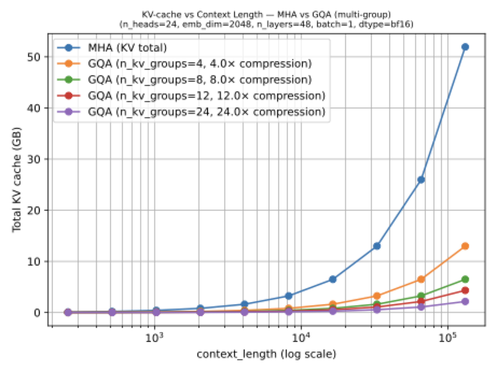
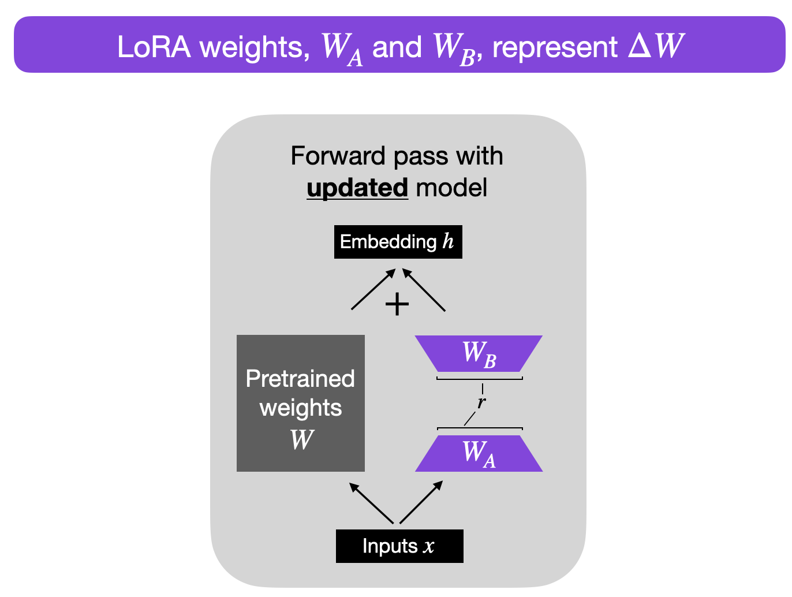

## 들어가며 (Overview)

이번 강의의 목표는 **Transformer의 효율성(efficiency)과 확장성(scalability)을 끌어올린 현대적 기법들**을 이해하는 것입니다. 단순히 개념만 나열하는 것이 아니라, **OpenAI가 공개한 gpt-oss 모델 패밀리**([github.com/openai/gpt-oss](https://github.com/openai/gpt-oss))를 실제 레퍼런스 구현으로 삼아, 각 구성요소가 왜 필요하고 어떻게 동작하는지를 코드 수준에서 확인해 보겠습니다.

다룰 주제는 다음 네 가지입니다.

1. **Architecture Overview**: gpt-oss 전체 구조 조망
2. **Building Blocks**: RMSNorm & SwiGLU
3. **Attention Variants**: MHA, MQA, GQA
4. **LoRA**: Low-Rank Adaptation (저랭크 적응)

표준 Transformer(LayerNorm + GELU + MHA)와 비교하면서 읽으면, "왜 최신 LLM들은 약속이나 한 듯 비슷한 구조로 수렴했는가"라는 질문에 대한 직관을 얻으실 수 있을 것입니다.

---

## 1. 아키텍처 개요 (Architecture Overview: gpt-oss)

**gpt-oss**는 OpenAI가 공개한 **오픈 웨이트(open-weight) 모델 패밀리**입니다(Apache 2.0 라이선스, 2025년 6월). 흥미로운 점은 **두 모델(20b, 120b)이 정확히 동일한 아키텍처를 공유하며, 오직 깊이(layer 수)와 전문가(expert) 수에서만 차이가 난다**는 것입니다.

| Property | gpt-oss-20b | gpt-oss-120b |
|---|:---:|:---:|
| **Total parameters** | 21B | 117B |
| **Active parameters** | 3.6B | 5.1B |
| **Layers** | 24 | 36 |
| **Experts (MoE)** | 32 | 128 |
| **Experts per token** | 4 | 4 |
| **Hidden size** | 2,880 | 2,880 |
| **Attention heads** | 64 | 64 |
| **KV heads (GQA)** | 8 | 8 |
| **Head dimension** | 64 | 64 |
| **Sliding window** | 128 | 128 |
| **Normalization** | RMSNorm | RMSNorm |
| **Activation** | SwiGLU | SwiGLU |
| **Position encoding** | RoPE + YaRN | RoPE + YaRN |

### 1.1 표에서 읽어야 할 핵심 포인트

- **Total parameters vs. Active parameters**: 두 모델 모두 **MoE(Mixture-of-Experts)** 구조를 사용합니다. 전체 파라미터는 매우 크지만(21B / 117B), 토큰 하나를 처리할 때 실제로 활성화되는 파라미터는 일부(3.6B / 5.1B)에 불과합니다.
  - gpt-oss-120b의 경우 전문가 128개 중 토큰당 4개만 사용하므로, 활성화 비율(active ratio)은 $4/128 \approx 3.1\%$ 입니다.
  - gpt-oss-20b는 전문가 32개 중 4개를 사용하므로 $4/32 = 12.5\%$ 입니다.
  - 즉, **거대한 용량(capacity)을 가지면서도 추론(inference) 비용은 작게 유지**하는 것이 MoE의 핵심 동기입니다. (MoE 자체는 다음 강의에서 다룹니다.)

- **공유되는 구성요소**: hidden size(2,880), head dimension(64), sliding window(128), 위치 인코딩(RoPE + YaRN), 정규화(RMSNorm), 활성화 함수(SwiGLU)는 두 모델이 동일합니다. 이번 강의에서 이 중 **RMSNorm, SwiGLU, GQA**(64 query heads / 8 KV heads)를 집중적으로 다룹니다.

이 구조를 코드로 옮기면, 모델별로 달라지는 부분(`num_hidden_layers`, `num_experts`)만 인자로 분리하고 나머지는 공통 설정으로 둘 수 있습니다.

```python
@dataclass
class GPTOSSConfig:
    """Configuration for gpt-oss models (github.com/openai/gpt-oss)"""
    num_hidden_layers: int = 36      # 24 for 20b, 36 for 120b
    num_experts: int = 128           # 32 for 20b, 128 for 120b
    experts_per_token: int = 4       # same for both
    vocab_size: int = 201088         # same for both
    hidden_size: int = 2880          # same for both
    intermediate_size: int = 2880    # same for both
    swiglu_limit: float = 7.0        # same for both
    head_dim: int = 64               # same for both
    num_attention_heads: int = 64    # same for both
    num_key_value_heads: int = 8     # same for both
    sliding_window: int = 128        # same for both

# 두 모델은 동일한 아키텍처를 공유 -- layer 수와 expert 수만 다름
configs = {
    "gpt-oss-20b":  GPTOSSConfig(num_hidden_layers=24, num_experts=32),
    "gpt-oss-120b": GPTOSSConfig(num_hidden_layers=36, num_experts=128),
}

for name, cfg in configs.items():
    active_ratio = cfg.experts_per_token / cfg.num_experts
    print(f"{name}:")
    print(f"  Layers: {cfg.num_hidden_layers}, Experts: {cfg.num_experts} (top-{cfg.experts_per_token})")
    print(f"  GQA: {cfg.num_attention_heads} query heads, {cfg.num_key_value_heads} KV heads")
    print(f"  Active ratio: {cfg.experts_per_token}/{cfg.num_experts} = {active_ratio:.1%}")
    print()

print("Shared: hidden=2880, head_dim=64, sliding_window=128, RoPE+YaRN, RMSNorm, SwiGLU")
```

```text
gpt-oss-20b:
  Layers: 24, Experts: 32 (top-4)
  GQA: 64 query heads, 8 KV heads
  Active ratio: 4/32 = 12.5%

gpt-oss-120b:
  Layers: 36, Experts: 128 (top-4)
  GQA: 64 query heads, 8 KV heads
  Active ratio: 4/128 = 3.1%

Shared: hidden=2880, head_dim=64, sliding_window=128, RoPE+YaRN, RMSNorm, SwiGLU
```

이제 이 아키텍처의 구성요소를 하나씩 분해해 보겠습니다.

---

## 2. 기본 빌딩 블록 (Building Blocks: RMSNorm & SwiGLU)

### 2.1 RMSNorm

현대 Transformer(LLaMA, Mistral, gpt-oss)는 기존의 **LayerNorm**을 **RMSNorm**(Zhang & Sennrich, 2019)으로 대체했습니다. 두 정규화의 차이를 수식으로 비교해 보겠습니다.

#### LayerNorm: 평균 중심화 + 분산 정규화

**LayerNorm**은 입력 벡터를 평균이 0, 분산이 1이 되도록 표준화한 뒤, 학습 가능한 스케일($\gamma$)과 시프트($\beta$)를 적용합니다.

$$
\mathrm{LN}(x) = \gamma \cdot \frac{x - \mu}{\sqrt{\sigma^2 + \epsilon}} + \beta,
$$

여기서 평균과 분산은 마지막 차원($d$개의 feature) 전체에 대해 계산됩니다.

$$
\mu = \frac{1}{d}\sum_i x_i, \qquad \sigma^2 = \frac{1}{d}\sum_i (x_i - \mu)^2
$$

- **직관**: $-\mu$ 항은 분포를 원점으로 끌어당기고(**re-centering**), $\sqrt{\sigma^2+\epsilon}$로 나누는 것은 스케일을 맞춥니다(**re-scaling**). $\epsilon$은 분모가 0이 되는 것을 막는 작은 안정화 상수입니다.

#### RMSNorm: 평균 중심화를 제거

RMSNorm의 핵심 아이디어는 **"재중심화(re-centering)는 사실 불필요하고, 재스케일링(re-scaling)만 있어도 학습이 잘 된다"**는 관찰입니다. 따라서 평균 계산을 통째로 제거합니다.

$$
\mathrm{RMSNorm}(x) = \frac{x}{\mathrm{RMS}(x)} \cdot \gamma
$$

$$
\mathrm{RMS}(x) = \sqrt{\frac{1}{d} \sum_{i=1}^{d} x_i^2 + \epsilon}
$$

- LayerNorm과 비교하면 $\mu$를 빼는 단계와 $\beta$(시프트) 항이 사라졌습니다. 분모도 분산($\sigma^2$, 평균에서의 편차의 제곱) 대신 **원점 기준 제곱 평균의 제곱근(Root Mean Square)**을 사용합니다.
- **효과**: 평균과 분산을 계산하던 연산을 생략하기 때문에 **약 10~15% 더 빠르며**, 모델 품질은 LayerNorm과 동등하게 유지됩니다. "공짜에 가까운 속도 향상"이라는 점이 현대 LLM들이 RMSNorm으로 수렴한 이유입니다.

#### 구현 (PyTorch)

```python
class RMSNorm(nn.Module):
    """
    Root Mean Square Normalization (as used in gpt-oss).

    Parameters:
        num_features (int): 마지막 차원의 크기
        eps (float): 수치 안정성을 위한 작은 상수
    """
    def __init__(self, num_features, eps=1e-05):
        super().__init__()
        self.num_features = num_features
        self.eps = eps
        self.scale = nn.Parameter(torch.ones(num_features))   # 학습 가능한 gamma

    def forward(self, x):
        """
        Parameters:
            x (torch.Tensor): (..., num_features) 형태의 입력
        Returns:
            torch.Tensor: 정규화된 출력 (입력과 동일한 shape)
        """
        t, dtype = x.float(), x.dtype
        # rsqrt(mean(x^2) + eps) = 1 / RMS(x)
        t = t * torch.rsqrt(torch.mean(t ** 2, dim=-1, keepdim=True) + self.eps)
        return (t * self.scale).to(dtype)
```

구현 디테일 몇 가지를 짚어보겠습니다.

- **`x.float()`로 승격**: 정규화 통계를 계산할 때는 일시적으로 float32로 올려 수치 안정성을 확보한 뒤, 마지막에 `.to(dtype)`로 원래 정밀도(예: bfloat16)로 되돌립니다. 혼합 정밀도 학습에서 흔히 쓰는 패턴입니다.
- **`torch.rsqrt`**: $1/\sqrt{\cdot}$를 한 번에 계산하는 역제곱근 함수로, $\frac{x}{\mathrm{RMS}(x)}$를 곱셈으로 처리합니다.
- **`self.scale`만 존재**: LayerNorm과 달리 시프트 파라미터 $\beta$가 없으며, 학습 가능한 스케일 $\gamma$(`scale`)만 둡니다.

### 2.2 SwiGLU 활성화 함수 (SwiGLU Activation)

표준 Transformer의 FFN(Feed-Forward Network)은 ReLU 또는 GELU를 사용합니다. 현대 모델은 **SwiGLU**(Shazeer, 2020)라는 **게이트형 활성화(gated activation)**를 사용합니다.

#### 기본 SwiGLU의 정의

SwiGLU는 입력 차원을 절반으로 줄이는 함수입니다. 입력을 두 갈래(gate, linear)로 나눈 뒤, 한쪽에 비선형성을 씌워 다른 쪽을 **게이팅(원소별 곱)**합니다.

$$
\text{SwiGLU}: \mathbb{R}^{B \times L \times 2h} \to \mathbb{R}^{B \times L \times h} \quad \text{where } h = \text{intermediate\_dim}
$$

$$
\text{SwiGLU}(x_{\text{gate}}, x_{\text{linear}}) = \text{SiLU}(x_{\text{gate}}) \odot x_{\text{linear}}, \quad \text{SiLU}(x) = x \cdot \sigma(x)
$$

- **SiLU**(Sigmoid Linear Unit, 일명 Swish): $x \cdot \sigma(x)$로, ReLU처럼 음수를 완전히 죽이지 않고 부드럽게(smooth) 처리하여 **그래디언트 흐름이 더 좋습니다.**
- **게이팅 $\odot$**: gate 갈래가 일종의 "밸브" 역할을 하여 linear 갈래의 정보가 얼마나 통과할지를 조절합니다. 이 곱셈 구조가 단순 활성화보다 표현력을 높입니다.

#### gpt-oss의 변형: 세 가지 차이점

gpt-oss는 위 기본형을 세 가지 측면에서 수정한 변형을 사용합니다.

**(1) 인터리브된 채널 (Interleaved channels)**

이론적으로는 gate와 linear를 위해 별도의 가중치 행렬 두 개($W_{gate}, W_{linear}$)가 필요합니다.

입력 텐서는 다음과 같고($B$: 배치, $L$: 시퀀스 길이),

$$
x \in \mathbb{R}^{B \times L \times dim}
$$

**이전 강의의 구현 방식**은 두 개의 분리된 투영(projection)을 사용했습니다.

$$
W_{gate}, W_{linear} \in \mathbb{R}^{dim \times h}
$$

$$
x_{gate} = xW_{gate}, \qquad x_{linear} = xW_{linear}
$$

$$
x_{gate}, x_{linear} \in \mathbb{R}^{B \times L \times h}
$$

**실제 gpt-oss 구현**은 이를 **하나의 융합된(fused) 투영**으로 처리한 뒤, 짝수/홀수 열로 쪼갭니다.

$$
W \in \mathbb{R}^{dim \times 2 \, h}, \qquad z = xW \in \mathbb{R}^{B \times L \times 2 \, h}
$$

$$
x_{gate}[..., i] = z[..., 2i], \qquad x_{linear}[..., i] = z[..., 2i+1], \quad \text{for } i = 0, 1, \dots, h - 1
$$

$$
x_{gate}, x_{linear} \in \mathbb{R}^{B \times L \times h}
$$

즉, 두 번의 투영 $xW_{gate}, xW_{linear}$를 **한 번의 투영 $xW$ + 짝/홀수 열 분리**로 대체합니다. 행렬 곱을 한 번에 처리하므로 GPU에서 더 효율적입니다. (gate는 짝수 인덱스, linear는 홀수 인덱스에 인터리빙되어 있다는 점이 핵심입니다.)

**(2) 클램핑된 활성화 (Clamped activations)**

gate와 linear 값이 너무 커지면 `sigmoid` 계산에서 오버플로가 발생할 수 있습니다. 이를 막기 위해 `limit=7.0`으로 값을 잘라냅니다(clamp).

$$
x_{\mathrm{gate}} = \min\{x_{\mathrm{gate}},\ \mathrm{limit}\}
$$

$$
x_{\mathrm{linear}} = \max\{\min\{x_{\mathrm{linear}},\ \mathrm{limit}\},\ -\mathrm{limit}\}
$$

- gate는 위쪽만(상한만) 자르고, linear는 양방향($[-\text{limit}, +\text{limit}]$)으로 자릅니다.

**(3) Linear 경로에 바이어스 +1 (Bias on linear path)**

linear 갈래에 `+1`을 더합니다. 이렇게 하면 가중치가 0에 가까워도 linear 경로가 여전히 기여(약 $x_{linear}+1$)할 수 있어, 학습 초기에 신호가 죽지 않습니다.

$$
\text{output} = \text{SiLU}(x_{\text{gate}}) \odot (x_{\text{linear}} + 1)
$$

또한 SiLU의 시그모이드에 스케일 계수 $\alpha = 1.702$를 적용합니다.

$$
\text{SiLU}(x) = x \cdot \sigma(\alpha x), \qquad \alpha = 1.702
$$

- $\alpha = 1.702$는 SiLU(Swish)가 **GELU를 근사**하도록 맞춰진 값입니다. 즉, gpt-oss의 SiLU는 사실상 GELU의 부드러운 근사로 동작합니다.

#### 구현 (PyTorch)

```python
def swiglu(z, alpha=1.702, limit=7.0):
    """
    Clamped SwiGLU activation (gpt-oss style).

    입력은 gate/linear 채널이 인터리빙되어 있음: 짝수 인덱스 = gate, 홀수 = linear.

    Parameters:
        z (torch.Tensor): (..., 2 * intermediate_dim) 형태의 입력
        alpha (float): sigmoid 스케일 계수
        limit (float): 수치 안정성을 위한 clamp 값
    Returns:
        torch.Tensor: (..., intermediate_dim) 형태의 출력
    """
    x_gate, x_linear = z[..., ::2], z[..., 1::2]            # (1) 짝/홀 인터리브 분리
    x_gate = x_gate.clamp(min=None, max=limit)             # (2) gate: 상한만 clamp
    x_linear = x_linear.clamp(min=-limit, max=limit)       # (2) linear: 양방향 clamp
    out_gate = x_gate * torch.sigmoid(alpha * x_gate)      # SiLU(alpha*x)
    return out_gate * (x_linear + 1)                       # (3) linear에 +1 바이어스
```

`z[..., ::2]`(짝수 인덱스)와 `z[..., 1::2]`(홀수 인덱스)를 통해 인터리빙된 채널을 분리하는 부분이 위 수식 (1)의 짝/홀 분할에 정확히 대응합니다.

#### 차원 검증 및 LayerNorm과의 비교

```python
# RMSNorm 테스트
batch_size, seqlen = 2, 10
dim, h = 64, 256
x = torch.randn(batch_size, seqlen, dim)
rms_norm = RMSNorm(dim)
x_norm = rms_norm(x)
print("RMSNorm:")
print(f"  Input: {x.shape} -> Output: {x_norm.shape}")
print(f"  Output mean: {x_norm.mean(dim=-1)[0][0]:.4f} (NOT zero-centered, unlike LayerNorm)")

# SwiGLU 테스트: 마지막 차원이 절반으로 (인터리브된 gate+linear -> output)
z = torch.randn(batch_size, seqlen, 2*h)  # 512 = 2 * 256
out = swiglu(z)
print("SwiGLU:")
print(f"  Input: {x.shape} (2 * intermediate_dim)")
print(f"  Output: {out.shape} (intermediate_dim)")
```

- **RMSNorm의 출력 평균은 0이 아닙니다.** LayerNorm은 재중심화 때문에 출력 평균이 0이지만, RMSNorm은 평균 중심화를 하지 않으므로 출력 평균이 0이 아닙니다. 이 차이를 직접 확인하는 것이 위 테스트의 목적입니다.
- **SwiGLU는 마지막 차원을 절반으로 줄입니다.** $2h$ 입력이 $h$ 출력으로 바뀝니다(인터리빙된 gate/linear를 합치므로).

---

## 3. 어텐션 변형 (Attention Variants: MHA, MQA, GQA)

Lecture 7에서 구현한 **Multi-Head Attention(MHA)**에서는 모든 헤드가 각자의 Query, Key, Value 투영을 가집니다. 현대 LLM은 **여러 Query 헤드가 Key/Value 헤드를 공유**하는 변형을 사용하여, 추론 시 메모리를 줄입니다.


### 3.1 세 가지 변형의 비교

- **MQA**(Multi-Query Attention): 모든 query 헤드가 **단 하나의** KV 헤드를 공유합니다. PaLM, Falcon에서 사용.
- **GQA**(Grouped Query Attention): query 헤드들을 그룹으로 묶어 그룹별로 KV 헤드를 공유합니다. **LLaMA 2/3, Mistral, Gemma**에서 사용.
- **GQA는 일반화된 형태**입니다: 그룹 수를 $g$라 할 때,
  - $g = h$ (헤드 수와 같음) 이면 **MHA**와 동일,
  - $g = 1$ 이면 **MQA**와 동일.
- **gpt-oss**는 두 모델 모두 **64 query heads / 8 KV heads (8:1 비율)** GQA를 사용하며, **융합 QKV 투영**(하나의 linear layer)으로 구현합니다.

KV 캐시 크기를 변형별로 정리하면 다음과 같습니다.

| Variant | Query heads | KV heads | KV cache size per layer |
|---|:---:|:---:|:---:|
| **MHA** | $h$ | $h$ | $2 h d_h n$ |
| **MQA** | $h$ | $1$ | $2 d_h n$ |
| **GQA** | $h$ | $g$ | $2 g d_h n$ |

여기서 $h$ = query 헤드 수, $g$ = KV 그룹 수, $d_h$ = head dimension, $n$ = 시퀀스 길이입니다. KV 캐시에 Key와 Value 두 가지를 저장하므로 앞에 계수 $2$가 붙습니다. **KV 헤드 수($g$)에 캐시 크기가 정비례**한다는 점이 핵심입니다.

### 3.2 `repeat_kv`: KV 헤드 브로드캐스팅

Query 헤드보다 KV 헤드가 적을 때, 어텐션 점수를 계산하려면 각 KV 헤드를 **반복(repeat)**하여 Query 헤드 수에 맞춰야 합니다.

예를 들어 $h=8$ query 헤드, $g=2$ KV 헤드라면, 각 KV 헤드는 $h/g = 4$개의 query 헤드가 공유합니다.

```python
def repeat_kv(x, n_rep):
    """
    KV 헤드를 query 헤드 수에 맞도록 반복.

    Parameters:
        x (torch.Tensor): (batch, n_kv_heads, seqlen, head_dim)
        n_rep (int): 각 KV 헤드를 반복할 횟수
    Returns:
        torch.Tensor: (batch, n_kv_heads * n_rep, seqlen, head_dim)
    """
    if n_rep == 1:
        return x
    batch, n_kv_heads, seqlen, head_dim = x.shape
    # 새 축(None)을 끼워 expand로 가상 복제 후 reshape으로 실제 차원에 펼침
    x = x[:, :, None, :, :].expand(batch, n_kv_heads, n_rep, seqlen, head_dim)
    return x.reshape(batch, n_kv_heads * n_rep, seqlen, head_dim)
```

- **동작 원리**: `x[:, :, None, :, :]`로 새로운 축을 삽입한 뒤 `expand`로 메모리 복사 없이 가상으로 늘리고, 마지막에 `reshape`으로 KV 헤드 축에 실제로 펼칩니다.
- **반복 순서가 중요**: KV 헤드 0의 복사본이 출력 헤드 0~3에, KV 헤드 1의 복사본이 출력 헤드 4~7에 놓입니다(블록 단위 반복). 이 순서가 query 헤드 그룹화와 일관되어야 합니다.

```python
batch_size, seqlen = 2, 10
n_kv_heads, head_dim = 2, 4
x = torch.arange(batch_size*n_kv_heads*seqlen*head_dim).reshape(
        batch_size, n_kv_heads, seqlen, head_dim).float()

y = repeat_kv(x, n_rep=4)  # 각 KV 헤드를 4번 반복 -> 총 8개
print("Output shape:", y.shape)
print("Output head 0:", y[0, 0, 0], "(copy of KV head 0)")
print("Output head 3:", y[0, 3, 0], "(copy of KV head 0)")
print("Output head 4:", y[0, 4, 0], "(copy of KV head 1)")
print("Output head 7:", y[0, 7, 0], "(copy of KV head 1)")
```

출력에서 헤드 0~3은 모두 입력 KV 헤드 0의 복사본, 헤드 4~7은 KV 헤드 1의 복사본임을 확인할 수 있습니다.

### 3.3 Grouped Query Attention (gpt-oss style)

이제 MHA, GQA, MQA를 모두 지원하는 **통합 어텐션 클래스**를 gpt-oss 설계를 따라 구현합니다. 세 가지 설계 포인트가 있습니다.

1. **융합 QKV 투영(Fused QKV projection)**: 하나의 `nn.Linear`로 Q, K, V를 한 번에 만듭니다(3개 분리 레이어보다 효율적).
2. **RMSNorm**: 어텐션 전에 사전 정규화(pre-normalization)를 적용합니다(gpt-oss 스타일).
3. **슬라이싱으로 분할**: 융합된 출력을 잘라서 Q, K, V를 추출합니다.

#### 융합 투영의 수식적 유도

입력과 융합 가중치는 다음과 같습니다.

$$
x \in \mathbb{R}^{B \times L \times dim}, \qquad W_{qkv} \in \mathbb{R}^{dim \times head\_dim (n\_heads + 2\, n\_kv\_heads)}
$$

여기서 `head_dim`은 헤드 차원, `n_heads`는 query 헤드 수, `n_kv_heads`는 KV 헤드 수입니다. 출력 차원이 $head\_dim \cdot (n\_heads + 2\, n\_kv\_heads)$인 이유는 **Q는 `n_heads`개, K와 V는 각각 `n_kv_heads`개**의 헤드가 필요하기 때문입니다($1 \cdot n\_heads + 2 \cdot n\_kv\_heads$).

융합 투영의 결과는

$$
qkv = xW_{qkv} \in \mathbb{R}^{B \times L \times head\_dim (n\_heads + 2\, n\_kv\_heads)}.
$$

이제 Q와 KV의 차원을 정의합니다.

$$
q\_dim = n\_heads \times head\_dim, \qquad kv\_dim = n\_kv\_heads \times head\_dim.
$$

$q$, $k$, $v$는 마지막 차원을 **순서대로 슬라이싱**하여 얻습니다.

$$
q = qkv[..., :q\_dim] \in \mathbb{R}^{B \times L \times q\_dim},
$$

$$
k = qkv[..., q\_dim:q\_dim+kv\_dim] \in \mathbb{R}^{B \times L \times kv\_dim},
$$

$$
v = qkv[..., q\_dim+kv\_dim:] \in \mathbb{R}^{B \times L \times kv\_dim}.
$$

reshape 후의 형태는 다음과 같습니다.

$$
q \rightarrow \mathbb{R}^{B \times n\_heads \times L \times head\_dim},
$$

$$
k, v \rightarrow \mathbb{R}^{B \times n\_kv\_heads \times L \times head\_dim}.
$$

이후 `repeat_kv`로 $k, v$의 헤드 수를 $n\_kv\_heads \to n\_heads$로 맞춘 뒤, 표준 스케일드 닷-프로덕트 어텐션을 수행합니다.

#### 구현 (PyTorch)

```python
class GroupedQueryAttention(nn.Module):
    def __init__(self, dim, n_heads, n_kv_heads=None):
        """
        Grouped Query Attention (gpt-oss style), MHA/GQA/MQA 모두 지원.

        Parameters:
            dim (int): 모델 차원
            n_heads (int): query 헤드 수
            n_kv_heads (int): KV 헤드 수 (기본값 = n_heads = 표준 MHA)
        """
        super().__init__()
        if n_kv_heads is None:
            n_kv_heads = n_heads
        assert n_heads % n_kv_heads == 0, "n_heads must be divisible by n_kv_heads"

        self.n_heads = n_heads
        self.n_kv_heads = n_kv_heads
        self.head_dim = dim // n_heads
        self.n_rep = n_heads // n_kv_heads          # KV 헤드당 query 헤드 수

        # 융합 QKV 투영 및 출력 투영
        qkv_dim = self.head_dim * (n_heads + 2 * n_kv_heads)
        self.qkv = nn.Linear(dim, qkv_dim, bias=False)
        self.out = nn.Linear(n_heads * self.head_dim, dim, bias=False)

        self.norm = RMSNorm(dim)
        self.sm_scale = 1 / math.sqrt(self.head_dim)   # 1/sqrt(d_h) 스케일링

    def forward(self, x, mask=None):
        """
        Parameters:
            x (torch.Tensor): (batch, seq, dim)
            mask (torch.Tensor): (seq, seq) 또는 None
        Returns:
            torch.Tensor: (batch, seq, dim)
        """
        bsz, seqlen, _ = x.shape
        t = self.norm(x)                               # pre-norm (RMSNorm)

        qkv = self.qkv(t)                              # 융합 투영
        q_dim = self.n_heads * self.head_dim
        kv_dim = self.n_kv_heads * self.head_dim

        # 슬라이싱으로 q, k, v 분리
        q = qkv[:, :, :q_dim]
        k = qkv[:, :, q_dim:q_dim + kv_dim]
        v = qkv[:, :, q_dim + kv_dim:]

        # 멀티헤드 형태로 reshape & transpose
        q = q.reshape(bsz, seqlen, self.n_heads,    self.head_dim).transpose(1, 2)
        k = k.reshape(bsz, seqlen, self.n_kv_heads, self.head_dim).transpose(1, 2)
        v = v.reshape(bsz, seqlen, self.n_kv_heads, self.head_dim).transpose(1, 2)

        # KV 헤드를 query 헤드 수에 맞게 반복
        k = repeat_kv(k, self.n_rep)
        v = repeat_kv(v, self.n_rep)

        # 스케일드 닷-프로덕트 어텐션
        scores = torch.matmul(q, k.transpose(2, 3)) * self.sm_scale
        if mask is not None:
            scores = scores + mask
        attn = F.softmax(scores, dim=-1)
        output = torch.matmul(attn, v)

        output = output.transpose(1, 2).reshape(bsz, seqlen, -1)
        return self.out(output)
```

이 구조에서 어텐션 점수는 $\frac{QK^\top}{\sqrt{d_h}}$로 계산하고 softmax를 취한 뒤 $V$를 곱합니다. `sm_scale` $= 1/\sqrt{d_h}$는 내적 값이 차원에 비례해 커지는 것을 보정해 softmax의 그래디언트가 포화되지 않게 하는 표준 스케일링입니다.

#### 동일 클래스로 MHA/GQA/MQA 전환

`n_kv_heads` 인자 하나로 세 가지 변형을 모두 만들 수 있습니다.

```python
batch_size, seqlen, dim = 2, 10, 64
n_heads = 8
head_dim = dim // n_heads

# MHA: n_kv_heads = 8 (= n_heads)
mha = GroupedQueryAttention(dim, n_heads, n_kv_heads=8)
# GQA: n_kv_heads = 2
gqa = GroupedQueryAttention(dim, n_heads, n_kv_heads=2)
# MQA: n_kv_heads = 1
mqa = GroupedQueryAttention(dim, n_heads, n_kv_heads=1)
```

융합 QKV 투영의 출력 차원은 $head\_dim \cdot (n\_heads + 2\, n\_kv\_heads)$이므로,

- **MHA** ($n\_kv\_heads=8$): $8 \cdot (8 + 16) = 192$ (Q:64 + K:64 + V:64)
- **GQA** ($n\_kv\_heads=2$): $8 \cdot (8 + 4) = 96$ (Q:64 + K:16 + V:16)
- **MQA** ($n\_kv\_heads=1$): $8 \cdot (8 + 2) = 80$ (Q:64 + K:8 + V:8)

KV 헤드가 줄어들수록 **K, V 투영 파라미터와 KV 캐시가 함께 줄어드는 것**을 차원 수에서 직접 확인할 수 있습니다.

### 3.4 벤치마크: KV 캐시 메모리 (Benchmark: KV cache memory)

Lecture 10에서 다룬 자기회귀(autoregressive) 생성에서는, 재계산을 피하기 위해 Key/Value 텐서를 캐싱합니다. 이 **KV 캐시의 크기가 생성 가능한 최대 시퀀스 길이를 결정**합니다.

레이어당 KV 캐시 크기는 다음과 같습니다(Key + Value).

$$
\text{KV cache size per layer} = 2 \times n_{\text{kv}} \times d_h \times n
$$



실제로 gpt-oss-120b 규모에 가까운 차원으로 KV 캐시 크기를 계산해 비교해 보겠습니다.

```python
# KV 캐시 크기 비교 (gpt-oss-120b 차원 포함)
dim = 4096
n_heads = 32
head_dim = dim // n_heads
seqlen = 4096
n_layers = 32

configs = {
    "MHA (kv=32)": 32,
    "GQA-8 (kv=8)": 8,
    "GQA-4 (kv=4)": 4,
    "GQA-2 (kv=2)": 2,
    "MQA (kv=1)": 1,
}

for name, n_kv in configs.items():
    # 2(K,V) * n_kv * head_dim * seqlen * 2(bytes, float16) * n_layers
    size_bytes = 2 * n_kv * head_dim * seqlen * 2 * n_layers
    size_mb = size_bytes / (1024 ** 2)
    print(f"{name:20s}: {size_mb:8.1f} MB")

# gpt-oss-120b: 8 KV heads, head_dim=64, 36 layers
gpt_oss_kv = 2 * 8 * 64 * seqlen * 2 * 36 / (1024**2)
print(f"{'gpt-oss-120b (kv=8)':20s}: {gpt_oss_kv:8.1f} MB  (head_dim=64, 36 layers)")
```

- 계산식의 마지막 `* 2`는 float16(2바이트) 가정에서 비롯됩니다.
- **MHA 대비 GQA-8은 KV 캐시를 약 $4\times$, MQA는 약 $32\times$ 줄입니다**(이 설정 기준). 즉 KV 헤드 수 $n_\text{kv}$에 메모리가 정확히 비례합니다.

### 3.5 GQA의 트레이드오프 요약

GQA는 **유리한 트레이드오프**를 달성합니다. KV 캐시 메모리를 크게 줄이고 추론 속도를 높이면서도, 품질은 완전한 MHA에 가깝게 유지합니다. gpt-oss는 8:1 비율(64 query heads, 8 KV heads)을 채택했습니다. MQA처럼 극단적으로 KV를 1개로 줄이면 메모리는 최소가 되지만 표현력 손실이 커질 수 있으므로, GQA는 그 중간 지점에서 균형을 잡는 전략입니다.

---

## 4. LoRA: 저랭크 적응 (Low-Rank Adaptation)

거대 모델의 **모든 파라미터를 미세조정(full fine-tuning)하는 것은 매우 비쌉니다.** 예를 들어 gpt-oss-120b는 117B 파라미터(더 작은 gpt-oss-20b도 21B)를 가지는데, **옵티마이저 상태(optimizer state)만 저장해도 약 700GB**가 필요합니다.

### 4.1 LoRA의 핵심 아이디어

**LoRA**(Hu et al., 2021)는 원본 가중치를 **동결(freeze)**하고, 작은 **저랭크(low-rank) 행렬** 두 개를 더하는 방식입니다.

$$
W' = W + \frac{\alpha}{r} A B
$$

여기서 $A \in \mathbb{R}^{d_{\text{in}} \times r}$, $B \in \mathbb{R}^{r \times d_{\text{out}}}$ 이며, **랭크 $r \ll \min(d_{\text{in}}, d_{\text{out}})$** 입니다.

- **왜 저랭크인가?**: 미세조정으로 인한 가중치 변화 $\Delta W$가 사실상 **낮은 랭크**를 가진다는 경험적 관찰에 기반합니다. $\Delta W \approx \frac{\alpha}{r}AB$로 근사하면, 전체 $d_\text{in} \times d_\text{out}$ 행렬 대신 $(d_\text{in} \cdot r) + (r \cdot d_\text{out})$개의 파라미터만 학습하면 됩니다.
- **스케일 $\frac{\alpha}{r}$**: 랭크 $r$을 바꿔도 적응 항의 크기가 일정하게 유지되도록 하는 정규화 계수입니다.



### 4.2 영(zero) 초기화: 항등 시작

$B$를 **0으로 초기화**하므로, LoRA는 학습 시작 시점에 원본과 동일합니다.

$$
W' = W + \frac{\alpha}{r} A \cdot 0 = W
$$

- 이는 매우 중요한 설계입니다. 학습 초기에 LoRA 항이 모델 동작을 망가뜨리지 않고, **사전학습된 모델의 동작에서 출발하여 점진적으로 적응**하도록 보장합니다.

추론 시점에는 저랭크 행렬을 원본 가중치에 **병합(merge)**하여 $W' = W + \frac{\alpha}{r}AB$로 합칠 수 있으므로, **추가 추론 오버헤드가 전혀 없습니다(zero overhead).**

### 4.3 구현 (PyTorch)

```python
class LoRALinear(nn.Module):
    """
    기존 nn.Linear를 저랭크 적응으로 래핑.

    Parameters:
        linear (nn.Linear): 동결할 원본 linear 레이어
        rank (int): 저랭크 행렬의 랭크
        alpha (float): 스케일 계수
    """
    def __init__(self, linear, rank, alpha=1.0):
        super().__init__()
        self.linear = linear
        self.rank = rank
        self.alpha = alpha
        self.scaling = alpha / rank                 # alpha / r

        in_features = linear.in_features
        out_features = linear.out_features

        # 저랭크 행렬 A, B 생성
        self.A = nn.Parameter(torch.randn(in_features, rank) * (1.0 / math.sqrt(in_features)))
        self.B = nn.Parameter(torch.zeros(rank, out_features))   # B는 0으로 초기화

        # 원본 linear 레이어 동결
        self.linear.weight.requires_grad = False
        if self.linear.bias is not None:
            self.linear.bias.requires_grad = False

    def forward(self, x):
        """
        Parameters:
            x (torch.Tensor): (..., in_features)
        Returns:
            torch.Tensor: (..., out_features)
        """
        original = self.linear(x)
        # output = 원본 + 저랭크 적응항
        lora = torch.matmul(torch.matmul(x, self.A), self.B) * self.scaling
        return original + lora

    def merge(self):
        """LoRA 가중치를 원본 레이어에 병합 (추론 비용 0)."""
        self.linear.weight.data += (self.scaling * torch.matmul(self.A, self.B))
        return self.linear
```

구현 디테일을 짚어보겠습니다.

- **`A`는 작은 랜덤, `B`는 0**: $A$는 $1/\sqrt{d_\text{in}}$ 스케일로 랜덤 초기화하여 대칭성을 깨고, $B$는 0으로 초기화하여 항등 시작을 보장합니다. (둘 다 0이면 그래디언트가 흐르지 못하므로 한쪽만 0으로 둡니다.)
- **`forward`의 곱셈 순서**: $x A B$를 $(x A) B$ 순으로 계산하면, 중간 텐서가 $r$ 차원으로 좁아져 메모리·연산이 절약됩니다.
- **`requires_grad = False`**: 원본 가중치를 동결하여 학습 대상에서 제외합니다. 학습되는 것은 $A$, $B$뿐입니다.

### 4.4 항등 시작 검증

```python
batch_size, seqlen = 2, 10
d_in, d_out = 64, 128
original_linear = nn.Linear(d_in, d_out)
lora_linear = LoRALinear(original_linear, rank=4, alpha=1.0)

x = torch.randn(batch_size, seqlen, d_in)
y_original = original_linear(x)
y_lora = lora_linear(x)
print("Difference at init (should be ~0):", (y_original - y_lora).abs().max().item())

total_params = sum(p.numel() for p in original_linear.parameters())
lora_params = lora_linear.A.numel() + lora_linear.B.numel()
print(f"Original parameters : {total_params:,}")
print(f"LoRA parameters (r=4): {lora_params:,}")
print(f"Ratio: {lora_params / total_params * 100:.2f}%")
```

- 초기 출력 차이가 거의 0임을 확인할 수 있습니다($B=0$이므로). 이는 LoRA가 원본 동작에서 출발한다는 4.2절의 주장을 실증합니다.

### 4.5 파라미터 효율성 (Parameter efficiency)

여러 레이어 크기와 LoRA 랭크에 대해, 학습 가능한 파라미터 수를 비교해 보겠습니다.

```python
layer_sizes = [(1024, 1024), (2048, 2048), (4096, 4096), (4096, 11008)]
ranks = [1, 2, 4, 8, 16, 32, 64]

# LoRA 파라미터 = d_in * r + r * d_out
# Full 파라미터  = d_in * d_out

d_in, d_out = 4096, 4096
print(f"For a {d_in}x{d_out} layer (full: {d_in*d_out:,} params):")
for r in [4, 8, 16]:
    lp = d_in * r + r * d_out
    print(f"  Rank {r:2d}: {lp:>8,} params ({lp/(d_in*d_out)*100:.3f}%)")
```

```text
For a 4096x4096 layer (full: 16,777,216 params):
  Rank  4:   32,768 params (0.195%)
  Rank  8:   65,536 params (0.391%)
  Rank 16:  131,072 params (0.781%)
```


위 출력에서 보듯, $4096 \times 4096$ 레이어(전체 약 1,678만 파라미터)를 미세조정할 때 **LoRA(랭크 16)는 전체의 약 0.78%만으로 적응이 가능**합니다. 랭크가 작을수록, 그리고 원본 레이어가 클수록 절감 효과가 극대화됩니다.

**결론적으로 LoRA는 소비자용 하드웨어(consumer hardware)에서도 거대 모델의 미세조정을 현실적으로 가능하게 만듭니다.**

---

## 5. 요약 (Summary)

이번 강의에서 다룬 **현대 Transformer 구성요소**를 정리하면 다음과 같습니다.

| Technique | 해결한 문제 | 핵심 이점 | 사용 모델 |
|---|---|---|---|
| **RMSNorm** | LayerNorm의 연산 오버헤드 | 약 10~15% 빠르고 품질 동등 | LLaMA, Mistral, **gpt-oss** |
| **SwiGLU** | ReLU/GELU의 한계 | 더 나은 그래디언트 흐름, 게이트형 활성화 | LLaMA, Mistral, **gpt-oss** |
| **GQA** | 너무 큰 KV 캐시 | 최대 $8\times$ 메모리 절감 | LLaMA 2/3, Mistral, **gpt-oss** |

**파라미터 효율적 미세조정(PEFT)** 기법:

| Technique | 해결한 문제 | 핵심 이점 | 사용 사례 |
|---|---|---|---|
| **LoRA** | 미세조정 비용이 너무 큼 | 학습 파라미터 $100\times$ 감소 | QLoRA, PEFT, 대부분의 미세조정 |

이번 강의에서는 핵심 Transformer 빌딩 블록과 실용적 미세조정 기법 하나를 다뤘습니다.

- **RMSNorm pre-norm + SwiGLU 활성화**
- **GQA**(64 query heads, 8 KV heads)를 통한 KV 캐시 메모리 절감
- **LoRA**를 통한 파라미터 효율적 미세조정

다음 강의에서는 또 다른 핵심 Transformer 빌딩 블록인 **MoE(Mixture-of-Experts)**와 **Sliding Window Attention**을 다룰 예정입니다.