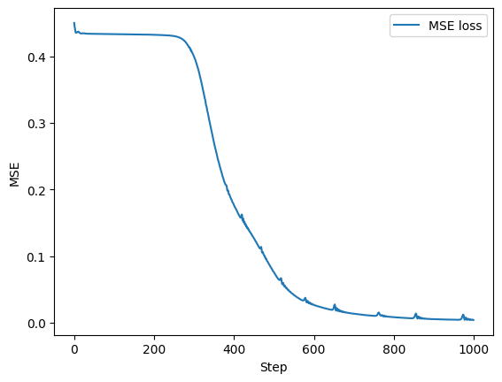

## 들어가며 (Introduction)

**PyTorch**는 신경망 학습·추론을 위한 거의 모든 도구를 제공하는 파이썬 라이브러리입니다. 이번 강의에서 우리가 PyTorch를 통해 얻게 될 핵심 기능은 다음 네 가지입니다.

* **자동 미분(automatic differentiation):** 우리가 직접 손으로 미분 공식을 유도하지 않아도, 계산 그래프를 따라 그래디언트를 자동으로 계산해 줍니다.
* **신경망 모듈(neural network modules):** 선형 레이어, 활성화 함수처럼 자주 쓰이는 구성요소들이 미리 구현되어 있어 즉시 가져다 쓸 수 있습니다.
* **옵티마이저(optimizer):** SGD, RMSProp, Adam 등 파라미터 업데이트 알고리즘이 내장되어 있습니다.
* **각종 유틸리티:** GPU 가속, 가중치 저장/불러오기 등 학습 파이프라인을 구성하는 데 필요한 편의 기능을 제공합니다.

이 글에서는 다음 순서로 PyTorch의 사용법을 익혀 보겠습니다.

1. **Basic Modules** — 선형 레이어와 MLP를 직접 만들어 보기
2. **Gradient Computation** — 자동 미분으로 그래디언트 계산하기
3. **Loss Function and Optimizer** — 손실함수와 옵티마이저로 실제 모델 학습시키기
4. **Using GPU to Accelerate Computations** — GPU로 연산을 가속하기

::: {.callout-note}
이 실습은 GPU 런타임을 연결한 상태에서 진행해야 합니다. Colab 기준으로는 `Edit → Notebook Settings`에서 Hardware Accelerator를 **GPU**로 설정한 뒤, `!nvidia-smi` 명령으로 GPU가 정상적으로 할당되었는지 확인할 수 있습니다.
:::

```python
!nvidia-smi
```

---

## 1. 기본 모듈: 선형 레이어와 MLP (Basic Modules: Linear Layer and MLP)

PyTorch는 기본적인 신경망 모듈들과 함께, 임의의 신경망 구조를 구현할 수 있는 **`nn.Module` API**를 제공합니다. 이 API를 사용하면 GPU 가속과 자동 미분을 모두 자동으로 누리면서, 우리가 원하는 형태의 네트워크를 자유롭게 조립할 수 있습니다.

이 절에서는 미리 정의된 선형 레이어(linear layer)를 사용해 보고, 이러한 기본 구성요소들을 조합하여 **MLP(Multi-Layer Perceptron)** 를 직접 구현해 보겠습니다.

### 1.1. 선형 레이어 (Linear Layer)

선형 레이어는 신경망에서 가장 기본이 되는 연산으로, `torch.nn.Linear`에 이미 구현되어 있습니다.

#### 선형 레이어가 수행하는 연산

입력 벡터 $x \in \mathbb{R}^{d_{\text{in}}}$에 대해, 선형 레이어는 가중치 행렬 $W \in \mathbb{R}^{d_{\text{out}} \times d_{\text{in}}}$와 편향(bias) $b \in \mathbb{R}^{d_{\text{out}}}$를 사용하여 다음과 같은 아핀 변환(affine transformation)을 수행합니다.

$$
y = W x + b, \qquad y \in \mathbb{R}^{d_{\text{out}}}
$$

* 실제로 미니배치 단위로 데이터가 들어오므로, 배치 크기 $N$에 대한 입력 행렬 $X \in \mathbb{R}^{N \times d_{\text{in}}}$를 고려하면 PyTorch 내부 구현은 다음 형태가 됩니다.

$$
Y = X W^{\top} + \mathbf{1}_N \, b^{\top}, \qquad Y \in \mathbb{R}^{N \times d_{\text{out}}}
$$

* 여기서 $W^{\top} \in \mathbb{R}^{d_{\text{in}} \times d_{\text{out}}}$이며, $\mathbf{1}_N b^{\top}$는 편향 벡터를 모든 행(샘플)에 동일하게 더해 주는 **브로드캐스팅(broadcasting)** 을 의미합니다.
* 즉, 입력의 **마지막 차원**만 $d_{\text{in}} \to d_{\text{out}}$으로 바뀌고, 배치 차원은 그대로 보존됩니다.

#### 사용 예시

`nn.Linear(input_dim, output_dim)`으로 레이어를 생성한 뒤, 입력 텐서를 함수처럼 호출하면 출력이 계산됩니다.

```python
import torch
import torch.nn as nn

batch_size = 2
input_dim = 64
output_dim = 256

# Random input tensor
x = torch.randn(batch_size, input_dim)

# Compute linear function output
linear = nn.Linear(input_dim, output_dim)
y = linear(x)

print("input size  :", x.shape)
print("output size :", y.shape)
```

실행 결과는 다음과 같습니다.

```text
input size  : torch.Size([2, 64])
output size : torch.Size([2, 256])
```

* 입력은 $[2, 64]$, 출력은 $[2, 256]$로, **배치 차원(2)은 유지된 채 특징 차원만 $64 \to 256$으로 변환**되었음을 확인할 수 있습니다. 이는 위에서 설명한 $Y = XW^\top + b$의 차원 변화와 정확히 일치합니다.

### 1.2. 활성화 함수 (Activation Functions)

선형 레이어만 쌓으면 전체 네트워크가 결국 하나의 선형 변환으로 축약되어 버립니다(선형 변환의 합성은 여전히 선형). 따라서 신경망에 **비선형성(non-linearity)** 을 부여하는 활성화 함수가 반드시 필요합니다.

PyTorch에서 활성화 함수를 사용하는 방법은 두 가지입니다.

* **모듈 API (Module API):** `torch.nn` 안에 모듈 형태로 구현되어 있습니다. 예) `relu_module = nn.ReLU()`
* **함수형 API (Functional API):** `torch.nn.functional` 안에 순수 함수 형태로 구현되어 있습니다. 예) `y = torch.nn.functional.relu(x)`

두 방식은 동일한 연산을 수행합니다. 대표적인 **ReLU(Rectified Linear Unit)** 의 정의는 다음과 같습니다.

$$
\text{ReLU}(x) = \max(0, x)
$$

즉, 음수 입력은 모두 0으로 만들고 양수 입력은 그대로 통과시킵니다.

```python
x = torch.randn(5)

# Module API
relu_module = nn.ReLU()
relu_1 = relu_module(x)

# Functional API
from torch.nn import functional as F
relu_2 = F.relu(x)

print("ReLU input:", x)
print("ReLU output:", relu_1)
assert torch.all(relu_1 >= 0)
assert torch.all(relu_2 >= 0)
assert torch.allclose(relu_1, relu_2)
```

실행 결과 예시는 다음과 같습니다.

```text
ReLU input:  tensor([-0.7793, -1.0828, -0.0892, -0.4841,  0.6117])
ReLU output: tensor([ 0.0000,  0.0000,  0.0000,  0.0000,  0.6117])
```

* 음수 원소들은 모두 0으로 잘려 나가고, 양수 원소 `0.6117`만 그대로 살아남았습니다.
* 마지막 `assert torch.allclose(relu_1, relu_2)`는 **모듈 API와 함수형 API의 결과가 수치적으로 동일함**을 검증합니다. 즉, 어떤 방식을 쓰든 동일한 연산이라는 점을 확인하는 안전장치입니다.

### 1.3. 모듈 API (Module API)

**모듈 API**는 MLP나 Transformer처럼 여러 구성요소를 조합한 복합적인 신경망을 쌓아 올리기 위한 핵심 API입니다. 사용 절차는 다음과 같습니다.

1. **`nn.Module`을 상속**합니다. 클래스 이름은 `MLP`처럼 직관적으로 짓습니다.
2. **생성자 `__init__()` 안에서 가장 먼저 `super().__init__()`을 호출**한 뒤, 모듈 구성요소들을 클래스 변수로 정의합니다. 예) `self.layer1 = nn.Linear(128, 128)`
3. **`forward` 메서드를 정의**합니다. 모델의 순전파(forward) 연산은 모두 이 `forward` 안에서 이루어집니다.

::: {.callout-tip title="왜 forward만 정의하면 될까?"}
우리는 `__call__` 메서드를 직접 구현할 필요가 없습니다. `nn.Module`의 `__call__` 메서드가 내부적으로 우리가 작성한 `forward`를 자동으로 호출해 주기 때문입니다. 그래서 `model(x)`처럼 모델 객체를 함수처럼 호출하면 `forward(x)`가 실행됩니다. 단순히 `model.forward(x)`를 직접 부르는 것보다 이 방식을 권장하는 이유는, `__call__`이 forward hook 등록·실행 같은 부가 작업을 함께 처리해 주기 때문입니다.
:::

이제 **SiLU 활성화 함수**를 사용하는 3층 MLP를 만들어 보겠습니다. SiLU(Sigmoid Linear Unit, 일명 Swish)의 정의는 다음과 같습니다.

$$
\text{SiLU}(x) = x \cdot \sigma(x) = \frac{x}{1 + e^{-x}}
$$

여기서 $\sigma(\cdot)$는 시그모이드 함수입니다. ReLU와 달리 SiLU는 음수 영역에서도 작은 음의 값을 가지며 모든 점에서 미분 가능(smooth)하다는 특징이 있습니다.

```python
class MLP(nn.Module):
    def __init__(self, dim, hidden_dim):
        super().__init__()
        self.w1 = nn.Linear(dim, hidden_dim)
        self.w2 = nn.Linear(hidden_dim, hidden_dim)
        self.w3 = nn.Linear(hidden_dim, dim)
        self.act_fn = nn.SiLU()

    def forward(self, x):
        h = self.w1(x)
        h = self.act_fn(h)
        h = self.w2(h)
        h = self.act_fn(h)
        output = self.w3(h)
        return output
```

이 MLP가 수행하는 연산을 수식으로 정리하면 다음과 같습니다.

$$
\text{MLP}(x) = W_3 \,\Big(\text{SiLU}\big(W_2 \,\text{SiLU}(W_1 x + b_1) + b_2\big)\Big) + b_3
$$

* 입력 차원 `dim` → 은닉 차원 `hidden_dim` → 은닉 차원 `hidden_dim` → 출력 차원 `dim`으로 흐릅니다.
* **선형 변환($W_1$) → 비선형($\text{SiLU}$) → 선형 변환($W_2$) → 비선형($\text{SiLU}$) → 선형 변환($W_3$)** 의 구조이며, 마지막 출력층에는 활성화를 적용하지 않습니다(회귀 문제에서 출력 범위를 제한하지 않기 위함).

이제 입력과 출력의 형상을 확인해 보겠습니다.

```python
batch_size = 2
input_dim = 32
hidden_dim = 256

x = torch.randn(batch_size, input_dim)
mlp = MLP(input_dim, hidden_dim)
y = mlp(x)  # nn.Module의 __call__이 우리가 구현한 forward를 호출합니다.
print("Model input shape:", x.shape)
print("Model output shape:", y.shape)
print("Model output:", y)
```

```text
Model input shape:  torch.Size([2, 32])
Model output shape: torch.Size([2, 32])
```

* 입력과 출력 모두 $[2, 32]$입니다. MLP를 `MLP(input_dim, hidden_dim)`으로 정의했으므로 출력 차원이 입력 차원과 같은 `dim(=32)`으로 복원됨을 알 수 있습니다.
* 출력 텐서에는 `grad_fn=<AddmmBackward0>`라는 속성이 함께 출력되는데, 이는 이 텐서가 **자동 미분 계산 그래프에 연결되어 있다**는 신호입니다. (이 부분은 2절에서 자세히 다룹니다.)

### 1.4. 모델 가중치 저장과 불러오기 (Saving and Loading Model Weights)

신경망을 성공적으로 학습시킨 뒤에는, 매번 다시 학습하지 않고 재사용할 수 있도록 모델을 저장하고 싶을 때가 많습니다. PyTorch는 이를 위한 간단한 인터페이스를 제공합니다.

* **파라미터 추출:** `weights = model.state_dict()`
  모델의 모든 학습 가능한 파라미터를 **딕셔너리(`OrderedDict`)** 형태로 반환합니다. 키는 파라미터 이름(예: `w1.weight`, `w1.bias`), 값은 텐서입니다.
* **파일로 저장:** `torch.save(weights, "path/to/save")`
* **불러오기:** `model.load_state_dict(torch.load("path/to/save"))`

```python
from rich.pretty import pprint
import rich

# save model parameters
weights = mlp.state_dict()
print("Model weights")
print("Dictionary keys:", weights.keys())
for k, v in weights.items():
    pprint(f"{k}: {v}")

torch.save(weights, "checkpoint.pt")

# instantiate new mlp and load saved parameters
new_mlp = MLP(input_dim, hidden_dim)
weights = torch.load("checkpoint.pt")
new_mlp.load_state_dict(weights)

# check whether two models are same
x = torch.randn(batch_size, input_dim)
y1 = mlp(x)
y2 = new_mlp(x)
assert torch.allclose(y1, y2)
```

이 코드의 검증 논리를 짚어 보면 다음과 같습니다.

* `new_mlp`는 **무작위로 초기화된 새 모델**이므로, 원래 `mlp`와는 가중치가 전혀 다릅니다.
* 하지만 `load_state_dict`로 저장된 가중치를 주입하면, 두 모델은 완전히 동일한 파라미터를 갖게 됩니다.
* 따라서 같은 입력 `x`에 대해 `mlp(x)`와 `new_mlp(x)`의 출력이 일치해야 하며, 마지막 `assert torch.allclose(y1, y2)`가 이를 검증합니다. 이 검증이 통과한다는 것은 **저장과 불러오기가 정확히 동작함**을 의미합니다.

::: {.callout-note}
`state_dict`는 모델의 **구조가 아니라 가중치(값)만** 담고 있습니다. 따라서 불러오기 전에 동일한 구조의 모델(`MLP(input_dim, hidden_dim)`)을 먼저 생성해 두어야 한다는 점에 유의하세요.
:::

---

## 2. 자동 미분 (Automatic Differentiation)

PyTorch의 `backward` 메서드를 사용하면 그래디언트를 **자동으로** 계산할 수 있습니다. 절차는 다음과 같습니다.

1. PyTorch가 추적(track)하는 텐서를 준비합니다 (`requires_grad=True`).
2. 미분하고자 하는 대상인 **스칼라(leaf) 텐서**를 계산합니다.
3. 해당 스칼라 텐서에 대해 `backward()`를 호출합니다.
4. 계산된 그래디언트는 각 텐서의 **`.grad` 속성**에 저장됩니다.

### 동작 원리: 계산 그래프와 역전파

PyTorch는 연산이 수행될 때마다 내부적으로 **동적 계산 그래프(dynamic computational graph)** 를 구성합니다. `requires_grad=True`로 설정된 텐서에서 출발한 모든 연산은 이 그래프의 노드로 기록되고, `backward()`를 호출하면 **연쇄 법칙(chain rule)** 을 따라 그래프를 거꾸로 거슬러 올라가며 그래디언트를 누적 계산합니다.

### 예제: $f(x) = \sum_i x_i^2$의 그래디언트

그래디언트가 알려진 간단한 함수로 자동 미분이 올바르게 동작하는지 검증해 보겠습니다. 다음 함수를 생각합니다.

$$
f(x) = \sum_{i=1}^{n} x_i^2
$$

**단계별 유도(derivation)** 를 보면, $f$를 특정 성분 $x_j$로 편미분할 때 합산 항 중 $x_j^2$만 살아남습니다.

$$
\frac{\partial f}{\partial x_j}
= \frac{\partial}{\partial x_j} \sum_{i=1}^{n} x_i^2
= \frac{\partial}{\partial x_j} x_j^2
= 2 x_j
$$

이를 모든 성분에 대해 모으면 그래디언트 벡터는 다음과 같습니다.

$$
\nabla f(x) = \big(2x_1, 2x_2, \dots, 2x_n\big)^{\top} = 2x
$$

따라서 우리는 PyTorch가 계산한 `x.grad`가 정확히 $2x$와 같은지 확인하면 됩니다.

```python
# Create tensor that is tracked by pytorch autograd engine.
# default is requires_grad=False.
x = torch.randn(10, requires_grad=True)

# Compute leaf tensor.
y = (x ** 2).sum()

# Call backward function.
y.backward()

# Check gradient.
print("leaf tensor:", y)       # y has grad_fn property
print("gradient:", x.grad)
print("d/dx (x**2) == 2 * x:", torch.allclose(x.grad, 2 * x))
```

```text
leaf tensor: tensor(9.8949, grad_fn=<SumBackward0>)
gradient:    tensor([ 0.1149,  1.8521,  4.0858, -1.0031,  0.6822,
                      1.2069,  1.5113, -3.4767,  1.4358,  0.2850])
d/dx (x**2) == 2 * x: True
```

몇 가지 짚어 볼 점은 다음과 같습니다.

* `y`에 `grad_fn=<SumBackward0>`가 붙어 있습니다. 이는 `y`가 합(`sum`) 연산을 통해 만들어졌으며, 역전파 시 그 연산의 미분이 적용될 것임을 의미합니다.
* **`backward()`는 스칼라 텐서에 대해서만 호출할 수 있습니다.** `f`가 스칼라(단일 값)이기 때문에, 입력 벡터 $x$의 각 성분에 대한 편미분이 잘 정의됩니다. 그래서 `(x ** 2)`를 그대로 두지 않고 `.sum()`으로 스칼라로 만든 것입니다.
* 최종 검증 `torch.allclose(x.grad, 2 * x)`가 `True`이므로, PyTorch가 손으로 유도한 결과 $\nabla f = 2x$와 동일한 그래디언트를 자동으로 계산했음을 확인할 수 있습니다.

---

## 3. 옵티마이저와 손실함수 (Optimizer and Loss Function)

PyTorch는 `torch.optim` 모듈에 **SGD**, **RMSProp**, **Adam** 등 다양한 옵티마이저를 제공합니다. 옵티마이저는 모델의 **학습 가능한 파라미터**(즉, `requires_grad=True`인 파라미터)를 입력으로 받으며, 이는 `model.parameters()`로 가져올 수 있습니다.

또한 `torch.nn` 모듈에는 **평균제곱오차(MSE)**, **교차 엔트로피(Cross Entropy)** 등 자주 쓰이는 손실함수가 들어 있습니다(예: `nn.MSELoss`). 활성화 함수와 마찬가지로 손실함수도 함수형 API로 바로 계산할 수 있습니다(예: `loss = F.mse_loss(x, y)`).

### 옵티마이저 사용 절차

옵티마이저를 사용한 학습 한 스텝(step)은 다음 다섯 단계로 이루어집니다.

1. **옵티마이저 초기화**
   ```python
   optimizer = torch.optim.SGD(model.parameters(), lr=0.1)
   ```
2. **손실 계산**
   ```python
   loss = F.mse_loss(output, target)
   ```
3. **이전에 누적된 그래디언트 초기화**
   ```python
   optimizer.zero_grad()
   ```
4. **역전파로 그래디언트 계산**
   ```python
   loss.backward()
   ```
5. **파라미터 업데이트**
   ```python
   optimizer.step()
   ```

::: {.callout-warning title="zero_grad()를 잊지 마세요"}
PyTorch는 `loss.backward()`를 호출할 때마다 그래디언트를 `.grad`에 **덮어쓰지 않고 누적(accumulate)** 합니다. 따라서 매 스텝마다 `optimizer.zero_grad()`로 그래디언트를 0으로 초기화하지 않으면, 이전 스텝의 그래디언트가 계속 더해져 학습이 망가집니다. (이러한 누적 동작 자체는 gradient accumulation 기법에서 의도적으로 활용되기도 합니다.)
:::

### MSE 손실함수의 정의

회귀 문제에서 사용하는 평균제곱오차는 예측값 $\hat{y}_i$와 실제값 $y_i$의 차이를 제곱하여 평균낸 값입니다.

$$
\mathcal{L}_{\text{MSE}} = \frac{1}{N} \sum_{i=1}^{N} \left( y_i - \hat{y}_i \right)^2
$$

### 예제: MLP로 사인 함수 근사하기

이제 위의 MLP를 **Adam 옵티마이저**로 학습시켜 $y = \sin(2\pi x)$를 근사해 보겠습니다.

```python
from torch import optim

# MLP with input and output dimension is 1
mlp = MLP(1, 128)

# Prepare training data
x = torch.randn(100, 1)
y = torch.sin(2 * torch.pi * x)

# example of model.parameters()
rich.print("Learnable parameter example:\n", next(iter(mlp.parameters())).squeeze())

# 1. Initialize Optimizer.
optimizer = optim.Adam(mlp.parameters())

losses = []
for step in range(1000):
    y_pred = mlp(x)
    loss = F.mse_loss(y_pred, y)  # 2. compute loss function
    optimizer.zero_grad()         # 3. clear previously computed gradient
    loss.backward()               # 4. compute gradient for current loss
    optimizer.step()              # 5. do single update step

    losses.append(loss.item())

    if (step + 1) % 100 == 0:
        print("{:4d}/{}: loss = {:.6f}".format(step + 1, 1000, loss.item()))
```

#### Adam 옵티마이저에 대한 보충 설명

`optim.Adam(mlp.parameters())`에서 학습률 등을 명시하지 않으면 기본값(`lr=1e-3` 등)이 사용됩니다. Adam은 그래디언트의 **1차 모멘트(평균)** 와 **2차 모멘트(분산)** 의 지수이동평균을 함께 추적하여, 파라미터별로 적응적인 학습률을 적용하는 알고리즘입니다. 핵심 갱신식은 다음과 같습니다.

$$
\begin{aligned}
m_t &= \beta_1 m_{t-1} + (1 - \beta_1)\, g_t \\
v_t &= \beta_2 v_{t-1} + (1 - \beta_2)\, g_t^2 \\
\hat{m}_t &= \frac{m_t}{1 - \beta_1^t}, \qquad \hat{v}_t = \frac{v_t}{1 - \beta_2^t} \\
\theta_t &= \theta_{t-1} - \eta \, \frac{\hat{m}_t}{\sqrt{\hat{v}_t} + \epsilon}
\end{aligned}
$$

여기서 $g_t$는 현재 스텝의 그래디언트, $\eta$는 학습률, $\hat{m}_t,\hat{v}_t$는 학습 초기 편향을 보정(bias correction)한 모멘트 추정량입니다. 우리가 코드에서 직접 이 식을 구현할 필요는 없으며, `optimizer.step()` 한 줄이 이 모든 계산을 대신해 줍니다.

### 학습 곡선 확인

학습이 진행됨에 따라 손실이 어떻게 줄어드는지 그려 봅니다.

```python
import matplotlib.pyplot as plt
plt.plot(losses, label='MSE loss')
plt.xlabel("Step")
plt.ylabel("MSE")
plt.legend()
plt.show()
```



### 적합 결과 시각화

학습된 MLP가 실제 사인 함수를 얼마나 잘 근사하는지 확인합니다.

```python
# test input
x = torch.linspace(-1, 1, 100).reshape(-1, 1)

# test output
y = torch.sin(2 * torch.pi * x)

# use this when gradient computation is not needed
with torch.no_grad():
    y_pred = mlp(x)

plt.plot(x, y, 'x', label='True function value')
plt.plot(x, y_pred, label='MLP prediction')
plt.legend(loc='upper right')
plt.show()
```

![Figure 2: 구간 $[-1, 1]$에서 실제 사인 함수 값(x 표시 점)과 학습된 MLP의 예측값(실선)을 함께 그린 그래프입니다. 두 곡선이 거의 겹쳐 보이는 것은, 단 1차원 입력·출력을 갖는 MLP가 1000스텝의 학습만으로 비선형 함수인 $y=\sin(2\pi x)$를 충실히 재현해 냈음을 의미합니다. 이로써 선형 레이어 + 비선형 활성화의 조합이 복잡한 비선형 함수를 근사할 수 있다는 점을 시각적으로 확인할 수 있습니다.](./images/mlp_sine_fit.png)

::: {.callout-tip title="torch.no_grad()의 역할"}
추론(inference) 단계에서는 그래디언트를 계산할 필요가 없습니다. `with torch.no_grad():` 블록 안에서 연산하면 PyTorch가 계산 그래프를 만들지 않으므로, **메모리 사용량이 줄고 속도가 빨라집니다.** 평가·테스트 코드에서는 이 컨텍스트 매니저를 습관적으로 사용하는 것이 좋습니다.
:::

---

## 4. GPU 가속 (GPU Acceleration)

PyTorch는 NVIDIA GPU를 손쉽게 활용하여 신경망의 학습과 추론을 가속할 수 있습니다.

* **GPU 가용성 확인:** `torch.cuda.is_available()`
* PyTorch에서 GPU는 **`device` 객체**로 다루어집니다. 예) `torch.device("cuda:0")`
* GPU가 여러 개라면 `torch.device("cuda:1")`, `torch.device("cuda:2")`처럼 인덱스로 구분하여 사용할 수 있습니다.

GPU가 사용 가능할 때의 일반적인 절차는 다음과 같습니다.

1. **device 객체 생성:** `device = torch.device("cuda:0")`
2. **모든 텐서와 모델을 GPU로 전송:** `.to(device)`를 사용하거나, 처음부터 `torch.tensor([1,2,3], device=device)`처럼 GPU 메모리에 직접 생성합니다.

```python
# Check GPU availability
print("GPU availablity:", torch.cuda.is_available())

# Create device object
device = torch.device("cuda:0")

# Send torch tensor to GPU
x = torch.randn(100, 1).to(device)

# Or you can create tensor directly to GPU memory:
x = torch.randn(100, 1, device=device)
print("Device of input:", x.device)

# 주의: GPU 위의 텐서로 연산하면 출력도 자동으로 GPU에 생성됩니다.
y = torch.sin(2 * torch.pi * x)
print("Device of output:", y.device)

# Send model(model's parameters) to GPU
mlp = mlp.to(device)
print("Device of model parameter:", mlp.w1.weight.device)

y_pred = mlp(x)

# backpropagation on GPU
loss = (y_pred - y).sum()
loss.backward()

print("Device of model output:", y_pred.device)
```

핵심적으로 기억할 규칙은 다음과 같습니다.

* **GPU 위의 텐서끼리 연산하면 결과도 GPU에 생성됩니다.** 따라서 한 번 입력을 GPU로 보내면 이후 연산 결과들은 자동으로 GPU에 머뭅니다.
* **연산에 참여하는 모든 텐서와 모델은 같은 device에 있어야 합니다.** 예를 들어 입력은 GPU에 있는데 모델 파라미터는 CPU에 있으면 런타임 에러가 발생합니다. 그래서 입력 `x`뿐 아니라 모델도 `mlp.to(device)`로 전송한 것입니다.

### CPU vs GPU 속도 비교

GPU 연산이 실제로 얼마나 빠른지 확인하기 위해, **동일한 시드(seed)** 로 동일한 학습 과정을 device만 바꿔 두 번 실행해 보겠습니다.

```python
import random
import numpy as np

def train(x, y, device, seed=42):
    random.seed(seed)
    np.random.seed(seed)
    torch.manual_seed(seed)
    torch.cuda.manual_seed_all(seed)

    model = MLP(1, 1024)
    # Prepare loss function
    loss_fn = nn.MSELoss()
    optimizer = optim.Adam(model.parameters())

    ### NEW ###
    x = x.to(device)
    y = y.to(device)
    model = model.to(device)
    ###########

    for step in range(1000):
        y_pred = model(x)
        loss = loss_fn(y_pred, y)
        optimizer.zero_grad()
        loss.backward()
        optimizer.step()

        if (step + 1) % 100 == 0:
            print("{:4d}/{}: loss = {:.6f}".format(step + 1, 1000, loss.item()))
```

```python
x = torch.randn(1000, 1)
y = torch.sin(2 * torch.pi * x)
```

```python
%%time
train(x, y, device=torch.device("cpu"))
```

```python
%%time
train(x, y, device=torch.device("cuda:0"))
```

실행 결과(시간 측정 부분)는 다음과 같았습니다.

| Device | Wall time | 비고 |
|---|---|---|
| **CPU** | 약 **1분 12초** | `MLP(1, 1024)` × 1000 스텝 |
| **GPU (cuda:0)** | 약 **2.54초** | 동일 조건 |

* 동일한 모델·동일한 시드로 학습했음에도, **GPU가 CPU보다 약 28배가량 빠른** 결과를 보였습니다. 은닉 차원을 `1024`로 크게 잡아 행렬 곱 연산량이 많을수록 GPU의 병렬 처리 이점이 극대화됩니다.
* 두 실행의 손실 추이가 거의 동일한 것은 시드를 고정했기 때문이며, 부동소수점 연산 순서·하드웨어 차이로 인해 마지막 자리에서 미세한 차이가 발생할 수 있습니다.

::: {.callout-note title="정리"}
이번 강의에서는 PyTorch의 4대 핵심 기능을 모두 경험했습니다. **(1) `nn.Module`로 선형 레이어와 MLP를 조립**하고, **(2) `backward()`로 그래디언트를 자동 계산**하며, **(3) 옵티마이저와 손실함수로 실제 모델을 학습**시키고, **(4) `.to(device)`로 연산을 GPU에서 가속**하는 것 — 이 네 가지가 앞으로 모든 딥러닝 모델 구현의 기반이 됩니다.
:::