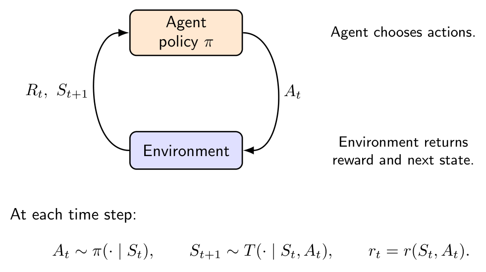
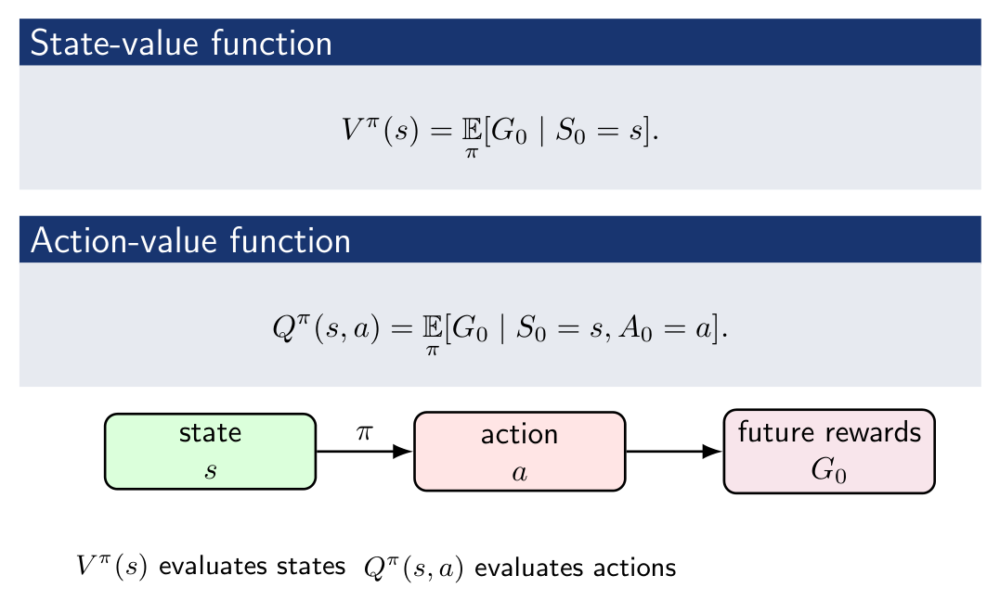
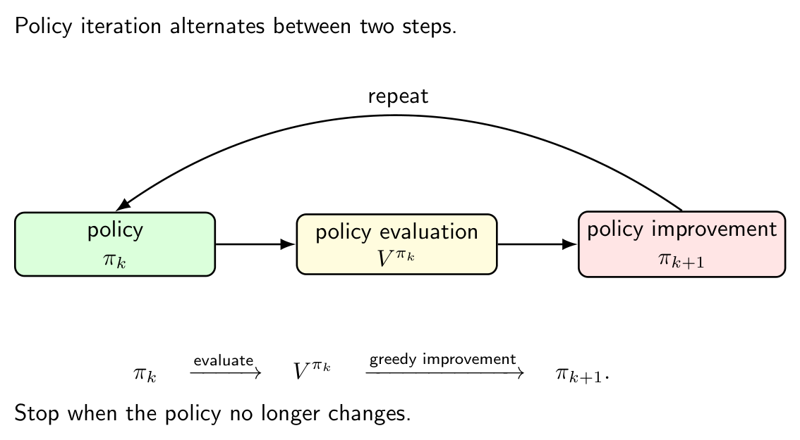

> 본 포스트는 서울대학교 컴퓨터공학부 **Hyun Oh Song** 교수님의 *Introduction to Deep Learning* (M2177.0043) 강의 자료(22강 *Reinforcement Learning I: MDPs, Bellman Equations, and Dynamic Programming*)를 바탕으로, 강의를 처음 듣는 독자도 논리적 흐름을 따라갈 수 있도록 재구성한 것입니다. 세 차례에 걸친 강화학습 강의의 첫 번째로, 모델을 **아는** 경우를 다룹니다.

## 한 줄 요약 (TL;DR)

> **"강화학습의 토대는 벨만 방정식 하나이고, 그것이 수축 사상이라는 사실이 모든 반복 알고리즘의 수렴을 보장합니다."**
>
> 지도학습은 고정된 데이터 분포에서 입력과 정답의 대응을 배우지만, 강화학습에서는 **에이전트의 행동이 다음에 만날 데이터를 바꿉니다.** 이 되먹임을 다루려면 먼저 문제를 정형화해야 하고, 그 도구가 **MDP** $(\mathcal{S}, \mathcal{A}, T, r, d_0, \gamma)$ 입니다. 미래가 현재 상태에만 의존한다는 마르코프 성질 덕분에, 정책 $\pi(a \mid s)$ 와 궤적 분포로 목적 $J(\pi) = \mathbb{E}_{\tau \sim p_\pi}[G_0]$ 를 깔끔히 쓸 수 있습니다. 다음으로 **가치 함수**를 도입합니다. 수익이 $G_t = r_t + \gamma G_{t+1}$ 로 재귀적으로 분해된다는 한 줄의 관찰에서 **벨만 방정식**이 곧바로 따라오고, 최적 정책에 대해서는 기댓값 자리가 최댓값으로 바뀐 벨만 최적 방정식이 됩니다. 모델을 안다면 이 방정식을 반복 대입해 푸는 것이 **동적 프로그래밍** 입니다. 정책 반복은 평가와 탐욕적 개선을 번갈아 하고, 가치 반복은 둘을 한 단계로 합칩니다. 마지막으로 이 반복이 왜 **반드시** 수렴하는지를 증명합니다. 벨만 최적 연산자가 $\gamma$-수축 사상이므로 바나흐 고정점 정리에 의해 유일한 고정점으로 수렴하며, 그 고정점이 바로 $Q^*$ 입니다.

## 1. RL 문제 정형화 (RL Problem Formulation)

### 1.1 강화학습 vs. 지도 학습

강화학습이 지도 학습과 어떻게 다른지 먼저 비교해 보겠습니다.

| | **지도 학습 (Supervised Learning)** | **강화학습 (Reinforcement Learning)** |
|---|---|---|
| 데이터 | 고정 데이터셋 $(x, y) \sim \mathcal{D}$ | **정책에 의존**하는 동적 데이터 |
| 피드백 | 즉각적인 레이블 | **지연될 수 있는** 보상 |
| 목적 | $\min_\theta \mathbb{E}_{(x,y)}[\ell(f_\theta(x), y)]$ | $\max_\pi \mathbb{E}\left[\sum_{t=0}^\infty \gamma^t r_t\right]$ |
| 부작용 | 예측이 미래 데이터에 영향 없음 | **행동이 미래 상태에 영향**을 줌 |

핵심적인 차이는 **탐색-활용 딜레마(exploration-exploitation tradeoff)**입니다. 에이전트의 행동이 미래 데이터를 결정하기 때문에, 단순히 현재 레이블에 맞추는 것이 아니라 장기적 보상을 극대화해야 합니다.

### 1.2 에이전트-환경 루프

각 타임스텝 $t$에서 다음 세 가지가 일어납니다.

$$
A_t \sim \pi(\cdot \mid S_t), \quad S_{t+1} \sim T(\cdot \mid S_t, A_t), \quad r_t = r(S_t, A_t)
$$

- **에이전트(Agent):** 정책 $\pi$에 따라 행동을 선택합니다.
- **환경(Environment):** 보상 $r_t$와 다음 상태 $S_{t+1}$을 반환합니다.

#### CartPole 실행 예시

이 강의의 실행 예시(running example)로 CartPole을 사용합니다.

- **상태:** $s = (\text{cart position},\ \text{velocity},\ \text{pole angle},\ \text{angular velocity})$
- **행동:** $a \in \{\text{push left},\ \text{push right}\}$
- **보상:** 막대가 균형을 유지하는 동안 $r_t = 1$

목표는 가능한 한 오래 막대를 세워 **누적 미래 보상을 최대화**하는 것입니다.

### 1.3 마르코프 성질 (Markov Property)

**정의:** 상태 과정이 다음을 만족하면 마르코프 성질을 가집니다.

$$
P(S_{t+1} = s' \mid S_t = s) = P(S_{t+1} = s' \mid S_t = s,\ H_{t-1})
$$

여기서 $H_{t-1} = (S_0, A_0, \ldots, S_{t-1}, A_{t-1})$은 과거 이력 전체입니다.

마르코프 성질이 의미하는 바를 정리하면 다음과 같습니다.

- **현재 상태가 미래를 예측하는 데 충분한 통계량(sufficient statistic)**입니다.
- 현재 상태를 알면, 이전 이력은 버려도 됩니다.
- 이를 통해 문제를 대폭 단순화할 수 있습니다.

### 1.4 마르코프 결정 과정 (Markov Decision Process, MDP)

**정의:** MDP는 다음 튜플로 정의됩니다.

$$
(\mathcal{S},\ \mathcal{A},\ T,\ r,\ d_0,\ \gamma)
$$

각 구성 요소의 의미는 다음과 같습니다.

| 기호 | 의미 |
|---|---|
| $\mathcal{S}$ | 상태 공간 (state space) |
| $\mathcal{A}$ | 행동 공간 (action space) |
| $T(s' \mid s, a) = P(S_{t+1}=s' \mid S_t=s, A_t=a)$ | 전이 함수 (transition function) |
| $r(s, a)$ | 즉각 보상 함수 (immediate reward) |
| $d_0$ | 초기 상태 분포 (initial state distribution) |
| $\gamma \in [0, 1)$ | 할인 인수 (discount factor) |

> 별도 언급이 없으면 유한(finite) $\mathcal{S}$와 유한 $\mathcal{A}$를 가정합니다.

### 1.5 정책 (Policy)

**정의:** 정책은 상태가 주어졌을 때 행동에 대한 분포입니다.

$$
\pi(a \mid s) = P(A_t = a \mid S_t = s)
$$

- **정상 마르코프 정책(stationary Markov policy):** $\pi(\cdot \mid S_t = s) = \pi(\cdot \mid S_{t+k} = s)$ — 정책이 시간에 의존하지 않습니다.
- **결정론적 정책(deterministic policy):** $a = \pi(s)$ — 행동이 하나로 고정됩니다.

### 1.6 궤적 분포 (Trajectory Distribution)

유한 지평선 $H$에서 궤적(trajectory)은 다음과 같이 정의됩니다.

$$
\tau = (s_0, a_0, s_1, a_1, \ldots, s_H, a_H, s_{H+1})
$$

정책 $\pi$ 하에서 궤적의 결합 분포는 다음과 같습니다.

$$
p_\pi(\tau) = d_0(s_0) \prod_{t=0}^{H} \pi(a_t \mid s_t)\, T(s_{t+1} \mid s_t, a_t)
$$

이는 **초기 상태 분포** $\times$ **정책에 따른 행동 선택** $\times$ **전이 확률**의 연쇄 곱으로 이해할 수 있습니다.

### 1.7 반환 (Return)

즉각 보상은 소문자 $r_t$, 누적 반환(return)은 대문자 $G_t$로 표기합니다.

**유한 지평선 반환:**

$$
G_t = \sum_{k=t}^{H} \gamma^{k-t} r_k
$$

**무한 지평선 할인 반환:**

$$
G_t = \sum_{k=t}^{\infty} \gamma^{k-t} r_k
$$

할인 인수 $\gamma$의 역할을 정리하면 다음과 같습니다.

- **$\gamma$가 작을수록(근시안적, myopic):** 가까운 미래 보상에 집중합니다.
- **$\gamma$가 클수록(원시안적, far-sighted):** 먼 미래 보상까지 고려합니다.
- **$G_t$는 확률변수**입니다 — 미래의 상태와 행동이 무작위이기 때문입니다.

### 1.8 RL 목적 함수

정책 $\pi$의 기대 반환은 다음과 같이 정의됩니다.

$$
J(\pi) = \mathbb{E}_{\tau \sim p_\pi}[G_0] = \mathbb{E}_{\tau \sim p_\pi}\left[\sum_{t=0}^{\infty} \gamma^t r_t\right]
$$

**RL의 핵심 최적화 문제:**

$$
\pi^* \in \arg\max_\pi J(\pi)
$$

**목표:** 장기적 기대 보상을 최대화하는 정책을 찾는 것입니다.

---

## 2. 가치 함수와 벨만 방정식 (Value Functions and Bellman Equations)

### 2.1 상태 가치 함수와 행동 가치 함수

가치 함수(value function)는 특정 상태 또는 (상태, 행동) 쌍에서 얻을 수 있는 **기대 반환**을 평가합니다.

**상태 가치 함수 (State-Value Function):**

$$
V^\pi(s) = \mathbb{E}_\pi[G_0 \mid S_0 = s]
$$

- 상태 $s$에서 정책 $\pi$를 따랐을 때 기대되는 누적 반환입니다.

**행동 가치 함수 (Action-Value Function, Q-function):**

$$
Q^\pi(s, a) = \mathbb{E}_\pi[G_0 \mid S_0 = s,\ A_0 = a]
$$

- 상태 $s$에서 행동 $a$를 취하고 이후 정책 $\pi$를 따랐을 때 기대되는 누적 반환입니다.

### 2.2 $V^\pi$와 $Q^\pi$의 관계

상태 $s$에서 정책은 $a \sim \pi(\cdot \mid s)$로 행동을 샘플링합니다. 따라서:

$$
V^\pi(s) = \mathbb{E}_{a \sim \pi(\cdot|s)}[Q^\pi(s, a)]
$$

유한 행동 공간에서 이를 명시적으로 쓰면:

$$
\boxed{V^\pi(s) = \sum_{a \in \mathcal{A}} \pi(a \mid s)\, Q^\pi(s, a)}
$$

**해석:** 상태 가치는 현재 정책 하에서 행동 가치의 **가중 평균**입니다.

### 2.3 최적 가치 함수 (Optimal Value Functions)

**최적 상태 가치 함수:**

$$
V^*(s) = \max_\pi V^\pi(s)
$$

**최적 행동 가치 함수:**

$$
Q^*(s, a) = \max_\pi Q^\pi(s, a)
$$

$Q^*$를 알면, 탐욕적(greedy) 행동을 통해 최적 정책을 바로 도출할 수 있습니다.

$$
\pi^*(s) \in \arg\max_{a \in \mathcal{A}} Q^*(s, a)
$$

또는 동치로:

$$
\pi^*(a \mid s) = \begin{cases} 1 & \text{if } a \in \arg\max_{a'} Q^*(s, a') \\ 0 & \text{otherwise} \end{cases}
$$

### 2.4 벨만 방정식의 직관 (Bellman Equation: Intuition)

반환의 재귀적 분해에서 벨만 방정식이 자연스럽게 도출됩니다.

$$
G_t = r_t + \gamma G_{t+1}
$$

이 식은 "현재의 반환 = 즉각 보상 + 할인된 미래의 반환"이라는 **자기 일관성(self-consistency)**을 표현합니다. 이를 가치 함수에 적용하면:

$$
V^\pi(s) = \mathbb{E}_{a \sim \pi,\ s' \sim T}\left[r(s, a) + \gamma V^\pi(s')\right]
$$

> **벨만 방정식:** 가치 함수는 한 스텝 앞을 내다보는 자기 일관성 방정식을 만족합니다.

### 2.5 $V^\pi$에 대한 벨만 기대 방정식

**유도 과정:**

1. 정의에서 출발합니다.

$$
V^\pi(s) = \mathbb{E}_\pi[G_0 \mid S_0 = s]
$$

2. $G_0 = r_0 + \gamma G_1$을 대입합니다.

$$
V^\pi(s) = \mathbb{E}_\pi[r_0 + \gamma G_1 \mid S_0 = s]
$$

3. 첫 번째 행동 $a$와 다음 상태 $s'$에 대해 조건부 기댓값을 명시적으로 풀면:

$$
\boxed{V^\pi(s) = \sum_{a \in \mathcal{A}} \pi(a \mid s) \sum_{s' \in \mathcal{S}} T(s' \mid s, a)\left[r(s, a) + \gamma V^\pi(s')\right]}
$$

이를 다시 쓰면:

$$
V^\pi(s) = \sum_a \pi(a \mid s)\left[r(s, a) + \gamma \sum_{s'} T(s' \mid s, a)\, V^\pi(s')\right]
$$

**해석:** 현재 상태의 가치 = 정책에 따라 행동을 선택하고, 전이 확률에 따라 다음 상태로 이동했을 때의 기대 보상 + 할인된 미래 가치.

### 2.6 $Q^\pi$에 대한 벨만 기대 방정식

**유도 과정:**

1. 정의에서 출발합니다.

$$
Q^\pi(s, a) = \mathbb{E}_\pi[G_0 \mid S_0 = s,\ A_0 = a]
$$

2. 상태 $s$에서 행동 $a$를 취한 후:

$$
Q^\pi(s, a) = r(s, a) + \gamma\, \mathbb{E}_{s' \sim T(\cdot|s,a)}[V^\pi(s')]
$$

3. $V^\pi(s') = \sum_{a'} \pi(a' \mid s') Q^\pi(s', a')$를 대입하면:

$$
\boxed{Q^\pi(s, a) = r(s, a) + \gamma \sum_{s'} T(s' \mid s, a) \sum_{a'} \pi(a' \mid s')\, Q^\pi(s', a')}
$$

**해석:** 행동 가치 = 즉각 보상 + 다음 상태에서 정책에 따라 선택한 모든 행동의 가치를 평균한 것.

### 2.7 벨만 최적 방정식 (Bellman Optimality Equations)

최적 가치 함수에서는 기댓값(평균) 대신 **최대화(maximize)**를 사용합니다.

**최적 상태 가치 함수에 대한 벨만 최적 방정식:**

$$
\boxed{V^*(s) = \max_{a \in \mathcal{A}} \left[r(s, a) + \gamma \sum_{s'} T(s' \mid s, a)\, V^*(s')\right]}
$$

**최적 행동 가치 함수에 대한 벨만 최적 방정식:**

$$
\boxed{Q^*(s, a) = r(s, a) + \gamma \sum_{s'} T(s' \mid s, a)\, \max_{a'} Q^*(s', a')}
$$

> **핵심 차이:** 벨만 기대 방정식은 정책에 따라 **평균(expectation)**을 취하고, 벨만 최적 방정식은 **최대화(maximization)**를 합니다.

### 2.8 예측과 제어 (Prediction and Control)

RL의 두 가지 핵심 문제입니다.

- **예측(Prediction):** 주어진 정책 $\pi$의 가치를 추정합니다 ($V^\pi$ 또는 $Q^\pi$).
- **제어(Control):** 최적 정책을 찾습니다 ($\pi^* \in \arg\max_\pi J(\pi)$).

| **문제** | **모델 알고 있음?** | **대표적 방법** |
|---|---|---|
| 예측 | Yes | 정책 평가(Policy Evaluation) |
| 제어 | Yes | 정책 반복, 가치 반복 |
| 예측 | No | Monte Carlo, TD Learning |
| 제어 | No | SARSA, Q-learning |

> 이번 강의에서는 **모델을 알고 있는 경우(known-model)**에 집중합니다.

---

## 3. 동적 프로그래밍 (Dynamic Programming with a Known Model)

### 3.1 모델 기반 동적 프로그래밍

모델($T(s' \mid s, a)$, $r(s, a)$)을 알고 있을 때, 벨만 방정식을 **업데이트 규칙**으로 활용할 수 있습니다.

#### 정책 평가 (Policy Evaluation)

정책 $\pi$가 주어졌을 때, $V^\pi$를 반복적으로 계산합니다.

$$
V(s) \leftarrow \sum_a \pi(a \mid s) \left[r(s, a) + \gamma \sum_{s'} T(s' \mid s, a)\, V(s')\right]
$$

- 이 업데이트는 모델을 활용한 **한 스텝 선행(one-step lookahead)**입니다.
- $V$를 임의의 값으로 초기화하고, 수렴할 때까지 반복합니다.

### 3.2 정책 개선 (Policy Improvement)

정책 $\pi$를 평가하여 $V^\pi(s)$와 $Q^\pi(s, a)$를 알고 있다고 가정합니다.

**핵심 관찰:**

$$
V^\pi(s) = \sum_{a \in \mathcal{A}} \pi(a \mid s) Q^\pi(s, a)
$$

$V^\pi(s)$는 현재 정책 하에서 행동 가치의 평균입니다. 그렇다면 **가장 좋은 행동을 선택**하면 개선될 것입니다.

$$
\pi'(s) \in \arg\max_{a \in \mathcal{A}} Q^\pi(s, a) = \arg\max_{a \in \mathcal{A}} \left[r(s, a) + \gamma \sum_{s'} T(s' \mid s, a)\, V^\pi(s')\right]
$$

**직관:** 현재 정책에서 각 행동이 얼마나 좋은지 알고 있다면, 최선의 행동을 선택해도 정책이 나빠지지 않습니다.

### 3.3 정책 개선 정리 (Policy Improvement Theorem)

**정리:**

$\pi'$이 $Q^\pi$에 대해 탐욕적(greedy)이라면, 즉

$$
\pi'(s) \in \arg\max_a Q^\pi(s, a)
$$

이면, 모든 $s \in \mathcal{S}$에 대해:

$$
V^{\pi'}(s) \geq V^\pi(s)
$$

#### 증명 (Proof)

$\pi'$이 가장 큰 $Q^\pi$ 값의 행동을 선택하므로:

$$
Q^\pi(s, \pi'(s)) \geq \sum_a \pi(a \mid s) Q^\pi(s, a) = V^\pi(s)
$$

$Q^\pi$에 대한 벨만 방정식을 적용합니다.

$$
Q^\pi(s, \pi'(s)) = r(s, \pi'(s)) + \gamma \sum_{s'} T(s' \mid s, \pi'(s))\, V^\pi(s')
$$

따라서:

$$
V^\pi(s) \leq r(s, \pi'(s)) + \gamma\, \mathbb{E}[V^\pi(S_1) \mid S_0 = s,\ A_0 = \pi'(s)]
$$

이 부등식을 $V^\pi(S_1)$, $V^\pi(S_2)$, ... 에 **재귀적으로** 적용합니다($\pi'$을 따르면서):

$$
V^\pi(s) \leq \mathbb{E}_{\pi'}\left[r_0 + \gamma r_1 + \gamma^2 r_2 + \cdots \mid S_0 = s\right] = V^{\pi'}(s) \quad \blacksquare
$$

**핵심:** 탐욕적 정책 개선은 정책을 절대 나쁘게 만들지 않습니다.

### 3.4 정책 반복 (Policy Iteration)

정책 반복은 **평가(evaluation)**와 **개선(improvement)**을 번갈아 수행합니다.

$$
\pi_k \xrightarrow{\text{evaluate}} V^{\pi_k} \xrightarrow{\text{greedy improvement}} \pi_{k+1}
$$

- **수렴 조건:** 정책이 더 이상 변하지 않을 때 ($\pi_{k+1} = \pi_k$).
- 유한 MDP에서는 **반드시 유한 스텝 내에 수렴**합니다(정책의 수가 유한).

### 3.5 가치 반복 (Value Iteration)

정책 반복은 평가와 개선을 분리하지만, **가치 반복**은 이를 하나의 벨만 최적 업데이트로 결합합니다.

$$
\boxed{V_{k+1}(s) = \max_{a \in \mathcal{A}} \left[r(s, a) + \gamma \sum_{s'} T(s' \mid s, a)\, V_k(s')\right]}
$$

수렴 후 탐욕적 정책 추출:

$$
\pi^*(s) \in \arg\max_{a \in \mathcal{A}} \left[r(s, a) + \gamma \sum_{s'} T(s' \mid s, a)\, V^*(s')\right]
$$

**해석:** 가치 반복은 벨만 최적 방정식을 직접 풀어냅니다.

### 3.6 Q-함수에 대한 가치 반복

Q-함수에 직접 적용하는 가치 반복도 가능합니다.

$$
\boxed{Q_{k+1}(s, a) = r(s, a) + \gamma \sum_{s'} T(s' \mid s, a)\, \max_{a'} Q_k(s', a')}
$$

이는 **표 형식 벨만 최적 업데이트(tabular Bellman optimality update)**입니다.

$$
Q_{k+1} = \mathcal{B}^* Q_k
$$

수렴 후:

$$
Q_k \to Q^* \implies \pi^*(s) \in \arg\max_a Q^*(s, a)
$$

---

## 4. 벨만 연산자의 수렴 (Bellman Operator Convergence)

### 4.1 수축 사상과 고정점 정리

가치 반복이 왜 수렴하는지를 이해하기 위해 **수축 사상(contraction mapping)**의 개념이 필요합니다.

**정의:** 거리 공간 $(M, d)$에서 사상 $\mathcal{B}: M \to M$이 다음을 만족하면 수축 사상입니다.

$$
d(\mathcal{B}x,\ \mathcal{B}y) \leq \gamma\, d(x, y), \quad \forall x, y \in M, \quad \gamma \in [0, 1)
$$

**Banach 고정점 정리 (Banach Fixed-Point Theorem):**

> 수축 사상은 **유일한 고정점 $x^*$**를 가지며, 임의의 초기값에서 반복 적용하면 수렴합니다.
>
> $$x_{k+1} = \mathcal{B} x_k \implies x_k \to x^*$$

### 4.2 벨만 최적 연산자 (Bellman Optimality Operator)

$\mathcal{S} \times \mathcal{A}$ 위에서 정의된 유계 실함수 공간을 $\mathcal{F}$라 하면, **벨만 최적 연산자** $\mathcal{B}^*: \mathcal{F} \to \mathcal{F}$를 다음과 같이 정의합니다.

$$
(\mathcal{B}^* Q)(s, a) = r(s, a) + \gamma \sum_{s' \in \mathcal{S}} T(s' \mid s, a)\, \max_{a' \in \mathcal{A}} Q(s', a')
$$

- **최적 Q-함수는 고정점:** $Q^* = \mathcal{B}^* Q^*$
- **가치 반복:** $Q_{k+1} = \mathcal{B}^* Q_k$

### 4.3 벨만 최적 연산자의 수축성 (Contraction)

**정리:**

$(\mathcal{F}, \|\cdot\|_\infty)$ 거리 공간에서 $\mathcal{B}^*$는 수축 사상입니다.

$$
\|\mathcal{B}^* Q_1 - \mathcal{B}^* Q_2\|_\infty \leq \gamma \|Q_1 - Q_2\|_\infty
$$

**결론:**

- $Q^*$는 유일합니다.
- $Q_{k+1} = \mathcal{B}^* Q_k$는 표 형식(tabular) 환경에서 $Q^*$로 수렴합니다.

#### 증명 (Proof)

임의의 $(s, a)$에 대해, $\mathcal{B}^*$의 정의로부터:

$$
(\mathcal{B}^* Q_1)(s, a) - (\mathcal{B}^* Q_2)(s, a)
= \gamma \sum_{s'} T(s' \mid s, a) \left[\max_{a'} Q_1(s', a') - \max_{a'} Q_2(s', a')\right]
$$

**Step 1 — 절댓값 취하기:**

$$
|(\mathcal{B}^* Q_1)(s, a) - (\mathcal{B}^* Q_2)(s, a)|
\leq \gamma \sum_{s'} T(s' \mid s, a) \left|\max_{a'} Q_1(s', a') - \max_{a'} Q_2(s', a')\right|
$$

**Step 2 — max 부등식 적용:**

다음 보조 부등식을 사용합니다.

$$
\left|\max_a f(a) - \max_a g(a)\right| \leq \max_a |f(a) - g(a)|
$$

따라서:

$$
\left|\max_{a'} Q_1(s', a') - \max_{a'} Q_2(s', a')\right| \leq \max_{a'} |Q_1(s', a') - Q_2(s', a')|
$$

**Step 3 — $\ell^\infty$ 놈으로 상계 만들기:**

$$
\max_{a'} |Q_1(s', a') - Q_2(s', a')| \leq \|Q_1 - Q_2\|_\infty
$$

**Step 4 — 전이 확률의 합 이용:**

$$
|(\mathcal{B}^* Q_1)(s, a) - (\mathcal{B}^* Q_2)(s, a)|
\leq \gamma \sum_{s'} T(s' \mid s, a) \|Q_1 - Q_2\|_\infty
= \gamma \|Q_1 - Q_2\|_\infty
$$

마지막 등호에서 $\sum_{s'} T(s' \mid s, a) = 1$을 사용했습니다.

**Step 5 — $(s, a)$에 대한 최대 취하기:**

$$
\|\mathcal{B}^* Q_1 - \mathcal{B}^* Q_2\|_\infty \leq \gamma \|Q_1 - Q_2\|_\infty \quad \blacksquare
$$

### 4.4 왜 이 정리가 중요한가?

수축 정리는 **표 형식 동적 프로그래밍이 왜 작동하는가**를 수학적으로 설명합니다.

$$
Q_{k+1} = \mathcal{B}^* Q_k \implies Q_k \to Q^* \implies \pi^*(s) \in \arg\max_a Q^*(s, a)
$$

**단, 한계가 있습니다.** 이 결과는 **모델을 알고 있어야** 합니다: $T(s' \mid s, a)$, $r(s, a)$.

현실의 많은 문제에서는 샘플링된 전이만 관찰됩니다.

$$
(s_t, a_t, r_t, s_{t+1})
$$

→ 다음 강의에서는 모델 없이 샘플만으로 학습하는 방법(Monte Carlo, TD, SARSA, Q-learning, DQN)을 다룹니다.

---

## 정리하며 (Closing Remarks)

이번 강의의 논리 사슬을 한 장으로 요약하면 다음과 같습니다.

| 단계 | 내용 | 근거 |
|:---|:---|:---|
| **① 지도학습과의 차이** | 데이터 분포가 고정되어 있지 않다. 에이전트의 행동이 다음에 만날 상태를 바꾸므로, 학습과 데이터 수집이 얽힌다 | RL vs. 지도학습 |
| **② 마르코프 성질** | 미래가 현재 상태에만 의존하면 과거 전체를 들고 다닐 필요가 없다. 이 가정이 문제를 다룰 수 있게 만든다 | 마르코프 성질의 정의 |
| **③ MDP** | $(\mathcal{S}, \mathcal{A}, T, r, d_0, \gamma)$ 로 순차적 의사결정을 형식화하고, 정책 $\pi(a \mid s)$ 가 궤적 분포 $p_\pi(\tau)$ 를 결정한다 | MDP · 정책 · 궤적 분포 |
| **④ 목적** | 최대화 대상은 기대 수익 $J(\pi) = \mathbb{E}_{\tau \sim p_\pi}[G_0]$ 이며, 무한 시평에서는 할인율 $\gamma$ 가 합의 수렴을 보장한다 | RL 목적함수 |
| **⑤ 두 가치 함수** | $V^\pi(s)$ 는 상태를, $Q^\pi(s, a)$ 는 (상태, 행동) 쌍을 평가한다. 정책으로 행동을 주변화하면 $V^\pi(s) = \mathbb{E}_{a \sim \pi}[Q^\pi(s, a)]$ 로 이어진다 | $V^\pi$ ↔ $Q^\pi$ |
| **⑥ 벨만 방정식** | $G_t = r_t + \gamma G_{t+1}$ 이라는 재귀 분해가 곧바로 벨만 기대 방정식을 낳는다. 가치 함수가 **자기 자신에 대한 방정식**을 만족한다는 것이 핵심이다 | 재귀적 분해 |
| **⑦ 최적성** | 최적 정책에 대해서는 기댓값 자리가 최댓값으로 바뀌어 $V^*(s) = \max_a [r(s,a) + \gamma \sum_{s'} T(s' \mid s,a) V^*(s')]$ 가 된다 | 벨만 최적 방정식 |
| **⑧ 두 과제** | 주어진 정책의 가치를 구하는 **예측(prediction)** 과 최적 정책을 찾는 **제어(control)** 로 문제가 갈린다 | 예측과 제어 |
| **⑨ 정책 개선 정리** | $Q^\pi$ 에 대해 탐욕적인 $\pi'$ 는 항상 $V^{\pi'} \geq V^\pi$ 를 만족한다. 탐욕적 개선이 결코 나빠지지 않는다는 보장이다 | 정책 개선 정리 |
| **⑩ 두 알고리즘** | 정책 반복은 평가와 개선을 번갈아 수행하고, 가치 반복은 둘을 한 갱신으로 합친다 | 정책 반복 · 가치 반복 |
| **⑪ 수렴의 근거** | 벨만 최적 연산자 $\mathcal{B}^*$ 는 $\lVert \cdot \rVert_\infty$ 에서 계수 $\gamma$ 의 **수축 사상**이다. 증명의 핵심은 $\lvert \max_a f(a) - \max_a g(a) \rvert \leq \max_a \lvert f(a) - g(a) \rvert$ 이다 | 수축 정리 |
| **⑫ 결론** | 바나흐 고정점 정리에 의해 유일한 고정점이 존재하고 임의의 초기값에서 그리로 수렴한다. 그 고정점이 $Q^*$ 이므로 표 기반 동적 프로그래밍은 **반드시** 작동한다 | 바나흐 고정점 정리 |
