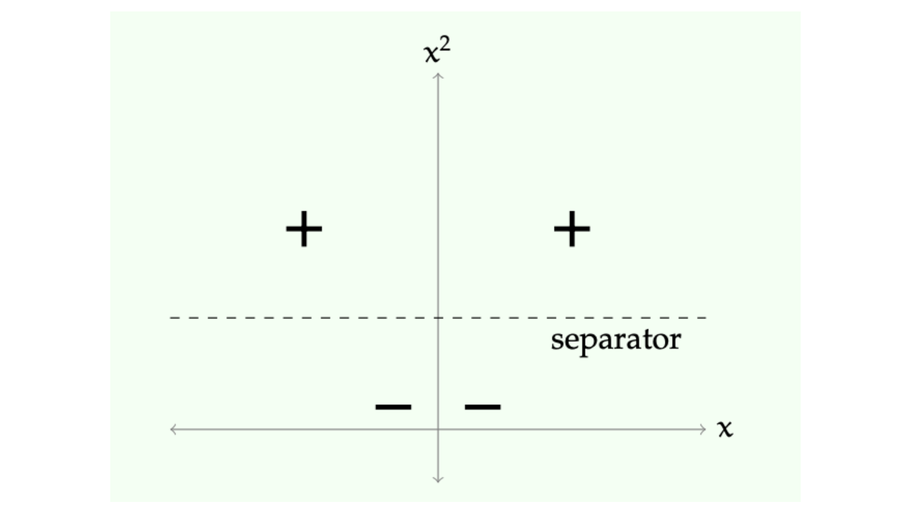
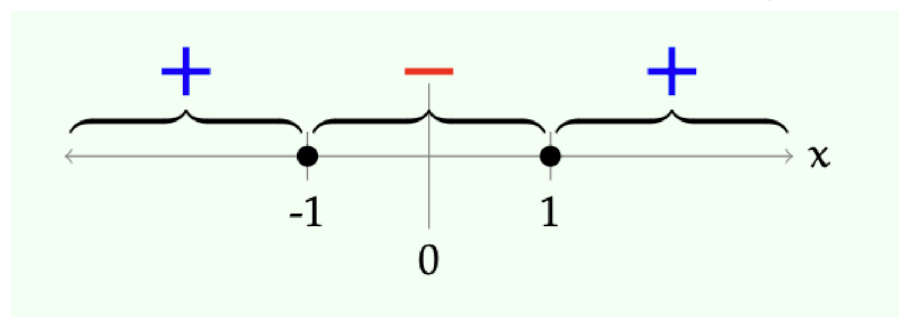

> 본 포스트는 서울대학교 컴퓨터공학부 · 인공지능대학원(IPAI) **박재식(Jaesik Park)** 교수님의 *Introduction to Machine Learning* (4190.428) 강의 자료(3강 *Feature Representation*)를 바탕으로, 강의를 처음 듣는 독자도 논리적 흐름을 따라갈 수 있도록 재구성한 것입니다. 원 강의 자료는 MIT 6.036(2019 Fall)과 Stanford CS229(2023–2024 Summer)의 강의 노트를 상당 부분 차용하고 있습니다.

## 한 줄 요약 (TL;DR)

> **"모델을 비선형으로 만드는 대신, 데이터를 비선형으로 옮깁니다 — 고차원 $\phi$ 공간의 선형 분리선은 원래 공간에서 비선형 분리선입니다."**
>
> 2강에서 본 선형 분류기는 분석과 최적화가 쉽다는 큰 장점을 갖지만, 가설 공간이 지나치게 좁아 XOR처럼 단순한 데이터조차 가르지 못합니다.
>
> 이번 강의의 해법은 모델을 복잡하게 만드는 것이 아니라 **특성 표현(feature representation) $\phi$를 바꾸는 것**입니다. $\phi(x) = [x, x^2]$처럼 비선형 사상으로 데이터를 더 높은 차원으로 올리면, 그 공간에서는 여전히 선형 분류기를 쓰면서도 원래 공간에서는 비선형 경계를 얻습니다. 이 아이디어를 체계화한 것이 **다항식 기저**이며, 차수 $k$를 올릴수록 표현력이 커집니다.
>
> 나머지 절반은 "그 $\phi$에 무엇을 넣을 것인가"의 문제입니다. 범주형 값은 수치 매핑 · 온도계 코드 · 팩터형 코드 · 원-핫 코드 중 **그 값이 가진 구조(수치성 · 순서 · 분해 가능성)에 맞는 것**을 골라야 하며, 편의를 위해 이진 코드를 쓰면 존재하지 않는 거리 관계를 모델에 주입하게 됩니다.
>
> 이 두 갈래는 4강 커널 방법과 9강 다층 신경망으로 각각 이어집니다.

## 1. Introduction: 선형 분류기(Linear Classifiers)의 한계

* 기계학습 모델을 설계할 때, 선형 분류기(Linear Classifiers)는 분석과 최적화가 용이하다는 강력한 장점을 가집니다. 비용 함수가 볼록(Convex)하여 전역 최적해(Global Optimum)를 찾기 쉽고, 가중치(Weights)를 통해 각 특성(Feature)이 예측에 미치는 영향을 직관적으로 해석할 수 있기 때문입니다.

* 하지만 선형 분류기는 **가설 공간(Hypothesis Class)이 매우 제한적**이라는 치명적인 단점이 있습니다. 현실의 데이터는 단 하나의 선이나 초평면(Hyperplane)으로 완벽하게 나눌 수 없는 경우가 훨씬 많습니다. 

* 따라서 우리는 다음과 같은 근본적인 질문을 던지게 됩니다.
  * *"선형 모델의 단순함과 계산적 이점을 유지하면서도, 비선형적인 데이터 패턴을 학습할 수 있는 더 나은 방법은 없을까?"*

* 이 포스트에서는 **특성 표현(Feature Representation)**과 공간 변환을 통해 선형 모델이 비선형 문제를 해결할 수 있도록 돕는 기법들, 그리고 다양한 형태의 데이터(범주형, 텍스트 등)를 기계학습 모델이 이해할 수 있도록 인코딩하는 전략에 대해 깊이 있게 다룹니다.

---

## 2. 비선형 변환의 직관: XOR 문제 (XOR Problem)

* 선형 분류기의 한계를 보여주는 가장 대표적이고 고전적인 예시는 **XOR (Exclusive OR) 데이터셋**입니다.

### 2.1. 1차원에서의 선형 분리 불가능성
* 우선 이해를 돕기 위해 2차원이 아닌 1차원 공간에서의 단순화된 데이터셋을 가정해 보겠습니다. 1차원 축($x$) 위에 다음과 같이 세 개의 데이터 포인트가 존재한다고 가정해 봅시다.
  - 양성 클래스($+$): $x = -1$, $x = 1$
  - 음성 클래스($-$): $x = 0$

* 1차원 공간에서 선형 결정 경계는 단 하나의 "점"입니다. 하나의 점을 찍어서 좌우로 양성($+$)과 음성($-$)을 완벽히 나눌 수 있을까요? 불가능합니다. 양성 클래스가 음성 클래스의 양옆을 둘러싸고 있기 때문입니다.

### 2.2. 고차원 공간으로의 매핑 (Mapping to Higher Dimensions)
* 이 문제를 해결하기 위한 핵심 아이디어(Trick)는 **비선형 변환(Non-linear Transformation)**을 통해 데이터를 기존보다 차원이 높은 공간으로 이동시키는 것입니다.

* 변환 함수 $\phi(x)$를 다음과 같이 정의해 봅시다.
$$\phi(x) = [x, x^2]$$

* 이 변환은 1차원의 데이터 포인트 $x$를 2차원 공간 $(x, x^2)$로 투영합니다. 데이터를 이 새로운 공간으로 이동시키면 어떤 일이 발생할까요?
  - 기존 양성 데이터 $x = -1 \implies \phi(-1) = [-1, 1]$
  - 기존 양성 데이터 $x = 1 \implies \phi(1) = [1, 1]$
  - 기존 음성 데이터 $x = 0 \implies \phi(0) = [0, 0]$

* 새로운 2차원 공간에서는 음성 데이터가 원점 근처에 위치하고, 양성 데이터들은 $y$축 방향으로 위로 솟아오르게 됩니다. 

* 이제 우리는 이 새로운 공간에서 데이터를 분리할 수 있는 선형 결정 경계(Linear Separator)를 쉽게 찾을 수 있습니다. 예를 들어, 수평선 형태의 분리선을 다음과 같이 정의할 수 있습니다.
$$x^2 - 1 > 0$$

* 즉, $x^2 - 1 = 0$을 기준으로, 이 값보다 크면 양성($+$), 작으면 음성($-$)으로 분류하는 선형 모델입니다.

### 2.3. 원래 공간에서의 해석
* 고차원($\phi(x)$ 공간)에서 찾은 선형 결정 경계 $x^2 - 1 = 0$은, 원래의 1차원($x$) 공간에서는 어떤 형태일까요?

* 식을 풀면 $x = 1$ 또는 $x = -1$이 됩니다. 즉, 원래의 1차원 공간에서는 하나의 선(점)이 아니라, **두 개의 점을 기준**으로 구간이 나뉘는 **비선형 결정 경계**가 형성된 것입니다.

* **결론:** 고차원 공간에서의 "선형 분리선(Linear Separator)"은 원래의 저차원 공간에서 "비선형 분리선(Nonlinear Separator)"으로 작용합니다. 이 전략은 매우 일반적이고 널리 사용되며, 향후 머신러닝에서 배우게 될 **커널 메서드(Kernel Methods)**의 수학적 기반이 되고 **다층 신경망(Multi-layer Neural Networks)**이 왜 필요한지에 대한 직관적 동기를 제공합니다.

---

## 3. 다항식 기저 (Polynomial Basis)

* 앞선 아이디어를 체계화한 것이 바로 **다항식 기저(Polynomial Basis)**를 활용한 특성 변환입니다. 데이터가 이미 수치형(Numerical) 특성을 가지고 있을 때, 비선형성을 부여하는 가장 체계적인 전략 중 하나입니다.

* $k$-차 다항식 기저($k$-th order basis, $k>0$)는 주어진 차원들 간의 곱으로 만들 수 있는 모든 가능한 조합(최대 $k$번 곱함)을 새로운 특성으로 포함시킵니다.

* 원래 차원이 $d=1$일 때, 다항식 차수(Order)에 따른 기저 공간 확장은 다음과 같습니다.
  - **Order 0**: $[1]$ (상수항/Bias)
  - **Order 1**: $[1, x]$ (원래의 선형 공간)
  - **Order 2**: $[1, x, x^2]$
  - **Order 3**: $[1, x, x^2, x^3]$

* 일반적인 다차원 공간($x = [x_1, \dots, x_d]$)에서의 확장은 다음과 같습니다.
  - **Order 1**: $[1, x_1, \dots, x_d]$
  - **Order 2**: $[1, x_1, \dots, x_d, x_1^2, x_1x_2, \dots]$
  - **Order 3**: $[1, x_1, \dots, x_1^2, x_1x_2, \dots, x_1x_2x_3, \dots]$

### 3.1. 2차원 XOR 문제의 해결
* 이제 실제 2차원 XOR 데이터셋 $x = [x_1, x_2]$를 생각해 봅시다. 데이터 포인트 $(1, 1)$과 $(-1, -1)$은 **양성**, $(-1, 1)$과 $(1, -1)$은 **음성**입니다. 즉 두 좌표의 부호가 같으면 양성, 다르면 음성인 구조로, 2차원 평면상에서 대각선으로 엇갈려 있어 선형 분리가 불가능합니다.

* 여기에 $k=2$ 다항식 기저를 적용하여 공간을 변환합니다.
$$\phi([x_1, x_2]) = [1, x_1, x_2, x_1^2, x_1x_2, x_2^2]$$

* 변환된 6차원 공간에서 퍼셉트론(Perceptron) 모델을 학습시켰다고 가정해 봅시다. 모델이 다음과 같은 가중치 벡터 $\theta$와 편향 $\theta_0$를 찾았습니다.
    - $\theta_0 = 0$
    - $\theta = [0, 0, 0, 0, 4, 0]$ (각각 $1, x_1, x_2, x_1^2, x_1x_2, x_2^2$에 대응)

* 이 선형 모델의 결정 경계 식을 원래 공간의 변수로 전개하면 다음과 같습니다.
$$0 + 0x_1 + 0x_2 + 0x_1^2 + 4x_1x_2 + 0x_2^2 + 0 = 0$$
$$\implies 4x_1x_2 = 0$$

* 이 식은 $x_1 = 0$ (y축) 또는 $x_2 = 0$ (x축)을 의미합니다. 

![Figure 4: $\theta = [0,0,0,0,4,0]$, $\theta_0 = 0$이 만든 결정 경계 $4x_1x_2 = 0$을 원래의 $(x_1, x_2)$ 평면에 그린 그림입니다. 가로축이 $x_1$, 세로축이 $x_2$이며, 두 좌표축이 곧 결정 경계가 되어 평면을 네 개의 사분면으로 자릅니다. **흰색 영역이 양성**($x_1x_2 > 0$인 1·3사분면), **회색 음영이 음성**($x_1x_2 < 0$인 2·4사분면)으로, 초록색 '+' 점 $(1,1)$과 $(-1,-1)$은 흰색 영역에, 빨간색 '−' 점 $(-1,1)$과 $(1,-1)$은 회색 영역에 정확히 들어갑니다. 고차원에서는 평평한 초평면이었던 것이 원래 공간에서는 이렇게 꺾인 비선형 경계로 나타난다는 점이 핵심입니다.](./images/2d_xor_quadrants.png)

* 같은 데이터를 분리하는 $(\theta, \theta_0)$는 하나가 아닙니다. 예를 들어 $\theta = [1, -1, -1, -5, 11, -5]$, $\theta_0 = 1$을 찾는다면, 이는 원래 공간에서 쌍곡선 형태의 매끄러운 비선형 곡선 경계를 만들어냅니다.

![Figure 5: 같은 XOR 데이터에 대해 $\theta = [1,-1,-1,-5,11,-5]$, $\theta_0 = 1$이 만든 또 다른 결정 경계입니다. 가로축 $x_1$, 세로축 $x_2$ 모두 $-2$에서 $5$까지이며, 앞 그림과 달리 경계가 좌표축이 아니라 대각선 방향으로 비스듬히 누운 두 개의 곡선입니다. 그 사이에 낀 **흰색 띠가 양성 영역**이어서 초록색 '+' 점 $(1,1)$과 $(2,2)$가 그 안에 들어가고, 띠 바깥의 **회색 영역이 음성**이어서 빨간색 '−' 점 $(1,2)$와 $(2,1)$이 바깥에 놓입니다. 같은 데이터를 가르는 2차 기저의 해가 유일하지 않다는 것, 그리고 학습이 찾아낸 계수에 따라 원래 공간의 경계 모양이 전혀 달라진다는 것을 보여줍니다.](./images/2d_xor_hyperbola.png)

* 나아가 다항식 기저의 차수 $k$를 3, 4, 5로 계속 높이면(Iteration을 반복하며 학습하면), 모델은 극도로 복잡한 분포를 띄는 데이터셋도 구불구불한 경계선을 그려내어 완벽하게 구획을 나눌 수 있는 표현력(Expressivity)을 갖추게 됩니다.

---

## 4. 이산형 특성(Discrete Features) 인코딩 전략

* 현실의 기계학습 문제에서는 숫자로 측정된 연속형 데이터뿐만 아니라 범주나 텍스트로 이루어진 이산형 데이터가 빈번하게 등장합니다. 이러한 특징을 사람이 어떻게 인코딩(Encoding)하여 입력 벡터 $x \in \mathbb{R}^d$로 변환하느냐는 모델의 성능을 결정짓는 매우 중요한 요소입니다.

### 4.1. 수치 매핑 (Numeric)
* 이산적인 값이 실제로 어떤 수치적(Numeric) 크기나 비율을 의미할 때 사용합니다. 
* 범주가 $k$개 있을 때, 각 값을 $1.0/k, 2.0/k, \dots, 1.0$ 으로 할당합니다.

### 4.2. 온도계 코드 (Thermometer Code)
* 데이터가 **순서(Natural Ordering)**는 가지고 있지만, 그 사이의 간격이 실제 수치적 비율로 맵핑하기 모호할 때 사용합니다. (예: 설문조사 "매우 불만-불만-보통-만족-매우 만족")
* $k$개의 순서가 있다면, 길이 $k$의 이진 벡터를 만들고 해당 순위 $j$까지의 위치를 모두 $1.0$으로, 나머지는 $0.0$으로 채웁니다.
  - 예시 ($k=5$ 중 3번째 값): $[1.0, 1.0, 1.0, 0.0, 0.0]$

* 이를 통해 모델은 순서의 누적된 강도를 선형적으로 학습할 수 있습니다.

### 4.3. 팩터형 코드 (Factored Code)
* 하나의 이산형 범주가 여러 개의 독립적인 의미(속성)의 조합으로 이루어져 있을 때 분리하는 기법입니다.
  - 예시: 자동차 모델 정보가 주어졌을 때, 이를 단순히 하나의 ID로 취급하지 않고 "제조년도(Year)"와 "제조사(Maker)"라는 두 개의 분리된 특성으로 쪼갭니다. 이후 각각에 맞는 인코딩 방식을 적용합니다.

### 4.4. 원-핫 코드 (One-hot Code)
* 범주 간에 뚜렷한 **거리 개념(Metric), 순서(Ordering), 또는 팩터 구조(Factorial Structure)가 전혀 없을 때** 사용하는 가장 기본적이고 안전한 방법입니다.
* $k$개의 범주에 대해 길이 $k$의 벡터를 생성하고, 관측치에 해당하는 인덱스 $j$ ($0 < j \le k$)만 $1.0$으로, 나머지는 모두 $0.0$으로 둡니다.

### 4.5. 이진 코드 (Binary Code) - *사용 지양*
* $k$개의 범주를 길이 $\log_2(k)$의 이진수로 표현하는 방식입니다. 차원을 극적으로 줄일 수 있다는 유혹이 있지만, **나쁜 아이디어(Bad idea)**입니다. 숫자의 이진수 표현 방식 때문에 기계학습 모델이 전혀 관련 없는 범주끼리 가깝다고 오해(인공적인 거리감 형성)하게 만들기 때문입니다.

---

## 5. 인코딩 응용 사례: 혈액형 데이터

* 혈액형 집합 $\{A+, A-, B+, B-, AB+, O+, O-\}$를 어떻게 인코딩하는 것이 가장 효율적일까요?

### **분석:**
* 이 데이터에는 명백한 수치적 척도나 순서가 없습니다. 따라서 수치 매핑이나 온도계 코드는 부적절합니다. 하지만 이 데이터는 생물학적 원리에 의해 합리적인 팩터링(Factoring)이 가능합니다.

### **전략 1: 부분 원-핫 인코딩 결합**
* 데이터를 ABO식 $\{A, B, AB, O\}$와 Rh식 $\{+, -\}$ 두 개의 특성으로 나눕니다.
  - ABO 특성: 4차원 벡터로 원-핫 인코딩
  - Rh 특성: 2차원 벡터로 원-핫 인코딩
  - 결론: 이 둘을 이어 붙인 **6차원 벡터**로 표현합니다.

### **전략 2: 항원 유무를 활용한 효율적 분해 (Advanced Factored Code)**
* ABO식 혈액형은 사실 A항원 유무와 B항원 유무로 나눌 수 있습니다. 즉, $\{A, \text{not } A\}$, $\{B, \text{not } B\}$로 쪼갤 수 있습니다. 이 아이디어를 적용하여 존재하면 $1.0$, 부재하면 $-1.0$으로 매핑해봅시다.
  - 항원 A 유무 (1.0 or -1.0)
  - 항원 B 유무 (1.0 or -1.0)
  - Rh+ 유무 (1.0 or -1.0)

* 이 경우 단 **3차원 벡터**만으로 모든 혈액형의 특성을 생물학적 의미까지 내포하여 완벽하게 직교(Orthogonal)하게 표현할 수 있습니다.
  - $AB+$ 의 인코딩: $(1.0, 1.0, 1.0)$
  - $O-$ 의 인코딩: $(-1.0, -1.0, -1.0)$

---

## 6. 기타 특성 (Other Features) 인코딩

### 6.1. 텍스트 데이터 (Texts)
* 텍스트는 길이가 가변적이기 때문에 머신러닝에 직접 입력하기 어렵습니다. 
  - **Bag of Words (BoW) 모델:** 어휘 사전(Vocabulary)에 존재하는 단어의 총 개수 $d$를 차원의 수로 삼습니다. 해당 문장에 특정 단어가 등장하면 $1.0$, 등장하지 않으면 $0.0$으로 고정 길이 벡터를 생성합니다. (더 복잡한 맥락 이해는 순차 모델(Sequential models)에서 다루게 됩니다.)

### 6.2. 연속형 수치 데이터 (Numeric Values)
* 심박수, 주가, 거리 등은 그 자체로 수치 값으로 유지합니다. 그러나 학습의 안정성을 위해 전처리(Transformation)가 필요합니다.
  - 구간 스케일링: 최소-최대 값을 기준으로 $[-1, +1]$ 범위로 압축합니다.
  - **표준화(Standardization):** 가장 권장되는 방식으로, 데이터의 평균($\overline{x}$)을 0으로, 표준편차($\sigma$)를 1로 맞춥니다.
  $$\phi(x) = \frac{x - \overline{x}}{\sigma}$$
    * *여기서 $\overline{x}$는 학습 데이터 $x^{(i)}$의 평균, $\sigma$는 표준편차입니다.*

### 6.3. 도메인 지식을 활용한 변형
* "나이"라는 수치 데이터가 주어졌을 때, 예측하려는 대상(예: 주류 구매 여부)에 따라 연속된 수치 그대로 사용하기보다, 특정 임계점(18세 또는 21세 기준)을 넘었는지 여부를 이산화하여 다루는 것이 유리할 수 있습니다. 또한, 질병 상황 등의 변수는 원-핫 인코딩을 적용하거나 앞서 배운 고차원 다항식 기저 변환을 추가로 적용하여 모델의 표현력을 극대화할 수 있습니다.

---

## 정리하며 (Closing Remarks)

이번 강의의 논리 사슬을 한 장으로 요약하면 다음과 같습니다.

| 단계 | 내용 | 근거 |
|:---|:---|:---|
| **① 한계 확인** | 선형 분류기는 다루기 쉽지만 가설 공간이 지나치게 좁다 | §1 |
| **② 반례** | XOR 데이터는 2차원 평면에서 어떤 직선으로도 분리되지 않는다 | §2, Figure 1 |
| **③ 발상 전환** | 모델을 비선형으로 바꾸는 대신 데이터를 비선형 변환 $\phi$로 고차원에 올린다 | §2.2 |
| **④ 최소 사례** | $\phi(x)=[x, x^2]$ 하나로 1차원 XOR이 2차원에서 선형 분리 가능해진다 | §2.2, Figure 2 |
| **⑤ 되돌리기** | $\phi$ 공간의 선형 경계 $x^2-1=0$은 원래 공간에서 두 임계점의 비선형 경계다 | §2.3, Figure 3 |
| **⑥ 일반 원리** | 고차원의 선형 분리선 = 원래 공간의 비선형 분리선 — 커널 방법과 다층 신경망의 공통 동기 | §2.3 |
| **⑦ 체계화** | $k$차 다항식 기저로 모든 $k$차 이하 곱 항을 특성으로 추가한다 | §3 |
| **⑧ 검증** | $k=2$ 기저 위의 선형 모델이 2차원 XOR을 실제로 분리한다 ($4x_1x_2=0$) | §3.1, Figure 4–5 |
| **⑨ 표현력의 대가** | $k$를 올리면 임의로 복잡한 경계를 그릴 수 있지만, 그만큼 과적합 위험이 커진다 | §3.1, Figure 6 |
| **⑩ 입력의 문제** | $\phi$에 넣을 값 자체를 사람이 인코딩해야 한다 — 이산 · 텍스트 · 수치 | §4, §6 |
| **⑪ 인코딩 원칙** | 값이 가진 구조(수치성 · 순서 · 분해 가능성)에 맞는 코드를 고른다 | §4.1–§4.4 |
| **⑫ 금기** | 이진 코드는 차원은 줄지만 없는 거리 관계를 만들어 내므로 쓰지 않는다 | §4.5 |
| **⑬ 사례** | 혈액형은 항원 A · B · Rh 세 축으로 분해해 3차원이면 충분하다 | §5 |