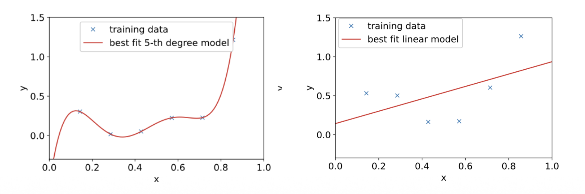

> 본 포스트는 서울대학교 컴퓨터공학부 · 인공지능대학원(IPAI) **박재식(Jaesik Park)** 교수님의 *Introduction to Machine Learning* (4190.428) 강의 자료(7강 *Generalization and Regularization, Part 1*)를 바탕으로, 강의를 처음 듣는 독자도 논리적 흐름을 따라갈 수 있도록 재구성한 것입니다. 원 강의 자료는 MIT 6.036(2019 Fall)과 Stanford CS229(2023–2024 Summer)의 강의 노트를 상당 부분 차용하고 있습니다. 정규화(regularization)의 구체적 기법들은 8강에서 이어집니다.

## 한 줄 요약 (TL;DR)

> **"테스트 오차는 $\sigma^2 + \text{Bias}^2 + \text{Variance}$ 세 항의 합입니다. 첫째 항은 손댈 수 없고, 나머지 둘은 서로를 밀어냅니다."**
>
> 1강에서 머신러닝의 두 문제로 추정과 **일반화**를 꼽았습니다. 이번 강의는 그 일반화를 정면으로 다룹니다. 훈련 오차 $J(\theta)$와 테스트 오차 $L(\theta)$의 차이인 **일반화 격차**가 왜 벌어지는지를, 직관이 아니라 항등식으로 설명합니다.
>
> 핵심 도구는 **편향-분산 분해**입니다. 참 함수를 $h^*$, 데이터셋 $S$로 학습한 모델을 $\hat{h}_S$라 할 때, 기대 제곱오차는 정확히 세 조각으로 갈라집니다 — 관측 노이즈 $\sigma^2$(어떤 모델로도 줄일 수 없음), **편향 제곱**(무한한 데이터를 줘도 남는 표현력의 한계), **분산**(데이터셋이 바뀔 때마다 모델이 흔들리는 정도).
>
> 이 분해가 과소적합과 과적합의 정체를 밝힙니다. 선형 모델은 편향이 크고 분산이 작으며, 5차 다항식은 그 반대입니다. 모델 복잡도를 키우면 편향은 줄고 분산은 늘어나므로 테스트 오차는 **U자 곡선**을 그리고, 그 바닥이 최적점입니다.
>
> 그런데 현대 딥러닝은 이 그림을 배신합니다. 파라미터 수가 표본 수와 비슷해지는 지점($n \approx d$)에서 오차가 치솟은 뒤, 그 너머에서 **다시 내려갑니다**. 이 **이중 하강**은 "복잡도 = 파라미터 수"라는 전제 자체를 의심하게 만들며, 복잡도를 가중치의 노름으로 재면 곡선이 다시 매끄러워진다는 관찰로 이어집니다.

## 1. 들어가며: 왜 머신러닝에서 일반화(Generalization)가 중요한가?

* 머신러닝 모델을 학습시킬 때 우리의 진짜 목적은 무엇일까요? 주어진 학습 데이터를 완벽하게 외우는 것이 아니라, **한 번도 본 적 없는 새로운 데이터(Unseen data)에 대해 정확한 예측을 내리는 것**입니다. 이번 포스트에서는 모델이 새로운 데이터에 얼마나 잘 적응하는지를 나타내는 "일반화"의 개념과, 이를 방해하는 요인들을 수학적으로 철저히 분해해 보겠습니다.

## 2. 훈련 오차(Training Error)와 테스트 오차(Test Error)

* 머신러닝에서 성능을 평가하기 위해 우리는 두 가지 오차를 정의합니다.
  * **훈련 오차 (Training Error)**: 모델이 학습에 사용된 데이터 $\{x^{(i)},y^{(i)}\}_{i=1}^{n}$에 대해 범하는 오차입니다. 일반적으로 평균 제곱 오차(MSE)와 같은 손실 함수(Loss function)를 사용하여 다음과 같이 계산합니다.
    $$J(\theta)=\frac{1}{n}\sum_{i=1}^{n}(y^{(i)}-h_{\theta}(x^{(i)}))^{2}$$ 
  * **테스트 오차 (Test Error)**: 학습 과정에서 보지 못한 새로운 테스트 예제들에 대한 오차입니다. 테스트 데이터 분포를 $\mathcal{D}$라고 할 때, 테스트 오차의 기댓값은 다음과 같이 정의됩니다.
    $$L(\theta)=\mathbb{E}_{(x,y)\sim\mathcal{D}}[(y-h_{\theta}(x))^{2}]$$ 

* 우리의 궁극적인 목표는 이 **테스트 오차를 최소화하는 것**입니다. 훈련 오차와 테스트 오차의 차이를 흔히 **일반화 격차(Generalization Gap)**라고 부릅니다.

## 3. 과적합(Overfitting)과 과소적합(Underfitting)

* 모델의 복잡도에 따라 두 가지 극단적인 문제가 발생할 수 있습니다.

* **과소적합 (Underfitting)**: 모델이 학습 데이터를 제대로 학습하지 못해 훈련 오차조차 높은 상태입니다. 위 그림의 단순 선형 모델처럼, 모델 자체의 표현력이 부족하여 발생합니다.
* **과적합 (Overfitting)**: 모델이 학습 데이터에는 매우 잘 작동하지만(훈련 오차가 낮음), 테스트 데이터에는 제대로 작동하지 않는 상태입니다. 5차 다항식 모델처럼 데이터의 노이즈까지 외워버려 일반화 성능이 떨어집니다.

## 4. 편향(Bias)과 분산(Variance)의 직관적 이해

* 과적합과 과소적합의 근본적인 원인을 이해하기 위해, 데이터를 생성하는 진짜 함수(Ground Truth)를 $h^*(x)$라고 가정해 봅시다. 
* 관측된 데이터 $y^{(i)}$는 이 진짜 함수에 관측 노이즈 $\xi^{(i)}$가 더해진 형태입니다.
$$y^{(i)}=h^{*}(x^{(i)})+\xi^{(i)}$$ 
* 여기서 노이즈 $\xi^{(i)}\sim \mathcal{N}(0,\sigma^{2})$를 따릅니다. 

* 이 $h^*(x)$를 복원하기 위해 "단순한 선형 모델"과 "복잡한 5차 다항식 모델"을 사용해 본다고 가정합시다.

### 4.1. 편향 (Bias)
* **편향(Bias)**은 (무한히) 방대한 양의 학습 데이터로 모델을 학습시켰을 때조차, 예측값이 실제 정답(Ground Truth)과 얼마나 떨어져 있는지를 의미합니다. 
* **선형 모델의 경우**: 아무리 데이터를 많이 주거나 노이즈를 제거하더라도 데이터의 비선형성(2차 함수 형태)을 표현할 수 없으므로, 태생적으로 **큰 편향**을 가집니다.
* **5차 다항식 모델의 경우**: 데이터가 충분히 많아지면 불필요한 고차항의 계수($\theta_5=\theta_4=\theta_3=0$)를 0으로 만들어 실제 함수에 근접할 수 있으므로 **편향이 작습니다**.

### 4.2. 분산 (Variance)
* **분산(Variance)**은 유한하고 작은 크기의 학습 데이터셋이 주어질 때마다, 학습된 모델들이 서로 얼마나 다르게 나타나는지(변동성)를 의미합니다.
* 복잡한 **5차 다항식 모델**은 주어지는 몇 개의 샘플 데이터에 극도로 민감하게 반응하여 예측 곡선이 크게 요동칩니다. 즉, **큰 분산**을 가집니다. 

![Figure 2: 같은 분포에서 뽑은 서로 다른 세 개의 작은 학습 집합에 각각 5차 다항식을 적합시킨 결과를 나란히 놓은 그림입니다. 세 패널 모두 가로축이 $x \in [0,1]$, 세로축이 $y \in [0, 1.5]$로 동일하며, 파란 '×'가 그 패널에 주어진 학습 데이터, 빨간 곡선이 그 데이터에 가장 잘 맞는 5차 모델입니다. 세 패널의 학습 데이터는 모두 같은 참 함수에서 나왔는데도 **빨간 곡선의 모양은 서로 완전히 다릅니다** — 왼쪽은 완만한 U자, 가운데는 물결치다 오른쪽 끝에서 수직으로 솟구치고, 오른쪽은 끝에서 꺾여 내려옵니다. 이처럼 '어떤 표본을 뽑았느냐'에 따라 학습 결과가 크게 달라지는 정도가 바로 **분산**이며, 각 곡선이 자기 데이터 점을 모두 정확히 지난다는 점(= 훈련 오차 0)이 분산과 과적합이 같은 현상의 두 얼굴임을 보여줍니다.](./images/figure02_variance_5th_degree_fits.png)

* 따라서 모델의 복잡도가 증가할수록 편향은 감소하지만 분산은 증가하는 **편향-분산 트레이드오프(Bias-Variance Tradeoff)**가 발생합니다. 최적의 일반화 성능(가장 낮은 테스트 오차)을 얻기 위해서는 이 둘 사이의 균형을 맞추는 최적의 모델(예: 2차 다항식 모델)을 찾아야 합니다.

---

## 5. 편향-분산 분해 (Bias-Variance Decomposition) 수학적 유도

* 이 트레이드오프를 수학적으로 완벽히 증명해 보겠습니다. 특정 데이터셋 $S$로 학습된 모델을 $\hat{h}_S(x)$라 하고, 테스트 예제 $(x, y)$에 대한 기대 테스트 오차(Mean Squared Error)를 구해보겠습니다.
$$MSE(x)=\mathbb{E}_{S,\xi}[(y-\hat{h}_{S}(x))^{2}]$$ 

#### 1단계: 노이즈 분리
* 테스트 정답 $y = h^*(x) + \xi$를 대입합니다.
$$MSE(x)=\mathbb{E}[(\xi+(h^{*}(x)-\hat{h}_{S}(x)))^{2}]$$ 
* 식을 전개하면 $$\mathbb{E}[\xi^2] + 2\mathbb{E}[\xi(h^*(x)-\hat{h}_S(x))] + \mathbb{E}[(h^*(x)-\hat{h}_S(x))^2]$$가 됩니다. 
* 이때 관측 노이즈 $\xi$는 모델 학습 과정과 독립이며 기댓값 $\mathbb{E}[\xi]=0$이므로 가운데 교차항은 0이 됩니다.
* 따라서, 식은 다음과 같이 정리됩니다.
$$=\sigma^{2}+\mathbb{E}[(h^{*}(x)-\hat{h}_{S}(x))^{2}]$$ 

#### 2단계: 평균 모델 도입
* 이제 무한히 많은 데이터셋을 추출해 모델을 학습시켰을 때의 **평균 모델** $h_{avg}(x)=\mathbb{E}_{S}[\hat{h}_{S}(x)]$를 정의합니다.
* 남은 오차 항에 $h_{avg}(x)$를 더하고 빼줍니다.
$$\mathbb{E}[(h^{*}(x) - h_{avg}(x) + h_{avg}(x) -\hat{h}_{S}(x))^{2}]$$
* 이를 전개하면 다음과 같습니다.
$$= \mathbb{E}[(h^*(x) - h_{avg}(x))^2] + 2\mathbb{E}[(h^*(x) - h_{avg}(x))(h_{avg}(x) - \hat{h}_S(x))] + \mathbb{E}[(h_{avg}(x) - \hat{h}_S(x))^2]$$

#### 3단계: 편향과 분산의 분리
* 여기서 핵심은 $h^*(x)$와 $h_{avg}(x)$는 데이터셋 $S$에 대해 상수로 취급된다는 점입니다. 즉, 교차항에서 $\mathbb{E}_S[h_{avg}(x) - \hat{h}_S(x)] = h_{avg}(x) - \mathbb{E}_S[\hat{h}_S(x)] = 0$이 되어 교차항이 날아갑니다.

* 최종적으로 우리는 테스트 오차를 다음 세 가지 항의 합으로 완벽히 분해할 수 있습니다.

::: {.callout-note}
## 정리 (편향-분산 분해, Bias-Variance Decomposition)

$y = h^*(x) + \xi$, $\xi \sim \mathcal{N}(0,\sigma^2)$이고 $h_{avg}(x) = \mathbb{E}_S[\hat{h}_S(x)]$일 때, 임의의 테스트 입력 $x$에서의 기대 제곱오차는 다음과 같이 정확히 세 항으로 분해된다.

$$MSE(x) = \underbrace{\sigma^{2}}_{\text{noise}}+\underbrace{(h^{*}(x)-h_{avg}(x))^{2}}_{\text{Bias}^2}+\underbrace{\mathrm{Var}(\hat{h}_{S}(x))}_{\text{Variance}}$$
:::

* 1. **$\sigma^{2}$**: 피할 수 없는 데이터 자체의 본질적인 노이즈 (Unavoidable variance) 
* 2. **$(h^{*}(x)-h_{avg}(x))^{2}$**: **편향의 제곱 (Bias$^2$)** 
* 3. **$Var(\hat{h}_{S}(x))$**: **분산 (Variance)** 

::: {.callout-tip}
## 이 분해가 알려 주는 것

세 항 중 $\sigma^2$는 데이터 생성 과정 자체에서 오는 것이라 **어떤 알고리즘으로도 줄일 수 없습니다.** 아무리 좋은 모델도 이 값 아래로 내려갈 수 없다는 뜻이며, 따라서 테스트 오차가 0이 되지 않는다고 해서 반드시 모델 탓은 아닙니다. 우리가 손댈 수 있는 것은 나머지 두 항뿐이고, 이후의 모든 정규화 기법은 **분산을 줄이는 대가로 편향을 조금 늘리는** 거래로 이해할 수 있습니다.
:::

## 6. 현대 딥러닝의 역설: 이중 하강(Double Descent) 현상

* 전통적인 통계학(Classical regime)에서는 모델의 매개변수 수(복잡도)가 증가할수록 편향은 줄지만 분산이 급증하여 어느 순간부터 테스트 오차가 상승하는 U자형 트레이드오프 곡선을 진리라 여겼습니다.

* 하지만 딥러닝과 같은 **현대 머신러닝(Modern regime)**에서는 매우 흥미로운 현상이 관찰됩니다. 
* 바로 **이중 하강(Double Descent)** 현상입니다.
* 1. **보간 임계점 (Interpolation Threshold)**: 모델의 매개변수 수($d$)와 학습 데이터 샘플 수($n$)가 비슷해지는 지점($n \approx d$)에서 테스트 오차가 치솟아 정점을 찍습니다. 
* 2. **과다 매개변수화 (Over-parameterization)**: 이 지점을 지나 파라미터 수가 데이터 수보다 훨씬 많아지면, 놀랍게도 모델이 과적합되는 것이 아니라 오히려 테스트 오차가 다시 하락하며 더 나은 일반화 성능을 보여줍니다. 
* 3. 이와 유사하게 데이터 샘플 수에 따른 **Sample-wise Double Descent** 현상도 관찰되며, 이는 정규화(Regularization) 기법을 적절히 튜닝하여 완화할 수 있습니다.

::: {.callout-warning}
## 복잡도를 무엇으로 재느냐가 곡선의 모양을 바꿉니다

모델 복잡도의 기준을 단순한 **파라미터의 수**가 아니라 **모델 가중치의 크기(norm)**로 바꿔 테스트 오차와의 관계를 다시 그리면, 이중 하강의 봉우리가 사라지고 매끄러운 단조 곡선이 됩니다. 즉 이중 하강은 자연의 법칙이라기보다 **잘못된 복잡도 척도가 만들어 낸 착시**에 가깝습니다. 파라미터를 무작정 늘리는 것이 답이 아니라, 학습이 실제로 도달하는 가중치 공간의 구조가 일반화를 좌우한다는 뜻이며, 이것이 8강에서 정규화를 다루는 이유이기도 합니다.
:::

---

## 정리하며 (Closing Remarks)

이번 강의의 논리 사슬을 한 장으로 요약하면 다음과 같습니다.

| 단계 | 내용 | 근거 |
|:---|:---|:---|
| **① 목표 확인** | 최소화해야 할 것은 훈련 오차 $J(\theta)$가 아니라 테스트 오차 $L(\theta)$다 | §2 |
| **② 격차의 이름** | 둘의 차이를 일반화 격차(generalization gap)라 부른다 | §2 |
| **③ 두 실패 모드** | 훈련 오차조차 높으면 과소적합, 훈련만 잘하면 과적합 | §3, Figure 1 |
| **④ 실험 설정** | $y = h^*(x) + \xi$, $\xi \sim \mathcal{N}(0,\sigma^2)$에서 선형 모델과 5차 모델을 비교한다 | §4 |
| **⑤ 편향** | 데이터를 무한히 줘도 남는 오차 — 선형 모델은 2차 함수를 표현할 수 없어 편향이 크다 | §4.1 |
| **⑥ 분산** | 표본이 바뀔 때마다 학습 결과가 흔들리는 정도 — 5차 모델은 분산이 크다 | §4.2, Figure 2 |
| **⑦ 트레이드오프** | 복잡도가 커지면 편향은 줄고 분산은 는다 → 테스트 오차는 U자 | §4.2, Figure 3 |
| **⑧ 증명 1단계** | $y=h^*+\xi$를 대입하면 $\mathbb{E}[\xi]=0$에 의해 교차항이 사라져 $\sigma^2$이 분리된다 | §5 |
| **⑨ 증명 2단계** | 평균 모델 $h_{avg}=\mathbb{E}_S[\hat{h}_S]$를 더하고 빼서 남은 항을 쪼갠다 | §5 |
| **⑩ 증명 3단계** | $\mathbb{E}_S[h_{avg}-\hat{h}_S]=0$이므로 교차항이 다시 사라진다 | §5 |
| **⑪ 결론** | $MSE = \sigma^2 + \text{Bias}^2 + \text{Variance}$ — 직관이 항등식으로 확정된다 | §5 |
| **⑫ 반례** | 현대 딥러닝에서는 $n \approx d$ 이후 오차가 다시 내려간다 (이중 하강) | §6, Figure 4 |
| **⑬ 재해석** | 복잡도를 가중치의 노름으로 재면 봉우리가 사라진다 — 척도의 문제였다 | §6 |