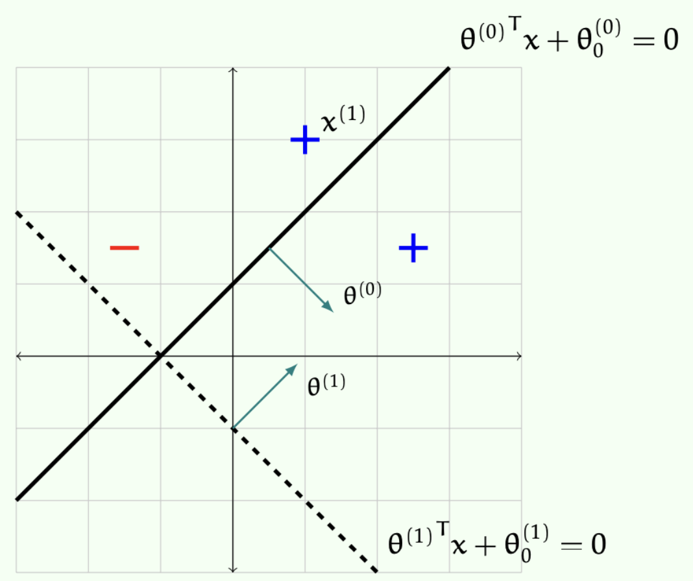

> 본 포스트는 서울대학교 컴퓨터공학부 · 인공지능대학원(IPAI) **박재식(Jaesik Park)** 교수님의 *Introduction to Machine Learning* (4190.428) 강의 자료(9강 *Perceptron & Neural Networks*)를 바탕으로, 강의를 처음 듣는 독자도 논리적 흐름을 따라갈 수 있도록 재구성한 것입니다. 원 강의 자료는 MIT 6.036(2019 Fall)과 Stanford CS229(2023–2024 Summer)의 강의 노트를 상당 부분 차용하고 있습니다.

## 한 줄 요약 (TL;DR)

> **"퍼셉트론은 틀릴 때마다 가중치를 정답 쪽으로 조금씩 돌리는 규칙일 뿐인데, 그 규칙이 최대 $(R/\gamma)^2$번의 실수만으로 끝난다는 것을 코사인 하나로 증명할 수 있습니다."**
>
> 전반부는 **퍼셉트론 수렴 정리**입니다. 오분류할 때마다 $\theta \leftarrow \theta + y^{(i)}x^{(i)}$로 갱신하는 이 단순한 알고리즘이, 데이터가 선형 분리 가능하기만 하면 **반드시 유한 번의 실수 안에** 분리기를 찾아냅니다. 증명은 현재 가중치 $\theta^{(k)}$와 정답 $\theta^*$ 사이 각도의 코사인을 위아래로 각각 묶는 데서 나옵니다 — 분자는 매 실수마다 최소 $\gamma$씩 늘고, 분모는 최대 $R^2$씩만 자라므로, 코사인이 1을 넘을 수 없다는 사실에서 $k \le (R/\gamma)^2$이 떨어집니다.
>
> 후반부는 그 한계를 넘어섭니다. 퍼셉트론은 결국 선형 모델이고, 3강에서 본 대로 특성 사상 $\phi$가 필요합니다. 그런데 $\phi$를 사람이 설계하는 대신 **데이터로부터 학습**하면 어떨까요 — 이것이 신경망입니다. 다층 완전연결망의 출력을 $\bar{h}_\theta(x) = W^{[r]}\phi_\beta(x) + b^{[r]}$로 다시 쓰면, 딥러닝이란 마지막 선형 층과 그 아래 특성 사상을 **동시에** 최적화하는 일임이 드러납니다.
>
> 마지막으로 도메인 구조를 반영한 현대 아키텍처들을 훑습니다 — 스킵 커넥션으로 깊이를 가능하게 한 **ResNet**, 공간 국소성을 이용한 **CNN**, 전역 의존성을 병렬로 계산하는 **Transformer/ViT**, 그리고 학습을 안정시키는 **LayerNorm**입니다.

## 1. 서론: 선형 분류기에서 비선형 신경망으로

* 머신러닝의 역사를 거슬러 올라가면 가장 흥미로운 이름을 가진 알고리즘 중 하나인 **퍼셉트론(Perceptron)**을 만나게 됩니다. 1962년 Rosenblatt에 의해 개발된 이 알고리즘은 당시에는 특정한 기준(criteria)을 최적화하려는 시도로 해석되지 않았고, 단순히 하나의 알고리즘 그 자체로 제시되었습니다. 하지만 이후 퍼셉트론의 수렴(convergence) 특성과 동작 방식에 대한 방대한 연구가 이루어졌으며, 이는 현대 딥러닝(Deep Learning)의 근간이 되었습니다.

* 본 포스트에서는 퍼셉트론의 수학적 기초와 수렴 증명을 시작으로, 선형 모델의 한계를 극복하기 위한 다층 신경망(Multi-layer Neural Networks), 그리고 컴퓨터 비전과 자연어 처리를 지배하고 있는 현대 신경망 아키텍처(ResNet, CNN, Transformer 등)까지 논리적 흐름에 따라 살펴보겠습니다.

---

## 2. 퍼셉트론 (The Perceptron)

### 2.1 퍼셉트론 알고리즘의 정의

* 학습 데이터셋 $\mathcal{D}_n$이 주어졌다고 가정해 보겠습니다. 여기서 입력 피처는 $x \in \mathbb{R}^d$이고, 레이블은 이진 분류를 위한 $y \in \{-1, +1\}$입니다. 퍼셉트론 알고리즘은 가중치 벡터 $\theta$와 편향(offset) $\theta_0$를 갖는 이진 분류기 $h(x; \theta, \theta_0)$를 학습합니다. 

* 퍼셉트론의 학습 과정은 다음과 같은 반복적인(iterative) 단계를 거칩니다:
  * 1. **초기화**: 가중치 벡터 $\theta = [\begin{matrix}0 & 0 & \cdots & 0\end{matrix}]^T$, 편향 $\theta_0 = 0$으로 설정합니다.
  * 2. **반복(Epochs)**: 정해진 횟수 $\tau$만큼 다음을 반복합니다.
  * 3. **데이터 순회**: 각 데이터 포인트 $i=1$부터 $n$에 대해 예측을 수행합니다.
  * 4. **업데이트 규칙**: 만약 $y^{(i)}(\theta^\top x^{(i)} + \theta_0) \le 0$라면 (즉, 예측이 틀렸다면), 파라미터를 다음과 같이 업데이트합니다.
     $$\theta = \theta + y^{(i)}x^{(i)}$$
     $$\theta_0 = \theta_0 + y^{(i)}$$

* 이 단순한 업데이트 규칙은 기하학적으로 분류 경계면(hyperplane)을 오분류된 데이터 포인트 방향으로 이동시키는 효과를 낳습니다.

* 예를 들어 $\theta^{(0)} = \begin{bmatrix}1 \\ -1\end{bmatrix}$, $\theta_0^{(0)} = 1$이고, 포인트 $x^{(1)} = \begin{bmatrix}1 \\ 3\end{bmatrix}$의 실제 레이블이 $y^{(1)} = 1$이라고 합시다. 이때

$$y^{(1)}\left({\theta^{(0)}}^\top x^{(1)} + \theta_0^{(0)}\right) = 1 \cdot \left(\begin{bmatrix}1 & -1\end{bmatrix}\begin{bmatrix}1 \\ 3\end{bmatrix} + 1\right) = (1 - 3) + 1 = -1 < 0$$

* 값이 음수이므로 오분류입니다. 업데이트 규칙에 따라

$$\theta^{(1)} = \theta^{(0)} + y^{(1)}x^{(1)} = \begin{bmatrix}1 \\ -1\end{bmatrix} + \begin{bmatrix}1 \\ 3\end{bmatrix} = \begin{bmatrix}2 \\ 2\end{bmatrix}, \qquad \theta_0^{(1)} = \theta_0^{(0)} + y^{(1)} = 2$$

* 가 되어 새로운 경계면을 형성합니다. 중요한 점은, 학습 오차(training error)가 0인 선형 분류기가 존재한다면 이 알고리즘은 궁극적으로 이를 찾아낸다는 것입니다.

### 2.2 Offset의 제거: 차원 확장을 통한 원점 통과 모델

* 해석과 구현을 단순화하기 위해, 분류기 공식을 $h(x; \theta) = +1 \text{ if } \theta^\top x > 0 \text{ else } -1$ 형태로 맞추는 것이 유리합니다. 
이를 위해 $d$차원의 피처 벡터와 offset을 포함한 문제를, offset이 없는 $(d+1)$차원 문제로 변환할 수 있습니다.

* 새로운 입력 $x_{new}$와 가중치 $\theta_{new}$를 다음과 같이 정의합니다:
$$x_{new} = [\begin{matrix}x_1 & x_2 & \cdots & x_d & +1\end{matrix}]^\top$$
$$\theta_{new} = [\begin{matrix}\theta_1 & \theta_2 & \cdots & \theta_d & \theta_0\end{matrix}]^\top$$
* 이렇게 하면 ${\theta_{new}}^\top x_{new} = \theta_1 x_1 + \cdots + \theta_d x_d + \theta_0 \cdot 1 = \theta^\top x + \theta_0$가 성립하므로, 원점을 지나는 동일한 형태의 분류 문제로 치환됩니다. 따라서 알고리즘에서도 $\theta_0$ 업데이트를 생략하고 오직 가중치 벡터만 업데이트하는 형태(Perceptron-Through-Origin)로 재작성할 수 있습니다.

#### 구체적인 예시

* 다음 1차원 데이터셋을 봅시다.
$$X = [[1], [2], [3], [4]], \qquad Y = [[+1], [+1], [-1], [-1]]$$
* 이 데이터는 $d=1$에서 $\theta = [-1]$, $\theta_0 = 2.5$로 분리됩니다 ($-x + 2.5 > 0 \iff x < 2.5$). 하지만 **원점을 지나는** 분리기, 즉 $\theta_0 = 0$인 형태로는 분리할 수 없습니다. 1차원에서 원점을 지나는 분리기는 부호만 보는 것이라 $x=1,2,3,4$가 모두 같은 쪽에 놓이기 때문입니다.
* 각 입력에 1을 덧붙여 2차원으로 올리면 상황이 달라집니다.
$$X_{new} = \left[\begin{bmatrix}1 \\ 1\end{bmatrix}, \begin{bmatrix}2 \\ 1\end{bmatrix}, \begin{bmatrix}3 \\ 1\end{bmatrix}, \begin{bmatrix}4 \\ 1\end{bmatrix}\right], \qquad \theta_{new} = [-1,\ 2.5]^\top$$
* 이제 이 데이터셋은 원점을 지나는 분리기로 완벽하게 나뉩니다. **차원 하나를 더해 편향을 흡수한 것**이지, 문제를 바꾼 것이 아니라는 점이 핵심입니다.

### 2.3 퍼셉트론 수렴 정리 (Convergence Theorem)

* 선형 분리가 가능하다(Linearly separable)는 것은, 모든 $i$에 대해 $y^{(i)}(\theta^\top x^{(i)} + \theta_0) > 0$을 만족하는 $\theta, \theta_0$가 존재한다는 뜻이며, 이는 학습 에러 $\epsilon_n(h) = 0$을 의미합니다.

* 퍼셉트론의 핵심 이론적 결과는 **데이터가 선형 분리 가능하다면 퍼셉트론 알고리즘은 반드시 선형 분리기를 찾아낸다는 보장(guarantee)이 있다**는 점입니다.
* 참고로 어떤 데이터가 선형 분리 가능한지 자체를 판정하는 알고리즘들도 존재하며, 실행 시간은 $O(n^{d/2})$, $O(d^2 n)$, $O(n^{d-1}\log n)$ 등으로 알려져 있습니다.
* 수렴을 증명하기 위해 **마진(margin)**이라는 개념을 도입합니다.
데이터 포인트와 초평면 사이의 거리는 $\frac{\theta^\top x + \theta_0}{||\theta||}$이며, 정확히 분류되었는지 여부를 고려한 기하학적 마진은 다음과 같습니다:
$$y \cdot \frac{\theta^\top x + \theta_0}{||\theta||}$$
* 데이터셋 전체의 마진은 위 값들의 최소값 $\min_i \left( y^{(i)} \cdot \frac{\theta^\top x^{(i)} + \theta_0}{||\theta||} \right)$으로 정의됩니다.

::: {.callout-tip}
## Study Question: 오분류된 점의 마진은 어떤 부호일까요?

**음수**입니다. 마진 $y \cdot \frac{\theta^\top x + \theta_0}{\|\theta\|}$에서 분모 $\|\theta\|$는 항상 양수이므로 부호는 $y(\theta^\top x + \theta_0)$가 결정합니다. 오분류란 예측 부호 $\mathrm{sign}(\theta^\top x + \theta_0)$가 실제 레이블 $y$와 다르다는 뜻이므로 이 곱은 음수입니다. 따라서 **데이터셋의 마진(= 개별 마진의 최솟값)이 양수인 것과 모든 점이 올바르게 분류된 것은 서로 필요충분조건**이며, 이 사실이 다음 수렴 정리에서 조건 a를 세울 수 있게 해 줍니다.
:::

#### **[수렴 정리의 가정과 결론]** 
* 편의상 원점을 지나는 선형 분리기를 가정할 때, 다음 조건이 성립한다고 합시다.
  * **조건 a**: 완벽히 분류하는 $\theta^*$가 존재하여, 모든 $i$에 대해 마진이 최소 $\gamma > 0$ 이상이다. 즉, $y^{(i)}\frac{{\theta^*}^\top x^{(i)}}{||\theta^*||} \ge \gamma$.
  * **조건 b**: 모든 데이터의 크기가 유계(bounded)이다. 즉, $||x^{(i)}|| \le R$.

::: {.callout-important}
## 정리 (퍼셉트론 수렴 정리)

원점을 지나는 분리기를 가정할 때, 위의 조건 a(마진 $\gamma > 0$ 이상으로 분리하는 $\theta^*$의 존재)와 조건 b($\|x^{(i)}\| \le R$)가 성립하면, 퍼셉트론 알고리즘은 **최대 $\left(\frac{R}{\gamma}\right)^2$번의 오분류만을 범한다.**
:::

* 주목할 점은 이 한계에 **데이터 개수 $n$도 차원 $d$도 등장하지 않는다**는 것입니다. 오직 데이터가 얼마나 넉넉히 분리되는가($\gamma$)와 얼마나 크게 퍼져 있는가($R$)만이 실수 횟수를 좌우합니다.

#### **[수렴 증명 과정]** 
* 증명의 핵심은 현재 학습된 가중치 $\theta^{(k)}$ (k번 틀렸을 때의 상태)와 이상적인 정답 가중치 $\theta^*$ 사이의 각도를 측정하는 것입니다. 두 벡터 사이의 각도의 코사인 값은 다음과 같이 분해할 수 있습니다.
$$\cos(\theta^{(k)}, \theta^*) = \frac{\theta^{(k)} \cdot \theta^*}{||\theta^*|| ||\theta^{(k)}||} = \left( \frac{\theta^{(k)} \cdot \theta^*}{||\theta^*||} \right) \cdot \left( \frac{1}{||\theta^{(k)}||} \right)$$

* **1) 분자 항 (The First Factor)의 전개:**
  * $k$번째 에러가 $i$번째 데이터에서 발생했다고 가정합시다. 조건 a의 마진 정의를 적용하면:
  $$\frac{\theta^{(k)}}{||\theta^*||} = \frac{(\theta^{(k-1)} + y^{(i)}x^{(i)}) \cdot \theta^*}{||\theta^*||} = \frac{\theta^{(k-1)} \cdot \theta^*}{||\theta^*||} + \frac{y^{(i)}x^{(i)} \cdot \theta^*}{||\theta^*||} \ge \frac{\theta^{(k-1)} \cdot \theta^*}{||\theta^*||} + \gamma$$
  * 이를 수학적 귀납법(Simple induction)으로 풀면, 최적 $\theta^*$의 방향으로 가중치가 에러 발생 횟수($k$)에 비례하여 지속적으로 증가함(최소 $k\gamma$)을 알 수 있습니다.

* **2) 분모 항 (The Second Factor)의 전개:**
  * 오분류 상황이므로 $y^{(i)}({\theta^{(k-1)}}^\top x^{(i)}) \le 0$입니다. 따라서 다음 부등식이 성립합니다.
  $$||\theta^{(k)}||^2 = ||\theta^{(k-1)} + y^{(i)}x^{(i)}||^2 = ||\theta^{(k-1)}||^2 + 2y^{(i)}{\theta^{(k-1)}}^\top x^{(i)} + ||x^{(i)}||^2 \le ||\theta^{(k-1)}||^2 + R^2$$
  * 귀납법과 조건 b를 적용하면 $||\theta^{(k)}||^2 \le kR^2$가 됩니다.

* **3) 종합 (Conclusion):**
  * 위의 두 결과를 코사인 식에 대입하면 다음과 같습니다.
  $$\cos(\theta^{(k)}, \theta^*) \ge (k\gamma) \cdot \frac{1}{\sqrt{k}R} = \sqrt{k} \cdot \frac{\gamma}{R}$$
  * 코사인 값은 최대 1을 넘을 수 없으므로, $1 \ge \sqrt{k} \cdot \frac{\gamma}{R}$가 성립하며, 이를 정리하면 $k \le \left(\frac{R}{\gamma}\right)^2$이 됩니다. 
  * 이 정리는 학습 벡터 크기의 상한($R$)과 데이터셋의 마진($\gamma$)을 통해 퍼셉트론 알고리즘의 오차 한계를 운영적(operational)으로 정의해 주는 훌륭한 성질을 보여줍니다.

---

## 3. 비선형 분류와 신경망의 탄생

* 선형 분류기나 선형 회귀는 $h_\theta(x) = \theta^\top x$ 혹은 수작업(handcrafted) 피처 맵을 이용한 $\theta^\top \phi(x)$ 형태를 가집니다. 그러나 실제 세계의 입력-출력 관계는 근본적으로 비선형(non-linear)입니다. 따라서 우리는 파라미터 $\theta$를 포함한 비선형 함수 $h_\theta(x)$를 손실 함수(loss function)를 최소화하여 학습해야 합니다.

### 3.1 목적 함수 (Loss Functions)

* **회귀 문제 (Regression)**: 연속적인 실수 $y^{(i)} \in \mathbb{R}$를 예측하며, 모델은 예측값과 타겟값의 차이를 줄이는 방향으로 학습합니다. MSE(Mean Squared Error) 손실 함수를 사용합니다.
  $$J(\theta) = \frac{1}{n}\sum_{i=1}^n \frac{1}{2}(h_\theta(x^{(i)}) - y^{(i)})^2$$ 

* **이진 분류 (Binary Classification)**: 실수 공간에서 로짓 $\bar{h}_\theta(x)$를 구한 뒤 시그모이드 함수를 통해 0~1 사이의 확률값 $h_\theta(x) = \sigma(\bar{h}_\theta(x)) = \frac{1}{1+e^{-\bar{h}_\theta(x)}}$으로 변환합니다. 오차는 Binary Cross-Entropy를 사용합니다.
  $$J(\theta) = -\frac{1}{n}\sum_{i=1}^n [y^{(i)}\log h_\theta(x^{(i)}) + (1-y^{(i)})\log(1-h_\theta(x^{(i)}))]$$ 

* **다중 클래스 분류 (Multi-class Classification)**: 로짓이 각 클래스($k$개) 예측값을 담은 벡터 $\bar{h}_\theta(x) \in \mathbb{R}^k$가 되며, 이를 Softmax 함수를 통해 확률 분포로 변환합니다.
  $$\hat{y}_c^{(i)} = p(y=c|x^{(i)};\theta) = \frac{e^{\hat{h}_{\theta_c}(x^{(i)})}}{\sum_{s=1}^k e^{\hat{h}_{\theta_s}(x^{(i)})}}$$ 
  손실 함수는 Cross-Entropy Loss가 됩니다.
  $$J(\theta) = -\frac{1}{n}\sum_{i=1}^n\sum_{c=1}^k y_c^{(i)}\log\hat{y}_c^{(i)}$$ 

### 3.2 신경망의 기초 (Neural Networks)

* 신경망은 반복적인 행렬 곱셈(matrix multiplication)과 비선형 활성화 함수(non-linear activation)로 구축됩니다. 
주택 가격 예측을 예로 들면, 입력으로 "집의 크기", "침실 개수", "우편번호", "동네 수준"을 주었을 때, 이를 곧바로 가격으로 변환하는 대신 신경망은 "가족 규모", "도보 가능성", "학교 품질"과 같은 중간 변수(hidden units, hidden neurons)를 스스로 학습하여 쌓아 올립니다.

* 이 그림을 수식으로 옮기면 은닉 유닛 $a_1, a_2, a_3$와 출력은 다음과 같습니다.
$$a_1 = \text{ReLU}(\theta_1 x_1 + \theta_2 x_2 + \theta_3), \quad a_2 = \text{ReLU}(\theta_4 x_3 + \theta_5), \quad a_3 = \text{ReLU}(\theta_6 x_3 + \theta_7 x_4 + \theta_8)$$
$$\bar{h}_\theta(x) = \theta_9 a_1 + \theta_{10} a_2 + \theta_{11} a_3 + \theta_{12}$$
  * 이렇게 중간에 끼워 넣은 $a_i$들을 **은닉 유닛(hidden units)** 또는 **은닉 뉴런(hidden neurons)**이라고 부릅니다.

* 단일 뉴런 모델은 가중치 $w \in \mathbb{R}^d$와 편향 $b \in \mathbb{R}$에 대해 $\theta = (w, b)$로 두고 계산한 선형 합을 ReLU와 같은 활성화 함수를 통과시키는 형태로 정의됩니다.
$$\bar{h}_\theta(x) = \text{ReLU}(w^\top x + b)$$ 
  * 여기서 $\text{ReLU}(t) = \max\{t, 0\}$은 음수 집값을 방지하는 효과적인 장치가 됩니다.

#### 다층 완전 연결 신경망 (Multi-layer Fully-Connected NN)과 벡터화

* 일반적인 2층 완전연결 신경망은 먼저 성분별로 다음과 같이 쓸 수 있습니다. 은닉 유닛이 $m$개일 때, 모든 $j \in \{1,\dots,m\}$에 대해
$$z_j = {w_j^{[1]}}^\top x + b_j^{[1]}, \quad a_j = \text{ReLU}(z_j), \qquad \bar{h}_\theta(x) = {w^{[2]}}^\top a + b^{[2]}$$
  * 여기서 $w_j^{[1]} \in \mathbb{R}^d$, $b_j^{[1]} \in \mathbb{R}$, $a = [a_1, \dots, a_m]^\top \in \mathbb{R}^m$, $w^{[2]} \in \mathbb{R}^m$입니다.
* $m$개의 식을 for-loop로 하나씩 돌리는 대신, 행벡터 $w_j^{[1]\top}$들을 세로로 쌓아 행렬 $W^{[1]}$을 만들면 전체가 한 줄로 압축됩니다.
$$a = \text{ReLU}(W^{[1]}x + b^{[1]}), \qquad \bar{h}_\theta(x) = W^{[2]}a + b^{[2]}$$

* 여러 개의 은닉 유닛을 병렬 및 직렬로 쌓으면, 연산은 개별 for-loop가 아니라 벡터 및 행렬 연산(Vectorization)으로 간결하게 표현됩니다. 층(layer) $r$에 대해 가중치 행렬 $W^{[r]}$를 도입하면 심층 네트워크의 계층적 연산은 다음과 같이 전개됩니다.
  * **첫 번째 은닉층**: $a^{[1]} = \text{ReLU}(W^{[1]}x + b^{[1]})$
  * **두 번째 은닉층**: $a^{[2]} = \text{ReLU}(W^{[2]}a^{[1]} + b^{[2]})$
  * $\cdots$
  * **$r-1$ 번째 은닉층**: $a^{[r-1]} = \text{ReLU}(W^{[r-1]}a^{[r-2]} + b^{[r-1]})$
  * **최종 출력층**: $\bar{h}_\theta(x) = W^{[r]}a^{[r-1]} + b^{[r]}$

##### 커널 기법과의 연결성 (Connection to the Kernel Method)

* 이러한 다층 신경망의 연산 과정은 과거 머신러닝의 핵심이었던 커널 기법(Kernel Method)과 매우 흥미로운 연결성을 가집니다.

* 전통적인 방식에서는 모델의 예측값을 $h_\theta(x) = \theta^T \phi(x)$ 형태로 정의했습니다. 여기서 파라미터 $\theta$는 데이터를 통해 학습되는 부분이었지만, 데이터를 고차원으로 보내는 **피처 맵(Feature map) $\phi(x)$는 연구자가 직접 설계한 수작업 함수(handcrafted function)**라는 한계가 있었습니다.

* 반면, **딥러닝은 주어진 문제에 가장 알맞은 피처 맵 자체를 자동으로 학습하는 방법론**으로 해석할 수 있습니다. 다층 신경망의 최종 출력층 수식을, 이전 층들의 결과물인 $a^{[r-1]}$을 하나의 피처 맵 $\phi_\beta(x)$로 치환하여 다시 써보겠습니다.

$$\bar{h}_\theta(x) = W^{[r]}\phi_\beta(x) + b^{[r]} \quad (\text{단, } \beta\text{는 } a^{[r-1]} = \phi_\beta(x)\text{를 구성하는 은닉층들의 파라미터})$$

* 이 수식을 통해 우리는 신경망의 작동 방식을 두 가지 관점에서 이해할 수 있습니다.
  * 1. **선형 모델로서의 관점**: 만약 피처 맵을 구성하는 파라미터 $\beta$가 고정(fixed)되어 있다면, $\phi_\beta(\cdot)$는 단순히 추출된 특징값들을 반환하는 고정된 함수가 됩니다. 이 경우 최종 예측 함수 $\bar{h}_\theta(x)$는 추출된 피처에 대한 단순한 **선형 모델(Linear model)**에 불과합니다.
  * 2. **동시 최적화(Joint Optimization)의 강력함**: 하지만 실제 딥러닝에서는 선형 분류기의 파라미터인 $W^{[r]}, b^{[r]}$만 최적화하는 것이 아닙니다. 오차 역전파(Backpropagation)를 통해 그 밑단에 있는 피처 맵 파라미터 $\beta$까지 **동시에 훈련(train both)**시킵니다. 

* 결과적으로 딥러닝은 단순한 선형 모델을 학습하는 것을 넘어, 데이터의 패턴을 가장 잘 구분해 낼 수 있는 **"좋은 피처 맵 $\phi_\beta(\cdot)$"을 데이터로부터 스스로 학습하는 최적화 과정**을 수행하게 됩니다.

#### 활성화 함수 종류 (Activation Functions)

* 심층 신경망에서 비선형성을 부여하기 위해 단순히 항등 함수(identity function)를 사용하면 층을 아무리 쌓아도 단일 선형 연산으로 붕괴되므로 무의미해집니다. 자주 쓰이는 함수들은 다음과 같습니다:
  * **Sigmoid**: $\sigma(z) = \frac{1}{1+e^{-z}}$ 
  * **Tanh**: $\sigma(z) = \frac{e^z - e^{-z}}{e^z + e^{-z}}$ 
  * **Leaky ReLU**: $\sigma(z) = \max\{z, \gamma z\}, \gamma \in (0, 1)$ 
  * **GELU**: $\sigma(z) = \frac{z}{2}[1 + \text{erf}(\frac{z}{\sqrt{2}})]$ 
  * **Softplus**: $\sigma(z) = \frac{1}{\beta}\log(1 + \exp(\beta z)), \beta > 0$ 

---

## 4. 현대 신경망 아키텍처 (Modern Architectures)

* 과거 단순한 Fully-Connected 구조에서 벗어나, 데이터의 도메인(이미지, 자연어 등)의 특성을 잘 반영할 수 있도록 설계된 아키텍처들이 딥러닝의 부흥을 이끌었습니다.

### 4.1 ResNet (Residual Network)

* 컴퓨터 비전 분야에서 가장 영향력 있는 디자인 중 하나인 ResNet은 신경망이 깊어질수록 발생하던 최적화 문제를 획기적으로 개선했습니다. 
* 핵심 아이디어는 스킵 커넥션(skip connection)을 통해 항등 매핑(identity shortcut)을 더해주는 것입니다.

* 일반적인 층이 입력 $x$에 대해 출력 $F(x)$를 직접 학습한다면, 잔차 블록(Residual block)은 변화량(Residual function)만을 학습하여 기존 값 $z$에 더합니다.
$$\text{Res}(z) = z + \sigma(\text{MM}(\sigma(\text{MM}(z))))$$ 
* 전체 네트워크는 이러한 잔차 블록들을 합성한 $\text{ResNet-S}(x) = \text{MM}(\text{Res}(\text{Res}(\cdots \text{Res}(x))))$ 형태가 되어 수백 층 이상의 깊은 학습이 가능해졌습니다.

![Figure 3: 일반적인 다층 퍼셉트론(왼쪽)과 잔차 연결을 쓰는 ResNet(오른쪽)의 구조를 나란히 비교한 그림입니다. 양쪽 모두 아래에서 입력 $x$가 들어가 위로 올라가며, 점선 상자는 한 층의 내부를 확대한 것입니다. **왼쪽 Normal Layers**에서 각 층은 행렬곱 $\text{MM}_{W^{[i]}, b^{[i]}}$ 뒤에 활성화 $\sigma$를 통과시키는 단순한 직렬 경로이고, 신호가 반드시 모든 변환을 거쳐야만 위로 전달됩니다. **오른쪽 w/ Residual Connection**의 Res 블록 안에는 같은 MM–$\sigma$ 쌍이 두 번 들어 있지만, 그 옆으로 입력을 그대로 위쪽 덧셈 기호(+)까지 실어 나르는 **곡선 화살표(스킵 커넥션)**가 하나 더 있습니다. 이 우회로 덕분에 블록은 출력 전체가 아니라 **입력에 더할 변화량(잔차)만** 학습하면 되고, 역전파 시 기울기가 곡선 경로를 따라 손실 없이 아래로 내려갈 수 있어 수백 층 규모의 학습이 가능해집니다.](./images/figure03_resnet_vs_normal_layers.png)

### 4.2 합성곱 신경망 (CNN: Convolutional Neural Network)

* CNN은 2D 입력 이미지 처리를 위해 특별히 설계된 구조입니다. 
* 네트워크가 공간적 위상을 유지한 채로 $k \times k$ 필터를 활용하여 로컬 영역을 슬라이딩하면서 합성곱 연산을 수행합니다. 이를 통해 다중 채널(multi-channel) 3D 텐서 상에서 복잡한 공간적 특징(spatial features)을 자동적으로 추출합니다.
* 여기에 최대 풀링(Max-pooling)과 같은 특화된 모듈을 삽입해 효과적인 다운샘플링(downsampling)을 수행한 뒤, 최종 분류층으로 연결됩니다.

![Figure 4: 계층적 2차원 합성곱 신경망 파이프라인의 전형적인 구성입니다. 왼쪽 끝의 입력층은 $36 \times 36 \times 3$ 크기의 상자로, 마지막 3이 RGB 채널 수입니다. 그 위에 겹쳐 그려진 작은 점선 상자가 $11 \times 11$ 필터가 훑는 국소 영역이며, 화살표는 그 영역 하나가 다음 층의 한 점으로 요약됨을 나타냅니다. 합성곱층 1을 지나면 $26 \times 26 \times 9$가 되어 **공간 크기는 줄고 채널 수는 늘어나며**, 이어지는 최대 풀링층이 $12 \times 12 \times 9$로 절반 이하로 줄입니다. 같은 패턴(합성곱 → 풀링)이 한 번 더 반복되어 $6 \times 6 \times 3$, 다시 $2 \times 3 \times 3$까지 압축된 뒤, 오른쪽의 완전연결층(파란 원들)과 출력층(초록 원들)으로 이어집니다. 층이 깊어질수록 공간 해상도를 버리는 대신 채널(= 검출하는 특징의 종류)을 늘려 가는 이 사다리 구조가 CNN의 핵심이며, 필터가 이미지 전체를 슬라이딩하며 같은 가중치를 재사용하기 때문에 완전연결망보다 훨씬 적은 파라미터로 공간적 특징을 잡아냅니다.](./images/figure04_cnn_pipeline.png)

### 4.3 트랜스포머와 시각 트랜스포머 (Transformer & ViT)

* 자연어 처리의 패러다임을 바꾼 **Transformer** 모델의 핵심 메커니즘은 Self-Attention(자기 주의)입니다. 
* 어텐션은 시퀀스 내의 모든 토큰 간의 관계를 계산하여 전역적인 의존성(global dependencies)을 모델링합니다. 모든 연산은 쿼리(Q), 키(K), 값(V) 행렬을 통해 전체 시퀀스를 병렬로 한 번에 처리하며, 이는 현대 대규모 언어 모델(LLMs)의 구조적 기반이 되었습니다.

* **ViT (Vision Transformer)**는 이 구조를 컴퓨터 비전 분야에 적용한 사례입니다. 이미지를 분할하여 1D 시퀀스인 패치(flattened patches)로 만들어 Transformer 인코더에 밀어넣습니다. 기존 CNN의 구조적 한계인 국소 수용 영역(local receptive field)의 제약을 우회하여, 초기 계층부터 이미지의 전역적인 공간 컨텍스트(global spatial context)를 직접 포착할 수 있다는 강력한 이점을 가집니다. 이는 방대한 데이터셋에서의 대규모 사전 학습(pre-training)과 결합될 때 엄청난 성능을 보여줍니다.

![Figure 5: Vision Transformer(ViT)의 전체 구조(왼쪽)와 그 안에 쓰이는 Transformer 인코더 블록의 내부(오른쪽)입니다. 왼쪽 아래에서 입력 이미지가 격자로 잘려 아홉 개의 정사각 패치가 되고, 이들이 순서대로 "Linear Projection of Flattened Patches"를 통과해 벡터로 바뀝니다. 그 위 분홍색 칸들이 패치 임베딩에 위치 임베딩을 더한 토큰들이며, 맨 앞의 `0*`는 분류를 위해 추가로 학습되는 [class] 토큰입니다. 이 토큰 열 전체가 회색 Transformer Encoder를 통과한 뒤, [class] 토큰의 출력만 주황색 MLP Head로 들어가 최종 클래스(Bird, Ball, Car …)를 냅니다. 오른쪽 패널은 그 인코더 한 블록의 속을 보여 주는데, 아래에서부터 Norm → Multi-Head Attention → 덧셈(잔차 연결) → Norm → MLP → 덧셈 순서이며, `L ×`는 이 블록이 $L$번 반복됨을 뜻합니다. 두 개의 (+) 기호가 §4.1의 잔차 연결이고 두 개의 Norm이 §4.4의 LayerNorm이어서, 이 그림 한 장이 앞서 본 요소들이 실제로 어떻게 조립되는지를 보여 줍니다. 이미지를 자르는 순간부터 모든 패치가 서로를 볼 수 있다는 점이 CNN의 국소 수용 영역과 결정적으로 다른 지점입니다.](./images/figure05_vision_transformer.png)

### 4.4 정규화 기법 (Normalization)

* 깊은 네트워크를 안정적으로 학습시키기 위해서는 활성화 값을 정규화하는 기법이 필수적입니다. 데이터 텐서의 형태 $N$(배치), $C$(채널), $H, W$(공간 크기)에서 기준 축을 어떻게 설정하느냐에 따라 나뉩니다.
  * **Batch Norm**: 배치 전체에 대해 채널별로 평균과 분산을 계산합니다.
  * **Layer Norm**: Transformer 계열에서 주로 쓰이며, 각 개별 샘플 단위로 모든 채널에 대해 정규화를 수행하므로 미니배치 통계(mini-batch statistics)에 독립적이라는 장점이 있습니다. 계산식은 다음과 같습니다:
    $$LN(x) = \gamma \odot \frac{x - \mu}{\sqrt{\sigma^2 + \epsilon}} + \beta$$ 
  * 이 외에도 채널 축을 나눠 수행하는 **Instance Norm**, **Group Norm** 등이 존재합니다.

---

## 정리하며 (Closing Remarks)

이번 강의의 논리 사슬을 한 장으로 요약하면 다음과 같습니다.

| 단계 | 내용 | 근거 |
|:---|:---|:---|
| **① 알고리즘** | 틀릴 때마다 $\theta \leftarrow \theta + y^{(i)}x^{(i)}$, $\theta_0 \leftarrow \theta_0 + y^{(i)}$ | §2.1 |
| **② 기하학적 의미** | 갱신은 경계면을 오분류된 점 쪽으로 회전시킨다 | §2.1, Figure 1 |
| **③ 단순화** | 입력에 1을 덧붙여 차원을 하나 올리면 편향이 흡수된다 | §2.2 |
| **④ 성공의 정의** | 선형 분리 가능 $\iff$ 모든 $i$에서 $y^{(i)}(\theta^\top x^{(i)}+\theta_0)>0$ $\iff \epsilon_n(h)=0$ | §2.3 |
| **⑤ 측정 도구** | 마진 $y \cdot \frac{\theta^\top x + \theta_0}{\|\theta\|}$ — 부호가 정오답을, 크기가 여유를 나타낸다 | §2.3 |
| **⑥ 가정** | (a) 마진 $\gamma$ 이상으로 분리하는 $\theta^*$ 존재, (b) $\|x^{(i)}\| \le R$ | §2.3 |
| **⑦ 증명 전략** | $\cos(\theta^{(k)}, \theta^*)$를 두 인수로 쪼개 각각 묶는다 | §2.3 |
| **⑧ 분자** | 실수 한 번마다 $\gamma$씩 증가 → $\ge k\gamma$ | §2.3 |
| **⑨ 분모** | 오분류 시 교차항이 음수이므로 $\|\theta^{(k)}\|^2 \le kR^2$ | §2.3 |
| **⑩ 결론** | $\cos \ge \sqrt{k}\gamma/R \le 1$ → $k \le (R/\gamma)^2$ — $n$도 $d$도 무관 | §2.3 |
| **⑪ 한계와 전환** | 퍼셉트론은 선형 모델이며, 실제 관계는 비선형이다 | §3 |
| **⑫ 목적 함수** | 회귀는 MSE, 이진 분류는 시그모이드+BCE, 다중 분류는 softmax+CE | §3.1 |
| **⑬ 신경망** | 행렬곱과 비선형 활성화를 번갈아 쌓아 중간 표현을 스스로 만든다 | §3.2, Figure 2 |
| **⑭ 커널과의 연결** | $\bar{h}_\theta(x) = W^{[r]}\phi_\beta(x) + b^{[r]}$ — 특성 사상까지 함께 학습한다 | §3.2 |
| **⑮ 현대 아키텍처** | ResNet(스킵) · CNN(공간 국소성) · Transformer/ViT(전역 의존성) · LayerNorm(안정화) | §4, Figure 3–5 |