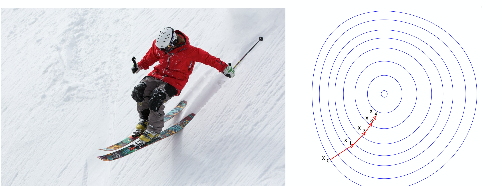
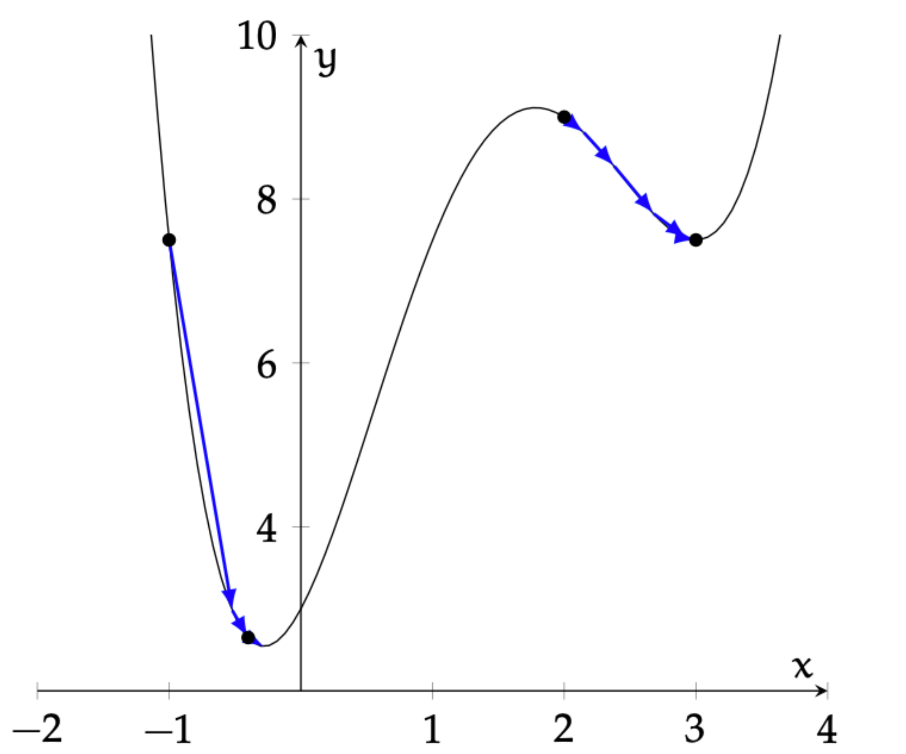
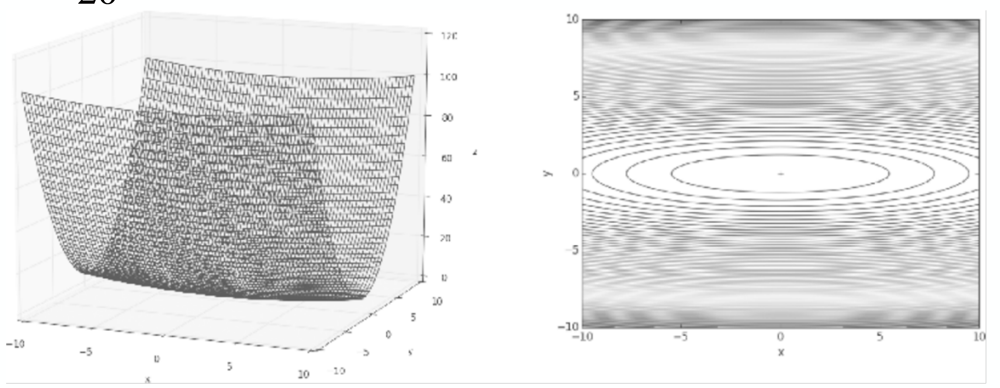
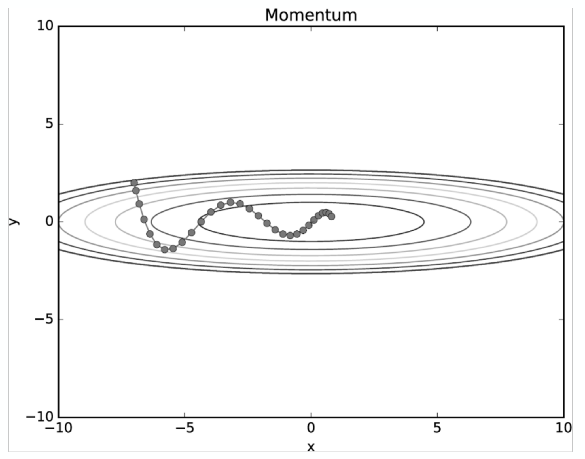
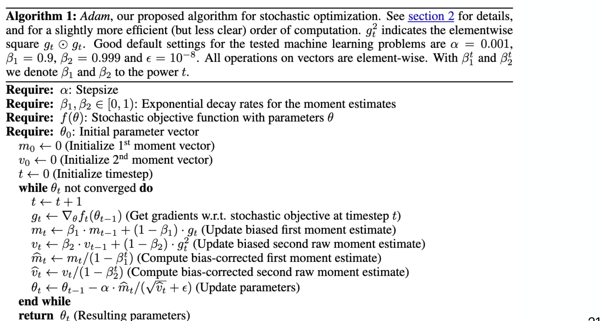
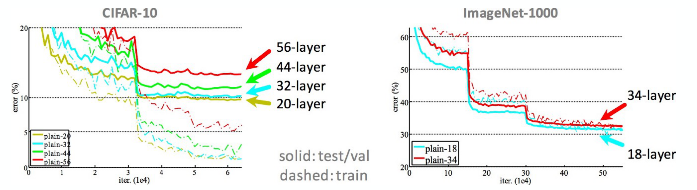

## 개요 (Overview)

이번 포스트에서는 머신러닝 모델 학습의 근간이 되는 **경사 하강법(Gradient Descent)**을 다룹니다.  
최적 파라미터를 어떻게 찾는지에 대한 동기(motivation)에서 출발하여, 1차원 알고리즘 → 다차원 확장 → 로지스틱 회귀 적용 → 확률적 경사 하강법(SGD) → Momentum / AdaGrad / Adam 순으로 전개합니다.

---

## 1. 최적 파라미터를 어떻게 찾을 것인가? (How can we find the optimal parameter?)

### 핵심 최적화 문제

머신러닝에서 우리가 풀고자 하는 문제는 다음과 같이 정의됩니다.

$$
\Theta^* = \arg\min_{\Theta} J(\Theta)
$$

- $\Theta$: 모델 파라미터(스칼라 또는 벡터)
- $J(\Theta)$: **목적 함수(objective function)** 혹은 **비용 함수(cost function)**
- $\Theta^*$: $J$를 최소화하는 최적 파라미터

### 기하학적 직관

$J(\Theta)$를 $\Theta$ 공간 위에 펼쳐진 **표면(surface)**으로 시각화할 수 있습니다.

- 이 표면에서 **가장 낮은 점(global minimum)**을 찾는 것이 목표입니다.
- 그러려면 현재 위치에서 "경사가 가장 가파르게 내려가는 방향"을 파악한 뒤, 그 방향으로 **작은 걸음**을 내딛어야 합니다.
- 이 과정을 반복하면 결국 최솟값 근방에 도달합니다 — 마치 눈 덮인 산에서 스키어가 가장 가파른 경사를 타고 내려오는 것과 같습니다.

---

## 2. 1차원 경사 하강법 (One Dimension Case)

### 알고리즘 설정

$\Theta \in \mathbb{R}$ (스칼라)이고 $J(\Theta)$와 $J'(\Theta)$ 모두 알려져 있다고 가정합니다.  
알고리즘을 실행하기 위해 다음 세 가지를 사전에 정해야 합니다.

1. **초기값** $\Theta_{\text{init}}$: 파라미터의 출발점
2. **스텝 크기(step-size)** $\eta$ (학습률, learning rate): 각 반복에서 이동하는 거리
3. **정확도 파라미터** $\varepsilon$: 알고리즘 정지 조건의 임계값

### 알고리즘 14: 1D-Gradient-Descent

$$
\begin{aligned}
&\textbf{Algorithm 14: } \text{1D-Gradient-Descent}(\Theta_{\text{init}},\, \eta,\, f,\, f',\, \varepsilon) \\
&1:\; \Theta^{(0)} = \Theta_{\text{init}} \\
&2:\; t = 0 \\
&3:\; \textbf{while } |f(\Theta^{(t)}) - f(\Theta^{(t-1)})| > \varepsilon \textbf{ do} \\
&4:\;\quad t = t + 1 \\
&5:\;\quad \Theta^{(t)} = \Theta^{(t-1)} - \eta f'(\Theta^{(t-1)}) \\
&6:\; \textbf{return } \Theta^{(t)}
\end{aligned}
$$

**핵심 업데이트 규칙**:

$$
\boxed{\Theta^{(t)} = \Theta^{(t-1)} - \eta \cdot f'(\Theta^{(t-1)})}
$$

- $f'(\Theta^{(t-1)}) > 0$이면 현재 위치가 오른쪽 경사에 있으므로 $\Theta$를 **감소**시킵니다.
- $f'(\Theta^{(t-1)}) < 0$이면 현재 위치가 왼쪽 경사에 있으므로 $\Theta$를 **증가**시킵니다.
- 결과적으로 항상 **함수값이 낮아지는 방향**으로 이동합니다.

이 알고리즘은 **함수값의 변화량이 충분히 작아질 때** 정지합니다.

---

### 정지 조건 (Stopping Criteria)

정지 조건은 문제에 따라 여러 가지로 설정할 수 있습니다.

| 정지 조건 | 수식 | 설명 |
|-----------|------|------|
| 고정된 반복 횟수 | $t = T$ | 가장 단순하며 SGD에 자주 사용 |
| 파라미터 변화량 | $\|\Theta^{(t)} - \Theta^{(t-1)}\| < \varepsilon$ | 파라미터가 거의 움직이지 않을 때 정지 |
| 기울기의 크기 | $|f'(\Theta^{(t)})| < \varepsilon$ | 기울기가 0에 수렴하면 정지 (최솟값의 필요조건) |

- **함수값 변화 기준** $|f(\Theta^{(t)}) - f(\Theta^{(t-1)})| < \varepsilon$: 위 Algorithm 14에서 사용된 기준으로, 목적 함수의 감소폭이 임계값 이하일 때 수렴으로 판단합니다.
- 어떤 기준을 선택하느냐에 따라 수렴 속도와 정확도에 차이가 생기므로, **문제의 특성에 맞는 기준**을 선택하는 것이 중요합니다.

---

## 3. 경사 하강법 수렴 정리 (Gradient Descent Convergence Theorem)

### 볼록 함수(Convex Function)에 대한 수렴 보장

**정리**: $J$가 **볼록 함수(convex function)**라면, 임의의 원하는 정확도 $\varepsilon > 0$에 대해 적절한 스텝 크기 $\eta$가 존재하여, 경사 하강법이 최적 $\Theta$에서 $\varepsilon$ 이내로 수렴합니다.

이는 볼록 함수에서 경사 하강법의 수렴이 **이론적으로 보장됨**을 의미합니다.

### 학습률 선택의 중요성

그러나 실제로는 학습률 $\eta$ 선택이 매우 중요합니다. 잘못된 $\eta$ 선택은 다음 문제를 초래합니다.

- **너무 큰 학습률 (Big learning rate)**: 최솟값 주변에서 **진동(oscillation)**하거나, 심하면 **발산(divergence)**합니다.
- **너무 작은 학습률 (Small learning rate)**: 수렴은 하지만 **매우 느리게** 내려갑니다. 계산 비용이 급증합니다.

---

## 4. 비볼록 함수의 경우 (Non-Convex Case)

실제 딥러닝 모델의 손실 함수는 대부분 **비볼록(non-convex)**입니다.  
이 경우 경사 하강법의 수렴 결과는 **초기값 $\theta_{\text{init}}$에 따라 달라집니다**.

- 초기값이 전역 최솟값(global minimum) 근방에 있으면 운 좋게 전역 최솟값으로 수렴할 수 있습니다.
- 하지만 초기값이 나쁘면 **지역 최솟값(local minimum)**에 갇혀버릴 수 있습니다.
- 비볼록 함수에서 경사 하강법은 **전역 최솟값을 보장하지 않습니다**.

> **실무 함의**: 딥러닝에서는 무작위 재시작(random restarts), 배치 노이즈(SGD의 노이즈), 특수한 초기화 기법 등을 통해 지역 최솟값 문제를 완화합니다.

---

## 5. 다차원으로의 확장 (Multiple Dimensions)

### 기울기 벡터(Gradient Vector)

$\Theta \in \mathbb{R}^m$이고 $J : \mathbb{R}^m \to \mathbb{R}$인 다차원 경우로의 확장은 직관적입니다.  
$J$의 $\Theta$에 대한 **기울기(gradient)**는 다음과 같이 정의됩니다.

$$
\nabla_\Theta J =
\begin{pmatrix}
\partial J / \partial \Theta_1 \\
\vdots \\
\partial J / \partial \Theta_m
\end{pmatrix}
\in \mathbb{R}^m
$$

- 기울기 벡터 $\nabla_\Theta J$는 $J$가 **가장 가파르게 증가하는 방향**을 가리킵니다.
- 따라서 $-\nabla_\Theta J$는 가장 가파르게 **감소하는 방향**입니다.

### 다차원 업데이트 규칙

1차원과 동일한 구조이지만, 스칼라 도함수 대신 기울기 벡터를 사용합니다.

$$
\boxed{\Theta^{(t)} = \Theta^{(t-1)} - \eta \nabla_\Theta J(\Theta^{(t-1)})}
$$

### 정지 조건

차원수(dimensionality)에 무관하게 다음 기준을 사용할 수 있습니다.

$$
|f(\Theta^{(t)}) - f(\Theta^{(t-1)})| < \varepsilon
$$

함수값의 절댓값 변화를 기준으로 하면, $\Theta$의 차원이 $m$이어도 스칼라 비교이므로 **차원에 독립적**입니다.

---

## 6. 로지스틱 회귀에의 적용 (Application to Logistic Regression)

### 모델 설정

선형 로지스틱 분류기(linear logistic classifier)를 가정합니다.  
파라미터는 벡터 $\theta \in \mathbb{R}^d$와 스칼라 편향 $\theta_0 \in \mathbb{R}$로 구성됩니다.

예측 확률:

$$
g^{(i)} = \sigma\!\left(\theta^\top x^{(i)} + \theta_0\right)
$$

여기서 $\sigma(\cdot)$는 **시그모이드 함수(sigmoid function)**:

$$
\sigma(z) = \frac{1}{1 + e^{-z}}
$$

중요한 성질: $\sigma'(z) = \sigma(z)(1 - \sigma(z))$.

### 손실 함수 (Objective Function)

**음의 로그 우도(negative log-likelihood, NLL)** 손실에 $L_2$ 정규화 항을 추가한 형태입니다.

$$
J_{lr}(\theta, \theta_0) = \frac{1}{n} \sum_{i=1}^{n} \mathcal{L}_{nll}(g^{(i)}, y^{(i)}) + \frac{\lambda}{2} \|\theta\|^2
$$

이진 분류에서 NLL 손실은 다음과 같습니다.

$$
\mathcal{L}_{nll}(g, y) = -y \log g - (1 - y) \log(1 - g)
$$

- 첫째 항: 데이터에 대한 평균 손실 (fit to data)
- 둘째 항: $L_2$ 정규화 (과적합 방지, $\theta_0$는 포함되지 않음에 주의)

---

### 기울기 유도 (Gradient Derivation)

#### $\nabla_\theta J_{lr}$ 계산

연쇄 법칙(chain rule)을 단계적으로 적용합니다.

**Step 1. NLL 손실의 $g$에 대한 편미분**

$$
\frac{\partial \mathcal{L}_{nll}}{\partial g} = -\frac{y}{g} + \frac{1 - y}{1 - g} = \frac{g - y}{g(1 - g)}
$$

**Step 2. 시그모이드 함수의 $\theta$에 대한 편미분**

$z^{(i)} = \theta^\top x^{(i)} + \theta_0$으로 정의하면:

$$
\frac{\partial g^{(i)}}{\partial \theta} = \sigma'(z^{(i)}) \cdot x^{(i)} = g^{(i)}(1 - g^{(i)}) \cdot x^{(i)}
$$

**Step 3. 연쇄 법칙으로 결합**

$$
\nabla_\theta \mathcal{L}_{nll}(g^{(i)}, y^{(i)}) 
= \frac{\partial \mathcal{L}_{nll}}{\partial g^{(i)}} \cdot \frac{\partial g^{(i)}}{\partial \theta}
= \frac{g^{(i)} - y^{(i)}}{g^{(i)}(1-g^{(i)})} \cdot g^{(i)}(1-g^{(i)}) \cdot x^{(i)}
= (g^{(i)} - y^{(i)}) \cdot x^{(i)}
$$

**Step 4. 정규화 항의 기울기**

$$
\nabla_\theta \left(\frac{\lambda}{2} \|\theta\|^2\right) = \lambda \theta
$$

**최종 결과**:

$$
\boxed{
\nabla_\theta J_{lr}(\theta, \theta_0) = \frac{1}{n} \sum_{i=1}^{n} (g^{(i)} - y^{(i)}) x^{(i)} + \lambda \theta
}
$$

> **직관**: $(g^{(i)} - y^{(i)})$는 예측 확률과 실제 레이블의 **잔차(residual)**입니다. 예측이 레이블과 가까울수록 기울기가 작고, 멀수록 강하게 파라미터를 조정하게 됩니다.

---

#### $\partial J_{lr} / \partial \theta_0$ 계산

$\theta_0$에 대한 편미분도 동일한 연쇄 법칙으로 구합니다.  
다만 $\theta_0$는 정규화 항에 포함되지 않으므로 ($\nabla_{\theta_0}(\lambda/2 \|\theta\|^2) = 0$):

$$
\boxed{
\frac{\partial J_{lr}}{\partial \theta_0} = \frac{1}{n} \sum_{i=1}^{n} (g^{(i)} - y^{(i)})
}
$$

---

### 차원 확인 (Dimension Check)

$\theta \in \mathbb{R}^d$, $x^{(i)} \in \mathbb{R}^d$, $g^{(i)}, y^{(i)} \in \mathbb{R}$일 때:

| 수량 | 차원 | 설명 |
|------|------|------|
| $\nabla_\theta J_{lr}$ | $d \times 1$ | $\theta$와 동일한 형상 |
| $(g^{(i)} - y^{(i)}) x^{(i)}$ | $d \times 1$ | 스칼라 × 벡터 |
| $\partial J_{lr} / \partial \theta_0$ | 스칼라 | $\theta_0$와 동일 |

- 이는 일반적인 $m$차원 GD에서의 $\nabla_\Theta J \in \mathbb{R}^m$에서 $m = d$로 대응됩니다.
- $\theta_0$는 $\theta$와 분리되어 별도로 업데이트되므로, 전체 파라미터 공간은 $\mathbb{R}^{d+1}$입니다.

---

### 알고리즘 15: LR-Gradient-Descent

$$
\begin{aligned}
&\textbf{Algorithm 15: } \text{LR-Gradient-Descent}(\theta_{\text{init}},\, \theta_{0\text{init}},\, \eta,\, \varepsilon) \\
&1:\; \theta^{(0)} = \theta_{\text{init}} \\
&2:\; \theta_0^{(0)} = \theta_{0\text{init}} \\
&3:\; t = 0 \\
&4:\; \textbf{while } \bigl|J_{lr}(\theta^{(t)}, \theta_0^{(t)}) - J_{lr}(\theta^{(t-1)}, \theta_0^{(t-1)})\bigr| > \varepsilon \textbf{ do} \\
&5:\;\quad t = t + 1 \\
&6:\;\quad \theta^{(t)} = \theta^{(t-1)} - \eta\!\left(\frac{1}{n}\sum_{i=1}^n \Bigl(\sigma\!\left(\theta^{(t-1)\top} x^{(i)} + \theta_0^{(t-1)}\right) - y^{(i)}\Bigr) x^{(i)} + \lambda \theta^{(t-1)}\right) \\
&7:\;\quad \theta_0^{(t)} = \theta_0^{(t-1)} - \eta\!\left(\frac{1}{n}\sum_{i=1}^n \Bigl(\sigma\!\left(\theta^{(t-1)\top} x^{(i)} + \theta_0^{(t-1)}\right) - y^{(i)}\Bigr)\right) \\
&8:\; \textbf{return } \theta^{(t)},\, \theta_0^{(t)}
\end{aligned}
$$

이 알고리즘은 **일반적인 경사 하강법(GD)**과 **로지스틱 회귀(LR)**를 단순히 결합한 형태입니다.  
매 반복마다 전체 데이터셋($n$개 샘플)을 모두 사용한다는 점에서 이것은 **배치 경사 하강법(Batch Gradient Descent)**에 해당합니다.

---

## 7. 확률적 경사 하강법 (Stochastic Gradient Descent)

### 기본 아이디어

일반적인(배치) 경사 하강법은 초기값이 동일하면 **항상 같은 결과**를 냅니다.  
**노이즈를 의도적으로 주입**하기 위해, 전체 데이터 대신 **무작위로 뽑은 단 1개의 데이터 포인트**를 사용해 기울기를 추정합니다.

핵심 관찰: 목적 함수가 다음과 같은 **합(sum) 형태**를 가질 때,

$$
f(\Theta) = \sum_{i=1}^{n} f_i(\Theta)
$$

하나의 샘플에서 계산한 기울기 $\nabla_\Theta f_i(\Theta)$는 **전체 기울기의 불편 추정량(unbiased estimator)**입니다.

$$
\mathbb{E}[\nabla_\Theta f_i(\Theta)] = \nabla_\Theta f(\Theta)
$$

즉, 기댓값 측면에서 **올바른 방향**으로 이동하게 됩니다.

---

### 알고리즘 7: Stochastic-Gradient-Descent

$$
\begin{aligned}
&\textbf{Algorithm 7: } \text{Stochastic-Gradient-Descent}(\Theta_{\text{init}},\, \eta,\, f,\, \nabla_\Theta f_1, \ldots, \nabla_\Theta f_n,\, T) \\
&1:\; \Theta^{(0)} = \Theta_{\text{init}} \\
&2:\; \textbf{for } t = 1 \text{ to } T \textbf{ do} \\
&3:\;\quad \text{randomly select } i \in \{1, 2, \ldots, n\} \\
&4:\;\quad \Theta^{(t)} = \Theta^{(t-1)} - \eta(t) \cdot \nabla_\Theta f_i(\Theta^{(t-1)}) \\
&5:\;\quad \textbf{return } \Theta^{(t)} \\
&6:\; \textbf{(end for)}
\end{aligned}
$$

주요 특징:

- **학습률 $\eta$가 반복 횟수 $t$에 따라 변화**합니다: $\eta(t)$ (다음 절 참조).
- **정지 조건 설정이 까다롭습니다**: 단일 샘플 기울기는 노이즈가 크므로 함수값 변화를 안정적으로 추적하기 어렵습니다.
- 위 알고리즘에서는 단순히 **고정된 반복 횟수 $T$** 후 정지하는 방식을 채택합니다.

---

### SGD 수렴 정리 (SGD Convergence Theorem)

> **[Advanced]** $t$가 증가함에 따라 SGD가 지역 최적값으로 수렴하려면 학습률 $\eta(t)$이 **감소**해야 합니다.

**정리**: $J$가 볼록 함수이고, 학습률 수열 $\{\eta(t)\}$이 다음 두 조건을 동시에 만족하면:

$$
\sum_{t=1}^{\infty} \eta(t) = \infty \quad \text{and} \quad \sum_{t=1}^{\infty} \eta(t)^2 < \infty
$$

SGD는 확률 1로(with probability 1) 최적 $\Theta$에 수렴합니다.

이 조건은 **Robbins–Monro 조건**으로도 불리며, 직관적으로는:

- 첫째 조건($\sum \eta(t) = \infty$): 학습률이 0으로 수렴하더라도 **충분히 많은 거리를 이동**할 수 있어야 합니다.
- 둘째 조건($\sum \eta(t)^2 < \infty$): 학습률이 **빠르게 감소**하여 노이즈의 분산이 결국 0으로 줄어들어야 합니다.

이를 만족하는 대표적인 예: $\eta(t) = \frac{c}{t}$ (단, $c > 0$인 상수).

---

### SGD가 유리한 이유 (Why SGD Might Be Better?)

세 가지 측면에서 SGD가 일반 배치 GD보다 유리할 수 있습니다.

1. **비볼록 함수에서의 탈출 능력**: $f$가 비볼록이고 얕은 지역 최솟값(shallow local optima)이 많을 때, 단일 샘플에서 추정한 **노이즈 있는 기울기**가 파라미터를 지역 최솟값 밖으로 "튕겨내는(bounce)" 역할을 합니다.

2. **암묵적 정규화 효과**: 일반 GD는 훈련 세트에 과적합(overfit)할 수 있는 반면, SGD의 확률적 특성이 일종의 **정규화 효과**를 내어 **테스트 오차를 낮추는** 효과를 보이기도 합니다.

3. **연산 및 메모리 효율**: 일반 GD는 기울기 계산에 **모든 데이터 포인트**를 사용해야 하므로, 데이터셋이 클수록 한 번의 업데이트 비용이 매우 큽니다. SGD는 **1개 샘플**만 사용하므로 업데이트가 빠릅니다.

---

### 미니배치 SGD (Minibatch SGD)

SGD와 배치 GD의 절충안이 **미니배치 SGD(Minibatch SGD)**입니다.

- **순수 SGD** (1개 샘플): 빠르고 온라인 학습 가능하지만, 기울기 추정이 **노이즈에 민감**합니다.
- **미니배치 SGD** (배치 $B$ 사용): 빠르고 온라인 학습 가능하면서, 기울기 추정이 **노이즈에 강인**합니다.

| 방식 | 손실 | 업데이트 |
|------|------|---------|
| 순수 SGD | $L = \frac{1}{2}(y_n - \hat{y}_n)^2$ | $w_i(t+1) = w_i(t) - \eta \frac{\partial L_n}{\partial w_i}$ |
| 미니배치 SGD | $L = \frac{1}{2}\sum_{n \in B}(y_n - \hat{y}_n)^2$ | $w_i(t+1) = w_i(t) - \eta \frac{\partial L_B}{\partial w_i}$ |

실제 딥러닝에서는 **미니배치 SGD**가 사실상 표준입니다. 배치 크기($|B|$)는 GPU 메모리에 따라 32, 64, 128, 256 등이 흔히 사용됩니다.

---

### SGD의 진동 문제 시각화

아래 그림은 $f(x, y) = \frac{1}{20}x^2 + y^2$ 함수에서 SGD의 궤적을 보여줍니다.

---

## 8. 모멘텀 (Momentum)

### 아이디어

물리적 **관성(inertia)**에서 영감을 얻은 방법입니다.  
공이 경사면을 굴러 내려갈 때 이전에 쌓인 속도(velocity)를 유지하듯, 이전 업데이트 방향을 **속도 벡터 $v$로 누적**하여 현재 이동에 반영합니다.

### 업데이트 규칙

$$
v_i(t) = \alpha \, v_i(t-1) - \eta \frac{\partial L}{\partial w_i}(t)
$$

$$
w(t+1) = w(t) + v(t)
$$

- $\alpha \in [0, 1)$: **모멘텀 계수(momentum coefficient)**, 보통 0.9 사용
- $v_i(t-1)$: 이전 속도의 지수 이동 평균(exponential moving average) 기여분
- 항 $-\eta \frac{\partial L}{\partial w_i}(t)$: 현재 기울기 기여분

**전개해보면**: $v(t) = \sum_{k=0}^{t} (-\eta \cdot g_{t-k}) \cdot \alpha^k$  
즉, 최근 기울기일수록 더 높은 가중치를 받아 반영됩니다.

### 효과

- ✅ **더 빠른 수렴 (Converge faster)**: 일관된 방향에서 속도가 점점 쌓입니다.
- ✅ **진동 감소 (Avoid oscillation)**: 반대 방향의 기울기들이 속도를 상쇄하여 지그재그가 줄어듭니다.

---

## 9. AdaGrad & Adam

### AdaGrad (Adaptive Gradient Algorithm)

**핵심 아이디어**: 모든 파라미터에 동일한 학습률을 적용하는 대신, **파라미터마다 학습률을 적응적으로 조정**합니다.

지금까지 많이 업데이트된(기울기가 컸던) 파라미터는 학습률을 줄이고, 드물게 업데이트된 파라미터는 학습률을 유지합니다.

**업데이트 규칙**:

$$
h \leftarrow h + \frac{\partial L}{\partial W} \odot \frac{\partial L}{\partial W}
$$

$$
W \leftarrow W - \frac{\eta}{\sqrt{h + \varepsilon}} \odot \frac{\partial L}{\partial W}
$$

- $h$: 누적 기울기 제곱합(elementwise). $h_j = \sum_{t} (g_j^{(t)})^2$
- $\odot$: 원소별(elementwise) 곱셈
- $\varepsilon$: 수치 안정성을 위한 작은 상수 (e.g., $10^{-8}$)

**의미**: 기울기가 컸던 방향(즉, $h$가 큰 파라미터)의 학습률 $\eta / \sqrt{h}$은 자연스럽게 작아집니다.  
이는 희소한 특징(sparse features)에 유리하며, NLP 문제에서 효과적인 것으로 알려져 있습니다.

---

### Adam (Adaptive Moment Estimation)

**Adam = Momentum + AdaGrad (with bias correction)**

2015년 발표된 Adam 논문은 2025년 4월 기준 **242,361회 인용**된 엄청난 영향력의 논문입니다.  
단순한 아이디어지만 실제 딥러닝 학습에서 거의 범용적으로 사용됩니다.

#### 알고리즘 1: Adam

**필요 하이퍼파라미터**:
- $\alpha$: 스텝 크기 (기본값 $0.001$)
- $\beta_1 \in [0, 1)$: 1차 모멘트 지수 감쇠율 (기본값 $0.9$)
- $\beta_2 \in [0, 1)$: 2차 모멘트 지수 감쇠율 (기본값 $0.999$)
- $\varepsilon$: 수치 안정성 상수 (기본값 $10^{-8}$)

**초기화**:
$$
m_0 \leftarrow 0, \quad v_0 \leftarrow 0, \quad t \leftarrow 0
$$

**반복 (while $\theta_t$ not converged)**:

$$
\begin{aligned}
&t \leftarrow t + 1 \\
&g_t \leftarrow \nabla_\theta f_t(\theta_{t-1}) \quad \text{(기울기 계산)} \\
&m_t \leftarrow \beta_1 \cdot m_{t-1} + (1 - \beta_1) \cdot g_t \quad \text{(1차 모멘트 업데이트)} \\
&v_t \leftarrow \beta_2 \cdot v_{t-1} + (1 - \beta_2) \cdot g_t^2 \quad \text{(2차 모멘트 업데이트)} \\
&\hat{m}_t \leftarrow m_t / (1 - \beta_1^t) \quad \text{(1차 모멘트 편향 보정)} \\
&\hat{v}_t \leftarrow v_t / (1 - \beta_2^t) \quad \text{(2차 모멘트 편향 보정)} \\
&\theta_t \leftarrow \theta_{t-1} - \alpha \cdot \hat{m}_t / (\sqrt{\hat{v}_t} + \varepsilon)
\end{aligned}
$$

**반환**: $\theta_t$

#### 각 구성 요소의 역할

| 구성 요소 | 역할 | 연결 |
|-----------|------|------|
| $m_t$ (1차 모멘트) | 기울기의 지수 이동 평균 | Momentum과 동일한 역할 |
| $v_t$ (2차 모멘트) | 기울기 제곱의 지수 이동 평균 | AdaGrad의 $h$와 유사 |
| $\hat{m}_t$, $\hat{v}_t$ (편향 보정) | 초기 스텝에서 0으로 초기화된 편향을 교정 | Adam 고유의 기여 |

**편향 보정의 필요성**: 초기에 $m_0 = v_0 = 0$으로 설정하면, 첫 몇 번의 스텝에서 $m_t$와 $v_t$가 실제 기울기 통계보다 **0에 편향(biased toward 0)**됩니다. 보정항 $(1 - \beta_1^t)$, $(1 - \beta_2^t)$로 나누면 이 편향이 제거됩니다.

---

## 10. 옵티마이저 비교 (Comparison)

네 가지 옵티마이저(SGD, Momentum, AdaGrad, Adam)를 $f(x, y) = \frac{1}{20}x^2 + y^2$ 위에서 시각적으로 비교합니다.

**요약 비교**:

| 옵티마이저 | 핵심 메커니즘 | 장점 | 단점 |
|-----------|--------------|------|------|
| SGD | 단순 기울기 업데이트 | 단순, 이해 쉬움 | 느리고 진동 심함 |
| Momentum | 속도 누적 | 빠른 수렴, 진동 감소 | 하이퍼파라미터($\alpha$) 추가 |
| AdaGrad | 파라미터별 적응적 LR | 희소 데이터에 효과적 | 학습률이 단조 감소 → 학습 조기 정지 가능 |
| Adam | 1차+2차 모멘트 추정 + 편향 보정 | 범용적, 강건함 | 하이퍼파라미터 3개 ($\alpha, \beta_1, \beta_2$) |

---

## 11. 예시: ResNet 훈련 곡선 (Examples)

### ResNet Training Curve

아래 그래프는 ResNet 논문의 훈련 곡선으로, CIFAR-10과 ImageNet-1000 데이터셋에서 다양한 깊이(20/32/44/56-layer; 18/34-layer)의 ResNet 및 plain 네트워크의 훈련/검증 오차 추이를 보여줍니다.

### 학습 문제: 계단형 패턴의 이유는?

> **Study Question**: 훈련 곡선에서 계단형(step) 패턴이 나타나는 이유를 설명하시오.

**답**: 이 계단 형태는 **학습률 스케줄링(learning rate scheduling)** 때문입니다.

- ResNet 훈련에서는 특정 epoch(또는 iteration) 시점에서 학습률을 **1/10씩 단계적으로 감소**시키는 **Step Decay 전략**을 사용합니다.
- 학습률이 감소하는 순간, 파라미터 업데이트 보폭이 줄어들면서 **더 정밀하게 최솟값 근방을 탐색**하게 됩니다.
- 그 결과 오차가 갑자기 크게 떨어지는 **계단 모양**이 나타납니다.
- 이는 단순한 수렴 가속화가 아니라, 학습률을 줄임으로써 **현재 loss landscape의 더 낮은 분지(basin)**를 더 세밀하게 탐색하는 효과입니다.

---

## 12. 추가 학습률 스케줄러 (Additional LR Schedulers)

학습률을 어떻게 감쇠시키느냐에 따라 수렴 속도와 최종 성능이 크게 달라집니다.

| 스케줄러 | 방식 | 특징 |
|---------|------|------|
| **MultiplicativeLR** | 매 epoch: $\eta_t = \eta_{t-1} \times \gamma$ | 단조 감소, 부드러운 곡선 |
| **StepLR** | 매 $k$ epoch마다 $\eta \times \gamma$ | ResNet에서 사용된 전략 |
| **MultiStepLR** | 지정된 여러 epoch에서 $\eta \times \gamma$ | 유연한 계단형 스케줄 |
| **ExponentialLR** | $\eta_t = \eta_0 \times \gamma^t$ | 지수적 단조 감소 |
| **CosineAnnealingLR** | $\eta_t = \eta_{\min} + \frac{1}{2}(\eta_{\max}-\eta_{\min})(1+\cos(\pi t/T))$ | 주기적 진동 → 다양한 분지 탐색 |
| **CosineAnnealingWarmRestarts** | 위와 같지만 주기적으로 $\eta$를 $\eta_{\max}$로 재시작 | 지역 최솟값 탈출에 효과적 |

> **추천 읽을거리**: [SGDR: Stochastic Gradient Descent with Warm Restarts](https://arxiv.org/abs/1608.03983) —  
> 코사인 감쇠 후 학습률을 주기적으로 초기화하는 전략이 다양한 문제에서 성능을 향상시킴을 보인 논문입니다.

---

## 참고 자료

- MIT 6.036 (2019 Fall) Lecture Notes
- Stanford CS229 (2023–2024 Summer) Lecture Notes
- Diederik P. Kingma and Jimmy Lei Ba, "Adam: A Method for Stochastic Optimization," ICLR 2015.
- Ilya Loshchilov and Frank Hutter, "SGDR: Stochastic Gradient Descent with Warm Restarts," ICLR 2017.
- PyTorch Learning Rate Scheduling Guide: https://www.kaggle.com/code/isbhargav/guide-to-pytorch-learning-rate-scheduling
