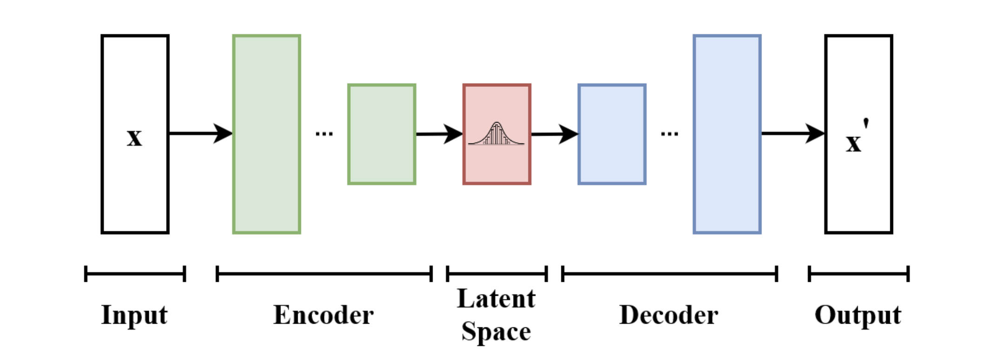

> 본 포스트는 서울대학교 컴퓨터공학부 · 인공지능대학원(IPAI) **박재식(Jaesik Park)** 교수님의 *Introduction to Machine Learning* (4190.428) 강의 자료(15강 *Unsupervised Learning, Part 2*)를 바탕으로, 강의를 처음 듣는 독자도 논리적 흐름을 따라갈 수 있도록 재구성한 것입니다. 원 강의 자료는 MIT 6.036(2019 Fall)과 Stanford CS229(2023–2024 Summer)의 강의 노트를 상당 부분 차용하고 있습니다. 14강의 EM 알고리즘과 ELBO에서 곧바로 이어집니다.

## 한 줄 요약 (TL;DR)

> **"14강의 E-step은 사후 분포를 정확히 계산할 수 있다는 전제 위에 있었습니다. 그 전제가 깨지는 순간 — 디코더가 신경망이 되는 순간 — VAE가 시작됩니다."**
>
> 가우시안 혼합 모델에서는 $p(z|x;\theta)$를 베이즈 정리로 곧장 적을 수 있었습니다. 그러나 $x|z \sim \mathcal{N}(g(z;\theta), \sigma^2 I)$처럼 $g$가 **비선형 신경망**이면 정확한 사후 분포는 계산 불가능해집니다.
>
> **VAE**의 대응은 포기가 아니라 근사입니다. 다루기 쉬운 분포족 $\mathcal{Q}$ 안에서 참 사후 분포에 가장 가까운 $Q$를 찾습니다 — ELBO는 **어떤 $Q$에 대해서도** 하한이므로, 등호를 포기하는 대신 $Q$와 $\theta$를 함께 최대화하면 됩니다. 연속 잠재 변수에서는 $Q_i = \mathcal{N}(q(x^{(i)};\phi), \mathrm{diag}(v(x^{(i)};\psi))^2)$로 두며, 이 $q, v$가 **인코더**, $g$가 **디코더**입니다.
>
> 여기서 진짜 난관이 나옵니다. 디코더 $\theta$에 대한 기울기는 쉽지만, 인코더 $\phi, \psi$는 **기댓값을 취하는 분포 자체**를 결정하므로 $\nabla \mathbb{E}_{z \sim Q_\phi}[f] \neq \mathbb{E}_{z \sim Q_\phi}[\nabla f]$입니다. **재매개변수화 트릭**이 이것을 뚫습니다 — $z = q(x;\phi) + v(x;\psi) \odot \xi$, $\xi \sim \mathcal{N}(0,I)$로 다시 쓰면 무작위성이 파라미터와 무관한 $\xi$로 격리되고, 미분 연산자를 기댓값 안으로 밀어 넣어 역전파를 그대로 쓸 수 있습니다.
>
> 후반부의 **PCA**는 훨씬 고전적이지만 목적은 같습니다 — 데이터의 숨은 저차원 구조를 찾는 것입니다. 투영된 데이터의 분산을 최대화하는 방향 $u$를 찾는 문제는 $\max_{\|u\|=1} u^\top \Sigma u$가 되고, 그 답은 경험적 공분산 행렬 $\Sigma$의 **주고유벡터**입니다. 상위 $k$개를 고르면 그것이 새로운 직교 기저이며, 데이터 압축 · 전처리 · 노이즈 제거에 두루 쓰입니다.

---

## 1. Introduction

* 본 포스트에서는 비지도 학습(Unsupervised Learning)의 핵심적인 두 가지 방법론인 **Variational Auto-Encoder (VAE)**와 **Principal Components Analysis (PCA)**에 대해 다룹니다. VAE는 고차원의 연속형 잠재 변수(Latent Variable)를 비선형 모델인 신경망을 통해 학습할 수 있도록 EM(Expectation-Maximization) 알고리즘을 확장한 생성 모델입니다. 반면 PCA는 데이터의 차원을 축소하고 중복성을 제거하기 위해 널리 사용되는 선형 변환 기법입니다. 두 방법론 모두 데이터의 숨겨진 구조(Latent Space/Subspace)를 찾아낸다는 공통된 철학을 공유합니다.

---

## 2. Variational Auto-Encoder (VAE)

### 2.1. VAE의 구조와 직관

* Variational Auto-Encoder는 기본적으로 입력 데이터를 압축하는 **Encoder**와 이를 다시 복원하는 **Decoder**로 구성됩니다. 

 

* VAE 모델은 EM 알고리즘의 아이디어를 신경망이라는 강력한 비선형 함수 근사기에 접목한 알고리즘 군을 의미합니다. 고차원의 연속형 잠재 변수를 다루기 위해 VAE는 데이터가 생성되는 확률론적 과정을 모델링합니다.

* 잠재 변수 $z$는 사전 분포인 표준 정규분포를 따른다고 가정합니다: $z\sim\mathcal{N}(0,I_{k\times k})$.
* 데이터 $x$는 주어진 잠재 변수 $z$에 대해 신경망(Decoder) $g(z;\theta)$에 의해 파라미터화된 정규분포에서 생성됩니다: $x|z\sim\mathcal{N}(g(z;\theta),\sigma^{2}I_{d\times d})$ (여기서 $\sigma$는 알려진 스칼라 값입니다).

* 기존의 단순한 혼합 모델에서는 잠재 변수의 사후 분포(Posterior)인 $p(z|x;\theta)$를 해석적으로(Analytically) 계산할 수 있었으나, VAE처럼 복잡한 비선형 신경망 $g(z;\theta)$가 도입되면 정확한 사후 분포를 직접 계산하는 것(Intractable)이 불가능해집니다.

### 2.2. ELBO (Evidence Lower Bound) 최적화

* 진짜 사후 분포 $p(z|x;\theta)$를 구하기 어렵기 때문에, 우리는 이를 근사하는 다루기 쉬운 분포족(Family of distributions) $\mathbb{Q}$에서 최적의 분포 $Q$를 찾는 변분 추론(Variational Inference) 접근을 취합니다.

* 이를 위해 목적 함수인 **ELBO(Evidence Lower Bound)**를 정의하며, 우리는 이 ELBO를 최대화하는 방향으로 모델을 학습시킵니다. 단일 관측치 $x^{(i)}$에 대한 ELBO는 다음과 같이 주어집니다:

$$ELBO(Q,\theta)=\sum_{i=1}^{n}\mathbb{E}_{z^{(i)}\sim Q_{i}}\left[\log\frac{p(x^{(i)},z^{(i)};\theta)}{Q_{i}(z^{(i)})}\right]$$ 

* 그렇다면 $\mathcal{Q}$를 어떤 분포족으로 잡아야 할까요? 잠재 변수의 성격에 따라 두 가지 표준적인 선택지가 있습니다.

::: {.callout-note}
## $\mathcal{Q}$를 고르는 두 가지 방식

**[Option 1] 잠재 변수가 고차원 이산형일 때 — 평균장 근사(mean field assumption)**

좌표들이 서로 독립이라고 가정해 결합 분포를 곱으로 분해합니다.

$$Q_i(z) = Q_i^1(z_1)\,Q_i^2(z_2)\cdots Q_i^k(z_k)$$

좌표 간 상관을 포기하는 대가로 계산량이 $k$에 대해 선형이 됩니다.

**[Option 2] 잠재 변수가 연속형일 때 — 가우시안 근사**

$Q_i$를 평균과 분산을 갖는 정규분포로 둡니다. VAE가 취하는 방식이며, 아래에서 이어집니다.
:::

* 연속형 잠재 변수 $z\in\mathbb{R}^{k}$를 다룰 때, $Q_i$는 데이터 $x^{(i)}$에 종속적인 평균과 분산을 가지는 정규분포로 가정합니다. 
* 즉, 신경망 $q(\cdot;\phi)$와 $v(\cdot;\psi)$를 사용하여 분포의 파라미터를 추정합니다.
$$Q_{i}=\mathcal{N}(q(x^{(i)};\phi), \text{diag}(v(x^{(i)};\psi))^{2})$$ 

* 여기서 함수 $q, v$가 바로 **Encoder** 역할을 수행하여 데이터를 잠재 공간(Latent code)으로 매핑하며, $g(z;\theta)$는 **Decoder** 역할을 합니다.
* $Q_i$가 정규분포이므로 확률 밀도를 효율적으로 계산하고 샘플링을 진행하여 기댓값 $\mathbb{E}_{z^{(i)}\sim Q_{i}}$을 추정할 수 있습니다.

### 2.3. 재매개변수화 트릭 (Re-Parameterization Trick)

* 모델을 학습하기 위해 파라미터 $\theta, \phi, \psi$에 대해 경사상승법(Gradient Ascent)을 수행해야 합니다. 세 파라미터를 동시에 다음과 같이 갱신하게 됩니다.

$$\theta := \theta + \eta\nabla_\theta \text{ELBO}(\phi,\psi,\theta), \qquad \phi := \phi + \eta\nabla_\phi \text{ELBO}(\phi,\psi,\theta), \qquad \psi := \psi + \eta\nabla_\psi \text{ELBO}(\phi,\psi,\theta)$$

* 14강의 EM이 E-step과 M-step을 **번갈아** 수행했다면, VAE는 인코더와 디코더 파라미터를 **한꺼번에** 경사상승으로 밀어 올린다는 점이 다릅니다. E-step에서 등호를 정확히 맞추는 일이 불가능해졌으므로, 하한을 함께 끌어올리는 것으로 대신하는 셈입니다.
* Decoder 파라미터 $\theta$에 대한 기울기 계산은 직관적이지만, Encoder 파라미터 $\phi, \psi$에 대한 기울기 계산은 매우 까다롭습니다. 왜냐하면 기댓값을 취하는 확률 분포 $Q_i$ 자체가 최적화해야 할 파라미터 $\phi, \psi$에 의존하기 때문입니다. 즉, 다음과 같이 기울기와 기댓값의 순서를 단순히 바꿀 수 없습니다.

$$\nabla\mathbb{E}_{z\sim Q_{\phi}}[f(\phi)]\ne\mathbb{E}_{z\sim Q_{\phi}}[\nabla f(\phi)]$$ 

* 이 문제를 해결하기 위해 **재매개변수화 트릭(Re-Parameterization Trick)**을 도입합니다.
* 확률 변수 $x\sim\mathcal{N}(\mu,\sigma^{2})$에서 직접 샘플링하는 것은 $x=\mu+\epsilon\sigma$ ($\epsilon\sim\mathcal{N}(0,1)$) 형태로 식을 변형하여 독립적인 노이즈 $\epsilon$을 먼저 샘플링한 후 결정론적(Deterministic)으로 변환하는 것과 수학적으로 동치입니다.

* 이 아이디어를 잠재 변수 $z^{(i)}$에 적용하면 다음과 같이 표현할 수 있습니다:
$$z^{(i)}=q(x^{(i)};\phi)+v(x^{(i)};\psi)\odot\xi^{(i)} \quad \text{where } \xi^{(i)}\sim\mathcal{N}(0,I_{k\times k})$$ 
  * 단, $\odot$는 동일한 차원의 두 벡터 간의 원소별 곱(Element-wise product)을 의미합니다.

* 이 트릭을 사용하면, 적분(기댓값)의 대상이 되는 확률 분포가 더 이상 모델 파라미터에 의존하지 않는 고정된 노이즈 분포 $\mathcal{N}(0, 1)$가 됩니다. 따라서 ELBO 수식 내에서 미분 연산자 $\nabla_{\phi}$를 기댓값 내부로 안전하게 밀어 넣을 수 있습니다.

$$\nabla_{\phi}\mathbb{E}_{z^{(i)}\sim Q_{i}}\left[\log\frac{p(x^{(i)},z^{(i)};\theta)}{Q_{i}(z^{(i)})}\right] = \mathbb{E}_{\xi^{(i)}\sim\mathcal{N}(0,1)}\left[\nabla_{\phi}\log\frac{p(x^{(i)},z^{(i)};\theta)}{Q_{i}(z^{(i)})}\right]$$ 

* 이제 우리는 여러 개의 $\xi^{(i)}$를 샘플링하는 몬테카를로 방식을 통해 기댓값과 기울기를 효율적으로 추정할 수 있게 되었으며, 신경망 역전파(Backpropagation)를 완벽하게 적용할 수 있습니다. $\psi$에 대한 기울기도 정확히 같은 방식으로 얻습니다.

::: {.callout-important}
## 트릭의 정체는 "무작위성의 격리"입니다

재매개변수화 트릭이 하는 일은 확률적 샘플링을 없애는 것이 아니라, **무작위성을 파라미터가 닿지 않는 곳으로 밀어내는 것**입니다. 변형 전에는 $z$를 뽑는 행위 자체가 $\phi, \psi$에 의존해서 미분 경로가 끊겼지만, 변형 후에는 $\xi \sim \mathcal{N}(0,I)$라는 **고정된** 분포에서 뽑은 뒤 $q(x;\phi) + v(x;\psi) \odot \xi$라는 **결정론적 함수**를 통과시킵니다. 샘플링은 계산 그래프 바깥에 있고, 그래프 안에는 미분 가능한 연산만 남습니다. 12강의 역전파가 요구하던 "모든 모듈이 미분 가능해야 한다"는 조건이 이렇게 복원됩니다.
:::

---

## 3. Principal Components Analysis (PCA)

### 3.1. 차원 축소의 동기 (Motivation)

* 자동차 데이터셋이 있다고 가정해 봅시다. 이 데이터에는 자동차의 '최고 속도'와 '회전 반경' 같은 수많은 속성(Feature) $x^{(i)}$가 포함되어 있습니다. 
* 만약 $x_i$는 'km/h' 단위로 측정된 최고 속도이고, $x_j$는 'miles/h' 단위로 측정된 최고 속도라면, 두 변수는 사실상 완전히 선형 종속적입니다. 즉, 겉보기에는 차원이 높아 보이지만 데이터는 사실상 더 낮은 $n-1$ 차원의 부분 공간(Subspace)에 놓여 있습니다. PCA는 이러한 데이터의 중복성(Redundancy)을 자동으로 감지하고 제거하는 알고리즘입니다.

### 3.2. 데이터 전처리 (Preprocessing)

* PCA를 수행하기 전, 모든 특성(Feature)이 동일한 척도를 갖도록 정규화(Normalization)하는 과정이 필요합니다. 
* 각 특성의 평균이 0, 분산이 1이 되도록 다음과 같이 변환합니다.

$$x_{j}^{(i)}\leftarrow\frac{x_{j}^{(i)}-\mu_{j}}{\sigma_{j}}$$ 
$$\mu_{j}=\frac{1}{n}\sum_{i=1}^{n}x_{j}^{(i)}, \quad \sigma_{j}^{2}=\frac{1}{n}\sum_{i=1}^{n}(x_{j}^{(i)}-\mu_{j})^{2}$$ 

* 만약 모든 특성이 이미 동일한 스케일(Scale)을 가지고 있다는 사전 지식이 있다면 이 과정은 생략될 수 있습니다.

### 3.3. 주요 변동 축 (Major Axis of Variation) 찾기

* 데이터가 가장 넓게 퍼져 있는, 즉 데이터가 근사적으로 놓여 있는 주요 방향 벡터 $u$를 어떻게 찾을 수 있을까요? 

 

* 데이터 포인트 $x^{(i)}$를 단위 벡터 $u$ 위로 투영(Projection)했을 때의 길이는 내적 연산인 $x^{(i)\top}u$ 로 주어집니다.
* PCA의 목적은 투영된 데이터의 분산이 최대화되는 단위 벡터 $u$를 찾는 것입니다. 수식으로 표현하면 다음과 같습니다:

$$\max_{||u||_{2}=1} \frac{1}{n}\sum_{i=1}^{n}(x^{(i)\top}u)^{2} = \max_{||u||_{2}=1} u^{\top}\left(\frac{1}{n}\sum_{i=1}^{n}x^{(i)}x^{(i)\top}\right)u$$ 

* 괄호 안의 식 $\frac{1}{n}\sum_{i=1}^{n}x^{(i)}x^{(i)\top}$은 (평균이 0으로 맞춰진) 데이터의 **경험적 공분산 행렬(Empirical Covariance Matrix)** $\Sigma$입니다.
::: {.callout-note}
## 정리 (분산 최대 방향 = 주고유벡터)

평균이 0으로 맞춰진 데이터의 경험적 공분산 행렬을 $\Sigma = \frac{1}{n}\sum_{i=1}^n x^{(i)}x^{(i)\top}$이라 하면, 제약 $\|u\|_2 = 1$ 하에서 이차형식 $u^\top \Sigma u$를 최대화하는 $u$는 $\Sigma$의 **가장 큰 고윳값에 대응하는 고유벡터**다 ($\Sigma e = \lambda e$).
:::

* 즉 "데이터가 가장 넓게 퍼진 방향을 찾아라"라는 기하학적 요구가, 행렬 하나의 고유값 분해라는 순수한 선형대수 문제로 환원됩니다. 이것이 PCA가 반복 최적화 없이 한 번에 풀리는 이유입니다.

### 3.4. k-차원 공간으로의 축소

* 데이터를 단일 축이 아닌 $k$차원의 부분 공간($k < d$)으로 투영하고자 할 경우, 공분산 행렬 $\Sigma$에서 가장 큰 고윳값을 가지는 상위 $k$개의 고유벡터 $u_1, \dots, u_k$를 선택하면 됩니다. 이 고유벡터들은 데이터에 대한 새로운 직교 기저(Orthogonal basis)를 형성합니다.

* 원본 데이터 $x^{(i)}$를 이 새로운 $k$차원 기저 상의 좌표 $y^{(i)}$로 변환하는 공식은 다음과 같습니다:

$$y^{(i)}=\begin{bmatrix} u_{1}^{\top}x^{(i)}\\ u_{2}^{\top}x^{(i)}\\ \vdots\\ u_{k}^{\top}x^{(i)} \end{bmatrix} \in\mathbb{R}^{k}$$ 

* 이 벡터 $y^{(i)}$가 고차원 데이터 $x^{(i)}$에 대한 더 낮은 $k$차원 근사치를 제공하게 되며, 이때 투영 벡터 $u_1, \dots, u_k$를 데이터의 **첫 $k$개의 주성분(Principal Components)**이라고 부릅니다.

### 3.5. PCA의 주요 활용처

* **데이터 압축 (Compression):** 고차원의 $x^{(i)}$를 저차원 $y^{(i)}$로 표현하여 저장 공간과 계산량을 줄입니다.
* **지도 학습 전처리 (Preprocessing):** 학습 알고리즘을 돌리기 전 차원을 줄여 과적합(Overfitting)을 방지하는 효과가 있습니다.
* **노이즈 제거 (Noise Reduction):** 안면 인식에 쓰이는 Eigenfaces 기법처럼, 데이터의 진짜 핵심 정보(사람의 얼굴 생김새)는 유지하면서 미세한 조명 변화와 같은 노이즈 성분은 버리는 데 유용합니다.

---

## 정리하며 (Closing Remarks)

이번 강의의 논리 사슬을 한 장으로 요약하면 다음과 같습니다.

| 단계 | 내용 | 근거 |
|:---|:---|:---|
| **① 전제의 붕괴** | 디코더가 신경망 $g(z;\theta)$가 되면 $p(z\mid x;\theta)$를 정확히 계산할 수 없다 | §2.1 |
| **② 우회로** | ELBO는 **어떤** $Q$에 대해서도 하한이므로, 근사 $Q$로도 최적화가 성립한다 | §2.2 |
| **③ $\mathcal{Q}$의 선택** | 이산·고차원이면 평균장 근사, 연속이면 가우시안 근사 | §2.2 |
| **④ 인코더의 등장** | $Q_i = \mathcal{N}(q(x^{(i)};\phi), \mathrm{diag}(v(x^{(i)};\psi))^2)$ — $q,v$가 인코더, $g$가 디코더 | §2.2 |
| **⑤ 계산 가능성** | $Q_i$가 가우시안이라 밀도 계산과 샘플링이 모두 값싸다 | §2.2 |
| **⑥ 난관** | $Q_i$가 $\phi,\psi$에 의존해 $\nabla\mathbb{E} \neq \mathbb{E}\nabla$ | §2.3 |
| **⑦ 트릭** | $z = q(x;\phi) + v(x;\psi)\odot\xi$, $\xi \sim \mathcal{N}(0,I)$로 다시 쓴다 | §2.3 |
| **⑧ 효과** | 무작위성이 $\xi$로 격리되어 미분 연산자를 기댓값 안으로 넣을 수 있다 | §2.3 |
| **⑨ 결과** | 몬테카를로로 기울기를 추정하고 역전파를 그대로 적용한다 | §2.3 |
| **⑩ 다른 문제** | 겉보기 차원이 높아도 데이터가 실제로는 저차원 부분공간에 놓일 수 있다 | §3.1 |
| **⑪ 전처리** | 각 특성을 평균 0 · 분산 1로 정규화한다 (스케일이 이미 같으면 생략) | §3.2 |
| **⑫ 목표 수식화** | 투영된 데이터의 분산을 최대화 — $\max_{\|u\|=1} u^\top\Sigma u$ | §3.3 |
| **⑬ 해** | 답은 $\Sigma$의 주고유벡터 — 반복 없이 고유값 분해로 끝난다 | §3.3 |
| **⑭ 일반화** | 상위 $k$개 고유벡터가 새로운 직교 기저를 이루고, $y^{(i)} = [u_1^\top x^{(i)}, \dots]^\top$ | §3.4 |
| **⑮ 쓰임새** | 압축 · 지도학습 전처리(과적합 완화) · 노이즈 제거(Eigenfaces) | §3.5 |