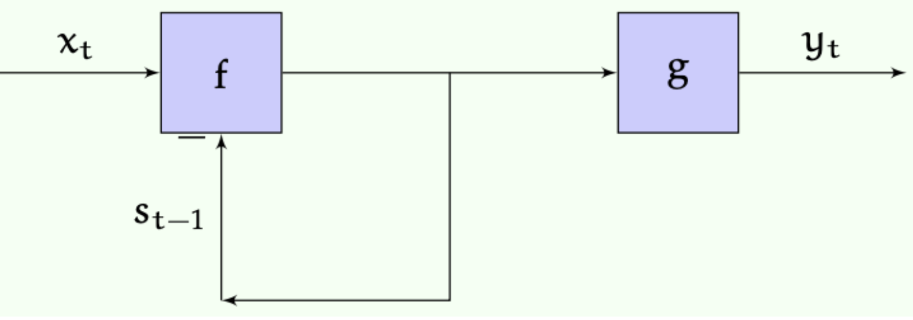
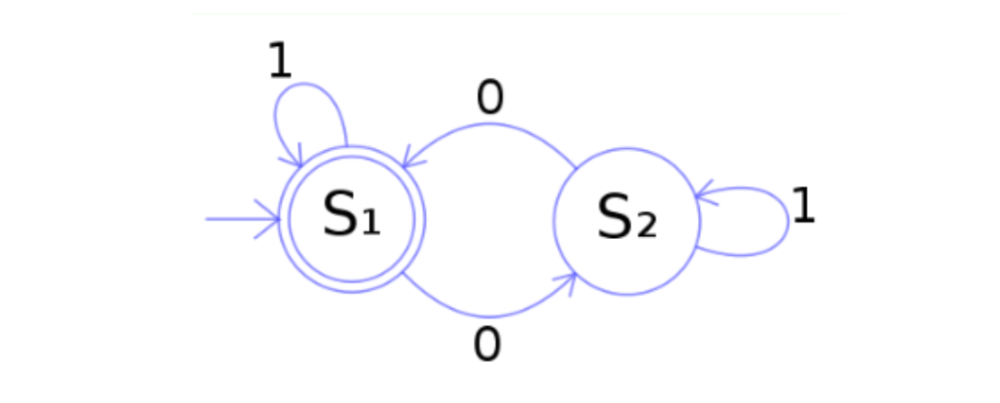

> 본 포스트는 서울대학교 컴퓨터공학부 · 인공지능대학원(IPAI) **박재식(Jaesik Park)** 교수님의 *Introduction to Machine Learning* (4190.428) 강의 자료(16강 *Sequential models*)를 바탕으로, 강의를 처음 듣는 독자도 논리적 흐름을 따라갈 수 있도록 재구성한 것입니다. 원 강의 자료는 MIT 6.036(2019 Fall)과 Stanford CS229(2023–2024 Summer)의 강의 노트를 상당 부분 차용하고 있습니다. 여기서 세우는 MDP와 가치 반복이 17·18강 강화학습의 토대가 됩니다.

## 한 줄 요약 (TL;DR)

> **"출력이 현재 입력만의 함수가 아닐 때, 과거 전부를 기억하는 대신 '상태' 하나만 들고 다니면 됩니다. 이 한 줄에서 RNN도 MDP도 강화학습도 나옵니다."**
>
> 지금까지의 모델은 모두 순수 함수 $y = h(x)$였습니다. 그러나 시퀀스를 다루려면 출력이 **지금까지 본 모든 입력**에 의존해야 합니다. 이를 감당 가능한 형태로 만드는 개념이 **상태(state)** — 미래를 예측하는 데 필요한 정보를 전부 압축해 담은 요약본입니다.
>
> 이 아이디어를 형식화한 것이 **상태 기계** $(S, X, Y, s_0, f, g)$이며, $s_t = f(s_{t-1}, x_t)$와 $y_t = g(s_t)$ 두 줄이 전부입니다. 유한 상태 기계, 선형 시불변(LTI) 시스템, 그리고 그 **비선형 버전인 RNN**이 모두 이 틀의 사례입니다.
>
> 여기에 세 가지를 더하면 **마르코프 결정 과정(MDP)**이 됩니다 — 전이를 확률적으로 만들고, 출력을 상태 자체로 두고, **보상**을 도입하는 것입니다. 이제 문제는 "다음 상태를 예측하라"에서 "**기대 보상을 최대화하는 정책 $\pi$를 찾아라**"로 바뀝니다.
>
> 유한 도달거리에서는 최적 행동이 남은 단계 수에 의존하며, $Q^h(s,a) = R(s,a) + \sum_{s'} T(s,a,s')\max_{a'} Q^{h-1}(s',a')$라는 재귀식을 $h=1$부터 쌓아 올리는 **동적 계획법**이 계산량을 $O((mn)^3)$에서 $O(mnh)$로 끌어내립니다.
>
> 무한 도달거리에서는 합이 발산하는 문제가 생기는데, **할인 계수 $\gamma < 1$**이 이를 막습니다. 그러면 시간에 의존하지 않는 **정적 최적 정책**이 존재하고, $\max$ 때문에 비선형이 된 벨만 방정식을 반복으로 풀어 가는 것이 **가치 반복(value iteration)**입니다.

---

## 1. 들어가며: 왜 순차적 모델(Sequential Models)인가?

* 지금까지 머신러닝에서 주로 다루어 온 모델들은 각 출력 $y$가 연관된 입력 $x$만의 함수로 생성된다고 가정하는 '순수 함수(pure functions)' 형태였습니다. 즉, 출력은 오직 현재의 입력에만 의존합니다. 

* 하지만 현실 세계의 많은 문제들은 함수 이상의 모델링을 필요로 합니다. 예를 들어:
  * **순환 신경망 (Recurrent Neural Networks, RNN):** 학습하는 가설(hypothesis)이 단일 입력의 함수가 아니라, 예측기가 수신한 '입력 시퀀스 전체'의 함수가 됩니다.
  * **강화학습 (Reinforcement Learning):** 도메인을 순환 시스템으로 모델링하거나, 정책(policy) 자체는 순수 함수이되 정책과 도메인이 시간에 따라 상호작용하는 방식에 의해 손실(loss)이 결정됩니다.

* 이러한 고도화된 학습 방법을 본격적으로 다루기 전에, 순차적 또는 순환적 시스템을 모델링하는 기초적인 방법론을 이해하는 것이 필수적입니다.

---

## 2. 상태 기계 (State Machines)

### 2.1. 상태 기계의 개념과 정의

* **상태 기계(State machine)**는 프로세스의 잠재적인 상태(states) 시퀀스를 통해 해당 프로세스를 설명하는 모델입니다. 여기서 시스템의 **상태(state)**란, 시스템의 미래 궤적을 가능한 한 정확하게 예측하기 위해 알아야 할 모든 정보를 의미합니다. 이는 물리적 객체의 위치와 속도가 될 수도 있고, 보드 게임에서의 말의 위치, 혹은 고속도로 네트워크의 현재 교통 밀도가 될 수도 있습니다.

::: {.callout-note}
## 정의 (상태 기계, State Machine)

상태 기계는 튜플 $(S, X, Y, s_0, f, g)$로 정의되며, 초기 상태 $s_0$에서 출발해 매 시각 $t \ge 1$에 대해

$$s_t = f(s_{t-1}, x_t), \qquad y_t = g(s_t)$$

를 반복한다.
:::

* 각 구성 요소는 다음과 같습니다.
  * $S$: 가능한 상태들의 유한 또는 무한 집합 
  * $X$: 가능한 입력들의 유한 또는 무한 집합 
  * $Y$: 가능한 출력들의 유한 또는 무한 집합 
  * $s_0 \in S$: 기계의 초기 상태 
  * $f: S \times X \rightarrow S$: **전이 함수(transition function)**. 입력과 이전 상태를 받아 다음 상태를 생성합니다.
  * $g: S \rightarrow Y$: **출력 함수(output function)**. 상태를 받아 출력을 생성합니다.

### 2.2. 상태 기계의 작동 원리

* 상태 기계의 기본적인 동작은 초기 상태 $s_0$에서 시작하여, $t \ge 1$인 각 시간 단계에 대해 다음을 반복적으로 계산하는 것입니다.

$$s_t = f(s_{t-1}, x_t)$$
$$y_t = g(s_t)$$ 



* 여기서 주의할 점은, 상태 $s_t$가 함수 $f$로 다시 피드백되는 연결은 반드시 한 타임스텝 지연(delayed)되거나 버퍼링되어야 한다는 것입니다. 그렇지 않으면 연산 자체가 수학적으로 잘 정의되지 않습니다. 

* 결과적으로, 입력 시퀀스 $x_1, x_2, \dots$가 주어지면 기계는 다음과 같은 출력 시퀀스를 생성합니다.
$$y_1 = g(f(s_0, x_1)), \quad y_2 = g(f(f(s_0, x_1), x_2)), \dots$$ 
* 시간 $t$에서의 출력은 1부터 $t$까지의 모든 이전 입력에 의존할 수 있습니다. 

### 2.3. 유한 상태 기계 (Finite State Machines)와 시각화

* 가장 흔한 형태는 $S, X, Y$가 모두 유한 집합인 **유한 상태 기계(FSM)**입니다. 이는 종종 노드(상태)와 아크(전이)로 구성된 상태 전이도(state transition diagrams)를 통해 시각적으로 표현됩니다. 



* 위 그림의 기계는 이진 문자열을 읽어 해당 문자열에 포함된 0의 개수의 홀짝성(parity)을 결정합니다. 입력된 문자열이 짝수 개의 0을 포함할 때만 최종적으로 상태 $S_1$에서 끝나게 됩니다.

### 2.4. LTI 시스템과 RNN의 관계

* 상태 기계의 또 다른 중요한 변형은 신호 처리 및 제어에서 널리 쓰이는 **선형 시불변(Linear Time-invariant, LTI) 시스템**입니다. 이 경우 상태, 입력, 출력 공간은 각각 $S = \mathbb{R}^m$, $X = \mathbb{R}^l$, $Y = \mathbb{R}^n$ 형태의 연속 공간이며, $f$와 $g$는 선형 함수입니다.
이산 시간(discrete time)에서는 다음과 같은 선형 차분 방정식으로 정의될 수 있습니다.
$$y[t] = 3y[t-1] + 6y[t-2] + 5x[t] + 3x[t-2]$$ 
* 이러한 시스템은 관련 있는 이전 입력 및 출력 정보를 저장하기 위해 '상태'를 활용하여 구현됩니다.

* **순환 신경망(RNN)**은 근본적으로 이 LTI 시스템의 비선형 버전과 매우 유사합니다. RNN의 전이 함수와 출력 함수는 다음과 같이 정의됩니다.
$$f(s, x) = f_1(W^{sx}x + W^{ss}s + W_0^{ss})$$
$$g(s) = f_2(W^o s + W_0^o)$$ 
  * 여기서 $W$ 행렬들은 학습 가능한 가중치 행렬이며, $f_1, f_2$는 비선형 활성화 함수입니다. 이러한 RNN의 가중치 값들은 경사 하강법(gradient descent)을 사용하여 학습할 수 있습니다.

---

## 3. 마르코프 결정 과정 (Markov Decision Processes, MDP)

### 3.1. MDP의 개념

* **마르코프 결정 과정(MDP)**은 상태 기계의 한 변형으로, 다음과 같은 중요한 차이점을 갖습니다.
  * 1.  **확률적 전이 (Stochastic Transition):** 전이 함수가 결정론적이 아니라 확률적입니다. 즉, 이전 상태와 입력이 주어졌을 때 다음 상태에 대한 확률 분포를 정의하며, 매번 평가될 때마다 해당 분포에서 새로운 상태를 추출(draw)합니다.
  * 2.  **출력과 상태의 일치:** MDP에서는 출력이 곧 상태 자체입니다 (즉, 출력 함수 $g$는 항등 함수입니다).
  * 3.  **보상(Reward)의 존재:** 특정 상태(또는 상태-행동 쌍)는 다른 것들보다 더 바람직하며, 이를 보상으로 수치화합니다.

* MDP는 싱글 플레이어 게임과 같이 외부 "세계"와의 상호작용을 모델링하는 데 사용됩니다. 우리는 상태 집합 $S$와 행동 집합 $A$(상태 기계의 입력 $X$에 해당)가 유한한 경우에 초점을 맞춥니다. 에이전트는 환경을 MDP로 모델링하고, 프로세스를 높은 점수(보상)를 받을 수 있는 상태로 이끄는 행동을 선택하려고 시도합니다.

### 3.2. MDP의 공식적 정의

* MDP는 튜플 $(S, A, T, R, \gamma)$로 정의됩니다.
  * $T: S \times A \times S \rightarrow \mathbb{R}$: **전이 모델(Transition model)**. $T(s, a, s') = P(S_t = s' | S_{t-1} = s, A_{t-1} = a)$ 와 같이 조건부 확률 분포를 지정합니다.
  * $R: S \times A \rightarrow \mathbb{R}$: **보상 함수(Reward function)**. 상태 $s$에서 행동 $a$를 취하는 것이 얼마나 바람직한지 수치로 나타냅니다.
  * $\gamma \in [0, 1]$: **할인 계수(Discount factor)**.

* 여기서 에이전트의 전략을 **정책(Policy)**이라고 부르며, $\pi: S \rightarrow A$라는 함수로 정의되어 각 상태에서 어떤 행동을 취할지 지정합니다.

---

## 4. 유한 도달거리 솔루션 (Finite-Horizon Solutions)

* MDP가 주어졌을 때 우리의 목표는 도메인이 만드는 확률적인 전이 위에서 기대되는 총 보상을 최대로 만드는 **최적 정책(optimal policy)**을 찾는 것입니다.
우선, 에이전트가 MDP와 상호작용하는 총 적분 단계의 수가 $H$로 정해져 있는 유한 도달거리(finite horizon)의 경우를 고려해 보겠습니다.

### 4.1. 정책 평가 (Evaluating a Policy)

* 좋은 정책을 찾기 전, 정책의 좋고 나쁨을 평가할 척도가 필요합니다. 주어진 MDP, 정책, 그리고 남은 단계(horizon) $h$에 대해 상태의 가치를 나타내는 $V_\pi^h(s)$를 정의합니다. 이는 남은 단계 수인 horizon에 대한 귀납법(induction)으로 정의됩니다.

* **기본 단계 (Base case):**
  * 남은 단계가 0일 때, 어떤 상태에 있든 가치는 0입니다.
  $$V_\pi^0(s) = 0$$ 

* **귀납적 단계 (Inductive step):**
  * horizon이 $h+1$일 때 정책의 가치는 상태 $s$에서 즉각적으로 얻는 보상에, 다음 상태들의 horizon $h$ 기대 가치를 더한 것입니다.
  $$V_\pi^1(s) = R(s, \pi(s)) + 0$$ 
  $$V_\pi^2(s) = R(s, \pi(s)) + \sum_{s'} T(s, \pi(s), s') \cdot R(s', \pi(s'))$$ 
  * 일반화하면 다음과 같습니다.
  $$V_\pi^h(s) = R(s, \pi(s)) + \sum_{s'} T(s, \pi(s), s') \cdot V_\pi^{h-1}(s')$$ 

* $s'$에 대한 합은 기댓값을 의미합니다. 가능한 모든 다음 상태 $s'$에 대해 그 상태의 $(h-1)$-horizon 가치를 구하고, 이를 정책에 따라 행동 $\pi(s)$를 취했을 때 상태 $s'$에 도달할 확률로 가중 평균한 것입니다.
  * (참고로, 정책 간의 비교에서 $\pi_1 >_h \pi_2$라는 것은 모든 상태 $s$에서 $V_{\pi_1}^h(s) \ge V_{\pi_2}^h(s)$이며, 최소 한 상태에서는 엄격하게 크다는 것을 의미합니다 ).

### 4.2. 최적 정책 찾기와 Q-함수 (Finding an Optimal Policy)

* 유한 도달거리 문제에서는 취해야 할 최적의 행동이 현재 상태뿐만 아니라 **남은 도달거리(horizon)에도 의존**합니다. 만약 한 스텝 만에 보상 5를 받는 상태와 두 스텝 만에 보상 10을 받는 상태가 있다면, 2스텝 이상 남았을 때는 10을 향해 가야 하지만 단 1스텝만 남았다면 5를 얻을 수 있는 방향으로 가야 합니다.

* 최적 행동 가치 함수인 **Q-함수**를 사용하면 최적 정책을 찾을 수 있습니다. $Q^h(s, a)$는 다음의 기댓값으로 정의됩니다.
  * 1. 상태 $s$에서 시작하여 
  * 2. 행동 $a$를 수행하고, 
  * 3. 남은 $h-1$ 단계 동안 적절한 horizon에 대한 최적의 정책을 실행했을 때 얻는 총 보상.

* $V$와 유사하게 귀납적으로 정의되지만, 정책이 지정한 행동을 따르는 대신, **다음 상태의 기대 $Q^h$ 값을 최대화하는 행동 $a$를 선택**한다는 점이 다릅니다.
$$Q^0(s, a) = 0$$ 
$$Q^1(s, a) = R(s, a) + 0$$ 
$$Q^h(s, a) = R(s, a) + \sum_{s'} T(s, a, s') \max_{a'} Q^{h-1}(s', a')$$ 

* $Q$ 값을 구하면 그 시점의 최적 정책 $\pi_h^*(s)$는 $Q^h(s, a)$를 최대화하는 $a$를 찾는 것으로 단순화됩니다.
$$\pi_h^*(s) = \arg\max_a Q^h(s, a)$$ 
  * (최적 정책은 여러 개 존재할 수 있습니다 ).

### 4.3. 동적 계획법 (Dynamic Programming)의 역할

* 이러한 재귀적 계산을 효율적으로 만들어 주는 것이 **동적 계획법(DP)**입니다. DP의 핵심은 단순한 하위 문제의 해답을 계산하고 저장해 두었다가 나중의 연산에 재사용하는 것입니다.

* 만약 $Q^4(s_i, a_j)$를 정의에 따라 직접 계산하려 한다면 모든 $(s, a)$ 쌍에 대해 $Q^3$를 알아야 하고, 연쇄적으로 $Q^1$까지 파고들어야 합니다. 이런 방식은 중복 계산이 많아 수많은 연산을 야기합니다.
* 하지만 계산해야 할 고유한 값은 상태 개수 $n$, 행동 개수 $m$, 도달거리 $h$에 대해 총 $mnh$ 개에 불과합니다. 따라서 $h=1$부터 순차적으로 값을 계산하고 저장한 뒤 다음 단계에서 재사용하면, 시간 복잡도를 방대한 $O((mn)^3)$에서 효율적인 $O(mnh)$로 극적으로 낮출 수 있습니다.

---

## 5. 무한 도달거리 솔루션 (Infinite-Horizon Solutions)

* 실제 문제에서는 게임이 언제 끝날지 등 정확한 유한 도달거리를 모르는 체제로 작업하는 것이 더 일반적입니다. 이것을 **무한 도달거리(Infinite-horizon)** 문제라고 합니다.
* 단순히 위 공식에 $h = \infty$를 대입하면, 기댓값이 무한대로 발산할 수 있어 서로 다른 행동들의 우위를 비교할 수 없게 되는 치명적인 문제가 발생합니다.

### 5.1. 할인 계수 (Discount Factor)의 도입

* 이 발산 문제를 해결하기 위해 **할인된 무한 도달거리(discounted infinite horizon)** 접근법을 사용합니다. $0 < \gamma < 1$ 범위의 할인 계수를 선택하고 , 다음과 같은 할인된 기대 누적 보상을 최대화하는 정책을 찾습니다.
$$\mathbb{E}[\sum_{t=0}^\infty \gamma^t R_t | \pi, S_0] = \mathbb{E}[R_0 + \gamma R_1 + \gamma^2 R_2 + \dots | \pi, S_0]$$ 

* 할인 계수를 사용하는 데에는 두 가지 직관적인 동기가 있습니다.
  * 1. **경제학적 가치 (화폐의 시간 가치):** 미래의 불확실한 보상보다는 현재 손안에 있는 보상(이자 수익 창출 등 가능)의 가치가 더 큽니다.
  * 2. **종료 확률 모델링:** 매 스텝마다 상호작용 프로세스가 $1 - \gamma$의 확률로 종료될 수 있다고 생각하는 것입니다. 이 경우 에이전트의 기대 수명은 $1 / (1-\gamma)$가 됩니다.

### 5.2. 정책 평가의 재구성

* 무한 도달거리 하에서 상태 $s$의 가치 $V_\pi(s)$는 다음과 같이 전개됩니다.
$$V_\pi(s) = \mathbb{E}[R_0 + \gamma(R_1 + \gamma(R_2 + \dots)) | \pi, S_0 = s]$$ 

* 선형 결합의 기댓값 성질을 이용해 정리하면 다음과 같은 우아한 재귀식(Bellman Equation)을 얻습니다.
$$V_\pi(s) = R(s, \pi(s)) + \gamma \sum_{s'} T(s, \pi(s), s') V_\pi(s')$$ 
* 이는 $n=|S|$개의 상태 각각에 대해 하나의 방정식을 세울 수 있고 미지수도 $n$개이므로 , 가우스 소거법(Gaussian elimination)과 같은 방법으로 이 선형 방정식 시스템을 쉽게 풀 수 있습니다.

### 5.3. 가치 반복 (Value Iteration) 알고리즘

::: {.callout-note}
## 정리 (정적 최적 정책의 존재)

할인된 무한 도달거리 MDP에는 시간에 의존하지 않는 **정적 최적 정책(stationary optimal policy)** $\pi^*$가 존재하여, 모든 상태 $s \in \mathcal{S}$와 모든 다른 정책 $\pi$에 대해 $V_{\pi^*}(s) \ge V_\pi(s)$가 성립한다.
:::

* 유한 도달거리에서는 최적 행동이 남은 단계 수 $h$에 의존했지만(§4.2), 무한 도달거리에서는 그럴 필요가 없습니다. 지금까지 살아남았다는 조건 하에서 앞으로의 기대 수명이 **언제나 $1/(1-\gamma)$로 같기** 때문입니다 — 즉 시점마다 상황이 동일하므로 행동도 동일해야 합니다.

::: {.callout-tip}
## Study Question: 기대 수명이 정말 $1/(1-\gamma)$인가요?

매일 아침 확률 $1-\gamma$로 그날이 마지막 날이 된다고 합시다. 그러면 수명 $L$은 성공 확률 $p = 1-\gamma$인 기하 분포를 따르고, 기하 분포의 기댓값은 $1/p$이므로 $\mathbb{E}[L] = 1/(1-\gamma)$입니다. 예컨대 $\gamma = 0.99$면 기대 수명은 100스텝이고, $\gamma = 0.9$면 10스텝입니다. **$\gamma$는 단순한 수치 안정화 장치가 아니라 "에이전트가 얼마나 먼 미래까지 내다보는가"를 정하는 손잡이**라는 해석이 여기서 나옵니다.
:::

* 최적 정책을 찾기 위해 최적 행동 가치 함수 $Q^*(s,a)$를 정의합니다.

$$Q^*(s, a) = R(s, a) + \gamma \sum_{s'} T(s, a, s') \max_{a'} Q^*(s', a')$$ 

* 이 방정식들은 $V_\pi(s)$와 달리 $\max$ 연산자 때문에 비선형이며 풀기가 쉽지 않지만 , 유일한 해를 가진다는 것이 증명되어 있습니다. 이 해를 점진적으로 찾아가는 강력한 알고리즘이 바로 **가치 반복(Value Iteration)**입니다.

```text
Algorithm 8: Value-Iteration(S, A, T, R, γ, ε)

1. 모든 상태 s와 행동 a에 대해 Q_old(s, a) = 0 으로 초기화합니다.
2. While True:
3.     모든 상태 s와 행동 a에 대해 새로운 Q를 계산합니다:
4.         Q_new(s, a) = R(s, a) + γ * Σ [ T(s, a, s') * max_a' Q_old(s', a') ]
5.     만약 모든 상태-행동 쌍 중 |Q_old(s, a) - Q_new(s, a)|의 최대 오차가 ε(허용 오차)보다 작다면:
6.         Q_new를 반환하고 종료합니다.
7.     Q_old를 Q_new로 업데이트합니다.
```

### 5.4. 가치 반복에 대한 이론적 결과

* 가치 반복은 단순해 보이지만, 뒷받침하는 이론적 결과가 풍부합니다. 어떤 $Q$ 함수로부터 유도되는 탐욕 정책을 $\pi_Q(s) = \arg\max_a Q(s,a)$라 할 때 다음이 알려져 있습니다.

* **근사 최적성:** 허용 오차 $\epsilon$으로 가치 반복을 종료하면, 그 결과로 얻은 정책의 가치는 최적 가치에 $\epsilon$-근방까지 접근합니다. 즉 $\|V_{\pi_{Q_{new}}} - V_{\pi^*}\|_{\max} < \epsilon$입니다.
* **유한 종료:** 더 나아가, **어떤 $\epsilon$ 값이 존재하여** $\|Q_{old} - Q_{new}\|_{\max} < \epsilon$이면 $\pi_{Q_{new}} = \pi^*$가 됩니다. 가치 함수가 완전히 수렴하기 전에 이미 **정책은 최적에 도달**한다는 뜻으로, 실무에서 조기 종료가 정당화되는 근거입니다.
* **단조 개선:** 반복이 진행됨에 따라 $\|V_{\pi_{Q_{new}}} - V_{\pi^*}\|_{\max}$는 매 반복마다 **단조 감소**합니다. 되돌아가는 법이 없습니다.
* **비동기 실행:** 모든 $(s,a)$ 쌍이 무한 실행 중 무한히 자주 갱신되기만 하면, 갱신 순서가 어떻든 — 병렬로 흩어서 비동기적으로 돌려도 — 최적 가치로 수렴합니다. 대규모 문제에서 가치 반복을 분산 처리할 수 있는 이유입니다.

---

## 정리하며 (Closing Remarks)

이번 강의의 논리 사슬을 한 장으로 요약하면 다음과 같습니다.

| 단계 | 내용 | 근거 |
|:---|:---|:---|
| **① 한계** | 지금까지의 모델은 순수 함수 $y=h(x)$ — 출력이 현재 입력에만 의존한다 | §1 |
| **② 필요** | RNN · 강화학습은 출력이 입력 **시퀀스 전체**에 의존해야 한다 | §1 |
| **③ 핵심 개념** | 미래 예측에 필요한 정보를 압축한 요약본 = **상태** | §2.1 |
| **④ 형식화** | 상태 기계 $(S,X,Y,s_0,f,g)$ — $s_t = f(s_{t-1},x_t)$, $y_t = g(s_t)$ | §2.1–§2.2 |
| **⑤ 필수 조건** | 상태 피드백은 반드시 한 스텝 지연되어야 계산이 잘 정의된다 | §2.2 |
| **⑥ 사례들** | 유한 상태 기계(패리티 검사기) · LTI 시스템 · 그 비선형 버전인 RNN | §2.3–§2.4 |
| **⑦ 세 가지 변형** | 전이를 확률화 · 출력을 상태와 동일시 · 보상 도입 → **MDP** | §3.1 |
| **⑧ 정의** | $(S,A,T,R,\gamma)$와 정책 $\pi : S \to A$ | §3.2 |
| **⑨ 정책 평가** | $V_\pi^h(s) = R(s,\pi(s)) + \sum_{s'} T(s,\pi(s),s')V_\pi^{h-1}(s')$ | §4.1 |
| **⑩ 최적 정책** | $Q^h(s,a) = R(s,a) + \sum_{s'}T(s,a,s')\max_{a'}Q^{h-1}(s',a')$, $\pi_h^*(s) = \arg\max_a Q^h$ | §4.2 |
| **⑪ 효율화** | 값을 저장·재사용하는 동적 계획법으로 $O((mn)^3) \to O(mnh)$ | §4.3 |
| **⑫ 무한 도달거리의 문제** | $h = \infty$면 기댓값이 발산해 행동 간 비교가 불가능해진다 | §5 |
| **⑬ 해법** | 할인 계수 $0<\gamma<1$ — 화폐의 시간 가치이자 종료 확률 모델 | §5.1 |
| **⑭ 벨만 방정식** | $V_\pi(s) = R(s,\pi(s)) + \gamma\sum_{s'}T(s,\pi(s),s')V_\pi(s')$ — 선형이라 곧장 풀린다 | §5.2 |
| **⑮ 최적성** | $\max$가 들어간 $Q^*$ 방정식은 비선형이지만 유일해를 가진다 | §5.3 |
| **⑯ 알고리즘** | 가치 반복 — $\epsilon$-근사 최적, 단조 개선, 비동기 실행 가능 | §5.3–§5.4 |