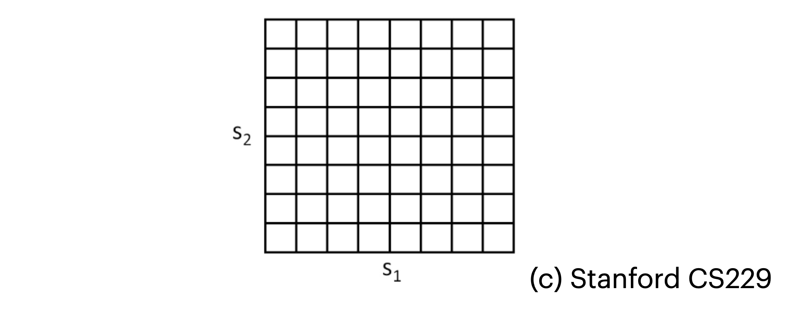
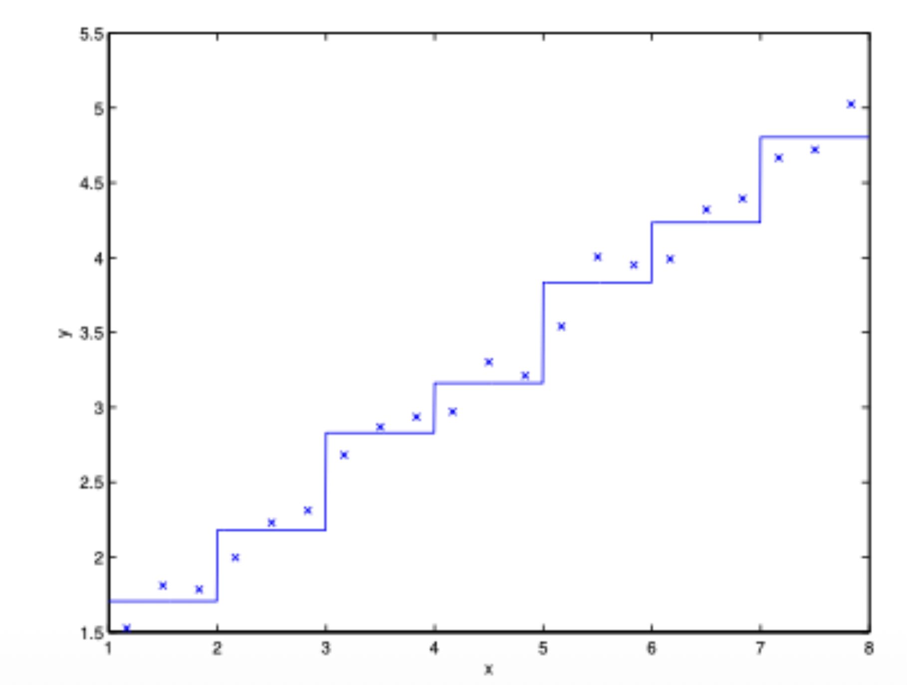

> 본 포스트는 서울대학교 컴퓨터공학부 · 인공지능대학원(IPAI) **박재식(Jaesik Park)** 교수님의 *Introduction to Machine Learning* (4190.428) 강의 자료(17강 *Reinforcement Learning, Part 1*)를 바탕으로, 강의를 처음 듣는 독자도 논리적 흐름을 따라갈 수 있도록 재구성한 것입니다. 원 강의 자료는 MIT 6.036(2019 Fall)과 Stanford CS229(2023–2024 Summer)의 강의 노트를 상당 부분 차용하고 있으며, 이산화와 시뮬레이터 그림은 Stanford CS229에서 가져온 것입니다. 16강에서 세운 MDP 위에서 이어집니다.

## 한 줄 요약 (TL;DR)

> **"매 순간의 정답을 알려 줄 수 없다면, 잘했는지 못했는지만 알려 주면 됩니다. 강화학습은 그 보상 신호만으로 행동 전략을 세우는 문제입니다."**
>
> 지도 학습은 입력마다 정답 $y$가 있다고 가정합니다. 그러나 네 발 로봇에게 걷는 법을 가르칠 때 "지금 이 관절을 몇 도로 움직여라"라는 정답은 아무도 모릅니다. 대신 **보상 함수**를 주고 스스로 찾게 하는 것이 강화학습입니다.
>
> 수학적 틀은 16강에서 세운 **MDP** $(S, A, \{P_{sa}\}, \gamma, R)$입니다. 정책 $\pi$의 가치 $V^\pi(s)$는 **벨만 방정식** $V^\pi(s) = R(s) + \gamma\sum_{s'}P_{s\pi(s)}(s')V^\pi(s')$을 만족하고, 최적 가치는 여기에 $\max_a$가 붙은 **벨만 최적 방정식**을 만족합니다.
>
> 상태와 행동이 유한하고 $P_{sa}$, $R$를 안다면 두 가지 해법이 있습니다 — 벨만 갱신을 반복하는 **가치 반복**과, 평가와 탐욕적 개선을 번갈아 하는 **정책 반복**입니다. 둘은 별개가 아닙니다. 정책 반복의 평가 단계를 $k$번의 벨만 갱신으로 근사할 때 $k=1$이면 가치 반복, $k=\infty$면 정책 반복입니다.
>
> $P_{sa}$와 $R$를 모른다면? 경험에서 **세어서 추정**합니다 — 전이 확률의 최대우도추정은 그저 관측된 빈도 비율이고, 이를 가치 반복과 번갈아 돌리면 미지의 환경에서도 학습이 됩니다.
>
> 마지막 난관은 **연속 상태**입니다. 격자로 이산화하는 방법은 1~2차원에서만 통합니다 — 가치 함수를 계단으로 근사하는 데다, 상태 수가 $k^d$로 폭발하기 때문입니다. 대안이 $V(s) = \theta^\top\phi(s)$로 두고 벨만 갱신을 **지도 학습 문제로 치환**하는 **Fitted Value Iteration**입니다.

---

## 1. 강화학습의 동기 (The Idea of Reinforcement Learning)

* 기계학습 중 가장 널리 알려진 지도 학습(Supervised Learning) 패러다임은 훈련 세트에 주어진 라벨(label) $y$를 모방하도록 모델을 학습시킵니다. 즉, 입력에 대해 항상 모호함 없는 '정답'이 주어지는 환경을 가정합니다. 

* 하지만 로봇 제어나 자율 주행과 같은 **순차적 의사 결정(Sequential Decision Making)** 문제에서는 매 순간 어떤 행동이 '정답'인지 명시적인 지도(explicit supervision)를 제공하기가 매우 어렵습니다. 예를 들어, 네 발 달린 로봇이 처음 걷는 법을 배울 때 어떤 관절을 어떻게 움직이는 것이 '정답'인지 우리는 알 수 없습니다.

* 강화학습(Reinforcement Learning, RL)은 이러한 환경에서 정답 대신 **보상 함수(Reward Function)**를 알고리즘에 제공합니다. 학습 에이전트(agent)는 자신이 잘하고 있는지, 못하고 있는지를 보상을 통해 파악하며 스스로 최적의 행동 방식을 학습하게 됩니다. 이 프레임워크는 자율 헬리콥터 비행, 4족 보행 로봇, 휴대폰 네트워크 라우팅, 마케팅 전략 수립 등 다양한 분야에서 성공을 거두고 있습니다.

---

## 2. 마르코프 결정 과정 (Markov Decision Processes, MDP)

* 강화학습 문제를 수학적으로 모델링하는 핵심 프레임워크가 바로 마르코프 결정 과정(MDP)입니다. MDP는 아래의 5가지 요소로 구성된 튜플 $(S, A, \{P_{sa}\}, \gamma, R)$로 정의됩니다:
  * **$S$ (State):** 가능한 모든 상태의 집합입니다 (예: 헬리콥터의 모든 가능한 위치 및 자세).
  * **$A$ (Action):** 에이전트가 취할 수 있는 행동의 집합입니다 (예: 조종 스틱의 방향).
  * **$P_{sa}$ (State Transition Probabilities):** 특정 상태 $s \in S$에서 행동 $a \in A$를 취했을 때, 다음 상태로 이동할 확률 분포를 나타냅니다. 즉, 행동의 결과로 어떤 상태 $s'$에 도달할지에 대한 불확실성을 모델링합니다.
  * **$\gamma$ (Discount Factor):** $0 \le \gamma < 1$ 범위의 값을 가지는 할인 인자로, 미래의 보상을 현재 가치로 환산할 때 사용됩니다.
  * **$R$ (Reward Function):** $R: S \times A \mapsto \mathbb{R}$ 혹은 $R: S \mapsto \mathbb{R}$ 형태로 정의되며, 특정 상태에서 받는 즉각적인 보상을 의미합니다.

### 2.1. 과정과 총 보상

* 시간이 흐름에 따라 MDP는 다음과 같은 궤적(trajectory)을 생성합니다:
  * 초기 상태 $s_0$에서 시작하여 에이전트가 행동 $a_0 \in A$를 선택하면 , 확률 분포 $s_1 \sim P_{s_0a_0}$에 따라 다음 상태 $s_1$으로 무작위 전이합니다. 이어서 $a_1$을 선택하고 $s_2 \sim P_{s_1a_1}$로 전이하는 과정이 반복됩니다.
  $$s_0 \rightarrow a_0 \rightarrow s_1 \rightarrow a_1 \rightarrow s_2 \rightarrow a_2 \rightarrow s_3 \rightarrow \dots$$ 

* 이러한 일련의 과정 속에서 에이전트가 얻는 **총 보상(Total Payoff)**은 시간에 따라 $\gamma$만큼 할인된 보상의 합으로 주어집니다.
$$R(s_0, a_0) + \gamma R(s_1, a_1) + \gamma^2 R(s_2, a_2) + \dots$$ 
* 상태만의 함수로 보상을 나타낸다면 다음과 같습니다.
$$R(s_0) + \gamma R(s_1) + \gamma^2 R(s_2) + \dots$$ 

* 강화학습의 궁극적인 목표는 **예상되는 총 보상의 최댓값(Expected Value of the Total Payoff)**을 달성하기 위한 행동의 기준을 찾는 것입니다.

### 2.2. 정책(Policy)과 가치 함수(Value Function)

* **정책($\pi$):** 상태를 행동으로 매핑하는 함수 $\pi: S \mapsto A$ 입니다. 정책 $\pi$를 따른다는 것은, 에이전트가 상태 $s$에 있을 때 항상 행동 $a = \pi(s)$를 취한다는 뜻입니다.
* **가치 함수($V^\pi(s)$):** 어떤 상태 $s$에서 시작하여 정책 $\pi$를 따를 때 얻게 될 할인된 총 보상의 기댓값입니다.
    $$V^{\pi}(s) = \mathbb{E}[R(s_0) + \gamma R(s_1) + \gamma^2 R(s_2) + \dots | s_0 = s, \pi]$$ 

* 이 $V^\pi(s)$는 재귀적인 성질을 가지며, 이를 나타낸 것이 바로 **벨만 방정식(Bellman Equation)**입니다.
$$V^{\pi}(s) = R(s) + \gamma \sum_{s' \in S} P_{s\pi(s)}(s') V^{\pi}(s')$$ 
* 우변은 즉각적인 보상 $R(s)$와, 다음 상태 $s'$에서 얻을 미래 보상의 기댓값 $\mathbb{E}_{s' \sim P_{s\pi(s)}}[V^\pi(s')]$을 할인된($\gamma$) 형태로 더한 것입니다.

### 2.3. 최적 가치 함수와 최적 정책

* 우리의 목표는 가능한 모든 정책 중에서 가장 높은 가치를 반환하는 **최적 가치 함수(Optimal Value Function, $V^*(s)$)**를 찾는 것입니다.
$$V^*(s) = \max_{\pi} V^{\pi}(s)$$ 
::: {.callout-note}
## 정의 (벨만 방정식과 벨만 최적 방정식)

주어진 정책 $\pi$에 대한 **벨만 방정식**은
$$V^{\pi}(s) = R(s) + \gamma \sum_{s' \in S} P_{s\pi(s)}(s') V^{\pi}(s')$$
이고, 최적 가치 함수가 만족하는 **벨만 최적 방정식**은
$$V^*(s) = R(s) + \max_{a \in A} \gamma \sum_{s' \in S} P_{sa}(s') V^*(s')$$
이다. 둘의 유일한 차이는 정책이 지정한 행동을 따르는 대신 **모든 행동에 대해 최댓값을 취한다**는 점이며, 바로 이 $\max$ 때문에 아래쪽 방정식이 비선형이 된다.
:::

* 이 $V^*(s)$를 알고 있다면, 상태 $s$에서 최적의 정책 $\pi^*(s)$는 당연히 미래의 가치를 최대화하는 행동 $a$를 취하는 것입니다.
$$\pi^*(s) = \arg\max_{a \in A} \sum_{s' \in S} P_{sa}(s') V^*(s')$$ 
* 최적 정책 $\pi^*$는 모든 상태 $s$에서 $V^*(s) = V^{\pi^*}(s) \ge V^\pi(s)$를 만족하며, 초기 상태에 구애받지 않고 언제나 사용할 수 있는 보편적인 최적 해가 됩니다.

---

## 3. 유한 상태 MDP를 위한 해법 (Value & Policy Iteration)

* 상태와 행동 공간이 유한하고($|S|, |A| < \infty$) , 전이 확률 $P_{sa}$와 보상 $R$을 정확히 안다고 가정할 때, $V^*$를 구하는 대표적인 두 알고리즘이 있습니다.

### 3.1. 가치 반복 (Value Iteration)

* 벨만 방정식을 업데이트 규칙으로 사용하여 가치 함수 추정치를 반복적으로 갱신하는 방법입니다.
  * 1. 모든 상태 $s$에 대해 $V(s) := 0$으로 초기화합니다.
  * 2. 수렴할 때까지 다음을 반복합니다:
     모든 상태 $s$에 대해 $V(s) := R(s) + \max_{a \in A} \gamma \sum_{s'} P_{sa}(s') V(s')$ 

* 이때 업데이트 방식에는 두 가지가 있습니다:
  * **동기식(Synchronous Update):** 모든 상태의 새로운 $V(s)$를 먼저 계산한 후, 한꺼번에 이전 값을 덮어씁니다 ("Bellman backup operator"를 한 번 적용하는 것과 동일).
  * **비동기식(Asynchronous Update):** 상태들을 임의의 순서로 순회하며 $V(s)$를 하나씩 갱신합니다.

* 어떤 방식을 사용하든 가치 반복 알고리즘은 결국 최적 가치 $V^*$로 수렴함이 증명되어 있습니다.

### 3.2. 정책 반복 (Policy Iteration)

* 가치 함수 대신 정책 자체를 번갈아 가며 갱신하는 방법입니다.
  * 1. 정책 $\pi$를 무작위로 초기화합니다.
  * 2. 수렴할 때까지 다음을 반복합니다:
     * **Policy Evaluation:** 현재 정책에 대한 가치 $V := V^\pi$를 계산합니다. (주로 선형 방정식 시스템을 풀어 계산) 
     * **Policy Improvement:** 각 상태 $s$에 대해 정책을 다음과 같이 업데이트(탐욕적 갱신)합니다.
         $$\pi(s) := \arg\max_{a \in A} \sum_{s'} P_{sa}(s') V(s')$$ 

* 작은 규모의 MDP에서는 정책 반복이 매우 빠르게 수렴합니다. 하지만 상태 공간이 큰 경우 $V^\pi$를 구하기 위해 거대한 선형 방정식을 풀어야 하므로 계산 비용이 높아, 실무에서는 **가치 반복(Value Iteration)이 더 자주 사용**되는 경향이 있습니다.

* **[참고] 정책 반복과 가치 반복의 연결고리**
  * 정책 반복의 Evaluation 단계(선형 방정식 풀이)는 반복적인 벨만 업데이트($k$번 반복)로 근사할 수 있습니다. 만약 이 업데이트를 단 $k=1$번만 수행한다면, 이는 가치 반복(Value Iteration) 알고리즘과 정확히 동일해집니다. 반대로 $k=\infty$일 때가 순수한 정책 반복에 해당합니다.

---

## 4. 모델 학습 (Learning a Model for MDP)

* 현실의 많은 문제에서는 $P_{sa}$와 $R$이 명시적으로 주어지지 않습니다. 이런 경우 데이터를 통해 이들을 추정해야 합니다. MDP에서 에이전트가 직접 환경과 상호작용하여 얻은 $n$개의 에피소드(trials) 데이터가 있다고 가정해 봅시다.

* 여기서 얻은 데이터를 바탕으로 전이 확률의 최대우도추정(MLE)을 계산할 수 있습니다.
$$P_{sa}(s') = \frac{\text{상태 } s\text{에서 행동 } a\text{를 취해 } s'\text{로 전이된 횟수}}{\text{상태 } s\text{에서 행동 } a\text{를 취한 총 횟수}}$$ 
* 이 카운트(분자, 분모)를 저장해두면, 새로운 경험이 쌓일 때마다 전이 확률을 매우 효율적으로 업데이트할 수 있습니다. 보상 $R(s)$ 역시 관측된 보상들의 평균값으로 추정할 수 있습니다.

* 추정된 모델($P_{sa}, R$)을 이용해 다시 Value Iteration을 수행하여 $V$와 $\pi$를 갱신하는 과정을 반복함으로써, 미지의 환경에서도 최적 정책을 학습할 수 있습니다. 모델 학습과 가치 반복을 하나로 묶으면 다음과 같은 알고리즘이 됩니다.

```text
1. 정책 π를 무작위로 초기화한다.
2. Repeat:
3.     현재 정책 π로 MDP에서 여러 에피소드를 수행하며 경험을 수집한다.
4.     쌓인 경험으로 P_sa 와 R 의 추정치를 갱신한다 (카운트 비율 / 관측 보상의 평균).
5.     추정된 모델에 Value Iteration을 적용해 V 를 구한다.
6.     V 에 대해 탐욕적인 정책으로 π 를 갱신한다.
```

::: {.callout-tip}
## 한 줄의 최적화

5번 줄에서 매번 $V = 0$으로 초기화할 필요가 없습니다. **직전 반복에서 찾은 $V$를 초기값으로 쓰면** 모델이 조금 바뀐 만큼만 갱신하면 되므로 가치 반복이 훨씬 빨리 수렴합니다. 모델 추정치가 반복마다 크게 달라지지 않는다는 점을 이용한 것으로, 이런 **웜 스타트(warm start)**는 모델 기반 강화학습에서 널리 쓰이는 기법입니다.
:::

---

## 5. 연속 상태 공간과 이산화 (Continuous State MDPs)

* 지금까지는 유한한 상태를 가정했지만, 자동차의 제어(위치, 방향, 속도 등)처럼 상태 공간이 $S = \mathbb{R}^d$ 형태의 **무한한 연속 공간**인 경우가 많습니다.

* 이를 해결하기 위한 가장 직관적인 방법은 상태 공간을 격자(grid) 형태로 나누어 유한한 개수의 이산 상태 $\bar{S}$로 만드는 **이산화(Discretization)**입니다. 



* 그러나 이산화 방식에는 두 가지 치명적인 한계가 존재합니다:
  * 1. **단순한 표현력 (Naive Representation):** 각 격자 안에서는 가치 함수가 상수(constant)라고 가정하게 됩니다. 아래 그림처럼 부드러운 연속 함수를 계단식으로 근사하게 되며, 정확도를 높이려면 격자를 매우 잘게 쪼개야 합니다.
  * 2. **차원의 저주 (Curse of Dimensionality):** $d$차원의 상태 공간을 각각 $k$개의 구간으로 나누면, 총 이산 상태의 수는 $k^d$개가 됩니다. 이는 차원이 커질수록 상태의 수가 지수적으로 폭발함을 의미하며, 1D/2D 환경에서는 작동하지만 고차원에서는 거의 불가능에 가깝습니다.



---

## 6. 가치 함수 근사 (Value Function Approximation)

* 이산화의 한계를 극복하기 위해 연속 상태의 $V^*$를 직접 함수로 근사하는 **가치 함수 근사(Value Function Approximation)** 기법이 사용됩니다. 

* 이 기법을 위해 우리는 환경의 물리 엔진 역할인 **시뮬레이터(Simulator)**를 블랙박스 모델로 가정합니다. 


* 시뮬레이터에서 추출된 데이터 시퀀스를 활용하여 $s_t$와 $a_t$로부터 $s_{t+1}$을 예측하는 모델을 선형 회귀(Linear Regression) 등으로 학습할 수 있습니다. 
$$\arg\min_{A,B} \sum_{i=1}^n \sum_{t=0}^{T-1} ||s_{t+1}^{(i)} - (A s_t^{(i)} + B a_t^{(i)})||_2^2$$ 
* 이렇게 학습된 행렬 A, B를 통해 결정론적 모델(Deterministic) 혹은 노이즈 $\epsilon_t \sim \mathcal{N}(0, \Sigma)$가 포함된 확률론적 모델(Stochastic)을 만들 수 있습니다.

### 6.1. Fitted Value Iteration 알고리즘

* 연속적인 상태 공간($S = \mathbb{R}^d$)과 작고 이산적인 행동 공간($A$)을 가질 때, 가치 반복의 적분을 통한 갱신식을 유한한 샘플들의 지도 학습 문제로 치환하는 알고리즘입니다. 

* 먼저 가치 함수를 피처 매핑(feature mapping) $\phi(s)$의 선형 결합인 $V(s) = \theta^\top \phi(s)$ 형태로 정의합니다.
* 알고리즘의 동작은 다음과 같습니다:
  * 1. 상태 $S$에서 무작위로 $n$개의 상태 $s^{(1)}, \dots, s^{(n)}$을 샘플링합니다. 파라미터 $\theta:=0$으로 초기화합니다.
  * 2. 각 상태 $s^{(i)}$ 및 행동 $a$에 대해:
     * 시뮬레이터를 사용해 $s^{(i)}$에서 행동 $a$를 취했을 때의 다음 상태 $s'_1, \dots, s'_k \sim P_{s^{(i)}a}$를 $k$번 샘플링합니다.
     * 기댓값의 근사치 $q(a)$를 계산합니다: 
       $$q(a) = \frac{1}{k} \sum_{j=1}^k R(s^{(i)}) + \gamma V(s'_j)$$ 
     * 최적 행동에 대한 추정치 타겟 $y^{(i)}$를 구합니다:
       $$y^{(i)} = \max_a q(a)$$ 
  * 3. 생성된 데이터셋 $\{(s^{(i)}, y^{(i)})\}$에 대해 선형 회귀를 수행하여 $\theta$를 갱신합니다.
     $$\theta := \arg\min_\theta \frac{1}{2} \sum_{i=1}^n (\theta^\top \phi(s^{(i)}) - y^{(i)})^2$$ 

* 이산 상태 가치 반복에서는 $V(s^{(i)}) := y^{(i)}$로 직접 값을 대입했다면, Fitted Value Iteration은 파라미터 최적화를 통해 $V(s^{(i)}) \approx y^{(i)}$가 되도록 곡선을 맞추는(Fitted) 방식을 취합니다. 이 알고리즘은 이론적으로 무조건 수렴성이 보장되지는 않지만, 실무적으로는 대부분 잘 수렴하여 뛰어난 성능을 냅니다.

* 만약 결정론적(Deterministic) 시뮬레이터를 사용한다면 $k=1$로 단순화하여 시뮬레이션 비용을 크게 절약할 수 있습니다. 또한 $\epsilon_t$ 노이즈가 작은 확률론적 모델에서도 $k=1$로 두고 $\mathbb{E}_{s}[V(s')] \approx V(f(s,a))$로 근사하는 테크닉이 자주 활용됩니다.

---

## 정리하며 (Closing Remarks)

이번 강의의 논리 사슬을 한 장으로 요약하면 다음과 같습니다.

| 단계 | 내용 | 근거 |
|:---|:---|:---|
| **① 지도 학습의 한계** | 순차적 의사결정에서는 매 순간의 "정답 행동"을 명시할 수 없다 | §1 |
| **② 대안** | 정답 대신 **보상 함수**를 주고 에이전트가 스스로 찾게 한다 | §1 |
| **③ 형식화** | MDP $(S, A, \{P_{sa}\}, \gamma, R)$ — 16강의 틀을 그대로 쓴다 | §2 |
| **④ 목표** | 할인된 총 보상의 기댓값을 최대화하는 행동 기준을 찾는 것 | §2.1 |
| **⑤ 평가 도구** | 정책 $\pi$의 가치 $V^\pi(s)$와 그것이 만족하는 벨만 방정식 | §2.2 |
| **⑥ 최적성** | $\max_a$가 붙은 벨만 최적 방정식 — 이 $\max$가 비선형성의 원인 | §2.3 |
| **⑦ 정책 복원** | $V^*$를 알면 $\pi^*(s) = \arg\max_a \sum_{s'}P_{sa}(s')V^*(s')$ | §2.3 |
| **⑧ 해법 1** | 가치 반복 — 벨만 갱신을 반복한다 (동기식/비동기식 모두 수렴) | §3.1 |
| **⑨ 해법 2** | 정책 반복 — 평가와 탐욕적 개선을 번갈아 한다 | §3.2 |
| **⑩ 둘의 관계** | 평가를 $k$번 벨만 갱신으로 근사할 때 $k=1$이면 가치 반복, $k=\infty$면 정책 반복 | §3.2 |
| **⑪ 선택 기준** | 작은 MDP는 정책 반복이 빠르나, 큰 상태 공간에서는 가치 반복이 선호된다 | §3.2 |
| **⑫ 모델이 없다면** | 경험에서 전이 빈도를 세어 $P_{sa}$를, 관측 보상의 평균으로 $R$를 추정한다 | §4 |
| **⑬ 연속 상태의 벽 1** | 이산화는 가치 함수를 격자마다 상수로 근사한다 (표현력 부족) | §5 |
| **⑭ 연속 상태의 벽 2** | $d$차원을 $k$구간으로 나누면 상태가 $k^d$개 — 차원의 저주 | §5 |
| **⑮ 대안** | 시뮬레이터를 두고 $V(s) = \theta^\top\phi(s)$로 직접 근사한다 | §6 |
| **⑯ 알고리즘** | Fitted Value Iteration — 벨만 갱신을 회귀 문제로 치환한다 | §6.1 |
| **⑰ 대가** | 이론적 수렴 보장은 없지만 실무에서는 대체로 잘 작동한다 | §6.1 |