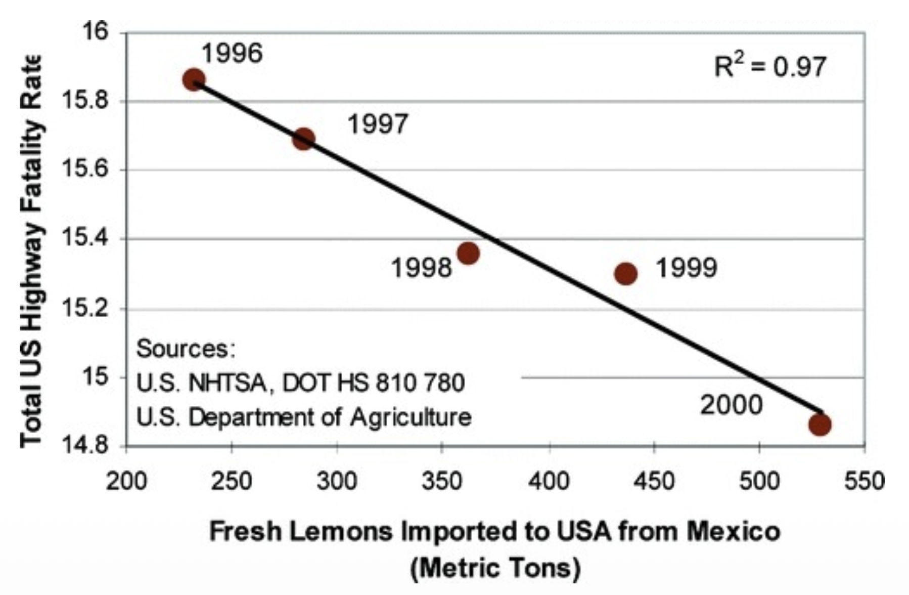
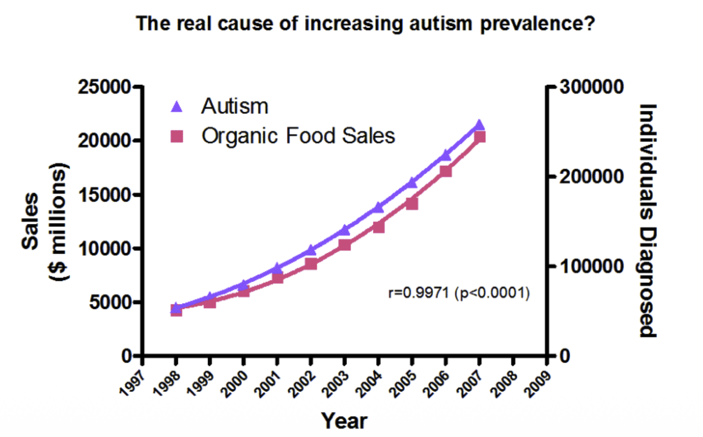
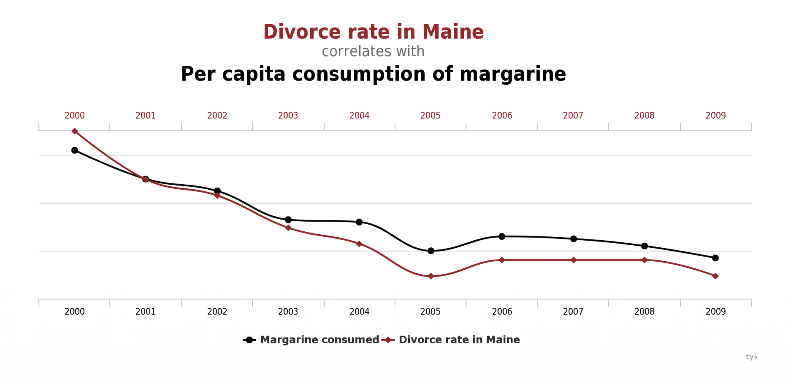
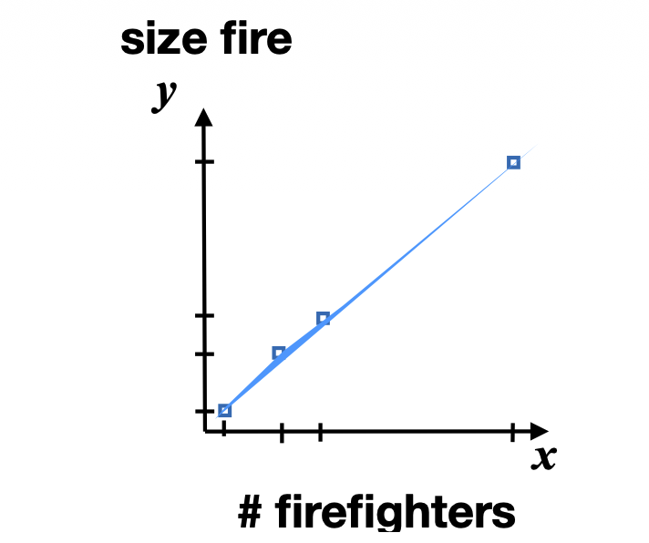

> 이번 포스트는 SNU 데이터사이언스대학원(GSDS) 이상학(**Sanghack Lee**) 교수님의 **인과추론(Causal Inference)** 강의 첫 시간 자료(1강 *Introduction*)를 정리한 글입니다. 본 강의 자료는 컬럼비아 대학교 **Elias Bareinboim** 교수님(UCLA에서 Judea Pearl 교수님 지도로 박사학위)의 강의 자료를 차용해 구성되었습니다.

## 한 줄 요약 (TL;DR)

> **"머신러닝은 현실의 '측면'을 모방할 뿐이며, 아직 실현되지 않은 세계에 대한 질문은 데이터만으로 결코 답할 수 없습니다."**
>
> 지도·비지도학습은 결국 $P(y \mid x)$와 $P(x)$를 추론하는 일, 즉 **관측된 분포를 모방**하는 일입니다. 그런데 "이 정책을 시행하면 어떻게 될까", "내가 다르게 행동했더라면 어땠을까" 같은 질문은 **아직 실현되지 않은 대안 세계(alternative reality)** 에 관한 것이고, 그 세계에는 애초에 데이터가 없습니다. 이 간극을 메우는 장치가 **인과 모형(causal model)** 이며, 인과추론은 언제나 **데이터 + 인과적 가정**의 결합을 요구합니다. Pearl의 인과 사다리(PCH)는 이 구도를 연관(Association) · 개입(Intervention) · 반사실(Counterfactual)의 세 층으로 형식화하고, 인과추론을 **한 층의 데이터로 다른 층의 질문에 답하는 계층 간 추론(cross-layer inference)** 으로 규정합니다. 심슨의 역설과 소방관–화재 예제는, 같은 숫자를 놓고도 인과 구조가 무엇이냐에 따라 정반대의 결론이 나온다는 사실을 보여주며 이 요구를 실증합니다.

---

## 1. 강의 개요 (Course Logistics)

본격적인 내용에 앞서, 이 강의가 어떤 배경을 요구하고 한 학기 동안 어디까지 나아가는지를 먼저 정리해 둡니다. 이후 회차의 포스트들이 어느 지점에 놓이는지를 가늠하는 지도 역할을 합니다.

### 1.1. 필요한 배경지식 (Required Background)

* **수학적 배경**: 대수학, 이산수학(정수·**그래프**·논리 명제), 머신러닝(특히 **그래프 모형(graphical models)**), 통계학(확률).
* **순수 이론 과목이 아닙니다.** 즉, 다음이 함께 요구됩니다.
    * 어느 정도의 **프로그래밍 경험**
    * **알고리즘과 자료구조**(특히 그래프)에 대한 이해
    * **데이터 분석 경험**이 있으면 도움이 됩니다.

> 배경지식 목록에서 **그래프**가 두 번(이산수학, 자료구조) 등장한다는 점이 이 강의의 성격을 미리 알려 줍니다. 인과 모형은 결국 **그래프 위에서 정의되고 그래프 알고리즘으로 계산**되기 때문입니다.

### 1.2. 잠정 강의 일정 (Tentative Schedule)

| 구분 | 주제 |
|:---|:---|
| **모형의 언어** | 강의 개요 · 서론, 인과 모형과 그래프 (Causal Models and Graphs) |
| **식별 이론** | 인과효과의 식별 (Identification), 교란과 백도어 (Confounding and Backdoor) |
| | 조정 기준 (Adjustment Criterion) & do-calculus |
| | 알고리즘적 식별 (Algorithmic Identification) |
| **추정** | 잠재적 결과 (Potential Outcome), CATE 추정, IPW, A-IPW |
| | IV + 매칭(Matching) + RDD |
| | DiD + 통제집단합성법(SCM) |
| | *중간고사* |
| **확장 주제** | 부분 식별 (Partial Identification) + 소프트 개입 (Soft Intervention) |
| | 인과 발견 (Causal Discovery) |
| | 인과 데이터 과학 (Causal Data Science) |
| | 심화 주제 (Proximal, Staggered DiD, Synthetic DiD, DML, …) |
| | 연구 동향 / 논문 리뷰, 기말고사 |

* 평가는 **중간고사 20% · 기말고사 20% · 과제 60%** 로, 과제의 비중이 가장 큽니다.

### 1.3. 참고자료 (References)

**공식 교과서는 없으며**, 필요한 읽을거리가 그때그때 제공되는 방식입니다. 대신 다음 자료들이 참고자료로 제시됩니다.

* Prof. **Ilya Shpitser** 의 강의
* *The Effect* — Prof. **Nick Huntington-Klein**
* Prof. **Kosuke Imai** (Harvard) · Prof. **Fan Li** (Duke) 의 자료
* **Brady Neal** 의 YouTube 강의 영상

교과서가 지정되지 않았다는 사실 자체가 이 분야의 현재 상태를 보여줍니다. 인과추론은 통계학 · 컴퓨터과학 · 경제학 · 역학(epidemiology)에서 **서로 다른 언어로 병행 발전**해 왔고, 한 권으로 통합된 표준 교재가 아직 자리 잡지 않았습니다.

---

## 2. 머신러닝 간략 복습 (A Brief Review for Machine Learning)

본격적인 인과추론에 들어가기 전, 우리가 익숙한 머신러닝의 지형도를 먼저 복습합니다. 이는 뒤에서 **"ML은 인과 사다리의 어느 층에 위치하는가?"** 라는 질문에 답하기 위한 사전 작업입니다.

### 2.1. 왜 머신러닝을 공부하는가? (Why Study Machine Learning?)

머신러닝의 동기는 다음과 같이 정리됩니다.

* AI/ML은 **지능형 시스템을 설계하고 분석하는 학문**입니다.
* 지능적 행동에는 **지식(knowledge)** — 즉 환경이나 현실에 대한 모형 — 이 필요합니다.
* 그런데 특정 과제에 필요한 지식을 사람이 **일일이 명시적으로 기술하는 것은 매우 어렵거나 종종 불가능**합니다.
* 그렇다면 지식을 어떻게 획득할 것인가? → **데이터와 알고리즘을 통한 학습(learning)** 입니다.

또한 학습은 다음과 같은 본질적 역할을 합니다.

* 학습은 에이전트의 **의사결정 메커니즘을 수정하여 성능을 개선**합니다.
* **도전 과제**: 환경은 시간에 따라 변하므로, 변화와 예기치 못한 상황에 적응해야 합니다.
* 학습은 설계자가 전지(全知)하지 못한 **미지의 환경(unknown environments)** 에서 특히 필수적이며, **지저분하고 현실적인 데이터(messy, real data)** 에 유용합니다.

이로부터 다음과 같은 **근본적 질문**들이 도출됩니다.

* 학습 과정을 어떻게 특징지을 것인가?
* 사전 지식(prior knowledge)과 성능(performance) 사이를 어떻게 절충할 것인가?
* 시스템은 얼마나 **강건(robust)하고 일반화(generalizable)** 가능한가?

ML의 응용은 **사실상 모든 곳**에 걸쳐 있습니다. 강의는 다음과 같이 분야별로 정리합니다.

| 분야 | 대표 사례 |
|:---|:---|
| **생성형 AI (Generative AI)** | 거대언어모형(LLM), 멀티모달 에이전트, 디지털 트윈 |
| **과학을 위한 AI (AI for Science)** | AlphaFold(단백질 접힘), 신약 개발, 재료 과학 |
| **의료 (Medical)** | 맞춤형 의료(personalized medicine), AI 기반 수술 계획 |
| **지속가능성 (Sustainability)** | 기후 모델링, 기상 예측, 에너지 그리드 최적화 |
| **비전 (Vision)** | 실시간 장면 이해(scene understanding), 딥페이크 탐지 |
| **자율 시스템 (Autonomous Systems)** | 휴머노이드 로봇, 자율주행 차량군, 드론 배송 |
| **보안 (Security)** | 대규모 사기 탐지, 사이버보안 에이전트 |

이 목록에서 눈여겨볼 점이 하나 있습니다. **맞춤형 의료 · 에너지 그리드 최적화 · 정책 설계**처럼 목록의 상당수는 사실 "무엇을 **하면** 어떻게 되는가"를 묻는 **개입(intervention)의 문제**입니다. 뒤에서 보겠지만, 고전적 학습 패러다임이 서 있는 층은 그 질문에 답할 수 있는 층이 아닙니다.

### 2.2. 머신러닝의 접근법: 고전적 학습 패러다임 (Classical Learning Paradigm)

고전적 학습 패러다임은 다음과 같은 가정 위에 서 있습니다.

* 현실에는 알려지지 않은 **참 모형(true model) $M$** 이 존재합니다.
* $M$은 **특징 벡터(feature vector) $x$** 로 표현되는 예시(examples)들을 생성합니다.
* 우리가 관심 있는 대상은 **목표 함수(target function) $f_M(x)$** 입니다.
* 입력은 인스턴스들의 집합 $\{x^{(i)}\}_{i=1}^{N}$ 입니다.
* **학습(training) 단계**: 입력을 사용하여, 가설 공간 $H$ 안에서 다음을 만족하는 가설 $h \in H$ 를 찾습니다.

$$
h(x) \approx f_M(x)
$$

* 이렇게 학습한 $h$ 를 사용해 **새로운 예시 $x'$ 에 대해 $f_M$ 을 근사**합니다.
* 이때 가장 핵심적인 도전 과제는 바로 **일반화(generalization)** 입니다. 즉, 학습에 사용하지 않은 데이터에서도 잘 작동해야 합니다.

![Figure: 도심 교차로를 내려다본 장면에 현대적 인식 시스템의 출력이 겹쳐진 그림입니다. 초록·파랑·보라 등으로 칠해진 면은 도로·인도·녹지를 픽셀 단위로 나눈 **의미론적 분할(segmentation)** 결과이고, 차량과 보행자를 감싼 노랑·파랑 상자는 **객체 검출(detection)** 결과이며, 각 상자에 붙은 라벨(`Class: Car`, `Confidence: 0.99`, `Velocity: 35 km/h`)은 모형이 출력한 클래스·확신도·속도입니다. 교차로 위를 흐르는 무지갯빛 곡선들은 각 객체가 앞으로 지나갈 것으로 예측된 **궤적(trajectory prediction)** 이고, 좌측 상단 패널은 처리 지연 12ms와 추적 중인 객체 수 같은 실시간 성능 지표입니다. 이 한 장면 전체가 결국 "입력 $x$(픽셀) → 목표 함수 $f_M(x)$(장면의 의미)"라는 고전적 학습 패러다임의 사례이며, 사람이 규칙으로 명시하기 불가능한 매핑을 데이터로부터 가설 $h$ 로 근사한다는 점을 보여줍니다.](./images/scene_understanding_perception.png)

### 2.3. 지도학습 (Supervised Learning)

지도학습은 **레이블로부터 학습**하는 문제, 즉 입력을 원하는 출력으로 보내는 사상을 찾는 문제입니다.

$$
\text{특징 공간 } (X) \;\xrightarrow{\;f\;}\; \text{레이블 공간 } (Y)
$$

* $f$ 는 알려지지 않은 **목표 함수**이며, 강의는 이를 **신탁(oracle)** 이라 부릅니다.
* 하나의 예시는 입력-출력 쌍 $\langle x,\, y = f(x) \rangle$ 이며, 훈련 집합은 레이블된 쌍들의 모음 $\{\langle x^{(i)}, y^{(i)} \rangle\}_{i=1}^{N}$ 입니다.
* **문제**: 이 훈련 집합이 주어졌을 때, 신탁 $f$ 를 흉내 내는 사상 $h \approx f$ 를 찾는 것.
* 이때 우리는 **반드시 가설 공간(hypothesis space)을 선택**해야 합니다. 강의가 드는 대표적인 아키텍처는 다음과 같습니다.

| 계열 | 대표 모형 |
|:---|:---|
| **비모수적 (Non-Parametric)** | 결정 트리(Decision Trees), $k$-최근접이웃($k$-NN) |
| **확률적 (Probabilistic)** | 베이지안 네트워크(Bayesian Networks) |
| **딥러닝 (Deep Learning)** | CNN, 트랜스포머(Transformers) |
| **앙상블 (Ensemble)** | XGBoost, LightGBM |

> **핵심**: 가설 공간의 선택은 곧 **귀납적 편향(inductive bias)** 의 선택입니다. 어떤 함수 부류로 현실을 근사할 것인지에 대한 사전 결정이 학습 결과를 좌우합니다.

### 2.4. 비지도학습 (Unsupervised Learning)

비지도학습은 명시적인 지도(guidance) 없이 **샘플로부터 구조(structure)를 발견**하는 문제입니다.

* 목표는 공간 $X$ 의 **내재적 구조(intrinsic structure)를 이해**하는 것입니다.
* 데이터에는 레이블이 없습니다 — 오직 $x \in X$ 만 주어집니다.
* **문제**: 숨어 있는 패턴을 드러내는 **데이터의 표현(representation)** 을 찾는 것.
* 전형적인 결과물은 다음 세 가지입니다.
    * **군집화 (Clustering)**: 유사한 인스턴스들을 한데 묶기
    * **차원 축소 (Dimensionality Reduction)**: 데이터를 잠재 공간(latent space)으로 압축하기
    * **생성 모형화 (Generative Modeling)**: 밀도 $P(x)$ 자체를 이해하기

마지막 항목이 특히 중요합니다. 비지도학습이 궁극적으로 겨냥하는 대상은 **분포 $P(x)$** 이며, 이는 바로 다음 절에서 지도학습의 $P(y \mid x)$ 와 나란히 놓이게 됩니다.

### 2.5. 표준적 학습 문제들 (Canonical Learning Problems)

지금까지의 내용을 표준적인 문제 유형으로 정리하면 다음과 같습니다.

* **지도학습 (Supervised Learning)**: 입력과 그에 대응하는 원하는 출력의 예시가 주어졌을 때, 미래 입력에 대한 출력을 예측.
    * **분류 (Classification)**: 목표 $f(x)$ 의 치역이 **범주형(categorical)** (예: 숫자 인식, 음소, 구매/비구매)
    * **회귀 (Regression)**: 목표 $f(x)$ 의 치역이 **연속형(continuous)** (예: 주가 예측)
* **비지도학습 (Unsupervised Learning)**: 입력만 주어졌을 때 표현·특징·구조를 자동으로 발견.
    * **군집화 (Clustering)** (예: 천문학, 생물학)
    * **차원 축소 (Dimensionality Reduction)**

#### 2.5.1. 확률론적 관점 (Probabilistic Perspective)

같은 문제들을 **확률 분포의 언어**로 다시 표현할 수 있습니다. 이 관점은 뒤에서 인과 사다리와 연결되므로 매우 중요합니다.

* **지도학습**: 가설 $h$ 를 학습하는 것은 **조건부 분포 $P(y\mid x)$ 를 추론**하는 것과 동등합니다.
    * (예: 신경망 출력단의 활성값, 결정 트리의 출력)
* **비지도학습**: 표현을 학습하는 것은 **주변 분포 $P(x)$ 의 성질을 추론**하는 것과 관련됩니다.

> **결정적 한 문장**:
> "We learn to imitate <u>aspects</u> of the underlying <u>reality</u>!"
> 즉, 우리는 **현실의 어떤 측면을 모방(imitate)** 하도록 학습할 뿐입니다. 슬라이드에서 **"측면(aspects)"** 과 **"현실(reality)"** 에만 밑줄이 그어져 있다는 점에 주목하세요. 이는 ML이 현실의 **전체**가 아니라 **관측된 단면**만을, 그것도 데이터가 만들어진 **바로 그 분포 아래에서** 흉내 낸다는 한계를 암시합니다. 바로 이 지점이 인과추론이 파고드는 틈입니다.

### 2.6. 강화학습 (Reinforcement Learning)

강의는 이 절의 제목을 *"관측을 넘어서(Beyond Observations)"* 로 달고, 강화학습을 **능동적 개입(active intervention) vs. 수동적 관찰(passive observation)** 의 대비로 소개합니다.

* **정적으로 미리 레이블된 예시가 주어지지 않습니다.**
* 대신 에이전트가 **환경(현실)에 개입하여 상호작용**하며 스스로 데이터를 모읍니다.
* 학습을 이끄는 신호는 **행동에 대한 환경의 반응**입니다. (예: A/B 테스트, 로보틱스)
* 핵심 난제: **탐험(exploration) – 활용(exploitation)** 트레이드오프. 새로운 행동을 시도할 것인가, 이미 아는 좋은 행동을 최적화할 것인가.

> RL은 단순히 **보는 것**을 넘어 **행동(action)** 을 통해 환경을 바꾼다는 점에서, 뒤에 나올 인과 사다리의 **Layer 2(개입)** 와 자연스럽게 연결됩니다.

---

## 3. 이 수업에서 새로운 것은 무엇인가? (What is New in This Course?)

여기서 강의는 결정적인 질문을 던집니다.

> **"Is anything missing in this picture?"** — 이 그림(머신러닝의 지형도)에서 빠진 것은 없는가?

지금까지의 ML은 모두 **"현실을 모방"** 하는 데 초점이 맞춰져 있었습니다. 그러나 우리가 던지고 싶은 질문 중 상당수는 **아직 실현되지 않은(not yet realized) 세계** 에 관한 것입니다. 이것이 이 수업이 다룰 **새로운 차원**입니다.

---

## 4. 개념적 기초 (Conceptual Foundation)

### 4.1. 인지적 관찰: 인간의 세 가지 능력

인간의 인지 능력은 다음과 같이 점진적으로 쌓이는 **세 층위**로 관찰됩니다. 슬라이드에서는 `human: sensors + agency + retrospection` 으로 표현됩니다.

* **Layer 1 — 감각 (sensors)**: 세계를 **관찰(observe)** 하고 '다음' 단계를 추론하는 능력.
* **Layer 2 — 행위 (agency)**: 세계에 **개입(intervene)** 하여 그것을 **변화**시키는 능력.
* **Layer 3 — 회고 (retrospection)**: 우리가 했던(그리고 하지 않았던) 일을 **돌아보고(reflect)**, 새로운 행동을 **추론**하는 능력.

이 세 층위가 바로 다음 절의 핵심 개념인 **Pearl의 인과 사다리(PCH)** 의 인지적 토대가 됩니다.

### 4.2. Pearl의 인과 사다리 (Pearl's Causal Hierarchy, PCH)

위 세 가지 인지 능력 — 감각 · 행위 · 회고 — 을 수학적으로 형식화한 것이 **Pearl의 인과 사다리(PCH)** 입니다. PCH는 이 강의 전체를 떠받치는 가장 중요한 개념적 골격입니다.

여기서 강조할 점은 PCH가 **모형의 위계가 아니라 질문(query)의 위계**라는 것입니다. 각 층은 "어떤 종류의 확률량을 물을 수 있는가"로 구분되며,

* **Layer 1**은 관측된 분포에서 읽어낼 수 있는 양 — $P(y \mid x)$,
* **Layer 2**는 개입이 가해진 세계의 양 — $P(y \mid do(x))$,
* **Layer 3**은 사실과 반대되는 가상 세계의 양 — $P(y_x \mid x', y')$

를 각각 다룹니다. 구체적인 기호 · 활동 · 전형적 질문은 다음 장(§5)에서 표로 정리합니다.

### 4.3. 아직 실현되지 않은 세계에 대한 추론 (Inferences About Different, Not Yet Realized Worlds)

강의는 다음 질문을 시각적으로 전개합니다.

> **"How to do inferences about different, not yet realized worlds?"**
> (서로 다른, 아직 실현되지 않은 세계에 대해 어떻게 추론할 것인가?)

그 논리적 전개는 다음과 같습니다.

* **(1단계) 기존 ML/통계**: **실제 세계/자연(Real World/Nature)** 이 **데이터(Data)** 를 만들어 내고, **AI/ML·통계(Inference)** 가 이 데이터로부터 **새로운 지식(New Knowledge)** 을 얻습니다.
* **(2단계) 문제 제기**: 그런데 우리가 알고 싶은 것이 **실현되지 않은 대안적 현실(Alternative Reality)** 이라면? 그곳에는 **데이터가 없습니다(No Data)**. 통계만으로는 접근할 수 없습니다.
* **(3단계) 해법**: 이 간극을 메우는 것이 바로 **인과 모형(Causal Model)** 입니다. 인과 모형은 별도의 **지식(knowledge)** 을 추가로 받아들여, 데이터가 존재하지 않는 대안 세계에 대해서도 **새로운 지식**을 추론하는 **인과추론(Causal Inference)** 을 가능하게 합니다.

![Figure: 통계적 추론과 인과추론의 정보 흐름을 위아래 두 줄로 대비시킨 도식입니다. **위쪽 줄**은 기존 경로로, `Real World/Nature`(실제 세계)가 `(Data)`를 만들고 그 데이터가 `AI/ML·Stats (Inference)`를 거쳐 `New Knowledge`에 이릅니다. **아래쪽 줄**은 우리가 답하고 싶은 경로로, 출발점이 빨간 글씨의 `Alternative Reality — not realized`(실현되지 않은 대안 현실)입니다. 이 세계는 데이터를 만들어 내지 않으므로 위쪽 줄과 같은 화살표를 그릴 수 없고, 두 줄을 가르는 회색 점선이 바로 그 단절을 나타냅니다. 간극을 잇는 것이 초록색으로 강조된 `Causal Model` 상자이며, 여기로 들어오는 화살표는 정확히 두 개입니다 — 실제 세계에서 내려오는 파란 `knowledge`(인과적 가정)와 위쪽 `(Data)`에서 내려오는 관측 데이터. 두 입력이 합쳐져야만 `(Causal Inference)`를 거쳐 대안 세계에 대한 `New Knowledge`가 나온다는 점에서, **"데이터만으로는 부족하다"** 는 이 강의의 명제를 한 장으로 요약한 그림입니다.](./images/not_yet_realized_worlds.png)

> **핵심 통찰**: 데이터만으로는 부족합니다. 인과추론은 항상 **데이터 + (인과적) 가정/지식** 의 결합을 요구합니다. 이는 강의 전반에서 반복될 주제입니다.

---

## 5. 큰 그림: Pearl의 인과 사다리 (Big Picture: Pearl's Causal Hierarchy)

이제 PCH의 세 층위를 구체적인 **기호·활동·전형적 질문** 과 함께 정리합니다.

| Level (기호) | 전형적 활동 | 대응 ML | 전형적 질문 |
|---|---|---|---|
| **1. 연관 (Association)** $P(y\mid x)$ | 보기 (Seeing) | ML – (비)지도학습 (Deep Net, Bayes net, Hierarchical Model, DT) | **What is?** "X를 보는 것이 Y에 대한 내 믿음을 어떻게 바꾸는가?" |
| **2. 개입 (Intervention)** $P(y\mid do(x),\, c)$ | 하기 (Doing) | ML – 강화학습 (Causal Bayes Net, MDP, POMDP) | **What if?** "내가 X를 하면 어떻게 되는가?" |
| **3. 반사실 (Counterfactual)** $P(y_x \mid x',\, y')$ | 상상하기/회고 (Imagining) | 구조적 인과 모형 (Structural Causal Model) | **Why?** "내가 다르게 행동했더라면 어땠을까?" |

### 5.1. Layer 1: 연관 (Association)

* 기호: $P(y\mid x)$
* 활동: **보기(Seeing)**
* 전형적 질문: *"X를 관측하는 것이 Y에 대한 내 믿음을 얼마나 바꾸는가?"*, *"증상이 질병에 대해 무엇을 말해 주는가?"*
* 이 층은 우리가 앞서 복습한 **(비)지도학습** 이 머무는 곳입니다. 순수하게 **관측된 분포** 위에서의 통계적 연관만을 다룹니다.

### 5.2. Layer 2: 개입 (Intervention)

* 기호: $P(y\mid do(x),\, c)$ — 여기서 $do(x)$ 는 **변수 $X$ 를 값 $x$ 로 강제로 설정(개입)** 하는 연산자입니다.
* 활동: **하기(Doing)**
* 전형적 질문: *"내가 X를 하면 무슨 일이 일어나는가?"*, *"내가 아스피린을 먹으면 두통이 나을까?"*
* 단순히 아스피린을 먹은 사람들을 **관측**한 $P(y\mid x)$ 와, 내가 의도적으로 아스피린을 **먹이는** $P(y\mid do(x))$ 는 **일반적으로 다릅니다**. 이 차이가 인과추론의 출발점입니다. 이 층은 **강화학습, MDP/POMDP** 에 대응합니다.

### 5.3. Layer 3: 반사실 (Counterfactual)

* 기호: $P(y_x \mid x',\, y')$ — *"실제로는 $X=x', Y=y'$ 였는데, 만약 $X$ 가 $x$ 였더라면 $Y$ 는 어땠을까($y_x$)?"*
* 활동: **상상하기/회고(Imagining / Retrospection)**
* 전형적 질문: *"내가 다르게 행동했더라면?"*, *"내 두통을 멈춘 것이 정말 그 아스피린이었을까?"*
* 가장 높은 층으로, **이미 일어난 사실과 모순되는(counter-to-fact) 가상의 세계** 를 다룹니다. 이를 다루려면 가장 풍부한 모형인 **구조적 인과 모형(SCM)** 이 필요합니다.

### 5.4. 인과추론 = 계층 간 추론 (Cross-layer Inference)

PCH의 핵심 메시지는 다음과 같습니다.

> $$\textbf{Causal Inference} = \textbf{Cross-layer inferences}$$
> (인과추론이란, 한 층에서 얻은 데이터로 **다른(상위) 층** 의 질문에 답하는 것이다.)

일반적으로 **상위 층의 질문은 하위 층의 데이터만으로는 답할 수 없습니다.** 그 간극을 메우려면 추가적인 인과적 가정(모형)이 필요합니다. 이를 과제 유형별로 정리하면 다음과 같습니다.

#### 5.4.1. Task-type 1: 관측에서 개입으로

* **데이터**: Layer 1 / **추론**: Layer 2
* 예: *"수업 시간을 더 이른 시간으로 바꾸면 학생들의 성적이 향상될까?"* — 관측 데이터로부터 개입의 효과를 예측.

#### 5.4.2. Task-type 2: 개입에서 개입으로 (전이)

* **데이터**: Layer 2 / **추론**: Layer 2
* 예: *"이전 실험들의 결과를 활용하여 새로운 실험의 결과를 예측"* — 한 실험 환경의 결과를 다른 환경으로 일반화(transportability).

#### 5.4.3. Task-type 3: 반사실 추론

* **데이터**: Layer 1, 2 / **추론**: Layer 3
* 예: *"문 #1 대신 문 #2를 골랐더라면 이겼을까?"* — 실제 일어난 일과 다른 가상의 결과를 추론.

---

## 6. 과학적 관점 vs. 실용적 관점 (Scientific vs. Pragmatic Perspective)

인과추론을 연구하는 동기는 두 갈래로 정리됩니다.

* **과학적 관점 (Scientific Perspective)**
    * 자연과 인간을 **이해**하기 위함.
    * 경험적 데이터, 논리/수학, 과학적 방법에 기반합니다.
* **실용적 관점 (Pragmatic Perspective)** — 예: 경제학, 의학
    * **'진짜로' 지능적인 시스템**을 만들기 위함.
    * 사회적·경제적·정치적 목표를 겨냥한 **정책(policy)** 을 설계하고 실행하기 위함.

---

## 7. 계층 간의 실질적 차이 (Practical Difference Between Layers)

이제 추상적인 사다리가 **왜 실제로 중요한지** 를, '상관 vs 인과'를 혼동했을 때 벌어지는 사례들로 살펴봅니다.

### 7.1. 상관관계 vs 인과관계 (Correlation versus Causation)

다음은 **강한 상관관계가 결코 인과를 의미하지 않음** 을 보여주는 대표적(때로는 유머러스한) 사례들입니다.

이러한 사례들은 모두 다음 질문으로 수렴합니다.

> **"If correlation does not imply causation, then what does?"**
> (상관이 인과를 함의하지 않는다면, 무엇이 인과를 함의하는가?)

---

## 8. 데이터 분석의 예시들 (Some Examples in Data Analysis)

마지막으로, **같은 데이터를 두고도 인과 구조를 모르면 정반대의 결론에 이를 수 있음** 을 보여주는 두 가지 고전적 예제를 살펴봅니다.

### 8.1. 예제 1: 심슨의 역설 (Simpson's Paradox)

> 출처: Simpson, 1951; Pearl(2000) 6장

어떤 약(drug, $X$)이 환자의 생존(survival, $Y$)에 도움이 되는지 분석한다고 합시다.

#### 8.1.1. 전체 집단 (Aggregated) — 2×2 분할표

| | 생존 ($Y$) | 사망 ($\neg Y$) | 합계 | 회복률 |
|---|---|---|---|---|
| **약 복용 ($X$)** | 20 | 20 | 40 | **50%** |
| **약 미복용 ($\neg X$)** | 16 | 24 | 40 | **40%** |
| 합계 | 36 | 44 | | |

회복률을 계산해 보면,

$$
P(Y \mid X) = \frac{20}{40} = 0.50, \qquad
P(Y \mid \neg X) = \frac{16}{40} = 0.40
$$

전체 집단에서는 **약을 먹은 쪽이 회복률이 더 높습니다($50\% > 40\%$)**. 즉, 약이 좋아 보입니다.

#### 8.1.2. 성별로 층화하기 (Stratifying by Sex)

이제 같은 데이터를 **성별($F$: 여성, $\neg F$: 남성)** 로 나눠 봅니다.

**남성 ($\neg F$)**

| | 생존 ($Y$) | 사망 ($\neg Y$) | 합계 | 회복률 |
|---|---|---|---|---|
| 약 복용 ($X$) | 18 | 12 | 30 | **60%** |
| 약 미복용 ($\neg X$) | 7 | 3 | 10 | **70%** |
| 합계 | 25 | 15 | 40 | |

**여성 ($F$)**

| | 생존 ($Y$) | 사망 ($\neg Y$) | 합계 | 회복률 |
|---|---|---|---|---|
| 약 복용 ($X$) | 2 | 8 | 10 | **20%** |
| 약 미복용 ($\neg X$) | 9 | 21 | 30 | **30%** |
| 합계 | 11 | 29 | 40 | |

각 성별 내부에서의 회복률을 계산하면,

$$
\begin{aligned}
\text{여성: } & P(Y \mid F, X) = \tfrac{2}{10} = 0.20 \;<\; P(Y \mid F, \neg X) = \tfrac{9}{30} = 0.30 \\
\text{남성: } & P(Y \mid \neg F, X) = \tfrac{18}{30} = 0.60 \;<\; P(Y \mid \neg F, \neg X) = \tfrac{7}{10} = 0.70
\end{aligned}
$$

#### 8.1.3. 의사는 어느 표를 봐야 하는가? (역설의 핵심)

여기서 **역설(paradox)** 이 발생합니다. 부등호의 방향을 나란히 놓아 보면,

$$
\underbrace{P(Y \mid F, X) < P(Y \mid F, \neg X)}_{\text{여성: 약이 해롭다}}, \qquad
\underbrace{P(Y \mid \neg F, X) < P(Y \mid \neg F, \neg X)}_{\text{남성: 약이 해롭다}}
$$

$$
\textbf{but} \qquad
\underbrace{P(Y \mid X) > P(Y \mid \neg X)}_{\text{전체: 약이 이롭다}}
$$

* **남성에게도 약은 해롭고, 여성에게도 약은 해롭습니다.**
* 그런데 **전체로 합치면 약이 이롭게** 보입니다.
* 그렇다면 어떤 환자가 왔을 때, 의사는 **약을 처방해야 할까요, 말아야 할까요?**

> **순수하게 데이터(분할표)만 봐서는 이 질문에 답할 수 없습니다.** 같은 숫자를 두고도 "층화된 표를 보라"와 "합친 표를 보라"가 정반대의 처방으로 이어집니다.

#### 8.1.4. 답은 데이터가 아니라 '인과 구조'에 있다

강의는 이어서 **"다른 이야기(different story)였다면 결과가 달라질까?"** 라고 묻습니다. 정답은 **데이터가 아니라 변수들 사이의 인과 구조(causal structure)** 에 달려 있습니다.

![Figure: 위쪽에는 앞서 본 남성 · 여성 층화 분할표(수치가 완전히 동일한)를 그대로 두고, 아래쪽에 변수 $X$(약), $F$(요인), $Y$(생존) 사이의 가능한 인과 그래프 **세 가지**를 나란히 제시한 그림입니다. **왼쪽**은 $F \to X$, $F \to Y$, $X \to Y$ 로 $F$ 가 처치와 결과의 **공통 원인(교란자)** 인 구조, **가운데**는 $X \to F \to Y$ 로 $F$ 가 처치의 결과이자 결과의 원인인 **매개자** 구조입니다. **오른쪽**은 회색으로 칠해진 두 개의 **관측되지 않는 변수(latent variable)** 가 점선 화살표로 각각 $\{X, F\}$ 와 $\{F, Y\}$ 를 가리키는 구조로, 여기서 $F$ 는 두 화살표를 받아들이는 **충돌자(collider)** 가 됩니다. 세 그림에서 **표의 숫자는 한 글자도 달라지지 않았고 오직 화살표만 다릅니다.** 그럼에도 '층화된 표를 봐야 하는가, 합친 표를 봐야 하는가'라는 처방은 정반대로 갈립니다. 올바른 조정(adjustment) 여부가 데이터가 아니라 화살표가 표현하는 인과 가정에 의해 결정된다는 사실을 못 박는 핵심 그림입니다.](./images/simpson_causal_graphs.png)

* 만약 $F$(성별)가 **약 복용과 생존 모두에 영향을 주는 공통 원인(교란자, confounder)** 이라면 → **층화된 표** 를 보고 $F$ 를 조정(adjust)해야 합니다.
* 만약 $F$ 가 약을 먹은 결과로 나타나는 **매개자(mediator)**, 즉 $X \to F \to Y$ 라면 → 오히려 $F$ 를 조정하면 안 되고 **합친 표** 를 봐야 합니다. $F$ 를 조정하면 약이 $F$ 를 거쳐 생존에 미치는 효과까지 함께 잘라내 버리기 때문입니다.
* 만약 $F$ 가 **관측되지 않는 두 변수의 공통 결과(충돌자, collider)** 라면 → 역시 $F$ 를 조정하면 안 됩니다. 원래는 막혀 있던 $X \cdots F \cdots Y$ 경로가 충돌자를 조건부로 두는 순간 **열려 버려** 없던 연관이 새로 생기기 때문입니다.

> **결론**: 데이터는 동일합니다. 어떤 표를 신뢰할지는 **오직 인과 모형이 정해줄 수 있습니다.** 이것이 인과추론이 통계와 결정적으로 다른 지점입니다.

### 8.2. 예제 2: 사소해 보이는 데이터 분석 (Trivial Data Analysis)

다음으로, **소방관 수($X$)** 와 **화재 규모($Y$)** 의 데이터를 봅시다. (Thrun의 예시)

| 소방관 수 ($X$) | 화재 규모 ($Y$) |
|---|---|
| 10 | 100 |
| 40 | 400 |
| 60 | 600 |
| 200 | 2000 |

이 데이터는 완벽하게 $Y = 10X$ 의 형태를 띱니다. 따라서 회귀식

$$
Y = \beta X + \beta_0
$$

은 **완벽하게 적합(fit)** 됩니다 ($\beta = 10, \beta_0 = 0$, 잔차 0).

여기서 강의는 결정적인 질문들을 연달아 던집니다.

* $X$ 와 $Y$ 는 **완벽하게 상관**되어 있습니다. 그런데 **$X$ 가 $Y$ 를 일으키는가(does X cause Y)?**
* 소방관을 더 많이 보내면 화재가 더 커진다는 말인가? (상식적으로 **아닙니다** — 화재가 클수록 더 많은 소방관이 출동하는 것이며, 사실은 **화재의 심각도라는 공통 원인** 이 둘 다를 끌어올린 것입니다.)
* **그렇다면 도대체 $\beta$ 의 의미는 무엇인가(what is the meaning of $\beta$)?**

> 회귀계수 $\beta$ 는 완벽한 **예측(prediction)** 을 주지만, 그것이 **개입의 효과(intervention)** — 즉 "소방관을 한 명 늘리면 화재가 얼마나 커지는가" — 를 의미하지는 **않습니다**. 이는 Layer 1의 도구(회귀)로 Layer 2의 질문에 답하려 할 때 발생하는 근본적 혼동입니다.

---

## 9. 그래서, 무슨 일이 일어나고 있는 걸까? (What's Going On Here?)

강의는 다음 한 문장으로 마무리됩니다.

> **"What's going on here??"**

지금까지 본 모든 사례 — 페이스북과 그리스 부채, 레몬과 사망률, 심슨의 역설, 소방관과 화재 — 는 같은 교훈을 가리킵니다.

* **상관(association, Layer 1)** 만으로는 **개입의 효과나 반사실(Layer 2, 3)** 을 결코 알 수 없습니다.
* 동일한 데이터라도 **인과 구조(가정)** 가 무엇이냐에 따라 정반대의 결론에 이를 수 있습니다.
* 따라서 우리는 **데이터 + 인과 모형** 을 결합하는 새로운 언어가 필요하며, 그 언어를 형식화하는 것이 바로 이 수업, **인과추론** 의 목표입니다.

다음 강의에서는 이 인과 모형을 표현하는 핵심 도구인 **인과 모형과 그래프(Causal Models and Graphs)** 를 본격적으로 다루게 됩니다.

---

## 정리하며 (Closing Remarks)

이번 강의의 논증 사슬을 단계별로 압축하면 다음과 같습니다.

| 단계 | 내용 | 근거 |
|:---|:---|:---|
| **① 현 위치 확인** | 지도학습은 $P(y \mid x)$ 를, 비지도학습은 $P(x)$ 를 추론한다 — 둘 다 **관측된 분포**의 함수다 | 확률론적 관점 (§2.5.1) |
| **② 한계 명시** | 따라서 ML이 배우는 것은 "현실의 **측면**을 모방"하는 일에 그친다 | *"We learn to imitate aspects of the underlying reality!"* |
| **③ 빈 자리 발견** | 우리가 정작 알고 싶은 것은 **아직 실현되지 않은 세계**이며, 그 세계에는 데이터가 없다 | Not-yet-realized worlds 도식 (§4.3) |
| **④ 해법 제시** | 데이터 + **인과적 지식**을 결합하는 장치, 즉 **인과 모형**이 그 간극을 잇는다 | 같은 도식의 초록 상자 |
| **⑤ 형식화** | 감각 · 행위 · 회고라는 인지 능력을 연관 · 개입 · 반사실 세 층으로 형식화 → **PCH** | Pearl's Causal Hierarchy (§4–5) |
| **⑥ 문제 재정의** | 인과추론이란 **한 층의 데이터로 다른 층의 질문에 답하는 것**(cross-layer inference)이다 | Task-type 1 · 2 · 3 (§5.4) |
| **⑦ 실증** | 같은 숫자라도 인과 구조가 다르면 처방이 뒤집힌다 | 심슨의 역설 (§8.1), 소방관–화재 (§8.2) |

**개인적인 감상 몇 가지를 덧붙입니다.**

* **가장 인상적인 지점**은 강의가 인과추론을 *"새로운 추정량"* 이 아니라 **질문의 위계 문제**로 재정의한다는 점입니다. 보통 이런 수업은 "회귀만으로는 부족하니 더 좋은 방법을 배우자"로 시작하기 쉬운데, 이 강의는 그 대신 **"당신이 던진 질문은 당신이 가진 데이터가 사는 층에 있지 않다"** 고 말합니다. 문제가 방법의 정교함이 아니라 **층의 불일치**에 있다고 진단하는 순간, 왜 더 큰 모형이나 더 많은 데이터가 해법이 될 수 없는지가 곧바로 설명됩니다.

* **심슨의 역설을 다루는 방식**도 인상적입니다. 흔한 서술은 이 역설을 "층화하면 뒤집히는 신기한 현상"으로 소개하고 끝내지만, 이 강의는 **"그래서 의사는 약을 처방해야 하는가?"** 라는 답을 요구하는 질문으로 몰아붙입니다. 그리고 표 세 개를 아무리 노려봐도 답이 나오지 않는다는 사실을, 숫자는 그대로 두고 **화살표만 바꾼 세 그래프**로 보여줍니다. 답이 데이터 밖에 있다는 주장을 이보다 간결하게 증명하기는 어려울 것 같습니다.

* **소방관–화재 예제가 던지는 질문의 순서**도 곱씹을 만합니다. 강의는 *"적합이 좋은가"* → *"그런데 $X$ 가 $Y$ 를 일으키는가"* → *"그렇다면 $\beta$ 의 의미는 대체 무엇인가"* 순으로 묻습니다. 마지막 질문이 뼈아픈 이유는, 우리가 논문과 보고서에서 회귀계수를 **아무 거리낌 없이 "효과"라고 부르며** 살아왔기 때문입니다. $R^2 = 1$ 인 완벽한 적합조차 그 이름을 정당화해 주지 못합니다.

* **다만 이 강의는 문제 제기까지만** 옵니다. "데이터 + 가정"이 필요하다는 것은 알겠는데, 그 가정을 **어떻게 적어야 검증 가능하고 계산 가능한 형태가 되는지**는 아직 백지입니다. 인과 그래프는 결국 사람이 손으로 그리는 것이고, 그 화살표가 틀리면 결론도 함께 틀립니다. 이 강의가 제거한 것은 "데이터만 있으면 된다"는 환상이지, 가정을 세워야 하는 부담 자체가 아닙니다. 그 부담을 어떤 언어로 감당할지 — **구조적 인과 모형(SCM)** — 가 다음 회차의 주제입니다.