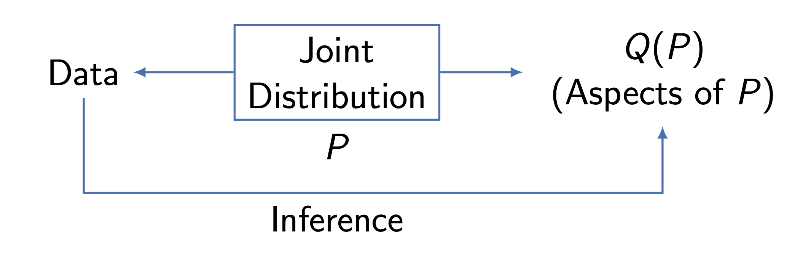
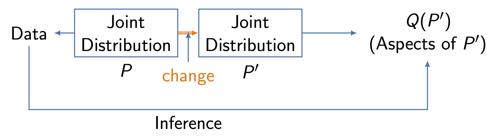
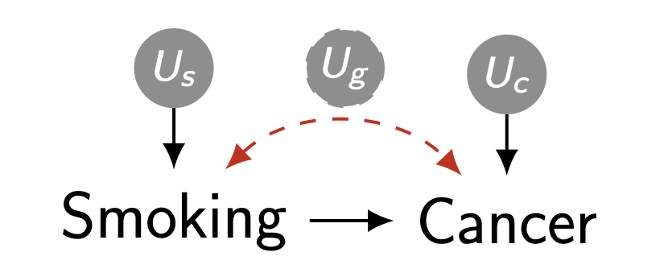
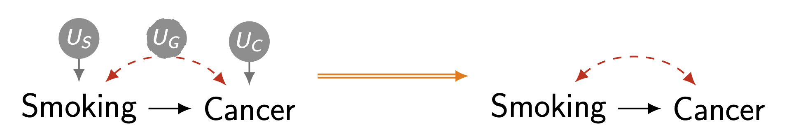
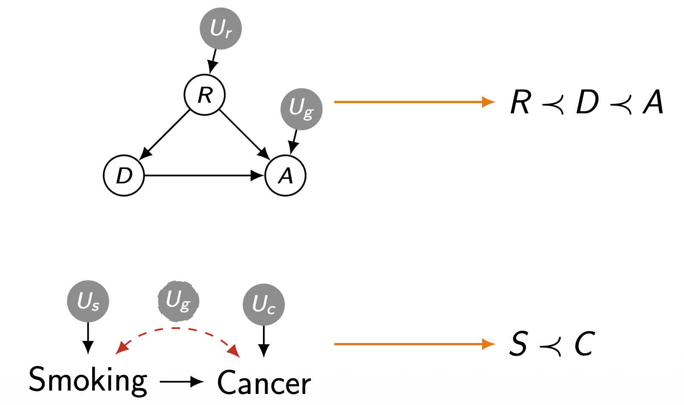
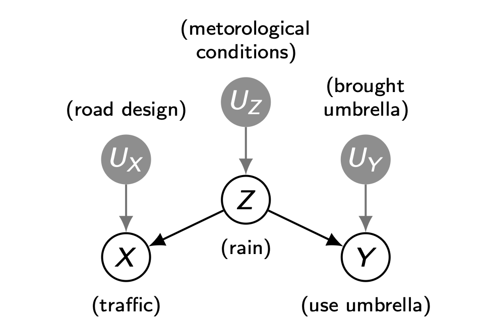
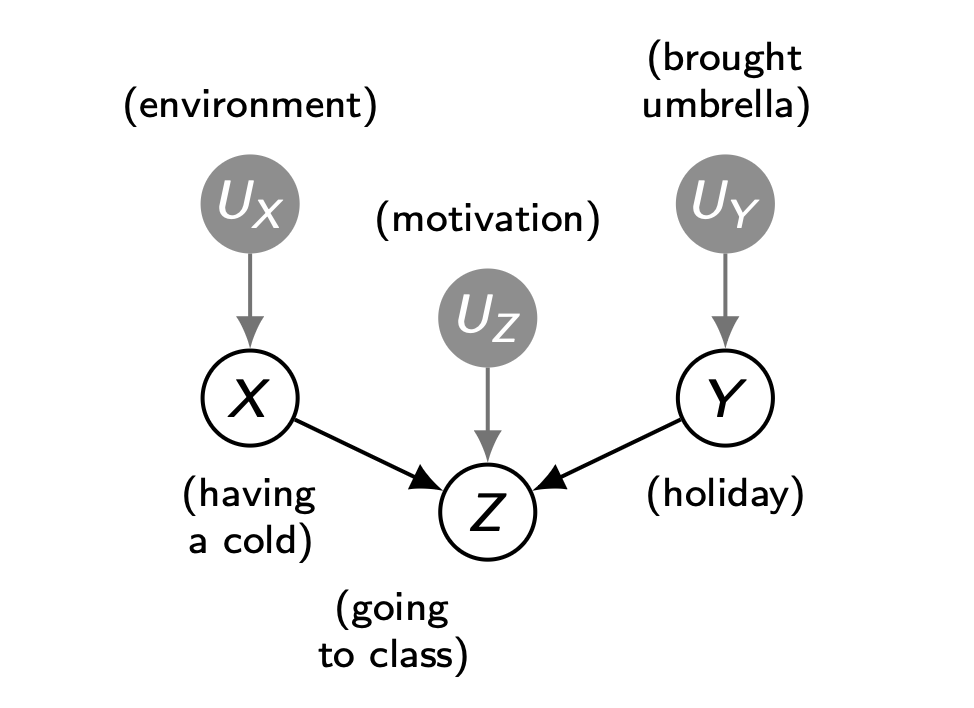
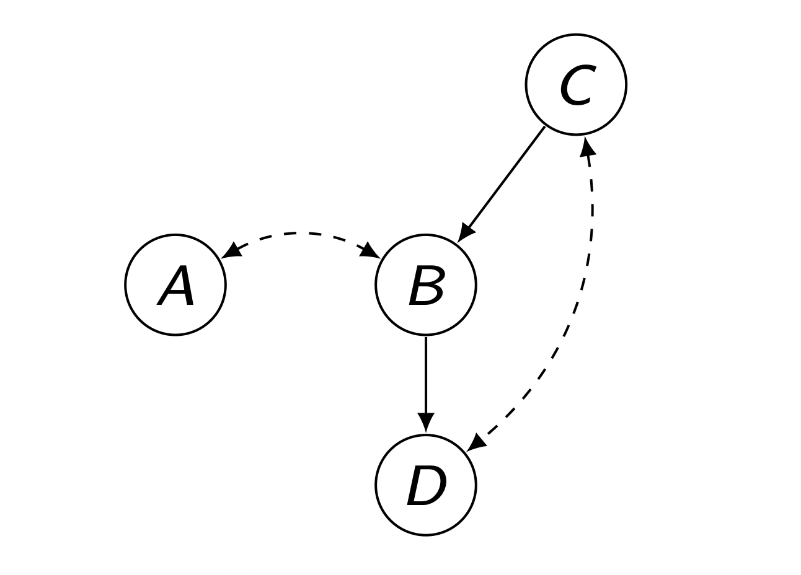

> 본 포스트는 서울대학교 GSDS **Sanghack Lee** 교수님의 *Causal Inference* 강의 자료(2강 *Causal Model & Causal Graph*, 슬라이드 원본은 Bareinboim 교수님 자료에서 차용)를 바탕으로, 강의를 처음 듣는 독자도 논리적 흐름을 따라갈 수 있도록 재구성한 것입니다.

이번 강의의 목표는 단순합니다. **"데이터만으로는 답할 수 없는 질문"이 존재한다**는 사실을 직시하고, 그 빈틈을 메우기 위한 새로운 수학적 언어 — **구조적 인과 모델(Structural Causal Model, SCM)** 과 **인과 그래프(Causal Graph)** — 를 정의하는 것입니다. 강의는 다음과 같은 순서로 전개됩니다.

* **사전 복습 (Reviews):** 표기법, 확률, 대수(sum of products) 복습
* **인과 모델과 그래프 (Causal Models and Graphs)**
  * 개념적 예시 (A Conceptual Example)
  * 구조적 인과 모델 (Structural Causal Model): 정의 / Property 1, 2, 3
  * 조건부 독립 (Conditional Independence)
  * 마르코프 조건 (Markovian Condition)
  * 그래프 분리 (Graph Separation, d-separation)

---

# 1. 사전 복습 (Reviews)

본격적인 논의에 앞서, 이후 전개에서 끊임없이 등장할 **표기법·확률·대수 규칙**을 약속해 두겠습니다.

### 1.1 표기법 복습 (Notation Review)

* **확률 변수(random variable)** 는 보통 대문자로 씁니다. 예: $Z$.
* 확률 변수에는 **상태 공간(state space)** 이 따라붙으며 $\mathcal{X}_Z$ 로 표기합니다. (실제로 $\mathcal{X}$ 기호를 직접 쓸 일은 드뭅니다.)
* **소문자**는 변수의 **값(value)** 입니다. 예: $z \in \mathcal{X}_Z$.
* **굵은 글씨(bold)** 는 변수들의 **집합** 또는 값들의 집합을 나타냅니다. 예: $\mathbf{V}$, $\mathbf{v}$.
* **필기체(calligraphy)** 는 그래프 $\mathcal{G}$, 모델 $\mathcal{M}$ 처럼 복잡한 수학적 객체에 씁니다.
* 논리·집합 기호: $\forall$(임의의), $\exists$(존재), $\cup$(합집합), $\cap$(교집합), $\subseteq, \subsetneq$(부분집합; $\subset$ 은 모호하므로 지양), $\vee$(or), $\wedge$(and), $\oplus$(xor).
* 연산 기호: $\sum$(합), $\prod$(곱), $\langle \cdots \rangle$(튜플), $\{\cdots\}$(집합), $\mid$(given).
* 논리 함의: $p \Rightarrow q$ 는 "$p$ 이면 $q$" 이며, 이때 **$p$ 는 $q$ 의 충분조건**입니다. 그 대우 $\neg p \Rightarrow \neg q$ 는 **$p$ 가 $q$ 의 필요조건**임을 뜻합니다.

### 1.2 확률 복습 (Probability Review)

확률 변수 집합 $\{A, B, C, D, E\}$ 의 결합분포 $P(A, B, C, D, E)$ 를 생각합니다. 일반성을 잃지 않고 변수들은 **이산형(discrete)** 이라 가정합니다. 또한 표기 약속으로 $P(A=a, B=b) = P(a, b)$ 처럼 값으로 직접 쓰겠습니다.

* **주변 확률(Marginal Probability):** 관심 없는 변수들을 더해(sum out) 없앱니다.
$$
\sum_{c,e \,\in\, \mathcal{X}_C \times \mathcal{X}_E} P(a, b, c, d, e) \;=\; \sum_{c,e} P(a, b, c, d, e) \;=\; P(a, b, d).
$$

* **조건부 확률(Conditional Probability):** 조건부 분포의 정의 $P(\cdot \mid \cdot) = P(\cdot, \cdot)/P(\cdot)$ 를 그대로 적용하며, 분모 역시 주변화로 계산합니다.
$$
P(a, b, c \mid d, e) \;=\; \frac{P(a, b, c, d, e)}{P(d, e)} \;=\; \frac{P(a, b, c, d, e)}{\sum_{a,b,c} P(a, b, c, d, e)}.
$$

* **연쇄 규칙(Chain Rule):** 조건부 분포의 정의를 재귀적으로 적용하면, 결합분포를 조건부들의 곱으로 분해할 수 있습니다. 분해 순서는 자유롭습니다.
$$
P(a, b, d, e) = P(a \mid b, d, e)\,P(b, d, e) = P(a \mid b, d, e)\,P(b \mid d, e)\,P(d \mid e)\,P(e),
$$
$$
\text{또는}\quad P(a, b, d, e) = P(b \mid a, d, e)\,P(d \mid a, e)\,P(e \mid a)\,P(a).
$$

* **기본 공리(Basic Axioms):**
$$
0 \le P(\cdot) \le 1, \qquad \sum_{a,b,c} P(a, b, c) = 1.
$$
많은 경우 우리는 **양의 확률(strictly positive probabilities)**, 즉 $P(\cdot) > 0$ 을 가정합니다. (이는 조건부 확률의 분모가 0이 되는 상황을 피하기 위한 기술적 가정입니다.)

### 1.3 대수 복습 — 합과 곱 (Algebra Review — Sum of Products)

앞으로 합($\sum$)과 곱($\prod$)이 뒤엉킨 식을 무수히 다루게 됩니다. 핵심은 **"합 기호는 자신과 무관한 항 밖으로 빼낼 수 있다"** 는 분배법칙입니다. 다음 식을 봅시다.
$$
\sum_{a,c} f(a, b)\, g(b, c)\, h(c, d).
$$

이 식은 합의 순서를 바꾸고 인수를 묶어 다음처럼 재배열할 수 있습니다.
$$
\sum_{c} h(c, d) \left( \sum_{a} f(a, b)\, g(b, c) \right) = \sum_{c} h(c, d) \sum_{a} f(a, b)\, g(b, c),
$$
$$
\text{또는}\quad \sum_{a} f(a, b) \left( \sum_{c} g(b, c)\, h(c, d) \right) = \sum_{a} f(a, b) \sum_{c} g(b, c)\, h(c, d).
$$

이제 $f(a, b) = P(a \mid b)$ 라고 가정해 봅시다. $\sum_c g(b,c)h(c,d)$ 항은 **$a$ 와 무관**하므로 $\sum_a$ 밖으로 빠져나갈 수 있습니다.
$$
\sum_{a} P(a \mid b) \underbrace{\sum_{c} g(b, c)\, h(c, d)}_{a \text{ 와 무관}} = \left( \sum_{a} P(a \mid b) \right) \sum_{c} g(b, c)\, h(c, d) = \sum_{c} g(b, c)\, h(c, d).
$$
마지막 등호는 $\sum_a P(a \mid b) = 1$ (조건부 분포의 전확률 합이 1) 이라는 사실에서 나옵니다. 즉 **"조건부 분포를 그 조건 변수에 대해 모두 더하면 사라진다"** 는 패턴이며, 인과 식 유도에서 가장 자주 쓰이는 트릭입니다.

---

# 2. 인과 모델과 그래프 (Causal Models and Graphs)

## 2.1 개념적 예시 (A Conceptual Example)

### 2.1.1 표면적 증거 (Prima facie Evidence)

> *Prima facie* 는 "첫인상, 언뜻 보기에"라는 뜻입니다.

어느 도시에 전염병이 돌고 있습니다. 환자의 생존을 돕는다고 **믿어지는 약(drug)** 이 있습니다. 그런데 의사들은 모르는 진실이 있습니다.

* **좋은 생활 여건(부유함)** 을 가진 사람은 약과 무관하게 **항상 생존**합니다.
* 일부 사람은 병에 자연적으로 저항하는 **유전자(gene)** 를 가지고 있어 치료가 필요 없지만, 치료를 받으면 **알레르기 반응**을 일으키고, 이는 **가난한 환경에서는 치명적**입니다.


여기서 핵심은 **"부유함(rich)"과 "유전자(gene)"가 서로 독립**이라는 점입니다. 모집단은 다음 세 그룹으로 나뉩니다.

* $\text{rich}$ : 무조건 생존 (alive anyways)
* $\text{poor}_1$ : 유전자 없음 → 무조건 사망 (die anyways)
* $\text{poor}_2$ : 유전자 있음 → **약을 먹으면 사망** (die iff taking the drug)

확률 구조는 $P(\text{rich}) = P(\text{poor})$, $P(\text{poor}_1) = P(\text{poor}_2)$ 입니다.

### 2.1.2 현행 프로토콜 — 할당 메커니즘 (Current Protocol — Assignment Mechanism)

약은 비싸기 때문에, 현재 의사들은 **부자에게만, 그리고 모든 부자에게** 약을 처방합니다.

* $\text{rich} \to$ 약 처방
* $\text{poor} \to$ 약 미처방


관측된 결과는 다음과 같습니다.
$$
P(\text{alive} \mid \text{drug}) = 1, \qquad P(\text{alive} \mid \neg\text{drug}) = 0.5.
$$

데이터만 보면 약이 생존에 결정적으로 기여하는 것처럼 보입니다. 그래서 자연스러운 질문이 떠오릅니다.

> **Q.** 약이 이로워 보이니, 도시가 **모두에게 무료로** 나눠 줘야 할까요?

### 2.1.3 새로운 할당 메커니즘 — 모두에게(또는 아무에게도) (New Assignment Mechanism)

이제 가상의 두 세계, "모두에게 약(Drug for All)"과 "아무에게도 약 없음(Drug for None)"을 비교해 봅니다.


놀랍게도, 모두에게 약을 주면 **유전자를 가진 빈자들이 약 때문에 사망**하므로 결과가 더 나빠집니다. 오히려 아무에게도 주지 않는 편이 낫습니다. **데이터가 시사하는 직관과 정반대의 결론**입니다.

### 2.1.4 데이터만으로 옳은 결정을 내릴 수 있는가? (Can we decide from data alone?)

AI 의사결정 시스템이 사용할 수 있는 정보는 관측 데이터, 즉 결합분포 $P(R, D, A)$ 뿐입니다.


그렇다면 결정적인 질문입니다.

> 이 데이터만으로 옳은/최적의 답을 학습하는 알고리즘(Decision Tree, SVM, DNN 등)이 존재할까요?

답은 **"불가능하다"** 입니다. 왜냐하면 데이터에는 다음과 같은 **관측되지 않는(exogenous) 변동**이 빠져 있기 때문입니다.

* 알레르기 유전자를 가질 확률 $P(\text{gene})$
* 부유함에 영향을 주는 다른 요인들
* 유전자가 부·약·반응과 **어떻게 상호작용하는지** 에 대한 메커니즘

즉, **무엇이 무엇을 야기하는가(mechanism)** 에 대한 정보가 데이터에는 인코딩되어 있지 않습니다.

### 2.1.5 전통적 통계-ML 추론 패러다임 (Traditional Stats-ML Paradigm)

전통적 통계·머신러닝의 접근은 **"데이터의 좋은 표현(representation)을 찾는 것"** 입니다.



여기서 추론의 대상 $Q(P)$ 는 항상 **하나의 분포 $P$ 의 측면**입니다. 예: $Q = P(B \mid A)$ ("A를 산 고객이 B도 살 확률").

### 2.1.6 통계적 분석에서 인과적 분석으로 (From Statistical to Causal Analysis)

그런데 우리가 정말 던지고 싶은 질문은 다음과 같은 종류입니다.

* 가격을 두 배로 올리면 매출 $P'(\text{sales})$ 는 어떻게 변할까?
* 흡연을 금지하면 암 발생 $P'(\text{cancer})$ 는 어떻게 변할까?



핵심 문제는 다음과 같습니다.

> **Q.** 사실적 분포 $P$ 가 가상의 분포 $P'$ 로 **어떻게** 변하는가?

여기서 결정적 어려움은 **$P'$ 에는 데이터가 없다** 는 점입니다($P$ 는 데이터와 연결되어 있지만, $P'$ 은 한 번도 관측된 적 없는 세계입니다). 따라서 $P$ 와 $P'$ 를 **모두** 표현할 수 있는 새로운 형식론이 필요합니다.

### 2.1.7 새로운 오라클 — 구조적 인과 모델 패러다임 (New Oracle — SCM Paradigm)

그 새로운 형식론이 바로 **데이터 생성 모델(Data Generating Model)** $\mathcal{M}$ 입니다.


여기서 $\mathcal{M}$ 은 자연(Nature)이 변수에 값을 할당하는 **불변의 전략(invariant strategy)** — 메커니즘, 레시피, 법칙, 프로토콜 — 을 의미합니다. 정리하면,

* $P$ — **데이터**의 모델
* $\mathcal{M}$ — **현실(reality)** 의 모델

### 2.1.8 큰 그림으로 돌아가기 (Back to Big Picture)


요컨대 인과 모델은 **데이터에 없는 우리의 지식·가정을 형식적으로 주입**하는 장치이며, 이를 통해 비로소 "실현되지 않은 대안 현실"까지 추론할 수 있게 됩니다.

### 2.1.9 우리 예시에서 현실 모델링하기 (Modeling Reality in our Example)

이제 약-생존 예시를 명시적인 모델로 적어 봅니다.

* **관측 변수(Observed, $\mathbf{V}$):**
  * $R$ : ($R=1$ 부유, $R=0$ 가난)
  * $D$ : ($D=1$ 약 복용)
  * $A$ : ($A=1$ 생존)
* **비관측 변수(Unobserved, $\mathbf{U}$):**
  * $U_G$ : ($U_G=1$ 유전자 보유, $=0$ 아니면)
  * $U_R$ : (부유함에 영향을 주는 기타 요인)

관측 변수가 결정되는 방식(구조 방정식)은 다음과 같습니다.
$$
R \leftarrow U_R, \qquad D \leftarrow R, \qquad A \leftarrow R \vee (U_G \wedge \neg D).
$$

* 부유하면 ($R=1$) 항상 생존합니다.
* 빈자는 **유전자를 가지고 있고($U_G=1$) 약을 먹지 않을 때만($\neg D$)** 생존합니다.

비관측 변수에 대한 불확실성(분포)은
$$
P(U_G = 1) = \tfrac{1}{2}, \quad P(U_R = 1) = \tfrac{1}{2}, \qquad P(\mathbf{U}) = P(U_G)\,P(U_R).
$$

이것이 바로 **완전히 명세된 현실의 모델**입니다. 이 모델은 $P$ 와 $P'$ 을 **둘 다** 함의하며, 우리의 새로운 만능 오라클 — 즉 **구조적 인과 모델(Structural Causal Model)** — 이 됩니다. 이제 이 객체를 일반화해 봅시다.

## 2.2 구조적 인과 모델 (Structural Causal Model)

### 2.2.1 정의 (Definition)

::: {.callout-note title="정의 (Structural Causal Model [Pearl, 2000])"}
**구조적 인과 모델(SCM)** $\mathcal{M}$ 은 4-튜플 $\langle \mathbf{V}, \mathbf{U}, \mathcal{F}, P(\mathbf{U}) \rangle$ 이며, 각 성분은 다음과 같습니다.

* $\mathbf{V} = \{V_1, \dots, V_n\}$ : **내생 변수(endogenous variables)** — 우리가 모델 내부에서 설명하려는 변수.
* $\mathbf{U}$ : **외생 변수(exogenous variables)** 의 집합 — 모델 외부에서 주어지는, 보통 관측되지 않는 변수.
* $\mathcal{F} = \{f_1, \dots, f_n\}$ : 각 내생 변수 $V_i$ 의 값을 결정하는 **함수들**.
$$
v_i \leftarrow f_i(\mathbf{pa}_i, \mathbf{u}_i), \qquad \mathbf{Pa}_i \subseteq \mathbf{V} \setminus \{V_i\}, \quad \mathbf{U}_i \subseteq \mathbf{U}.
$$
* $P(\mathbf{U})$ : 외생 변수에 대한 **확률분포**.
:::

여기서 화살표 $\leftarrow$ 는 등호(=)가 아니라 **할당(assignment)** 임에 유의하세요. 즉 $v_i \leftarrow f_i(\cdot)$ 는 "$V_i$ 의 값은 그 부모와 외생 변수에 의해 **결정된다**"는 비대칭적(인과적) 관계를 표현합니다. 이 정의의 공리적 특성화는 Galles and Pearl [1998], Halpern [1998]에서 다룹니다.

직관적으로, SCM은 **각 변수마다 "이 변수는 누구의 영향을 받아 어떻게 정해지는가"를 하나의 함수로 적어 둔 것** 이며, 유일하게 무작위성이 들어오는 곳은 외생 변수의 분포 $P(\mathbf{U})$ 입니다.

이제 이 SCM 객체가 가지는 세 가지 핵심 성질(Property 1, 2, 3)을 차례로 살펴봅니다.

### 2.2.2 Property 1: SCM은 관측 분포 $P(\mathbf{v})$ 를 유도한다

* 함수 집합 $\mathcal{F}$ 는 외생 변수에서 내생 변수로의 **사상(mapping)** $\mathbf{U} \longrightarrow \mathbf{V}$ 로 볼 수 있습니다: $\mathcal{F}_{\mathbf{u}} \mapsto \{v_1, v_2, \dots, v_n\}$.
* 입력 $\mathbf{U}$ 가 확률 변수들의 집합이면, 그 출력 $\mathbf{V}$ 역시 **확률 변수들의 집합**이 됩니다(랜덤성이 $\mathbf{U}$ 에서 $\mathbf{V}$ 로 전파).
* 이렇게 얻어진 $P(\mathbf{v})$ 는 **Pearl의 인과 위계(PCH)의 1층**, 즉 **관측(observational) 분포** (수동적·비실험적 분포)입니다.
* 각 사건·사람·관측은 외생 변수의 한 실현값 $\mathbf{U} = \mathbf{u}$ 에 대응합니다.

::: {.callout-tip title="형식적 정의 (PCH chapter, Def. 2)"}
SCM $\mathcal{M} = \langle \mathbf{V}, \mathbf{U}, \mathcal{F}, P(\mathbf{U}) \rangle$ 는 임의의 부분집합 $\mathbf{Y} \subseteq \mathbf{V}$ 에 대해 다음과 같은 결합분포 $P_{\mathcal{M}}(\mathbf{V})$ 를 정의합니다.
$$
P_{\mathcal{M}}(\mathbf{y}) = \sum_{\mathbf{u} \,\mid\, \mathbf{Y}(\mathbf{u}) = \mathbf{y}} P(\mathbf{u}).
$$
:::

여기서 $\mathbf{Y}(\mathbf{u})$ 는 외생 값 $\mathbf{u}$ 가 주어졌을 때 $\mathbf{Y}$ 가 취하는 **잠재 반응(potential response)** 입니다. 즉 **"결과가 $\mathbf{y}$ 가 되도록 만드는 모든 외생 시나리오 $\mathbf{u}$ 의 확률을 더한 것"** 이 곧 $P_{\mathcal{M}}(\mathbf{y})$ 입니다.

#### 예시로 확인하기

우리 예시에서 각 시민은 외생 값 $(U_R, U_G)$ 에 따라 4개 그룹 중 하나에 속합니다.


구체적으로 사상 $\mathcal{F}$ 는 다음과 같습니다.
$$
\begin{aligned}
(U_R = 1, U_G = 1) &\longrightarrow (R = 1, D = 1, A = 1) \\
(U_R = 1, U_G = 0) &\longrightarrow (R = 1, D = 1, A = 1) \\
(U_R = 0, U_G = 1) &\longrightarrow (R = 0, D = 0, A = 1) \\
(U_R = 0, U_G = 0) &\longrightarrow (R = 0, D = 0, A = 0)
\end{aligned}
$$

각 외생 시나리오의 확률은 $P(\mathbf{u}) = 1/4$ 로 같으므로, 결과별로 묶어 더하면
$$
P(R{=}1, D{=}1, A{=}1) = \tfrac{1}{4} + \tfrac{1}{4} = \tfrac{1}{2}, \quad P(R{=}0,D{=}0,A{=}1) = \tfrac{1}{4}, \quad P(R{=}0,D{=}0,A{=}0) = \tfrac{1}{4}.
$$
이렇게 **SCM 하나가 곧바로 관측 분포 $P(\mathbf{v})$ 를 결정**함을 확인할 수 있습니다.

### 2.2.3 Property 2: SCM은 인과 다이어그램을 유도한다

모든 SCM $\mathcal{M}$ 은 **인과 다이어그램(causal diagram)** 을 유도하며, 이는 **유향 비순환 그래프(Directed Acyclic Graph, DAG)** 로 표현됩니다.


구성 규칙은 다음과 같습니다.

* 각 $V_i \in \mathbf{V}$ 는 하나의 **노드(정점)** 가 됩니다.
* 모든 $B \in \mathbf{Pa}_i$ 에 대해 유향 간선 $B \to V_i$ 를 긋습니다.
* $U_i \not\perp\!\!\!\perp U_j$ (외생 변수가 독립이 아닐 때)마다 **양방향 간선** $V_i \leftrightarrow V_j$ 를 긋습니다.
  * 더 정확히는, 양방향 간선이 전혀 없는 임의의 정점 집합 $\mathbf{W}$ 에 대해 $\{U_W\}_{W \in \mathbf{W}}$ 가 **결합 독립(jointly independent)** 이어야 합니다.

::: {.callout-note title="정의 (Causal Diagram [Def. 13, Bareinboim et al., 2020])"}
SCM $\mathcal{M} = \langle \mathbf{V}, \mathbf{U}, \mathcal{F}, P(\mathbf{U}) \rangle$ 에 대해, 다음과 같이 구성된 $\mathcal{G}$ 를 $\mathcal{M}$ 의 **인과 다이어그램**이라 합니다.

1. 모든 내생 변수 $V_i \in \mathbf{V}$ 에 대해 정점을 추가합니다.
2. $V_j$ 가 $f_i \in \mathcal{F}$ 의 인자로 등장하면 간선 $V_j \to V_i$ 를 추가합니다.
3. $U_i, U_j \subseteq \mathbf{U}$ 가 **상관되어 있거나** 함수 $f_i, f_j$ 가 어떤 $U \in \mathbf{U}$ 를 **공유**하면, 양방향 간선 $V_j \leftrightarrow V_i$ 를 추가합니다.
:::

#### 예시 1: 의료 예시의 인과 다이어그램


#### 예시 2: 흡연-암 예시

* $\mathbf{V} = \{\text{Smoking}, \text{Cancer}\}$, $\mathbf{U} = \{U_S, U_C, U_G\}$
* 구조 방정식:
$$
\text{Smoking} \leftarrow f_{\text{Smoking}}(U_S, U_G), \qquad \text{Cancer} \leftarrow f_{\text{Cancer}}(\text{Smoking}, U_C, U_G).
$$



::: {.callout-important title="두 가지 주의(Remarks)"}
* **Remark 1.** 이 사상은 **한 방향(SCM → 인과 다이어그램)뿐** 입니다. 동일한 그래프는 같은 범위(scope, 즉 같은 함수 시그니처와 호환되는 외생 분포)를 갖는 **무한히 많은 SCM** 과 양립합니다.
* **Remark 2.** 이 관찰은 인과추론의 핵심입니다. 현실에서 연구자는 함수의 **범위(누가 누구의 인자인가)** 는 알 수 있어도, 그 **구체적 메커니즘**까지는 모르는 경우가 대부분이기 때문입니다.
:::

#### 표기 관례: 외생 변수는 암묵적으로 생략



**관례.** 외생 변수는 그래프에서 암묵적으로 둡니다. 한 변수에만 영향을 주는 외생 변수는 생략하고, **둘 이상이 공유하는 외생 변수는 양방향 점선 간선** $\leftrightarrow$ 으로 남깁니다.

#### 인과 다이어그램 — 용어 (Terminology)

그래프 $\mathcal{G}$ 는 정점 집합 $\mathbf{V}$ 와 간선 집합 $\mathbf{E}$ 의 쌍 $\langle \mathbf{V}, \mathbf{E} \rangle$ 로 정의됩니다. (노드(node)와 정점(vertex)은 혼용합니다.) 임의의 $V \in \mathbf{V}$ 에 대해:

* **부모(Parents):** $\{W \mid W \to V \in \mathcal{G}\}$ — $V$ 로 화살표를 보내는 노드.
* **자식(Children):** $\{W \mid V \to W \in \mathcal{G}\}$ — $V$ 가 화살표를 보내는 노드.
* **조상(Ancestors):** $\{W \mid W \to \cdots \to V \in \mathcal{G}\}$ — $V$ 로 가는 유향 경로의 출발점들 (길이 0 포함, 즉 자기 자신 포함).
* **자손(Descendants):** $\{W \mid V \to \cdots \to W \in \mathcal{G}\}$ — $V$ 에서 도달 가능한 노드들 (길이 0 포함).
* **형제(Siblings):** $\{W \mid W \leftrightarrow V \in \mathcal{G}\}$ — 양방향 간선으로 연결된 노드.
* **경로(path):** 서로 다른 정점들을 잇는 간선들의 수열.
* **유향 경로(directed path):** $W$ 에서 $V$ 로 가는 경로 중 모든 화살촉이 진행 방향($V$ 쪽)을 향하는 경로.

### 2.2.4 Property 3: SCM은 Pearl의 인과 위계를 함의한다

SCM은 단지 관측 분포만 유도하는 것이 아니라, **인과적 질문의 위계 전체** 를 함의합니다.


| Level (Symbol) | Typical Activity |
|:---|:---|
| 1. **Association** $P(y \mid \mathbf{x})$ | Seeing — ML (Un)Supervised Learning |
| 2. **Intervention** $P(y \mid do(x), c)$ | Doing — ML Reinforcement Learning |
| 3. **Counterfactual** $P(y_x \mid x', y')$ | Imagining, Retrospection |

이번 강의에서는 일단 **1층(연관)에만 집중** 합니다.

#### 인과 위계의 1층 — 연관 (1st Layer: Associations)

> *"내가 $X = x$ 를 **본다면** 어떻게 되는가?"* — 이것이 1층 연관의 질문입니다.

##### 1층의 발생 (The Emergence of the First Layer)

$\mathcal{M}$ 은 관측 변수 $\mathbf{V}$ 에 대한 확률분포 $P(V_1, \dots, V_n)$ 을 유도하며, 이를 외생 변수에 대해 주변화하여 적을 수 있습니다.
$$
P(\mathbf{v}) = \sum_{\mathbf{u}} P(\mathbf{V} = \mathbf{v}, \mathbf{U} = \mathbf{u}) = \sum_{\mathbf{u}} P\Big( \underbrace{\forall_{V_i \in \mathbf{V}}\; f_i(\mathbf{pa}_i, \mathbf{u}_i) = v_i}_{\mathbf{v} \text{ 가 실현되는 사건}},\; \mathbf{U} = \mathbf{u} \Big),
$$
여기서 $\mathbf{pa}_i, \mathbf{u}_i$ 는 $f_i$ 의 관측·비관측 인자(의 값)이며, 이들은 인과 다이어그램 $\mathcal{G}$ 에서 $V_i$ 의 부모와 일치합니다.

* 의료 예시: $\displaystyle P(r, d, a) = \sum_{u_R, u_G} P(r, d, a, u_R, u_G)$
* 흡연 예시: $\displaystyle P(s, c) = \sum_{u_S, u_G, u_C} P(s, c, u_S, u_G, u_C)$

이 분포를 **관측 분포(observational distribution)**, 또는 수동적(passive)·비실험적(non-experimental) 분포라고 부릅니다.

##### 다이어그램이 인코딩하는 것 — 위상 정렬 (Topological Order)

$\mathcal{G}$ 가 DAG이므로, 모든 변수가 자신의 부모보다 뒤에 오는 **위상 정렬(topological order)** 이 존재합니다. 즉 $\mathbf{Pa}_i \prec V_i$ (기호 $\prec$ 는 "선행한다"는 뜻).



##### 다이어그램이 인코딩하는 것 — 인수분해

이제 핵심 유도입니다. $\mathcal{M}$ 이 유도하는 $P(\mathbf{V})$ 를 위상 정렬을 따라 연쇄 규칙으로 분해합니다.

**1단계.** 외생 변수에 대한 주변화:
$$
P(\mathbf{v}) = \sum_{\mathbf{u}} P(\mathbf{v}, \mathbf{u}).
$$

**2단계.** 연쇄 규칙을 위상 정렬 순서로 적용:
$$
P(\mathbf{v}) = \sum_{\mathbf{u}} P(\mathbf{u}) \prod_{V_i \in \mathbf{V}} P(v_i \mid v_1, \dots, v_{i-1}, \mathbf{u}).
$$

**3단계 (핵심).** 관측 변수 $V_i$ 는 그 관측·비관측 부모에 의해 **완전히 결정**되며, $\mathbf{Pa}_i \cup \mathbf{U}_i \subseteq \{V_1, \dots, V_{i-1}\} \cup \mathbf{U}$ 이므로, 조건부에서 부모 이외의 변수는 모두 무관해집니다.
$$
P(v_i \mid v_1, \dots, v_{i-1}, \mathbf{u}) = P\big( f_i(\mathbf{pa}_i, \mathbf{u}_i) = v_i \mid v_1, \dots, v_{i-1}, \mathbf{u} \big) = P(v_i \mid \mathbf{pa}_i, \mathbf{u}_i).
$$

따라서 분포는 다음과 같이 분해됩니다.
$$
P(\mathbf{v}) = \sum_{\mathbf{u}} P(\mathbf{u}) \prod_{V_i \in \mathbf{V}} P(v_i \mid v_1, \dots, v_{i-1}, \mathbf{u}) = \sum_{\mathbf{u}} P(\mathbf{u}) \prod_{V_i \in \mathbf{V}} P(v_i \mid \mathbf{pa}_i, \mathbf{u}_i).
$$

두 예시에 적용하면:
$$
P(r, d, a) = \sum_{u_R, u_G} P(u_R, u_G)\, P(r \mid u_R)\, P(d \mid r)\, P(a \mid r, d, u_G),
$$
$$
P(s, c) = \sum_{u_S, u_G, u_C} P(u_S, u_G, u_C)\, P(s \mid u_G, u_S)\, P(c \mid s, u_G, u_C).
$$

이렇게 **그래프 구조가 곧 결합분포의 인수분해 형태를 지시** 한다는 것이 Property 3의 핵심 함의입니다.

## 2.3 조건부 독립 (Conditional Independence)

### 2.3.1 확률적 불변성 (Probabilistic Invariance)

* 변수 $X = x$ 를 안다고 해서 $Y = y$ 에 대한 믿음이 변하지 않으면, $X$ 와 $Y$ 는 **확률적으로 독립** 이라 하고 $X \perp\!\!\!\perp Y$ 로 씁니다.
$$
X \perp\!\!\!\perp Y \iff P(Y = y \mid X = x) = P(Y = y) \quad\therefore\quad P(y, x) = P(y)\,P(x).
$$

* 더 일반적으로, 제3의 변수 $Z = z$ 를 이미 알고 있을 때 추가로 $X = x$ 를 알아도 $Y = y$ 에 대한 믿음이 변하지 않으면, $X$ 와 $Y$ 는 **$Z$ 가 주어졌을 때 조건부 독립** 이며 $(X \perp\!\!\!\perp Y \mid Z)$ 로 씁니다.
$$
X \perp\!\!\!\perp Y \mid Z \iff P(X = x \mid Z = z, Y = y) = P(X = x \mid Z = z).
$$

* 이것들은 모두 **분포 $P(\mathbf{V})$ 에 대한 제약(property/constraint)** 입니다.

> 핵심 직관: **함수적 의존의 부재 $\longrightarrow$ 확률적 독립.** (구조 방정식에서 어떤 변수가 인자로 등장하지 않으면, 그 변수에 대한 확률적 독립이 따라옵니다.)

### 2.3.2 그래프 $\mathcal{G}$ 가 분포 $P$ 의 조건부 독립을 함의한다

위상 정렬에서 우리는 이미 $P(v_i \mid v_1, \dots, v_{i-1}, \mathbf{u}) = P(v_i \mid \mathbf{pa}_i, \mathbf{u}_i)$ 임을 보았습니다. 그렇다면 자연스러운 질문은 다음과 같습니다.

> 위상 정렬에서 $\{V_1, \dots, V_{i-1}\}$ 로 올 수 있는 **최대 집합** 은 무엇인가?

이 집합은 $V_i \to \cdots \to W$ 형태의 유향 경로가 **없는** 모든 변수 $W$ 를 포함할 수 있습니다. 즉 $V_i$ 의 **모든 비자손(non-descendants)** 이며, 이를 $\mathbf{Nd}_i$ 로 표기합니다.

따라서
$$
P(v_i \mid \mathbf{pa}_i, \mathbf{u}_i) = P(v_i \mid v_1, \dots, v_{i-1}, \mathbf{u}) = P(v_i \mid \mathbf{nd}_i, \mathbf{u}),
$$
이는 다음의 조건부 독립에 대응합니다.
$$
\boxed{\; V_i \perp\!\!\!\perp \mathbf{Nd}_i \setminus \mathbf{Pa}_i,\; \mathbf{U} \setminus \mathbf{U}_i \;\Big|\; \mathbf{Pa}_i,\, \mathbf{U}_i \;}
$$
**해석:** 부모(와 자신의 외생 변수)를 알면, $V_i$ 는 자신의 비자손 중 부모가 아닌 나머지와 (그리고 자신과 무관한 외생 변수들과) 독립입니다.

## 2.4 마르코프 조건 (Markovian Condition)

외생 변수 $U_1, \dots, U_n \subseteq \mathbf{U}$ 가 **서로 결합 독립**(즉 $\mathcal{G}$ 에 양방향 간선이 하나도 없음)이면, 그 모델을 **마르코프적(Markovian)** 이라 부릅니다. 이때 분포는 다음과 같이 깔끔하게 인수분해됩니다.

$$
\begin{aligned}
P(\mathbf{v}) &= \sum_{\mathbf{u}} P(\mathbf{u}) \prod_{V_i \in \mathbf{V}} P(v_i \mid \mathbf{pa}_i, \mathbf{u}_i) \\[4pt]
&= \sum_{\mathbf{u}} \prod_{V_i \in \mathbf{V}} P(v_i \mid \mathbf{pa}_i, \mathbf{u}_i)\, P(u_i) && \big(\text{결합 독립} \Rightarrow P(\mathbf{u}) = \textstyle\prod_i P(u_i)\big) \\[4pt]
&= \sum_{\mathbf{u}} \prod_{V_i \in \mathbf{V}} P(v_i \mid \mathbf{pa}_i, \mathbf{u}_i)\, P(u_i \mid \mathbf{pa}_i) && \big(U_i \text{ 는 } \mathbf{pa}_i \text{ 와 독립}\big) \\[4pt]
&= \sum_{\mathbf{u}} \prod_{V_i \in \mathbf{V}} P(v_i, u_i \mid \mathbf{pa}_i) && (\text{곱셈 규칙으로 결합}) \\[4pt]
&= \prod_{V_i \in \mathbf{V}} \sum_{u_i} P(v_i, u_i \mid \mathbf{pa}_i) && (\text{합과 곱의 교환: } \S 1.3) \\[4pt]
&= \prod_{V_i \in \mathbf{V}} P(v_i \mid \mathbf{pa}_i).
\end{aligned}
$$

* 마지막 결과 $P(\mathbf{v}) = \prod_{V_i} P(v_i \mid \mathbf{pa}_i)$ 가 바로 **베이지안 인수분해(Bayesian Factorization)** 입니다.
* 이는 곧 **국소 마르코프 조건(Local Markovian Condition)** $\big(V_i \perp\!\!\!\perp \mathbf{Nd}_i \setminus \mathbf{Pa}_i \mid \mathbf{Pa}_i\big)$ 과 동치입니다.

세 번째 줄의 핵심은 외생 변수 $U_i$ 가 그 자식 $V_i$ 의 부모 $\mathbf{pa}_i$ 와 독립이라는 점($P(u_i) = P(u_i \mid \mathbf{pa}_i)$)이며, 다섯 번째 줄에서는 §1.3에서 익힌 "합과 곱의 교환" 트릭(각 인자가 자신과 무관한 합 밖으로 나갈 수 있음)이 그대로 쓰입니다. 마르코프 가정 덕분에 비관측 외생 변수가 깔끔하게 소거되어, **관측 변수만의 부모-자식 조건부 곱**으로 결합분포가 표현됩니다.

## 2.5 그래프 분리 (Graph Separation, d-separation)

> 이 절은 **"비관측 세계와 관측 세계를 연결하기"**, 즉 마르코프 조건의 함의를 다룹니다.

이제 그래프 구조만 보고 어떤 조건부 독립이 성립하는지를 읽어내는 방법을 배웁니다. 출발점은 세 가지 기본 구조 — **인과 연쇄(chain)**, **공통 원인(common cause)**, **공통 결과(common effect)** — 입니다.

### 2.5.1 인과 연쇄 (Causal Chains) — $X \to Z \to Y$

수능-입시 예시로 봅니다: $X$(좋은 공부 습관) $\to Z$(높은 수능 점수) $\to Y$(대학 합격). 구조 방정식은
$$
X \leftarrow U_X, \qquad Z \leftarrow X \vee \neg U_Z, \qquad Y \leftarrow Z \wedge U_Y.
$$

#### (a) $X$ 와 $Y$ 는 (주변적으로) 독립인가? → **아니오**


결합 확률을 $Z$ 에 대해 주변화하면 (그래프 구조를 따라 분해):
$$
P(X{=}1, Y{=}1) = \sum_z P(X{=}1)\,P(z \mid X{=}1)\,P(Y{=}1 \mid z) = P(X{=}1) \sum_z P(z \mid X{=}1)\,P(Y{=}1 \mid z) = P(U_X{=}1)\,P(U_Y{=}1).
$$
반면 독립을 가정한 곱은
$$
P(X{=}1)\,P(Y{=}1) = P(U_X{=}1)\,P(U_Y{=}1)\big(P(U_X{=}0)P(U_Z{=}0) + P(U_X{=}1)\big).
$$
두 값이 일반적으로 다르므로 $X \not\perp\!\!\!\perp Y$ 입니다. 그래프적으로는 **정보가 $X$ 에서 $Z$ 를 통해 $Y$ 로 흐릅니다.**

#### (b) $Z$ 가 주어졌을 때 $X$ 와 $Y$ 는 독립인가? → **예**


조건부 결합을 전개하면 (분해 $P(x,y,z) = P(y \mid z) P(z \mid x) P(x)$ 이용):
$$
P(x, y \mid z) = \frac{P(x, y, z)}{P(z)} = \frac{P(y \mid z)\,P(z \mid x)\,P(x)}{P(z)} = \frac{P(x, z)}{P(z)}\,P(y \mid z) = P(x \mid z)\,P(y \mid z).
$$
따라서 $X \perp\!\!\!\perp Y \mid Z$. 그래프적으로 **$Z$ 를 관측하면 $X \to Y$ 영향이 차단**됩니다.

### 2.5.2 공통 원인 (Common Cause) — $X \leftarrow Z \to Y$

교통 예시: $Z$(비) $\to X$(교통 혼잡), $Z$(비) $\to Y$(우산 사용). 구조 방정식은
$$
Z \leftarrow U_Z, \qquad X \leftarrow Z \vee \neg U_X, \qquad Y \leftarrow Z \wedge U_Y.
$$



#### (a) $X$ 와 $Y$ 는 독립인가? → **아니오**

우산을 든 사람($Y=1$)을 보면 비($Z=1$)일 확률이 올라가고, 이는 교통 혼잡($X=1$) 가능성을 높입니다. 즉 $\exists_{x,y}\, P(x, y) \neq P(x)\,P(y)$. 정보가 공통 원인 $Z$ 를 통해 $Y \to X$ 로 흐릅니다.

#### (b) $Z$ 가 주어졌을 때 $X$ 와 $Y$ 는 독립인가? → **예**

비가 온다($Z=1$)는 것을 이미 알면, 우산을 든 사람($Y=1$)을 봐도 교통($X$)에 대해 추가 정보를 주지 못합니다.
$$
P(x, y \mid z) = \frac{P(x, y, z)}{P(z)} = \frac{P(x \mid z)\,P(y \mid z)\,P(z)}{P(z)} = P(x \mid z)\,P(y \mid z).
$$
따라서 $X \perp\!\!\!\perp Y \mid Z$. **공통 원인 $Z$ 를 관측하면 경로가 차단**됩니다. (연쇄와 마찬가지로, 비관측 시 활성·관측 시 차단입니다.)

### 2.5.3 공통 결과 (Common Effect, Collider) — $X \to Z \leftarrow Y$

출석 예시: $X$(감기) $\to Z$(수업 출석) $\leftarrow Y$(공휴일). 구조 방정식은
$$
X \leftarrow U_X, \qquad Y \leftarrow U_Y, \qquad Z \leftarrow \neg Y \wedge (\neg X \wedge U_Z).
$$

#### (a) $X$ 와 $Y$ 는 독립인가? → **예**



감기에 걸리는 것($X=1$)과 공휴일인 것($Y=1$)은 서로 무관합니다.
$$
P(x, y) = \sum_z P(x)\,P(y)\,P(z \mid x, y) = P(x)\,P(y) \sum_z P(z \mid x, y) = P(x)\,P(y).
$$
따라서 $X \perp\!\!\!\perp Y$. **충돌점(collider) $Z$ 를 관측하지 않으면 경로가 차단**됩니다 — 앞의 두 경우와 정반대입니다.

#### (b) $Z$ 가 주어졌을 때 $X$ 와 $Y$ 는 독립인가? → **아니오!**

만약 학생이 수업에 안 왔고($Z=0$) 오늘이 공휴일이 아니라면($Y=0$), 그 학생은 **감기에 걸렸을 가능성($X=1$)이 높아집니다.** 즉 $\exists_{x,y,z}\, P(x, y \mid z) \neq P(x \mid z)\,P(y \mid z)$. **충돌점을 관측하면 경로가 열립니다.** ("$X$ 의 영향이 $Z$ 에서 다시 $Y$ 로 튕겨 올라간다.")

#### (c) 충돌점의 **자손** $W$ 가 주어졌을 때는? → **여전히 아니오!**


충돌점 $Z$ 의 자손 $W$(출석부 서명)를 조건으로 잡아도 마찬가지입니다. $W=0$(서명 안 함)을 관측하면 결석($Z=0$) 가능성이 올라가고, 이는 다시 $X$ 와 $Y$ 를 종속으로 만듭니다.

> **핵심 경고: 충돌점뿐 아니라 그 자손(descendants of colliders)도 조심하세요!**

### 2.5.4 삼중쌍 요약 (Triplets — Summary)

세 가지 구조와 조건부 여부를 종합하면, 경로의 한 구간(triplet)이 **활성(active)** 인지 **비활성(inactive)** 인지를 다음과 같이 정리할 수 있습니다.


* **활성 삼중쌍 (정보가 흐름):** 연쇄·공통원인에서 중간 노드를 **관측하지 않을 때**, 충돌에서 충돌점(또는 그 자손)을 **관측할 때**.
* **비활성 삼중쌍 (정보가 차단됨):** 연쇄·공통원인에서 중간 노드를 **관측할 때**, 충돌에서 충돌점(과 자손)을 **관측하지 않을 때**.

이 표가 d-분리 전체를 떠받치는 국소 규칙입니다.

### 2.5.5 d-분리 알고리즘 (Graph Separation, d-separation)

$X$ 와 $Y$ 가 $\mathbf{Z}$ 가 주어졌을 때 독립인지 판정하는 절차는 다음과 같습니다.

1. 그래프에서 $X$ 와 $Y$ 를 잇는 **모든 경로**를 살핍니다.
2. 한 경로는, 그 안의 **모든 삼중쌍이 ($\mathbf{Z}$ 가 주어졌을 때) 활성**이면 **활성 경로**입니다.
3. **하나라도 활성 경로가 있으면** $X$ 와 $Y$ 는 독립이 아닙니다.

(자명한 경우: $X = Y$ 이거나 $X, Y$ 가 인접하면 종속입니다. 또한 $X, Y \notin \mathbf{Z}$ 를 가정합니다.)

#### 예시: 스프링클러 그래프


판정 결과를 음미해 봅시다.

1. **✗** $(\text{Wet} \perp\!\!\!\perp \text{Sprinkler})$ — sprinkler가 wet의 직접 부모이므로 종속.
2. **✗** $(\text{Wet} \perp\!\!\!\perp \text{Season} \mid \text{Sprinkler})$ — season $\to$ rain $\to$ wet 경로가 여전히 활성.
3. **✓** $(\text{Rain} \perp\!\!\!\perp \text{Slippery} \mid \text{Wet})$ — 연쇄 rain $\to$ wet $\to$ slippery 가 wet 관측으로 차단.
4. **✓** $(\text{Season} \perp\!\!\!\perp \text{Wet} \mid \text{Sprinkler}, \text{Rain})$ — wet의 두 부모를 모두 조건으로 잡아 모든 경로 차단.
5. **✗** $(\text{Sprinkler} \perp\!\!\!\perp \text{Rain} \mid \text{Season}, \text{Wet})$ — wet은 sprinkler와 rain의 **충돌점**이므로, wet을 관측하면 경로가 **열림**.

### 2.5.6 구현 — 위상 정렬 (Implementation: Topological Order)

마지막으로, DAG에서 위상 정렬을 어떻게 구현하는지 봅니다. 아이디어는 다음과 같습니다.

* 노드 $W \in \mathbf{V}$ 의 부모들은 순서상 먼저 와야 합니다.
* 그래프가 비순환이므로, **부모가 없는 소스 노드(source node)** 가 반드시 존재합니다.
* DAG에서 노드(와 연결 간선)를 제거해도 여전히 DAG입니다.
* $\Rightarrow$ 소스 노드를 찾고, **나머지 그래프에 대해 재귀적으로** 순서를 구합니다.

#### (a) 소박한 재귀 버전 (Naïve, Recursive)

```python
def topological_order(G):
    for V in G.Vs:            # 모든 노드에 대해
        if not G.Pa(V):       # V의 부모가 없으면 (소스 노드)
            return [V] + topological_order(G - V)
    return []
```

#### (b) 진입 차수 기반 버전 (Kahn's Algorithm)

```python
def topological_order(G):
    order = deque()
    in_degrees = {V: len(G.Pa(V)) for V in G.Vs}
    while in_degrees:
        for v, v_deg in in_degrees.items():
            if v_deg == 0:
                break
        order.append(v)
        del in_degrees[v]
        for c in G.Ch(v):
            in_degrees[c] -= 1
    return order
```

각 노드의 진입 차수(부모 수)를 세고, 진입 차수가 0인 노드를 순서에 추가한 뒤 그 자식들의 진입 차수를 1씩 줄여 나갑니다.

#### (c) 비순환성 검사 추가 (Topological Order + Acyclicity)

```python
def topological_order(G):
    order = deque()
    in_degrees = {V: len(G.Pa(V)) for V in G.Vs}
    while in_degrees:
        for v, v_deg in in_degrees.items():
            if v_deg == 0:
                break
        else:                       # 진입차수 0인 노드가 하나도 없으면
            raise ValueError('cyclic')   # 순환 존재 → 예외
        order.append(v)
        del in_degrees[v]
        for c in G.Ch(v):
            in_degrees[c] -= 1
    return order
```

`for ... else` 구문을 활용한 점이 핵심입니다. 반복문이 `break` 없이 끝났다는 것은 진입 차수가 0인 노드가 하나도 없다는 뜻이고, 이는 곧 그래프에 **순환(cycle)이 존재**함을 의미하므로 예외를 발생시킵니다.

### 2.5.7 생각해 볼 거리 (Food for Thought)



위 그래프(간선: $A \leftrightarrow B$, $C \to B$, $B \to D$, $C \leftrightarrow D$)에 대해 다음을 판정해 봅시다.

* $A$ 와 $D$ 는 독립인가?
* $A$ 와 $C$ 는 독립인가?
* $D$ 가 주어졌을 때 $A$ 와 $C$ 는 독립인가?
* $B$ 가 주어졌을 때 $D$ 와 $C$ 는 독립인가?

::: {.callout-tip collapse="true" title="풀이 가이드 (직접 풀어 본 뒤 펼쳐 보세요)"}
양방향 간선은 미관측 공통 원인을 의미합니다($A \leftrightarrow B$ 는 $A \leftarrow U_{AB} \to B$, $C \leftrightarrow D$ 는 $C \leftarrow U_{CD} \to D$).

1. **$A \perp\!\!\!\perp D$? → 아니오.** 경로 $A \leftrightarrow B \to D$ 에서 $B$ 는 비충돌점(연쇄)이고 조건에 없으므로 활성 → 종속.
2. **$A \perp\!\!\!\perp C$? → 예.** 경로 $A \leftrightarrow B \leftarrow C$ 에서 $B$ 는 충돌점(미관측)이라 차단되고, $A \leftrightarrow B \to D \leftrightarrow C$ 에서 $D$ 역시 충돌점(미관측)이라 차단 → 모든 경로 차단.
3. **$A \perp\!\!\!\perp C \mid D$? → 아니오.** $D$ 는 충돌점 $B$ 의 **자손**이므로, $D$ 를 조건으로 잡으면 $A \leftrightarrow B \leftarrow C$ 가 활성화 → 종속.
4. **$D \perp\!\!\!\perp C \mid B$? → 아니오.** $C \leftrightarrow D$ 는 직접 간선(인접)이므로 어떤 조건에서도 종속.
:::

---

# 참고문헌 (References)

* Judea Pearl. *Causality: Models, Reasoning, and Inference*. Cambridge University Press, New York, 2000.
* D. Galles and J. Pearl. An axiomatic characterization of causal counterfactuals. *Foundation of Science*, 3(1):151–182, 1998.
* J. Y. Halpern. Axiomatizing causal reasoning. In G. F. Cooper and S. Moral, editors, *Uncertainty in Artificial Intelligence*, pages 202–210. Morgan Kaufmann, San Francisco, CA, 1998.
* E. Bareinboim, J. Correa, D. Ibeling, and T. Icard. On Pearl's hierarchy and the foundations of causal inference. Technical Report R-60, Causal Artificial Intelligence Lab, Columbia University, Jul 2020. In: *Probabilistic and Causal Inference: The Works of Judea Pearl*, ACM Books, in press.