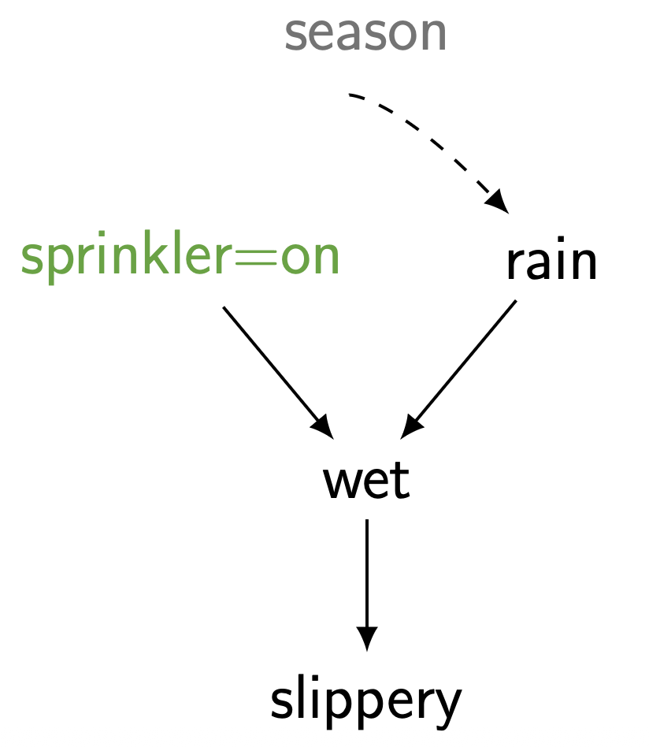

> 본 포스트는 서울대학교 GSDS **Sanghack Lee** 교수님의 *Causal Inference* 강의 자료(3강 *Identification of Causal Effects*)를 바탕으로, 강의를 처음 듣는 독자도 논리적 흐름을 따라갈 수 있도록 재구성한 것입니다. 이론적 원전은 Judea Pearl의 *Causality: Models, Reasoning, and Inference* (2000)이며, 인과 효과와 식별 가능성의 정의(Def. 3.2.1, Def. 3.2.2)는 이 책의 번호 체계를 그대로 따릅니다.

## 한 줄 요약 (TL;DR)

> **"개입 분포 $P(y \mid do(x))$ 는 관측 분포의 분해곱에서 처치의 생성 인자만 도려낸 '절단된 분해'로 주어지며, 모든 관련 변수가 측정된 Markovian 모형에서는 이 효과가 언제나 식별 가능합니다."**
>
> 2강이 SCM과 인과 다이어그램이라는 **언어**를 세웠다면, 3강은 그 언어로 인과 위계의 **2층(개입)** 을 실제로 계산합니다. 출발점은 정의 3.2.1 — 인과 효과란 $X$ 의 구조 방정식을 **삭제하고** $X = x$ 를 **대입한** 하위 모형 $M_x$ 에서의 분포라는 선언입니다.
>
> 이 "모형 수술"의 의미론은 놀랍도록 단순한 산술로 번역됩니다. 하위 모형에서는 $P(x \mid pa_X)$ 라는 인자가 $1$ 이 되므로, 분해곱 $\prod_i P(v_i \mid pa_i)$ 에서 **그 항 하나만 사라집니다.** 이것이 **절단된 분해(truncated factorization)** 이며, 이를 $P(v) / \prod_X P(x \mid pa_X)$ 로 다시 쓰면 개입이 곧 처치 성향에 의한 **재가중(re-weighting)** 임이 드러납니다 — 훗날의 역확률 가중(IPW)이 여기서 싹틉니다.
>
> 마지막으로 강의는 **식별(identification)** 이라는 질문을 던집니다. 관측 가능한 $\langle G, P(v) \rangle$ 만으로 관측 불가능한 $P(y \mid do(x))$ 가 **유일하게** 결정되는가? Markovian 모형에서는 답이 언제나 "예"이며, 실용적으로는 **처치의 직접 부모만 보정**하면 충분합니다. 그리고 마지막 스프링클러 예제는, 계절이 잠재 변수가 되어도 비에 대한 보정만으로 효과가 살아남음을 보이며 다음 주제인 **백도어 기준**을 예고합니다.

---

## 들어가며: 인과 계층의 2번째 층위 (2nd Layer of the Causal Hierarchy)

지난 논의에서 우리는 **구조적 인과 모형(Structural Causal Model, SCM)** 이 단순한 관측 분포 $P(v)$ 이상의 정보를 담고 있음을 보았습니다. 이번 글에서는 인과 계층(Causal Hierarchy)의 **2번째 층위인 인과 효과(Causal Effects)** 를 다룹니다. 이 층위가 던지는 핵심 질문은 다음과 같습니다.

> **"만약 내가 $X = x$ 로 개입(do)한다면 어떤 일이 벌어지는가?"** — *What if I do $X = x$?*

이는 단순히 "$X = x$ 인 사람들을 관찰했을 때 $Y$ 가 어떻더라"는 질문(1번째 층위, 연관)과는 근본적으로 다릅니다. 우리가 시스템에 **능동적으로 손을 대어** 분포 자체를 바꾸었을 때 무슨 일이 일어나는지를 묻는 것이기 때문입니다.

### 서로 다른 세계를 연결하기 (Connecting Different Worlds)

인과 추론의 본질은 **서로 다른 두 세계(world)를 연결하는 것**입니다.

* 우리에게 주어진 것은 결합 분포 $P$ 입니다. 이는 특정 **체제(regime)** 하에서 모집단이 보이는 정적인(static) 모습입니다.
* 어떤 **변화(change)** 가 가해지면 분포는 $P'$ 으로 바뀝니다.
* 우리가 알고 싶은 것은 변화된 세계 $P'$ 의 어떤 측면, 즉 $Q(P')$ 입니다.

대표적인 예시를 들어보겠습니다.

> "흡연을 금지하면 암에 걸리는 사람이 줄어들까?"
>
> $$ Q = P(\text{Cancer}=\text{true} \mid do(\text{Smoking}=\text{no})) $$

여기서 결정적으로 중요한 사실은, 이 $Q$ 가 **관측 분포 $P$ 의 한 측면(aspect)이 아니라는 점**입니다. 우리는 흡연을 "금지한" 세계를 직접 관측한 적이 없으므로, $Q$ 는 $P$ 만으로는 정의되지 않는 새로운 세계 $P'$ 에 속하는 양입니다.

이로부터 두 가지 핵심 관찰(Observation)을 얻습니다.

* **관찰 1 (Observation 1):** 분포 그 자체만으로는 **변화에 대해 아무것도 말해주지 않습니다.** 분포는 단지 (특정 체제 하의) 모집단의 정적인 조건을 묘사할 뿐입니다.
* **관찰 2 (Observation 2):** 따라서 우리는 **"변화"를 표현할 수 있는 도구**, 즉 체제가 바뀔 때 모집단이 어떻게 반응하는지를 기술할 수 있는 수단이 필요합니다. 바로 이 도구가 SCM과 $do(\cdot)$ 연산자입니다.

### 인과 추론의 도전 과제 (The Challenge of Causal Inference)

다음과 같은 인과 그래프를 생각해 봅시다. 변수의 의미는 다음과 같습니다.

* $Z$: 나이, 성별 (age, sex) — 공통 원인(common cause)
* $X$: 행동/처치 (action)
* $W$: 매개 변수 (mediator)
* $Y$: 결과 (outcome)

* **실제 세계(Real world):** 모든 변수가 자연스러운 메커니즘에 따라 생성되며, 결합 분포는 $P(z, x, w, y)$ 입니다.
* **가상 세계(Hypothetical world):** $X$ 를 특정 상수 $x$ 로 **강제 고정**합니다. 이때 $X$ 의 자연적 메커니즘(즉 $Z$ 가 $X$ 에 미치던 영향)은 사라지고, 분포는 $P(z, w, y \mid do(x))$ 가 됩니다.

> **목표:** $Z$ 의 영향으로부터 **자유로운 상태에서** $X$ 를 두 개의 서로 다른 상수($x_0$, $x_1$)로 변화시켰을 때 $Y$ 가 얼마나 변하는지를 알고 싶습니다. 이러한 변화량이 바로 **인과 효과(causal effect)** 입니다.

이로부터 가장 핵심적인 질문이 도출됩니다.

> $P(z, x, w, y)$ 와 $P(y \mid do(x))$ 사이의 관계는 무엇인가? 과연
> $$ P(y \mid do(x)) \stackrel{?}{=} P(y \mid x) $$
> 가 성립하는가?

직관적으로, $Z$ 가 $X$ 와 $Y$ 의 **공통 원인(혼란 변수, confounder)** 이기 때문에 일반적으로 두 양은 **같지 않습니다.** 이 글의 목표는 언제, 그리고 어떻게 $P(y \mid do(x))$ 를 관측 분포 $P(v)$ 만으로 계산할 수 있는지를 규명하는 것입니다.

---

## 1. 구조적 인과 모형과 인과 효과의 정의 (Structural Causal Model)

앞 절의 질문에 답하려면 "개입"이라는 말을 **수학적 대상**으로 바꿔 놓아야 합니다. 그 도구가 2강에서 세운 구조적 인과 모형입니다. 이번 절에서는 이후 논의에서 계속 사용할 형태로 SCM을 다시 정리하고, 그 위에서 인과 효과를 엄밀하게 정의합니다.

### 1.1. 인과성을 형식화한다는 것 (Formalizing Causality)

우리가 마주한 상황은 근본적으로 다음과 같습니다. 세계는 우리가 들여다볼 수 없는 **블랙박스 시스템(black box system)** 이고, 우리는 오직 그 박스가 내놓는 출력만을 볼 수 있습니다. 그런데 박스에 접근하는 방식은 하나가 아닙니다.

![Figure: 인과성 형식화의 출발점 — 하나의 미지의 시스템에 접근하는 여러 갈래의 방식. 중앙 상단의 회색 박스 '블랙박스 시스템(Black Box System)'은 데이터를 만들어 내는 실제 메커니즘이며 'unknown'이라는 회색 라벨이 붙어 있습니다. 여기서 뻗어 나가는 네 개의 화살표는 각기 다른 접근 방식(체제, regime)을 나타냅니다. 왼쪽 '관측(observation)' 화살표는 시스템에 손대지 않고 지켜보는 방식으로 '관측 연구(observational study)'라는 결과를 내고, 가운데 '임상시험(clinical trials)' 화살표는 처치를 무작위로 배정하는 개입으로 '약효(drug efficacy)'라는 결과를 냅니다. 오른쪽 '(가상의) 공공정책((hypothetical) public policy)' 화살표가 가리키는 상자는 라벨 없이 회색으로만 남아 있는데, 이는 한 번도 시행해 본 적이 없어 결과를 아직 알 수 없는 체제임을 뜻합니다. 이 그림의 핵심 메시지는, 서로 다른 화살표가 서로 다른 세계를 만들어 내므로 한 화살표에서 얻은 답을 다른 화살표의 답으로 그대로 옮길 수 없다는 것이며, 바로 그 옮김을 가능하게 하는 규칙을 세우는 일이 인과 추론입니다.](./images/figure01_formalizing_causality_black_box.png)

* **관측(observation):** 시스템에 손대지 않고 자연스럽게 흘러가는 모습을 기록합니다. 여기서 얻는 것이 **관측 연구(observational study)** 이며, 우리가 흔히 가진 데이터의 대부분이 이것입니다.
* **개입(intervention):** 시스템의 일부를 **우리가 정한 값으로 강제**한 뒤 결과를 봅니다. **임상시험(clinical trials)** 이 대표적이며, 여기서 비로소 **약효(drug efficacy)** 같은 인과적 양이 직접 드러납니다.
* **가상의 체제(hypothetical regime):** 아직 시행해 본 적 없는 **공공정책**처럼, 결과를 알 수 없는 세계도 있습니다. 그림에서 이 상자가 라벨 없이 비어 있는 이유입니다.

여기서 인과 추론의 실질적 과제가 정해집니다. **우리는 첫 번째 화살표(관측)만 가지고 있는데, 알고 싶은 것은 두 번째·세 번째 화살표(개입·가상 정책)의 답**입니다. 이 옮김이 언제 가능한지를 규칙으로 만들려면, 세 화살표를 **하나의 대상 위에서** 동시에 표현할 수 있는 언어가 필요합니다.

### 1.2. SCM: 하나의 모형이 모든 세계를 유도한다 (Causal Framework)

그 언어가 **구조적 인과 모형(Structural Causal Model, SCM; Pearl, 2000)** 입니다. SCM의 위력은 정의 자체보다 그것이 **무엇을 유도하는가**에 있습니다.

![Figure: 하나의 SCM이 유도하는 대상들의 지도. 중앙의 회색 박스 'SCM $\mathcal{M}$' 은 데이터를 생성한 진짜 메커니즘이지만 상단에 'unknown' 이라 적혀 있듯 우리에게 관측되지 않습니다. 왼쪽으로 뻗은 'induces' 화살표는 이 모형이 **인과 다이어그램 $\mathcal{G}$** 를 유도함을 보여 주며, 그 그래프는 초록색 노드 세 개를 검은 실선 유향 엣지로 잇고 보라색 점선 양방향 엣지를 얹은 모습으로 그려져 있습니다(실선은 관측된 인과 관계, 보라색 점선은 미관측 혼란 변수에 의한 연관). 아래로 뻗은 네 개의 화살표는 각각 $do(\emptyset)$, $do(x_1)$, $do(x_2)$, $do(x_2, x_4)$ 라는 서로 다른 개입에 대응하며, 그 결과로 분포 $P$, $P_{x_1}$, $P_{x_2}$, $P_{x_2,x_4}$ 를 하나씩 만들어 냅니다. 특히 $do(\emptyset)$ — 아무 데도 손대지 않는 '빈 개입' — 이 만들어 내는 것이 바로 우리가 가진 관측 분포 $P$ 라는 점이 중요합니다. 일부 분포에 SCM 박스와 같은 회색 음영이 칠해져 있는 것은 그것들이 우리 손에 직접 들어오지 않는 대상임을 표시한 것입니다. 이 그림의 메시지는, 앞 그림의 여러 화살표가 사실은 **하나의 SCM**에서 갈라져 나온 것이므로 그 SCM을 매개로 서로를 연결할 수 있다는 것입니다.](./images/figure02_scm_induces_distributions_and_graph.png)

* SCM $\mathcal{M}$ 자체는 **끝내 알 수 없습니다.** 우리가 얻는 것은 그것이 유도한 흔적뿐입니다.
* 그러나 $\mathcal{M}$ 은 **인과 다이어그램 $\mathcal{G}$** 를 유도하고, 이 그래프는 전문가 지식으로 그려 볼 수 있습니다.
* 또한 $\mathcal{M}$ 은 **개입 하나마다 분포 하나**를 유도합니다. 아무것도 하지 않는 개입 $do(\emptyset)$ 이 만드는 것이 관측 분포 $P$ 이고, $do(x_1)$ 이 만드는 것이 $P_{x_1}$ 입니다.

즉 관측 분포와 모든 실험 분포는 **같은 부모($\mathcal{M}$)에서 나온 형제**입니다. 이것이 관측만으로 개입을 말할 수 있는 여지를 남깁니다.

### 1.3. SCM의 형식적 정의 (Definition)

SCM은 네 개의 구성 요소로 이루어진 튜플입니다. 기호로는 다음과 같이 쓰며, 각 자리가 무엇을 담당하는지를 함께 보면 구조가 한눈에 들어옵니다.

$$ \Big\langle \underbrace{U}_{\text{관측되지 않음}},\; \underbrace{V}_{\text{관측됨}},\; \underbrace{F}_{V \text{를 만드는 메커니즘}},\; P(U) \Big\rangle $$

::: {.callout-note}
## 정의 (Structural Causal Model, Pearl 2000)

SCM $M$ 은 4-튜플 $\langle V, U, F, P(U) \rangle$ 입니다.

* $V = \{V_1, \ldots, V_n\}$ 은 **내생 변수(endogenous variables)** — 모형이 설명하고자 하는, 그리고 우리가 **측정하는** 변수들입니다.
* $U$ 는 **외생 변수(exogenous variables)** 의 집합 — 모형 바깥에서 주어지며 **관측되지 않는** 변수들입니다.
* $V$ 의 값은 함수들의 모음 $F = \{f_1, \ldots, f_n\}$ 에 의해 결정됩니다.

$$ v_i \leftarrow f_i(pa_i, u_i), \qquad \text{여기서 } Pa_i \subseteq V \setminus \{V_i\},\quad U_i \subseteq U $$

* $P(U)$ 는 외생 변수들 위에 놓인 확률 분포입니다.
:::

기호가 낯설다면 다음의 평이한 진술로 바꿔 읽어도 무방합니다. **측정되는 변수 $V$ 가 있고, 알 수 없는 변수 $U$ 가 있으며, 각각의 측정 변수는 "아는 것 몇 개와 모르는 것 몇 개"의 함수로 결정된다** — $v \leftarrow f(\text{some known}, \text{some unknown})$.

::: {.callout-tip}
## $U$ 를 읽는 법

$U$ 는 **각 개체(unit)가 실제로 어떤 존재인가**를 담는 자리로 볼 수 있습니다. 한 사람의 유전적 소인, 성장 환경, 그날의 컨디션처럼 우리가 결코 다 적어 낼 수 없는 모든 것이 여기 들어갑니다.

중요한 것은 **$U$ 가 정해지면 $V$ 는 전부 결정된다**는 점입니다. 화살표가 $=$ 가 아니라 $\leftarrow$ 인 이유도 여기 있습니다. 이 식은 "좌변과 우변이 같다"는 대칭적 등식이 아니라 "우변이 좌변을 **만든다**"는 비대칭적 배정이며, 이 비대칭성이야말로 인과의 방향을 담고 있습니다. 무작위성은 함수 $f_i$ 가 아니라 오직 $P(U)$ 에서만 나옵니다.
:::

### 1.4. 모형이 분포를 유도한다 (Model $\Rightarrow$ Distributions)

SCM이 관측 분포 $P(v)$ 를 어떻게 만들어 내는지를 단계적으로 확인해 보겠습니다. 이것이 **1층(연관)** 에 해당하는 유도입니다.

$$
\begin{aligned}
P(v)
&= \sum_u P(v, u) && \text{(외생 변수를 주변화)} \\[2mm]
&= \sum_u P(u) \prod_{V_i \in V} P(v_i \mid v_1, \ldots, v_{i-1}, u) && \text{(연쇄 법칙, 위상 정렬 순서)} \\[2mm]
&= \sum_u P(u) \prod_{V_i \in V} P(v_i \mid pa_i, u_i) && (v_i \leftarrow f_i(pa_i, u_i))
\end{aligned}
$$

각 등호를 짚어 보겠습니다.

* **첫 번째 등호**는 결합 분포 $P(v, u)$ 에서 관심 없는 $U$ 를 더해 없애는 평범한 주변화입니다.
* **두 번째 등호**는 $P(v, u) = P(u) P(v \mid u)$ 로 분리한 뒤, $P(v \mid u)$ 에 변수들을 위상 정렬 순서로 놓고 연쇄 법칙을 적용한 것입니다. 이 단계까지는 어떤 인과적 가정도 쓰지 않았습니다.
* **세 번째 등호**가 SCM의 구조를 처음 사용합니다. $v_i$ 는 오직 $(pa_i, u_i)$ 만으로 **결정**되므로, 앞선 변수들 $v_1, \ldots, v_{i-1}$ 과 나머지 외생 변수들은 조건에서 모두 떨어져 나갑니다. 사실 이 항은 $f_i(pa_i, u_i) = v_i$ 이면 $1$, 아니면 $0$ 인 퇴화 분포입니다.

여기에 **외생 변수들이 서로 독립**이라는 가정, 즉 $P(u) = \prod_i P(u_i)$ 를 추가하면 — 이것이 2강에서 정의한 **Markovian 모형**입니다 — 합과 곱의 순서를 바꿀 수 있어 익숙한 형태가 나옵니다.

$$ P(v) = \prod_{V_i \in V} P(v_i \mid pa_i) $$

이 **마르코프 인수분해(Markov factorization)** 가 이후 모든 계산의 출발점이 됩니다. 그리고 결정적으로, 같은 SCM이 1층뿐 아니라 **2층(개입, interventional)** 과 **3층(반사실, counterfactual)** 분포까지 함께 유도합니다. 이번 강의가 다루는 것이 그중 2층입니다.

### 1.5. 모형이 인과 다이어그램을 유도한다 (Model $\Rightarrow$ Causal Diagram)

SCM이 유도하는 또 하나의 대상이 그래프입니다. 핵심은 **함수의 시그니처(signature of function)** — 즉 "무엇이 무엇의 인자로 들어가는가" — 만 보면 그래프가 결정된다는 점입니다.

![Figure: 구조 방정식에서 인과 다이어그램을 읽어 내는 절차. 위쪽에 두 개의 구조 방정식 $V_i \leftarrow f_i(\{A, B\}, U)$ 와 $V_j \leftarrow f_j(C, U)$ 가 있고, 아래쪽에 그로부터 유도된 그래프가 그려져 있습니다. 각 변수 $A$, $B$, $C$, $V_i$, $V_j$ 가 원으로 표시된 노드가 되고, $A$ 와 $B$ 는 $V_i$ 의 함수 인자이므로 $A \to V_i$, $B \to V_i$ 라는 검은 실선 유향 엣지를 받으며, $C$ 는 $V_j$ 의 인자이므로 $C \to V_j$ 엣지를 받습니다. $V_i$ 와 $V_j$ 사이의 **빨간 점선 양방향 화살표**는 유향 엣지와 성격이 전혀 다른데, 두 방정식이 공유하는 외생 변수 $U_i$ 와 $U_j$ 가 서로 상관되어 있음을 나타내는 **미관측 혼란 변수(unobserved confounder)** 의 표시입니다. 이 그림이 보여 주는 요점은, 함수의 구체적 형태를 전혀 몰라도 '어떤 변수가 인자로 등장하는가'라는 정보만으로 그래프가 유일하게 결정된다는 것입니다.](./images/figure03_model_to_causal_diagram.png)

인과 다이어그램은 **유향 비순환 그래프(Directed Acyclic Graph, DAG)** 로 표현되며, 세 가지 규칙으로 그려집니다.

1. **(노드)** 각 내생 변수 $V_i \in V$ 가 하나의 노드가 됩니다.
2. **(유향 엣지: 인과 관계)** $B$ 가 $V_i$ 의 함수 $f_i$ 의 **인자로 등장하면** $B \to V_i$ 엣지를 그립니다. 즉 유향 엣지는 "직접적인 인과 관계"를 뜻합니다.
3. **(양방향 엣지: 미관측 혼란)** $U_i$ 와 $U_j$ 가 **상관되어 있으면** $V_i \leftrightarrow V_j$ 라는 양방향 엣지를 그립니다. 이것은 인과 관계가 아니라, 우리가 측정하지 못한 공통 원인이 존재한다는 뜻입니다.

세 번째 규칙이 특히 중요합니다. 양방향 엣지가 하나도 없는 모형이 곧 **Markovian 모형**이고, 양방향 엣지가 있는 모형은 **Semi-Markovian 모형**이라 부릅니다. 이번 강의의 후반부에서 "식별이 어려워지는" 상황은 정확히 이 양방향 엣지가 등장할 때입니다.

### 1.6. 개입과 $do(\cdot)$ 연산자 (Intervention — $do(\cdot)$ operator)

이제 "개입"을 형식적으로 정의할 수 있습니다. 모형 $M$ 이 주어졌을 때, 변수 $X \in V$ 를 상수 $x$ 로 **고정**하는 것을 $do(X = x)$ 로 표기합니다. 그리고 이 연산자가 실제로 하는 일은 모형 자체를 바꾸는 것입니다.

* $do(\cdot)$ 는 모형 $M$ 을 **하위 모형(submodel) $M_x$** 로 변환합니다.
* $M_x$ 란 $M$ 에서 $X$ 의 구조 방정식 $f_x \in F$ 를 **상수 $x$ 로 갈아치운** 모형입니다. 나머지 방정식은 하나도 건드리지 않습니다.

이 조작이 그래프에서는 무엇으로 나타나는지가 결정적입니다.

![Figure: 개입이 그래프에 가하는 '수술(graph surgery)'. 왼쪽은 개입 이전의 인과 그래프 $\mathcal{G}$ 로, 세 노드 $Z$, $X$, $Y$ 사이에 검은 실선 유향 엣지 $Z \to X$, $Z \to Y$, $X \to Y$ 가 있고 여기에 더해 $Z$ 와 $X$ 를 잇는 **검은 점선 양방향 엣지**가 있어 두 변수에 미관측 공통 원인이 있음을 나타냅니다. 가운데 $do(X = x)$ 화살표를 지나면 오른쪽의 개입 후 그래프 $\mathcal{G}_{\overline{X}}$ 가 되는데, $X$ 는 보라색 상수 $X = x$ 로 표기가 바뀌고 $X$ 로 **들어오던** 엣지 — 유향 엣지 $Z \to X$ 와 점선 양방향 엣지 — 가 모두 잘려 나갔습니다. 반면 $X$ 에서 **나가는** 엣지 $X \to Y$ 와 $X$ 와 무관한 엣지 $Z \to Y$ 는 그대로 남아 있습니다. 그래프 이름에 붙은 윗줄 표기 $\overline{X}$ 가 바로 '$X$ 로 들어오는 엣지를 제거했다'는 뜻이며, 이 그림은 개입이 처치의 **원인**과의 연결만 끊고 **결과**로 향하는 영향력은 온전히 보존한다는 점을 보여 줍니다.](./images/figure04_do_operator_graph_surgery.png)

* $X$ 의 방정식이 상수로 바뀌었으므로, $X$ 의 부모들은 더 이상 $X$ 에 아무런 영향을 주지 못합니다. 따라서 $X$ 로 **들어오는 엣지가 모두 제거**됩니다. 미관측 혼란을 나타내던 점선 양방향 엣지도 함께 사라집니다.
* 반대로 $X$ 에서 **나가는 엣지는 하나도 건드리지 않습니다.** 우리가 알고 싶은 것이 바로 그 영향력이기 때문입니다.
* 이렇게 만들어진 그래프를 $\mathcal{G}_{\overline{X}}$ 로 표기합니다. 윗줄($\overline{\;\cdot\;}$)은 "이 변수로 들어오는 엣지를 잘랐다"는 관례적 표기입니다.

이 "들어오는 것만 자르고 나가는 것은 남긴다"는 비대칭이 관측 조건화와 개입을 가르는 지점입니다. $P(y \mid x)$ 는 $X$ 로 들어오던 경로를 그대로 둔 채 부분 모집단만 들여다보므로, $Z$ 를 통해 들어온 정보가 그대로 섞여 있습니다.

### 1.7. 인과 효과의 형식적 정의 (Causal Effect, formal)

위의 직관을 엄밀하게 정의해 보겠습니다.

::: {.callout-note}
## 정의 3.2.1 (Causal Effect)

서로소(disjoint)인 두 변수 집합 $X$ 와 $Y$ 가 주어졌을 때, **$X$ 가 $Y$ 에 미치는 인과 효과** $P(y \mid do(x))$ 는 **$X$ 에서 $Y$ 의 확률 분포 공간으로 가는 함수(function)** 입니다.

$X$ 의 각 실현값(realization) $x$ 에 대해, $P(y \mid do(x))$ 는 다음 절차로 유도되는 $Y = y$ 의 확률을 줍니다.

1. 모형에서 $X$ 에 해당하는 모든 구조 방정식(equation)을 **삭제(delete)** 한다.
2. 남은 방정식들에 $X = x$ 를 **대입(substitute)** 한다.

이를 기호로 다음과 같이 씁니다.
$$ P(y \mid do(x)) = P_x(y) $$
즉, **하위 모형(submodel) $M_x$** 에서의 $Y = y$ 의 확률입니다.
:::

핵심은 "**방정식을 삭제하고 값을 대입한다**"는 것입니다. 관측 조건화 $P(y \mid x)$ 는 단지 $X = x$ 인 부분 모집단을 들여다볼 뿐이지만, $do(x)$ 는 $X$ 를 생성하던 메커니즘 자체를 외과적으로 제거(graph surgery)합니다. 바로 이 차이가 두 양을 다르게 만듭니다.

---

## 2. SCM이 유도하는 L2-분포 (SCM induces L2-distribution)

### 2.1. 관측 데이터로부터 인과 효과 계산하기

앞서 본 그래프($Z \to X$, $Z \to Y$, $X \to W$, $W \to Y$)를 다시 가져옵니다. **Markovian 모형**(모든 관련 변수가 측정됨)에서 관측 분포는 각 변수를 자신의 부모 $pa_i$ 로 조건화한 곱으로 분해(factorization)됩니다.

$$ P(v) = \underbrace{P(z)}_{} \times \underbrace{P(x \mid z)}_{} \times \underbrace{P(w \mid x)}_{} \times \underbrace{P(y \mid w, z)}_{} $$

이제 $do(x)$ 를 적용하면 어떻게 될까요? 정의에 따라 $X$ 의 방정식을 삭제합니다. 분해식 관점에서 이는 **$X$ 에 해당하는 인자 $P(x \mid z)$ 를 제거**하는 것과 같습니다. 하위 모형 $M_x$ 에서는 $X$ 가 상수로 고정되므로 그 항이 $1$ 로 취급되기 때문입니다.

$$ P_x(v \setminus \{X\}) = P(z) \times \underbrace{P(x \mid z)}_{\text{Mx 에서 1}} \times P(w \mid x) \times P(y \mid w, z) = P(z)\,P(w \mid x)\,P(y \mid w, z) $$

이것이 다음 절에서 일반화할 **절단된 분해(truncated factorization)** 의 직관적 원형입니다. 관측 분포에서 처치 변수의 생성 메커니즘에 해당하는 인자만 도려내면 개입 분포가 된다는 것입니다.

### 2.2. 스프링클러 예제 (Sprinkler Example)

이론을 구체적인 예로 확인해 봅시다. 다섯 개의 변수 — **계절(Season, $Sn$)**, **스프링클러(Sprinkler, $Sp$)**, **비(Rain, $Rn$)**, **젖음(Wet, $Wt$)**, **미끄러움(Slippery, $Sl$)** — 에 대한 인과 그래프를 생각합니다.

이 그래프에 대응하는 관측 분포의 분해식은 다음과 같습니다.

$$ P(v) = P(Sn)\,P(Sp \mid Sn)\,P(Rn \mid Sn)\,P(Wt \mid Sp, Rn)\,P(Sl \mid Wt) $$

이제 두 개의 질의(query)를 비교합니다.

* **질의 1 (관측 조건화):** $Q_1 = P(Wt \mid Sp = on)$
* **질의 2 (개입):** $Q_2 = P(Wt \mid do(Sp = on))$

#### 질의 1: $Q_1 = P(Wt \mid Sp = on)$

이는 평범한 조건부 확률이므로 베이즈 정리로 전개합니다. 분자는 $P(Wt, Sp=on)$ 을 $Sn, Rn$ 에 대해 주변화(marginalize)한 것이고, 분모는 $P(Sp=on)$ 입니다.

$$ Q_1 = \frac{\sum_{sn, rn} P(sn)\,P(Sp = on \mid sn)\,P(rn \mid sn)\,P(wt \mid Sp = on, rn)}{\sum_{sn} P(Sp = on \mid sn)\,P(sn)} $$

여기서 분자·분모에 모두 **$P(Sp = on \mid sn)$ 항이 살아 있다**는 점에 주목하십시오. 스프링클러가 계절에 의존하기 때문에, 이 조건화는 $Sp \leftarrow Sn \to Rn \to Wt$ 라는 **백도어 경로(backdoor path)** 를 통한 가짜 정보까지 함께 끌어들입니다.

#### 질의 2: $Q_2 = P(Wt \mid do(Sp = on))$

개입을 하면 $Sn \to Sp$ 엣지가 잘려 나가므로, 위 식에서 $P(Sp = on \mid sn)$ 이 더 이상 계절에 의존하지 않게 됩니다. 슬라이드는 이를 $P(Sp = on \mid sn) \to P(Sp = on)$ 으로 치환하여 표기합니다($Sp$ 가 상수이므로 이 항은 사실상 분자·분모에서 상쇄되는 상수입니다).

$$ Q_2 = \frac{\sum_{sn, rn} P(sn)\,P(Sp = on)\,P(rn \mid sn)\,P(wt \mid Sp = on, rn)}{\sum_{sn} P(Sp = on)\,P(sn)} $$

상수 $P(Sp = on)$ 을 분자·분모에서 약분하고, 분모의 $\sum_{sn} P(sn) = 1$ 을 적용하면 다음의 깔끔한 형태를 얻습니다.

$$ \boxed{\; Q_2 = \sum_{sn, rn} P(sn)\,P(rn \mid sn)\,P(wt \mid Sp = on, rn) \;} $$

두 결과를 비교하면, $Q_2$ 에는 $Q_1$ 에 있던 **$P(Sp = on \mid sn)$ 가중치가 사라졌습니다.** 즉 개입은 스프링클러와 계절 사이의 의존성을 끊어, 계절을 매개로 한 가짜 상관을 제거합니다. 이것이 $P(y \mid do(x)) \ne P(y \mid x)$ 인 이유의 구체적 증거입니다.

---

## 3. 절단된 분해 곱 (Truncated Factorization Product)

### 3.1. 절단된 분해의 정의

스프링클러 예제에서 얻은 직관을 일반 정리로 승격합니다.

::: {.callout-important}
## 절단된 분해 (Truncated Factorization)

Markovian 모형 $M$ 에서 개입 $do(X = x)$ 가 생성하는 분포는 다음의 **절단된 분해**로 주어집니다.

$$ P(v \setminus x \mid do(x)) = \prod_{V_i \in V \setminus X} P(v_i \mid pa_i) $$

이는 **Manipulation Theorem**, **G-Computation** 등으로도 불립니다.
:::

핵심은 일반 분해 $P(v) = \prod_{V_i \in V} P(v_i \mid pa_i)$ 에서 **처치 변수 $X$ 에 해당하는 인자들을 통째로 잘라낸다(truncate)** 는 점입니다. 이름이 "절단된" 분해인 이유가 여기에 있습니다.

값의 정합성(consistency)까지 고려하면 다음과 같이 더 엄밀하게 표현할 수 있습니다. 개입으로 고정한 $X = x$ 와 모순되지 않는 $v$ 에 대해서만 확률이 양수이고, 그렇지 않으면 $0$ 입니다.

$$
P(v \mid do(x)) =
\begin{cases}
\displaystyle\prod_{V_i \in V \setminus X} P(v_i \mid pa_i) & \text{if } v \text{ and } x \text{ are consistent} \\[2mm]
0 & \text{otherwise}
\end{cases}
$$

### 3.2. 절단된 분해 공식의 유도 (Truncated Factorization Formula)

이제 절단된 곱을 **관측 분포 $P(v)$ 에 대한 비율**로 다시 쓰는 유도를 단계적으로 따라가 보겠습니다. 기호를 다음과 같이 정의합니다.

* $V' = V \setminus X$ (처치를 제외한 변수들)
* $V'' = V \setminus Pa_X \setminus \{X\}$ (처치와 그 부모를 제외한 변수들)

**1단계 — 출발점.** 절단된 곱은 다음과 같습니다.

$$ P(v' \mid do(x)) = \prod_{V_i \in V \setminus X} P(v_i \mid pa_i) $$

**2단계 — 관측 분포로 다시 쓰기.** 전체 분해 $P(v) = \prod_{V_i \in V \setminus X} P(v_i \mid pa_i) \cdot \prod_{X \in X} P(x \mid pa_X)$ 에서, 처치에 해당하는 인자 곱으로 양변을 나누면 절단된 곱만 남습니다.

$$ P(v' \mid do(x)) = \frac{P(v)}{\prod_{X \in X} P(x \mid pa_X)} $$

이 형태는 **개입 분포가 곧 관측 분포의 재가중(re-weighting)** 임을 보여줍니다. 분모 $\prod_X P(x \mid pa_X)$ 는 자연 상태에서 그 처치 값이 나타날 "성향(propensity)"이며, 이것으로 나누어 주는 과정이 바로 가중치 보정입니다(역확률 가중, inverse-probability weighting의 모태).

**3단계 — 단일 처치(singleton)인 경우.** $X = \{X\}$ 가 단일 변수일 때는 더 의미 있는 형태로 정리됩니다.

$$
\begin{aligned}
P(v' \mid do(x))
&= \frac{P(v)}{P(x \mid pa_X)} \\[2mm]
&= \frac{P(v)\,P(pa_X)}{P(x, pa_X)} \qquad\left(\because P(x \mid pa_X) = \frac{P(x, pa_X)}{P(pa_X)}\right) \\[2mm]
&= P(v'' \mid x, pa_X)\,P(pa_X)
\end{aligned}
$$

마지막 등식을 검증해 보겠습니다. $V = V'' \cup \{X\} \cup Pa_X$ 이므로 $P(v) = P(v'', x, pa_X)$ 입니다. 따라서

$$ \frac{P(v)\,P(pa_X)}{P(x, pa_X)} = \frac{P(v'', x, pa_X)}{P(x, pa_X)}\,P(pa_X) = P(v'' \mid x, pa_X)\,P(pa_X). $$

> **요약:** 관측 분포와 개입 분포 사이의 변환은 **재가중(re-weighting) 과정**으로 볼 수 있습니다. 자연 상태의 처치 성향 $P(x \mid pa_X)$ 으로 나눔으로써 "강제 개입"의 효과를 복원하는 것입니다.

---

## 4. 식별 문제 (The Identification Problem)

### 4.1. 식별 가능성의 정의

지금까지의 논의는 "모든 변수가 측정된" 이상적인 상황을 가정했습니다. 그러나 현실에서는 일부 변수가 **잠재(latent)** 일 수 있습니다. 그렇다면 근본적인 질문이 생깁니다. **관측 분포 $P(v)$ 와 그래프 $G$ 만으로 인과 효과 $P(y \mid do(x))$ 를 유일하게 결정할 수 있는가?** 이것이 **식별(identification) 문제**입니다.

::: {.callout-note}
## 정의 3.2.2 (Causal Effect Identifiability, Pearl 2000)

$X$ 가 $Y$ 에 미치는 인과 효과가 인과 다이어그램 $G$ 로부터 **식별 가능(identifiable)** 하다는 것은, $P(y \mid do(x))$ 가 관측 변수의 (양의 확률을 갖는) 분포로부터 **유일하게(uniquely) 계산될 수 있음**을 뜻합니다.

즉, $G$ 를 유도하는 임의의 두 모형 $M_1$, $M_2$ 에 대해
$$ P^{M_1}(v) = P^{M_2}(v) > 0 \;\Longrightarrow\; P^{M_1}(y \mid do(x)) = P^{M_2}(y \mid do(x)) $$
가 항상 성립하는 것을 말합니다.
:::

### 4.2. 식별 문제의 구조

식별 문제의 전체 구도를 그림으로 정리하면 다음과 같습니다.

* **SCM $M$ (진리, 관측 불가):** 데이터를 생성한 실제 메커니즘. 우리는 결코 직접 알 수 없습니다.
* **관측 분포 $P(v)$ (진리, 관측 가능):** 데이터로부터 추정할 수 있습니다.
* **인과 그래프 $G$ (진리, 관측 가능):** 전문가 지식이나 가정으로 주어집니다.
* **실험 분포 $P(v' \mid do(x))$ (목표, 관측 불가):** 우리가 알고 싶은 것.

### 4.3. 식별 가능성의 의미: 두 모형의 합의

식별 가능성의 본질은 **"같은 관측 증거를 내는 모든 모형이 같은 인과 결론에 도달하는가"** 입니다. 임의의 두 SCM $M_1$, $M_2$ 를 생각합시다.

> **식별 가능성의 직관:** $M_1$, $M_2$ 의 구체적 형태가 무엇이든, $\langle G, P(v) \rangle$ 에 부합하는 **모든 모형이 $P(y \mid do(x))$ 에 대해서도 일치한다**면, 그 인과 효과는 식별 가능합니다. 반대로 같은 $\langle G, P(v) \rangle$ 를 내면서도 인과 효과는 서로 다른 두 모형이 존재한다면, 식별 **불가능**합니다.

### 4.4. 식별 가능성의 집합론적 해석 (Venn Diagram)

이 개념은 모형들의 집합에 대한 벤 다이어그램으로 우아하게 시각화됩니다.

* **위쪽 원 (inducing $P(\mathbf{V})$):** 관측 분포 $P(\mathbf{V})$ 를 똑같이 재현하는 모든 모형.
* **아래쪽 원 (inducing $G$):** 그래프 $G$ 를 똑같이 유도하는 모든 모형.
* **교집합:** 두 조건을 모두 만족하는 모형들. 우리가 가진 증거로는 이들을 구별할 수 없습니다.
* **식별 가능 (초록):** 교집합 내 모든 모형이 같은 $P(y \mid do(x))$ 값을 가짐.
* **식별 불가능 (빨강/초록 혼합):** 교집합 내에서 $P(y \mid do(x))$ 값이 갈림 → 데이터와 그래프만으로는 답을 정할 수 없음.

---

## 5. Markovian 모형에서의 식별 (Identification in Markovian Models)

### 5.1. 전역 식별 정리

다행히 **Markovian 모형**(모든 관련 변수가 측정됨, 즉 잠재 혼란 변수가 없음)에서는 식별이 항상 보장됩니다.

::: {.callout-important}
## 정리 (Identification in Markovian Models)

임의의 Markovian 모형의 인과 다이어그램 $G$ 가 주어지면, 모든 변수 부분집합 $X$, $Y$ 에 대해 인과 효과 $Q = P(y \mid do(x))$ 는 **항상 식별 가능**하며, 절단된 분해로부터 얻어집니다.

$$ P(v' \mid do(x)) = \prod_{V_i \in V \setminus X} P(v_i \mid pa_i) $$

따라서 $Y$ 이외의 변수들을 주변화하면,

$$ P(y \mid do(x)) = \sum_{v' \setminus y} \;\prod_{V_i \in V \setminus X} P(v_i \mid pa_i). $$
:::

즉 모든 변수가 측정되기만 하면, 인과 효과는 관측 가능한 조건부 확률들의 곱과 합으로 언제나 표현됩니다.

### 5.2. 직접 부모에 의한 보정 — 단일 처치 (Adjustment by Direct Parents, Singleton)

전체 분해식이 아니라, **처치의 직접 부모(direct parents)** 만 알아도 효과를 식별할 수 있는 더 실용적인 결과가 있습니다.

::: {.callout-note}
## 정리 (Adjustment by Direct Parents, Singleton)

Markovian 모형의 인과 다이어그램 $G$ 에서 변수 부분집합 $V$ 가 측정되었을 때, $X, Y, Pa_X \subseteq V$ 이면 — 즉 **$X$, $Y$, 그리고 $X$ 의 모든 부모가 측정**되었다면 — 인과 효과 $Q = P(y \mid do(x))$ 는 식별 가능하며, **$Pa_X$ 에 대한 보정(adjustment)** 으로 주어집니다.

$$ P(y \mid do(x)) = \sum_{pa_X} P(y \mid x, pa_X)\,P(pa_X). $$
:::

이것이 바로 그 유명한 **부모 보정 공식(parent adjustment formula)** 입니다. $X$ 의 부모를 모두 조건화하면 $X$ 로 들어오는 모든 백도어 경로가 차단되기 때문에, 단순 조건화 $P(y \mid x)$ 에 $P(pa_X)$ 라는 가중치를 곱해 합산하는 것만으로 인과 효과가 복원됩니다. 3.2절의 단일 처치 결과 $P(v' \mid do(x)) = P(v'' \mid x, pa_X)P(pa_X)$ 에서 $Y$ 외 변수를 주변화하면 곧바로 이 공식이 나옵니다.

### 5.3. (심화) 처치 집합으로의 일반화 (Adjustment by Direct Parents, set of treatments)

위 단일 처치 결과를 **여러 개의 처치 집합 $X$** 로 확장합니다. 단일 처치와 달리, 이제 $Pa_X = \bigcup_{X \in X} Pa$ 가 처치 집합 $X$ 자신과 교집합을 가질 수 있다는 점이 까다롭습니다. 다음 기호를 도입합니다.

* $Pa^-_W = Pa_W \setminus W$ (자기 자신을 제외한 부모)
* $X = \{X_1, X_2, \ldots, X_k\}$ 를 위상 정렬(topological order)된 순서로 둠
* $X_{\prec j} = \{X_1, \ldots, X_{j-1}\}$, $\quad X_{\preceq j} = \{X_1, \ldots, X_j\}$
* $Pa'_{X_j} \triangleq Pa_{X_j} \setminus (X_{\prec j} \cup Pa^-_{X_{\prec j}})$ (앞선 처치/그 부모와 겹치지 않는 "순수한" 부모)

::: {.callout-note}
## 정리 (Set Version)

모든 $i < j$ 에 대해 $Pa'_{X_j}$ 가 $X_i$ 의 자손(descendant)이 아니라면,

$$ \prod_{X \in X} P(x \mid pa_X) = P(x \mid pa^-_X). $$

따라서

$$ P(y \mid do(x)) = \sum_{pa^-_X} P(y \mid x, pa^-_X)\,P(pa^-_X). $$
:::

#### 귀납법에 의한 증명 (Proof by Induction)

다음 명제를 모든 $i$ 에 대해 증명합니다.

$$ \prod_{X \in X_{\preceq i}} P(x \mid pa_X) = P(x_{\preceq i} \mid pa^-_{X_{\preceq i}}). $$

**(기저 단계, Base case)** $i = 1$ 일 때, $X_1$ 의 부모에서 자기 자신은 제외되므로 $Pa_{X_1} = Pa^-_{X_1}$ 이고,

$$ P(x_1 \mid pa_{X_1}) = P(x_1 \mid pa_{X_1} \setminus \{X_1\}) = P(x_1 \mid pa^-_{X_1}) = P(x_{\preceq 1} \mid pa^-_{X_{\preceq 1}}). $$

**(귀납 가정, Hypothesis)** $i-1$ 까지 성립한다고 가정하고, 다음 등식을 보이면 충분합니다.

$$ P(x_{\prec i} \mid pa^-_{X_{\prec i}})\,P(x_i \mid pa_{X_i}) = P(x_{\preceq i} \mid pa^-_{X_{\preceq i}}). $$

**(증명)** $Pa'_{X_i} = Pa_{X_i} \setminus (X_{\prec i} \cup Pa^-_{X_{\prec i}})$ 로 두면, $X_i$ 의 부모는 세 부분 $\{Pa'_{X_i},\, X_{\prec i},\, Pa^-_{X_{\prec i}}\}$ 으로 분해됩니다.

$$
\begin{aligned}
&P(x_{\prec i} \mid pa^-_{X_{\prec i}})\,P(x_i \mid pa_{X_i}) \\[2mm]
&= P(x_{\prec i} \mid pa^-_{X_{\prec i}})\,P(x_i \mid pa'_{X_i}, x_{\prec i}, pa^-_{X_{\prec i}}) && \text{(Markov Condition: 부모 분해)} \\[2mm]
&= P(x_{\prec i} \mid pa^-_{X_{\prec i}})\,P(x_i \mid pa'_{X_i}, x_{\prec i}, pa^-_{X_{\prec i}}) \cdot \frac{P(pa'_{X_i} \mid x_{\prec i}, pa^-_{X_{\prec i}})}{P(pa'_{X_i} \mid x_{\prec i}, pa^-_{X_{\prec i}})} && \text{(1을 곱함)} \\[2mm]
&= \frac{P(pa'_{X_i}, x_{\preceq i} \mid pa^-_{X_{\prec i}})}{P(pa'_{X_i} \mid x_{\prec i}, pa^-_{X_{\prec i}})} && \text{(연쇄 법칙, } \{X_i\}\cup X_{\prec i} = X_{\preceq i}) \\[2mm]
&= \frac{P(pa'_{X_i}, x_{\preceq i} \mid pa^-_{X_{\prec i}})}{P(pa'_{X_i} \mid pa^-_{X_{\prec i}})} && (X_{\prec i} \perp\!\!\!\perp Pa'_{X_i} \mid Pa^-_{X_{\prec i}}, \text{ 가정}) \\[2mm]
&= P(x_{\preceq i} \mid pa'_{X_i}, pa^-_{X_{\prec i}}) && \text{(조건부 확률 정의)} \\[2mm]
&= P(x_{\preceq i} \mid pa^-_{X_{\preceq i}}) && \text{(정의에 의해)}
\end{aligned}
$$

이로써 귀납이 완성됩니다. $\blacksquare$

#### 구체적 예시 (Worked Example)

다음 그래프에서 처치 집합 $X = \{X_1, X_2\}$ 에 대한 부모 보정을 확인합니다.

처치를 제외한 부모 보정을 다음과 같이 시작합니다.

$$ P(y \mid do(x)) = \frac{P(v)}{P(x_1 \mid a, b)\,P(x_2 \mid x_1, b, c)} $$

분모의 $P(x_1 \mid a, b)\,P(x_2 \mid x_1, b, c)$ 에 집중하여, $X_2$ 의 부모를 $x_1 (= x_{\prec 2})$, $a,b (= pa^-_{X_{\prec 2}})$, $c (= pa'_{X_2})$ 로 분류하면 위 정리의 증명과 동일한 과정을 거칩니다.

$$
\begin{aligned}
P(x_1 \mid a, b)\,P(x_2 \mid x_1, b, c)
&= P(x_1 \mid a, b)\,P(x_2 \mid \underbrace{x_1}_{x_{\prec 2}}, \underbrace{a, b}_{pa^-_{X_{\prec 2}}}, \underbrace{c}_{pa'_{X_2}}) \\[2mm]
&= P(x_1 \mid a, b)\,P(x_2 \mid x_1, a, b, c) \cdot \frac{P(c \mid x_1, a, b)}{P(c \mid x_1, a, b)} \\[2mm]
&= \frac{P(x_1, x_2, c \mid a, b)}{P(c \mid x_1, a, b)} \\[2mm]
&= \frac{P(x_1, x_2, c \mid a, b)}{P(c \mid a, b)} \\[2mm]
&= P(x_1, x_2 \mid a, b, c) \\[2mm]
&= P(x \mid pa^-_X)
\end{aligned}
$$

이렇게 여러 처치 인자들의 곱이 단 하나의 조건부 확률 $P(x \mid pa^-_X)$ 로 압축되며, 부모 보정 공식이 처치 집합에 대해서도 성립함을 확인할 수 있습니다.

---

## 6. 계절이 잠재 변수라면? (If Season is latent, is the effect still computable?)

마지막으로 식별의 위력을 보여 주는 인상적인 예제로 마무리하겠습니다. 스프링클러 예제에서 **계절($Sn$)이 관측되지 않는 잠재 변수**라면, 그래도 $Q_2 = P(Wt \mid do(Sp = on))$ 을 계산할 수 있을까요?

앞서 유도한 결과에서 출발합니다.

$$
\begin{aligned}
Q_2 = P(Wt \mid do(Sp = on))
&= \frac{\sum_{sn, rn} P(sn)\,P(Sp = on)\,P(rn \mid sn)\,P(wt \mid Sp = on, rn)}{\sum_{sn} P(Sp = on)\,P(sn)} \\[2mm]
&= \sum_{sn, rn} P(sn)\,P(rn \mid sn)\,P(wt \mid Sp = on, rn) && (\text{상수 } P(Sp=on) \text{ 약분}) \\[2mm]
&= \sum_{sn, rn} P(rn, sn)\,P(wt \mid Sp = on, rn) && (\because P(sn)P(rn \mid sn) = P(rn, sn)) \\[2mm]
&= \sum_{rn} P(wt \mid Sp = on, rn)\,P(rn) && \left(\because \sum_{sn} P(rn, sn) = P(rn)\right)
\end{aligned}
$$

최종 결과를 보십시오.

$$ \boxed{\; Q_2 = \sum_{rn} P(wt \mid Sp = on, rn)\,P(rn) \;} $$

이 식에는 **계절 $Sn$ 이 전혀 등장하지 않습니다!** 최종 표현은 오직 $P(rn)$ 과 $P(wt \mid Sp = on, rn)$ — 즉 모두 관측 가능한 양 — 으로만 이루어져 있습니다. 따라서 계절을 직접 관측하지 못하더라도, **비($Rn$)에 대해 보정**하는 것만으로 인과 효과는 여전히 **식별 가능**합니다.

이것이 식별 이론이 가진 실용적 위력입니다. 모든 변수를 측정할 수 없는 현실에서도, 그래프 구조가 허락한다면 적절한 관측 변수에 대한 보정만으로 인과 효과를 복원할 수 있습니다. 이는 다음 주제인 **백도어 기준(Backdoor Criterion)** 과 **do-calculus** 로 자연스럽게 이어집니다.

---

## 정리하며 (Closing Remarks)

이번 강의의 논증은 "개입을 정의한다 → 그것을 관측 분포로 옮긴다 → 옮김이 언제 가능한지 묻는다"라는 세 박자로 진행되었습니다. 단계별로 압축하면 다음과 같습니다.

| 단계 | 내용 | 근거 |
|:---|:---|:---|
| **① 언어 세우기** | SCM $\langle V, U, F, P(U) \rangle$ 하나가 인과 다이어그램 $\mathcal{G}$ 와 모든 개입 분포 $\{P_x\}$ 를 동시에 유도한다 | SCM 정의 |
| **② 개입 정의하기** | $do(X=x)$ 는 $f_X$ 를 상수로 갈아치운 하위 모형 $M_x$ 를 만들며, 그래프에서는 $X$ 로 **들어오는** 엣지만 잘라낸다 | $do(\cdot)$ 연산자, $\mathcal{G}_{\overline{X}}$ |
| **③ 인과 효과 정의하기** | $P(y \mid do(x)) = P_x(y)$ — 방정식을 삭제하고 값을 대입한 세계에서의 확률 | 정의 3.2.1 |
| **④ 산술로 번역하기** | 하위 모형에서 $P(x \mid pa_X)$ 인자가 $1$ 이 되므로, 분해곱에서 그 항 **하나만** 사라진다 | 스프링클러 예제 $Q_1$ vs $Q_2$ |
| **⑤ 일반화하기** | $P(v \setminus x \mid do(x)) = \prod_{V_i \in V \setminus X} P(v_i \mid pa_i)$ | 절단된 분해 |
| **⑥ 재가중으로 읽기** | 같은 식을 $P(v) \big/ \prod_X P(x \mid pa_X)$ 로 쓰면 개입은 처치 성향에 의한 재가중이 된다 | 절단된 분해 공식 |
| **⑦ 문제 제기하기** | 관측 가능한 $\langle \mathcal{G}, P(v) \rangle$ 만으로 $P(y \mid do(x))$ 가 **유일하게** 결정되는가? | 정의 3.2.2 |
| **⑧ 긍정적으로 답하기** | Markovian 모형이면 모든 $X, Y$ 에 대해 **항상** 식별 가능하다 | Identification in Markovian Models |
| **⑨ 실용 공식 얻기** | 전체 분해가 아니라 처치의 **직접 부모**만 보정하면 된다: $\sum_{pa_X} P(y \mid x, pa_X) P(pa_X)$ | Adjustment by Direct Parents |
| **⑩ 다음으로 넘기기** | 계절이 잠재여도 비에 대한 보정만으로 효과가 살아남는다 → 백도어 기준으로 | 잠재 계절 예제 |

**개인적인 감상 몇 가지를 덧붙입니다.**

* **가장 인상적인 지점**은 ④의 번역입니다. 정의 3.2.1은 "방정식을 **삭제**하고 값을 **대입**하라"는 다분히 의미론적인 지시인데, 이것이 분해곱에서는 "인자 **하나를 지워라**"라는 초등적인 산술로 정확히 대응됩니다. 모형 수준의 수술이 대수 수준의 삭제와 일대일로 맞아떨어지기 때문에, 인과 추론이 철학적 논쟁이 아니라 **계산 가능한 문제**가 됩니다. 강의 전체에서 가장 값진 한 걸음은 여기라고 생각합니다.
* **재가중 형태의 복선**도 눈여겨볼 만합니다. $P(v') = P(v) / P(x \mid pa_X)$ 라는 한 줄은 그 자체로는 조건부 확률의 정의를 옮긴 것에 불과하지만, 분모가 "자연 상태에서 그 처치를 받을 성향"이라는 해석을 얻는 순간 **역확률 가중(IPW)** 전체가 여기서 자라 나옵니다. 나중에 배울 추정 기법이 사실은 정의에서 이미 예고되어 있었다는 사실이 이 강의의 구성을 돋보이게 합니다.
* **식별의 정의가 개별 모형이 아니라 모형들의 집합에 대한 진술**이라는 점도 짚고 싶습니다. 벤 다이어그램이 이를 가장 선명하게 보여 주는데, "$\langle \mathcal{G}, P(v) \rangle$ 에 부합하는 모든 모형이 같은 답을 내는가"라는 물음은 고전 통계의 모수 식별 가능성과 정확히 같은 문법입니다. 인과 추론이 통계학과 단절된 새 학문이 아니라 **같은 질문을 다른 대상에 던지는 일**임을 확인시켜 줍니다.
* **실용적 한계**도 정직하게 남습니다. 부모 보정 공식은 아름답지만 $Pa_X$ 를 **모두 알고 모두 측정했을 때만** 쓸 수 있는데, 정작 우리가 인과 추론을 필요로 하는 상황은 대개 그 조건이 깨진 상황입니다. Markovian 가정 — 미관측 혼란이 없다는 가정 — 은 현실에서 거의 성립하지 않습니다. 그래서 "언제나 식별 가능"이라는 ⑧의 정리는 승리의 선언이라기보다 **문제의 난이도를 정확히 재는 기준점**에 가깝습니다.
* **마지막 예제의 배치**가 특히 좋았습니다. 계절이 잠재 변수가 되어도 최종 식별 공식에 계절이 등장하지 않는다는 관찰은, 식별이 "모든 혼란 변수를 측정했는가"가 아니라 **"그래프 구조가 우회로를 허락하는가"** 의 문제임을 한 번에 보여 줍니다. 다음 회차의 백도어 기준이 왜 필요한지를 설득하는 데 이보다 나은 도입은 없어 보입니다.