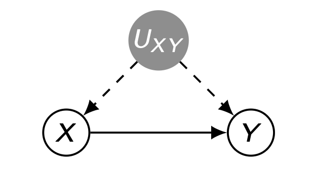
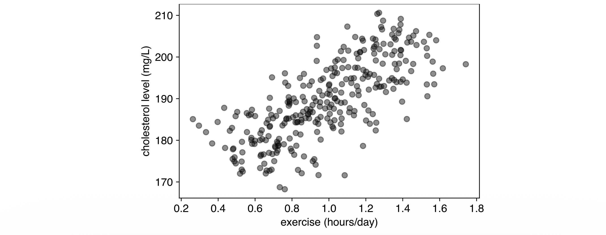
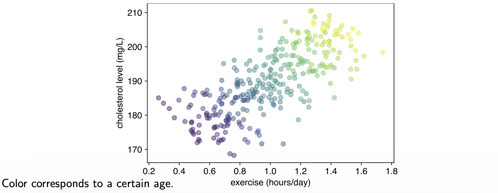

## 들어가며 (Introduction)

지난 글들에서 우리는 **구조적 인과 모형(SCM)**, **개입(intervention)**, 그리고 $do(\cdot)$ 연산자를 정의하고, 인과효과 $P(y \mid do(x))$가 무엇을 의미하는지 살펴보았습니다. 그러나 현실의 분석에서는 무작위 실험(RCT)을 수행할 수 없는 경우가 대부분이며, 우리가 손에 쥐고 있는 것은 오직 **관측 분포(observational distribution)** $P(v)$ 뿐입니다.

이번 글의 핵심 질문은 다음과 같습니다.

> **관측 데이터 $P(v)$만으로 개입 분포 $P(y \mid do(x))$를 복원(식별)할 수 있는가? 가능하다면 어떤 조건에서, 어떤 공식으로 가능한가?**

이 질문에 답하기 위해 우리는 먼저 **식별 문제(identification problem)**를 복습하고, 식별이 가능한 경우와 불가능한 경우를 구체적인 예제로 대비시킵니다. 그다음 인과추론 최대의 장애물인 **교란 편향(confounding bias)**의 정체를 밝히고, 이를 제거하는 핵심 도구인 **Back-door Criterion**과 그 추정 방법인 **역확률 가중(IPW)**까지 다루겠습니다.

> 본 포스트는 서울대학교 GSDS 이상학(Sanghack Lee) 교수님의 강의 자료(Prof. Bareinboim의 슬라이드를 차용)를 기반으로 정리하였습니다.

---

## 1. 식별 문제 복습 (Recap: Identification Problem)

먼저 식별(identification)이라는 개념을 한 문장으로 다시 정의해 보겠습니다.

* **식별(Identification):** 인과 그래프 $G$의 구조적 가정과 관측 분포 $P(v)$만으로, 목표 인과량 $Q = P(y \mid do(x))$를 **유일하게(uniquely)** 결정할 수 있는가의 문제입니다.

여기서 "유일하게"라는 표현이 중요합니다. 식별 가능성을 판정하는 사고 실험은 다음과 같습니다.

* 동일한 그래프 $G$를 induce 하고, 동일한 관측 분포 $P(v)$를 만들어 내는 **모든** SCM 후보 $M^{(1)}, M^{(2)}, \dots$를 생각합니다.
* 만약 이 후보들이 **전부 동일한** $P(y \mid do(x))$를 산출한다면, 그 효과는 **식별 가능(identifiable)**합니다. 즉 데이터가 효과를 유일하게 결정합니다.
* 반대로, $G$와 $P(v)$를 똑같이 공유하면서도 **서로 다른** $P(y \mid do(x))$를 내놓는 두 모형이 존재한다면, 그 효과는 **식별 불가능(non-identifiable)**합니다. 데이터만으로는 답을 좁힐 수 없는 것입니다.

이 "두 모형의 일치/불일치" 논리는 다음 두 예제에서 그대로 작동합니다.

---

## 2. 식별 가능 효과와 불가능 효과 (Identifiable and Non-identifiable Effects)

### 2.1 식별 가능한 효과 (Example: Identifiable Effect)

다음 그래프를 생각해 봅시다. $Z$는 $X$와 $Y$의 **공통 원인(common cause)**, 즉 관측된 교란자입니다.

**원본 그래프와 관측 분포.** 그래프 $X \leftarrow Z \to Y$, $X \to Y$에 호환되는 관측 분포는 부모 마르코프 분해(Markov factorization)에 의해 다음과 같습니다.

$$
P(v) = P(z)\,P(x \mid z)\,P(y \mid x, z)
$$

**두 후보 모형.** 이 그래프와 분포에 호환되는 임의의 두 SCM을 생각합니다.

$$
M^{(1)} = 
\begin{cases}
Z \leftarrow f_z^{(1)}(u_z) \\
X \leftarrow f_x^{(1)}(z, u_x) \\
Y \leftarrow f_y^{(1)}(x, z, u_y)
\end{cases}
\qquad
M^{(2)} = 
\begin{cases}
Z \leftarrow f_z^{(2)}(u_z) \\
X \leftarrow f_x^{(2)}(z, u_x) \\
Y \leftarrow f_y^{(2)}(x, z, u_y)
\end{cases}
$$

**개입 후의 분포.** $do(x)$는 구조방정식 $X \leftarrow f_x(z, u_x)$를 상수 대입 $X \leftarrow x$로 교체합니다. 이때 $Z \to X$로 들어오던 화살표가 제거되므로(절단된 모형), 개입 분포는 다음과 같이 단순화됩니다.

$$
P(v' \mid do(x)) = P(z)\,P(y \mid x, z)
$$

마지막으로 $Z$를 주변화하면 우리가 원하는 인과효과를 얻습니다.

$$
P(y \mid do(x)) = \sum_z P(z)\,P(y \mid x, z)
$$

**식별 가능성의 핵심 논증.** 결정적인 통찰은 다음에 있습니다.

* 구체적인 함수 $f^{(\cdot)}$나 외생 변수의 분포 $P(u)$가 무엇이든 상관없이,
* 두 모형 $M^{(1)}, M^{(2)}$가 $\langle G, P(v) \rangle$에서 일치한다면, 이들은 자동으로 $P(z)$와 $P(y \mid x, z)$에서도 일치합니다.
* 따라서 위 보정 공식에 의해 $P(v' \mid do(x))$에서도 **반드시 일치**합니다.

즉, 관측 분포가 효과를 **유일하게 결정**하므로 이 효과는 식별 가능합니다.

### 2.2 식별 불가능한 효과 (Example: Non-identifiable Effect)

이번에는 $X$와 $Y$ 사이에 **관측되지 않은 교란자(unobserved confounder)** $U_{XY}$가 존재하는 경우를 봅니다. 이 양방향 의존성은 식별을 깨뜨립니다.

**관측 분포.** 잠재 변수 $U_{XY}$를 주변화한 관측 분포는 다음과 같습니다.

$$
P(v) = \sum_{u_{xy}} P(y \mid x, u_{xy})\,P(x \mid u_{xy})\,P(u_{xy})
$$

**두 후보 모형.** 동일한 그래프 $G$를 induce 하는 두 모형을 정의합니다. 외생 변수는 $P_j(U_i = 1) = 1/2$ ($i \in \{y, xy\}$, $j \in \{1,2\}$)로 모두 공정한 동전입니다.

$$
M^{(1)} = 
\begin{cases}
X \leftarrow U_{xy} \\
Y \leftarrow (X \oplus U_{xy}) \vee U_y
\end{cases}
\qquad
M^{(2)} = 
\begin{cases}
X \leftarrow U_{xy} \\
Y \leftarrow U_y
\end{cases}
$$

여기서 $\oplus$는 XOR(배타적 논리합), $\vee$는 OR(논리합)입니다. $M^{(2)}$에서는 $Y$가 $X$와 완전히 독립인 점에 주목합니다.

#### 관측 수준에서의 일치 확인

먼저 두 모형이 **관측 분포 $P(V)$에서 동일**함을 진리표로 확인합니다. $X = U_{xy}$이므로 $X$ 값은 $U_{xy}$가 결정합니다.

| $U_y$ | $U_{xy}$ | $X$ | $Y^{(1)}$ | $Y^{(2)}$ | $P(u)$ |
|:---:|:---:|:---:|:---:|:---:|:---:|
| 0 | 0 | 0 | 0 | 0 | $1/4$ |
| 0 | 1 | 1 | 0 | 0 | $1/4$ |
| 1 | 0 | 0 | 1 | 1 | $1/4$ |
| 1 | 1 | 1 | 1 | 1 | $1/4$ |

* $M^{(1)}$의 $Y$ 계산: 예컨대 둘째 행 $U_y=0, U_{xy}=1$이면 $X=1$, $Y=(1\oplus 1)\vee 0 = 0 \vee 0 = 0$.
* 표에서 보듯 **모든 행에서 $Y^{(1)} = Y^{(2)}$**가 성립합니다. 따라서 두 모형은 관측 수준에서 완전히 구별 불가능합니다.

$$
P^{(1)}(V) = P^{(2)}(V)
$$

#### 개입 수준에서의 불일치 확인

이제 $do(x)$를 가합니다. 구조방정식 $X \leftarrow U_{xy}$가 $X \leftarrow x$로 교체되므로, $X$는 더 이상 $U_{xy}$를 따르지 않고 외생적으로 고정된 $x$가 됩니다. 개입 분포는 다음과 같습니다.

$$
P(v \mid do(x)) = \sum_{u_{xy}} P(y \mid x, u_{xy})\,P(u_{xy})
$$

개입 후의 진리표는 $X$ 열이 모두 $x$(고정값)로 바뀝니다.

| $U_y$ | $U_{xy}$ | $X$ | $Y^{(1)}$ | $Y^{(2)}$ | $P(u)$ |
|:---:|:---:|:---:|:---:|:---:|:---:|
| 0 | 0 | $x$ | $x$ | 0 | $1/4$ |
| 0 | 1 | $x$ | $\neg x$ | 0 | $1/4$ |
| 1 | 0 | $x$ | 1 | 1 | $1/4$ |
| 1 | 1 | $x$ | 1 | 1 | $1/4$ |

* $M^{(1)}$: $Y = (x \oplus U_{xy}) \vee U_y$. 예컨대 첫째 행 $U_y=0, U_{xy}=0$이면 $Y = (x \oplus 0) \vee 0 = x$. 둘째 행은 $Y = (x \oplus 1)\vee 0 = \neg x$. $U_y=1$인 두 행은 OR에 의해 무조건 $Y=1$.
* $M^{(2)}$: $Y = U_y$이므로 $X$와 무관하게 $U_y$ 값을 그대로 따릅니다.

이제 $do(x)$ 하에서 $Y$의 분포를 계산합니다. (구체성을 위해 $x=1$로 두면 $M^{(1)}$의 위 두 행은 각각 $Y=1, Y=0$이 됩니다.)

| $Y$ | $P^{(1)}(Y \mid do(x))$ | $P^{(2)}(Y \mid do(x))$ |
|:---:|:---:|:---:|
| 0 | $1/4$ | $1/2$ |
| 1 | $3/4$ | $1/2$ |

* $M^{(1)}$: $Y=1$이 되는 경우는 세 행($x=1$ 행, $U_y=1$인 두 행)으로 $P^{(1)}(Y=1 \mid do(x)) = 3/4$.
* $M^{(2)}$: $Y = U_y$이고 $P(U_y=1)=1/2$이므로 항상 $1/2$.

**결론.** 두 모형은 동일한 $G$를 induce 하고 동일한 $P(v)$를 가지지만, 인과효과가 명백히 다릅니다.

$$
P^{(1)}(y \mid do(x)) \neq P^{(2)}(y \mid do(x))
$$

따라서 이 효과는 **식별 불가능(non-identifiable)**합니다. 관측 데이터를 아무리 많이 모아도, 관측되지 않은 교란자 $U_{XY}$가 존재하는 한 우리는 두 가지 상반된 시나리오를 구별할 수 없습니다.

---

## 3. 교란 편향 (Confounding Bias)

### 3.1 직관적 동기: 운동과 콜레스테롤

식별 불가능성이 추상적인 수학적 호기심처럼 느껴진다면, 다음의 실제 데이터 분석 상황이 그 심각성을 보여줍니다.

> **질문:** 운동(Exercise)이 콜레스테롤(Cholesterol)에 미치는 **인과적** 효과는 무엇인가? 그렇다면 $P(\text{cholesterol} \mid \text{exercise})$를 그대로 믿어도 될까?

여기서 **나이(age)**는 운동량과 콜레스테롤 수치 모두에 영향을 주는 공통 원인, 즉 교란자입니다.

**겉보기 상관(naive association).** 전체 데이터를 보정 없이 산점도로 그리면, 운동량이 많을수록 콜레스테롤이 **높아지는** 양의 상관이 나타납니다.

이 그래프만 보면 "운동을 하면 콜레스테롤이 올라간다"는 역설적 결론에 도달합니다. 그러나 이는 교란자 나이를 무시한 결과입니다.

**나이로 층화(stratify)한 결과.** 동일한 점들을 나이대별로 색칠하면 전혀 다른 그림이 드러납니다.

* 각 나이대(같은 색) **내부**에서는 운동량이 많을수록 콜레스테롤이 **낮아집니다**.
* 즉, 인과적으로는 "운동 $\Rightarrow$ 콜레스테롤 감소"가 옳습니다.
* 전체적으로 양의 상관처럼 보인 이유는, 나이가 많을수록 (해당 데이터에서) 운동량도 많고 콜레스테롤도 높았기 때문입니다. 이는 **Simpson의 역설**의 전형적 형태입니다.

### 3.2 교란 편향의 정의

이 현상을 수식으로 표현하면, 조건부 분포와 개입 분포가 일치하지 않습니다.

$$
P(\text{cholesterol} \mid \text{exercise}) \neq P(\text{cholesterol} \mid do(\text{exercise}))
$$

* 이 둘의 차이를 **교란 편향(confounding bias)**이라 부릅니다.
* 교란 편향은 인과추론과 해석 가능성(interpretability)을 가로막는 **가장 큰 장애물 중 하나**입니다.
* 머신러닝 모델이 학습하는 것은 대개 $P(Y \mid X)$ 형태의 연관이므로, 교란이 존재하면 모델의 예측을 인과적으로 해석하는 순간 오류에 빠지게 됩니다.

### 3.3 교란 편향은 제거 가능한가? (Is Confounding Bias removable?)

이제 더 일반적인 질문으로 넘어갑니다.

> **목표:** 변수 $Z_1, \dots, Z_k$에 대한 측정값이 주어졌을 때, $X$가 $Y$에 미치는 효과 $Q = P(y \mid do(x))$를 구한다. 단, $X$의 일부 부모(parents)는 관측되지 않을 수 있다.

핵심 질문은 이것입니다. **부모의 일부만 측정해도 목표량 $Q$를 식별할 수 있는가?** 놀랍게도, 직접 부모를 모두 관측하지 못하더라도 적절한 **대체 집합(substitute set)**을 찾으면 가능합니다. 그 대체 집합을 판정하는 기준이 바로 Back-door Criterion입니다.

---

## 4. Back-door Criterion

### 4.1 정의 (Definition)

**Back-door Criterion (정의 3.3.1).** 인과 다이어그램 $G$에서 변수 쌍 $X, Y$에 대해, 변수 집합 $Z$가 다음 두 조건을 만족하면 **뒷문 기준(back-door criterion)**을 만족한다고 합니다.

* **(i)** $Z$에 속한 어떤 노드도 $X$의 **후손(descendant)이 아니다**; 그리고
* **(ii)** $Z$는 $X \in X$에서 $Y \in Y$로 가는 경로 중 **$X$로 들어오는 화살표를 포함하는 모든 경로(즉 뒷문 경로)를 차단(block)**한다.

두 조건의 의미를 풀어 보겠습니다.

* **(i) 후손 배제:** $X$의 후손(특히 매개변수나 효과)을 보정하면, 인과 경로 자체를 막거나 충돌부(collider)를 열어 새로운 편향을 만듭니다. 따라서 후손은 보정 집합에서 제외합니다.
* **(ii) 뒷문 경로 차단:** $X$로 **화살표가 들어오는** 경로는 모두 비인과적인 연관(뒷문 경로, back-door path)입니다. 이들을 모두 막으면, $X$와 $Y$ 사이에 남는 연관은 순수한 인과 경로뿐입니다.

### 4.2 Back-door Adjustment (정리)

**정리.** 집합 $Z$가 $X, Y$ 쌍에 대해 뒷문 기준을 만족하면, $Y$에 대한 효과는 **식별 가능**하며 다음 보정 공식으로 주어집니다.

$$
P(y \mid do(x)) = \sum_z P(y \mid x, z)\,P(z)
$$

이 공식이 바로 **뒷문 보정(back-door adjustment)** 또는 **보정 공식(adjustment formula)**입니다. 우변은 전부 관측 분포 $P(v)$로부터 추정 가능한 항들($P(y\mid x,z)$와 $P(z)$)로만 구성되어 있음에 주목하시기 바랍니다.

### 4.3 직접 부모의 대체로서의 뒷문 집합 (Sprinkler 예제)

뒷문 집합이 왜 "직접 부모의 대체물"인지 구체적인 예제로 봅니다.

**비(Rain)는 뒷문 기준을 만족합니다.** $X = \text{sprinkler}$, $Y = \text{wet}$에 대해:

* **(i)** Rain은 Sprinkler의 후손이 아닙니다.
* **(ii)** Rain은 Sprinkler에서 Wet으로 가는 **유일한 뒷문 경로** $\text{sprinkler} \leftarrow \text{season} \to \text{rain} \to \text{wet}$를 차단합니다.

**직접 부모(계절)로 보정한 식을 비(rain)로 보정한 식으로 변환.** Sprinkler의 직접 부모는 계절(season)입니다. 부모 보정에서 출발하여 단계별로 변형합니다.

$$
\begin{aligned}
P(wt \mid do(sp)) 
&= \sum_{sn} P(wt \mid sp, sn)\,P(sn) \\[4pt]
&= \sum_{sn, rn} P(wt \mid sp, sn, rn)\,P(rn \mid sp, sn)\,P(sn) \\[4pt]
&= \sum_{sn, rn} P(wt \mid sp, rn)\,P(rn \mid sn)\,P(sn) \\[4pt]
&= \sum_{rn} P(wt \mid sp, rn) \sum_{sn} P(rn, sn) \\[4pt]
&= \sum_{rn} P(wt \mid sp, rn)\,P(rn)
\end{aligned}
$$

각 단계의 근거는 다음과 같습니다.

* **1행:** 직접 부모인 계절(season)에 대한 뒷문 보정.
* **2행:** 비(rain)를 명시적으로 도입. 전확률 법칙으로 $P(wt \mid sp, sn) = \sum_{rn} P(wt \mid sp, sn, rn)\,P(rn \mid sp, sn)$.
* **3행:** 두 가지 조건부 독립을 적용. 젖음은 계절을 직접 부모로 갖지 않으므로 $P(wt \mid sp, sn, rn) = P(wt \mid sp, rn)$. 또한 계절이 주어지면 비는 스프링클러와 독립이므로 $P(rn \mid sp, sn) = P(rn \mid sn)$.
* **4행:** 조건부 확률의 정의로 $P(rn \mid sn)\,P(sn) = P(rn, sn)$.
* **5행:** $sn$에 대한 주변화 $\sum_{sn} P(rn, sn) = P(rn)$.

**결론:** 직접 부모인 계절로 보정하든, 그 대체물인 비로 보정하든 **동일한 인과효과**를 얻습니다. 비록 직접 부모를 측정하지 못해도, 뒷문 기준을 만족하는 다른 집합으로 대체할 수 있는 것입니다.

### 4.4 직접 부모 보정 → 뒷문 보정의 일반적 증명

이제 위 직관을 일반화하여, 임의의 뒷문 허용 집합 $Z$에 의한 보정이 직접 부모에 의한 보정과 동등함을 증명합니다.

뒷문 기준의 두 조건은 그래프적 표현에서 다음의 조건부 독립으로 번역됩니다. ($\mathrm{Pa}^-_X$는 $X$의 직접 부모 집합, $Z^- := Z \setminus \mathrm{Pa}^-_X$는 $Z$ 중 부모가 아닌 부분.)

* **(i)** $Z$에 $X$의 후손이 없음 $\;\Longrightarrow\; X \perp\!\!\!\perp (Z \setminus \mathrm{Pa}^-_X) \mid \mathrm{Pa}^-_X$
* **(ii)** $Z$가 모든 뒷문 경로를 차단 $\;\Longrightarrow\; Y \perp\!\!\!\perp (\mathrm{Pa}^-_X \setminus Z) \mid Z, X$

이를 이용한 유도는 다음과 같습니다. 여기서 $z = z^- \cup \mathrm{pa}^-_X$로 이해합니다.

$$
\begin{aligned}
P(y \mid do(x)) 
&= \sum_{\mathrm{pa}^-_X} P(y \mid x, \mathrm{pa}^-_X)\,P(\mathrm{pa}^-_X) \\[4pt]
&= \sum_{z^-, \,\mathrm{pa}^-_X} P(y \mid x, \mathrm{pa}^-_X, z^-)\,P(z^- \mid x, \mathrm{pa}^-_X)\,P(\mathrm{pa}^-_X) \\[4pt]
&= \sum_{z^-, \,\mathrm{pa}^-_X} P(y \mid x, z)\,P(z^- \mid \mathrm{pa}^-_X)\,P(\mathrm{pa}^-_X) 
\quad \text{(i), (ii)} \\[4pt]
&= \sum_{z^-, \,\mathrm{pa}^-_X} P(y \mid x, z)\,P(z^-, \mathrm{pa}^-_X) 
\quad \text{(조건부 확률 정의)} \\[4pt]
&= \sum_{z} P(y \mid x, z) \sum_{\mathrm{pa}^-_X \setminus z} P(z^-, \mathrm{pa}^-_X) 
\quad \text{(대수 정리)} \\[4pt]
&= \sum_{z} P(y \mid x, z)\,P(z)
\end{aligned}
$$

단계별 해설:

* **1행:** 직접 부모 $\mathrm{Pa}^-_X$에 의한 뒷문 보정(시작점).
* **2행:** $z^-$를 명시적으로 도입 (전확률 법칙).
* **3행:** 두 독립 조건 적용. 조건 (ii)에 의해 $P(y \mid x, \mathrm{pa}^-_X, z^-) = P(y \mid x, z)$ (부모 중 $Z$에 없는 것은 $Z, X$가 주어지면 $Y$와 무관). 조건 (i)에 의해 $P(z^- \mid x, \mathrm{pa}^-_X) = P(z^- \mid \mathrm{pa}^-_X)$ (즉 $x$를 떼어낼 수 있음).
* **4행:** $P(z^- \mid \mathrm{pa}^-_X)\,P(\mathrm{pa}^-_X) = P(z^-, \mathrm{pa}^-_X)$.
* **5행:** 합을 $z$ 기준으로 재배열하고, 나머지 부모를 주변화.
* **6행:** $\sum_{\mathrm{pa}^-_X \setminus z} P(z^-, \mathrm{pa}^-_X) = P(z)$.

**결론:** $Z$가 뒷문 허용(back-door admissible) 집합인 한, $Z$에 의한 보정은 직접 부모에 의한 보정과 동등합니다.

### 4.5 뒷문 허용 집합에 대한 그래프적 조건

뒷문 기준은 다음의 간결한 그래프적 판정으로 다시 표현할 수 있습니다.

> $P(y \mid do(x))$는, 조건 (i), (ii)를 만족하면서 **$G_{\underline{X}}$에서 $X$와 $Y$를 d-분리(d-separate)하는 집합**이 존재할 때 식별 가능하다.

여기서 $G_{\underline{X}}$는 **$X$에서 나가는 화살표를 모두 제거한 그래프**입니다. $X$에서 나가는 화살표(인과 경로의 첫 간선)를 지우면 남는 것은 $X$로 들어오는 뒷문 경로들뿐이므로, 이 변형 그래프에서 $Z$가 $X$와 $Y$를 d-분리한다는 것은 곧 모든 뒷문 경로를 차단한다는 것과 같습니다.

위 예제 그래프에서 $\{Z_1, Z_4\}$가 뒷문 허용 집합이므로 다음을 얻습니다.

$$
P(y \mid do(x)) = \sum_{z_1, z_4} P(y \mid x, z_1, z_4)\,P(z_1, z_4)
$$

### 4.6 뒷문 예제 (Back-door Examples)

다음 그래프들에 대해 ($X, Y$ 기준) 허용 가능한 뒷문 집합이 존재하는지 살펴봅니다.

**예제 1 (복잡한 그래프).** 다음 세 집합이 모두 뒷문 허용 집합입니다.

$$
Z = \{Z_4, Z_2\},\quad \{Z_4, Z_5\},\quad \{Z_4, Z_2, Z_5\}
$$

즉 허용 집합은 유일하지 않으며, 여러 후보 중 추정 효율이 좋은 것을 선택할 수 있습니다.

**예제 2 (충돌부 구조).** $X$와 $Y$가 충돌부(collider) $Z$를 공유하는 경우, 허용 집합은 **공집합**입니다.

$$
Z = \varnothing
$$

이는 매우 중요한 교훈을 줍니다. **충돌부 $Z$를 보정하면 닫혀 있던 경로가 오히려 열려 새로운 편향(collider bias / M-bias)이 발생**합니다. 따라서 "변수가 많으니 일단 다 통제하자"는 직관은 위험하며, 보정은 그래프 구조에 근거해야 합니다.

---

## 5. 평가 (Evaluation)

### 5.1 뒷문 보정의 추정 문제

뒷문 기준은 어떤 공변량 집합 $Z$가 보정에 허용 가능한지를 **판정**하는 기준입니다.

$$
P(y \mid do(x)) = \sum_z P(y \mid x, z)\,P(z), 
\qquad 
\mathbb{E}[Y \mid do(x)] = \mathbb{E}_Z\big[\,\mathbb{E}[Y \mid x, Z]\,\big]
$$

그런데 실무에서 이 식을 **어떻게 계산**할 것인가는 또 다른 문제입니다. 여기에는 두 가지 도전이 따릅니다.

* **추정의 문제:** 식에 등장하는 여러 분포($P(y \mid x, z)$, $P(z)$ 등)를 유한한 표본으로부터 추정해야 합니다.
* **계산(합산)의 문제:** 이들의 합성곱(convolution), 즉 $Z$에 대한 합 $\sum_z$를 계산해야 하는데, $Z$가 고차원이면 합산의 항 수가 폭발합니다. 대략적으로 시간 복잡도가 $O(\exp(|Z|))$에 이릅니다.

차원이 높을수록 $\sum_z$를 직접 수행하기는 사실상 불가능해집니다. 이 문제를 우회하는 우아한 방법이 **역확률 가중(IPW)**입니다.

### 5.2 역확률 가중 (Inverse Probability Weighting, IPW)

**뒷문 식의 재작성.** 핵심 아이디어는 보정 공식을 결합분포와 **할당 확률(assignment probability)** $P(x \mid z)$로 다시 쓰는 것입니다.

$$
\begin{aligned}
P(y \mid do(x)) 
&= \sum_z P(y \mid x, z)\,P(z) \\[4pt]
&= \sum_z \frac{P(y, x, z)}{P(x, z)}\,P(z) \\[4pt]
&= \sum_z \frac{P(y, x, z)}{P(x \mid z)\,P(z)}\,P(z) \\[4pt]
&= \sum_z \frac{P(y, x, z)}{P(x \mid z)}
\end{aligned}
$$

각 단계의 근거:

* **2행:** 조건부 확률 정의 $P(y \mid x, z) = \dfrac{P(y, x, z)}{P(x, z)}$.
* **3행:** 결합분포 분해 $P(x, z) = P(x \mid z)\,P(z)$.
* **4행:** 분자와 분모의 $P(z)$가 상쇄.

여기서 두 항의 의미를 구분합니다.

* $P(y, x, z)$ : 결합분포의 항(entry). 데이터에서 직접 빈도로 추정 가능.
* $P(x \mid z)$ : **할당 확률(=경향 점수, propensity score)**. 모델 $g(z) \approx P(X = x \mid Z = z)$로 적합(fit).

**유한 표본 근사.** $N$개의 표본이 있다고 하면, 결합분포를 경험분포로 대체하여 다음을 얻습니다.

$$
\begin{aligned}
P(y \mid do(x)) 
&= \sum_z \frac{P(y, x, z)}{P(x \mid z)} \\[4pt]
&\approx \sum_z \frac{\frac{1}{N}\sum_{i=1}^N \mathbb{1}(y_i = y, x_i = x, z_i = z)}{g(z)} \\[4pt]
&= \frac{1}{N}\sum_{i=1}^N \sum_z \frac{\mathbb{1}(y_i = y, x_i = x, z_i = z)}{g(z)} \\[4pt]
&= \frac{1}{N}\sum_{i=1}^N \frac{\mathbb{1}(y_i = y, x_i = x)}{g(z_i)}
\end{aligned}
$$

* $\mathbb{1}(\cdot)$는 술어(predicate)가 참이면 1, 거짓이면 0인 지시함수입니다.
* **3행 → 4행:** 내부 합 $\sum_z$에서 지시함수는 $z = z_i$인 단 하나의 항만 살립니다. 그 항에서 $g(z) \to g(z_i)$로 대체됩니다.
* **계산 복잡도:** 더 이상 $O(\exp(|Z|))$의 합산이 필요 없고, 표본 수 $N$에 비례하는 $O(N)$ 시간으로 계산됩니다. 이것이 IPW의 결정적 장점입니다.

**기댓값 버전.** 동일한 논리를 기댓값에 적용합니다.

$$
\begin{aligned}
\mathbb{E}[Y \mid do(x)] 
&= \sum_{z, y} \frac{y \cdot P(y, x, z)}{P(x \mid z)} \\[4pt]
&\approx \sum_{z, y} \frac{y \cdot \frac{1}{N}\sum_{i=1}^N \mathbb{1}(y_i = y, x_i = x, z_i = z)}{g(z)} \\[4pt]
&= \frac{1}{N}\sum_{i=1}^N \sum_{z, y} \frac{y \cdot \mathbb{1}(y_i = y, x_i = x, z_i = z)}{g(z)} \\[4pt]
&= \frac{1}{N}\sum_{i=1}^N \frac{y_i \cdot \mathbb{1}(x_i = x)}{g(z_i)}
\end{aligned}
$$

마지막 행에서 $\sum_{z,y}$는 $y = y_i, z = z_i$인 항만 남기므로 $y \to y_i$가 됩니다.

### 5.3 IPW를 이용한 평균 처치 효과 (Average Treatment Effect)

뒷문 기준이 성립할 때, 이진 처치 $X \in \{0, 1\}$에 대한 **평균 처치 효과(ATE)**의 IPW 추정량은 다음과 같습니다.

$$
\begin{aligned}
\widehat{\mathrm{ATE}} 
&= \hat{\mathbb{E}}[Y \mid do(X = 1)] - \hat{\mathbb{E}}[Y \mid do(X = 0)] \\[4pt]
&= \frac{1}{N}\sum_{i=1}^N y_i \left( \frac{\mathbb{1}(x_i = 1)}{g(z_i)} - \frac{\mathbb{1}(x_i = 0)}{1 - g(z_i)} \right) \\[4pt]
&= \frac{1}{N}\sum_{i=1}^N \left( \frac{y_i x_i}{g(z_i)} - \frac{y_i (1 - x_i)}{1 - g(z_i)} \right)
\end{aligned}
$$

* 이진 처치에서는 $\mathbb{1}(x_i = 1) = x_i$, $\mathbb{1}(x_i = 0) = 1 - x_i$가 성립하므로 마지막 행처럼 간결하게 정리됩니다.
* $g(z_i) = P(X = 1 \mid z_i)$는 처치를 받을 경향 점수, $1 - g(z_i) = P(X = 0 \mid z_i)$는 통제를 받을 점수입니다.
* 처치군은 $1/g(z_i)$, 통제군은 $1/(1 - g(z_i))$로 가중되어, 경향 점수로 인한 표본 불균형을 보정합니다.

> **표기 주의:** 연구 분야마다 기호가 다릅니다. 공변량을 $X$ 또는 $L$로, 처치를 $T$, $W$, $A$ 등으로 표기하기도 합니다. 본 글에서는 강의 표기($Z$=공변량, $X$=처치)를 따랐습니다.

### 5.4 IPW의 직관: "유사 인과 표본" 만들기

IPW가 실제로 무엇을 하는지 표본 수준에서 시각화하면 다음과 같습니다.

* 식 $\dfrac{1}{N}\sum_{i=1}^N \dfrac{y_i\, \mathbb{1}(x_i = x)}{g(z_i)}$를 계산하는 과정은 다음과 같이 해석됩니다.
* **선별:** 지시함수 $\mathbb{1}(x_i = x)$에 의해 처치값이 $x$인 표본만 남깁니다($x_i \neq x$인 표본은 0이 되어 사라짐).
* **가중:** 살아남은 각 표본을 자신의 할당 확률의 역수 $1/g(z_i)$로 가중합니다. 받기 어려운 처치를 우연히 받은 표본(작은 $g(z_i)$)일수록 큰 가중치를 받아, 모집단 전체를 대표하도록 재조정됩니다.
* 그 결과 만들어지는 것이 **유사 인과 표본(Pseudo Causal Samples)**입니다. IPW는 결국 관측 표본을, 개입이 실제로 일어났을 때 나올 법한 가상의 표본 집합으로 "재가중"하는 절차인 셈입니다.

---

## 마치며 (Summary)

이번 글에서 다룬 내용을 정리하면 다음과 같습니다.

* **식별 문제:** 관측 분포 $P(v)$가 인과효과 $P(y\mid do(x))$를 유일하게 결정하면 식별 가능합니다. 관측되지 않은 교란자가 있으면, 동일한 $\langle G, P(v)\rangle$를 공유하면서 서로 다른 효과를 내는 두 모형이 존재할 수 있어 식별이 불가능해집니다.
* **교란 편향:** $P(y\mid x) \neq P(y\mid do(x))$인 현상이며(운동-콜레스테롤의 Simpson 역설), 인과추론의 핵심 장애물입니다.
* **Back-door Criterion:** (i) $X$의 후손을 포함하지 않고 (ii) 모든 뒷문 경로를 차단하는 집합 $Z$를 찾으면, $P(y\mid do(x)) = \sum_z P(y\mid x,z)P(z)$로 효과를 식별할 수 있습니다. 충돌부를 보정하면 안 된다는 점도 핵심 교훈입니다.
* **IPW:** 고차원 $Z$에 대한 합산($O(\exp|Z|)$)을 경향 점수 $g(z)$의 역가중으로 대체하여 $O(N)$에 추정하며, ATE는 처치군/통제군을 역확률로 가중하여 계산합니다.

다음 글에서는 뒷문 기준을 넘어, 매개변수를 활용하는 **앞문 기준(Front-door Criterion)**과 일반적 식별 알고리즘(do-calculus)으로 나아가겠습니다.