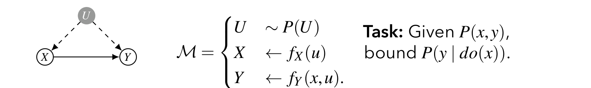
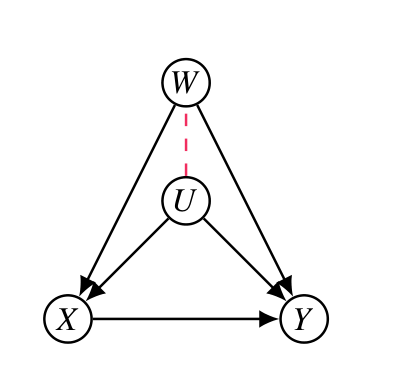

## 들어가며 (Overview)

인과추론의 핵심 목표는 개입(intervention) 분포 $P(y \mid do(x))$를 관측 데이터로부터 알아내는 것입니다. 지금까지 우리는 주로 **점 식별(point identification)** 에 집중해 왔습니다. 즉, 백도어 기준(backdoor criterion)이나 do-calculus를 통해 $P(y \mid do(x))$를 관측분포 $P(V)$의 함수로 **정확히 하나의 값으로** 표현할 수 있는지를 물었습니다.

하지만 현실에서는 미관측 교란변수(unobserved confounder)가 존재하여 인과효과가 **점 식별되지 않는** 경우가 매우 흔합니다. 이때 "식별 불가능하니 포기한다"가 아니라, **관측분포가 허용하는 범위 내에서 인과효과가 가질 수 있는 값의 구간 $[a, b]$를 구하자**는 것이 바로 **부분 식별(partial identification)** 의 발상입니다.

본 포스트에서는 다음 순서로 부분 식별을 살펴보겠습니다.

* **부분 식별 문제 (Partial Identification Problem)** — 점 식별과 부분 식별의 차이
* **자연 경계 (Natural Bounds)** — 가장 기본적인 경계와 그 유도
* **비순응 (Non-Compliance)** — IV 모델에서의 정준형 모델과 선형계획 기반 경계
* **부분 관측 공변량에 대한 경계 (Bounds on Partially-observed Covariates)**

---

## 1. 식별 문제와 부분 식별 문제 (The Identification Problem & Partial Identification)

### 1.1 식별 추론 엔진의 두 가지 출력

인과 식별 문제는 다음과 같은 입출력 구조로 추상화할 수 있습니다.

* **입력(Input):**
  * 질의(Query) $Q = P(y \mid do(x))$
  * 인과 그래프(Graph) $G$
  * 관측 데이터(Data) $P(x, y, z)$
* **추론 엔진(Inference Engine):** 그래프와 데이터를 받아 식별 가능 여부를 판정
* **출력(Solution):** 식별 가능 여부(yes/no)와 그에 따른 결과

여기서 출력은 두 갈래로 나뉩니다.

* **식별 가능(yes)한 경우:** 인과효과가 관측분포의 함수로 **정확히** 표현됩니다. 예를 들어 $Z$가 백도어 기준을 만족하면

$$
P(y \mid do(x)) = \sum_z P(y \mid x, z)\, P(z)
$$

가 성립합니다. 이는 **점 식별**입니다.

* **식별 불가능(no)한 경우:** 인과효과를 단일 값으로 결정할 수는 없지만, 여전히 어떤 구간 안에 있음을 보장할 수 있습니다.

$$
P(y \mid do(x)) \in [a(y;x),\, b(y;x)] \subseteq [0, 1].
$$

![Figure: 인과 식별의 추론 엔진 구조. 질의 $Q=P(y\mid do(x))$, 그래프 $G$, 관측 데이터 $P(x,y,z)$를 입력으로 받아 추론 엔진이 식별 가능 여부를 판정합니다. 식별 가능(yes)하면 백도어 조정식처럼 정확한 함수가, 식별 불가능(no)하면 $[a(y;x),b(y;x)]\subseteq[0,1]$ 형태의 구간 경계가 출력됩니다. 점 식별이 구간 경계의 특수한 경우(폭이 0)임을 시각적으로 대비시키는 그림입니다.](./images/identification_engine.png)

### 1.2 부분 식별 가능성의 정의 (Causal Effect Partial-Identifiability)

이제 부분 식별을 엄밀하게 정의해 보겠습니다.

> **정의 (인과효과의 부분 식별 가능성).** 인과 다이어그램 $G$로부터 $X$가 $Y$에 미치는 인과효과가 **부분 식별 가능(partially-identifiable)** 하다는 것은 다음을 의미합니다.
>
> * 관측분포 $P(V)$가 경계 $P(y \mid do(x)) \in [a, b]$를 결정하고,
> * 그 경계 $[a, b]$가 $[0, 1]$에 **진부분집합(strictly contained)** 으로 포함된다.

이 정의에서 다음 두 가지 관계를 반드시 짚어야 합니다.

* **식별 가능 $\Longrightarrow$ 부분 식별 가능:** 정확히 식별되는 효과는 폭이 0인 구간 $[a, a]$로 볼 수 있으므로, 당연히 부분 식별 가능합니다.
* **부분 식별 가능 $\not\Longrightarrow$ 식별 가능:** 그 역은 성립하지 않습니다. 즉, $[0,1]$보다 좁은 경계를 줄 수 있다고 해서 그것이 한 점으로 줄어드는 것은 아닙니다.

직관적으로, **부분 식별은 점 식별보다 약한(더 일반적인) 개념**입니다. "정확히 알 수 없어도, 무지의 범위를 $[0,1]$ 전체보다 좁힐 수 있다"는 것이 핵심입니다.

---

## 2. 자연 경계 (Natural Bounds)

### 2.1 문제 설정

가장 단순하면서도 본질적인 설정부터 시작합니다. 다음 그래프와 호환되는 SCM $M$을 생각합니다.

* $X$와 $Y$ 사이에 직접 효과 $X \to Y$가 존재
* 미관측 변수 $U$가 $X$와 $Y$ 모두에 영향 ($U \to X$, $U \to Y$, 즉 양방향 교란 $X \leftrightarrow Y$)

* **과제(Task):** 관측분포 $P(x, y)$가 주어졌을 때 $P(y \mid do(x))$를 경계 지어라.

여기서 $U$가 관측되지 않으므로 백도어 경로 $X \leftarrow U \to Y$를 조정할 수 없고, 따라서 인과효과는 점 식별되지 않습니다.

### 2.2 자연 경계 정리

> **정리 (자연 경계).** 관측분포 $P(x, y)$가 주어졌을 때, 인과효과 $P(y \mid do(x))$는 $[a(y;x), b(y;x)]$ 안에 있으며
>
> $$
> a(y;x) = P(y, x), \qquad b(y;x) = P(y, x) + 1 - P(x).
> $$

이 경계의 폭은 항상
$$
b(y;x) - a(y;x) = 1 - P(x)
$$
입니다. 즉 **$x$가 자주 관측될수록($P(x)$가 클수록) 경계가 좁아진다**는 직관과 정확히 일치합니다.

### 2.3 예시: XOR 메커니즘으로 보는 자연 경계

추상적인 경계가 실제로 어떻게 작동하는지 구체적인 SCM으로 확인해 보겠습니다.

* $X, Y, U \in \{0, 1\}$
* 메커니즘: $X \leftarrow U$, $Y \leftarrow X \oplus U$ ($\oplus$는 배타적 논리합)
* $P(U = 0) = 0.9$

**관측분포 계산.** $X = U$이므로 $X = U$가 항상 성립하고, 따라서 $Y = X \oplus U = U \oplus U = 0$이 **항상** 성립합니다. 그러므로 관측분포는 다음과 같습니다.

| $P(X, Y)$ | $Y = 0$ | $Y = 1$ |
|:---:|:---:|:---:|
| $X = 0$ | 0.9 | 0 |
| $X = 1$ | 0.1 | 0 |

**참 인과효과 계산.** 개입을 가하면 $X$와 $U$의 연결이 끊깁니다.

* $do(X = 0)$: $Y = 0 \oplus U = U$이므로 $P(Y = 1 \mid do(X = 0)) = P(U = 1) = 0.1$
* $do(X = 1)$: $Y = 1 \oplus U$이므로 $Y = 1 \iff U = 0$, 즉 $P(Y = 1 \mid do(X = 1)) = P(U = 0) = 0.9$

**자연 경계와 비교.** 정리를 적용하면 ($Y=1$에 대해):

| | $P(Y=1 \mid do(x))$ (참값) | $a(Y=1; X)$ | $b(Y=1; X)$ |
|:---:|:---:|:---:|:---:|
| $X = 0$ | 0.1 | $P(Y{=}1, X{=}0) = 0$ | $0 + 1 - 0.9 = 0.1$ |
| $X = 1$ | 0.9 | $P(Y{=}1, X{=}1) = 0$ | $0 + 1 - 0.1 = 0.9$ |

참값이 정확히 **상한 $b$** 에 위치함을 볼 수 있습니다. 이 예시는 자연 경계가 실제로 달성 가능한(tight) 경계임을 시사합니다.

### 2.4 절단된 곱을 통한 유도 (Truncated Product)

이제 자연 경계 정리를 단계별로 유도하겠습니다. 출발점은 미관측 $U$에 대한 표준적인 분해입니다.

$$
P(y \mid do(x)) = \sum_u P(y \mid x, u)\, P(u).
$$

이 식은 $do(X=x)$ 하에서 $U$가 $X$와 독립이 되어 $P(u \mid do(x)) = P(u)$임을 사용한 것입니다. 핵심 기교는 $P(u)$를 다음과 같이 **자명하게 분해**하는 것입니다.

$$
P(u) = P(u, x) + \big(P(u) - P(u, x)\big).
$$

이를 대입하면

$$
\begin{aligned}
P(y \mid do(x))
&= \sum_u P(y \mid x, u)\Big[P(u, x) + \big(P(u) - P(u, x)\big)\Big] \\
&= \sum_u P(y \mid x, u)\, P(u, x) + \sum_u P(y \mid x, u)\big(P(u) - P(u, x)\big).
\end{aligned}
$$

여기서 첫째 항은 곱셈 법칙 $P(y \mid x, u)\, P(x, u) = P(y, x, u)$에 의해

$$
\sum_u P(y \mid x, u)\, P(u, x) = \sum_u P(y, x, u) = P(y, x)
$$

로 정리됩니다. 따라서

$$
P(y \mid do(x)) = P(y, x) + \underbrace{\sum_u P(y \mid x, u)\big(P(u) - P(u, x)\big)}_{(\ast)}.
$$

이제 $(\ast)$를 $0 \le P(y \mid x, u) \le 1$이라는 확률의 기본 성질로 경계 짓습니다. 여기서 $P(u) - P(u, x) = P(u) - P(x, u) \ge 0$임에 유의합니다 ($P(x,u) \le P(u)$이므로 항상 음이 아님).

**하한(lower bound).** $P(y \mid x, u) \ge 0$이므로 $(\ast) \ge 0$. 따라서

$$
P(y \mid do(x)) \ge P(y, x) = a(y; x).
$$

**상한(upper bound).** $P(y \mid x, u) \le 1$이므로

$$
\begin{aligned}
P(y \mid do(x))
&\le P(y, x) + \sum_u \big(P(u) - P(u, x)\big) \\
&= P(y, x) + \Big(\underbrace{\sum_u P(u)}_{=1} - \underbrace{\sum_u P(u, x)}_{=P(x)}\Big) \\
&= P(y, x) + 1 - P(x) = b(y; x).
\end{aligned}
$$

이로써 자연 경계 정리가 유도되었습니다. "$x$가 실현되지 않은 $U$의 영역"에서 $P(y \mid x, u)$가 가질 수 있는 극단값(0 또는 1)을 대입한 것이 곧 하한과 상한임을 알 수 있습니다.

### 2.5 자연 경계의 타이트니스 (Tightness)

위에서 구한 경계가 **실제로 달성 가능한지(tight)**, 즉 더 좁힐 수 없는 최선의 경계인지를 보장하는 정리입니다.

> **정리 (타이트니스).** 이진 $X, Y \in \{0, 1\}$에 대해, 임의의 $P(x, y)$가 주어지면 다음을 만족하는 두 SCM $M^{(1)}, M^{(2)}$가 존재한다.
>
> $$
> P^{(1)}(x, y) = P^{(2)}(x, y) = P(x, y)
> $$
>
> 이면서
>
> $$
> P^{(1)}(y \mid do(x)) = a(y; x), \qquad P^{(2)}(y \mid do(x)) = b(y; x).
> $$

즉, **관측분포는 똑같지만 인과효과는 정확히 하한/상한을 실현하는** 두 모델을 명시적으로 구성할 수 있으므로, 경계는 좁힐 수 없습니다.

#### 두 모델의 구성

원래 SCM의 구조함수를 $F = \{X \leftarrow f_X(u),\ Y \leftarrow f_Y(x, u),\ U \sim P(u)\}$라 하고, 다음 두 변형을 정의합니다.

$$
F^{(1)} =
\begin{cases}
X \leftarrow f_X(u) \\
Y \leftarrow
\begin{cases}
f_Y(x, u) & \text{if } x = f_X(u) \\
0 & \text{otherwise}
\end{cases}
\end{cases}
\qquad
F^{(2)} =
\begin{cases}
X \leftarrow f_X(u) \\
Y \leftarrow
\begin{cases}
f_Y(x, u) & \text{if } x = f_X(u) \\
1 & \text{otherwise}
\end{cases}
\end{cases}
$$

그리고 $P^{(1)}(U) = P^{(2)}(U) = P(U)$로 둡니다.

핵심 아이디어는 **"$X$의 입력 $x$가 그 단위의 자연적 값 $f_X(u)$와 일치하지 않을 때"** 의 출력을 한쪽은 0, 다른 쪽은 1로 고정해 극단을 만드는 것입니다.

#### 두 모델이 동일한 관측분포를 유도함 (개입 없음)

개입이 없을 때 $X$는 **항상** $f_X(U)$와 같습니다. 따라서 조건 $x = f_X(u)$가 항상 성립하여 $Y$는 늘 $f_Y(X, U)$를 출력합니다. 그러므로 두 모델 모두 원래 모델과 동일한 $P(v)$를 유도하고,

$$
\begin{aligned}
P^{(i)}(x, y)
&= \sum_u P^{(i)}(x \mid u)\, P^{(i)}(y \mid x, u)\, P(u) \\
&= \sum_u P(x \mid u)\, P(y \mid x, u)\, P(u) \\
&= \sum_u P(y, x, u) = P(y, x).
\end{aligned}
$$

즉 두 모델은 같은 그래프 $G$를 유도하고 같은 $P(V)$를 가집니다.

#### 두 모델이 서로 다른 인과효과를 유도함 (개입 하)

$do(X = x)$를 가하면 $X$는 $U$와 무관하게 $x$로 강제됩니다. 이제 $x$가 자연적 값 $f_X(U)$와 일치할 수도, 아닐 수도 있으므로 효과를 두 경우로 분해합니다.

$$
\begin{aligned}
P^{(i)}(Y = 1 \mid do(x))
&= \sum_u P^{(i)}(Y = 1 \mid x, u)\, P(u) \\
&= P^{(i)}\big(Y = 1 \mid x, f_X(U) = x\big)\, P\big(f_X(U) = x\big) \\
&\quad + P^{(i)}\big(Y = 1 \mid x, f_X(U) \neq x\big)\, P\big(f_X(U) \neq x\big) \\
&= P(x, Y = 1) + \mathbf{1}[i = 2]\,\big(1 - P(x)\big).
\end{aligned}
$$

* $f_X(U) = x$인 영역에서는 두 모델 모두 자연적 출력 $f_Y(x,u)$를 내므로 $P(x, Y=1)$만큼 기여합니다.
* $f_X(U) \neq x$인 영역(확률 $1 - P(x)$)에서는 $M^{(1)}$은 $Y = 0$을 출력해 기여가 없고, $M^{(2)}$는 $Y = 1$을 출력해 $1 - P(x)$만큼 기여합니다.

따라서

$$
P^{(1)}(Y = 1 \mid do(x)) = P(x, Y{=}1) = a(y; x), \qquad
P^{(2)}(Y = 1 \mid do(x)) = P(x, Y{=}1) + 1 - P(x) = b(y; x).
$$

두 모델이 하한과 상한을 각각 정확히 달성하므로, 자연 경계는 **타이트**합니다. $\blacksquare$

---

## 3. 비순응 (Non-Compliance)

### 3.1 비순응 실험과 IV 모델

임상시험에서 **할당된 처치(assigned treatment)** 와 **실제로 받은 처치(realized treatment)** 가 다른 경우가 흔합니다. 이를 **비순응(non-compliance)** 이라 합니다. 이 구조는 도구변수(Instrumental Variable, IV) 모델로 표현됩니다.

* $Z$: **도구변수 / 할당된 처치 (Instrumental Variable, assigned treatment)**
* $X$: **실현된 처치 (realized treatment)**
* $Y$: **주요 결과 (primary outcome)**
* $U$: **미관측 외생변수 (exogenous variables)**, $X$와 $Y$를 동시에 교란

인과 그래프는 $Z \to X \to Y$의 사슬에, $U \to X$와 $U \to Y$의 교란이 더해진 형태입니다.

* **과제(Task):** $P(x, y \mid z)$가 주어졌을 때 $P(y \mid do(x))$를 경계 지어라.

### 3.2 IV 모델에서의 자연 경계

자연 경계를 $Z$의 각 값에 대해 적용해 보겠습니다.

> **정리 (IV 모델의 자연 경계).** 관측분포 $P(X, Y \mid Z)$가 주어졌을 때 $P(y \mid do(x))$는 $[a(y;x), b(y;x)]$ 안에 있으며
>
> $$
> a(y; x) = \max_z P(y, x \mid z), \qquad
> b(y; x) = \min_z\big[P(y, x \mid z) + 1 - P(x \mid z)\big].
> $$

**유도의 직관.** $Z$의 특정 값으로 개입한 모델 $M_z$에 자연 경계를 적용하면

$$
P(y \mid do(x, z)) \le P(y, x \mid do(z)) + 1 - P(x \mid do(z)).
$$

여기서 두 가지 사실이 쓰입니다.

* $Z$는 외생적이므로(부모가 $U_Z$뿐) $P(\cdot \mid do(z)) = P(\cdot \mid z)$ 입니다.
* **배제 제약**에 의해 $Z$는 $X$를 통해서만 $Y$에 작용하므로, $X$에 개입한 뒤에는 $Z$가 $Y$에 영향을 주지 않습니다. 즉 $P(y \mid do(x, z)) = P(y \mid do(x))$.

따라서 **모든 $z$에 대해** 하한·상한이 성립하므로, 가장 강한 정보를 얻기 위해 하한은 $\max_z$, 상한은 $\min_z$로 결합합니다.

> **주의.** 그러나 IV 모델에서 자연 경계는 **타이트하지 않습니다.** 즉, 더 좁은 경계를 줄 수 있는 여지가 남아 있습니다. 이것이 다음에 다룰 정준형 모델과 선형계획의 동기입니다.

### 3.3 최적화 관점 (Optimization Perspective)

부분 식별을 **최적화 문제**로 바라보면 본질이 명확해집니다. 다음 그래프와 호환되는 SCM들의 집합을 $\mathcal{M}$이라 합시다.

$$
\mathcal{M} =
\begin{cases}
U \sim P(U) \\
Z \leftarrow f_Z(U_Z) \\
X \leftarrow f_X(Z, U) \\
Y \leftarrow f_Y(X, U)
\end{cases}
$$

그러면 $P(x, y \mid z)$가 주어졌을 때, 경계는 다음 최적화의 해입니다.

$$
\begin{aligned}
a(y; x) &= \min_{M \in \mathcal{M}\,:\, P_M(y, x \mid z) = P(x, y \mid z)} P_M(y \mid do(x)), \\
b(y; x) &= \max_{M \in \mathcal{M}\,:\, P_M(y, x \mid z) = P(x, y \mid z)} P_M(y \mid do(x)).
\end{aligned}
$$

말로 풀면, **"주어진 관측분포 $P(x,y\mid z)$를 똑같이 재현하는 모든 SCM 중에서, 인과효과를 가장 작게(크게) 만드는 모델을 찾으라"** 는 것입니다.

> **난점.** 이 최적화는 구조함수 $F$와 $P(U)$의 모수적 형태(parametric form)가 주어지지 않아 무한 차원 문제처럼 보여 직접 풀기 어렵습니다. 이를 **유한 차원의 선형계획**으로 바꾸는 것이 정준형 모델의 역할입니다.

### 3.4 정준형 모델 — 미관측 변수의 분할 (Canonical Type Models)

#### 3.4.1 미관측 영역의 분할

$X \leftarrow f_X(Z, U)$를 생각해 봅시다. $U$ 자체는 임의의 복잡한 공간을 가질 수 있지만, **$X$가 $Z$에 어떻게 반응하는가** 라는 관점에서 $U$의 영역 $\mathcal{X}_U$를 분할할 수 있습니다.

이진 $Z$와 $X$의 경우, 두 개의 $Z$ 값에서 두 개의 $X$ 값으로 가는 함수의 가짓수는

$$
|\mathcal{X}_X|^{|\mathcal{X}_Z|} = 2^2 = 4
$$

입니다. 따라서 $\mathcal{X}_U$는 다음 네 개의 부분집합으로 분할됩니다.

$$
\begin{aligned}
&\{u \in \mathcal{X}_U \mid f_X(Z{=}0, u) = 0,\ f_X(Z{=}1, u) = 0\} \\
&\{u \in \mathcal{X}_U \mid f_X(Z{=}0, u) = 0,\ f_X(Z{=}1, u) = 1\} \\
&\{u \in \mathcal{X}_U \mid f_X(Z{=}0, u) = 1,\ f_X(Z{=}1, u) = 0\} \\
&\{u \in \mathcal{X}_U \mid f_X(Z{=}0, u) = 1,\ f_X(Z{=}1, u) = 1\}
\end{aligned}
$$

일반적으로 $Z$가 삼진(ternary)이고 $X$가 이진이면 $2^3 = 8$가지가 됩니다.

#### 3.4.2 반응 변수 (Response Variables)

이러한 분할을 하나의 이산 확률변수 **반응 변수(Response Variable)** $R_X$로 특성화합니다.

$$
\begin{aligned}
R_X = 0 &\iff \{f_X(0, u) = 0,\ f_X(1, u) = 0\} &&\iff X = 0 \\
R_X = 1 &\iff \{f_X(0, u) = 0,\ f_X(1, u) = 1\} &&\iff X = Z \\
R_X = 2 &\iff \{f_X(0, u) = 1,\ f_X(1, u) = 0\} &&\iff X = 1 - Z \\
R_X = 3 &\iff \{f_X(0, u) = 1,\ f_X(1, u) = 1\} &&\iff X = 1
\end{aligned}
$$

즉 미관측 변수 $U$의 역할이 **"$Z$에 대한 $X$의 반응 유형"** 이라는 단 하나의 범주형 변수로 압축됩니다. 마찬가지로 $Y$에 대한 반응 변수 $R_Y$, $Z$에 대한 $R_Z$를 정의할 수 있고, 그래프는 $U$가 $(R_X, R_Y, R_Z)$로 대체된 형태가 됩니다.

#### 3.4.3 정준형 모델의 정의

> **정의 (정준형 모델).** $X, Y, Z \in \{0, 1\}$이고 $U = \{R_X, R_Y, R_Z\}$인 SCM $M'$을 생각한다. 여기서 $R_X, R_Y \in \{0, 1, 2, 3\}$, $R_Z \in \{0, 1\}$이며
>
> $$
> M' =
> \begin{cases}
> X \leftarrow f_X(z, r_X) \\
> Y \leftarrow f_Y(x, r_Y) \\
> Z \leftarrow r_Z
> \end{cases}
> $$

구조함수는 다음과 같이 정의되며, 각 반응 유형에는 비순응 문헌에서 쓰는 **고전적 명칭**이 붙습니다.

$$
f_X(z, r_X) =
\begin{cases}
0 & \text{if } r_X = 0 \quad \text{(never-taker, 절대 미수용자)} \\
z & \text{if } r_X = 1 \quad \text{(complier, 순응자)} \\
1 - z & \text{if } r_X = 2 \quad \text{(defier, 반항자)} \\
1 & \text{if } r_X = 3 \quad \text{(always-taker, 절대 수용자)}
\end{cases}
$$

$$
f_Y(x, r_Y) =
\begin{cases}
0 & \text{if } r_Y = 0 \quad \text{(never-recover, 절대 미회복)} \\
x & \text{if } r_Y = 1 \quad \text{(helped, 도움받음)} \\
1 - x & \text{if } r_Y = 2 \quad \text{(hurt, 해로움)} \\
1 & \text{if } r_Y = 3 \quad \text{(always-recover, 절대 회복)}
\end{cases}
$$

* **순응자(complier):** 할당받은 대로 처치를 받음 ($X = Z$).
* **반항자(defier):** 할당과 반대로 행동 ($X = 1 - Z$).
* **절대 수용/미수용자:** 할당과 무관하게 항상 받거나/안 받음.
* $Y$ 측의 **도움받음(helped):** 처치를 받으면 회복 ($Y = X$). **해로움(hurt):** 처치가 오히려 해가 됨 ($Y = 1 - X$).

#### 3.4.4 정준형 모델로의 환원 정리

> **정리.** 임의의 IV 모델 $M_1$에 대해, 다음을 만족하는 정준형 모델 $M_2$가 존재한다.
>
> $$
> P_{M_1}(x, y \mid z) = P_{M_2}(x, y \mid z), \qquad
> P_{M_1}(y \mid do(x)) = P_{M_2}(y \mid do(x)).
> $$

따라서 모든 정준형 모델의 집합 $\mathcal{M}$에 대해, $P(x, y \mid z)$가 주어졌을 때

$$
P(y \mid do(x)) \in [a(y;x), b(y;x)], \quad
\begin{aligned}
a(y;x) &= \min_{M \in \mathcal{M}} P_M(y \mid do(x)), \\
b(y;x) &= \max_{M \in \mathcal{M}} P_M(y \mid do(x))
\end{aligned}
$$

단, $P_M(x, y \mid z) = P(x, y \mid z)$를 제약으로 합니다. 이제 최적화 변수는 **유한한** 반응 변수들의 결합분포뿐이므로 문제가 다룰 만해집니다.

### 3.5 선형계획 정식화 (Linear Programming Formulation)

#### 3.5.1 모수와 제약

결합분포 $P(r_X, r_Y)$는 **16개의 모수**를 가집니다.

$$
q_{j,k} = P(R_X = j,\ R_Y = k), \qquad j, k \in \{0, 1, 2, 3\}.
$$

이들은 확률이므로 다음 **확률 제약(probabilistic constraints)** 을 만족해야 합니다.

$$
\sum_{j} \sum_{k} q_{j,k} = 1, \qquad q_{j,k} \ge 0 \ \ \forall j, k.
$$

벡터 $\mathbf{q} = \big(q_{j,k} \mid j, k \in \{0,1,2,3\}\big)$는 16차원 공간 안의 한 점(확률 단체, simplex)을 지정합니다.

#### 3.5.2 관측분포를 선형식으로 표현

관측가능한 양 $P_{yx.z} = P(Y = y, X = x \mid Z = z)$를 $q_{j,k}$의 **선형 함수**로 쓸 수 있습니다.

예를 들어 $P_{00.0} = P(Y=0, X=0 \mid Z=0)$를 봅시다.

* $Z=0$에서 $X=0$이 되려면: never-taker($R_X=0$) 또는 complier($R_X=1$, 이때 $X=Z=0$).
* 그리고 $X=0$에서 $Y=0$이 되려면: never-recover($R_Y=0$) 또는 helped($R_Y=1$, 이때 $Y=X=0$).

$$
\begin{aligned}
P_{00.0} &= P(\text{never-taker}, \text{never-recover}) + P(\text{never-taker}, \text{helped}) \\
&\quad + P(\text{complier}, \text{never-recover}) + P(\text{complier}, \text{helped}) \\
&= q_{00} + q_{01} + q_{10} + q_{11}.
\end{aligned}
$$

또 다른 예로 $P_{10.1} = P(Y=1, X=0 \mid Z=1)$:

* $Z=1$에서 $X=0$이 되려면: never-taker($R_X=0$) 또는 defier($R_X=2$, 이때 $X = 1 - Z = 0$).
* $X=0$에서 $Y=1$이 되려면: hurt($R_Y=2$, $Y = 1 - 0 = 1$) 또는 always-recover($R_Y=3$).

$$
\begin{aligned}
P_{10.1} &= P(\text{never-taker}, \text{hurt}) + P(\text{never-taker}, \text{always-recover}) \\
&\quad + P(\text{defier}, \text{hurt}) + P(\text{defier}, \text{always-recover}) \\
&= q_{02} + q_{03} + q_{22} + q_{23}.
\end{aligned}
$$

같은 논리로 8개 관측확률 전체를 선형 변환으로 정리합니다.

$$
\begin{array}{ll}
p_{00.0} = q_{00} + q_{01} + q_{10} + q_{11}, & p_{00.1} = q_{00} + q_{01} + q_{20} + q_{21}, \\
p_{01.0} = q_{20} + q_{22} + q_{30} + q_{32}, & p_{01.1} = q_{10} + q_{12} + q_{30} + q_{32}, \\
p_{10.0} = q_{02} + q_{03} + q_{12} + q_{13}, & p_{10.1} = q_{02} + q_{03} + q_{22} + q_{23}, \\
p_{11.0} = q_{21} + q_{23} + q_{31} + q_{33}, & p_{11.1} = q_{11} + q_{13} + q_{31} + q_{33}.
\end{array}
$$

#### 3.5.3 인과효과를 선형식으로 표현

목표인 인과효과 $P(Y = y \mid do(X = x))$ 역시 $q_{j,k}$의 선형 함수입니다. $X$를 강제로 고정하면 $Y$는 오직 $R_Y$에만 의존합니다.

$$
\begin{aligned}
P(Y = 1 \mid do(X = 0))
&= P\big(r_Y \in \{\text{hurt}, \text{always-recover}\}\big) = P(r_Y = 2) + P(r_Y = 3) \\
&= q_{02} + q_{12} + q_{22} + q_{32} + q_{03} + q_{13} + q_{23} + q_{33}.
\end{aligned}
$$

$$
\begin{aligned}
P(Y = 1 \mid do(X = 1))
&= P\big(r_Y \in \{\text{helped}, \text{always-recover}\}\big) = P(r_Y = 1) + P(r_Y = 3) \\
&= q_{01} + q_{11} + q_{21} + q_{31} + q_{03} + q_{13} + q_{23} + q_{33}.
\end{aligned}
$$

($do(X=0)$이면 hurt와 always-recover가 $Y=1$을 내고, $do(X=1)$이면 helped와 always-recover가 $Y=1$을 냅니다.)

#### 3.5.4 선형계획 최적화

이제 모든 조각이 모였습니다. $P(x, y \mid z)$가 주어지면 $P(Y=1 \mid do(X=0)) \in [a_{10}, b_{10}]$의 경계는 다음 **선형계획(LP)** 으로 결정됩니다.

$$
\begin{aligned}
a_{10} &= \min_{\mathbf{q}} \ \ q_{02} + q_{12} + q_{22} + q_{32} + q_{03} + q_{13} + q_{23} + q_{33} \\
b_{10} &= \max_{\mathbf{q}} \ \ q_{02} + q_{12} + q_{22} + q_{32} + q_{03} + q_{13} + q_{23} + q_{33}
\end{aligned}
$$

제약조건은 다음과 같습니다.

$$
\sum_{j=0}^{3} \sum_{k=0}^{3} q_{j,k} = 1, \qquad q_{j,k} \ge 0 \ \ \forall j, k,
$$

그리고 위 8개의 관측분포 선형 등식 (관측된 $p_{yx.z}$ 값과 일치).

목적함수와 제약이 모두 $\mathbf{q}$에 대해 선형이므로, 이는 표준적인 선형계획이며 효율적으로 풀 수 있습니다.

#### 3.5.5 선형계획의 닫힌 형식 해 (Closed-form Solution)

이 LP는 다음과 같은 **닫힌 형식의 해**로 귀결됩니다.

$$
P(Y = 1 \mid do(X = 0)) \ge \max
\begin{cases}
p_{10.0} \\
p_{10.1} \\
p_{10.0} + p_{11.0} - p_{00.1} - p_{11.1} \\
p_{01.0} + p_{10.0} - p_{00.1} - p_{01.1}
\end{cases}
$$

$$
P(Y = 1 \mid do(X = 0)) \le \min
\begin{cases}
1 - p_{00.0} \\
1 - p_{00.1} \\
p_{10.0} + p_{11.0} + p_{01.1} + p_{10.1} \\
p_{01.0} + p_{10.0} + p_{10.1} + p_{11.1}
\end{cases}
$$

> **핵심 결론: LP 경계는 자연 경계보다 더 타이트합니다.** 관측분포에 내재된 더 많은 제약(특히 $Z$를 통한 비순응 구조)을 활용하므로, 자연 경계가 놓치는 정보를 추가로 짜냅니다.

#### 3.5.6 부등식 유도 예시: 비자명한 하한의 정당화

상한 $1 - p_{00.0}$ 같은 것은 자연 경계와 비슷하게 직관적이지만, $p_{10.0} + p_{11.0} - p_{00.1} - p_{11.1}$ 같은 항이 어떻게 하한이 될 수 있는지는 검증이 필요합니다.

목적함수(=$P(Y=1\mid do(X=0))$)와 관련 관측확률을 $q$로 펼쳐 봅시다.

$$
\begin{aligned}
\text{Objective} &= q_{02} + q_{12} + q_{22} + q_{32} + q_{03} + q_{13} + q_{23} + q_{33}, \\
p_{10.0} &= q_{02} + q_{03} + q_{12} + q_{13}, \\
p_{11.0} &= q_{21} + q_{23} + q_{31} + q_{33}, \\
p_{00.1} &= q_{00} + q_{01} + q_{20} + q_{21}, \\
p_{11.1} &= q_{11} + q_{13} + q_{31} + q_{33}.
\end{aligned}
$$

이제 후보 하한을 계산하면

$$
p_{10.0} + p_{11.0} - p_{00.1} - p_{11.1}
= q_{02} + q_{03} + q_{12} + q_{23} - q_{00} - q_{01} - q_{20} - q_{11}
$$

이 됩니다 ($q_{21}, q_{31}, q_{33}, q_{13}$ 항들이 상쇄). 따라서 목적함수에서 이 후보 하한을 빼면

$$
\begin{aligned}
\text{Objective} - \big(p_{10.0} + p_{11.0} - p_{00.1} - p_{11.1}\big)
&= q_{22} + q_{32} + q_{13} + q_{33} + q_{00} + q_{01} + q_{20} + q_{11} \\
&\ge 0
\end{aligned}
$$

모든 $q_{j,k} \ge 0$이므로 차이가 항상 음이 아닙니다. 즉

$$
P(Y = 1 \mid do(X = 0)) \ge p_{10.0} + p_{11.0} - p_{00.1} - p_{11.1}
$$

가 **모든 실현 가능한 $\mathbf{q}$에 대해** 성립하므로, 이것이 정당한 하한임이 확인됩니다.

---

## 4. 부분 관측 공변량에 대한 경계 (Bounds on Partially-Observed Covariates)

### 4.1 백도어 기준과 부분 관측 공변량

마지막으로, **백도어 조정 집합의 일부만 관측되는** 상황을 다룹니다 (Li and Pearl, 2022, *Bounds on Causal Effects and Application to High Dimensional Data*, AAAI).

* 백도어 허용 집합(backdoor-admissible set)이 $\{W, U\}$인데,
* $W$는 관측되지만 $U$는 관측되지 않는 경우

만약 $\{W, U\}$를 모두 관측했다면 백도어 조정으로 정확히 식별됩니다.

$$
P(y \mid do(x)) = \sum_{w, u} P(y \mid x, w, u)\, P(w, u)
= \sum_{w, u} \frac{P(x, y, w, u)\, P(w, u)}{P(x, w, u)}.
$$

그러나 우리는 $P(X, Y, W)$와 $P(U)$만 알고 **결합분포 $P(X, Y, W, U)$는 모릅니다.** 이때 가장 소박한(naive) 경계는 자연 경계와 동일합니다.

$$
P(x, y) \le P(y \mid do(x)) \le 1 - P(x, y'),
$$

여기서 $y'$은 $Y \neq y$를 뜻하며, $1 - P(x, y') = P(x,y) + 1 - P(x)$로 자연 경계의 상한과 정확히 일치합니다.

### 4.2 부분 관측 교란변수 하의 인과효과 경계

Li와 Pearl은 알려진 주변분포들이 부과하는 제약을 모두 활용하여 더 정교한 경계를 제시합니다. 핵심은 백도어 공식의 각 성분을 다음 변수들로 모수화하는 것입니다 (직관적으로 $a_{w,u} \leftrightarrow P(x,y,w,u)$, $b_{w,u} \leftrightarrow P(w,u)$, $c_{w,u} \leftrightarrow P(x,w,u)$).

$$
a(y; x) = \min \sum_{w, u} \frac{a_{w,u} \cdot b_{w,u}}{c_{w,u}}, \qquad
b(y; x) = \max \sum_{w, u} \frac{a_{w,u} \cdot b_{w,u}}{c_{w,u}}
$$

여기서 **주변화 제약(marginalization constraints)** 은 각 $w \in W$에 대해

$$
\sum_u a_{w,u} = P(x, y, w), \qquad
\sum_u b_{w,u} = P(w), \qquad
\sum_u c_{w,u} = P(x, w),
$$

이고, 모든 $w \in W$, $u \in U$에 대해 다음 **순서·프레셰 경계(Fréchet–Hoeffding bounds)** 제약이 부과됩니다.

$$
b_{w,u} \ge c_{w,u} \ge a_{w,u},
$$

$$
\begin{aligned}
\max\{0,\ P(x, y, w) + P(u) - 1\} &\le a_{w,u} \le \min\{P(x, y, w),\ P(u)\}, \\
\max\{0,\ P(w) + P(u) - 1\} &\le b_{w,u} \le \min\{P(w),\ P(u)\}, \\
\max\{0,\ P(x, w) + P(u) - 1\} &\le c_{w,u} \le \min\{P(x, w),\ P(u)\}.
\end{aligned}
$$

* **부등식 $b_{w,u} \ge c_{w,u} \ge a_{w,u}$** 는 사건의 포함 관계 $\{x,y,w\} \subseteq \{x,w\} \subseteq \{w\}$를 반영합니다(더 많은 조건을 요구할수록 확률이 작아짐).
* **프레셰 경계**는 두 사건의 주변확률만 알 때 그 결합확률이 가질 수 있는 최대·최소 범위로, 결합분포 $P(\cdot, U)$를 모르기 때문에 등장합니다.

> 실제로는 $a_{w,u}$만으로도 **충분한 모수화(sufficient parametrization)** 가 가능하여 문제 차원을 더 줄일 수 있습니다.

---

## 5. 결론 (Conclusions)

본 강의에서 우리는 인과효과가 점 식별되지 않을 때, **관측분포로부터 효과의 경계를 도출하는** 여러 방법을 학습했습니다.

* **자연 경계 (Natural Bounds):** $P(y,x) \le P(y\mid do(x)) \le P(y,x) + 1 - P(x)$. 절단된 곱으로 유도되며 단일 교란 모델에서는 타이트하지만, IV 모델에서는 그렇지 않습니다.
* **정준형 모델 (Canonical Type Model):** 미관측 변수를 유한한 반응 변수로 환원하여, 부분 식별을 **선형계획 문제**로 정식화합니다. LP 경계는 자연 경계보다 더 타이트합니다.
* **부분 관측 공변량:** 백도어 집합의 일부만 관측될 때, 주변분포 제약과 프레셰 경계로 효과를 경계 짓습니다.

남은 질문과 더 읽을거리는 다음과 같습니다.

* **연속 변수의 인과효과는 어떻게 경계 지을 것인가?** (이산·이진을 넘어선 일반화)
* **참고문헌:**
  * Zhang and Bareinboim (2022). *Partial Counterfactual Identification from Observational and Experimental Data*. ICML.
  * Chickering and Pearl (1996). *A Clinician's Tool for Analyzing Non-Compliance*. AAAI.
  * Balke and Pearl (1997). *Bounds on Treatment Effects from Studies with Imperfect Compliance*. JASA.

### 부록: 또 다른 정준형 모델 (Another Canonical Type Model)

강의 마지막에는 더 긴 사슬 구조 $Z \to X \to W \to Y$에 대한 정준형 모델이 향후 확장으로 제시됩니다. 변수가 늘어나도 같은 원리(반응 변수에 의한 미관측 영역의 유한 분할 → 선형계획)가 적용됨을 시사합니다.

