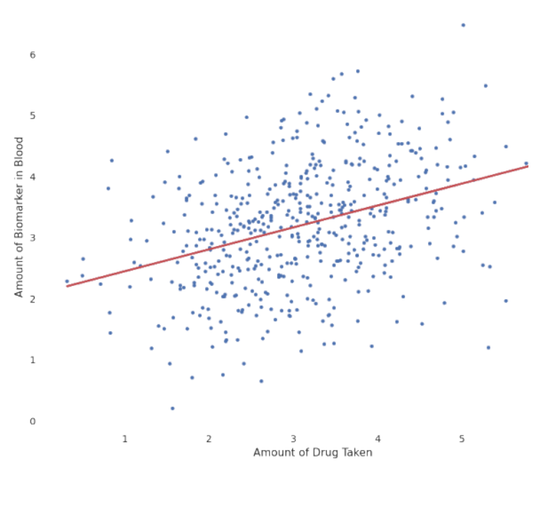
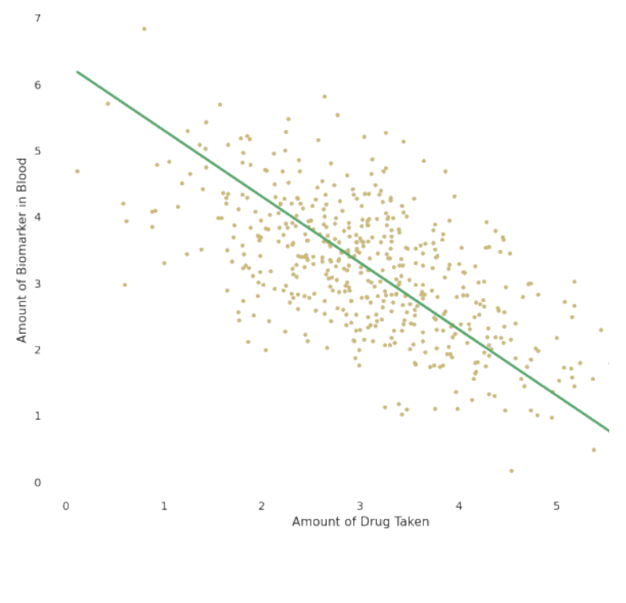

> 본 포스트는 서울대학교 GSDS **Sanghack Lee** 교수님의 *Causal Inference* 강의 자료 *Linear Structural Causal Models* 편을 바탕으로, 강의를 처음 듣는 독자도 논리적 흐름을 따라갈 수 있도록 재구성한 것입니다. 이론적 원전은 Judea Pearl의 *Causality: Models, Reasoning and Inference* (2003)이며, 경로 규칙은 Sewall Wright(1921), 조건부 IV는 Brito & Pearl(2002), 도구집합의 알고리즘화는 Kumor, Chen & Bareinboim(2019), 그리고 부록의 복잡도 논의는 García-Puente et al.(UAI 2010)과 Dörfler et al.(NeurIPS 2024)의 계보를 따릅니다.

## 한 줄 요약 (TL;DR)

> **"구조 함수를 선형으로 가정하는 순간 인과추론은 '관측 공분산 $\sigma$로 구조계수 $\lambda$를 풀 수 있는가'라는 연립방정식 문제가 되고, 그 풀이 가능성은 그래프만 보고 판정할 수 있습니다."**
>
> 앞선 강의들이 비모수 SCM 위에서 do-계산법이라는 무거운 도구로 식별을 다뤘다면, 이번 강의는 구조 함수 $f_i$가 선형이라는 **가정 하나**를 추가합니다. 그 대가로 얻는 것이 **Wright의 경로 규칙(1921)** 입니다. 두 변수의 공분산이 그래프 위 트렉(trek)을 따라간 계수 곱들의 합으로 분해되므로, 관측 가능한 $\sigma_{ij}$와 미지의 $(\lambda, \varepsilon)$ 사이에 다항 연립방정식이 세워집니다.
>
> 이 관점은 회귀에 대한 오래된 혼동도 정리해 줍니다. 최소제곱을 기호적으로 풀면 $\beta = \sigma_{xy}$ — **회귀계수는 그저 공분산일 뿐**이며, 그것이 구조계수와 같아지는 것은 그래프가 허락할 때뿐입니다. 언제 허락되는지를 규정한 것이 **단일문 기준**(직접효과)과 **뒷문 기준**(총효과)입니다.
>
> 회귀로도 안 될 때는 방정식을 푸는 방법 자체를 바꿉니다. **도구변수(IV) → 조건부 IV → 도구집합(Instrumental Sets)** 으로 나아가는 이 흐름의 핵심은, "풀 수 있는 부분 체계"를 **최대유량(max-flow)** 같은 그래프 알고리즘으로 효율적으로 찾아내는 것입니다. 그래서 선형 식별성은 **식별 가능 / 유한 식별 / 식별 불가**의 세 경우로 갈립니다.
>
> 마지막으로 부록은 정직한 한계를 남깁니다. 그래프 기준들은 다항시간이지만 **불완전**하고, 모든 경우를 푸는 그뢰브너 기저는 **이중 지수** 시간이 걸립니다. Dörfler et al.(2024)은 일반 식별 문제가 NP보다 어렵지만 **PSPACE 안에 있음**을 보여, 그 간극의 크기를 처음으로 정량화했습니다.

## 들어가며 (Introduction)

비모수(non-parametric) SCM은 구조 함수 $f_i$의 형태를 전혀 가정하지 않기 때문에 일반성이 크지만, 그만큼 식별(identification)을 위해 do-calculus와 같은 무거운 도구가 필요합니다. 이번 강의에서는 **구조 함수가 선형(linear)이라는 단 하나의 가정**을 추가합니다. 이 작은 변화가 인과추론을 **선형대수의 문제**로 바꾸어 놓으며, 그 결과 우리는 다음과 같은 질문에 매우 구체적으로 답할 수 있게 됩니다.

* 회귀계수(regression coefficient)는 **언제** 인과효과와 같아지고, **언제** 편향되는가?
* 관측된 공분산 $\sigma_{ij}$만으로 구조계수 $\lambda$를 **유일하게 풀 수 있는가**(식별 가능성)?
* 식별이 어려울 때, 도구변수(IV)·도구집합(Instrumental Set)·보조변수(Auxiliary Variable) 같은 그래프 기반 알고리즘을 어떻게 활용하는가?

이 글은 강의자료의 세 가지 큰 축 — **(1) 선형 SCM 소개, (2) 회귀가 인과효과를 찾을 수 있는 경우와 없는 경우, (3) 선형 SCM의 현대적 식별 알고리즘** — 을 그대로 따라가며, 결과만 제시된 수식들은 가능한 한 유도 과정을 모두 풀어서 설명하겠습니다.

---

## 1. 선형 구조적 인과모형 (Linear Structural Causal Models)

### 1.1 선형 SCM의 정의 (Definition)

선형 SCM은 **참값(ground-truth)을 나타내는 선형 방정식 체계**로 정의됩니다. 변수 $Y$를 그 직접 원인(direct cause)들 $X_i$의 선형결합으로 표현합니다.

$$
Y = \sum_{i} \lambda_{x_i y} X_i + E_y
$$

여기서 핵심 약속들은 다음과 같습니다.

* **$\lambda_{x_i y}$ (구조계수, Structural Coefficient):** $X_i$가 한 단위 변할 때 $Y$가 변하는 양, 즉 $X_i \to Y$의 직접 인과효과를 나타냅니다.
* **오차항 $E$ 간의 상관:** 오차들 사이의 모든 상관(correlation)은 **명시적으로** 지정됩니다. 즉 숨겨두지 않고 모형에 드러냅니다.
* **정규화(normalization) 가정 (WLOG):** 수식을 단순화하기 위해 데이터가 표준화되어 있다고 가정합니다.
  $$
  \mathbb{E}[X] = 0, \qquad \mathbb{E}[XX] = 1
  $$
  즉 평균이 0이고 분산이 1입니다. (여기서 $\mathbb{E}[XX]$는 $\mathbb{E}[X^2]$를 의미하며, 표준화된 변수에서는 분산과 같습니다.)
* **정규성(Gaussianity) 가정:** $E_y \sim \mathcal{N}$. 오차가 정규분포를 따르므로 **전체 분포가 공분산 행렬 $\Sigma$(성분 $\sigma_{ij}$)에 의해 완전히 결정**됩니다. 이 점이 매우 중요합니다 — 앞으로의 모든 식별 논의는 결국 "관측 가능한 $\sigma_{ij}$로 구조계수 $\lambda$를 풀 수 있는가"라는 형태로 환원되기 때문입니다.

### 1.2 비모수에서 선형으로 (Non-Parametric to Linear)

우리가 유일하게 바꾸는 것은 구조 함수 $f$를 **선형으로 만드는 것**뿐입니다.

$$
V_i \leftarrow f_i(\mathrm{pa}_i, u_i)
\quad\Longrightarrow\quad
V_i \leftarrow \sum_{V_j \in \mathrm{Pa}_i} \lambda_{ji} V_j + E_i
$$

* $\lambda_{ji}$는 **구조계수**라고 부릅니다.
* 외생변수 $U_i$ 대신 관례적으로 $E_i$로 표기를 바꿉니다.
* 모든 $\lambda_{ji}$를 알면, $V_j$가 $V_i$에 미치는 **인과효과를 곧바로 알 수 있습니다.** 즉 선형 SCM에서 인과추론은 "구조계수 찾기" 문제로 귀결됩니다.

### 1.3 예시: 그래프 위에 계수를 적기 (Example)

다음은 같은 구조를 비모수 SCM과 선형 SCM으로 각각 표현한 예입니다.

선형 SCM에서는 구조계수를 **그래프의 간선 위에 직접 적을 수 있고**, 그것만으로 모형이 완전히 명세됩니다.

### 1.4 잠재 교란과 양방향 간선 (Latent Confounding)

오차항 $E_i$와 $E_j$ 사이의 공분산은 $\varepsilon_{ij}$로 표기하며, 이는 **양방향 간선(bidirected edge)의 값**으로 그래프에 그려집니다.

$$
\varepsilon_{xy} = \mathbb{E}[E_x E_y]
$$

* $\varepsilon_{xy}$는 잠재변수의 공분산이므로 **관측 불가능(unobserved)** 합니다.
* 그러나 수식 전개에 유용하므로 구조계수처럼 그래프에 그립니다.
* 주의: 비모수 SCM에서 양방향 간선은 '명시적 잠재 공통원인'을 의미할 수 있었지만, 선형 SCM에서는 **오차 공분산**이라는 약속입니다.

### 1.5 선형 SCM에서의 개입 (Interventions)

$X \xrightarrow{\lambda} Y$ 구조에서 개입효과 $\mathbb{E}[Y \mid do(X = x)]$를 계산해 봅니다. 개입 $do(X=x)$는 $X$로 들어오는 구조방정식을 끊고 $X$를 상수 $x$로 고정하므로, $Y = \lambda X + E_y$에서 $X = x$를 대입합니다.

$$
\begin{aligned}
\mathbb{E}[Y \mid do(X=x)]
&= \int y\, P(Y=y \mid do(x))\, dy \\
&= \int y\, P(\lambda X + E_y = y \mid do(x))\, dy \\
&= \int y\, P(\lambda x + E_y = y)\, dy \qquad (X \text{는 } x \text{로 고정}) \\
&= \int (\lambda x + e)\, P(E_y = e)\, de \qquad (\text{치환 } e = y - \lambda x) \\
&= \lambda x \int P(E_y = e)\, de + \int e\, P(E_y = e)\, de \\
&= \lambda x \cdot 1 + \mathbb{E}[E_y] \\
&= \lambda x.
\end{aligned}
$$

* 둘째 줄에서 셋째 줄: 개입은 $X$의 값을 외부에서 $x$로 강제하므로, $Y$ 방정식 안의 $X$를 $x$로 치환합니다.
* 마지막에서 $\int P(E_y=e)de = 1$(확률밀도의 적분), $\mathbb{E}[E_y] = 0$(정규화 가정)을 사용했습니다.

더 간결하게는 기댓값의 선형성으로 곧바로 얻을 수 있습니다.

$$
\mathbb{E}[Y \mid do(X=x)] = \mathbb{E}[\lambda x + E_y] = \lambda x + \mathbb{E}[E_y] = \lambda x.
$$

**결론: 구조계수 $\lambda$가 곧 개입효과의 기울기입니다.** 따라서 인과추론의 목표는 $\lambda$를 알아내는 것입니다.

### 1.6 식별 문제의 정식화 (The Problem Statement)

선형 SCM의 식별 문제는 다음 세 가지로 구성됩니다.

* **그래프 $G$:** 무엇이 무엇의 원인인지, 어떤 변수가 미지의 공통원인을 갖는지에 대한 **가설적 인과구조**는 주어졌다고 가정합니다.
* **관측 데이터:** 관측 가능한 모든 변수의 측정값 집합 $\{(x^{(i)}, y^{(i)})\}_{i=1}^{N}$을 가지고 있습니다. 이로부터 공분산 $\sigma_{ij}$를 추정할 수 있습니다.
* **구조계수 $\lambda$:** 우리가 **알지 못하는** 대상이며, 바로 찾고자 하는 실제 인과효과입니다.

핵심 질문: **관측 가능한 $\sigma$들로부터 미지의 $\lambda$를 풀어낼 수 있는가?**

### 1.7 관측량과 미관측량의 연결 (Connecting Observed with Unobserved)

#### 교란이 없는 경우

$X \xrightarrow{\lambda} Y$ ($E_x \perp E_y$)에서 공분산 $\sigma_{xy}$를 계산합니다.

$$
\begin{aligned}
\sigma_{xy} = \mathbb{E}[XY]
&= \mathbb{E}[X(\lambda X + E_y)] \\
&= \mathbb{E}[\lambda XX + X E_y] \\
&= \lambda \underbrace{\mathbb{E}[XX]}_{=1} + \underbrace{\mathbb{E}[X E_y]}_{=0} \\
&= \lambda.
\end{aligned}
$$

* $\mathbb{E}[XX]=1$: 정규화 가정.
* $\mathbb{E}[XE_y]=0$: $X = E_x$이고 $E_x \perp E_y$이므로 $\mathbb{E}[E_x E_y]=0$.

따라서 교란이 없으면 **관측 공분산이 곧 구조계수**입니다: $\sigma_{xy} = \lambda$.

#### 교란이 있는 경우

이제 $X \leftrightarrow Y$ 양방향 간선($\varepsilon_{xy}$)이 추가되면,

$$
\begin{aligned}
\sigma_{xy} = \mathbb{E}[XY]
&= \mathbb{E}[X(\lambda X + E_y)] \\
&= \lambda \,\mathbb{E}[XX] + \mathbb{E}[X E_y] \\
&= \lambda + \mathbb{E}[E_x E_y] \\
&= \lambda + \varepsilon_{xy}.
\end{aligned}
$$

이번에는 $\mathbb{E}[E_x E_y] = \varepsilon_{xy} \neq 0$이므로 공분산이 **구조계수 + 교란항**으로 오염됩니다. 관측량 하나($\sigma_{xy}$)에 미지수가 둘($\lambda, \varepsilon_{xy}$)이므로 분리가 불가능합니다.

### 1.8 흥미로운 성질 (A Curious Property)

연쇄 구조 $X \xrightarrow{\lambda_{xz}} Z \xrightarrow{\lambda_{zy}} Y$를 봅니다. 먼저 $X \leftrightarrow Z$에 교란이 **없는** 경우:

$$
\begin{aligned}
\sigma_{xy} = \mathbb{E}[XY]
&= \mathbb{E}[X(\lambda_{zy} Z + E_y)] \\
&= \lambda_{zy}\,\mathbb{E}[XZ] + \underbrace{\mathbb{E}[X E_y]}_{=0} \\
&= \lambda_{zy}\,\mathbb{E}\big[X(\lambda_{xz} X + E_z)\big] \\
&= \lambda_{zy}\lambda_{xz}\,\mathbb{E}[XX] + \lambda_{zy}\,\mathbb{E}[X E_z] \\
&= \lambda_{zy}\lambda_{xz} + \lambda_{zy}\underbrace{\mathbb{E}[E_x E_z]}_{=0} \\
&= \lambda_{zy}\lambda_{xz}.
\end{aligned}
$$

**공분산이 경로 위 계수들의 곱**($\lambda_{xz}\lambda_{zy}$)으로 나타납니다. 이제 $X \leftrightarrow Z$에 교란 $\varepsilon_{xz}$가 **있는** 경우, 마지막 단계만 바뀝니다.

$$
\sigma_{xy} = \lambda_{zy}\lambda_{xz} + \lambda_{zy}\,\mathbb{E}[E_x E_z]
= \lambda_{zy}\lambda_{xz} + \lambda_{zy}\varepsilon_{xz}.
$$

즉 $X \to Z \to Y$ 경로($\lambda_{xz}\lambda_{zy}$)와 $X \leftrightarrow Z \to Y$ 경로($\varepsilon_{xz}\lambda_{zy}$)가 더해집니다.

### 1.9 경로와 공분산 (Paths and Covariances)

$Z \xrightarrow{\lambda_{zx}} X \xrightarrow{\lambda_{xy}} Y$이고 $Z \leftrightarrow Y$에 $\varepsilon_{zy}$가 있는 경우:

$$
\begin{aligned}
\sigma_{xy} = \mathbb{E}[XY]
&= \mathbb{E}[X(\lambda_{xy} X + E_y)] \\
&= \lambda_{xy}\,\mathbb{E}[XX] + \mathbb{E}[X E_y] \\
&= \lambda_{xy} + \mathbb{E}\big[(\lambda_{zx} Z + E_x)E_y\big] \\
&= \lambda_{xy} + \lambda_{zx}\underbrace{\mathbb{E}[E_z E_y]}_{=\varepsilon_{zy}} + \underbrace{\mathbb{E}[E_x E_y]}_{=0} \\
&= \lambda_{xy} + \lambda_{zx}\varepsilon_{zy}.
\end{aligned}
$$

![Figure: 경로와 공분산의 대응 관계를 보여주는 그래프입니다. 실선 화살표 $Z \xrightarrow{\lambda_{zx}} X$(초록)와 $X \xrightarrow{\lambda_{xy}} Y$(파랑)는 구조계수를 값으로 갖는 인과 간선이고, 위쪽의 빨간 점선 곡선 $Z \leftrightarrow Y$는 오차 공분산 $\varepsilon_{zy}$를 나타내는 양방향 간선입니다. 위에서 유도한 $\sigma_{xy} = \lambda_{xy} + \lambda_{zx}\varepsilon_{zy}$에서, 첫 항 $\lambda_{xy}$는 파란 직접 간선 $X \to Y$에, 둘째 항 $\lambda_{zx}\varepsilon_{zy}$는 초록 간선을 거꾸로 타고 빨간 점선으로 넘어가는 뒷문 경로 $X \leftarrow Z \leftrightarrow Y$에 대응합니다. 색을 따라가면 공분산의 각 항이 그래프 위 서로 다른 경로 하나하나와 일대일로 맞물린다는 것이 드러나며, 바로 이 관찰이 다음 절 Wright 규칙의 출발점입니다.](./images/figure03_paths_and_covariances.png)

여기서 핵심 관찰: **공분산의 각 항이 그래프의 경로 하나하나에 대응**한다는 것입니다.

### 1.10 트렉과 Wright의 규칙 (Treks & Wright's Rule)

위 관찰을 일반화한 것이 **Wright의 경로 규칙(1921)** 입니다.

> 두 변수 $X, Y$ 사이의 공분산은, 둘 사이의 모든 **트렉(trek)** — 즉 화살표 머리가 충돌하지 않는($\to \cdot \leftarrow$ 형태가 없는) 자기교차 없는 경로 — 위의 계수 곱의 합과 같다.

예컨대 §1.9의 그래프에서

$$
\sigma_{xy} = \underbrace{(X \xrightarrow{\lambda_{xy}} Y)}_{\lambda_{xy}} + \underbrace{(X \xleftarrow{\lambda_{zx}} Z \xleftrightarrow{\varepsilon_{zy}} Y)}_{\lambda_{zx}\varepsilon_{zy}} = \lambda_{xy} + \lambda_{zx}\varepsilon_{zy}.
$$

좀 더 복잡한 그래프(아래 그림)에서도 같은 원리로 모든 트렉을 더합니다.

$$
\sigma_{xy} = \lambda_{xy} + \lambda_{wx}\varepsilon_{wy} + \lambda_{zx}\lambda_{wz}\varepsilon_{wy}.
$$

::: {.callout-note}
## 정리 (Wright's Rules, 1921)

$$
\sigma_{xy} = \sum (\text{$X$와 $Y$ 사이의 모든 열린 경로를 따라 계산한 경로계수 곱})
$$

* $X$와 $Y$가 **d-분리(d-separated)** 되어 있으면 $\sigma_{xy} = 0$.
* 모형에 간선 $X \xrightarrow{\alpha} Y$가 있으면 $\sigma_{xy} = \alpha + (\text{다른 경로들})$. 따라서 간선 $\alpha$를 제거한 그래프 $G_{\alpha^-}$에서 $X, Y$가 d-분리되면 $\sigma_{xy} = \alpha$.
* Wright의 규칙은 **비순환(acyclic) 모형**에 대해 정의됩니다.
:::

세 번째 항목의 단서에 주의할 필요가 있습니다. 순환(cycle)이 있으면 같은 두 노드를 잇는 트렉이 무한히 많아져 "모든 경로의 합"이라는 표현 자체가 수렴을 따로 논해야 하는 급수가 되고, 그래서 Wright의 규칙은 비순환 모형에 한정해 진술됩니다. 두 번째 항목은 뒤에 나올 **단일문 기준**(§2.10)의 씨앗입니다 — 간선 하나만 지운 그래프에서 d-분리가 성립하면 그 간선의 계수가 공분산으로 그대로 읽힌다는 말이기 때문입니다.

#### 한 가지 더 복잡한 예시 (One More Example)

![Figure: Wright 규칙을 다섯 노드 그래프에 적용한 예시입니다. 실선 화살표는 구조계수를 값으로 갖는 인과 간선($W \xrightarrow{\lambda_{wv}} V$, $W \xrightarrow{\lambda_{wx}} X$, $X \xrightarrow{\lambda_{xz}} Z$, $Z \xrightarrow{\lambda_{zy}} Y$, $V \xrightarrow{\lambda_{vy}} Y$)이고, $X$와 $Z$를 잇는 아래쪽 점선 곡선은 오차 공분산 $\varepsilon_{xz}$를 나타내는 양방향 간선입니다. $X$에서 $Y$로 가는 트렉은 세 개뿐입니다 — 앞쪽 경로 $X \to Z \to Y$($\lambda_{xz}\lambda_{zy}$), 그 경로의 첫 간선을 양방향 간선으로 갈아탄 $X \leftrightarrow Z \to Y$($\varepsilon_{xz}\lambda_{zy}$), 그리고 위쪽으로 크게 도는 $X \leftarrow W \to V \to Y$($\lambda_{wx}\lambda_{wv}\lambda_{vy}$). 그림 아래의 등식은 이 세 항을 그대로 더한 결과이며, 앞의 두 항이 $\lambda_{zy}$로 묶여 $(\lambda_{xz} + \varepsilon_{xz})\lambda_{zy}$로 적혀 있습니다.](./images/figure05_one_more_example_trek.png)

$$
\sigma_{xy} = (\lambda_{xz} + \varepsilon_{xz})\lambda_{zy} + \lambda_{wx}\lambda_{wv}\lambda_{vy}.
$$

트렉을 셀 때 흔히 놓치는 지점을 짚어 두겠습니다. $X \to Z \leftarrow \cdots$ 처럼 화살표 머리가 한 노드에서 충돌하는(콜라이더) 경로는 **트렉이 아니므로 합산에서 빠집니다.** 위 그래프에서 $X \to Z$와 $Y \to Z$가 함께 있었다면 그 경로는 세어서는 안 됩니다. 트렉은 "어떤 정점에서 출발해 화살표를 거슬러 올라갔다가 다시 내려오는" 형태 — 즉 $\leftarrow \cdots \leftarrow \circ \to \cdots \to$ 모양 — 만 허용합니다.

---

## 2. 선형 회귀와 인과효과 (Linear Regression)

이 절의 구성(강의 내 두 번째 Overview)은 다음과 같습니다: **선형 회귀 → 알고리즘적 식별 → IV에서 도구집합으로 → 보조변수 기법.** 먼저 회귀가 인과효과를 줄 때와 그렇지 않을 때를 직관적인 예시로 살펴봅니다.

### 2.1 예시: 의료 연구자 (The Medical Researcher)

어떤 신약이 질병 치료에 도움이 되는지 판단하려는 의료 연구자가 있다고 합시다. 그의 권고는 전국의 의사들이 따르게 됩니다.

* **Step 1 — 데이터 수집:** 약을 복용한 환자들에 대해 (1) 복용량과 (2) 혈중 바이오마커(항체) 양을 측정합니다.

* **Step 2 — 회귀 수행:** $X$=복용량, $Y$=바이오마커로 회귀 $Y = \beta X + e$를 적합하니 $\beta = 0.375$. 약이 유익해 보여 사용을 승인합니다.

* **Step 3 — 전 인구에 투약:** 약을 모든 사람에게 투여하자, 결과는 기울기 $-1$의 명확한 음(−)의 연관으로 나타납니다. **이 약은 오히려 해롭습니다!**

* **무슨 일이 일어난 걸까?** 음의 효과가 원래 데이터에서 보이지 않은 이유는 데이터 부족이 아닙니다. 원래 회귀(빨간 선)가 '실패'한 이유, 그리고 참 인과효과(초록 선)를 얻을 방법이 있는지가 핵심 질문입니다.

### 2.2 핵심 가정: 교란의 부재 (Key Assumption: Lack of Confounding)

회귀계수에 인과적 의미를 부여할 때 **암묵적으로** 가정되는 세계 모형은 다음과 같습니다.

$$
X \leftarrow E_x, \qquad Y \leftarrow \lambda_{xy} X + E_y, \qquad E_x \perp E_y.
$$

이때 공분산은 §1.7에서 본 대로

$$
\sigma_{xy} = \mathbb{E}[XY] = \lambda_{xy}\underbrace{\mathbb{E}[XX]}_{=1} + \underbrace{\mathbb{E}[X E_y]}_{=0} = \lambda_{xy}
$$

가 되어 회귀가 인과효과를 정확히 줍니다.

### 2.3 참 모형: 교란이 있을 때 (The Ground-Truth Model)

그러나 $X$와 $Y$ 사이 교란의 부재를 확신할 수 없다면, 대응하는 그래프는 $E_x, E_y$가 상관된 모형입니다. 이때 회귀 $Y = \beta X + e$는 **편향된** 답을 줍니다.

$$
\sigma_{xy} = \lambda_{xy}\,\mathbb{E}[XX] + \mathbb{E}[E_x E_y] = \lambda_{xy} + \varepsilon_{xy}.
$$

약의 효과($\lambda_{xy}$)와 교란($\varepsilon_{xy}$)을 분리하는 것은 **증명 가능하게 불가능(provably impossible)** 합니다. 즉 $\lambda_{xy}$는 **식별 불가능(not identifiable)** 합니다. (Figure 7의 음/양 역전이 바로 이 $\varepsilon_{xy}$ 때문입니다.)

### 2.4 회귀는 무엇을 계산하는가 (What does Regression Compute?)

$Y = \beta X + e$에서 $\beta$가 실제로 무엇인지 최소제곱으로 기호적으로 풀어 봅니다. 손실은

$$
\begin{aligned}
\mathbb{E}[(Y - \beta X)^2]
&= \mathbb{E}[YY - 2\beta XY + \beta^2 XX] \\
&= \mathbb{E}[YY] - 2\beta\,\mathbb{E}[XY] + \beta^2\,\mathbb{E}[XX] \\
&= 1 - 2\beta\sigma_{xy} + \beta^2 \qquad (\mathbb{E}[YY]=\mathbb{E}[XX]=1,\ \mathbb{E}[XY]=\sigma_{xy}).
\end{aligned}
$$

$\beta$에 대해 미분하여 0으로 놓으면,

$$
\frac{\partial}{\partial \beta}\big(1 - 2\beta\sigma_{xy} + \beta^2\big) = -2\sigma_{xy} + 2\beta = 0
\quad\Longrightarrow\quad \boxed{\beta = \sigma_{xy}}.
$$

**회귀계수는 그저 $X$와 $Y$의 공분산일 뿐입니다.** (표준화 가정 하에서는 상관계수와 같습니다.)

### 2.5 회귀식 vs 구조식: 세기의 혼동 (Confusion of the Century)

* **회귀식 (Regression Equation):**
  $$
  Y = \beta X + e, \qquad e \perp X
  $$
  풀면 $\beta = \sigma_{xy}$이며, 이 해를 $r_{yx}$로 표기합니다($Y$를 $X$에 회귀한 해). **인과적 주장을 전혀 하지 않습니다.** $e \perp X$는 가정이 아니라, 최소제곱 잔차의 정의에서 따라오는 성질입니다.
* **구조식 (Structural Equation):**
  $$
  Y = \lambda X + E_y, \qquad \mathbb{E}[Y \mid do(X)] = \lambda X
  $$
  개입 분포에 대한 주장을 하며, 따라서 **검증 가능(testable)** 하고 **반증 가능(falsifiable)** 합니다.

같은 형태의 방정식이지만 의미가 전혀 다릅니다. $r_{yx}$는 관측적 양, $\lambda$는 인과적 양입니다.

### 2.6 회귀의 암묵적 가정 (The Implicit Assumption)

회귀로 인과적 주장을 할 때 암묵적으로 가정되는 모형은 다음과 같이 **공통의 결과를 향해 화살표가 모이는** 구조입니다.

$$
Y = \beta_1 X_1 + \beta_2 X_2 + e \quad\Longrightarrow\quad \beta_1 = b_1,\ \beta_2 = b_2.
$$

### 2.7 경고: 올바른 그래프를 쓰고 있는가 (Make sure you have the right graph)

그런데 화살표 방향이 뒤집혀 **$Y$가 $X_1, X_2$의 공통원인**인 경우($Y \to X_1$, $Y \to X_2$, 즉 $X_1 \leftarrow Y \to X_2$)를 봅시다.

단순회귀로는 $r_{yx_1} = b_1$, $r_{yx_2} = b_2$가 나오지만, **다중회귀** $Y = \beta_1 X_1 + \beta_2 X_2 + e$를 하면 계수가 다음과 같이 왜곡됩니다.

$$
\beta_1 = \frac{b_1(1 - b_2^2)}{1 - b_1^2 b_2^2}, \qquad
\beta_2 = \frac{b_2(1 - b_1^2)}{1 - b_1^2 b_2^2}.
$$

**무엇을 함께 통제하느냐에 따라 회귀계수의 값과 의미가 완전히 달라집니다.** 올바른 그래프를 모르면 회귀는 위험합니다.

### 2.8 회귀로 d-분리 검정하기 (Testing D-Separation with Regression)

회귀는 d-분리와 깊게 연결됩니다.

$$
(X \perp Y \mid Z) \quad\Longleftrightarrow\quad r_{yx\cdot z} = 0.
$$

검정 방법은 다음 회귀를 수행하는 것입니다.

$$
Y = \beta X + \alpha Z.
$$

* $\beta = 0$이면 $Z$가 $X$와 $Y$를 d-분리합니다.
* $\beta \neq 0$이면 $(X \not\perp Y \mid Z)$입니다.

여기서 $r_{yx\cdot z}$는 "$Z$를 통제한 뒤 $Y$를 $X$에 회귀한 부분회귀계수(partial regression coefficient)"를 뜻합니다.

### 2.9 회귀는 조심해서 (Be Careful with Regression)

같은 그래프에서도 **어떤 변수를 회귀에 포함하느냐**에 따라 $X \to Y$의 추정치가 달라집니다. 아래 그림의 모형($W$가 $X, Y$의 공통원인, $Z$는 두 양방향 간선이 만나는 콜라이더)을 예로 들면:

* **$Y = \beta X + e$** : $\beta = \sigma_{xy} = \lambda_{xy} + \lambda_{wx}\lambda_{wy}$ — 뒷문 경로 $X \leftarrow W \to Y$가 열려 있어 그만큼 편향됩니다.
* **$Y = \beta X + \alpha W + \gamma Z + e$** : $\beta = \lambda_{xy} - \dfrac{\varepsilon_{xz}\varepsilon_{zy}}{1 - \lambda_{wx}^2 - \varepsilon_{xz}^2}$ — $W$를 넣어 뒷문은 막았지만, 콜라이더 $Z$까지 조건화하는 바람에 $X \leftrightarrow Z \leftrightarrow Y$ 경로가 새로 열려 다른 편향이 생깁니다.
* **$Y = \beta X + \alpha W + e$** : $\beta = \lambda_{xy}$ — **정확히 식별**됩니다.

::: {.callout-warning}
## 통제 변수는 많을수록 좋다는 오해

세 번째 회귀는 두 번째 회귀보다 통제 변수가 **적은데도** 정답을 줍니다. "가능한 변수를 다 넣고 통제하면 안전하다"는 직관이 정면으로 깨지는 지점입니다. $Z$처럼 콜라이더 역할을 하는 변수는 조건화하는 순간 닫혀 있던 경로를 열어 없던 편향을 만들어냅니다. 변수를 더 많이 통제한다고 항상 좋은 것이 아니며, **그래프가 시키는 대로** 정확한 집합을 통제해야 합니다.
:::

### 2.10 단일문 기준 (Single-Door Criterion)

그렇다면 회귀를 **올바르게** 쓰려면 어떤 변수를 통제해야 할까요? 이를 그래프로 규정한 것이 단일문 기준입니다. 모형 $Z \xrightarrow{\lambda_{zx}} X \xrightarrow{\lambda_{xy}} Y$, $Z \leftrightarrow Y(\varepsilon_{zy})$에서 $\lambda_{xy}$를 찾고자 합니다.

단순회귀로는 $r_{yx} = \sigma_{xy} = \lambda_{xy} + \lambda_{zx}\varepsilon_{zy}$로 편향됩니다. 대신 $Z$를 함께 넣어 $Y = \alpha X + \beta Z + e$를 풀어 봅니다. 손실은

$$
\mathbb{E}[(Y - \alpha X - \beta Z)^2] = 1 - 2\alpha\sigma_{xy} - 2\beta\sigma_{yz} + 2\alpha\beta\sigma_{xz} + \alpha^2 + \beta^2.
$$

편미분을 0으로 놓으면,

$$
\frac{\partial}{\partial\alpha} = 2\alpha - 2\sigma_{xy} + 2\beta\sigma_{xz} = 0, \qquad
\frac{\partial}{\partial\beta} = 2\beta - 2\sigma_{yz} + 2\alpha\sigma_{xz} = 0,
$$

즉 정규방정식(normal equations)

$$
\begin{cases}
\sigma_{xy} = \alpha + \beta\sigma_{xz} \\
\sigma_{yz} = \beta + \alpha\sigma_{xz}
\end{cases}
$$

이 얻어집니다. 여기에 Wright 규칙으로 계산한 $\sigma_{xy} = \lambda_{xy} + \lambda_{zx}\varepsilon_{zy}$, $\sigma_{yz} = \lambda_{xy}\lambda_{zx} + \varepsilon_{zy}$, $\sigma_{xz} = \lambda_{zx}$를 대입하면

$$
\begin{cases}
\lambda_{xy} + \lambda_{zx}\varepsilon_{zy} = \alpha + \beta\lambda_{zx} \\
\lambda_{xy}\lambda_{zx} + \varepsilon_{zy} = \alpha\lambda_{zx} + \beta
\end{cases}
\quad\Longrightarrow\quad
\boxed{\alpha = \lambda_{xy},\quad \beta = \varepsilon_{zy}}.
$$

따라서 $Z$를 통제한 회귀계수 $\alpha$가 바로 구조계수 $\lambda_{xy}$가 됩니다.

::: {.callout-note}
## 정리 (Single-Door — Identification of Direct Effects, Pearl 2003)

$G$를 경로 다이어그램, $\lambda$를 간선 $X \to Y$의 경로계수라 하고, $G_\lambda$를 $X \to Y$를 제거한 다이어그램이라 하자. 다음을 만족하는 집합 $Z$가 존재하면 $\lambda$는 식별 가능하다.

* $Z$는 $Y$의 후손(descendant)을 포함하지 않으며,
* $Z$는 $G_\lambda$에서 $X$와 $Y$를 d-분리한다.

이때 $\lambda = r_{yx \cdot z}$.
:::

두 조건이 각각 무엇을 막고 있는지가 중요합니다. 두 번째 조건은 "$X \to Y$ 간선을 지우고 나면 $X$와 $Y$를 잇는 다른 통로가 남지 않아야 한다"는 요구로, Wright 규칙에 따라 $r_{yx \cdot z}$에 $\lambda$ 외의 항이 섞이지 않게 합니다. 첫 번째 조건은 $Y$의 후손을 조건화해 콜라이더를 여는 사고를 원천 차단합니다 — §2.9에서 $Z$를 통제하는 순간 새 편향이 생겼던 것이 정확히 이 조건을 어긴 경우입니다.

#### 예시 (Single-Door — Examples)

* $A \to Y$, $A \leftarrow B \to Y$ 형태(공통원인 $B$): $\lambda_{ay} = r_{ya \cdot b}$ ($B$를 통제).
* 대칭적으로 $\lambda_{by} = r_{yb \cdot a}$.
* $X \xrightarrow{\lambda_{xy}} Y$이고 다른 경로가 없으면 단순히 $\lambda_{xy} = r_{yx}$.
* $W \xrightarrow{\lambda_{wz}} Z$를 찾을 때 추가 경로가 있으면 적절한 집합을 조건화하여 $\lambda_{wz} = r_{zw \cdot yx}$처럼 식별합니다.

### 2.11 뒷문 기준 (Back-Door Criterion)

단일문이 **직접효과**($\lambda$, 하나의 간선)를 식별한다면, 뒷문 기준은 **총효과(total effect)** 를 식별합니다.

::: {.callout-note}
## 정리 (Back-Door — Identification of Total Effects, Pearl 2003)

인과 다이어그램 $G$의 두 변수 $X, Y$에 대해, 다음을 만족하는 측정 집합 $Z$가 존재하면 $X$가 $Y$에 미치는 총효과는 식별 가능하다.

* $Z$의 어떤 원소도 $X$의 후손이 아니며,
* $Z$는 부분그래프 $G_{\underline{X}}$($X$에서 나가는 간선을 제거한 그래프)에서 $X$와 $Y$를 d-분리한다.

이때 총효과는 $r_{yx \cdot z}$로 주어진다.
:::

**단일문 vs 뒷문 비교:** 단일문은 간선을 제거한 $G_\lambda$를 보고 **직접효과**를, 뒷문은 나가는 화살을 제거한 $G_{\underline{X}}$를 보고 **총효과**를 다룹니다. 두 기준이 "어느 그래프에서 d-분리를 요구하는가"에서만 갈린다는 점이 인상적입니다 — $G_\lambda$는 간선 하나만 지우므로 나머지 인과 경로를 살려 두고 그 간선만 도려내고, $G_{\underline{X}}$는 $X$에서 나가는 모든 화살을 지우므로 $X \to \cdots \to Y$의 모든 인과 경로를 통째로 남긴 채 뒷문만 봅니다.

![Figure: 뒷문 기준을 적용하는 예시 그래프입니다. $X$에서 $Y$로는 직접 간선 $\lambda_{xy}$와 매개변수 $Z$를 거치는 경로 $X \xrightarrow{\lambda_{xz}} Z \xrightarrow{\lambda_{zy}} Y$가 함께 나 있고, 위쪽의 $W$는 $X$와 점선 양방향 간선 $\varepsilon_{xw}$로, $Y$와는 실선 $\lambda_{wy}$와 실선 $\lambda_{wx}$로 이어져 $X \leftarrow W \to Y$ 형태의 뒷문 경로를 만듭니다. 아래쪽 $Z \leftrightarrow Y$의 점선 $\varepsilon_{zy}$는 매개 경로 위에 얹힌 또 다른 오차 상관입니다. $X$가 $Y$에 미치는 총효과는 두 인과 경로의 합 $\lambda_{xz}\lambda_{zy} + \lambda_{xy}$이며, 뒷문을 만드는 $W$만 조건화한 회귀 $r_{yx \cdot w}$가 정확히 이 값을 줍니다. 매개변수 $Z$는 통제하지 **않는다**는 점이 중요합니다 — 통제하면 간접효과가 차단되어 총효과가 아니라 직접효과에 가까운 값이 나옵니다.](./images/figure13_backdoor_total_effect.png)

* 총효과 $= \lambda_{xz}\lambda_{zy} + \lambda_{xy}$ (직접 + 간접).
* 뒷문 경로를 막는 $W$를 통제하여 $r_{yx \cdot w}$로 식별합니다.

---

## 3. 알고리즘적 식별 방법 (Algorithmic Identification Methods)

### 3.1 선형 식별의 방정식 (The Equations of Linear Identification)

$Z \to X \to Y$, $Z \leftrightarrow Y(\varepsilon_{zy})$ 모형에서 (표준화로 대각이 1인) 공분산 행렬을 Wright 규칙으로 쓰면:

$$
\Sigma =
\begin{pmatrix}
\sigma_{xx} & \sigma_{xy} & \sigma_{xz} \\
\sigma_{yx} & \sigma_{yy} & \sigma_{yz} \\
\sigma_{zx} & \sigma_{zy} & \sigma_{zz}
\end{pmatrix}
=
\begin{pmatrix}
1 & \lambda_{xy} + \lambda_{zx}\varepsilon_{zy} & \lambda_{zx} \\
\lambda_{xy} + \lambda_{zx}\varepsilon_{zy} & 1 & \lambda_{zx}\lambda_{xy} + \varepsilon_{zy} \\
\lambda_{zx} & \lambda_{zx}\lambda_{xy} + \varepsilon_{zy} & 1
\end{pmatrix}.
$$

* 좌변 $\Sigma$의 성분들은 **계산 가능(computable)** — 데이터에서 추정됩니다.
* 우변은 **미관측 파라미터들의 식(expressions with unobservables)** $\lambda, \varepsilon$로 이루어져 있습니다.

식별이란, 이 등식 체계를 풀어 미관측 $\lambda$를 관측 $\sigma$로 표현하는 일입니다.

### 3.2 식별의 일반적 아이디어 (The General Idea)

위 행렬에서 독립적인 방정식만 추리면

$$
\sigma_{xz} = \lambda_{zx}, \qquad
\sigma_{xy} = \lambda_{xy} + \lambda_{zx}\varepsilon_{zy}, \qquad
\sigma_{zy} = \lambda_{zx}\lambda_{xy} + \varepsilon_{zy}.
$$

* 첫 식에서 곧바로 $\lambda_{zx} = \sigma_{xz}$를 **이미 알게** 됩니다.
* 이를 나머지 두 식에 대입하면
  $$
  \sigma_{xy} = \lambda_{xy} + \sigma_{xz}\varepsilon_{zy}, \qquad
  \sigma_{zy} = \sigma_{xz}\lambda_{xy} + \varepsilon_{zy}.
  $$
* 이제 두 미지수 $\lambda_{xy}, \varepsilon_{zy}$에 대한 **두 개의 완전계수(full-rank) 선형방정식**이므로 (가우스 소거법으로) 유일하게 풀립니다. → **식별 가능.**

이처럼 "이미 푼 파라미터를 다른 식에 대입"하는 연쇄가 식별 알고리즘의 핵심 동작입니다.

### 3.3 비식별성 (Non-Identifiability)

반면 $X \xrightarrow{\lambda_{xy}} Y$, $X \leftrightarrow Y(\varepsilon_{xy})$만 있는 모형에서는

$$
\begin{pmatrix} \sigma_{xx} & \sigma_{xy} \\ \sigma_{yx} & \sigma_{yy} \end{pmatrix}
=
\begin{pmatrix} 1 & \lambda_{xy} + \varepsilon_{xy} \\ \lambda_{xy} + \varepsilon_{xy} & 1 \end{pmatrix}.
$$

유효한 정보는 $\sigma_{xy} = \lambda_{xy} + \varepsilon_{xy}$ 하나인데 미지수는 둘입니다. **하나의 방정식에 두 미지수** → 같은 공분산을 주는 $(\lambda_{xy}, \varepsilon_{xy})$가 무한히 많아 식별 불가능합니다.

### 3.4 유한 식별성 (Finite Identifiability)

어떤 그래프에서는 식별 방정식이 **비선형(예: 이차)** 이 되어 해가 **유한 개** 나옵니다. 강의의 예시 그래프($X$가 $W, Z, Y$의 부모이고, 그 세 간선 각각에 양방향 간선이 겹쳐 있는 구조)를 봅시다.

Wright 규칙을 이 그래프에 적용하면 6개의 미지수($\lambda_{xw}, \lambda_{xz}, \lambda_{xy}, \varepsilon_{xw}, \varepsilon_{xz}, \varepsilon_{xy}$)에 대한 6개의 방정식이 나옵니다.

$$
\begin{aligned}
\sigma_{xw} &= \lambda_{xw} + \varepsilon_{xw}, &\qquad
\sigma_{wz} &= \lambda_{xw}\lambda_{xz} + \lambda_{xz}\varepsilon_{xw} + \lambda_{xw}\varepsilon_{xz}, \\
\sigma_{xz} &= \lambda_{xz} + \varepsilon_{xz}, &\qquad
\sigma_{wy} &= \lambda_{xw}\lambda_{xy} + \lambda_{xw}\varepsilon_{xy} + \lambda_{xy}\varepsilon_{xw}, \\
\sigma_{xy} &= \lambda_{xy} + \varepsilon_{xy}, &\qquad
\sigma_{zy} &= \lambda_{xz}\lambda_{xy} + \lambda_{xz}\varepsilon_{xy} + \lambda_{xy}\varepsilon_{xz}.
\end{aligned}
$$

왼쪽 열의 세 식은 $X$와 각 자식 사이의 공분산으로, 모두 "$\lambda + \varepsilon$" 형태라 단독으로는 두 항을 분리할 수 없습니다. 오른쪽 열의 세 식은 자식들끼리의 공분산인데, 여기서는 $\lambda$와 $\varepsilon$의 **곱**이 등장합니다. 미지수의 곱이 섞이는 순간 체계는 선형이 아니게 되고, 다른 미지수를 소거해 나가면 $\lambda_{xy}$에 대한 다음 이차식이 남습니다.

$$
0 = (\sigma_{xw}\sigma_{xz} - \sigma_{wz})\lambda_{xy}^2 + 2(\sigma_{xy}\sigma_{wz} - \sigma_{xw}\sigma_{xz}\sigma_{xy})\lambda_{xy} + (\sigma_{yw}\sigma_{xz}\sigma_{xy} + \sigma_{yz}\sigma_{xy}\sigma_{xy} - \sigma_{xy}^2\sigma_{wz} - \sigma_{yz}\sigma_{yw}).
$$

이차방정식이므로 근의 공식으로 두 개의 후보 해를 얻습니다. 계수를 $a = \sigma_{xw}\sigma_{xz} - \sigma_{wz}$, $2b = 2(\sigma_{xy}\sigma_{wz} - \sigma_{xw}\sigma_{xz}\sigma_{xy})$, $c = (\sigma_{yw}\sigma_{xz}\sigma_{xy} + \sigma_{yz}\sigma_{xy}^2 - \sigma_{xy}^2\sigma_{wz} - \sigma_{yz}\sigma_{yw})$로 두면 $\lambda_{xy} = (-b \pm \sqrt{b^2 - ac})/a$이며, 풀어 쓰면 다음과 같습니다.

$$
\lambda_{xy} = \frac{-(\sigma_{xy}\sigma_{wz} - \sigma_{xw}\sigma_{xz}\sigma_{xy}) \pm \sqrt{(\sigma_{xy}\sigma_{wz} - \sigma_{xw}\sigma_{xz}\sigma_{xy})^2 - (\sigma_{xw}\sigma_{xz} - \sigma_{wz})(\sigma_{yw}\sigma_{xz}\sigma_{xy} + \sigma_{yz}\sigma_{xy}^2 - \sigma_{xy}^2\sigma_{wz} - \sigma_{yz}\sigma_{yw})}}{(\sigma_{xw}\sigma_{xz} - \sigma_{wz})}.
$$

즉 관측 데이터와 일치하는 $\lambda_{xy}$ 값이 무한히 많지도(→ 비식별) 유일하지도(→ 식별) 않은, **최대 두 개**로 좁혀지는 중간 사례입니다.

### 3.5 선형 식별성의 3가지 경우 (The 3 Cases)

* **식별 가능(Identifiable):** 관측 데이터와 일치하는 $\lambda_{xy}$ 값이 **유일**.
* **유한 식별(Finite ID):** 일치하는 값이 **유한 개**.
* **식별 불가(Not Identifiable):** 일치하는 값이 **무한**.

### 3.6 선형 SCM에서의 식별 — 그래프적 접근 (Identification in Linear SCM)

§3.2의 세 방정식은 손으로 풀 수 있을 만큼 작았습니다. 그러나 노드가 하나만 늘어도 체계는 금세 감당하기 어려워집니다. 아래는 §3.2보다 노드가 하나 많을 뿐인 그래프인데, 미지수와 방정식이 각각 6개로 불어납니다.

![Figure: 노드 네 개짜리 그래프 하나가 만들어내는 식별 방정식 체계입니다. 왼쪽 그래프에서 실선 화살표는 구조계수 $\lambda_{wz}(W \to Z)$, $\lambda_{wx}(W \to X)$, $\lambda_{zx}(Z \to X)$, $\lambda_{xy}(X \to Y)$이고, 점선 양방향 간선은 오차 공분산 $\varepsilon_{wy}(W \leftrightarrow Y)$와 $\varepsilon_{zx}(Z \leftrightarrow X)$입니다. 오른쪽에 나열된 여섯 등식은 Wright 규칙으로 각 변수쌍의 공분산을 이 여섯 파라미터로 표현한 것으로, 위에서 아래로 갈수록 항이 중첩되어 마지막 $\sigma_{xy} = (\lambda_{wz}\lambda_{zx} + \lambda_{wx})\varepsilon_{wy} + \lambda_{xy}$처럼 여러 파라미터의 곱이 뒤엉킵니다. 왼쪽은 사람이 한눈에 읽는 그림, 오른쪽은 그 그림이 강제하는 6개 미지수·6개 방정식의 다항 체계이며, 식별이란 이 오른쪽을 $\lambda_{xy}$에 대해 푸는 일이라는 것을 나란히 보여 줍니다.](./images/figure16_identification_six_equations.png)

$$
\begin{aligned}
\sigma_{wz} &= \lambda_{wz}, \\
\sigma_{wx} &= \lambda_{wx} + \lambda_{wz}\lambda_{zx}, \\
\sigma_{zx} &= \lambda_{zx} + \varepsilon_{zx} + \lambda_{wz}\lambda_{wx}, \\
\sigma_{wy} &= (\lambda_{wx} + \lambda_{wz}\lambda_{zx})\lambda_{xy} + \varepsilon_{wy}, \\
\sigma_{zy} &= (\lambda_{zx} + \varepsilon_{zx} + \lambda_{wz}\lambda_{wx})\lambda_{xy} + \lambda_{wz}\varepsilon_{wy}, \\
\sigma_{xy} &= (\lambda_{wz}\lambda_{zx} + \lambda_{wx})\varepsilon_{wy} + \lambda_{xy}.
\end{aligned}
$$

원리적으로는 이런 다항 방정식 체계를 컴퓨터 대수(computer algebra)로 풀면 됩니다. 그러나 이 방법은 **파라미터 수에 대해 이중 지수적(doubly exponential)** 복잡도를 가져 실용적이지 않습니다(Bardet 2002; García-Puente et al. 2010 — 자세한 내용은 부록 C).

::: {.callout-important}
## 식별 알고리즘의 목표

전체 체계를 통째로 푸는 대신, 풀 수 있는 **부분 방정식 체계(solvable subsystems)** 또는 **연쇄적 대입(series of substitutions)** 을 효율적으로 찾아내는 패턴을 발견하는 것. 그리고 그 패턴을 방정식이 아니라 **그래프적 기준(graphical criteria)** 으로 표현하는 것.
:::

위 체계에서도 첫 식 $\sigma_{wz} = \lambda_{wz}$가 곧바로 하나를 확정해 주고, 그 값을 둘째 식에 넣으면 $\lambda_{wx}$가 풀리는 식으로 연쇄가 이어집니다. 이 "먼저 풀리는 것부터 풀어 대입한다"는 순서를 그래프만 보고 알아낼 수 있다면, 다항 체계를 직접 건드릴 필요가 없습니다. 다음 절들에서 이러한 그래프적 기준 — IV, 조건부 IV, 도구집합, 보조변수 — 을 차례로 봅니다.

---

## 4. IV에서 도구집합으로 (IV to Instrumental Sets)

### 4.1 출발점: 도구변수 (Instrumental Variables)

의료 연구자 예시로 돌아가, 환자의 복용량에 영향을 주는 **독립적인 의사 권고** 변수 $Z$가 추가되었다고 합시다. 그래프는 $Z \xrightarrow{\lambda_{zx}} X \xrightarrow{\lambda_{xy}} Y$이고 $X \leftrightarrow Y(\varepsilon_{xy})$입니다.

::: {.callout-note}
## 정의 (Instrumental Variable, Pearl 2003 p.248)

변수 $Z$가 $X \to Y$의 $\lambda_{xy}$에 대한 IV이려면, 부분그래프 $G_{\lambda_{xy}}$($X \to Y$ 간선을 제거한 그래프)에서

* $Z$가 $Y$와 **d-분리**되고,
* $Z$가 $X$와는 **d-분리되지 않아야** 한다.
:::

직관적으로 $Z$는 "오직 $X$를 통해서만 $Y$에 영향을 주는" 외부 변동의 원천입니다. 두 조건은 계량경제학에서 익숙한 배제 제약(exclusion restriction)과 관련성(relevance)에 각각 대응하며, 여기서는 둘 다 **그래프에서 기계적으로 확인 가능한** 형태로 진술되어 있다는 점이 중요합니다.

### 4.2 2단계 최소제곱 (2-Stage Least Squares)

IV로 $\lambda_{xy}$를 추정하는 방법은 두 가지로 볼 수 있습니다.

**방법 1 — 비율로 직접:** Wright 규칙에서 $\sigma_{zy} = \lambda_{zx}\lambda_{xy}$, $\sigma_{zx} = \lambda_{zx}$이므로

$$
\lambda_{xy} = \frac{\sigma_{zy}}{\sigma_{zx}} = \frac{r_{zy}}{r_{zx}}.
$$

**방법 2 — 2단계 회귀(2SLS):**

* **1단계:** $X$를 $Z$에 회귀. $X = \alpha Z + e \Rightarrow \alpha = \sigma_{zx}$. 적합값은 $\hat{X} = \sigma_{zx} Z$.
* **2단계:** 원래 $X$ 대신 $\hat{X} = \sigma_{zx} Z$를 넣어 $Y$를 회귀.
  $$
  Y = \beta(\sigma_{zx} Z) + e \quad\Longrightarrow\quad \beta = \frac{\sigma_{zy}}{\sigma_{zx}}.
  $$

1단계가 $X$에서 **교란과 무관한 변동분**($Z$로 설명되는 부분)만 뽑아내고, 2단계가 그 정제된 변동으로 $Y$를 설명하므로 교란을 우회합니다.

### 4.3 조건부 도구변수 (Conditional Instrumental Variables)

순수 IV가 없을 때, 어떤 집합 $W$를 조건화하면 IV 조건을 만족시킬 수 있습니다.

::: {.callout-note}
## 정의 (Conditional IV, Brito & Pearl 2002)

변수 $Z$가 집합 $W$가 주어졌을 때 $X \to Y$의 $\lambda_{xy}$에 대한 조건부 IV이려면,

* $W$는 $Y$의 **비후손(non-descendant)** 만 포함하고,
* $W$가 $G_{\lambda_{xy}}$에서 $Z$와 $Y$를 **d-분리**하며,
* $W$가 $G_{\lambda_{xy}}$에서 $Z$와 $X$는 **d-분리하지 않아야** 한다.
:::

![Figure: 조건부 도구변수를 무조건부 IV와 나란히 놓고 비교한 그림입니다. **왼쪽**은 §4.1의 표준 IV 그래프로, $Z \to X \to Y$ 사슬 위에 $X \leftrightarrow Y$ 점선 교란만 얹혀 있어 $Z$가 그 자체로 유효한 도구입니다. **오른쪽**은 여기에 보라색 노드 $W$가 추가된 그래프로, $W$에서 $Z$로 실선 $\lambda_{wz}$가 내려오고 $W$에서 $Y$로는 보라색 점선 $\varepsilon_{wy}$가 이어져, $Z \leftarrow W \leftrightarrow Y$라는 새 통로가 열립니다. 이 통로 때문에 $Z$는 더 이상 단독으로 IV가 되지 못합니다. 그러나 $W$는 $Y$의 후손이 아니고 바로 그 통로 위에 놓여 있으므로, $W$를 조건화하면 통로가 막히면서 $Z$가 **조건부** IV의 자격을 회복합니다. 정의의 세 조건이 각각 "$W$를 넣어도 안전한가 / 방해 경로를 막는가 / 도구로서의 연결은 남기는가"를 검사한다는 것을 두 그림의 차이가 그대로 보여 줍니다.](./images/figure18_conditional_iv.png)

### 4.4 IV의 확장: 도구집합 (Instrumental Sets)

이번에는 $Y$의 부모가 둘($X_1, X_2$)이고, $Z_1, Z_2$에서 $Y$로 가는 모든 경로가 $X_1, X_2$를 모두 거치는 경우입니다. 단일 IV가 존재하지 않습니다. 모형은

$$
\begin{aligned}
Z_1 &= E_{z_1}, \quad Z_2 = E_{z_2}, \\
X_1 &= \lambda_{z_1 x_1} Z_1 + \lambda_{z_2 x_1} Z_2 + E_{x_1}, \\
X_2 &= \lambda_{z_1 x_2} Z_1 + \lambda_{z_2 x_2} Z_2 + E_{x_2}, \\
Y &= \lambda_{x_1 y} X_1 + \lambda_{x_2 y} X_2 + E_y,
\end{aligned}
$$

이고 $E_{x_1}, E_y$ 및 $E_{x_2}, E_y$가 상관되어 있습니다. Wright 규칙으로 $\sigma_{z_i x_j} = \lambda_{z_i x_j}$ ($i,j \in \{1,2\}$)이고,

$$
\begin{cases}
\sigma_{z_1 y} = \lambda_{z_1 x_1}\lambda_{x_1 y} + \lambda_{z_1 x_2}\lambda_{x_2 y} \\
\sigma_{z_2 y} = \lambda_{z_2 x_1}\lambda_{x_1 y} + \lambda_{z_2 x_2}\lambda_{x_2 y}
\end{cases}
\;\Longleftrightarrow\;
\begin{cases}
\sigma_{z_1 y} = \sigma_{z_1 x_1}\lambda_{x_1 y} + \sigma_{z_1 x_2}\lambda_{x_2 y} \\
\sigma_{z_2 y} = \sigma_{z_2 x_1}\lambda_{x_1 y} + \sigma_{z_2 x_2}\lambda_{x_2 y}
\end{cases}
$$

**$\{Z_1, Z_2\}$에서 $\{X_1, X_2\}$로 가는 경로를 이용한 선형 연립방정식**이 됩니다. 미지수 $\lambda_{x_1 y}, \lambda_{x_2 y}$가 둘, 방정식도 둘입니다.

#### 비공선성(non-collinearity) 조건

이 연립방정식이 풀리려면 두 방정식이 **공선(collinear)이 아니어야** 합니다. 만약 $Z_1$에서 $Y$로 가는 경로가 $Z_2$에서 $Y$로 가는 경로의 상수배($\lambda_{z_1 z_2}$배)로 쓰일 수 있다면, 두 방정식이 동일해져 체계가 **퇴화(degenerate)** 합니다.

$$
\lambda_{z_1, z_2}\,\sigma_{z_2 y} = \lambda_{z_1, z_2}(\sigma_{z_2 x_1}\lambda_{x_1 y} + \sigma_{z_2 x_2}\lambda_{x_2 y})
\;\Longrightarrow\;
\sigma_{z_2 y} = \sigma_{z_2 x_1}\lambda_{x_1 y} + \sigma_{z_2 x_2}\lambda_{x_2 y}.
$$

이런 일이 실제로 일어나는 그래프는 다음과 같은 모습입니다.

#### 비교차 경로 ⇔ 완전계수 (Non-Intersecting Paths imply Full-Rank)

::: {.callout-important}
## 비퇴화 조건의 그래프적 특성화

이 연립방정식이 비퇴화(non-degenerate)일 필요충분조건은, $\{Z_1, Z_2\}$와 $\{X_1, X_2\}$ 사이에 **서로 교차하지 않는(non-intersecting) 경로로 이루어진 완전 매칭(full matching)** 이 존재하는 것이다.
:::

이러한 경로들은 **최대유량(max-flow)** 알고리즘으로 찾을 수 있습니다. 구체적으로는 각 $Z_i$를 소스(source), 각 $X_j$를 싱크(sink)로 두고 **모든 간선과 정점에 단위 용량(unit capacity)** 을 부여한 뒤 최대유량을 흘립니다. 유량이 $|\mathbf{Z}|$에 도달하면 그것이 곧 **정점 서로소(vertex-disjoint) 경로들**의 존재 증명이며, 따라서 비교차 경로로 이루어진 완전 매칭이 존재한다는 뜻입니다. 정점에 단위 용량을 주는 것이 핵심인데, 그래야 위 퇴화 예시처럼 여러 경로가 한 노드($Z_2$)를 함께 지나가는 상황이 유량 제약으로 자동 배제되기 때문입니다. 조합적 조건이 다항시간 알고리즘으로 바로 번역되는 지점입니다.

::: {.callout-note}
## 정의 (Instrumental Set, Brito & Pearl 2002)

집합 $\mathbf{Z}$가 $\mathbf{X} \subseteq \mathrm{Pa}(Y)$에 대한 도구집합(IS)이려면:

1. $|\mathbf{Z}| = |\mathbf{X}| = n$;
2. $Z \in \mathbf{Z}$는 어떤 $X$의 후손도 아니며;
3. $Z \in \mathbf{Z}$에서 $Y$로 가는 모든 트렉은 어떤 $X \in \mathbf{X}$를 지나고;
4. $1 \le i < j \le n$에 대해 $Z_j$는 트렉 $p_i$에 나타나지 않으며, 만약 트렉 $p_i, p_j$가 공통 변수 $V$를 가지면 $p_i[V \sim Y]$와 $p_j[Z_j \sim V]$ 모두 $V$를 가리켜야 한다.
:::

조건 1~3은 단일 IV 정의를 집합으로 옮긴 것에 가깝습니다 — 개수를 맞추고, 후손을 배제하고, 모든 통로가 $\mathbf{X}$를 거치게 합니다. 새로 등장한 것은 조건 4이고, 이것이 앞서 본 **비교차 경로** 요구를 형식화한 부분입니다.

### 4.5 도구 부분집합과 Match-Block (Instrumental Subsets)

때로는 $Y$의 부모 전체에 대한 완전한 도구집합이 존재하지 않습니다. 예컨대 $X_3$에 대응할 도구가 없는 경우, 전체 IS는 불가능하지만 부모의 **부분집합** $\{X_1, X_2\}$에 대해서는 유효한 도구집합 $\{Z_1, Z_2\}$가 존재할 수 있습니다. 이를 **도구 부분집합(instrumental subset, ISs)** 이라 합니다. 문제는 어떤 부모가 부분집합에 속하는지 미리 모른다는 점, 그리고 이를 **효율적으로** 찾는 것입니다.

#### Match-Block 알고리즘 (Kumor et al. 2019)

여러 $Z$와 $X$가 얽힌 그래프에서 유효한 ISs를 찾는 절차는, §4.4에서 본 최대유량 판정을 **반복적으로** 적용해 후보를 좁혀 가는 것입니다.

1. 모든 $Z$에서 모든 $X$로 **최대유량**을 실행합니다.
2. 유량이 0인 $X$(예: $X_4$)는 어떤 조상도 유효 IS에 속할 수 없으므로, 그 $X$와 관련 $Z$들(예: $X_4, Z_5, Z_3$)을 비활성화합니다.
3. 활성 노드에 대해 다시 최대유량을 실행하고, 같은 기준으로 노드를 제거합니다(예: $X_3$ 비활성화).
4. 최종 최대유량에서 남은 모든 $X$가 여전히 활성이면, 이들이 **유효한 ISs** 입니다(예: $\{X_1, X_2, X_5\}$).

---

## 5. 보조변수 기법 (The Method of Auxiliary Variables)

### 5.1 보조변수의 아이디어 (How to Solve This?)

조건화(conditioning)를 쓰지 않고 $\lambda_{xy}$를 풀 수 있을까요? 모형 $Z \xrightarrow{\lambda_{zx}} X \xrightarrow{\lambda_{xy}} Y$, $Z \leftrightarrow Y(\varepsilon_{zy})$에서

$$
Z = E_z, \qquad X = \lambda_{zx} Z + E_x, \qquad Y = \lambda_{xy} X + E_y,
$$

$E_z, E_y$가 상관되어 있어 뒷문 경로 $X \leftarrow Z \leftrightarrow Y$가 결과를 교란합니다($\sigma_{xy} = \lambda_{xy} + \lambda_{xz}\varepsilon_{zy}$).

**핵심 아이디어: 이미 풀어 둔 파라미터($\lambda_{zx}$)를 활용해 새로운 변수를 만들자.** 보조변수(auxiliary variable) $X^*$를 다음과 같이 정의합니다.

$$
X^* = X - \lambda_{zx} Z = (\lambda_{zx} Z + E_x) - \lambda_{zx} Z = E_x.
$$

이 $X^*$는 $X$에서 $Z$의 효과를 빼낸 잔차이며, 결과적으로 오차 $E_x$ 그 자체입니다. $E_x$는 교란을 만드는 $Z \leftrightarrow Y$ 경로와 무관한 반면 $X$와는 상관($\sigma_{x^*x}$)을 가지므로, 도구변수가 갖춰야 할 두 조건을 인공적으로 충족시킨 셈입니다.

이제 $X^* = E_x$는 교란 경로와 무관하므로, **도구변수(IV)처럼** 사용할 수 있습니다.

$$
\lambda_{xy} = \frac{\sigma_{x^* y}}{\sigma_{x^* x}}.
$$

즉 이미 알아낸 계수로 변수의 일부 효과를 "제거"하여 깨끗한 도구를 인공적으로 만들어내는 것이 보조변수 기법입니다.

### 5.2 보조변수 집합 (Auxiliary Variable Set, AV Set)

보조변수는 도구집합에도 활용됩니다. $\{Z_1, Z_2\}$가 $\{X_1, X_2\}$의 도구 후보이되 이들 위에 공통원인 $W$가 얹혀 있는 그래프를 생각해 봅시다. 이때는 $Y$로 가는 뒷문 경로 때문에 $\lambda_{x_1 y}$에 대한 IV/IS가 존재하지 않습니다.

* $W$가 $Z_1, Z_2$의 공통원인이라 뒷문 경로가 생깁니다.
* 그러나 간선 $\lambda_{wz_1}, \lambda_{wz_2}$는 식별 가능합니다.
* 이를 이용해 $W$의 효과를 제거한 보조변수 $Z_1^* , Z_2^*$를 만들면,
* $\{Z_1^*, Z_2^*\}$가 $\{X_1, X_2\}$에 대한 도구집합이 되어, $Z_1^* \to X_1$, $Z_2^* \to X_2$ 매칭으로 $\lambda_{x_1 y}, \lambda_{x_2 y}$를 식별할 수 있습니다.

---

## 6. 결론 (Conclusions)

1. **선형 SCM은 실세계 응용에서 가장 흔히 쓰이는 인과모형**입니다. 선형 가정 하나로 인과추론이 선형대수 문제로 환원됩니다.
2. **회귀 분석은 조심해서** 다루어야 하며, 그것이 실제로 무엇을 계산하는지($\beta = \sigma_{xy}$) 항상 의식해야 합니다.
3. **구조식은 회귀식과 같지 않지만**, 올바른 그래프 아래에서는 회귀가 구조계수를 찾는 데 도움을 줄 수 있습니다(단일문·뒷문 기준).
4. **인과 다이어그램을 적극 활용**하면, 많은 실용적이고 일반적인 상황에서 IV·도구집합·보조변수 같은 그래프 기준으로 인과효과를 풀 수 있습니다.

---

## 부록 A. 선형 SCM에서 식별의 복잡도 (Appendix: Complexity of Identification in Linear SCMs)

지금까지 본 그래프 기준들은 강력하지만 **완전(complete)하지 않습니다.** 즉 "이 기준으로 못 찾는다"가 "식별 불가능하다"를 의미하지 않습니다. 그렇다면 그래프 기준이 놓치는 영역은 얼마나 넓고, 그곳을 다루는 비용은 얼마인가 — 이것이 부록의 질문입니다.

### A.1 식별 방법들의 지형 (Landscape of Identification Methods)

이 그림이 던지는 핵심 질문은 다음과 같습니다. **일반 식별 문제는 이 그래프 기준들보다 실제로 더 어려운가? 얼마나 어려운가?**

### A.2 그래프 기준의 한계 (The Limits of Graphical Criteria)

* 우리가 배운 그래프 기준들(단일문, IV, 도구집합 등)은 **다항시간(polynomial time)** 에 판정되지만, 식별 가능한 모든 사례를 풀지는 **못합니다.**
* 반대로 무차별 대입식 접근 — 컴퓨터 대수 / 그뢰브너 기저(Gröbner basis) — 은 **모두 풀 수 있지만 이중 지수(doubly exponential) 시간**이 걸립니다.
* 그 대가는 추상적인 수준이 아닙니다. **노드가 4개뿐인 그래프 하나를 그뢰브너 기저로 푸는 데 75일이 넘게 걸린 사례**가 보고되어 있습니다(García-Puente, Spielvogel & Sullivant, UAI 2010; Bardet 2002).

### A.3 최근의 복잡도 결과 (Recent Complexity Results)

Dörfler, van der Zander, Bläser & Liśkiewicz(NeurIPS 2024)는 이 간극의 크기를 처음으로 정량화했습니다.

::: {.callout-important}
## 일반 식별 문제의 복잡도 (Dörfler et al., NeurIPS 2024)

* 일반 식별 문제는 **증명 가능하게 어렵습니다 — NP보다 어렵습니다.** 이진 변수가 아니라 **실수값 미지수**에 대해 추론해야 하기 때문입니다.
* 그럼에도 불구하고, **다항 공간(PSPACE)** 안에서 풀 수 있습니다.
:::

다항 공간이면 시간은 많아야 $2^{\mathrm{poly}(n)}$ — 즉 **단일 지수**입니다. 그뢰브너 기저의 $2^{2^{\mathrm{poly}(n)}}$(이중 지수)과 비교하면 지수 하나가 통째로 사라지는 개선입니다. 실무적 함의는 명확합니다: **그래프 기준이 통하면 그것을 쓰고, 통하지 않으면 그 문제는 본질적으로 어렵다** — 다만 불가능하지는 않습니다.

---

## 부록 B. 역방향 그래프에서의 회귀 (Appendix: Regression with Reversed Graph)

§2.7에서 결과만 제시했던 왜곡된 회귀계수를 실제로 유도해 봅니다. 그래프는 $X_1 \xleftarrow{b_1} Y \xrightarrow{b_2} X_2$, 즉 $Y$가 두 회귀변수의 **공통원인**인 경우입니다.

먼저 Wright 규칙으로 세 공분산을 구합니다.

$$
\sigma_{yx_1} = b_1, \qquad \sigma_{yx_2} = b_2, \qquad \sigma_{x_1x_2} = b_1 b_2.
$$

앞의 둘은 간선 하나짜리 트렉이고, 세 번째는 $X_1 \leftarrow Y \to X_2$라는 트렉 하나를 따라간 계수 곱입니다. **$X_1$과 $X_2$ 사이에 간선이 없는데도 공분산이 0이 아니라는 것**이 앞 절(콜라이더 구조)과의 결정적 차이입니다.

이제 다중회귀 $Y = \beta_1 X_1 + \beta_2 X_2 + e$의 정규방정식을 세웁니다. §2.10에서와 같은 방식으로 손실을 편미분해 0으로 놓으면 일반적으로

$$
\begin{cases}
\sigma_{yx_1} = \beta_1 + \beta_2 \sigma_{x_1x_2} \\
\sigma_{yx_2} = \beta_2 + \beta_1 \sigma_{x_1x_2}
\end{cases}
$$

이고, 위에서 구한 값을 대입하면

$$
\begin{cases}
b_1 = \beta_1 + \beta_2\, b_1 b_2 \\
b_2 = \beta_2 + \beta_1\, b_1 b_2
\end{cases}
$$

가 됩니다. 두 식을 $\beta_1, \beta_2$에 대해 풀면 — 예컨대 둘째 식에서 $\beta_2 = b_2 - \beta_1 b_1 b_2$를 얻어 첫 식에 넣으면 $b_1 = \beta_1 + (b_2 - \beta_1 b_1 b_2) b_1 b_2 = \beta_1(1 - b_1^2b_2^2) + b_1b_2^2$이므로 —

$$
\beta_1 = \frac{b_1(1 - b_2^2)}{1 - b_1^2 b_2^2}, \qquad
\beta_2 = \frac{b_2(1 - b_1^2)}{1 - b_1^2 b_2^2}
$$

가 나옵니다. $b_2 \neq 0$인 한 $\beta_1 \neq b_1$이며, 단순회귀 $r_{yx_1} = b_1$과도 다릅니다. **같은 데이터, 같은 두 변수인데 함께 넣었다는 이유만으로 계수가 달라진다**는 §2.7의 경고가 여기서 대수적으로 확인됩니다.

---

## 부록 C. 그뢰브너 기저 접근법 (Appendix: The Gröbner Basis Approach)

### C.1 다항식 소거로서의 식별 (Identification as Polynomial Elimination)

Wright 규칙이 알려 주는 것은 결국 **관측 공분산 $\sigma_{ij}$가 미지수 $\lambda, \varepsilon$의 다항식**이라는 사실입니다. 그렇다면 식별을 다항 연립방정식을 푸는 문제로 곧장 다루면 어떨까요?

Wright 규칙을 적용하면 다음 세 식을 얻습니다.

$$
\sigma_{12} = \lambda_{12}, \qquad
\sigma_{13} = \lambda_{12}\lambda_{23}, \qquad
\sigma_{23} = \lambda_{23} + \varepsilon_{23}.
$$

앞의 두 식으로부터 $\lambda_{23} = \sigma_{13}/\sigma_{12}$가 곧바로 나옵니다. 그러나 $\sigma_{23}$ 하나만으로는 $\lambda_{23}$과 $\varepsilon_{23}$을 분리할 수 없습니다 — 다행히 이미 앞에서 $\lambda_{23}$을 얻었으므로 이 경우에는 문제가 되지 않지만, 일반적인 그래프에서 이런 "풀고 소거하기"의 순서를 사람이 찾는 것은 불가능에 가깝습니다. **그뢰브너 기저(Gröbner basis)** 는 바로 이 과정을 임의의 그래프에 대해 자동화합니다.

### C.2 그뢰브너 기저의 작동 방식 (Intuition)

1. **설정:** 각 변수쌍 $(i,j)$에 대해 Wright 규칙이 주는 식을 $\sigma_{ij} - (\lambda, \varepsilon \text{의 다항식}) = 0$ 꼴로 모두 적습니다.
2. **소거:** **소거 항순서(elimination term order)** 를 사용해 원하지 않는 미지수를 체계적으로 제거하고, 목표 파라미터(예: $\lambda_{xy}$)와 관측된 $\sigma_{ij}$만 남깁니다.
3. **결과 판독:**
   * $\lambda_{xy}$에 대한 **1차** 다항식이 남으면 → **일반적으로 식별 가능(generically identifiable)**.
   * **$d$차** 다항식이 남으면 → **대수적으로 $d$-식별($d$ possible values)**. 이는 유일 식별을 보장할 수도, 하지 않을 수도 있습니다(§3.4의 유한 식별에 대응).
   * 결과에 $\lambda_{xy}$가 아예 나타나지 않으면 → **일반적으로 식별 불가능**.

### C.3 계산 결과: 3개 및 4개 노드 (Computational Results)

García-Puente et al.(2010)은 3개·4개 노드 위의 **모든** 선형 SCM을 전수 검사했습니다.

| 구분 | 3개 노드 ($2^6 = 64$) | 4개 노드 ($2^{12} = 4096$) |
|:---|---:|---:|
| 일반적으로 식별 가능 | 22 | 1,246 |
| 일반적으로 식별 불가능 | 42 | 2,844 |
| 그중 대수적으로 $k$-식별 | 0 | 6 |
| 단일문 / IV로 해결됨 | 22 / 22 | 1,093 / 1,246 |
| 그뢰브너 기저로만 해결됨 | 0 | 153 |

* 노드가 3개 이하이면 **그래프 기준만으로 충분**합니다 — 식별 가능한 22개를 단일문과 IV가 전부 잡아냅니다.
* 노드가 4개가 되는 순간 **153개 사례가 대수적 방법을 요구**합니다. 부록 A의 "여백"이 이 숫자로 처음 드러나는 셈입니다.
* 실행시간의 편차는 극단적입니다. 같은 4-노드 그래프라도 **몇 초에서 75일 이상**까지 걸립니다.

---

## 정리하며 (Closing Remarks)

이번 강의의 논증 사슬을 단계별로 압축하면 다음과 같습니다.

| 단계 | 내용 | 근거 |
|:---|:---|:---|
| **① 가정 추가** | 구조 함수를 선형으로 두면 $V_i \leftarrow \sum_j \lambda_{ji}V_j + E_i$가 되고, 인과효과가 곧 구조계수 $\lambda$가 된다 | $\mathbb{E}[Y \mid do(X=x)] = \lambda x$ (§1.5) |
| **② 관측과 미관측의 연결** | 공분산은 그래프 위 모든 트렉을 따라간 계수 곱의 합으로 분해된다 | Wright의 규칙, 1921 (§1.10) |
| **③ 문제의 재정식화** | 식별이란 관측 가능한 $\sigma$의 다항식으로 미관측 $\lambda$를 푸는 일이다 | $\Sigma = \Sigma(\lambda, \varepsilon)$ (§3.1) |
| **④ 회귀의 정체 규명** | 최소제곱의 해는 $\beta = \sigma_{xy}$일 뿐이며, 인과적 주장을 담고 있지 않다 | 손실 미분 (§2.4–2.5) |
| **⑤ 회귀의 구제 조건** | 간선을 지운 $G_\lambda$에서 d-분리하는 $Z$를 통제하면 직접효과가, 나가는 화살을 지운 $G_{\underline{X}}$에서 d-분리하는 $Z$를 통제하면 총효과가 회복된다 | 단일문 · 뒷문 기준 (§2.10–2.11) |
| **⑥ 회귀가 실패할 때** | 조건화 대신 외부 변동원($Z$)을 지렛대로 쓴다 | IV, 조건부 IV (§4.1–4.3) |
| **⑦ 도구가 하나로 부족할 때** | 도구를 집합으로 확장하되, 서로 교차하지 않는 경로로 완전 매칭이 되어야 한다 | 도구집합 · 최대유량 (§4.4) |
| **⑧ 도구가 아예 없을 때** | 이미 푼 계수로 교란 성분을 빼낸 잔차를 인공 도구로 만든다 | 보조변수 $X^* = X - \lambda_{zx}Z$ (§5) |
| **⑨ 한계의 정량화** | 그래프 기준은 다항시간이되 불완전하고, 완전한 대수적 방법은 이중 지수 시간이며, 일반 문제는 NP-hard 이상이되 PSPACE 안에 있다 | García-Puente et al. 2010; Dörfler et al. 2024 (부록 A·C) |

**개인적인 감상 몇 가지를 덧붙입니다.**

* **가장 인상적인 지점**은 Wright의 규칙이 수행하는 번역입니다. 그 자체로는 "공분산 = 경로 곱의 합"이라는 소박한 항등식이지만, 이것이 있기에 **그래프의 조합적 성질**(경로가 교차하는가, d-분리되는가)과 **방정식의 대수적 성질**(완전계수인가, 소거 가능한가)이 정확히 맞물립니다. §4.4에서 "비퇴화 ⟺ 비교차 완전 매칭"이 필요충분조건으로 성립하고, 그것이 곧바로 최대유량이라는 다항시간 알고리즘으로 번역되는 장면이 이 번역의 위력을 가장 잘 보여 줍니다. 인과추론이 그래프 이론의 문제가 되는 순간입니다.

* **강의 설계에서 가장 정직한 선택**은 §2.9였습니다. 회귀에 변수를 더 넣었더니 오히려 편향이 커지고, 더 적게 넣은 쪽이 정답을 주는 예시를 세 줄 나란히 보여 주는 방식은 "통제할 수 있는 건 다 통제하라"는 실무의 기본값을 반례 하나로 무너뜨립니다. 선형이라는 가장 단순한 세팅에서 이 반례가 나온다는 점이 중요합니다 — 비선형성이나 이질적 효과 같은 복잡한 요인 없이도, **오직 그래프 구조만으로** 이런 일이 벌어지기 때문입니다.

* **개념적으로 가장 아름다운 것**은 보조변수 기법입니다. "도구가 없으면 만들면 된다"는 발상 자체도 대담하지만, 그 재료가 **이미 식별해 둔 계수**라는 점이 핵심입니다. 식별이 한 번에 끝나는 판정이 아니라 **순차적으로 자기 자신을 부트스트랩하는 과정**이라는 관점으로 옮겨 가는 것이며, §3.6에서 "먼저 풀리는 것부터 대입한다"고 말한 연쇄가 여기서 가장 극적인 형태로 나타납니다.

* **실용적 한계**도 정직하게 남습니다. 첫째, 이 모든 논의의 출발점은 **그래프가 주어졌다는 가정**입니다. §2.7의 두 그림 — 화살촉 방향만 뒤집힌 두 그래프 — 은 관측 데이터만으로 구별되지 않는데도 회귀 결과의 해석은 정반대입니다. 식별 이론이 정교해질수록 그래프 자체의 오설정에 대한 취약성은 오히려 커집니다. 둘째, 정규성과 표준화는 편의를 위한 가정이라 하지만, 정규성 덕분에 "분포 = 공분산 행렬"이 성립해 모든 논의가 $\Sigma$ 하나로 환원되는 것이므로 결코 가볍지 않습니다. 셋째, 부록 A가 보여 주듯 그래프 기준들은 여전히 **불완전**합니다 — 노드 4개짜리 그래프에서 이미 153개 사례가 대수적 방법을 요구한다는 숫자는, 우리가 배운 도구들이 다루는 영역이 생각보다 좁을 수 있음을 냉정하게 알려 줍니다.
