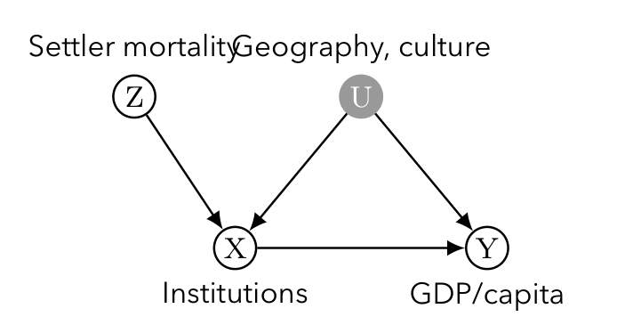

> 본 포스트는 서울대학교 GSDS **Sanghack Lee** 교수님의 *Causal Inference* 강의 자료(*Instrumental Variables*)를 바탕으로, 강의를 처음 듣는 독자도 논리적 흐름을 따라갈 수 있도록 재구성한 것입니다.

## 한 줄 요약 (TL;DR)

> **"처치에만 작용하고 결과에는 직접 닿지 않는 변수 $Z$를 하나 확보하면, 교란 요인을 전혀 관측하지 못해도 $Z \to Y$ 효과를 $Z \to X$ 효과로 나누어 인과효과를 되찾을 수 있습니다."**
>
> 지금까지 살펴본 뒷문 조정(backdoor adjustment)은 처치와 결과 사이의 교란 요인을 **전부 관측**해야만 작동합니다. 도구 변수(IV)는 이 요구를 포기하는 대신, 처치에만 외생적으로 작용하는 변수 $Z$를 찾는 문제로 식별을 바꿔 놓습니다. 선형성과 상수 효과를 가정하면 IV 추정량 · ILS · 2SLS가 모두 하나의 값 $\beta_1 = \mathrm{Cov}(Y,Z)/\mathrm{Cov}(X,Z)$로 수렴하고, 이 모수적 가정을 버리고 잠재적 결과 위에서 무작위 배정 · 단조성 · 배제 제약만 두면 **똑같은 비율**이 이번에는 **순응자(complier)** 집단의 평균 처치효과인 CACE/LATE를 식별합니다. 얻은 것은 미관측 교란으로부터의 자유이고, 치른 대가는 추정 대상이 전체 모집단이 아니라 국소 집단으로 좁아진다는 점입니다.

## 도구 변수의 동기와 사례 (Motivation and Case Studies)

이번 포스트에서는 인과추론과 계량경제학을 가로지르는 가장 강력한 도구 중 하나인 **도구 변수(Instrumental Variable, IV)**를 다룹니다. IV는 처치(treatment)와 결과(outcome) 사이에 **관측되지 않은 교란(unobserved confounding)**이 존재하여 단순 회귀로는 인과 효과를 식별할 수 없을 때, 이를 우회하여 효과를 추정할 수 있게 해 주는 핵심 기법입니다.

### 실제 연구에서의 도구 변수 (Instrumental Variables in Action)

IV가 추상적인 장치가 아니라는 점을 먼저 확인하고 가겠습니다. 아래는 경제학·정치경제학에서 널리 인용되는 IV 연구들입니다.

| 연구 | 도구 $Z$ | 처치 $X$ | 결과 $Y$ |
|:---|:---|:---|:---|
| Angrist & Krueger (1991) | 출생 분기(quarter of birth) | 교육 연수 | 소득 |
| Card (1995) | 대학과의 물리적 거리 | 교육 연수 | 소득 |
| Acemoglu et al. (2001) | 정착민 사망률(settler mortality) | 제도의 질 | 1인당 GDP |
| Miguel et al. (2004) | 강수량 충격(rainfall shocks) | 경제 성장 | 내전 발생 |
| Levitt (1996) | 과밀 수용 관련 소송 | 재소자 수 | 범죄율 |

* 공통 구조는 하나입니다. **연구자가 배정하지 않았지만 사실상 무작위처럼 처치를 흔드는 외생적 변동**을 찾아, 그 변동이 결과에 남긴 흔적으로부터 인과효과를 역산합니다.

### 사례 1: 교육의 수익률 (Returns to Education)

* **Angrist & Krueger (1991)**: 의무교육법이 **출생 분기**와 상호작용한다는 점을 이용했습니다. 연초에 태어난 학생은 같은 학년 안에서 상대적으로 나이가 많아 의무교육 연령에 더 일찍 도달하고, 따라서 **더 일찍 학교를 그만둘 수 있어** 교육 연수가 짧아집니다. 출생 분기 자체는 능력과 무관하다고 볼 수 있으므로 도구 후보가 됩니다.
* **Card (1995)**: **4년제 대학 근처에서 자라는 것**이 진학 비용을 낮춘다는 점을 이용했습니다. 근접성 → 더 많은 교육 → 더 높은 소득이라는 경로를 상정합니다.

### 사례 2: 제도와 경제 발전 (Institutions and Development)

* **Acemoglu, Johnson, Robinson (2001)**: 정착민 사망률이 높았던 지역에서는 정착 대신 자원 수탈을 목적으로 하는 **착취적(extractive) 제도**가, 낮았던 지역에서는 **포용적(inclusive) 제도**가 자리 잡았습니다. 이 제도적 차이가 오늘날까지 지속되어 국가 간 소득 격차를 설명한다는 것이 논지입니다.
* **Miguel et al. (2004)**: 아프리카의 내전을 연구하며 **강수량**을 경제 성장의 도구로 사용했습니다.

### 왜 도구 변수인가? (Why Instrumental Variables?)

* 지금까지 우리는 **뒷문 조정(backdoor adjustment)**으로 인과효과를 식별해 왔습니다. 이 방법은 $X$와 $Y$ 사이의 교란 요인을 **모두 측정**했다는 전제 위에서만 작동합니다.
* **문제**: 일부 교란 요인이 관측되지 않는다면 어떻게 될까요? 뒷문 기준(backdoor criterion)은 실패하고, **어떤 조정집합으로도 교란 경로를 차단할 수 없습니다.**
* **아이디어**: $Y$에 **오직 $X$를 통해서만** 영향을 주는 변수 $Z$를 찾습니다.

### 자연 실험으로서의 IV (IV as a Natural Experiment)

* IV는 경제학에서 가장 널리 쓰이는 기법 중 하나입니다.
* 그러나 경제학에서 사용되는 대부분의 IV는 **무작위 실험의 맥락이 아닙니다.** 대신 IV는 흔히 **자연 실험(natural experiment)**으로 간주됩니다. 즉, 연구자가 의도적으로 배정하지 않았지만 마치 무작위처럼 처치를 변화시키는 외생적 변동을 도구로 활용합니다.
* IV에 대한 포괄적 리뷰로는 Imbens(2014), *"Instrumental Variables: An Econometrician's Perspective"*를 참고할 수 있습니다.

### "좋은" 도구의 조건 (Conditions of "Good" Instruments)

* IV는 매우 인기 있지만, **좋은 도구를 찾기는 어렵습니다.**
* 좋은 도구는 다음 두 조건을 동시에 만족해야 합니다.
  1. **관련성(relevance)**: 처치에 강한 영향을 주어야 합니다(높은 $\mathrm{Cov}(X, Z)$). 그렇지 않으면(약한 도구, weak instrument) 2SLS 추정치의 **분산이 매우 커집니다.**
  2. **배제 제약(exclusion restriction)**: 결과에 대한 **직접적인 효과가 전혀 없어야 합니다.** 도구는 오직 처치를 통해서만 결과에 영향을 줄 수 있어야 합니다.

::: {.callout-warning}
## 관련성만 검증 가능합니다

두 조건의 지위는 대칭적이지 않습니다. **관련성은 데이터로 검증할 수 있지만**($Z$와 $X$의 연관은 관측 가능합니다), **배제 제약은 원리적으로 검증할 수 없습니다.** $Z \to Y$의 직접 경로가 없다는 주장은 데이터가 아니라 해당 분야의 실질적 지식으로만 방어됩니다. IV 논문의 대부분이 "왜 이 도구가 결과에 직접 영향을 주지 않는가"를 설득하는 데 지면을 쓰는 이유입니다.
:::

### 두 갈래의 시선

강의 자료는 IV를 두 가지 관점에서 조명합니다.

* **선형 가정 하의 IV (IV under Linear Assumption)**: 계량경제학에서 전통적으로 사용해 온 관점으로, 선형 구조 방정식을 가정하고 ILS(간접 최소제곱)·2SLS(2단계 최소제곱)를 통해 계수 $\beta_1$을 추정합니다.
* **비순응이 있는 무작위 실험 (Randomized Experiment with Noncompliance)**: 잠재적 결과(potential outcome) 프레임워크 위에서, 처치 배정(assignment)을 도구로 보고 **순응자(complier)**라는 특정 부분 모집단에 대한 인과 효과(CACE/LATE)를 식별합니다.

이 두 관점은 서로 다른 가정에서 출발하지만, 마지막에 가서 **본질적으로 동일한 추정량**으로 수렴한다는 점이 이 강의의 백미입니다.

---

## 1. 선형 가정 하의 IV (IV under Linear Assumption)

### 1.1 도구 변수란? (Instrumental Variable)

먼저 IV가 등장하는 인과 그래프(causal graph)를 살펴보겠습니다.

이 그래프에서 우리의 목표는 처치 $X$가 결과 $Y$에 미치는 인과적 영향, 즉 화살표 위에 표시된 계수 $\beta_1$을 일관되게(consistently) 추정하는 것입니다.

### 1.2 계량경제학적 IV 접근의 개요 (Brief review of econometric approach to IV)

계량경제학에서는 결과 $Y$를 스칼라 처치 $X$와 공변량 집합 $W$에 선형으로 관계 짓는 전통적 모형에서 출발합니다.

$$
Y_i = \beta_0 + \beta_1 X_i + \beta_2 W_i + \varepsilon_i
$$

* 여기서 추정 대상(estimand)은 처치의 계수인 $\beta_1$입니다.
* 용어 정리: 경제학에서는 $Y$와 **교란된(confounded)** 변수를 **내생적(endogenous)**, 교란되지 않은 변수를 **외생적(exogenous)**이라고 부릅니다.
  * $X$: 내생적 처치 변수 (endogenous treatment)
  * $W$: 외생적 공변량 (exogenous covariate)

#### 핵심 난점: 내생성으로 인한 OLS 편향

* **문제**: 오차항 $\varepsilon_i$가 처치 변수 $X_i$와 **상관되어 있습니다(교란됨)**. 즉,
$$
\mathrm{Cov}[X_i, \varepsilon_i] \neq 0
$$
* 이때 OLS 추정의 직교 조건(orthogonality condition)이 깨지므로, $\beta_1$의 **직접적인 OLS 추정량은 편향(biased)**됩니다.
* 직관적으로, 우리가 $X$의 변화에 대응하는 $Y$의 변화를 보더라도, 그 변화의 일부는 진짜 인과 효과 $\beta_1$ 때문이 아니라 $X$와 $\varepsilon$이 함께 움직이는 교란 때문일 수 있습니다.

이 난점을 해결하기 위해 **도구 변수 $Z$**를 도입합니다.

### 1.3 도구 변수의 정의와 식별 (IV conditions)

차원이 $K$인 도구 변수 벡터 $Z$는 다음 두 조건을 만족해야 합니다.

1. $\varepsilon_i \perp W_i$
2. $\varepsilon_i \perp Z_i \mid W_i$

이 둘을 합치면 다음과 같이 표현됩니다.

$$
\varepsilon_i \perp (Z_i, W_i)
$$

* **직관**: 도구 $Z$는 $Y$의 오차항(교란을 포함)과 독립이어야 합니다. 즉, $Z$는 $X$를 통하지 않고서는 $Y$에 영향을 주는 어떤 경로도 가지면 안 됩니다. 앞서 살펴본 **배제 제약(exclusion restriction)**을 선형 모형의 언어로 다시 쓴 것입니다.

#### 식별 상태(identification status)

도구의 개수 $K$에 따라 식별 상태가 달라집니다.

* $K > 1$: **과대식별(over-identified)** — 추정에 필요한 것보다 도구가 많음
* $K = 1$: **정확식별(just-identified)** — 도구의 수가 미지수의 수와 정확히 일치

이하에서는 가장 기본적인 정확식별(just-identified) 경우를 중심으로 전개합니다.

### 1.4 정확식별·공변량이 없는 경우 (Case of just-identified, no covariates)

가장 단순한 상황($K=1$, 공변량 $W$ 없음)에서 IV 추정량은 **두 공분산의 비(ratio of covariances)**로 주어집니다.

$$
\hat{\beta}_{1,\text{iv}}
= \frac{\widehat{\mathrm{Cov}}(Y_i, Z_i)}{\widehat{\mathrm{Cov}}(X_i, Z_i)}
= \frac{\frac{1}{N}\sum_{i=1}^{N} (Y_i - \bar{Y})(Z_i - \bar{Z})}
       {\frac{1}{N}\sum_{i=1}^{N} (X_i - \bar{X})(Z_i - \bar{Z})}
$$

여기서 $\bar{Y}, \bar{X}, \bar{Z}$는 표본 평균입니다.

#### 이진 도구의 경우: Wald 추정량 (Wald estimator)

도구 $Z$가 **이진(binary)** 변수일 때, 위 식은 **Wald 추정량**으로 단순화됩니다.

$$
\hat{\beta}_{1,\text{iv}} = \frac{\bar{Y}_1 - \bar{Y}_0}{\bar{X}_1 - \bar{X}_0}
$$

* $\bar{Y}_z, \bar{X}_z$는 각각 $Z = z\,(=0,1)$ 그룹 내에서의 표본 평균입니다.
* **해석**: 분자는 도구 값이 0에서 1로 바뀔 때 $Y$의 평균 변화, 분모는 같은 변화에 따른 $X$의 평균 변화입니다. 도구가 결과에 미친 효과를, 도구가 처치에 미친 효과로 "환산(scaling)"해 주는 것입니다. 이 직관은 뒤에서 다룰 CACE/LATE와 정확히 일치합니다.

#### ILS 해석 (Indirect Least Squares)

위 IV 추정량은 **간접 최소제곱(ILS)**으로도 해석됩니다. 두 개의 **축약형(reduced-form)** 회귀를 생각해 보겠습니다.

$$
\begin{aligned}
Y_i &= \pi_{10} + \pi_{11}\cdot Z_i + \varepsilon_{1i} \\
X_i &= \pi_{20} + \pi_{21}\cdot Z_i + \varepsilon_{2i}
\end{aligned}
$$

* 첫 번째 식은 결과 $Y$를 도구 $Z$에 직접 회귀시킨 **축약형(reduced form)**입니다.
* 두 번째 식은 처치 $X$를 도구 $Z$에 회귀시킨 **1단계(first stage)** 회귀입니다.

ILS 추정량은 이 두 최소제곱 추정치의 **비(ratio)**로 정의됩니다.

$$
\hat{\beta}_{1,\text{ils}} = \frac{\hat{\pi}_{11}}{\hat{\pi}_{21}}
$$

* **직관**: $\hat{\pi}_{11}$은 "$Z$가 $Y$에 주는 총효과", $\hat{\pi}_{21}$은 "$Z$가 $X$에 주는 효과"입니다. 경로 $Z \to X \to Y$를 따라 생각하면, 총효과 = (1단계 효과) $\times$ ($X \to Y$ 효과)이므로, 총효과를 1단계 효과로 나누면 우리가 원하는 $X \to Y$ 효과 $\beta_1$이 분리되어 나옵니다.

#### 2SLS 해석 (Two Stage Least Squares)

같은 추정량을 **2단계 최소제곱(2SLS)**으로 다시 해석할 수 있습니다.

* **1단계 (Stage 1)**: 도구 $Z$로부터 처치 값을 OLS로 예측합니다.
$$
X_i = \pi_0 + \pi_1 \cdot Z_i + \varepsilon_i, \qquad
\hat{X}_i = \hat{\pi}_0 + \hat{\pi}_1 \cdot Z_i
$$

* **2단계 (Stage 2)**: 1단계에서 얻은 예측값 $\hat{X}_i$를 결과 모형에 대입합니다.
$$
Y_i = \pi_2 + \pi_3 \hat{X}_i + \varepsilon_i
$$

* 2단계에서 OLS로 $\pi_3$를 추정하면 그것이 곧 2SLS 추정량 $\hat{\beta}_{1,\text{2sls}}$가 됩니다.

* **직관**: $\hat{X}_i$는 $X$ 중에서 오직 외생적 도구 $Z$로 설명되는 부분, 즉 $X$의 **"교란되지 않은(unconfounded) 성분"**입니다. 오차항과 얽힌 부분을 제거한 깨끗한 $X$만 사용하므로 편향이 제거됩니다.

* 세 추정량이 모두 일치함을 쉽게 확인할 수 있습니다.
$$
\hat{\beta}_{1,\text{iv}} = \hat{\beta}_{1,\text{ils}} = \hat{\beta}_{1,\text{2sls}}
$$

### 1.5 정확식별·공변량이 있는 경우 (Case of just-identified, with covariates)

위 논의는 공변량 $W$가 있는 경우로 자연스럽게 확장됩니다.

* **간접 최소제곱(ILS)**: 두 개의 축약형 회귀에 $W$를 추가합니다.
$$
\begin{aligned}
Y_i &= \pi_{10} + \pi_{11}Z_i + \pi_{12}W_i + \varepsilon_{1i} \\
X_i &= \pi_{20} + \pi_{21}Z_i + \pi_{22}W_i + \varepsilon_{2i}
\end{aligned}
$$
ILS 추정량은 여전히 $\hat{\beta}_{1,\text{ils}} = \hat{\pi}_{11}/\hat{\pi}_{21}$입니다.

* **2SLS**: 1단계에서 $W$를 포함해 $\hat{X}_i$를 예측한 뒤,
$$
\hat{X}_i = \hat{\pi}_{20} + \hat{\pi}_{21}Z_i + \hat{\pi}_{22}W_i
$$
2단계에서 $W$와 $\hat{X}_i$를 함께 회귀변수로 넣어 $\beta_1$을 추정합니다.
$$
Y_i = \beta_0 + \beta_1 \hat{X}_i + \beta_2 W_i + \eta_i
$$
2SLS 추정량은 이 2단계 회귀에서 $\beta_1$의 OLS 추정량입니다.

### 1.6 IV 추정량의 유도 (IV estimator derivation)

이제 IV 추정량이 왜 위와 같은 공분산 비로 나오는지 직접 유도해 보겠습니다. 다음 두 식이 주어졌다고 합시다.

$$
\begin{aligned}
X_i &= \pi_{20} + \pi_{21}Z_i + \pi_{22}W_i + \varepsilon_{2i} \\
Y_i &= \beta_0 + \beta_1 X_i + \underbrace{\beta_2 W_i + \varepsilon_i}_{\eta_i}
\end{aligned}
$$

여기서 결과 식의 $\beta_1 X_i$를 제외한 나머지 항을 묶어 $\eta_i$로 정의했습니다. IV의 핵심 성질은 다음 두 가지입니다.

$$
\mathrm{Cov}[X_i, Z_i] \neq 0 \quad (\text{관련성, relevance}),
\qquad
\mathrm{Cov}[\eta_i, Z_i] = 0 \quad (\text{외생성, exogeneity})
$$

* 첫째 조건은 도구가 처치와 실제로 연관되어 있어야 한다는 **관련성(relevance)** 조건입니다.
* 둘째 조건은 도구가 결과의 오차 구조(교란 포함)와 무관해야 한다는 **외생성(exogeneity)** 조건입니다.
* 여기서 한 가지를 짚고 넘어가야 합니다. $\eta_i = \beta_2 W_i + \varepsilon_i$이므로 $\mathrm{Cov}[\eta_i, Z_i] = \beta_2\,\mathrm{Cov}[W_i, Z_i] + \mathrm{Cov}[\varepsilon_i, Z_i]$입니다. 따라서 $\mathrm{Cov}[\eta_i, Z_i] = 0$을 얻으려면 §1.3의 $\varepsilon \perp (Z, W)$만으로는 부족하고, **$\mathrm{Cov}[W_i, Z_i] = 0$**, 즉 도구가 공변량과도 무상관이라는 조건이 추가로 필요합니다. 아래 유도는 이 가정 위에서 진행됩니다(공변량과 상관된 도구를 다루려면 §1.5처럼 $W$를 두 회귀에 모두 넣어 통제해야 합니다).

#### 단계별 유도

결과 식의 양변과 $Z_i$의 공분산을 취합니다. 공분산은 선형 연산이며, 상수항 $\beta_0$의 공분산은 0임을 이용합니다.

$$
\begin{aligned}
\mathrm{Cov}[Y_i, Z_i]
&= \mathrm{Cov}[\beta_0 + \beta_1 X_i + \eta_i,\; Z_i] \\
&= \underbrace{\mathrm{Cov}[\beta_0, Z_i]}_{=0}
 + \beta_1 \mathrm{Cov}[X_i, Z_i]
 + \underbrace{\mathrm{Cov}[\eta_i, Z_i]}_{=0 \;(\text{외생성})} \\
&= \beta_1 \mathrm{Cov}[X_i, Z_i]
\end{aligned}
$$

따라서 $\beta_1$에 대해 정리하면,

$$
\beta_1 = \frac{\mathrm{Cov}[Y_i, Z_i]}{\mathrm{Cov}[X_i, Z_i]}
$$

분자와 분모를 모두 $\mathrm{Var}[Z_i]$로 나누면, 다음과 같이 **축약형과 1단계의 비**로 재해석됩니다.

$$
\beta_1
= \frac{\;\dfrac{\mathrm{Cov}[Y_i, Z_i]}{\mathrm{Var}[Z_i]}\;}
       {\;\dfrac{\mathrm{Cov}[X_i, Z_i]}{\mathrm{Var}[Z_i]}\;}
= \frac{\text{Reduced form}}{\text{First stage}}
$$

* $\dfrac{\mathrm{Cov}[Y_i, Z_i]}{\mathrm{Var}[Z_i]}$ 는 $Y$를 $Z$에 회귀했을 때의 기울기, 즉 **축약형(reduced form)** 계수입니다.
* $\dfrac{\mathrm{Cov}[X_i, Z_i]}{\mathrm{Var}[Z_i]}$ 는 $X$를 $Z$에 회귀했을 때의 기울기, 즉 **1단계(first stage)** 계수입니다.
* 이 결과는 앞서 본 ILS 추정량 $\hat{\pi}_{11}/\hat{\pi}_{21}$과 정확히 같은 구조입니다.

### 1.7 2SLS 추정량의 유도 (2SLS estimator derivation)

2SLS가 왜 일관된 추정량을 주는지 대입(substitution)을 통해 확인해 보겠습니다. 1단계 회귀를 $X_i = \pi_{00} + \pi_{10}W_i + \pi_{11}Z_i + \varepsilon_{xi}$로 쓰고, 이를 결과 모형 $Y_i = \beta_0 + \beta_1 X_i + \beta_2 W_i + \varepsilon_i$에 대입합니다.

$$
Y_i = \beta_1\bigl(\pi_{00} + \pi_{10}W_i + \pi_{11}Z_i + \varepsilon_{xi}\bigr) + \beta_2 W_i + \beta_0 + \varepsilon_i
$$

이제 동류항을 $Z_i$, $W_i$, 그리고 나머지(상수·오차) 항으로 묶어 정리합니다.

$$
Y_i = \beta_1 \pi_{11} Z_i
 + (\beta_2 + \beta_1 \pi_{10}) W_i
 + \underbrace{\bigl(\beta_1(\pi_{00} + \varepsilon_{xi}) + \beta_0 + \varepsilon_i\bigr)}_{\xi_i}
$$

여기서 묶음 오차항을 $\xi_i$로 정의했습니다. 이를 다시 정리하면,

$$
\begin{aligned}
Y_i &= \beta_1\bigl(\pi_{10}W_i + \pi_{11}Z_i\bigr) + \beta_2 W_i + \xi_i \\
&= \beta_1 \underbrace{\bigl(\mathbb{E}[X_i \mid W_i, Z_i] - \pi_{00}\bigr)}_{\hat{X}_i \text{의 모집단 대응물}} + \beta_2 W_i + \xi_i
\end{aligned}
$$

* 핵심은 괄호 안의 $\pi_{10}W_i + \pi_{11}Z_i$가 1단계 회귀에서 잡음 $\varepsilon_{xi}$를 제거한 **결정적 부분**, 즉 예측값 $\hat{X}_i$의 모집단 대응물이라는 점입니다.
* 표기에 주의할 점이 하나 있습니다. 1단계 회귀의 절편 $\pi_{00}$은 앞 단계에서 이미 $\xi_i$ 안으로 흡수되었으므로, 남아 있는 항은 $\mathbb{E}[X_i \mid W_i, Z_i]$ 자체가 아니라 여기서 절편을 뺀 $\mathbb{E}[X_i \mid W_i, Z_i] - \pi_{00} = \pi_{10}W_i + \pi_{11}Z_i$입니다. 절편은 어차피 2단계 회귀의 상수항에 다시 흡수되므로 $\beta_1$의 추정에는 영향을 주지 않으며, 표본에서의 대응물은 1단계 OLS 적합값 $\hat{X}_i$ 그대로입니다.
* 새 오차항 $\xi_i$는 외생적인 $W_i, Z_i$의 함수인 $\hat{X}_i$와 직교합니다. 따라서 $Y$를 $\hat{X}_i$와 $W_i$에 OLS로 회귀하면 $\beta_1$이 일관되게 추정됩니다.
* 즉 2SLS는 내생적 $X$를 그것의 **조건부 기댓값(외생 정보로 설명되는 부분)** $\hat{X}$로 치환하여 내생성을 제거하는 절차입니다.

### 1.8 2SLS 모형의 행렬 추정 (Estimating 2SLS models, optional)

실제 회귀 소프트웨어가 2SLS를 어떻게 계산하는지 행렬 형태로 살펴보겠습니다(선택적 내용). $X$를 내생 변수, $\hat{X}$를 그 예측값, $W$를 회귀변수, $Z$를 도구라 하면, 2SLS 추정량은 다음과 같습니다.

$$
\hat{\Gamma}_{\text{2SLS}}
= \Bigl(\underbrace{[\hat{X}\,W]'[\hat{X}\,W]}_{A}\Bigr)^{-1}
  \underbrace{[\hat{X}\,W]'Y}_{B}
$$

여기서 $\hat{\Gamma}_{\text{2SLS}}$는 $\beta_1$을 비롯한 회귀 계수 추정치를 담고 있습니다(대괄호는 열 결합(concatenation)을 의미).

#### 사영 행렬(hat matrix)의 도입

먼저 도구·회귀변수 결합 행렬 $[Z\,W]$가 만드는 사영(projection, hat) 행렬을 정의합니다.

$$
M = [Z\,W]\bigl([Z\,W]'[Z\,W]\bigr)^{-1}[Z\,W]'
$$

* $M$은 **대칭(symmetric)**이며 **멱등(idempotent)**입니다. 즉 $M' = M$, $M^2 = M = M'M$.
* 1단계 예측값은 $\hat{X} = MX$로 표현됩니다($X$를 $[Z\,W]$의 열공간으로 사영).
* 중요한 성질: $W$는 이미 $[Z\,W]$의 열공간 안에 있으므로, $W$를 사영해도 그대로입니다. 즉 $MW = W$.

#### $A$ 항의 전개

$\hat{X} = MX$를 대입하여 $A = [\hat{X}\,W]'[\hat{X}\,W]$를 전개합니다.

$$
\begin{aligned}
[\hat{X}\,W]'[\hat{X}\,W]
&= [MX,\; W]'[MX,\; W] \\[4pt]
&= \begin{bmatrix} X'M'MX & X'M'W \\ W'M'X & W'W \end{bmatrix}
   &&(M' = M,\; M'M = M) \\[4pt]
&= \begin{bmatrix} X'MX & X'MW \\ W'M'X & W'MW \end{bmatrix}
   &&(W'W = W'MW,\; MW = W) \\[4pt]
&= [X\,W]'\,M\,[X\,W] \\[4pt]
&= [X\,W]'[Z\,W]\bigl([Z\,W]'[Z\,W]\bigr)^{-1}[Z\,W]'[X\,W]
\end{aligned}
$$

* 둘째 줄에서 $M$의 멱등·대칭성으로 $(MX)'MX = X'M'MX = X'MX$가 됩니다.
* 셋째 줄에서 $MW = W$이므로 $W'W = W'MW$, $X'M'W = X'MW$로 단정해집니다.
* $B$ 항도 동일한 방식으로 정리됩니다.

#### 최종 형태

이를 모두 합치면 2SLS 추정량은 다음과 같이 정리됩니다.

$$
\hat{\Gamma}_{\text{2SLS}}
= \Bigl([X\,W]'[Z\,W]\bigl([Z\,W]'[Z\,W]\bigr)^{-1}[Z\,W]'[X\,W]\Bigr)^{-1}
  [X\,W]'[Z\,W]\bigl([Z\,W]'[Z\,W]\bigr)^{-1}[Z\,W]'Y
$$

이를 인과 모형의 전체 회귀변수 행렬 $\tilde{W} \equiv [X\,W]$와 사영 행렬 $M$으로 압축하면,

$$
\hat{\Gamma}_{\text{2SLS}} = \bigl(\tilde{W}'M\tilde{W}\bigr)^{-1}\tilde{W}'MY
$$

* 여기서 $\tilde{W}=[X\,W]$는 인과 모형의 회귀변수 행렬, $M$은 1단계에서 나온 hat 행렬입니다. 이것이 실제 통계 소프트웨어가 2SLS를 계산하는 방식입니다.
* **참고 (OLS와의 대비)**: 일반 OLS에서는 $X$가 $n \times p$ 행렬일 때 $\hat{\beta} = (X'X)^{-1}X'y$이고 적합값은 $\hat{y} = X(X'X)^{-1}X'y$입니다. 2SLS는 이 구조에 사영 행렬 $M$을 끼워 넣어 내생성을 제거한 형태로 볼 수 있습니다.

### 1.9 선형 IV에서 비모수 IV로 (From Linear IV to Nonparametric IV)

여기까지의 논의를 지탱한 것이 무엇이었는지 짚고 다음 절로 넘어가겠습니다.

* 지금까지 우리는 **선형성**과 **상수 효과(constant effects)** 가정 아래에서 IV를 다뤘습니다. 즉 $\beta_1$이 **모든 개인에게 동일한 하나의 숫자**라고 전제했고, 그 덕분에 IV 추정량 = ILS = 2SLS라는 깔끔한 등식이 성립했습니다.
* 그런데 처치효과가 **이질적(heterogeneous)**이라면 어떻게 될까요? 개인마다 $Y_i(1) - Y_i(0)$이 다르다면, 애초에 "그" $\beta_1$이라는 것이 존재하지 않습니다. 이때 IV 추정 대상은 **무엇을** 식별하는 것일까요?
* 이 질문을 정면으로 다루기 좋은 설정이 **비순응이 있는 무작위 실험**입니다. 무작위 배정 $Z$를 실제 수령한 처치 $X$에 대한 도구로 보는 것인데, 이 경우 도구의 타당성이 설계에 의해 보장되므로 가정을 둘러싼 논쟁 없이 "IV가 무엇을 식별하는가"에만 집중할 수 있습니다.
* Angrist, Imbens, Rubin(1996)이 이 설정을 잠재적 결과 프레임워크로 정식화했으며, 다음 절의 주제입니다.

---

## 2. 비순응이 있는 무작위 실험 (Randomized Experiment with Noncompliance)

지금까지의 선형 IV는 강력하지만, **선형성**과 **상수 효과(constant effect)** 같은 강한 모수적 가정에 의존합니다. 이번 절에서는 잠재적 결과 프레임워크 위에서 이러한 가정을 완화하여 IV를 재해석합니다.

### 2.1 동기가 되는 예시: 비순응이 있는 임상시험 (Motivating Example)

신약을 무작위 대조시험(RCT)으로 검증하는 상황을 생각해 보겠습니다.

* $Z$: **무작위 배정** (처치군 vs. 통제군)
* $X$: **실제 수령한 처치** (실제로 약을 복용했는가)
* $Y$: 건강 결과

여기서 문제가 되는 것이 **비순응(noncompliance)**입니다.

* 처치군에 배정된 환자 중 일부는 **약 복용을 거부**합니다.
* 통제군에 배정된 환자 중 일부는 **다른 경로로 약을 구해 복용**합니다.
* 따라서 $X=1$ 그룹과 $X=0$ 그룹을 단순 비교하면 **교란됩니다.** 누가 실제로 약을 먹었는지는 무작위가 아니라 **환자 스스로 선택**한 결과이고, 그 선택은 건강 상태·순응성 같은 미관측 특성과 얽혀 있기 때문입니다.

::: {.callout-tip}
## 왜 이것이 IV 문제인가

배정 $Z$는 연구자가 통제하므로 두 성질을 **설계상** 갖습니다. 첫째, $Z$는 무작위이므로 잠재적 결과와 독립입니다. 둘째, 배정 통보 자체가 건강에 직접 영향을 주지 않는다면 $Z$는 오직 $X$를 통해서만 $Y$에 작용합니다. 관련성과 배제 제약이 모두 설계로 확보되는 셈이니, **무작위 배정 $Z$를 실제 수령 $X$에 대한 도구로 쓰자**는 것이 이 절의 출발점입니다.
:::

### 2.2 비순응에 대한 IV 접근 (IV Approach to Noncompliance)

Angrist, Imbens, Rubin(1996, *JASA*)은 **비순응(non-compliance)**에 대한 도구 변수 접근을 제안했습니다. 무작위 실험에서 참가자에게 처치를 **배정(assign)**하더라도, 참가자가 실제로 그 처치를 **수령(receive)**할지는 별개의 문제입니다. 이때 다음과 같이 잠재적 결과를 정의합니다.

* **잠재적 결과(potential outcomes)**: 배정 $z$에 대해 $Y(z),\; z = 0, 1$
* 실제 수령한 처치 $X$는 **배정 이후(post-treatment)** 결정되므로, $X$ 또한 두 개의 잠재적 결과를 가집니다: $X(z),\; z = 0, 1$
* **관측 데이터(observed data)**: 배정 $Z_i$, 수령 $X_i = X(Z_i)$, 결과 $Y_i = Y(Z_i)$
* **핵심 아이디어**: 단위(unit)들을 그들의 **순응 행동(compliance behavior)**에 따라 **잠재적 부분집단(latent subgroups)**으로 나눕니다.
* **순응 유형(compliance type)** 정의: $S_i = \bigl(X_i(0), X_i(1)\bigr)$ — 배정이 0일 때와 1일 때 각각 어떤 처치를 수령하는지의 쌍

::: {.callout-warning}
## $Y(z)$는 배정에 대한 잠재적 결과입니다

여기서 $Y_i(z)$는 **배정 $z$**에 대한 잠재적 결과이지, 수령한 처치에 대한 잠재적 결과가 아닙니다. 우리가 궁극적으로 알고 싶은 것은 $X$의 효과인데 잠재적 결과는 $Z$로 색인되어 있다는 이 어긋남이야말로 이 절 전체가 풀어야 할 문제입니다. 첨자를 혼동하면 뒤의 ITT·CACE 논의가 전부 헝클어지므로 주의가 필요합니다.
:::

### 2.3 전체 그림 (The Big Picture)

본격적인 유도에 들어가기 전에, 이 절이 어디로 향하는지를 한 장의 그림으로 잡아 두겠습니다.

![Figure: 비순응 상황의 전체 구조. 왼쪽 막대는 통제군($Z=0$), 오른쪽 막대는 처치군($Z=1$)이며, 각 막대는 세 순응 유형으로 나뉩니다 — 위쪽 분홍은 불응자(never-taker), 가운데 초록은 순응자(complier), 아래쪽 보라는 항상수령자(always-taker)입니다. 무작위 배정 덕분에 두 막대의 **유형 구성 비율은 동일**하며, 달라지는 것은 각 칸에 적힌 $X$ 값뿐입니다. 불응자는 양쪽 모두 $X=0$, 항상수령자는 양쪽 모두 $X=1$로 고정되어 있고, 오직 초록 칸만 $X=0$에서 $X=1$로 바뀝니다 — 가운데 "switchers" 화살표가 가리키는 것이 바로 이 이동입니다. 좌우의 중괄호는 각 배정에서 실제로 관측되는 $X=0$ / $X=1$ 그룹이 어떤 유형들의 혼합인지를 보여 줍니다. 아래 초록 상자가 결론입니다. $Z$를 흔들었을 때 처치가 바뀌는 사람은 순응자뿐이므로, $Z$가 만들어 낸 결과의 변화는 전부 순응자에게 귀속되어야 하고, 따라서 목표량은 $\text{CACE} = \mathbb{E}[Y(1)-Y(0) \mid \text{complier}] = \text{ITT}_y / \text{ITT}_x$가 됩니다.](./images/figure05_noncompliance_big_picture.png)

* 이 그림이 담고 있는 논증이 이 절의 전부입니다. **오직 순응자만이 $Z$의 변화에 반응해 처치를 바꿉니다.**
* 그러므로 $Z$를 흔들어 얻은 결과의 변화($\text{ITT}_y$)를, 처치의 변화($\text{ITT}_x$)로 나누면 **순응자에 한정된 평균 인과효과**가 남습니다.
* 이하의 절들은 이 직관을 (i) 어떤 가정 아래에서, (ii) 어떤 계산으로 정당화할 수 있는지를 차근차근 채워 나가는 과정입니다.

### 2.4 순응 유형 (Compliance Types)

$\bigl(X_i(0), X_i(1)\bigr)$의 조합에 따라 네 가지 순응 유형이 존재합니다.

| | $X_i(0) = 0$ | $X_i(0) = 1$ |
|:---:|:---:|:---:|
| $X_i(1) = 0$ | never-taker (불응자) | defier (반항자) |
| $X_i(1) = 1$ | complier (순응자) | always-taker (항상수령자) |

* **complier(순응자)**: 배정받은 대로 따름 ($X(0)=0, X(1)=1$)
* **never-taker(불응자)**: 배정과 무관하게 항상 처치를 거부 ($X(0)=X(1)=0$)
* **always-taker(항상수령자)**: 배정과 무관하게 항상 처치를 수령 ($X(0)=X(1)=1$)
* **defier(반항자)**: 배정과 정반대로 행동 ($X(0)=1, X(1)=0$)

#### 잠재 유형과 관측 셀의 혼합

* 참된 순응 유형 $S$는 **모든 단위에서 관측되지 않습니다.** 우리는 한 단위에 대해 $X_i(0)$과 $X_i(1)$ 중 하나만(실제 배정에 해당하는 것만) 관측하기 때문입니다(잠재적 결과의 근본 문제).
* 따라서 관측되는 $(Z, X)$ 셀들은 서로 다른 순응 유형의 **혼합(mixture)**입니다.

| $Z$ | $X$ | 가능한 유형 $S$ |
|:---:|:---:|:---:|
| 0 | 0 | [C, NT] |
| 0 | 1 | [AT, D] |
| 1 | 0 | [NT, D] |
| 1 | 1 | [C, AT] |

* 예컨대 $(Z=1, X=1)$ 셀에는 순응자(C, 배정받아 수령)와 항상수령자(AT, 원래 수령)가 섞여 있습니다.
* 각 유형의 인과 효과를 식별하려면 **추가 가정**이 필요합니다.

### 2.5 의향 처치 효과 (Intent-To-Treat, ITT)

* **핵심 관찰**: 순응 유형 $S_i = \bigl(X_i(0), X_i(1)\bigr)$은 배정 $Z_i$에 따라 변하지 않습니다. 이는 단위가 가진 **기저 특성(baseline characteristic)**으로 볼 수 있습니다.
* 각 순응 유형 $s$에 대한 ITT 효과를 정의합니다.
$$
\text{ITT}_s = \mathbb{E}[Y_i(1) - Y_i(0) \mid S_i = s], \qquad s = c, n, a, d
$$
* 여기서 $Y_i(1), Y_i(0)$은 **배정 $Z$**에 대한 잠재적 결과임에 유의합니다(처치 수령이 아니라 배정 의향에 따른 효과).

#### 전역 ITT의 분해

전역 ITT는 네 부분 모집단의 ITT 효과를, 각 유형의 비율 $\pi_s$로 가중 평균한 것으로 쓸 수 있습니다. 이후 $Z$가 $X$에 미치는 효과와 구분하기 위해 이것을 $\text{ITT}_y$로도 표기합니다.

$$
\text{ITT}_y \;:=\; \text{ITT} \;=\; \pi_c \text{ITT}_c + \pi_n \text{ITT}_n + \pi_a \text{ITT}_a + \pi_d \text{ITT}_d
$$

여기서 $\pi_s$는 유형 $s$ 단위의 비율입니다($\sum_s \pi_s = 1$).

### 2.6 식별 가정 (Identification Assumptions)

효과를 **비모수적으로(nonparametrically)** 식별하려면 추가 가정이 필요합니다.

#### Assumption 1: 무작위 배정 (Random Assignment)

$$
\{Y_i(0), Y_i(1), X_i(0), X_i(1)\} \perp Z_i
$$

* 배정 $Z$가 모든 잠재적 결과·잠재적 처치와 독립이라는 가정으로, 무작위 실험에서는 **설계상 성립**합니다.

#### Assumption 2: 강한 단조성 (Strong Monotonicity)

(1) defier가 없고, (2) complier가 존재한다는 두 부분으로 구성됩니다.

$$
(1)\; X_i(1) \geq X_i(0) \quad \forall i, \qquad
(2)\; \mathbb{E}[X_i \mid Z_i = 1] \neq \mathbb{E}[X_i \mid Z_i = 0]
$$

* (1) **단조성**: 배정이 증가할 때 처치 수령이 줄어드는 단위(defier)는 없습니다.
* (2) **complier의 존재**: 배정이 처치 수령에 실제로 영향을 주는 단위가 존재해야 합니다(선형 IV의 관련성 조건에 대응). 뒤에서 보게 되듯 $\mathbb{E}[X \mid Z=1] - \mathbb{E}[X \mid Z=0]$이 정확히 순응자 비율 $\pi_c$이므로, 이 조건은 곧 $\pi_c \neq 0$과 같은 말이고, CACE 식의 **분모가 0이 되지 않도록** 보장하는 역할을 합니다.
* 단조성은 많은 응용에서 **설계상 성립**합니다. 특히 **일방향 비순응(one-sided compliance)**에서는 $X_i(0) = 0$이 설계상 보장됩니다(통제군은 처치에 접근 자체가 불가능한 경우).

#### Assumption 3: 배제 제약 (Exclusion Restriction, ER) for noncompliers

$$
Y_i(0) = Y_i(1), \qquad \forall\, i \text{ with } S_i \in \{n, a\}
$$

* **불응자(n)와 항상수령자(a)**에 대해, 배정 $Z$가 0이든 1이든 **결과가 동일**하다는 가정입니다.
* 직관: 이들은 배정과 무관하게 수령하는 처치가 같습니다(불응자는 항상 미수령, 항상수령자는 항상 수령). 그럼에도 불구하고 **배정 자체가 결과를 바꿀 여지는 남아 있습니다** — 대표적인 예가 **위약 효과(placebo effect)**로, 처치군에 배정되었다는 사실을 아는 것만으로 결과가 달라질 수 있습니다. 배제 제약은 바로 이런 $Z \to Y$ 직접 경로를 배제합니다.
* 즉 이것은 선형 IV에서 이미 요구했던 **"직접 효과 없음"과 동일한 가정**을, 잠재적 결과의 언어로 비순응자에 대해 다시 진술한 것입니다.
* 배제 제약의 형식적 정의는 처치 수령까지 명시한 **이중 첨자 잠재적 결과(double-indexed potential outcome)** $Y_i(z, x)$를 필요로 합니다. 즉 결과는 배정 $z$가 아니라 오직 수령한 처치 $x$에만 의존한다는 것입니다.

::: {.callout-important}
## CACE / LATE 식별을 위한 세 가정

* **A1 (무작위 배정)**: $\{Y_i(0), Y_i(1), X_i(0), X_i(1)\} \perp Z_i$
* **A2 (강한 단조성)**: 모든 단위에서 $X_i(1) \geq X_i(0)$ 이고, $\mathbb{E}[X \mid Z=1] \neq \mathbb{E}[X \mid Z=0]$
* **A3 (배제 제약)**: 모든 비순응자($S_i \in \{n, a\}$)에 대해 $Y_i(0) = Y_i(1)$

이 세 가지만으로 **순응자에 대한 인과효과**가 비모수적으로 식별됩니다. 선형성도, 상수 효과도 필요하지 않습니다.
:::

### 2.7 인과 효과의 식별 (Identification of the Causal Effects)

세 가정을 결합하면 전역 ITT 분해식이 극적으로 단순해집니다.

* **단조성** → defier가 없으므로 $\pi_d = 0$
* **배제 제약** → 불응자·항상수령자에 대해 $Y(1)=Y(0)$이므로 $\text{ITT}_n = \text{ITT}_a = 0$

이를 전역 ITT 분해식에 대입합니다.

$$
\begin{aligned}
\text{ITT}
&= \pi_c \text{ITT}_c + \pi_n \text{ITT}_n + \pi_a \text{ITT}_a + \pi_d \text{ITT}_d \\
&= \pi_c \text{ITT}_c + \pi_n \cdot 0 + \pi_a \cdot 0 + 0 \cdot \text{ITT}_d \\
&= \pi_c \text{ITT}_c
\end{aligned}
$$

따라서 순응자에 대한 ITT 효과가 **식별**됩니다.

$$
\boxed{\;\text{ITT}_c = \text{ITT} / \pi_c\;}
$$

* **해석**: 전역 ITT는 처치 효과에 대한 **보수적(conservative) 추정치**로 볼 수 있습니다. $0 < \pi_c < 1$이므로,
$$
|\text{ITT}| < |\text{ITT}_c|
$$
즉 전체 모집단을 대상으로 한 의향 효과(ITT)는, 실제로 처치에 반응하는 순응자만의 효과($\text{ITT}_c$)보다 절댓값 기준으로 항상 작습니다(**0 쪽으로 감쇠, attenuated toward zero**). 처치를 무시한 불응자·항상수령자가 효과를 희석시키기 때문입니다. 효과의 부호가 음수일 수도 있으므로 절댓값을 취해야 정확한 진술이 됩니다.

### 2.8 순응 유형 분포의 추정 (Estimating the Distribution of Compliance Types)

무작위 배정과 단조성 하에서, 관측 데이터로부터 순응 유형의 분포를 직접 추정할 수 있습니다.

$$
\begin{aligned}
\pi_a &= P\bigl(X_i(0) = X_i(1) = 1\bigr) = \mathbb{E}[X_i \mid Z_i = 0] \\
\pi_n &= P\bigl(X_i(0) = X_i(1) = 0\bigr) = 1 - \mathbb{E}[X_i \mid Z_i = 1] \\
\pi_c &= P\bigl(X_i(0) = 0, X_i(1) = 1\bigr) = \mathbb{E}[X_i \mid Z_i = 1] - \mathbb{E}[X_i \mid Z_i = 0]
\end{aligned}
$$

각 식의 직관을 정리하겠습니다(단조성으로 defier가 없음을 활용).

* $\pi_a$: 배정이 0인데도($Z=0$) 처치를 수령하는($X=1$) 사람은 오직 항상수령자뿐입니다. 따라서 $\mathbb{E}[X \mid Z=0] = \pi_a$.
* $\pi_n$: 배정이 1인데도($Z=1$) 처치를 거부하는($X=0$) 사람은 오직 불응자뿐입니다. $\mathbb{E}[X \mid Z=1] = \pi_c + \pi_a$이므로, $1 - \mathbb{E}[X \mid Z=1] = 1 - \pi_c - \pi_a = \pi_n$.
* $\pi_c$: 위 두 결과의 차를 취하면 $(\pi_c + \pi_a) - \pi_a = \pi_c$.

#### $Z$가 $X$에 미치는 ITT

도구 $Z$가 처치 수령 $X$에 미치는 ITT 효과도 정의할 수 있습니다.

$$
\text{ITT}_x = \mathbb{E}[X_i(1) - X_i(0)]
$$

무작위 배정 하에서 이는 정확히 순응자 비율과 같습니다.

$$
\text{ITT}_x = \mathbb{E}[X_i \mid Z_i = 1] - \mathbb{E}[X_i \mid Z_i = 0] = \pi_c
$$

### 2.9 순응자 평균 인과 효과 (CACE / LATE)

순응자의 ITT 효과는 **순응자 평균 인과 효과(Complier Average Causal Effect, CACE)** 또는 **국소 평균 처치 효과(Local Average Treatment Effect, LATE)**로 불립니다(Imbens and Angrist, 1994, *Econometrica*).

앞서 유도한 관계식들로부터 CACE는 두 ITT 효과의 비로 표현됩니다.

$$
\text{CACE} \equiv \mathbb{E}[Y_i(1) - Y_i(0) \mid S_i = c]
= \frac{\text{ITT}_y}{\text{ITT}_x}
$$

* 분자 $\text{ITT}_y$는 배정이 결과에 미치는 효과($Y$에 대한 ITT), 분모 $\text{ITT}_x$는 배정이 처치 수령에 미치는 효과($=\pi_c$)입니다.
* **이것은 무작위 배정 $Z$를 도구로 볼 때의 IV 추정량과 정확히 일치합니다.** 1.4절의 Wald 추정량 $\dfrac{\bar{Y}_1 - \bar{Y}_0}{\bar{X}_1 - \bar{X}_0}$이 곧 $\text{ITT}_y / \text{ITT}_x$의 표본 버전입니다. 선형 IV와 잠재적 결과 IV가 여기서 만납니다.

### 2.10 인과 효과의 추정 (Estimating the Causal Effects)

배정 $Z$와 수령 $X$로 분류한 평균 결과를 살펴보면, 각 셀이 순응 유형의 혼합으로 분해됩니다.

$$
\begin{aligned}
\mathbb{E}[Y_i \mid X_i = 0, Z_i = 0]
&= \frac{\pi_c}{\pi_c + \pi_n}\,\mathbb{E}[Y_i(0) \mid \text{complier}]
 + \frac{\pi_n}{\pi_c + \pi_n}\,\mathbb{E}[Y_i(0) \mid \text{never-taker}] \\[4pt]
\mathbb{E}[Y_i \mid X_i = 0, Z_i = 1]
&= \mathbb{E}[Y_i(0) \mid \text{never-taker}] \\[4pt]
\mathbb{E}[Y_i \mid X_i = 1, Z_i = 0]
&= \mathbb{E}[Y_i(1) \mid \text{always-taker}] \\[4pt]
\mathbb{E}[Y_i \mid X_i = 1, Z_i = 1]
&= \frac{\pi_c}{\pi_c + \pi_a}\,\mathbb{E}[Y_i(1) \mid \text{complier}]
 + \frac{\pi_a}{\pi_c + \pi_a}\,\mathbb{E}[Y_i(1) \mid \text{always-taker}]
\end{aligned}
$$

각 셀의 구성을 정리하겠습니다(2.4절의 혼합 표 참조).

* $(X=0, Z=1)$: 배정 1에서 미수령은 불응자뿐 → 순수하게 $\mathbb{E}[Y(0) \mid \text{NT}]$가 식별됩니다.
* $(X=1, Z=0)$: 배정 0에서 수령은 항상수령자뿐 → 순수하게 $\mathbb{E}[Y(1) \mid \text{AT}]$가 식별됩니다.
* $(X=0, Z=0)$: 순응자(미수령, $Y(0)$)와 불응자가 섞여 있음.
* $(X=1, Z=1)$: 순응자(수령, $Y(1)$)와 항상수령자가 섞여 있음.

이미 순수하게 식별된 불응자·항상수령자의 평균을 혼합 셀에서 빼내면, 순응자의 $\mathbb{E}[Y_i(0) \mid \text{complier}]$와 $\mathbb{E}[Y_i(1) \mid \text{complier}]$를 **비모수적으로 식별**할 수 있고, 따라서 CACE를 적률 추정(moment estimate)으로 얻을 수 있습니다.

### 2.11 적률 추정량 (Moment Estimates)

가정 1–3 하에서 CACE의 적률 추정량을 명시적으로 쓸 수 있습니다.

#### 일방향 비순응 (항상수령자 없음)

$$
\widehat{\text{CACE}}
= \frac{\dfrac{\sum_i Y_i Z_i}{\sum_i Z_i} - \dfrac{\sum_i Y_i (1 - Z_i)}{\sum_i (1 - Z_i)}}
       {\dfrac{\sum_i X_i Z_i}{\sum_i Z_i}}
$$

* 분자는 배정군($Z=1$)과 통제군($Z=0$)의 평균 결과 차이, 즉 $\widehat{\text{ITT}}_y$입니다.
* 분모는 배정군에서 처치를 수령한 비율로, 일방향 비순응에서는 곧 순응자 비율($\widehat{\pi}_c = \widehat{\text{ITT}}_x$)입니다.

#### 양방향 비순응

$$
\widehat{\text{CACE}}
= \frac{\dfrac{\sum_i Y_i Z_i}{\sum_i Z_i} - \dfrac{\sum_i Y_i (1 - Z_i)}{\sum_i (1 - Z_i)}}
       {1 - \dfrac{\sum_i X_i (1 - Z_i)}{\sum_i (1 - Z_i)} - \dfrac{\sum_i (1 - X_i) Z_i}{\sum_i Z_i}}
$$

* 분모를 해석하면:
  * $\dfrac{\sum_i X_i (1-Z_i)}{\sum_i (1-Z_i)} = \mathbb{E}[X \mid Z=0] = \pi_a$ (통제군 중 수령자 = 항상수령자)
  * $\dfrac{\sum_i (1-X_i) Z_i}{\sum_i Z_i} = \mathbb{E}[1-X \mid Z=1] = 1 - (\pi_c + \pi_a) = \pi_n$ (배정군 중 미수령자 = 불응자)
  * 따라서 분모 $= 1 - \pi_a - \pi_n = \pi_c = \widehat{\text{ITT}}_x$
* 즉 두 경우 모두 **CACE = ITT$_y$ / ITT$_x$**라는 동일한 구조입니다.

#### 추론 및 한계

* **표준오차**는 점근적으로(asymptotically) 또는 **부트스트랩(bootstrap)**을 통해 얻을 수 있습니다. 다만 도구가 약할 때는 부트스트랩이 오히려 부적절해지는데, 이 점은 부록 §A.7에서 다시 다룹니다.
* 가정 1–3 없이도 효과에 대한 **비모수적 경계(nonparametric bounds)**를 구할 수 있지만, 그 경계는 흔히 너무 넓어서 유용한 정보를 주지 못합니다.

### 2.12 계산 예제: CACE 구하기 (Worked Example)

지금까지의 식이 실제로 어떻게 맞물리는지 숫자로 확인해 보겠습니다. 어떤 신약 임상시험이 $N = 1{,}000$명을 무작위로 배정해 $Z=1$에 500명, $Z=0$에 500명을 두었습니다.

**Step 1. 순응 유형 비율**

* $Z=0$ 그룹에서 **100명이 약을 복용**했습니다($X=1$). 배정되지 않았는데도 복용한 사람은 항상수령자뿐이므로,
$$
\hat{\pi}_a = \frac{100}{500} = 0.20
$$
* $Z=1$ 그룹에서 **150명이 복용을 거부**했습니다($X=0$). 배정되었는데도 거부한 사람은 불응자뿐이므로,
$$
\hat{\pi}_n = \frac{150}{500} = 0.30
$$
* 나머지가 순응자입니다.
$$
\hat{\pi}_c = 1 - 0.20 - 0.30 = 0.50
$$

**Step 2. 두 개의 ITT 효과**

* 결과에 대한 ITT: $\bar{Y}_{Z=1} = 7.0$, $\bar{Y}_{Z=0} = 6.0$ 이므로
$$
\widehat{\text{ITT}}_y = 7.0 - 6.0 = 1.0
$$
* 처치 수령에 대한 ITT: $\bar{X}_{Z=1} = 0.70$, $\bar{X}_{Z=0} = 0.20$ 이므로
$$
\widehat{\text{ITT}}_x = 0.70 - 0.20 = 0.50
$$
* 여기서 $\widehat{\text{ITT}}_x = 0.50 = \hat{\pi}_c$ 임을 확인할 수 있습니다. §2.8에서 유도한 $\text{ITT}_x = \pi_c$가 숫자로 그대로 맞아떨어집니다.

**Step 3. CACE**

$$
\widehat{\text{CACE}} = \frac{\widehat{\text{ITT}}_y}{\widehat{\text{ITT}}_x} = \frac{1.0}{0.50} = 2.0
$$

* 해석하면, 배정 여부와 무관하게 전체 참가자를 비교한 의향 효과는 $1.0$에 불과하지만, **실제로 배정에 반응해 약을 복용한 순응자들에게는 효과가 $2.0$**이라는 것입니다. 비순응자 절반이 효과를 정확히 절반으로 희석시킨 셈입니다.
* 만약 $X=1$인 사람과 $X=0$인 사람을 그냥 비교하는 **소박한 ATE**를 계산했다면, 그 값은 비순응에 의해 감쇠되었을 뿐 아니라 자기선택 교란까지 섞여 있어 어느 쪽으로도 해석하기 어려운 숫자가 되었을 것입니다.

### 2.13 "네 번째 조건": 동질성 (The "Fourth Condition": Homogeneity)

지금까지 우리는 단조성을 받아들이는 대가로 추정 대상을 순응자로 좁혔습니다. 그런데 **다른 길**도 있습니다. 단조성 대신 **동질성(homogeneity)**을 가정하면, IV 추정 대상은 순응자가 아니라 **전체 모집단의 ATE**를 식별합니다.

강의 자료는 점점 약해지는 세 가지 버전을 제시하며, 이 중 **어느 하나만 성립해도 충분**하다고 정리합니다.

| 버전 | 진술 | 형식 |
|:---|:---|:---|
| **(a)** | 모든 단위에서 처치효과가 동일 | $Y_i(1) - Y_i(0) = \beta_1$ (항상) |
| **(b)** | 도구의 수준에 따라 평균 효과가 같음 | $\mathbb{E}[Y(1)-Y(0) \mid Z=0] = \mathbb{E}[Y(1)-Y(0) \mid Z=1]$ |
| **(c)** | 미관측 교란 $U$에 의한 효과 수정이 없음 | $\mathbb{E}[Y(1)-Y(0) \mid U] = \text{const}$ |

* 자료는 이들 사이에 **(a) $\Rightarrow$ (b), (b) $\Rightarrow$ (c)**의 함의 관계가 있다고 정리합니다. (a)가 가장 강하고 아래로 갈수록 약해집니다.
* (a)는 현실에서 거의 성립하지 않습니다. 같은 약이 모든 환자에게 정확히 같은 크기의 효과를 낸다는 주장이기 때문입니다.
* (b)–(c)는 그보다 약하지만 **여전히 강한 가정**입니다. 검증할 방법이 없다는 점도 (a)와 다르지 않습니다.
* 그래서 실제 응용 연구의 대부분은 동질성이 아니라 **단조성 + LATE 해석** 쪽을 택합니다. 단조성은 "반항자가 없다"만 요구하므로 훨씬 방어하기 쉽고, 그 대가로 식별되는 효과가 순응자에 한정될 뿐입니다.

::: {.callout-tip}
## 두 개의 서로 다른 거래

같은 IV 추정량 $\text{Cov}(Y,Z)/\text{Cov}(X,Z)$가 무엇을 의미하는지는 **어느 가정을 추가로 붙였느냐**에 따라 달라집니다. 동질성을 붙이면 전체 모집단의 ATE가 되고, 단조성을 붙이면 순응자의 LATE가 됩니다. 숫자는 같은데 해석이 다른 것입니다. 논문에서 IV 추정치를 읽을 때 "이 숫자는 누구에 대한 효과인가"를 먼저 물어야 하는 이유가 여기에 있습니다.
:::

*Hernán and Robins (2020), Sections 16.3–16.4.*

### 2.14 논의 (Discussion)

선형 모형과 비교했을 때, 비순응 IV 접근은 무엇이 같고 무엇이 다를까요?

* **상수 효과(constant effect) 가정을 제거**했습니다. 모든 단위가 동일한 처치 효과를 가진다는 가정은 보통 비현실적입니다.
* 대신 더 약한 **단조성(monotonicity) 가정**을 추가했습니다.
* 효과가 식별되는 대상이 전체 모집단이 아니라 **순응자(complier)라는 특정 부분 모집단**으로 한정됨을 명확히 했습니다. 이것이 "Local" Average Treatment Effect의 "Local"이 의미하는 바입니다.
* 만약 상수 효과가 우연히 성립한다면, 순응자에 대한 효과는 정의상 전체 모집단에 대한 효과와 동일해집니다. 이 경우 LATE와 ATE가 일치합니다.

---

## 부록 (Appendix)

여기까지가 식별 이론이었다면, 부록은 **실제로 IV를 쓸 때 무엇이 잘못되는가**에 관한 내용입니다. 강의 자료의 부록 슬라이드를 따라 정리합니다.

### A.1 관측연구에서의 후보 도구 (Candidate Instruments in Observational Studies)

무작위 실험이 아닌 관측연구에서 도구를 찾을 때 자주 동원되는 유형들입니다.

| 유형 | 예 | 핵심 우려 |
|:---|:---|:---|
| 유전 변이 (멘델 무작위화, Mendelian randomization) | ALDH2 다형성 → 알코올 대사 | **다면발현(pleiotropy)** — 해당 변이가 $Y$에 직접 영향을 주지는 않는가? |
| 진료자 선호 (provider preference) | 의사 개인의 처방 성향 | 미관측 환자 특성이 의뢰(referral) 자체를 결정할 수 있음 |
| 지리적 · 시간적 접근성 | 시설까지의 거리, 정책 시행일 | 사회경제적 지위(SES) · 도농 구분과 상관 |

* 도구의 세 조건 중 **(i) 관련성만이 경험적으로 검증 가능**합니다. $Z$와 $X$의 연관은 데이터에서 직접 확인할 수 있기 때문입니다.
* 반면 **(ii) 배제 제약**과 **(iii) 도구–결과 관계에 교란이 없을 것**은 데이터가 아니라 **해당 분야의 실질적 지식**으로만 방어됩니다.
* 도구 후보를 볼 때 던져야 할 질문은 언제나 하나입니다. **"$Z$가 $X$ 이외의 경로로 $Y$에 닿을 가능성은 없는가?"**

*Hernán and Robins (2020), Fine Point 16.1.*

### A.2 IV와 다른 인과추론 방법의 비교 (IV vs. Other Causal Methods)

| | IV 추정 | IPW / g-방법 |
|:---|:---|:---|
| **필요 가정** | 조건부 교환가능성 $Y(x) \perp X \mid W$ **불필요** | 조건부 교환가능성 필요 (모든 교란 요인 측정) |
| **미관측 교란** | 존재해도 작동 | 존재하면 편향 |
| **가정 위배에 대한 민감도** | 배제 제약 · 무교란 위배에 매우 민감 — **편향 증폭(bias amplification)** | 경미한 위배 → 경미한 편향 (증폭 없음) |
| **식별되는 추정 대상** | 단조성 하에서 **국소 효과(순응자)**만 | 모집단 **ATE** |
| **확장성** | 제한적 | 시간가변 처치로 확장 가능 |

* **IV를 선택할 상황**: 미관측 교란이 있을 가능성이 높고, 강한 도구가 존재하며, 처치가 이분형이고, 동질성이나 단조성 중 하나가 그럴듯할 때입니다.
* 이 표에서 가장 중요한 항목은 **편향 증폭**입니다. IV는 가정이 조금만 어긋나도 편향이 조금 커지는 것이 아니라, 뒤에서 볼 것처럼 **작은 분모로 나뉘어 폭증**할 수 있습니다.

*Hernán and Robins (2020), Section 16.6.*

### A.3 고전적 IV 연구의 실무적 쟁점 (Practical Issues with Classic IV Studies)

앞서 소개한 두 고전 연구도 이후 강한 비판을 받았습니다.

**출생 분기 (Angrist & Krueger, 1991)**

* **약한 도구**: 출생 분기는 교육 연수 변동의 **0.1% 미만**만 설명합니다.
* **다수 도구 편향(many-instruments bias)**: 약 180개의 도구를 사용하여 2SLS 추정치가 OLS 쪽으로 편향되었습니다. Bound et al.(1995)은 **무작위로 생성한 가짜 데이터**로도 유사한 결과가 나옴을 보였습니다.
* **배제 제약**: 출생 계절이 건강이나 취학 준비도를 통해 결과에 **직접** 영향을 줄 수 있습니다.
* **외생성**: 출산 시기 자체가 가정 배경과 상관된다는 증거가 있습니다(Buckles & Hungerman, 2013).
* 비판에도 불구하고 이 연구는 IV/LATE 프레임워크를 정착시킨 영향력 있는 작업으로 남아 있습니다.

**대학과의 거리 (Card, 1995)**

* **배제 제약**: 근접성은 도농 구분 · 사회경제적 지위 · 학교의 질과 상관됩니다.
* **단조성**: 대학 근처에 산다고 해서 모든 사람의 교육 연수가 일률적으로 늘어난다고 보기 어렵습니다.
* **LATE 해석**: 효과는 근접성에 대해 한계적인(marginal) 순응자에게만 적용되며, 이들은 상대적으로 저소득층일 가능성이 높습니다. 즉 **LATE $\neq$ ATE**입니다.

### A.4 약한 도구의 세 가지 문제 (Weak Instruments: Three Problems)

1. **넓은 신뢰구간**: $Z$–$X$ 연관이 약하면 $\hat{\beta}_{1,\text{iv}}$의 **분산이 커집니다.**
2. **편향 증폭(bias amplification)**: 배제 제약의 경미한 위배가 **작은 분모로 나뉩니다.**
$$
\hat{\beta}_1 = \frac{\overbrace{\widehat{\text{ITT}}_y}^{\text{여기의 작은 편향}}}{\underbrace{\widehat{\text{ITT}}_x}_{\text{작은 값}}} \;\longrightarrow\; \text{큰 편향}
$$
   분자에 아주 작은 편향만 있어도 분모가 0에 가까우면 결과는 얼마든지 커질 수 있습니다. 이것이 IV가 "가정에 민감하다"는 말의 실제 의미입니다.
3. **유한표본 편향**: 도구가 타당하더라도, 유한표본에서 2SLS는 **OLS 쪽으로 편향**됩니다.

::: {.callout-note}
## 경험 규칙 (Rule of Thumb)

1단계 회귀 $X = \alpha + \pi Z + \varepsilon$에서 $H_0: \pi = 0$을 검정한 **$F$ 통계량이 10 미만이면 약한 도구**로 간주합니다.
:::

*Hernán and Robins (2020), Section 16.5; Staiger and Stock (1997).*

### A.5 약한 도구의 구체적 예 (A Concrete Example)

* **설정**: 금연($X$)이 체중 증가($Y$)에 미치는 효과
* **제안된 도구**: 출생 주(state)의 담배 가격($Z$)
* **1단계의 세기**: $P(X=1 \mid Z=1) - P(X=1 \mid Z=0) = 25.8\% - 19.5\% = 6.3\%$ — 매우 약합니다.
* **1단계 $F$ 통계량**: $0.8 \ll 10$
* **IV 추정치**: $2.4\,\text{kg}$, **95% 신뢰구간 $[-36.5,\; 41.3]$** — 아무 정보도 주지 못하는 구간입니다.

::: {.callout-warning}
## 교훈

약한 도구는 배제 제약이 **아주 조금만** 위배되어도 임의로 큰 편향을 만들어 낼 수 있습니다. 점추정치 $2.4\,\text{kg}$만 보고 결론을 내렸다면 완전히 잘못된 판단이 되었을 것입니다.
:::

*Hernán and Robins (2020), Section 16.2.*

### A.6 실무 지침: 해야 할 것 (What To Do)

* **1단계 $F$ 통계량을 보고**하고, 도구 개수 $K$에 맞는 임계값과 비교하십시오(Stock & Yogo, 2005). $F > 10$은 도구가 하나일 때의 규칙이며 $K$가 커지면 달라집니다.
* **도구가 약해도 타당성이 유지되는 신뢰구간**을 사용하십시오.
  * **Anderson–Rubin(AR) 신뢰집합**은 도구의 세기에 의존하지 않습니다. 1단계를 아예 우회하는 검정을 역전(invert)시켜 구성하기 때문입니다.
  * 도구가 하나뿐일 때 AR 집합은 **최적**이므로, 보고하지 않을 이유가 없습니다.
* **도구가 여럿이라면 2SLS보다 LIML**(limited information maximum likelihood)을 선호하십시오. 도구가 많거나 약할 때 편향이 더 작습니다.

*Anderson and Rubin (1949); Andrews, Stock, and Sun (2019); Montiel Olea and Pflueger (2013).*

### A.7 실무 지침: 하지 말아야 할 것 (What NOT To Do)

* **$F > 10$으로 걸러낸 뒤 통과한 설정만 보고하기** — 이는 **사전검정(pretesting)**으로, 크기 왜곡(size distortion)을 줄이는 것이 아니라 **더 악화시킵니다.**
* **여러 도구 집합을 시도해 $F$가 가장 높은 것을 고르기** — **도구 쇼핑(instrument shopping)**이며, $p$-해킹과 정확히 같은 문제입니다.
* **IV 추론에 부트스트랩 사용하기** — 약한 도구 하에서 IV 추정량의 분포는 비표준적이며, 부트스트랩은 이를 처리하지 못합니다.
* **$F$가 작을 때 통상적 신뢰구간($\hat{\beta} \pm 1.96 \times \text{SE}$) 신뢰하기** — 이 구간은 IV 추정량의 정규성을 전제하는데, 약한 도구 하에서 그 전제가 깨집니다.

::: {.callout-important}
## 약한 도구는 추정의 문제가 아니라 설계의 문제입니다

통계적 보정으로 해결하려 들기 전에 기억해야 할 것은, 최선의 해법이 **더 강한 도구를 찾는 것**이라는 점입니다.
:::

### A.8 다수의 도구와 강건한 IV (Many Instruments and Robust IV)

**문제 상황**

* $K$개의 도구가 있으면 각 도구마다 하나씩 추정치가 나옵니다.
$$
\hat{\beta}_k = \frac{\widehat{\mathrm{Cov}}(Y, Z_k)}{\widehat{\mathrm{Cov}}(X, Z_k)}
$$
* 모든 도구가 타당하다면 이들은 **하나의 $\beta_1$에 수렴**해야 합니다.
* 일부가 타당하지 않다면(예: 다면발현) 추정치들이 **흩어집니다.**
* 2SLS는 이들을 전부 섞어 쓰므로, 타당하지 않은 도구가 결과를 **오염시킵니다.**

**강건한 대안**

| 방법 | 일치성 조건 |
|:---|:---|
| **가중 중앙값(weighted median)**, Bowden et al. (2016) | 도구의 **50% 초과**가 타당하면 일치 |
| **최빈값 기반(mode-based)**, Hartwig et al. (2017) | 다수(plurality)가 같은 $\beta_1$에 동의하면 일치 |
| **MR-Egger**, Bowden et al. (2015) | 방향성 다면발현을 허용하고, 절편이 편향을 보정 |

* 이 방법들은 수백 개의 유전 변이를 도구로 쓰고 그중 일부가 배제 제약을 위배하는 **멘델 무작위화** 분야에서 널리 사용됩니다.

---

## 정리하며 (Closing Remarks)

이번 포스트에서는 도구 변수를 **두 갈래의 시선**으로 정리했습니다. 선형 가정 하에서는 ILS·2SLS를 통해 계수 $\beta_1$을 추정하는 계량경제학적 절차를, 비순응 무작위 실험에서는 잠재적 결과 프레임워크 위에서 순응 유형을 도입하여 CACE/LATE를 식별하는 절차를 살펴보았습니다. 두 접근은 출발 가정이 다르지만, 결국 **"$Z$가 $Y$에 미친 효과를 $Z$가 $X$에 미친 효과로 나눈다"**는 동일한 핵심 직관($\text{ITT}_y / \text{ITT}_x$, 곧 Wald 추정량)으로 수렴합니다. IV의 강점은 미관측 교란을 우회한다는 데 있지만, 그 대가로 식별되는 효과가 순응자라는 국소 집단으로 한정된다는 점을 항상 유념해야 합니다.

| 단계 | 내용 | 근거 |
|:---|:---|:---|
| **① 문제 제기** | 교란 요인을 전부 관측하지 못하면 뒷문 조정이 실패한다 | §도구 변수의 동기와 사례 |
| **② 우회로 설정** | $X$에만 작용하고 $Y$에는 직접 닿지 않는 $Z$를 확보한다 | 관련성 + 배제 제약 |
| **③ 선형 해법** | $\mathrm{Cov}[\eta, Z] = 0$을 이용해 $\beta_1 = \mathrm{Cov}(Y,Z)/\mathrm{Cov}(X,Z)$를 유도 | §1.6 |
| **④ 삼위일체** | 같은 값이 IV 추정량 = ILS = 2SLS로 세 번 도출된다 | §1.4, §1.7 |
| **⑤ 가정 완화** | 효과가 이질적이면 "그 $\beta_1$"이 존재하지 않는다 | §1.9 |
| **⑥ 잠재 계층화** | 단위를 순응 유형 $S = (X(0), X(1))$의 네 가지로 나눈다 | §2.4 |
| **⑦ 세 가정** | 무작위 배정 + 단조성($\pi_d = 0$) + 배제 제약($\text{ITT}_n = \text{ITT}_a = 0$) | §2.6 |
| **⑧ 붕괴** | 전역 ITT 분해식이 $\text{ITT} = \pi_c \text{ITT}_c$ 한 항으로 무너진다 | §2.7 |
| **⑨ 재회** | $\text{ITT}_x = \pi_c$이므로 $\text{CACE} = \text{ITT}_y / \text{ITT}_x$ = Wald 추정량 | §2.8, §2.9 |
| **⑩ 대가 확인** | 동질성을 택하면 ATE, 단조성을 택하면 LATE — 같은 숫자, 다른 해석 | §2.13 |
| **⑪ 현실 점검** | 도구가 약하면 분모가 0에 가까워져 편향이 증폭된다 | §A.4–A.7 |

**개인적인 감상 몇 가지를 덧붙입니다.**

* **가장 인상적인 지점**은 §2.7에서 네 항짜리 분해식이 한 항으로 무너지는 순간입니다. 단조성이 $\pi_d$를 지우고 배제 제약이 $\text{ITT}_n, \text{ITT}_a$를 지우면 남는 것은 $\pi_c \text{ITT}_c$ 하나뿐입니다. 여기서 놀라운 것은 **관측할 수 없는 잠재 계층으로 모집단을 쪼갠 것이 오히려 식별을 가능하게 했다**는 점입니다. 보통 관측 불가능한 변수를 도입하면 문제가 어려워지는데, AIR의 순응 유형은 정반대로 작동합니다. 각 유형이 배정에 어떻게 반응하는지가 완전히 결정되어 있어서, 가정이 유형별 항을 하나씩 정확히 겨냥해 소거할 수 있기 때문입니다.
* **두 갈래가 만나는 방식**도 곱씹을 만합니다. 선형 IV는 "상수 효과"라는 강한 가정으로 이질성 문제를 아예 없애 버리고, 잠재적 결과 IV는 이질성을 인정한 채 **효과를 물어볼 대상을 좁힙니다.** 전자는 질문을 단순화했고 후자는 답변의 적용 범위를 축소했는데, 도달한 계산식은 $\text{ITT}_y/\text{ITT}_x$로 동일합니다. 같은 숫자를 놓고 "이것은 누구의 효과인가"라는 물음의 답만 달라지는 셈이니, 추정량이 아니라 **가정이 추정 대상을 결정한다**는 인과추론의 원칙이 이보다 선명한 예는 드물 것 같습니다.
* **부록이 본문만큼 중요하다**고 느꼈습니다. 특히 §A.4의 편향 증폭은 IV의 성격을 다시 보게 만듭니다. 다른 방법들은 가정이 조금 어긋나면 편향도 조금 생기는데, IV는 그 편향이 **작은 분모로 나뉘어** 증폭됩니다. §A.5의 금연–체중 예시에서 95% 신뢰구간이 $[-36.5, 41.3]$까지 벌어진 것은 극적인 경고입니다. "미관측 교란을 다룰 수 있다"는 IV의 매력은 공짜가 아니라, **배제 제약이라는 검증 불가능한 가정에 모든 것을 건 거래**입니다.
* **실용적 한계**도 정직하게 남습니다. LATE가 식별하는 순응자 집단은 **도구가 무엇이냐에 따라 달라집니다.** Card(1995)의 순응자는 대학 근접성에 반응하는 저소득층이고, Angrist & Krueger(1991)의 순응자는 의무교육 연령에 걸린 중퇴 성향자입니다. 두 연구가 같은 "교육의 수익률"을 추정한다고 말하지만 실은 **서로 다른 사람들에 대한 서로 다른 숫자**를 내놓고 있는 것입니다. 게다가 순응자가 누구인지는 개별적으로 식별조차 되지 않으므로, 정책 대상 집단과 순응자 집단이 얼마나 겹치는지를 확인할 방법이 없다는 점이 LATE의 가장 아픈 대목이라고 생각합니다.
