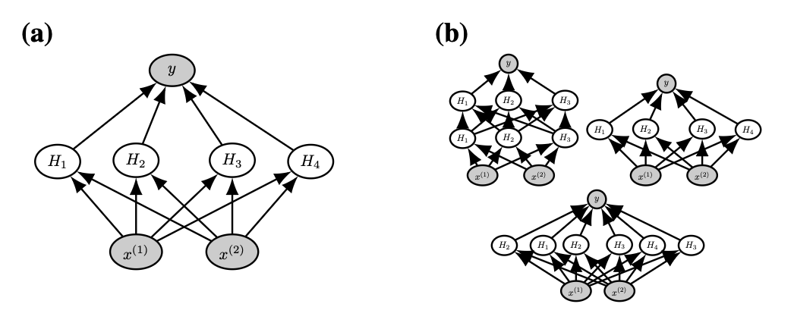
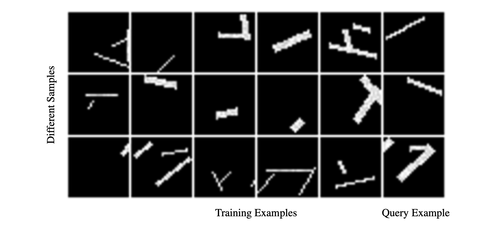
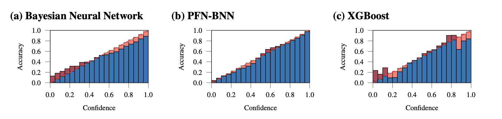

## 들어가며 (Overview)

딥러닝은 데이터가 풍부한 대규모 문제에서 눈부신 성과를 냈지만, **사전지식(prior knowledge)을 명시적으로 주입**하고 **모델의 불확실성(uncertainty)을 정직하게 정량화**하는 데에는 여전히 약점을 보입니다. 반대로 **베이지안 추론(Bayesian inference)**은 이 두 가지를 원리적으로 제공하지만, 대부분의 흥미로운 사전분포에 대해 **사후분포가 계산 불가능(intractable)**하다는 치명적인 한계가 있습니다.

이 논문은 이 간극을 메우기 위해 **Prior-Data Fitted Networks (PFNs)** 라는 방법을 제안합니다. 핵심 아이디어는 놀라울 정도로 단순합니다.

- 사후분포를 근사하는 문제를, **집합(set)을 입력으로 받는 지도학습 분류 문제**로 재정의합니다.
- 사전분포에서 **가상의 데이터셋을 반복적으로 샘플링**하고, 그중 하나의 레이블을 가린 뒤(masking) 나머지 데이터를 조건으로 그 값을 맞히도록 트랜스포머를 학습시킵니다.
- 이렇게 학습된 모델은 **실제 데이터셋과 질의점(query point)을 입력받아, 단 한 번의 순전파만으로** 사후예측분포를 근사합니다. 이 과정이 바로 **in-context learning(맥락 내 학습)** 입니다.

이 글에서는 논문의 흐름을 그대로 따라가며, PFN의 손실함수가 왜 정확히 사후예측분포를 근사하게 되는지(이론적 보장), 트랜스포머를 어떻게 개조했는지(아키텍처와 Riemann 분포), 그리고 GP·BNN·표 형식 데이터·소수샷 학습에 이르는 광범위한 실험 결과를 차례로 정리하겠습니다.

---

## 초록 (Abstract)

PFN의 핵심 주장을 먼저 요약하면 다음과 같습니다.

- **동작 요건이 극히 약합니다.** PFN이 동작하기 위해 필요한 유일한 조건은, **지도학습 과제(task)들에 대한 사전분포에서 샘플링할 수 있는 능력**뿐입니다. 이는 기존 베이지안 근사 방법들이 요구하는 조건(비정규화 사후분포에 대한 접근 등)보다 훨씬 완화된 것입니다.
- **목표의 재정의.** 사후분포 근사라는 목표를, **집합값 입력(set-valued input)을 갖는 지도학습 분류 문제**로 바꿉니다. 즉, 사전분포에서 과제를 뽑고 → 데이터점과 레이블을 뽑고 → 하나의 레이블을 가린 뒤 → 나머지를 조건으로 그 값을 확률적으로 예측하도록 학습합니다.
- **단일 순전파 추론.** 학습이 끝난 PFN은 새로운 과제의 샘플 집합을 입력받아, **단 한 번의 순전파로 임의의 다른 데이터점에 대한 확률적 예측**을 수행합니다.
- **성능과 속도.** PFN은 가우시안 과정(GP)을 거의 완벽하게 모방할 수 있으며, 계산 불가능한 문제에 대해서도 효율적인 베이지안 추론을 가능하게 합니다. 여러 설정에서 기존 방법 대비 **200배 이상의 속도 향상**을 보였습니다.
- **범용성.** GP 회귀, 베이지안 신경망(BNN), 소규모 표 형식 데이터 분류, 소수샷 이미지 분류 등 매우 다양한 영역에서 강력한 결과를 얻었습니다.

![Figure: PFN의 전체 파이프라인을 요약한 그림입니다. 왼쪽에서는 사전분포 $p(\mathcal{D})$로부터 $K$개의 가상 데이터셋 $\mathcal{D}^{(i)}$를 샘플링하고, 각 데이터셋을 학습용 부분 $\mathcal{D}^{(i)}_{train}$과 홀드아웃 테스트점 $(x^{(i)}_{test}, y^{(i)}_{test})$로 나눕니다. 중앙에서는 음의 로그가능도 $-\sum_i \log q_\theta(y^{(i)}_{test}\mid x^{(i)}_{test}, \mathcal{D}^{(i)}_{train})$를 최소화하여 PFN을 학습시킵니다. 오른쪽에서는 학습이 끝난 파라미터 $\theta^*$를 가진 PFN에 실제 학습 데이터 $\mathcal{D}_{train}$과 테스트 입력 $x_{test}$를 넣어, 단일 순전파로 $q_{\theta^*}(y_{test}\mid x_{test}, \mathcal{D}_{train}) \approx p(y_{test}\mid x_{test}, \mathcal{D}_{train})$, 즉 참 사후예측분포의 근사를 얻습니다.](./images/figure_pfn_overview.png)

---

## 1. 서론 (Introduction)

### 1.1 문제 설정: 작은 데이터로의 전이

지난 10년간 딥러닝 아키텍처를 사용한 지도학습은 **대량의 학습 데이터가 존재하는** 과제에서 큰 진전을 이루었습니다(Vaswani et al., 2017; He et al., 2016; Krizhevsky et al., 2012). 따라서 머신러닝의 중요한 과제는 이 성공을 **데이터가 적은 소규모 설정으로 전이**하는 것입니다.

이 논문이 제안하는 접근은, **유연하고 교체 가능한(flexible and replaceable) 사전분포**를 갖는 사후분포 근사 모델을 딥러닝으로 구축하는 것입니다. 이 방식의 매력은 사전분포를 지정하는 일이 곧 **지도학습 과제의 샘플링 방식(sampling scheme)을 정의하는 것**만큼 간단해진다는 데 있습니다.

### 1.2 왜 베이지안 추론인가

딥러닝의 대규모 데이터에서의 성공은 신경망이 **임의의 함수를 근사할 수 있는 표현력**에서 기인합니다. 하지만 여전히 사전지식을 인코딩할 필요가 있습니다. 그 방법으로는 다음이 있습니다.

- **모델 아키텍처를 통한 주입**: 예를 들어 합성곱 신경망(CNN, LeCun et al., 1989)
- **정칙화(regularizer)를 통한 주입**: 예를 들어 데이터 증강(data augmentation)

그렇지 않으면 **공짜 점심 없음 정리(No Free Lunch Theorem, Wolpert & Macready, 1997)**에 따라, 모든 예측 문제를 잘 푸는 만능 방법은 존재하지 않습니다. 그래서 소규모 과제마다 특화된 알고리즘들이 다수 개발되어 왔습니다.

모델에 편향(bias)을 부여하는 잘 정의된 방법이 바로 **베이지안 추론**입니다. 베이지안 추론의 토대는 **실제 응용에서 나타날 데이터의 분포에 대한 가정**이며, 이 가정이 곧 데이터가 특정 모델을 따를 확률에 대한 **사전믿음(prior belief)**을 형성합니다. 예를 들어 데이터가 신경망(BNN, MacKay, 1992), 다항식, 가우시안 혼합의 가능도, 혹은 사전 정의된 프로그래밍 언어의 무작위 코드(Solomonoff, 1997)에 의해 생성되었다는 사전분포를 구현할 수 있습니다.

베이지안 추론을 예측에 사용할 때의 장점은 다음 네 가지입니다.

1. **이론적 타당성**: 사전분포 $p(t)$가 실제와 맞는 설정에서 원리적으로 유효합니다.
2. **가능도 반영**: 서로 다른 사건들의 실제 가능도(likelihood)를 더 잘 설명합니다.
3. **좋은 보정(calibration)**: 예측 확률이 잘 보정되어 있습니다.
4. **해석 가능성**: 사전분포가 모델의 기대(expectation)를 기술하므로 해석 가능합니다.

그러나 결정적 단점이 있습니다. **주어진 사전분포에 대해 사후예측분포를 구하는 것은 대부분의 경우 계산 불가능**하다는 점입니다(Blei et al., 2017; MacKay, 1992).

### 1.3 PFN의 등장

PFN은 이러한 베이지안 모델을 근사하기 위한 방법입니다(Figure 1).

- 지도학습 과제(또는 함수)에 대한 **대표적 사전분포**가 주어졌다고 가정합니다. 이것이 우리의 **귀납적 편향(inductive bias)**을 제공합니다.
- PFN을 학습하기 위해, **전체 데이터셋을 표현하는 집합값 입력**을 사용하는 지도학습을 수행합니다. 사전분포에서 메타-학습 과제를 반복 샘플링하고, 데이터점과 레이블 집합을 뽑고, 하나의 레이블을 가린 뒤, 나머지 집합값 입력을 조건으로 그 값을 확률적으로 예측하도록 학습합니다.
- 실제 데이터셋이 주어지면, 그것을 테스트점과 함께 PFN에 넣어 **해당 테스트점에 대한 예측 분포**를 얻습니다. 이것이 바로 **in-context learning**입니다.

이 논문이 보이듯, 이 분포는 **정확한 베이지안 사후예측**을 근사합니다. 저자들은 PFN 자체의 학습(training)과 구분하여, 이 예측 단계를 **(베이지안) 추론(inference)**이라 부릅니다.

핵심적으로, PFN은 **샘플링만 가능하면 어떤 사전분포에 대해서도 사후예측분포를 근사**할 수 있게 해줍니다. 이는 다른 베이지안 근사법들의 표준 가정에 비해 매우 약한 요건입니다.

### 1.4 기여 (Contributions)

- 사후예측분포(PPD) 근사를 위해 트랜스포머를 성공적으로 활용하는 **아키텍처적 변경**을 제시합니다. 여기에는 회귀 과제를 위한 **새로운 예측 분포(Riemann distribution)**가 포함됩니다. 제안 방법은 단순하고 저렴하며 광범위한 사전분포에 적용 가능합니다.
- PFN이 GP와 BNN의 PPD를 **MCMC(NUTS)나 SVI(Bayes-by-Backprop)보다 수십~수천 배 빠르게** 근사할 수 있음을 보입니다.
- PFN이 실제 과제에 영향을 줄 수 있음을 보입니다. (i) **아키텍처에 대한 사전분포를 갖는 BNN**을 PFN 위에 구현하여, 소규모 표 형식 데이터 벤치마크에서 튜닝 없이 단일 순전파로 모든 베이스라인을 능가합니다. (ii) 단순한 **필기(handwriting) 사전분포**로 Omniglot에서 소수샷 학습을 가능하게 합니다.

---

## 2. 배경 (Background)

### 2.1 대규모 데이터로부터의 지식 전이

이 논문은 **대량의 데이터를 활용해, 이후 소량의 데이터만 가용한 과제에서 강력한 성능**을 내는 것을 다룹니다. 이러한 접근의 성공 사례로는 이미지 데이터에 대한 비지도 모델의 미세조정(fine-tuning), 대규모 언어 코퍼스 학습, 언어 모델을 위한 프롬프트 설계 등이 있습니다. 다만 **PFN이 사용하는 모든 데이터는 인위적으로 생성된(artificially generated)** 것이라는 결정적 차이가 있습니다.

### 2.2 메타-학습과 뉴럴 프로세스

**메타-학습(meta-learning, 또는 learning-to-learn)**에서는 학습용 데이터셋들의 집합으로부터 검증용 데이터셋들의 집합으로 학습 방법을 일반화하려 합니다. PFN과 유사하게, **단일 순전파로 학습하는 법을 배우는** 연구 분야가 존재합니다(Santoro et al., 2016 등). 최근에는 **(조건부) 뉴럴 프로세스(Conditional Neural Processes)**가 메타-학습을 위해 제안되었습니다.

기존 메타-학습과 PFN의 결정적 차이는 다음과 같습니다.

- PFN은 학습 문제를 **직접 설정**하고, 그로부터 **즉석에서(on-the-fly) 생성되는 인위적 데이터셋**을 샘플링합니다.
- 그 결과 PFN은 단지 "학습하는 법을 배우는" 데 그치지 않고, **베이지안 추론을 수행하는 법을 배운다**는 것을 이론적으로 보일 수 있습니다.

### 2.3 베이지안 사후예측분포(PPD)의 정의

이 연구의 관심사는 지도학습 문제에 대한 **베이지안 사후예측**입니다. 즉, 임의 크기 $n$의 지도학습 데이터셋

$$
\mathcal{D} = \{(x_i, y_i)\}_{i=1}^{n}
$$

을 바탕으로 새로운 입력 $x$에 대한 출력 $y$를 모델링합니다. 이를 베이지안적으로 다루기 위해, **잠재변수(latent variable)이자 과제(task)인 $t$에 대한 사전분포 $p(t)$**를 도입합니다.

이제 **베이즈 정리(Bayes' Theorem)**를 사용하여 사후분포 $p(t \mid \mathcal{D})$를 정의할 수 있습니다.

$$
p(t \mid \mathcal{D}) = \frac{p(\mathcal{D} \mid t)\, p(t)}{p(\mathcal{D})}
$$

예측에서 결정적으로 중요한 분포인 **사후예측분포(Posterior Predictive Distribution, PPD)**는 다음과 같이 유도됩니다.

$$
p(y \mid x, \mathcal{D}) = \int_{t} p(y \mid x, t)\, p(t \mid \mathcal{D})\, dt \tag{1}
$$

#### 식 (1)의 의미 단계별 설명

- 우리가 알고 싶은 것은 **과제 $t$가 무엇인지 확정하지 않은 상태에서**의 예측 분포 $p(y \mid x, \mathcal{D})$입니다.
- 만약 과제 $t$를 안다면, 예측은 $p(y \mid x, t)$로 주어집니다(가능도 모델).
- 하지만 데이터 $\mathcal{D}$만 관측했을 뿐 $t$는 불확실하므로, $t$에 대한 우리의 믿음 $p(t \mid \mathcal{D})$로 **가중 평균(주변화, marginalization)**합니다.
- 즉 식 (1)은 "가능한 모든 과제 $t$에 대해, 그 과제가 참일 확률 $p(t\mid\mathcal{D})$을 가중치로 하여 예측 $p(y\mid x,t)$를 평균낸 것"입니다. 이 적분이 바로 **불확실성을 정직하게 반영하는 베이지안 예측**의 본질입니다.

일부 경우(예: 가우시안 과정)에는 PPD $p(y\mid x, \mathcal{D})$를 **닫힌 형식(closed form)**으로 얻을 수 있지만, 대부분은 근사만 가능합니다.

### 2.4 사후분포를 근사하는 두 가지 전통적 방법

전통적으로는 먼저 사후분포 $p(t\mid\mathcal{D})$를 근사하고, 이를 바탕으로 PPD를 근사합니다. 사후분포 근사에는 대표적으로 두 부류가 있습니다.

- **마르코프 연쇄 몬테카를로(Markov Chain Monte Carlo, MCMC)**: NUTS(Hoffman et al., 2014) 등이 대표적이며, **정확하지만 때때로 매우 느린** 근사를 제공합니다. MCMC는 비정규화 사후분포 $f(t\mid\mathcal{D},x) \propto p(t\mid\mathcal{D},x)$에 대한 접근을 요구합니다.
- **변분 추론(Variational Inference, VI)**: 사후분포를 **다루기 쉬운 분포**(예: 인수분해된 정규분포)로 근사합니다. VI는 결합밀도 $p(t, \mathcal{D})$의 밀도값에 대한 접근을 요구합니다.

즉, MCMC와 VI 모두 계산하기 어려울 수 있는 양들에 대한 접근을 필요로 합니다.

### 2.5 시뮬레이션 기반 추론과의 관계

관련된 또 다른 연구 흐름은 **분할상환 시뮬레이션 기반 추론(amortized simulation-based inference)**, 특히 **뉴럴 사후분포 추정(neural posterior estimation)**입니다. 여기서의 목표는 $p(t, X)$로부터의 샘플로 학습하여 사후분포 $p(t \mid X)$를 근사하는 모델을 찾는 것입니다(여기서 $X$는 단일 벡터인 경우가 많습니다).

- **공통점**: PFN과 시뮬레이션 기반 추론 모두 **오직 사전분포로부터의 샘플만** 사용합니다.
- **차이점**: 기존 시뮬레이션 기반 추론은 데이터의 기저 모델이 알려진 시뮬레이션에 초점을 둡니다. 반면 PFN은 **사후분포를 결코 명시적으로 인스턴스화하지 않고 PPD를 직접 모델링**하며, 이를 **일반적 사전분포를 갖는 대규모 데이터셋**에 적용합니다.

---

## 3. PFN을 이용한 PPD 근사 (PPD Approximation with PFNs)

### 3.1 모델과 학습 알고리즘

파라미터화된 모델 $q_\theta$를 생각합니다. 이 모델은 데이터셋 $\mathcal{D} = \{(x_i, y_i)\}_{i=1}^{n}$과 질의 $x$를 입력으로 받아, 질의 $x$에 대한 $y$의 **가능한 값들에 대한 분포**를 예측합니다. 이러한 모델로는 다양한 신경망 아키텍처가 가능하며, 이 논문에서는 **트랜스포머(Vaswani et al., 2017)의 변형**을 사용합니다. 이 모델을 사전분포에서 뽑은 샘플에 대한 **교차 엔트로피(cross-entropy)**로 학습시킵니다.

학습 절차는 아래 알고리즘으로 정리됩니다.

```
Algorithm 1: Fitting Prior-Data로 PFN 모델 학습하기
────────────────────────────────────────────────────────
입력 : 데이터셋에 대한 사전분포 p(D) (샘플링 가능), 뽑을 샘플 수 K
출력 : PPD를 근사하는 모델 q_θ

신경망 q_θ 초기화;
for j ← 1 to K do
    사전분포에서 데이터셋 샘플링: D ∪ {(x_i, y_i)}_{i=1}^{m} ~ p(D);
    확률적 손실 근사 계산:  ℓ̄_θ = Σ_{i=1}^{m} ( -log q_θ(y_i | x_i, D) );
    확률적 경사하강으로 θ 갱신:  θ ← θ - η ∇_θ ℓ̄_θ;
end
────────────────────────────────────────────────────────
```

### 3.2 Prior-Data 음의 로그가능도 (Prior-Data NLL)

제안된 손실함수인 **Prior-Data Negative Log-Likelihood (Prior-Data NLL)** $\ell_\theta$는 다음과 같이 정의됩니다.

$$
\ell_\theta = \mathbb{E}_{\mathcal{D} \cup \{x, y\} \sim p(\mathcal{D})}\big[-\log q_\theta(y \mid x, \mathcal{D})\big] \tag{2}
$$

여기서 $\mathcal{D} \cup \{x, y\}$는 단순히 $p(\mathcal{D})$에서 샘플링한 크기 $|\mathcal{D}| + 1$의 데이터셋입니다. PFN은 이 $\ell_\theta$를 최소화하도록 학습됩니다. 즉, **사전분포에서 많은 데이터셋을 뽑고, 각 데이터셋에서 홀드아웃된 예시를 올바르게 예측하도록** 모델을 적합시킵니다.

**VI·MCMC와의 근본적 차이**를 정리하면 다음과 같습니다.

- PFN은 **데이터셋 샘플로부터 PPD를 직접 근사**하는 법을 배웁니다.
- 우리가 다루는 모든 경우에서 $p(\mathcal{D})$로부터 샘플링하는 것은 **단순하고 저렴**하며, 이것이 PFN이 요구하는 **유일한 조건**입니다.
- 반면 MCMC는 비정규화 사후분포에, VI는 결합밀도값에 접근해야 하는데, 이는 모두 계산이 어려울 수 있습니다.

### 3.3 이론적 보장 I — Insight 1: 손실 = 교차 엔트로피

Gordon et al. (2019)의 표준 손실 유도를 메타 수준으로 확장하면, **Prior-Data NLL을 최소화하는 것이 곧 PPD를 교차 엔트로피(그리고 KL 발산) 관점에서 근사하는 것**임을 보일 수 있습니다.

> **Insight 1.** 제안된 목적함수 $\ell_\theta$는 PPD와 그 근사 $q_\theta$ 사이의 **교차 엔트로피의 기댓값**과 같다.
> $$\ell_\theta = \mathbb{E}_{x, \mathcal{D} \sim p(\mathcal{D})}\big[H(p(\cdot \mid x, \mathcal{D}), q_\theta(\cdot \mid x, \mathcal{D}))\big]$$

#### 증명 (단계별)

먼저 **교차 엔트로피의 정의**를 상기합니다. 두 분포 $p, q$에 대해
$$
H(p, q) = -\int p(y) \log q(y)\, dy.
$$

이제 손실 (2)를 적분 형태로 전개합니다.

$$
\ell_\theta = -\int_{\mathcal{D}, x, y} p(x, y, \mathcal{D}) \log q_\theta(y \mid x, \mathcal{D}) \tag{3}
$$

- **1단계 (결합확률의 분해).** 확률의 연쇄법칙에 의해 $p(x, y, \mathcal{D}) = p(x, \mathcal{D})\, p(y \mid x, \mathcal{D})$입니다. 이를 대입하고, $y$에 무관한 항 $p(x,\mathcal{D})$를 안쪽 적분 밖으로 빼냅니다.

$$
= -\int_{\mathcal{D}, x} p(x, \mathcal{D}) \int_{y} p(y \mid x, \mathcal{D}) \log q_\theta(y \mid x, \mathcal{D}) \tag{3'}
$$

- **2단계 (교차 엔트로피로의 인식).** 안쪽 적분 $-\int_y p(y\mid x,\mathcal{D})\log q_\theta(y\mid x,\mathcal{D})$은 정확히 교차 엔트로피 $H(p(\cdot\mid x,\mathcal{D}), q_\theta(\cdot\mid x,\mathcal{D}))$입니다.

$$
= \int_{\mathcal{D}, x} p(x, \mathcal{D})\, H\big(p(\cdot \mid x, \mathcal{D}), q_\theta(\cdot \mid x, \mathcal{D})\big) \tag{4}
$$

- **3단계 (기댓값 표기).** 마지막으로, $p(x,\mathcal{D})$에 대한 적분은 기댓값으로 표현됩니다.

$$
= \mathbb{E}_{x, \mathcal{D} \sim p(\mathcal{D})}\big[H(p(\cdot \mid x, \mathcal{D}), q_\theta(\cdot \mid x, \mathcal{D}))\big]. \quad\blacksquare
$$

따라서 우리는 **PPD의 근사**를 손에 넣었습니다. 교차 엔트로피는 $q_\theta = p$일 때 최소화되므로, $\ell_\theta$의 최소화는 $q_\theta$를 참 PPD $p$에 가깝게 만듭니다.

### 3.4 이론적 보장 II — Corollary 1.1: 손실 = KL 발산 (상수 차이)

교차 엔트로피는 KL 발산과 밀접합니다. 이를 통해 손실을 KL 발산으로 재표현할 수 있습니다.

> **Corollary 1.1.** 손실 $\ell_\theta$는 사전분포 데이터 $x, \mathcal{D}$에 대한 **기대 KL 발산** $\mathbb{E}_{\mathcal{D}, x}[\mathrm{KL}(p(\cdot\mid x,\mathcal{D}), q_\theta(\cdot\mid x,\mathcal{D}))]$과 **가법적 상수(additive constant)만큼의 차이**를 갖는다.

#### 증명 (부록 A)

KL 발산의 정의에서 출발합니다.

$$
\mathbb{E}_{x, \mathcal{D}}\big[\mathrm{KL}(p(\cdot \mid x, \mathcal{D}), q_\theta(\cdot \mid x, \mathcal{D}))\big] \tag{5}
$$

- **1단계 (KL의 로그비 전개).** $\mathrm{KL}(p, q) = \int p \log \frac{p}{q}$이므로, 부호를 정리하여 다음을 얻습니다.

$$
= -\mathbb{E}_{x, \mathcal{D}}\left[\int_{y} p(y \mid x, \mathcal{D}) \log \frac{q_\theta(y \mid x, \mathcal{D})}{p(y \mid x, \mathcal{D})}\right] \tag{6}
$$

- **2단계 (로그의 분리).** $\log \frac{q}{p} = \log q - \log p$를 사용하여 두 항으로 나눕니다.

$$
= -\mathbb{E}_{x, \mathcal{D}}\left[\int_{y} p(y \mid x, \mathcal{D}) \log q_\theta(y \mid x, \mathcal{D})\right] + \mathbb{E}_{x, \mathcal{D}}\left[\int_{y} p(y \mid x, \mathcal{D}) \log p(y \mid x, \mathcal{D})\right] \tag{7}
$$

- **3단계 (교차 엔트로피와 엔트로피로의 인식).** 첫 항은 교차 엔트로피의 기댓값, 둘째 항은 음의 엔트로피의 기댓값입니다.

$$
= \mathbb{E}_{x, \mathcal{D}}\big[H(p(\cdot \mid x, \mathcal{D}), q_\theta(\cdot \mid x, \mathcal{D}))\big] - \mathbb{E}_{x, \mathcal{D}}\big[H(p(\cdot \mid x, \mathcal{D}))\big] \tag{8}
$$

- **4단계 (Insight 1 대입).** 첫 항은 정확히 $\ell_\theta$(Insight 1)이고, 둘째 항 $C = -\mathbb{E}_{x,\mathcal{D}}[H(\cdot\mid x,\mathcal{D})]$는 **$\theta$에 의존하지 않는 상수**입니다.

$$
= \ell_\theta + C. \quad\blacksquare \tag{9}
$$

이 따름정리는 실험에서 매우 중요합니다. **Prior-Data NLL이 참 PPD와 근사 사이의 KL 발산과 상수 차이만 갖는다**는 사실은, NLL을 곧 "**참 PPD에 얼마나 가까운가**"의 척도로 사용할 수 있게 해줍니다.

### 3.5 이론적 보장 III — Corollary 1.2: 완벽 실현 가능성

> **Corollary 1.2.** 만약 $p$가 분포족 $q_\theta$의 원소라면(즉, $q_\theta = p$가 되는 $\theta$가 존재한다면), 최적해 $\theta^*$에 대해 $p(\cdot\mid x,\mathcal{D})$가 정의되는 모든 $x, \mathcal{D}$에서 $q_{\theta^*}(\cdot\mid x,\mathcal{D}) = p(\cdot\mid x,\mathcal{D})$이다.

**증명 (부록 B.1)** $q_\theta = p$가 되는 $\theta$가 존재한다고 가정합니다. 교차 엔트로피는 두 분포가 같을 때 최소화되므로, 최적해 $\theta^*$는 **사전분포의 밀도가 양수인 부분집합**($p(x,\mathcal{D}) > 0$)에서 $q_{\theta^*}(\cdot\mid x,\mathcal{D}) = p(\cdot\mid x,\mathcal{D})$를 만족합니다. 이는 정확히 조건부가 정의되는 영역과 일치합니다. $\blacksquare$

> **[역사적 각주]** 이 발견(2024년 갱신)은 Foong et al. (2020)의 Section 3.2 Prop. 1에서 먼저 발표되었습니다.

이후 논의에서는 주어진 최적화 문제의 최적해 $\theta^* \in \arg\min_\theta \ell_\theta$를 고려합니다.

> **한 줄 요약**: 학습 손실을 줄이면 **과적합 없이** 근사가 참 사후분포에 가까워집니다. 이것이 PFN이 표준 MLE 학습과 결정적으로 다른 지점입니다(부록 D 참조).

---

## 4. 베이지안 추론을 위한 트랜스포머 개조 (Adapting the Transformer for Bayesian Inference)

이 절에서는 트랜스포머 인코더(Vaswani et al., 2017)에 기반한 효율적 아키텍처와, 회귀 문제를 위한 **새로운 회귀 헤드(regression head)**를 제안합니다.


### 4.1 효율적인 아키텍처 (An Efficient Architecture)

핵심 아이디어는 **위치 인코딩(positional encoding)을 제거**하여 데이터셋 $\mathcal{D}$ 내 순서에 대한 **불변성(invariance)**을 얻는 것입니다.

- **입력/질의 인코딩**: $x$와 $y$를 인코딩하며, 모든 실험에서 단순한 **선형 계층(linear layer)**을 사용합니다. (응용에 따라 특화된 인코딩 계층도 가능합니다.)
- **순열 등변성(permutation equivariance)**: 위치 인코딩을 제거하고, $(x, y)$ 쌍을 그들의 인코딩의 **합(sum)**으로 트랜스포머에 함께 입력합니다.
- **질의점 처리**: 효율을 위해 질의점들을 함께 입력합니다. 위치가 중요한 유일한 입력이 질의점이며, 이들의 출력 위치를 해당 $y$에 대한 PPD 예측으로 사용합니다.
- **어텐션 마스크**: 서로 다른 질의점은 상호 의존하면 안 되므로, **모든 입력 예시는 다른 모든 입력 예시에 어텐션**할 수 있고, **모든 질의점은 모든 입력 예시에 어텐션**할 수 있지만 질의점끼리는 어텐션하지 못하도록 마스킹합니다(Figure 2a).

#### 학습 시 데이터셋 크기 다루기 (부록 E.1)

- 학습 중에는 전체 입력 수 $N = n + m$을 고정합니다. 여기서 $n$은 입력 수, $m$은 질의 수입니다.
- 트랜스포머가 다양한 데이터셋 크기에 대응하도록, $n$을 어떤 분포에서 샘플링합니다.
- $n$이 작으면 학습할 질의점이 더 많아지므로, **큰 $n$을 과대 표집(over-sample)**하여 각 $n$마다 학습에서 보는 질의점 수가 대략 같아지도록 합니다. 구체적으로, 각 $n \in \{0, \dots, N-1\}$을 가중치 $1/m = 1/(N-n)$으로 샘플링합니다.
- **예측 헤드**: 다중분류에는 소프트맥스, 이진분류에는 시그모이드, 회귀에는 **Riemann 분포**를 사용합니다.

### 4.2 Riemann 분포 (Riemann Distribution)

신경망으로 **연속분포를 모델링하는 것은 어렵습니다.** PFN은 대신, 신경망이 **분류(classification)에서 잘 작동한다**는 사실과 분포적 강화학습(distributional RL, Bellemare et al., 2017)의 이산화에서 영감을 받아, **이산화된 연속분포**인 **Riemann 분포**를 사용합니다.

- 이 분포의 확률밀도함수(PDF)는 **막대그래프** 형태입니다(Figure 2b).
- 이산화 구간(bucket) 집합 $\mathbf{B}$의 경계는, **사전분포 데이터에서 모든 구간이 동일한 확률**을 갖도록 선택합니다. 즉,
$$
p(y \in b) = \frac{1}{|\mathbf{B}|}, \quad \forall b \in \mathbf{B}.
$$
이 경계는 대량의 사전분포 데이터 샘플로 추정합니다.
- **무계 지지집합**이 필요한 경우, 양 끝의 마지막 막대를 적절히 스케일된 **half-normal 분포**로 대체합니다(Figure 2c).

#### Riemann 분포의 정확한 정의 (부록 E.2)

구간 집합 $\mathbf{B}$가 주어졌을 때, 각 구간 $b \in \mathbf{B}$는 다음을 만족하는 구간(interval)입니다.

$$
\bigcup_{b \in \mathbf{B}} b = [a, b], \qquad b \cap b' = \emptyset \;\; (\forall b, b' \in \mathbf{B}) \tag{28}
$$

- 최저(최고) 구간의 상한(하한)을 $l$ ($f$)로 정의하고, $y \in \mathbb{R}$을 유일한 구간 $b$로 사상하는 함수 $B(\cdot)$를 정의합니다.
- 각 구간의 폭(width)을 $w(b) = \max_{y\in b} y - \min_{y\in b} y$로 정의합니다.
- 모델이 각 구간 $b$에 대한 확률 $p_b$를 준다고 가정합니다.

**유한(finite) 지지집합의 경우**, Riemann 분포는 다음과 같습니다.

$$
p(y) = \frac{p_{b(y)}}{w(b(y))} \tag{29}
$$

여기서 구간의 폭으로 정규화하는 이유는, $p_b$가 "구간에 속할 확률" $p(y' \in b)$을 나타내는 반면, 우리가 원하는 것은 **점 밀도** $p(y = y')$이기 때문입니다. (즉, 이산 확률질량을 구간 폭으로 나누어 밀도로 환산합니다.)

**무한(infinite) 지지집합의 경우**는 다음과 같습니다.

$$
f(y_q) =
\begin{cases}
2 \cdot f_{\mathcal{N}}(y_q - l), & \text{if } y_q \leq l \\
2 \cdot f_{\mathcal{N}}(f - y_q), & \text{if } y_q \geq f \\
p_b(y_q)/w(b(y_q)), & \text{otherwise}
\end{cases} \tag{30}
$$

여기서 half-normal 분포들은 **확률질량의 절반이 첫(마지막) 구간의 경계 안쪽에 들어오도록** 스케일됩니다.

### 4.3 Riemann 분포의 표현력 — Theorem 1

> **Theorem 1.** 유한 지지집합을 갖는 Riemann 분포 $q_{\mathbf{B}}$(여기서 $\mathbf{B}$는 구간들)는, **유한하고 거의 모든 곳에서 연속(Riemann 적분 가능)이며 완전 지지집합(full support)을 갖는** 임의의 밀도함수를 **임의의 정밀도로** 모델링할 수 있다. 즉,
> $$\forall p\,\forall \epsilon\,\exists \mathbf{B}.\; \mathrm{KL}(q_{\mathbf{B}}, p) \leq \epsilon.$$

#### 증명 (부록 C) — 핵심 흐름

증명은 다소 기교적이지만, **Riemann 적분의 Darboux 상/하합(upper/lower sums)**과 **Lambert W 함수**를 사용하는 우아한 논증입니다. 핵심 단계를 따라가 보겠습니다.

임의의 분포 $p$와 임의의 오차 한계 $\epsilon$이 주어졌다고 합시다. 구간 경계 $a$(최소), $b$(최대)에 대해, 위치 $y$를 그 구간 $b \in \mathbf{B}$로 사상하는 함수를 생각합니다.

**1단계 — 구간별 상/하한 정의.** 각 구간 내에서 $p$의 상한과 하한을 정의합니다.

$$
u(y) = \sup_{y' \in bs(y)} p(y'), \qquad l(y) = \inf_{y' \in bs(y)} p(y') \tag{10, 11}
$$

이들의 로그 형태 $\hat{u}(y) = \log u(y)$, $\hat{l}(y) = \log l(y)$도 함께 고려합니다. 로그는 단조증가이므로 $\sup$($\inf$) 안으로 이동시킬 수 있습니다.

**2단계 — Darboux 상/하합과의 연결.** $\hat{u}$와 $\hat{l}$에 대한 적분은 정확히 $\log p$의 **Darboux 상합과 하합**을 나타냅니다. $p$가 Riemann 적분 가능하다고 가정했으므로, $\log p$ 역시 적분 가능합니다. (이유: $\log x$는 $x > 0$에서 연속이고, 연속함수와 거의 모든 곳에서 연속인 함수의 합성은 거의 모든 곳에서 연속이며, $p$의 완전 지지집합 가정으로 $x > 0$이 보장되기 때문입니다.) 따라서 다음이 성립합니다.

$$
\forall \epsilon' \, \exists \mathbf{B}.\; \int_a^b \big(\hat{u}(y) - \hat{l}(y)\big)\, dy < \epsilon'
$$

**3단계 — 핵심 양들의 정의.** 다음을 정의합니다.

$$
t = \sup_{y \in [a,b]} p(y), \qquad T = \sup_{y \in \mathbb{R}} p(y), \qquad P = p(y \in [a, b]).
$$

$\epsilon' = \log(1/P)$로 두면, $p$가 완전 지지집합을 가지므로 임의의 경계 $a, b$에 대해 $P < 1$이 되어 $\epsilon' > 0$이 보장됩니다. 이 $\mathbf{B}$에서 출발하여 부등식 (12)–(15)를 전개합니다.

$$
\int_a^b \hat{u}(y) - \hat{l}(y)\, dy < \log\frac{1}{P} \tag{12}
$$

양변에 $t$를 곱하고($t \cdot (\hat u - \hat l)$), 로그의 성질과 $u(y) \ge t \cdot (\cdots)$ 관계를 사용하여 다음으로 진행합니다.

$$
\int_a^b u(y) \log \frac{u(y)}{l(y)}\, dy < t \log(1/P) \tag{15}
$$

**4단계 — 유효 확률분포로의 정규화.** $\int c\,u(y)\,dy = 1$이 되도록 하는 상수 $c$를 도입합니다. 즉 $c\,u(y)$가 유효한 확률분포가 되게 합니다. 양변을 조작하면 (16)–(18)을 거쳐 다음을 얻습니다.

$$
\int_a^b c\,u(y) \log \frac{c\,u(y)}{l(y)}\, dy < c\,t \log(1/P) + \log c \tag{18}
$$

**5단계 — KL 발산으로의 상계.** $c < 1/P$를 사용하고($1/P$는 $\int c' p(y) = 1$을 만드는 인수, $c$는 $u(y) \ge p(y)$에 대한 인수) 부등식 (19)–(26)을 전개합니다. 핵심적으로, $l(y) \le p(y)$이므로 분모를 $p(y)$로 바꿔도 부등식이 유지되어 KL 발산의 정의에 도달합니다.

$$
\mathrm{KL}(c\,u(y), p(y)) < -(T + 1) \frac{\log P}{P} \tag{26}
$$

여기서 $c\,u(y)$는 유효한 막대(bar) 분포입니다.

**6단계 — Lambert W 함수로 마무리.** 이제 $-(T+1)\frac{\log P}{P} < \epsilon$이 되도록 $a, b$를 찾으면 됩니다. 이는 다음과 동치입니다.

$$
\frac{1}{P} \log \frac{1}{P} < \frac{\epsilon}{T + 1} \tag{27}
$$

여기서 **Lambert W 함수**($W_0$, $we^w = z$의 역함수)를 대입하면, $a, b$를 다음을 만족하도록 선택하면 됨을 얻습니다.

$$
p([a, b]) \geq e^{-W_0\left(\frac{\epsilon}{T+1}\right)}.
$$

이는 항상 가능한데, $W_0$는 양의 입력에 대해 $(0, \infty)$로 사상하며, $x \in (0, \infty)$에 대해 $e^{-x} < 1$이고 $e^{-x} > 0$이기 때문입니다. 따라서 임의의 $a, b$에 대해 KL 발산의 상계를 얻고, 그 상계가 $\epsilon$ 아래로 떨어지는 $a, b$를 찾을 수 있으므로 증명이 완료됩니다. $\blacksquare$

> **직관적 정리**: 구간을 충분히 촘촘하게 나누고($\epsilon'$ 항 제어) 지지 구간 $[a,b]$를 충분히 넓게 잡으면($P \to 1$), 막대 분포로 어떤 연속밀도든 KL 의미에서 원하는 만큼 가깝게 근사할 수 있다는 것입니다.

---

## 5. 사후분포 근사 연구 (Posterior Approximation Studies)

첫 번째 실험군에서는 PFN이 다음 세 경우에 베이지안 추론을 수행할 수 있는지 연구합니다.

- **계산 가능(tractable) 경우**: 하이퍼파라미터가 고정된 가우시안 과정(GP) — 참값과 비교 가능 (5.1절)
- **계산 불가능(intractable) 경우 I**: 하이퍼파라미터가 미지인 GP (5.2절)
- **계산 불가능 경우 II**: 베이지안 신경망(BNN) (5.3절)

Corollary 1.1에 따라 Prior-Data NLL은 참 PPD와 근사 사이의 KL 발산과 상수 차이만 가지므로, 이후 모든 실험에서 **방법들이 참 PPD에 얼마나 근접하는지의 척도로 NLL을 사용**합니다. PPD를 직접 근사하지 않는 방법의 경우, 식 (1)의 적분을 대규모 몬테카를로 적분으로 근사합니다. 각 실험에서 **서로 다른 샘플 데이터셋에 대한 Prior-Data NLL의 95% 신뢰구간**을 음영으로, 평균을 선으로 보고합니다.


### 5.1 가우시안 과정 근사 (Gaussian Process Approximation)

GP를 먼저 근사하는 이유는, **하이퍼파라미터가 고정된 GP의 PPD가 계산 가능**하여 우리의 근사가 참 PPD에 얼마나 가까운지 평가할 수 있기 때문입니다.

- **사전분포 생성 절차**:
  1. $N$개의 입력 $x_i$를 단위 정육면체(unit-cube)에서 균등하게 샘플링합니다.
  2. 커널 함수 $k$를 갖는 평균 0인 GP의 데이터-사전분포는, $K_{i,j} = k(x_i, x_j)$인 다변량 정규분포 $\mathcal{N}(0, K)$로 기술됩니다.
  3. 이 정규분포에서 샘플링하여 데이터셋 $\{(x_1, y_1), \dots, (x_N, y_N)\}$을 얻습니다.
- 그 후 홀드아웃된 부분집합의 $y$를 예측하도록 PFN을 학습시킵니다. 학습된 PFN은 새 데이터셋과 임의 질의점에 대한 PPD를 근사할 수 있습니다.

**결과 (Figure 3, 4a)**:

- 추정된 신뢰구간과 평균이 참값과 사실상 구분 불가능합니다(가장 두드러진 차이만 빨간 화살표로 표시).
- 저자들은 이 실험의 **인터랙티브 버전**을 공개했습니다(HuggingFace Spaces).
- 이 정성적 결과는 최대 **2000개 예시와 다중 특성**을 갖는 데이터셋으로 일반화되며(Figure 4a), 메타-학습 데이터셋을 많이 쓸수록 참 GP 사후분포에 점점 더 가깝게 근사합니다.


### 5.2 하이퍼-사전분포를 가진 GP 근사 (Approximating a GP with Hyper-priors)

실제 응용에서는 GP의 하이퍼파라미터에 대한 분포, 즉 **하이퍼-사전분포(hyper-priors)**를 정의하는 것이 일반적입니다. 이는 데이터점 간 상관, 함수의 매끄러움, 출력의 스케일이 응용마다 다르다는 사실을 모델링합니다.

- **단점**: 하이퍼-사전분포를 쓰면 **GP의 PPD를 더 이상 정확히 계산할 수 없습니다.**
- 이를 근사하는 두 가지 관행이 있으며, 논문은 둘 모두와 비교합니다.
  - **(i) MLE-II**: 가장 흔한 근사로, VI의 단순한 특수 경우입니다. 최대사후확률(MAP) 추정으로 적절한 하이퍼파라미터를 찾습니다. BoTorch(Balandat et al., 2020)의 적합 설정을 사용했으며, 이것이 하이퍼-사전분포에도 영감을 주었습니다.
  - **(ii) MCMC (NUTS)**: 비정규화 확률을 계산할 수 있는 임의 분포에서 샘플링하는 방법으로, 하이퍼파라미터 샘플링에도 자주 쓰입니다. 그래디언트를 이용해 해밀토니안 몬테카를로를 촉진하는 최신 알고리즘 NUTS를 사용했습니다.

**결과 (Figure 4b)**:

- PFN은 사전분포에서 두 방법보다 PPD를 훨씬 가깝게 근사합니다.
- 추론 속도는 **MLE-II보다 200배 이상, NUTS보다 1,000배~8,000배 빠릅니다.**

### 5.3 BNN 근사 (Approximating BNNs)

**베이지안 신경망(BNN)**은 베이지안 특성 덕분에 불확실성을 강력하게 모델링합니다. SVI나 확률적 경사 MCMC(NUTS 등)로 수렴 속도가 크게 개선되었지만, **계산 실현 가능성은 여전히 핵심 난제**입니다.

- **사전분포 데이터 생성**: BNN $\Phi$의 무작위 가중치를 샘플링하고, 정규분포 i.i.d. 특성 벡터 $X_i$로 $y_i := \Phi(X_i)$를 얻어 $\mathcal{D} := (X_{1:n}, y_{1:n})$을 구성합니다.
- **평가 설정**: 100개 데이터셋을 샘플링하고, 각 데이터셋마다 테스트점 $m = 200$개, 드러난 데이터점 $n = 100$개를 사용합니다.

**결과 (Figure 5)**:

- PFN은 오늘날 BNN 추론의 기본 방법들을 **계산 예산의 극히 일부만으로 능가**합니다.
- 같은 성능을 얻는 데 **Bayes-by-Backprop SVI보다 1,000배, NUTS보다 10,000배 빠릅니다.**


---

## 6. 표 형식 데이터셋에 대한 응용 (Application to Tabular Datasets)

이 절에서는 GP와 BNN에 대한 사전분포를 갖는 트랜스포머 기반 분류기를 **소규모 실제 표 형식 데이터셋**에서 평가합니다. 놀랍게도, 아래 설명할 단순한 사전분포들이 **XGBoost, Catboost를 포함한 다수의 베이스라인을 능가**하며, 특히 **불확실성 보정에서 압도적**입니다.

### 6.1 표 형식 분류를 위한 GP 사전분포

5.2절에서 설명한 하이퍼-사전분포를 갖는 GP 기반 분류 사전분포를 구축합니다. 회귀용이던 것을 분류용으로 만들기 위해, **데이터셋의 모든 타깃 $y$의 중앙값(median)을 찾아, 중앙값보다 크면 클래스 1, 아니면 0**으로 설정합니다.

### 6.2 아키텍처에 대한 BNN 사전분포 (A BNN Prior over Architectures)

PFN의 진가는 **가중치뿐 아니라 아키텍처에 대해서도 완전한 베이지안**이 될 수 있다는 데 있습니다.

- 기존에는 신경망 적합 시 적절한 아키텍처(임베딩 크기, 층 수, 활성함수 등)를 찾기 위해 자원 집약적 탐색이 필요했습니다. 이 탐색의 결과는 **아키텍처에 대한 사후분포가 아니라 점추정(point estimate)**에 불과합니다. 이는 베이지안 최적화 접근에서도 마찬가지입니다.
- 앙상블은 아키텍처 분포에 대한 거친 근사를 줄 수 있으나, 고려하는 아키텍처 수에 비례해 비용이 선형으로 증가합니다.
- PFN은 **모델 아키텍처 공간에 대한 사전확률을 정의**함으로써, 최적 아키텍처를 찾을 필요를 없애고 **아키텍처와 그 가중치를 단일 베이지안 추론으로 동시에 적분**합니다. 그 결과 사후분포에 아키텍처에 대한 분포가 나타납니다.

**사전분포 데이터 샘플링 알고리즘** (가중치와 아키텍처 모두에 대한 사전분포):

1. 모델 아키텍처 샘플링: $A \sim p(A)$
2. 해당 아키텍처의 가중치 샘플링: $W_{i,j} \sim p_w(\cdot)$
3. 각 데이터점 $i$와 특성 $f$에 대해 i.i.d. 특성 샘플링: $x_{i,f} \sim \mathcal{N}(0, 1)$
4. 각 $x_i$를 $A_W$로 순전파: $\{(x_i, A_W(x_i))\}_{i=1}^{N}$

타깃은 위 GP 사전분포와 동일하게 이진화합니다.



### 6.3 데이터셋 및 모델 설정

- **데이터셋 설정**: OpenML AutoML Benchmark에서 특성 100개 초과이거나 결측값이 있는 데이터셋을 제거하여, 수치·범주형 특성을 갖는 다양한 **20개 데이터셋**을 얻었습니다. 각 데이터셋을 균형 잡힌 이진분류로 단순화하고, 데이터셋마다 100개 샘플의 부분집합 20개를 뽑아, 각 부분집합에서 **처음 30개에만 레이블을 제공**하고 나머지로 평가합니다. 또한 아키텍처 사전분포 최적화를 위한 **별도의 검증 데이터셋 6개**를 정의합니다(교차검증 그리드서치의 범위 설정과 유사).
- **모델 설정**: 베이스라인은 XGBoost, Catboost, 로지스틱 회귀, K-최근접이웃(KNN), 가우시안 과정(RBF 커널), 베이지안 신경망(Bayes-by-Backprop SVI, Pyro)입니다. Catboost에는 어떤 특성이 범주형인지 추가로 알려주었습니다. PFN은 위 두 사전분포에 대해 각각 하나씩, 총 두 개를 사용했으며, **동일 모델을 서로 다른 특성 차원에 적용**할 수 있었습니다. 베이스라인은 5-겹 교차검증 그리드서치로 데이터셋마다 하이퍼파라미터를 최적화했습니다.

### 6.4 실험 결과 (Table 1)

| Metric | PFN-BNN | PFN-GP | Log. Reg. | GP | KNN | BNN | Catboost | XGB |
|---|---|---|---|---|---|---|---|---|
| Mean rank ROC AUC | **2.786** | 3.833 | 4.690 | 5.286 | 6.214 | 5.000 | 4.833 | 3.357 |
| Loss/Tie/Win vs PFN-BNN | – | 14/1/6 | 16/1/4 | 17/0/4 | 17/1/3 | 17/1/3 | 13/1/7 | 12/2/7 |
| Wilcoxon $p$ vs PFN-BNN | – | 3.6e-13 | 3.6e-13 | 3.9e-13 | 3.6e-13 | 3.6e-13 | 1.9e-12 | 1.6e-06 |
| Expected Calibration Error | **0.025** | 0.067 | 0.157 | 0.095 | 0.093 | 0.089 | 0.157 | 0.066 |
| Benchmark Time | GPU 0:00:13 | 0:09:56 | 0:24:30 | 0:00:34 | 12:04:41 | 2:05:20 | 20:59:46 | CPU 0:04:23 |

*Table 1: 30개 학습 샘플을 갖는 데이터셋 부분집합에 대한 종합 성능. 새로운 PFN-BNN이 전반적으로 가장 강력합니다.*

핵심 관찰은 다음과 같습니다.

- **성능**: PFN-GP는 최고 베이스라인과 대등하고, **PFN-BNN이 가장 강력**합니다. 여러 데이터셋에 걸친 분류기 비교의 표준 지표인 **Wilcoxon 부호순위 검정**이 21개 평가 데이터셋의 20개 부분집합 각각에 대해 평가되어, 유의미한 성능 향상을 보입니다.
- **속도**: PFN은 새 데이터셋에서 **단일 순전파**만 하면 되므로, GPU(Nvidia Tesla V100)에서 20개 데이터셋 전체에 **단 13초**가 걸립니다. 이는 XGBoost가 요구하는 20시간보다 **5000배 이상 빠르며**, KNN보다도 빠릅니다.
- **보정(Calibration)**: PFN은 100개 구간을 사용한 **기대 보정 오차(ECE)**가 표준 BNN이나 XGBoost 같은 앙상블보다도 낮아, 불확실성 예측이 매우 잘 조정되어 있음을 실험적으로 확인합니다(부록 Figure 10).

---

## 7. Few-Shot 학습에 대한 응용 (Application to Few-Shot Learning)

앞 절이 보였듯, PFN은 전통적 베이지안 설정에서 쉽게 쓸 수 없는 사전분포로도 학습할 수 있습니다. 이 절에서는 **필기 숫자·문자에 대한 사전분포**를 구축하여, Omniglot(Lake et al., 2015)에서 강력한 성능을 보입니다(PFN의 미세조정 결합).

- **필기 사전분포**: 손글씨 기호의 근사로, **무작위 직선(straight lines)을 생성**하는 사전분포를 만듭니다. 각 샘플에서 5개의 서로 다른 무작위 선 조합을 **클래스 프로토타입**으로 삼고, 각 클래스의 인스턴스마다 선의 위치에 노이즈를 가합니다. 이 사전분포를 만드는 데는 **읽기 쉬운 코드 단 55줄**이면 충분했습니다(부록 Figure 11).
- **평가 설정 (Omniglot)**: Rothfuss et al. (2021)의 설정을 따라 **5-shot 5-way 분류**(5개 클래스, 클래스당 5개 예시)를 수행합니다. Omniglot의 30개 학습 알파벳과 20개 평가 알파벳 각각의 처음 5개 클래스로 과제를 만듭니다. 합성 사전분포로 PFN을 학습한 뒤, 만들어진 30개 학습 과제로 **미세조정(fine-tuning)**합니다.
- **차별점**: 이 실험은 앞선 절들과 달리 유사 데이터셋에 대한 미세조정이 가능함을 보여줍니다. 과제 증강(task augmentation)은 쓰지 않고, 단순 선형 계층으로 이미지를 인코딩하므로 각 이미지에 **평행이동(translation)**만 적용합니다.

**결과 (Table 2)**:

| Method | Accuracy | Method | Accuracy |
|---|---|---|---|
| Vanilla BNN (Liu & Wang, 2016) | 0.795 ± 0.006 | MLAP (Amit & Meir, 2018) | 0.700 ± 0.0135 |
| MAML (Finn et al., 2017b) | 0.693 ± 0.013 | BMAML (Yoon et al., 2018) | 0.764 ± 0.025 |
| PACOH-NN (Rothfuss et al., 2021) | **0.885 ± 0.090** | PFN (this work) | **0.865 ± 0.019** |

*Table 2: Omniglot 데이터셋에 대한 메타-학습 알고리즘들의 테스트 정확도 비교. 최고 성능의 신뢰구간 내 결과는 볼드 처리.*

이 매우 어려운 버전의 Omniglot에서 PFN의 단순한 방법은 **최신 기법(SOTA)과 대등한** 결과를 냅니다.



---

## 8. 결론 및 향후 연구 (Conclusion & Future Work)

이 논문은 심층 신경망으로 **사후예측분포를 효율적으로 근사하는 새로운 방법인 PFN**을 제시하고, 다양한 과제와 사전분포에서 그 역량을 입증했습니다. 저자들이 특히 유망하다고 본 향후 연구 방향은 다음과 같습니다.

1. **새로운 사전분포 발굴**: PFN으로 이제 근사가 가능해진 새로운 사전분포를 찾는 연구.
2. **적합한 아키텍처 연구**: 본 연구는 기존 트랜스포머를 약간만 개조했으므로, 이 과제에 잘 맞는 아키텍처를 찾는 연구.
3. **대규모 확장**: PFN을 더 큰 실제 문제로 확장하는 연구.
4. **분할상환 시뮬레이션 기반 추론**: PFN을 이 설정에 활용하는 연구.

> **거시적 함의**: PFN은 "사후분포를 근사하려면 먼저 사후분포를 표현해야 한다"는 전통적 관념을 뒤집습니다. 대신 **사전분포에서 샘플링만 할 수 있으면, 지도학습으로 베이지안 추론 자체를 분할상환(amortize)할 수 있다**는 것을 보였습니다. 이는 이후 TabPFN 등 후속 연구의 직접적 토대가 되었습니다.

---

## 부록: 주요 세부사항 (Selected Appendix Details)

### A. 표준 MLE 학습과의 결정적 차이 (부록 D)

- PFN의 최적화 문제는 **과적합(overfitting)을 허용하지 않습니다.** 학습 손실의 개선은 **항상 정확한 사후분포에의 근접도 개선**을 의미합니다. 더 많이 학습하면 성능과 보정이 계속 좋아집니다. (유일한 예외는 7절 소수샷 학습의 미세조정입니다.)
- 학습 세부: Adam(Kingma & Ba, 2015), warmup을 동반한 코사인 감쇠(cosine decay)를 사용했습니다. 임베딩 크기는 512(소수샷 분류만 1024)입니다. 튜닝한 하이퍼파라미터는 배치 크기와 학습률뿐이며, 학습률은 $\{10^{-5}, 10^{-4}, 3\times10^{-4}, 10^{-3}\}$에서 탐색했습니다. 학습 중 새 데이터를 생성하므로 홀드아웃 데이터에 튜닝할 필요가 없습니다.

### B. 순열 불변성과 Riemann 분포의 효과 (Ablation, 부록 E.3)


- **Riemann 분포**의 효과는 매우 뚜렷하며, **순열 불변성**의 효과는 시퀀스 길이에 따라 서서히 증가합니다.

### C. 불확실성 보정 곡선 (부록 F, Figure 10)



### D. 다양한 특성 개수 수용 (부록 G)

- 평가 데이터셋의 특성 수가 가변적이므로, **최대 특성 수(60)를 고정**하고 부족한 부분은 0으로 패딩하여 확장합니다. 사전분포 학습 시 특성 수를 아키텍처와 함께 균등 샘플링하며, 입력 스케일을 일정하게 유지하기 위해 특성을 $\frac{\text{max features}}{\text{features used}}$ 배로 재조정합니다.
- **표준화**: 각 부분집합은 평균 0, 분산 1로 표준화하되, 통계량은 **모델이 보는 샘플만으로 계산**하여 테스트 집합에 의존하지 않게 합니다.
- **사전분포 적합 시간**: GP 사전분포는 100 에폭에 2:44h, BNN 사전분포는 3:14h가 걸렸으며, 이 모델은 **모든 데이터셋에 재사용**됩니다.

### E. 부록 표 개요

- **Table 3**: 평가에 사용된 20개 OpenML 표 형식 데이터셋 목록(특성 수 ≤ 100, 결측값 없음). 예: kr-vs-kp(37), credit-g(21), covertype(55) 등.
- **Table 4**: 하이퍼-사전분포 및 베이스라인 교차검증의 일반 하이퍼파라미터를 찾는 데 사용된 검증 데이터셋 6개(haberman, ionosphere, sa-heart, cleve, four, german).
- **Table 5**: PFN-BNN의 그리드서치 하이퍼파라미터(데이터 생성 BNN의 활성함수·드롭아웃·임베딩·층 수·노이즈 표준편차 등). scaled beta sampler로 정수 범위를 샘플링하는 방식을 씀.
- **Table 6**: 각 베이스라인(Log.Reg., KNN, BNN, GP, Catboost, XGB)의 교차검증 하이퍼파라미터 그리드.
- **Table 7**: 21개 데이터셋별 ROC AUC 상세 비교. PFN-BNN의 평균 순위 2.786으로 최상위, ECE 0.025로 최상의 보정 성능.