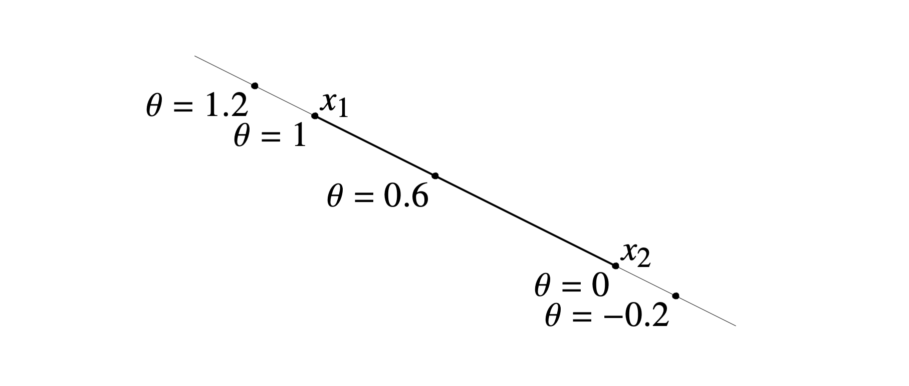
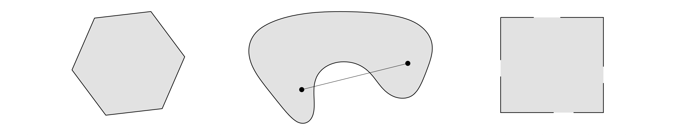
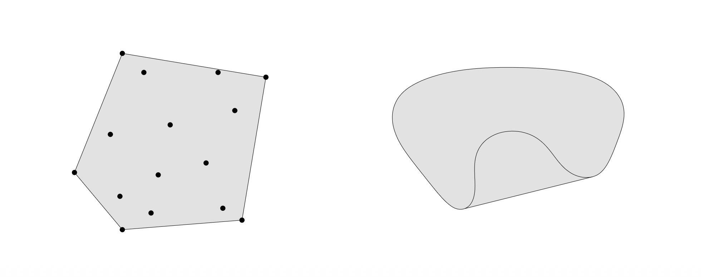
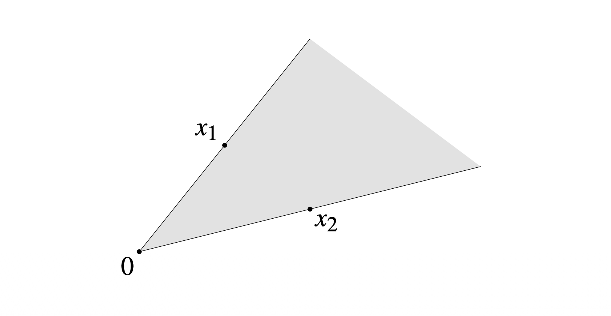
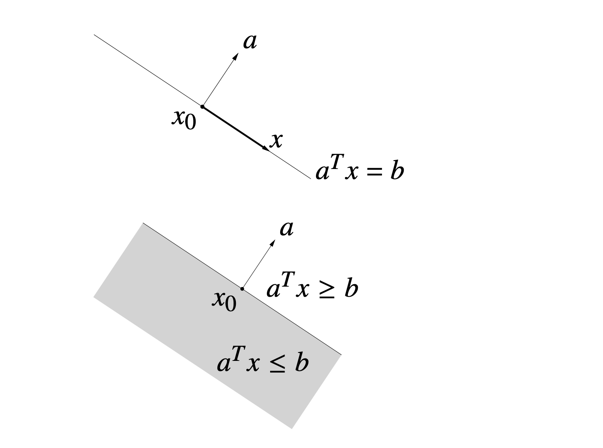
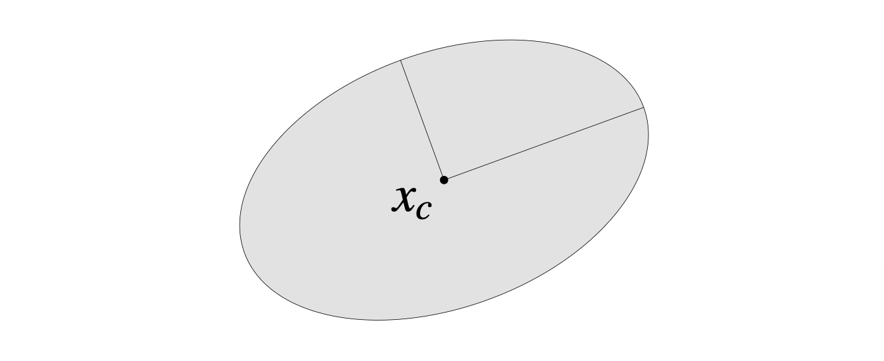
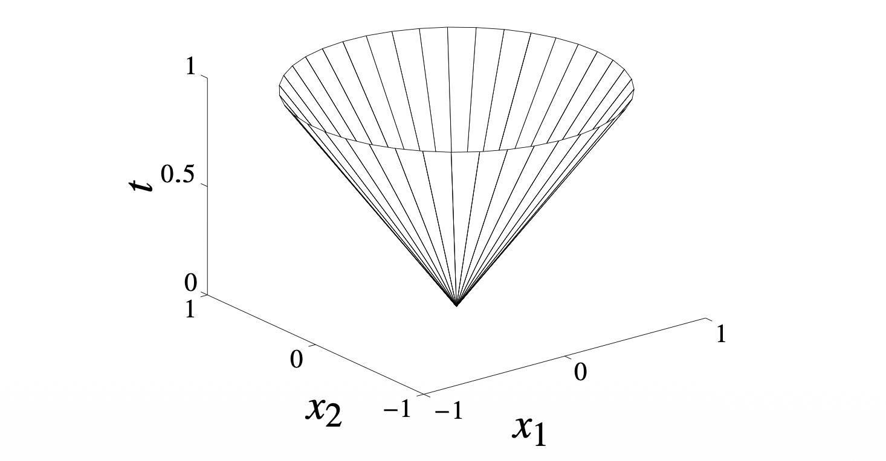
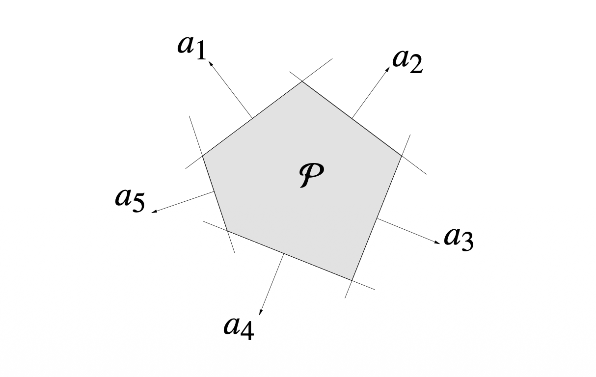
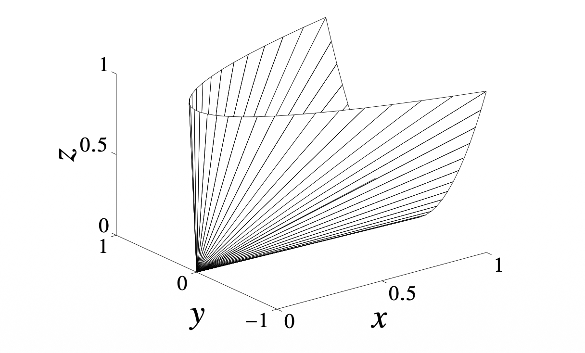

볼록 최적화(Convex Optimization)를 공부하기 위해 가장 먼저 다루어야 할 기본 단위는 **집합(Set)**입니다. 최적화 문제는 기본적으로 어떤 제약 조건 하에서 목적 함수를 최소화하는 문제이며, 이때 제약 조건이 형성하는 영역의 기하학적 성질이 문제의 난이도와 해결 가능성을 결정하기 때문입니다.

이 포스트에서는 Boyd & Vandenberghe의 *Convex Optimization* 2장의 내용을 바탕으로, **Affine Set**, **Convex Set**, **Cone**의 정의와 주요 예시들을 정리합니다.

---

# 1. Affine and Convex Sets

## 1.1 Affine Sets (아핀 집합)

가장 기본적인 기하학적 구조인 '선(Line)'에서 시작해봅시다. 공간 상의 서로 다른 두 점 $x_1, x_2 \in \mathbb{R}^n$을 지나는 **직선**은 다음과 같이 매개변수 $\theta$를 이용해 표현할 수 있습니다.

$$
y = \theta x_1 + (1-\theta)x_2, \quad \theta \in \mathbb{R}
$$

이때 $\theta$가 0과 1 사이라면 두 점 사이의 선분이 되지만, $\theta \in \mathbb{R}$ 전체라면 무한히 뻗어 나가는 직선이 됩니다.

**정의 (Affine Set):**
집합 $C \subseteq \mathbb{R}^n$가 **Affine**하다는 것은, 집합 내의 임의의 두 점 $x_1, x_2 \in C$에 대해, 그 두 점을 지나는 **직선 전체**가 다시 집합 $C$에 포함되는 경우를 말합니다.

즉, 다음 조건이 성립해야 합니다.
$$
\forall x_1, x_2 \in C, \; \forall \theta \in \mathbb{R} \implies \theta x_1 + (1-\theta)x_2 \in C
$$

이 개념은 두 점을 넘어 $k$개의 점으로 확장할 수 있습니다. 이를 **Affine Combination**이라고 합니다.
$$
x = \theta_1 x_1 + \cdots + \theta_k x_k, \quad \text{where } \sum_{i=1}^k \theta_i = 1
$$
Affine 집합은 모든 Affine combination에 대해 닫혀 있습니다.

> **대표적인 예시:** 선형 방정식의 해집합 $C = \{x \mid Ax = b\}$는 Affine set입니다. 반대로, 모든 Affine set은 선형 방정식의 해집합으로 표현될 수 있습니다.

## 1.2 Convex Sets (볼록 집합)

직선이 아닌 **선분(Line Segment)**을 생각해봅시다.

$$
y = \theta x_1 + (1-\theta)x_2, \quad 0 \le \theta \le 1
$$

**정의 (Convex Set):**
집합 $C$가 **Convex**하다는 것은, 집합 내의 임의의 두 점 $x_1, x_2 \in C$를 잇는 **선분**이 완전히 $C$에 포함되는 경우를 말합니다.

수식으로는 $\theta$의 범위가 $[0, 1]$로 제한된다는 점이 Affine set과의 차이입니다.
$$
\forall x_1, x_2 \in C, \; 0 \le \theta \le 1 \implies \theta x_1 + (1-\theta)x_2 \in C
$$

직관적으로, 집합 내부의 어느 두 지점을 연결해도 집합의 경계를 벗어나지 않는다면 그 집합은 볼록(Convex)합니다.

### Convex Hull
어떤 집합 $S$가 Convex가 아닐 때, $S$를 포함하는 가장 작은 Convex set을 만들 수 있을까요? 이를 **Convex Hull**이라고 하며 $\text{conv } S$로 표기합니다. 이는 $S$의 모든 점들에 대한 **Convex Combination**들의 집합과 같습니다.

$$
\text{conv } S = \left\{ \sum_{i=1}^k \theta_i x_i \mid x_i \in S, \theta_i \ge 0, \sum_{i=1}^k \theta_i = 1 \right\}
$$

## 1.3 Cones (원뿔 집합)

이번에는 원점 0에서 뻗어 나가는 **반직선(Ray)**을 고려합니다.

**정의 (Cone):**
집합 $C$가 **Cone**이라는 것은 임의의 $x \in C$와 $\theta \ge 0$에 대해 $\theta x \in C$인 경우입니다. 즉, 원점에서 시작하여 집합 내의 점을 지나는 반직선이 집합에 포함되어야 합니다.

**정의 (Convex Cone):**
Cone이면서 동시에 Convex인 집합을 **Convex Cone**이라고 합니다. 이는 **Conic Combination**에 대해 닫혀 있는 집합과 동치입니다.

$$
x = \theta_1 x_1 + \theta_2 x_2, \quad \theta_1, \theta_2 \ge 0
$$

Affine combination이 계수의 합이 1이고 부호 제약이 없었던 것, Convex combination이 계수의 합이 1이고 양수여야 했던 것과 달리, **Conic combination은 계수의 합 조건 없이 양수(비음수) 조건만 존재**합니다.

# 2. Standard Examples of Convex Sets

최적화 문제에서 자주 등장하는 중요한 Convex Set들을 살펴봅니다.

## 2.1 Hyperplanes and Halfspaces

### Hyperplane (초평면)
초평면은 다음과 같은 선형 방정식의 해집합입니다. ($a \neq 0$)
$$
\{ x \mid a^T x = b \}
$$
기하학적으로 $a$는 초평면의 법선 벡터(normal vector)이며, $b$는 원점으로부터의 오프셋을 결정합니다. 초평면은 Affine set이며 동시에 Convex set입니다.

### Halfspace (반공간)
초평면은 공간을 두 부분으로 나눕니다. 그중 한쪽 영역을 반공간이라고 하며 선형 부등식으로 정의됩니다.
$$
\{ x \mid a^T x \le b \}
$$
반공간은 Convex set이지만, Affine set은 아닙니다 (경계선상의 두 점을 잇는 직선이 영역 밖으로 나갈 수 있기 때문).

## 2.2 Euclidean Balls and Ellipsoids

### Euclidean Ball
중심이 $x_c$이고 반지름이 $r$인 유클리드 볼(Ball)은 다음과 같이 정의됩니다.
$$
B(x_c, r) = \{ x \mid \| x - x_c \|_2 \le r \} = \{ x_c + ru \mid \| u \|_2 \le 1 \}
$$
이는 가장 직관적인 형태의 Convex set입니다.

### Ellipsoid (타원체)
타원체는 구(Ball)를 선형 변환하여 찌그러뜨린 형태로 볼 수 있습니다. 행렬 $P \in S^n_{++}$ (대칭 양의 정부호 행렬, Symmetric Positive Definite)를 사용하여 정의합니다.
$$
\mathcal{E} = \{ x \mid (x - x_c)^T P^{-1} (x - x_c) \le 1 \}
$$
여기서 $P$의 고유값(eigenvalue)들은 타원체 축의 길이를 결정하며, $P = I$일 때 유클리드 볼이 됩니다.

## 2.3 Norm Balls and Norm Cones

유클리드 노름($\|\cdot\|_2$)을 일반적인 노름 $\|\cdot\|$으로 확장하면 더 다양한 Convex set을 정의할 수 있습니다.

* **Norm Ball:** $\{ x \mid \| x - x_c \| \le r \}$
* **Norm Cone:** $\{ (x, t) \mid \| x \| \le t \} \subseteq \mathbb{R}^{n+1}$

특히 유클리드 노름을 사용한 cone인 **Second-order cone (Ice-cream cone)**은 다음과 같이 정의되며, 이는 볼록 최적화에서 매우 중요한 역할을 합니다.
$$
C = \{ (x, t) \in \mathbb{R}^{n+1} \mid \| x \|_2 \le t \}
$$

## 2.4 Polyhedra (다면체)

Polyhedron(다면체)은 **유한 개의 선형 등식과 부등식**의 교집합으로 정의됩니다.
$$
\mathcal{P} = \{ x \mid Ax \le b, \; Cx = d \}
$$
여기서 $Ax \le b$는 반공간(Halfspace)들의 교집합을, $Cx = d$는 초평면(Hyperplane)들의 교집합을 의미합니다. 따라서 Polyhedron은 항상 Convex set입니다. (단, 유계(bounded)일 필요는 없습니다.)

## 2.5 Positive Semidefinite Cone (양의 준정부호 원뿔)

행렬 공간에서의 Convex set을 생각해봅시다. $S^n$을 $n \times n$ 대칭 행렬(Symmetric matrix)들의 집합이라고 할 때, **Positive Semidefinite (PSD) Cone** $S^n_+$은 다음과 같이 정의됩니다.

$$
S^n_+ = \{ X \in S^n \mid X \succeq 0 \} = \{ X \in S^n \mid z^T X z \ge 0, \forall z \}
$$

이 집합은 이름 그대로 'Cone'이며 'Convex' 성질을 만족합니다.

### $S^2_+$의 시각화
$2 \times 2$ 대칭 행렬 $X = \begin{bmatrix} x & y \\ y & z \end{bmatrix}$가 양의 준정부호가 되기 위한 필요충분조건은 다음과 같습니다.
1.  $x \ge 0, z \ge 0$ (대각 성분 비음수)
2.  $xz - y^2 \ge 0$ (행렬식 비음수)

이를 3차원 공간 $(x, y, z)$에 그려보면, 원뿔 모양의 기하학적 구조를 가집니다.

