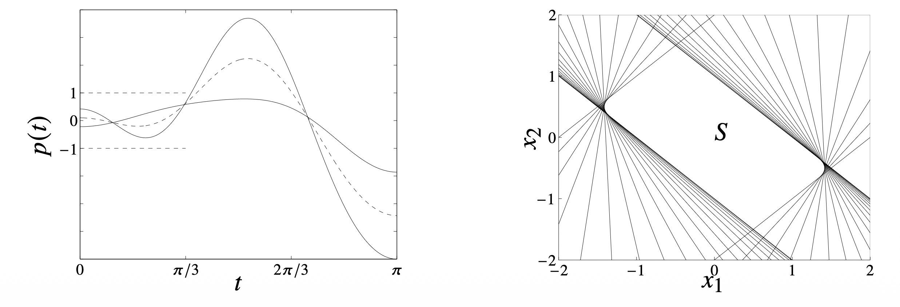

볼록 최적화(Convex Optimization) 문제를 다룰 때 가장 먼저 마주하는 난관은 **"우리가 다루는 제약 조건 집합(Constraint Set)이나 목적 함수가 실제로 볼록(Convex)한가?"**를 증명하는 것입니다.

임의의 집합이 볼록임을 보이기 위해 매번 정의를 사용하여 증명하는 것은 매우 번거롭고 비효율적입니다. 대신, 우리는 **기본적인 볼록 집합(Simple Convex Sets)**들을 알고, 이들에 대해 **볼록성을 보존하는 연산(Operations that preserve convexity)**을 적용하여 복잡한 집합을 구성하는 방식을 주로 사용합니다.

이번 포스트에서는 집합의 볼록성을 확인하는 방법론과, 볼록성을 깨트리지 않고 집합을 변형하거나 결합하는 다양한 수학적 연산(Calculus of sets)에 대해 다룹니다.

# 1. Methods for Establishing Convexity

어떤 집합 $C$가 볼록 집합임을 보이기 위한 방법은 크게 세 가지로 요약할 수 있습니다.

## 1.1. 정의(Definition) 활용
가장 원초적인 방법입니다. 집합 $C$의 임의의 두 원소 $x_1, x_2$와 $0 \le \theta \le 1$인 모든 $\theta$에 대하여 다음이 성립함을 보입니다.

$$
x_1, x_2 \in C \implies \theta x_1 + (1-\theta)x_2 \in C
$$

이 방법은 단순한 집합(예: 반공간, 직육면체 등)을 다룰 때는 유용하지만, 복잡한 집합에 대해서는 계산이 매우 복잡해질 수 있어 권장되지 않습니다.

## 1.2. 볼록 함수(Convex Functions) 활용
집합 $C$를 어떤 볼록 함수의 수준 집합(Sublevel set)으로 정의하는 방법입니다. 예를 들어, 함수 $f(x)$가 볼록 함수일 때, $\{x \mid f(x) \le 0\}$ 꼴의 집합은 볼록 집합이 됩니다. (이 내용은 추후 볼록 함수 파트에서 자세히 다룰 예정입니다.)

## 1.3. 볼록성 보존 연산(Calculus of Sets) 활용
이 방법이 실전에서 가장 강력하고 빈번하게 사용됩니다. 이미 볼록임이 알려진 간단한 집합들(Hyperplanes, Halfspaces, Norm balls 등)을 **볼록성을 보존하는 연산**을 통해 조합하여 집합 $C$를 구성하는 것입니다.

주요 연산은 다음과 같습니다.

1.  **교집합 (Intersection)**
2.  **아핀 매핑 (Affine Mapping)**
3.  **투시 매핑 (Perspective Mapping)**
4.  **선형 분수 매핑 (Linear-Fractional Mapping)**

이제 각 연산에 대해 상세히 알아보겠습니다.

# 2. Intersection (교집합)

가장 기본적이면서도 강력한 성질은 **"볼록 집합들의 교집합은 볼록 집합"**이라는 사실입니다.

## 2.1. 성질
개수에 상관없이(심지어 무한 개의 집합이라도), 볼록 집합들의 교집합은 항상 볼록입니다.

$$
S = \bigcap_{\alpha \in \mathcal{A}} S_\alpha, \quad \text{where } S_\alpha \text{ is convex} \implies S \text{ is convex}
$$

**증명 직관:**
$x, y \in S$라면, 모든 $\alpha$에 대해 $x, y \in S_\alpha$입니다. $S_\alpha$가 볼록이므로 $x$와 $y$를 잇는 선분도 $S_\alpha$에 포함됩니다. 따라서 이 선분은 모든 $S_\alpha$에 포함되므로, 그들의 교집합인 $S$에도 포함됩니다.

## 2.2. Example: Trigonometric Polynomial
다음과 같은 집합 $S$를 고려해 봅시다.

$$
S = \{ x \in \mathbb{R}^m \mid |p(t)| \le 1 \text{ for } |t| \le \pi/3 \}
$$

여기서 $p(t)$는 다음과 같이 정의된 삼각 다항식입니다.
$$
p(t) = x_1 \cos t + x_2 \cos 2t + \dots + x_m \cos mt
$$

이 집합 $S$가 볼록임을 어떻게 보일 수 있을까요? 정의를 직접 적용하기에는 식이 복잡합니다. 하지만 **교집합**의 관점에서 보면 매우 간단해집니다.

특정한 $t$가 고정되어 있을 때, $|p(t)| \le 1$이라는 조건은 $x$에 대한 선형 부등식 두 개와 같습니다.
$$
-1 \le x_1 \cos t + \dots + x_m \cos mt \le 1
$$
이는 $x$ 공간에서 두 개의 반공간(Halfspace)의 교집합이므로, 일종의 **Slab(두 평행한 평면 사이의 공간)** 형태가 되며, 이는 볼록 집합입니다.

따라서 전체 집합 $S$는 $|t| \le \pi/3$ 범위 내의 모든 $t$에 대한 Slab들의 교집합으로 표현할 수 있습니다.
$$
S = \bigcap_{|t| \le \pi/3} \{ x \mid -1 \le p(t) \le 1 \}
$$
볼록 집합(Slab)들의 (무한) 교집합이므로, **$S$는 볼록 집합**입니다.

# 3. Affine Mappings (아핀 매핑)

아핀 함수(Affine Function) $f: \mathbb{R}^n \rightarrow \mathbb{R}^m$은 선형 변환에 평행 이동을 더한 형태입니다.
$$
f(x) = Ax + b, \quad A \in \mathbb{R}^{m \times n}, b \in \mathbb{R}^m
$$
아핀 매핑은 직선을 직선으로 보내기 때문에 볼록성을 완벽하게 보존합니다.

## 3.1. Image and Inverse Image
1.  **Image (상):** 볼록 집합 $S \subseteq \mathbb{R}^n$의 아핀 변환에 의한 상 $f(S)$는 볼록입니다.
    $$
    f(S) = \{ f(x) \mid x \in S \} \quad (\text{Convex})
    $$
2.  **Inverse Image (역상):** 볼록 집합 $C \subseteq \mathbb{R}^m$의 아핀 변환에 의한 역상 $f^{-1}(C)$는 볼록입니다.
    $$
    f^{-1}(C) = \{ x \in \mathbb{R}^n \mid f(x) \in C \} \quad (\text{Convex})
    $$

## 3.2. 주요 예시 (Examples)

이 성질을 이용하면 다양한 집합의 볼록성을 쉽게 증명할 수 있습니다.

### Scaling and Translation
어떤 볼록 집합 $S$를 확대/축소($a$)하거나 이동($b$)시킨 집합은 볼록입니다.
$$
aS + b = \{ ax + b \mid x \in S \}
$$

### Projection (사영)
$S \subseteq \mathbb{R}^m \times \mathbb{R}^n$이 볼록 집합일 때, 이를 일부 좌표축으로 사영시킨 집합도 볼록입니다.
$$
P = \{ x \mid (x, y) \in S \text{ for some } y \}
$$
이는 선형 변환 $f(x, y) = x$에 의한 상(Image)이므로 볼록성이 유지됩니다.

### Linear Matrix Inequality (LMI) Solution Set
선형 행렬 부등식의 해집합은 제어 이론과 최적화에서 매우 중요합니다.
$$
\{ x \mid x_1 A_1 + \dots + x_m A_m \preceq B \}
$$
여기서 $A_i, B$는 대칭 행렬($S^p$)이고, $\preceq$는 행렬의 음의 준정부호(Negative Semidefinite) 관계를 나타냅니다.

이 집합이 볼록인 이유는 다음과 같이 해석할 수 있기 때문입니다.
함수 $f(x) = B - (x_1 A_1 + \dots + x_m A_m)$는 $x$에 대한 아핀 함수입니다. 주어진 조건은 $f(x) \succeq 0$, 즉 $f(x)$가 양의 준정부호 행렬(Positive Semidefinite, PSD) 집합에 속해야 한다는 것입니다. PSD Cone은 볼록 집합이므로, **볼록 집합(PSD Cone)의 아핀 함수에 의한 역상**인 LMI 해집합 역시 볼록입니다.

### Hyperbolic Cone

쌍곡선 제약조건(hyperbolic constraint)으로 정의된 집합 $C$는 다음과 같습니다.

$$
C = \{ x \in \mathbb{R}^n \mid x^T P x \le (c^T x)^2, c^T x \ge 0 \}
$$

여기서 $P \in S_+^n$ (양의 준정부호 행렬)이고 $c \in \mathbb{R}^n$입니다.

이 집합 $C$가 볼록임을 보이기 위해, 이를 **이차 원뿔(Second Order Cone, SOC)의 아핀 함수에 의한 역상(inverse image)**으로 해석할 수 있습니다.

**유도 과정 (Derivation):**

$P \in S_+^n$이므로, $P = P^{1/2} P^{1/2}$를 만족하는 행렬 제곱근(matrix square root) $P^{1/2} \in S_+^n$이 존재합니다. 정의된 부등식을 유클리드 노름(Euclidean norm)을 사용하여 다시 쓰면 다음과 같습니다.

$$
x^T P x = x^T P^{1/2} P^{1/2} x = \| P^{1/2} x \|_2^2 \le (c^T x)^2
$$

조건에서 $c^T x \ge 0$이 주어졌으므로, 양변에 제곱근을 취해도 부등호 방향은 유지됩니다.

$$
\| P^{1/2} x \|_2 \le c^T x
$$

이제 $(n+1)$차원 표준 **이차 원뿔(Second Order Cone, SOC)** $\mathcal{Q}^{n+1}$을 고려해 봅시다.

$$
\mathcal{Q}^{n+1} = \{ (u, t) \in \mathbb{R}^n \times \mathbb{R} \mid \|u\|_2 \le t \}
$$

다음과 같은 아핀 매핑(affine mapping) $f: \mathbb{R}^n \to \mathbb{R}^{n+1}$을 정의합니다.

$$
f(x) = \begin{bmatrix} P^{1/2} \\ c^T \end{bmatrix} x = \begin{bmatrix} P^{1/2} x \\ c^T x \end{bmatrix}
$$

그러면 $x \in C$이기 위한 조건은 $f(x) \in \mathcal{Q}^{n+1}$과 정확히 동치(equivalent)입니다.

$$
\| P^{1/2} x \|_2 \le c^T x \iff \left( P^{1/2} x, c^T x \right) \in \mathcal{Q}^{n+1}
$$

따라서 집합 $C$는 아핀 매핑 $f$에 대한 볼록 원뿔 $\mathcal{Q}^{n+1}$의 역상(inverse image)으로 표현됩니다.

$$
C = f^{-1}(\mathcal{Q}^{n+1}) = \{ x \mid f(x) \in \mathcal{Q}^{n+1} \}
$$

아핀 매핑에 의한 볼록 집합의 역상은 볼록 집합이므로, **$C$는 볼록 집합입니다.**

# 4. Perspective Function (투시 함수)

투시 함수 $P: \mathbb{R}^{n+1} \rightarrow \mathbb{R}^n$은 벡터의 마지막 성분으로 나머지 성분들을 나누는 연산입니다. 핀홀 카메라 모델에서 3차원 물체를 2차원 평면에 투영하는 것과 같은 원리입니다.

## 4.1. 정의
$$
P(z, t) = \frac{z}{t}, \quad \text{dom } P = \{ (z, t) \mid t > 0 \}
$$
정의역은 마지막 성분 $t$가 양수인 반공간으로 제한됩니다.

## 4.2. 볼록성 보존
투시 함수는 볼록성을 보존합니다.
* **Image:** 볼록 집합 $C \subseteq \text{dom } P$의 투시 변환 상 $P(C)$는 볼록입니다.
* **Inverse Image:** 볼록 집합 $C \subseteq \mathbb{R}^n$의 투시 변환 역상 $P^{-1}(C)$는 볼록입니다.
    $$
    P^{-1}(C) = \{ (z, t) \in \mathbb{R}^{n+1} \mid z/t \in C, t > 0 \}
    $$

# 5. Linear-Fractional Function (선형 분수 함수)

선형 분수 함수(또는 Projective Mapping)는 아핀 함수와 투시 함수를 결합한 형태입니다.

## 5.1. 정의
$$
f(x) = \frac{Ax + b}{c^T x + d}, \quad \text{dom } f = \{ x \mid c^T x + d > 0 \}
$$
이 함수는 다음과 같은 과정을 거쳐 구성된 것으로 이해할 수 있습니다.
1.  **Affine Map:** $x \to \begin{bmatrix} Ax + b \\ c^T x + d \end{bmatrix}$
2.  **Perspective Map:** 위 벡터를 마지막 성분($c^T x + d$)으로 나눔.

따라서 아핀 매핑과 투시 매핑이 모두 볼록성을 보존하므로, **선형 분수 함수 역시 볼록성을 보존**합니다.

## 5.2. Example Visualization
어떤 임의의 볼록 집합 $C$가 선형 분수 함수 $f(x)$를 통과하면 모양은 왜곡되지만, 볼록한 성질(모든 두 점을 잇는 선분이 집합 내부에 존재함)은 그대로 유지됩니다.

$$
f(x) = \frac{1}{x_1 + x_2 + 1} x
$$
위와 같은 함수를 적용했을 때의 예시를 살펴봅시다.

> **Note:** 위 그림 예시는 선형 분수 변환이 직선을 직선(또는 선분)으로 매핑하여 볼록성을 보존한다는 기하학적 직관을 제공합니다. 분모 $c^T x + d$의 값이 0에 가까워질수록 점들은 무한대로 발산하는 경향을 보이며 집합이 크게 늘어나는 형태를 띱니다.