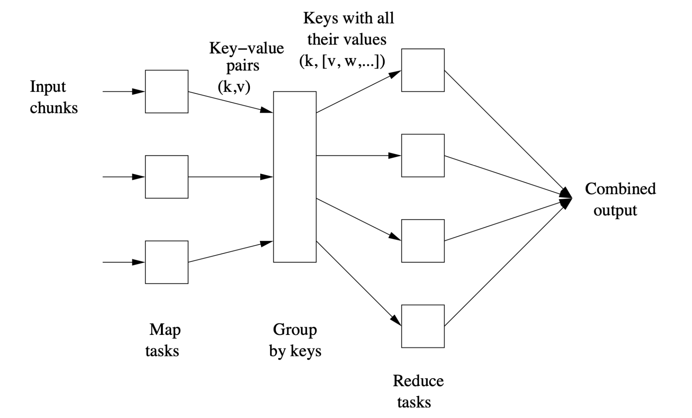
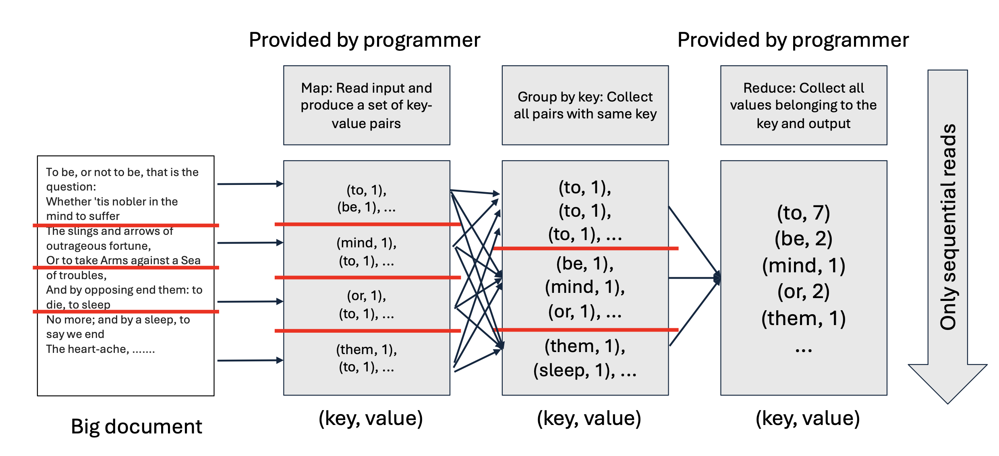
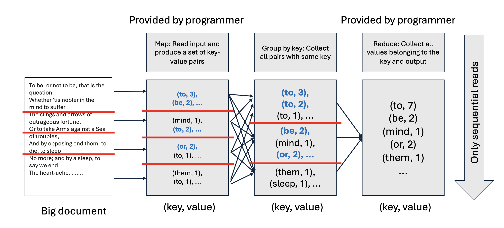

# 1. Introduction

* 지난 [Part 1] 포스트에서는 왜 우리가 분산 컴퓨팅을 필요로 하는지, 그리고 HDFS와 같은 인프라가 어떻게 데이터를 저장하는지 살펴보았습니다.
* 하지만 개발자 입장에서 수천 대의 서버에 일일이 데이터를 보내고, 장애를 처리하고, 통신을 제어하는 코드를 짜는 것은 불가능에 가깝습니다. **MapReduce**는 이러한 복잡한 하부 구조(Hardware failure, Data management)를 **추상화(Abstraction)**하여, 개발자가 오직 **"계산 로직(Computation Logic)"**에만 집중할 수 있게 해주는 프로그래밍 모델입니다.
* 이번 포스트에서는 MapReduce의 핵심 컴포넌트와 동작 원리를 **Word Count** 예제를 통해 상세히 알아보고, 성능 최적화를 위한 **Combiner** 개념을 다룹니다.

---

# 2. MapReduce Components

* MapReduce는 거대한 데이터를 처리하는 과정을 크게 **Map**, **Group by Key**, **Reduce**의 세 단계로 나눕니다. 개발자는 이 중 **Map**과 **Reduce** 두 가지 함수만 작성하면 됩니다. 나머지 복잡한 데이터 이동(Shuffle)은 시스템이 알아서 처리합니다.



## 2.1. Map Task
* **Input**: 데이터 청크(Chunk)의 각 요소(Element).
    * 입력은 기본적으로 Key-Value 쌍이지만, 초기 단계에서는 Key를 무시하는 경우가 많습니다 (예: 텍스트 라인).
* **Function**: 사용자가 정의한 `Map` 함수를 각 입력 요소에 적용합니다.
* **Output**: 0개 이상의 새로운 **Key-Value 쌍 ($(k, v)$)**을 생성합니다.
    * 이 단계에서의 출력은 디스크가 아닌 메모리 버퍼나 로컬 임시 파일에 기록됩니다.

## 2.2. Group by Key (Shuffle & Sort)
* 이 단계는 프로그래머가 아닌 **MapReduce 시스템(Master Controller)**이 수행하는 "마법"과 같은 단계입니다.
  * **Role**: Map 단계에서 쏟아져 나온 수많은 $(k, v)$ 쌍들을 **Key를 기준으로 모으는(Collect)** 작업입니다.
  * **Mechanism**:
      1.  시스템은 미리 $r$개의 Reduce Task(Reducer)를 준비합니다.
      2.  Map 출력의 Key에 해시 함수(Hash function)를 적용하여 `bucket number` (0 to $r-1$)를 계산합니다.
      3.  같은 해시 값을 가진 데이터들은 네트워크를 통해 동일한 Reducer로 이동합니다.
  * **Output**: $(k, [v_1, v_2, ..., v_n])$ 형태의 **Key-Value List**가 생성됩니다.

## 2.3. Reduce Task
* **Input**: 특정 Key와 그에 해당하는 모든 값들의 리스트 $(k, [v_1, v_2, ...])$.
* **Function**: 사용자가 정의한 `Reduce` 함수를 적용하여, 리스트에 있는 값들을 집계하거나 처리합니다.
* **Output**: 최종 결과물인 Key-Value 쌍입니다. 여러 Reducer의 결과가 합쳐져 최종 파일이 됩니다.

---

# 3. Example: Word Counting

* 가장 고전적이지만 MapReduce를 이해하기 가장 좋은 예제인 **"단어 세기(Word Counting)"**를 통해 실제 코드가 어떻게 동작하는지 봅시다.

## 3.1. Problem Definition
* **Input**: 수백 테라바이트의 텍스트 문서들.
* **Goal**: 문서 전체에서 각 단어(Word)가 몇 번 등장했는지 카운트.
* **Output**: (apple, 300), (banana, 150), ...

## 3.2. Implementation (Pseudo-code)

```python
# Map Function
# key: line index (ignored), value: text line
def map(key, value):
    for word in value.split():
        emit(word, 1) 
        # (word, 1) 쌍을 계속 내보냄

# Reduce Function
# key: word, values: list of counts [1, 1, 1, ...]
def reduce(key, values):
    result = 0
    for count in values:
        result += count
    emit(key, result)

```

## 3.3. Execution Flow



* 1. **Map**: "To be or not to be"라는 문장이 들어오면,
  * `(to, 1)`, `(be, 1)`, `(or, 1)`, `(not, 1)`, `(to, 1)`, `(be, 1)`을 출력합니다.

* 2. **Group by Key**: 시스템이 `to`라는 키를 가진 모든 쌍을 찾아서 모읍니다.
  * `to` $\rightarrow$ `[1, 1, 1, ..., 1]`

* 3. **Reduce**: 리스트 안의 `1`들을 모두 더합니다.
  * `(to, 7)`

---

# 4. Optimization: Combiners

* 기본적인 Word Count 방식에는 비효율적인 부분이 있습니다.
* Map 단계에서 `(the, 1)`이라는 쌍을 수백만 번 생성해서 네트워크로 보낸다고 상상해 보세요. 이는 엄청난 **네트워크 대역폭(Network Bandwidth) 낭비**입니다.

## 4.1. The Idea of Combiner



* Map 태스크가 끝난 직후, **로컬(Local)에서 미리 Reduce 연산을 일부 수행**하여 데이터 양을 줄인 뒤 네트워크로 보내는 기법입니다. 이를 수행하는 함수를 **Combiner**라고 합니다.
  * **Without Combiner**: `(to, 1)`, `(to, 1)`, `(to, 1)` $\rightarrow$ 네트워크 전송 $\rightarrow$ Reducer가 합산.
  * **With Combiner**: Map 노드에서 미리 `(to, 3)`으로 합침 $\rightarrow$ 네트워크 전송 $\rightarrow$ Reducer가 최종 합산.

## 4.2. Conditions for Combiner

* 모든 연산에 Combiner를 쓸 수 있는 것은 아닙니다. Reduce 함수가 다음 두 가지 성질을 만족해야 합니다.
  * 1. **Commutative (교환법칙)**: $a + b = b + a$
  * 2. **Associative (결합법칙)**: $(a + b) + c = a + (b + c)$

* 즉, 덧셈(Word Count)이나 행렬 곱셈 등은 순서가 바뀌거나 미리 묶어서 계산해도 결과가 같으므로 Combiner를 사용할 수 있습니다. 평균(Mean) 계산 같은 경우는 주의가 필요합니다.

---

# 5. Pop Quiz: Common Friends

* 강의 자료 마지막에 제시된 **소셜 네트워크 친구 추천(Common Friends)** 문제를 풀어보겠습니다.

## 5.1. Problem

* **Scenario**: 소셜 네트워크 그래프가 주어집니다.
* **Goal**: "친구의 친구" 관계를 찾아, 두 사람의 **공통 친구(Common Friends)** 목록을 구하시오.
* 예: A와 B가 둘 다 C와 친구라면, C는 A와 B의 공통 친구입니다.

## 5.2. Solution Design

* **Input Data Example:**
$$ A \rightarrow B, C, D $$
  * A는 B, C, D와 친구임

* **Map Strategy:**
  * A의 친구 목록 $[B, C, D]$를 보면, 이 목록에 있는 사람들끼리는 잠재적으로 "A"라는 공통 친구를 가질 수 있습니다. 따라서 가능한 모든 쌍(Pair)에 대해 A를 친구로 추천합니다.

* **Map Function Logic**:
  * 입력: User $u$, Friends list $[f_1, f_2, ..., f_n]$
  * 동작: 친구 리스트에서 가능한 모든 두 명의 조합 $(f_i, f_j)$를 만듭니다.
    * 단, 순서 중복 방지를 위해 $f_i < f_j$ 로 정렬
  * 출력: Key=$(f_i, f_j)$, Value=$u$

* **Reduce Strategy:**
  * **Reduce Function Logic**:
    * 입력: Key=$(User1, User2)$, Values=$[CommonFriend1, CommonFriend2, ...]$
    * 동작: 리스트를 그대로 출력하거나 개수를 셉니다.
    * 출력: $(User1, User2) \rightarrow [CommonFriend1, ...]$

* **Step-by-Step Example:**
    * 1. **Input**: $A \rightarrow B, C, D$
    * 2. **Map Output**:
      * Key: $(B, C)$, Value: $A$ $\rightarrow$ "B와 C는 A를 통해 연결됨"
      * Key: $(B, D)$, Value: $A$
      * Key: $(C, D)$, Value: $A$
    * 3. **Reduce Input**: 만약 다른 곳에서 $(B, C) \rightarrow E$가 들어왔다면,
      * Key: $(B, C)$, Values: $[A, E]$
    * 4. **Final Output**: $B$와 $C$의 공통 친구는 $A$와 $E$입니다.