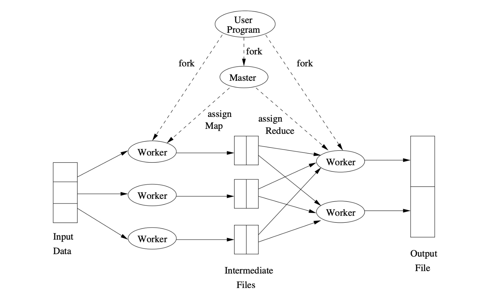
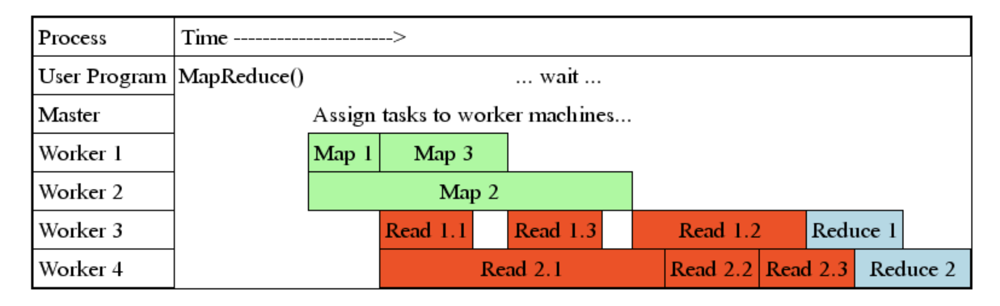
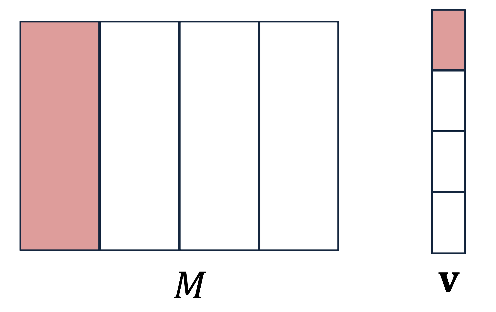

# 1. Introduction

* [Part 1]에서는 분산 시스템의 인프라를, [Part 2]에서는 프로그래밍 모델(Map & Reduce)을 다루었습니다.
* 이번 마지막 포스트에서는 MapReduce가 실제 클러스터에서 어떻게 **실행(Execution)**되고, 수천 대의 노드 중 일부가 고장 났을 때 어떻게 **복구(Fault Tolerance)**하는지, 그리고 구글의 핵심 알고리즘인 **PageRank(Matrix-Vector Multiplication)**가 이 위에서 어떻게 돌아가는지 상세히 살펴봅니다.

---

# 2. MapReduce Execution Workflow

* 사용자가 MapReduce 코드를 실행하면 내부적으로 어떤 일이 벌어질까요? 전체 프로세스는 **Master-Worker** 구조로 돌아갑니다.

## 2.1. Roles of Processes
* 1.  **Master Controller**
    * **Scheduler**: 전체 시스템의 지휘자입니다. Map과 Reduce 태스크를 유휴 상태(Idle)인 Worker들에게 할당합니다.
    * **Monitor**: 각 태스크의 상태(Idle, Executing, Completed)를 추적합니다.
    * **Coordinator**: Map 태스크가 어디서 끝났고, 그 결과 파일이 어디에 있는지 Reduce 태스크에게 알려줍니다.

* 2.  **Workers**
    * 실제 연산을 수행하는 프로세스입니다.
    * 한 Worker는 시점에 따라 Map 태스크를 맡을 수도, Reduce 태스크를 맡을 수도 있습니다 (동시에는 안 함).
    * 작업이 끝나면 Master에게 "완료 보고"를 합니다.

## 2.2. Data Flow & Pipelining
* MapReduce는 모든 Map이 다 끝날 때까지 멍하니 기다리지 않습니다. **Pipelining**을 통해 효율을 극대화합니다.

* **Map Task Output**: Map Worker의 **로컬 디스크(Local Disk)**에 중간 파일(Intermediate Files)로 저장됩니다.
* **Reduce Task Input**: Reduce Worker는 Map 작업이 하나라도 끝나면 즉시 데이터를 읽어오기 시작(Copying/Shuffling)합니다.
* **Execution**: 단, 실제 `Reduce()` 함수 실행은 필요한 모든 파티션의 데이터를 다 가져온 후에 시작됩니다.

---

# 3. Coping with Node Failures

* 수천 대의 머신에서 장애는 일상입니다. MapReduce의 가장 강력한 기능은 **사용자 개입 없이 시스템이 알아서 장애를 복구**한다는 점입니다.

## 3.1. Master Failure
* **증상**: 지휘자가 사라졌으므로 상태 관리가 불가능합니다.
* **대응**: 현재로서는 **작업 전체를 재시작(Restart entire job)**하는 수밖에 없습니다. 하지만 Master는 단 한 대뿐이므로 확률적으로 매우 드뭅니다.

## 3.2. Map Worker Failure
* **상황**: Map 태스크를 수행하던 노드가 죽었습니다.
* **대응**:
    * **진행 중(In-progress)인 작업**: 당연히 다른 Worker에게 재할당하여 다시 실행합니다.
    * **완료된(Completed) 작업**: **이 경우에도 다시 실행해야 합니다!**
      * **Why?**: Map의 결과물은 HDFS(글로벌)가 아니라 해당 노드의 **로컬 디스크**에 저장되기 때문입니다. 노드가 죽으면 그 로컬 파일도 접근 불가능해지므로, 다시 계산해야 합니다.

## 3.3. Reduce Worker Failure
* **상황**: Reduce 태스크를 수행하던 노드가 죽었습니다.
* **대응**:
    * **진행 중인 작업**: 다른 Worker에게 재할당하여 다시 실행합니다.
    * **완료된 작업**: **다시 실행할 필요가 없습니다.**
    * **Why?**: Reduce의 최종 결과물은 **DFS(Distributed File System)**에 저장되어 3중 복제(Replication)되므로, 노드가 죽어도 데이터는 안전합니다.

---

# 4. Tuning: Number of Reduce Tasks

* MapReduce 성능 최적화의 핵심 파라미터 중 하나는 "Reduce Task의 개수($R$)"를 몇 개로 설정할 것인가입니다.

* **이상적인 경우**: $R$을 Key의 개수만큼 늘리면 병렬성이 극대화될 것 같지만, 오버헤드가 너무 큽니다.
* **현실적인 문제**:
    * Key의 개수는 수십억 개에 달할 수 있습니다.
    * Key마다 데이터 양의 편차(Skew)가 큽니다 (예: 'the' 단어 vs 희귀 단어).
* **Rule of Thumb**:
    $$\# of Nodes < \# of Reduce Tasks < \# of Keys$$
    * 보통 노드 수보다 조금 더 많게 설정하여, 한 태스크가 빨리 끝나면 바로 다음 태스크를 가져와 로드 밸런싱이 되도록 합니다.

---

# 5. Algorithm: Matrix-Vector Multiplication

* MapReduce는 원래 구글의 **PageRank** 계산을 위해 탄생했습니다. PageRank의 핵심 연산은 거대한 인접 행렬 $M$과 중요도 벡터 $v$의 곱셈입니다.
$$x = Mv \quad \Rightarrow \quad x_i = \sum_{j=1}^{n} m_{ij} v_j$$
  * 여기서 $n$은 웹 페이지의 개수로, 수백억(Tens of billions) 단위입니다.

## 5.1. Case 1: Vector $v$ fits in Main Memory
* 행렬 $M$은 너무 커서 디스크에 있지만, 벡터 $v$는 메모리에 들어갈 정도로 작다고 가정해 봅시다.

* **Map Function**:
    * 입력: $((i, j), m_{ij})$ (행렬의 원소 하나)
    * 동작: 메모리에 있는 전역 벡터 $v$에서 $v_j$를 읽어와 곱합니다.
    * 출력: Key=$i$, Value=$m_{ij} v_j$
* **Reduce Function**:
    * 입력: Key=$i$, Values=$[m_{i1}v_{1}, m_{i2}v_{2}, ...]$
    * 동작: 리스트의 값을 모두 더합니다. ($\sum_j m_{ij} v_j$)
    * 출력: $(i, x_i)$

## 5.2. Case 2: Vector $v$ is too large (Stripes Method)
* 벡터 $v$조차 너무 커서 메모리에 다 올릴 수 없다면 어떻게 할까요? **Stripe(띠)** 방식으로 쪼개서 처리해야 합니다.

* 1.  **Divide**: 행렬 $M$을 세로 띠(Vertical Stripes)로 나누고, 벡터 $v$를 가로 띠(Horizontal Stripes)로 나눕니다.
* 2.  **Constraint**: 한 번에 처리할 벡터의 띠 하나가 메모리에 들어갈 수 있도록 크기를 조절합니다.
* 3.  **Process**: 각 Map Worker는 행렬의 특정 띠 부분과 벡터의 대응되는 띠 부분만 로드하여 부분 곱(Partial Product)을 계산합니다.
* 4.  **Result**: 이후 Reduce 단계에서 부분 합들을 모아 최종 결과를 만듭니다.