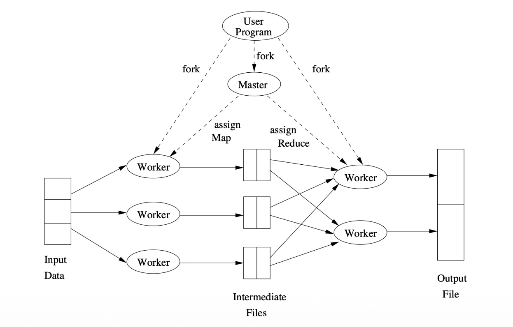
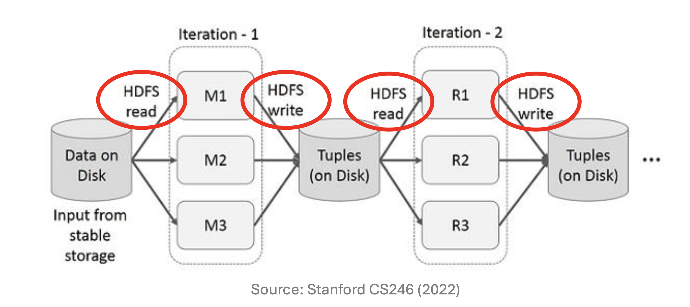
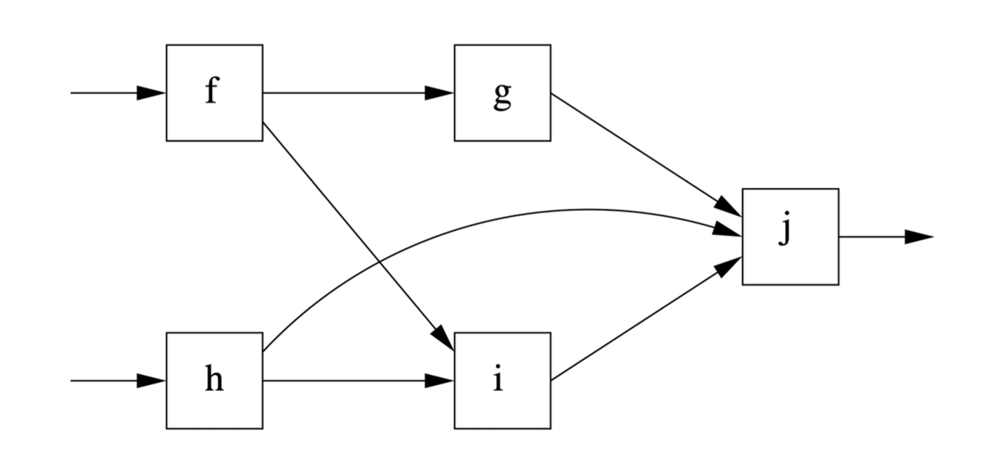
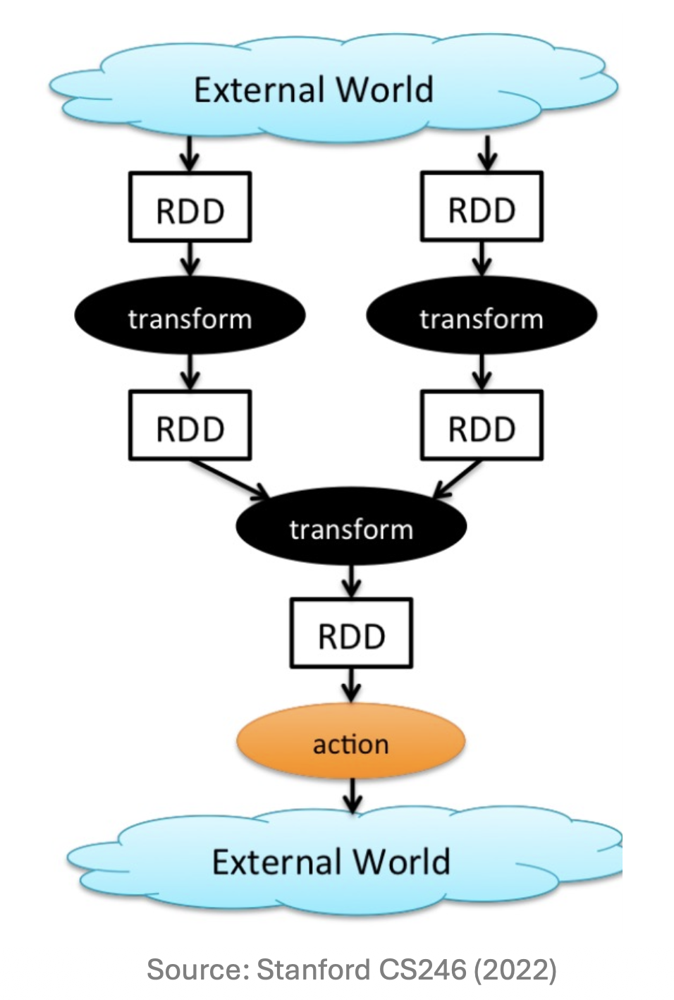

# 1. Introduction

* 본 포스트는 대용량 데이터 처리 및 데이터 마이닝을 위한 핵심 프레임워크인 **Apache Spark**의 개요(Overview)를 다룹니다. 분산 처리 시스템의 발전 과정을 이해하기 위해서는 기존의 패러다임이었던 하둡(Hadoop)과 MapReduce의 구조를 먼저 짚고 넘어갈 필요가 있습니다. 기존 시스템이 가진 근본적인 디스크 I/O 병목 현상을 파악하고, 이를 방향성 비순환 그래프(DAG, Directed Acyclic Graph)와 메모리 기반(In-memory) 연산을 통해 어떻게 극복했는지 그 논리적 흐름을 따라가 보겠습니다.

---

# 2. Hadoop Framework와 MapReduce의 구조

* 아파치 하둡(Hadoop)은 대규모 데이터의 분산 처리를 위해 설계된 오픈소스 프레임워크입니다. 초창기 하둡 생태계에서 데이터 처리 로직은 **MapReduce** 엔진과 매우 강하게 결합(tightly coupled)되어 있었습니다. 하둡 프레임워크는 크게 세 가지 핵심 컴포넌트로 구성됩니다:
  * **HDFS (Hadoop Distributed File System)**: 거대한 데이터셋을 여러 클러스터 노드에 분산하여 저장하며, 데이터 유실을 막기 위해 복제본(Replication)을 유지합니다.
  * **YARN (Yet Another Resource Negotiator)**: 클러스터 내 여러 노드의 리소스를 관리하고 작업 스케줄링을 담당합니다. 현대 하둡 시스템에서 '마스터 컨트롤러(Master controller)'라 함은 주로 이 YARN을 지칭합니다.
  * **Processing Engines**: 실제 연산 작업(Computation)을 수행하는 엔진으로, MapReduce와 Spark가 대표적입니다.

---

# 3. MapReduce의 근본적 한계 (Limitations of MapReduce)

* MapReduce는 단순하고 강력하지만, 복잡한 데이터 마이닝이나 머신러닝 알고리즘을 수행하기에는 몇 가지 치명적인 구조적 한계를 지니고 있습니다.

## 3.1 디스크 I/O로 인한 오버헤드
* MapReduce는 맵(Map) 태스크와 리듀스(Reduce) 태스크 사이의 중간 생성물(Intermediate files)을 메모리가 아닌 디스크에 저장합니다. 

* 각 Map 태스크의 출력 결과는 해당 워커(Worker) 노드의 로컬 파일 시스템에 기록됩니다.
* **장점(Pros)**: 메인 메모리(RAM) 요구량이 적어, 메모리가 부족한 환경에서도 안정적으로 대용량 작업을 수행할 수 있습니다.
* **단점(Cons)**: 매 Map 태스크가 끝날 때마다 발생하는 디스크 I/O 오버헤드가 막대합니다. 만약 워커 노드에 장애가 발생하면 해당 디스크에 저장된 중간 파일에 접근할 수 없게 되는 문제도 발생합니다.

## 3.2 반복(Iterative) 알고리즘 적용의 어려움
* 특히 머신러닝 최적화(예: Gradient Descent) 알고리즘은 동일한 데이터에 대해 연산을 수십~수백 번 반복해야 합니다.
  * MapReduce는 복잡한 작업을 수행할 때, 데이터 복제(Replication)와 디스크 입출력으로 인해 막대한 오버헤드를 발생시킵니다.
  * 결과적으로 많은 최신 알고리즘들을 단순히 Map과 Reduce라는 두 가지 단계만으로 표현하고 설명하기는 매우 어렵습니다.

---

# 4. 차세대 대안: Workflow System과 DAG

* MapReduce의 경직된 체인 구조(Map $\rightarrow$ Reduce $\rightarrow$ Map $\rightarrow \dots$)를 극복하기 위해 제안된 것이 **방향성 비순환 그래프(DAG)** 기반의 Workflow System입니다.

## 4.1 DAG(Directed Acyclic Graph)로의 확장
* 이 시스템에서는 연산들이 DAG 형태로 구성됩니다. DAG 행렬 $G = (V, E)$에서 정점 $V$는 각 태스크를, 간선 $E$는 데이터의 흐름을 의미합니다.
  * 단일 입력만 받던 한계를 벗어나, 하나 이상의 다중 입력을 받는 함수들을 허용합니다.
  * 마스터 컨트롤러는 전체 DAG를 분석하여 여러 태스크 간의 작업을 효율적으로 분할하고 할당합니다.

## 4.2 내결함성을 위한 차단 특성 (Blocking Property)
* 분산 시스템에서 노드 실패는 필연적입니다. Workflow 시스템은 **Blocking Property**를 통해 결함 복원력(Fault-resilient model)을 확보합니다.
* 특정 연산은 선행되는 모든 작업(Predecessors)이 완료되어야만 실행을 시작할 수 있습니다.
* 따라서 만약 어떤 태스크가 실패했다면, 그 후행 작업(Successors)은 아직 시작조차 하지 않았음을 논리적으로 보장할 수 있습니다.
* **복구 메커니즘**: 마스터 컨트롤러는 실패한 태스크를 다른 건강한 노드에서 재시작시킵니다. 예를 들어, 위 DAG 도식에서 노드 $g$가 실패한다면, 선행 노드인 $f$를 다시 실행한 뒤 그래프의 흐름을 따라 $g$를 재실행하면 완벽한 복구가 가능합니다.

---

# 5. Apache Spark: Overview & Ecosystem

* **Apache Spark**는 단순히 MapReduce를 대체하는 것을 넘어, 훨씬 더 유연하게 설계된 가장 인기 있는 Workflow System입니다. UC Berkeley와 Databricks에서 개발되어 현재는 Apache 소프트웨어 재단에서 유지보수하고 있습니다.

## 5.1 Spark의 주요 혁신 포인트
* 기존 MapReduce에 대비하여 Spark가 추가/개선한 핵심 요소는 다음과 같습니다:
  * **초고속 데이터 공유(Fast data sharing)**: 중간 연산 결과를 디스크에 저장하는 것을 피하고 메모리에 유지합니다.
  * **데이터 캐싱(Data Caching)**: 머신러닝(ML) 알고리즘처럼 동일한 쿼리가 반복되는 경우, 데이터를 메모리에 캐시(Cache)하여 성능을 극대화합니다.
  * **일반화된 실행 그래프 (General DAGs)**: Map과 Reduce보다 훨씬 풍부하고 다양한 함수 연산을 지원하는 DAG 실행 엔진을 제공합니다.
  * **Hadoop 호환성**: 하둡 HDFS 등 기존 분산 파일 시스템과 완벽히 호환됩니다.

## 5.2 Data Analytics Software Stack
* Spark 생태계는 매우 방대하며, 하나의 통합된 Core API 위에서 다양한 고수준 라이브러리를 제공합니다.

| 계층 (Layer) | 구성 요소 (Components) |
| :--- | :--- |
| **Data Analytics** | SparkSQL & DataFrames, MLlib (머신러닝), GraphX (그래프 연산), Spark Streaming, SparkR  |
| **Core API** | Spark Core  |
| **Resource Management** | Standalone, Hadoop YARN, Mesos, Kubernetes, Amazon EC2  |
| **Database / Storage** | Hadoop HDFS, Apache Cassandra, Apache HBase, Apache Hive, Amazon S3  |

---

# 6. RDD (Resilient Distributed Dataset)

* Spark를 이해하는 데 있어 가장 중요한 핵심 아이디어이자 중심 데이터 추상화 개념이 바로 **RDD**입니다.
  * **정의**: 단일 타입의 레코드들로 이루어진, 파티셔닝(분할)된 데이터 컬렉션입니다.
  * **일반화**: MapReduce에서 사용되던 단순한 Key-Value 쌍의 개념을 훨씬 더 범용적으로 일반화한 형태입니다.
  * **특성**: 
      * 데이터 청크 단위로 전체 클러스터에 분산되어 저장되며, 생성된 후에는 변경할 수 없는 **읽기 전용(Read-only/Immutable)** 속성을 가집니다.
      * 작업 속도 향상을 위해 메인 메모리(RAM)에 **캐시(Cached)**될 수 있습니다.
  * **생성 방법**: 분산 파일 시스템(DFS)에서 직접 데이터를 읽어오거나, 다른 RDD에 변환(Transformation)을 가함으로써 새롭게 생성됩니다.
  * 동일한 연산 로직을 컬렉션 내의 모든 요소에 병렬로 적용할 때 최고의 성능을 발휘합니다.

---

# 7. Spark의 프로그래밍 모델: Transformation vs. Action

* Spark 프로그램은 RDD의 연산 흐름을 설계하는 과정이며, 크게 두 가지 유형의 연산으로 나뉩니다.

## 7.1 Transformations (변환)
* 다른 RDD로부터 새로운 RDD를 구축하는 연산입니다.
  * **특징**: 병렬 처리가 가능한 결정론적(Deterministic) 연산입니다.
  * **종류**: `map`, `filter`, `join`, `union`, `distinct` 등이 존재합니다.
  * **지연 평가 (Lazy Evaluation) $\star$**: 
    * 가장 중요한 특징으로, Transformation 코드를 작성하더라도 즉시 실행되지 않으며, 뒤이어 설명할 'Action'이 호출되기 전까지는 어떠한 실제 계산(Computation)도 수행되지 않습니다. 
    * 수식으로 표현하면 초기 상태 $RDD_0$에서 $T(RDD_i) \rightarrow RDD_{i+1}$의 연산 계획(Lineage)만 그래프 형태로 누적됩니다.

## 7.2 Actions (행동)
* 실제로 스케줄러를 구동하여 계산을 강제(force calculations)하고 결과값을 반환하거나 외부 저장소로 데이터를 내보내는 연산입니다.
  * **특징**: Action이 호출되는 순간, 이전에 누적된 지연된 Transformation들이 한 번에 최적화되어 병렬로 실행됩니다.
  * **종류**: `count`, `collect`, `reduce`, `save` 등이 있습니다.

