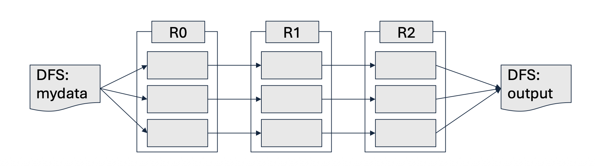

# 1. Introduction

* 이전 두 포스트를 통해 우리는 기존 분산 시스템(MapReduce)의 한계를 극복하기 위해 등장한 Spark의 RDD 구조와 다양한 연산자(Transformation & Action), 그리고 최적화의 핵심인 의존성(Dependency)에 대해 알아보았습니다.

* 시리즈의 마지막인 본 포스트에서는 작성된 Spark 코드가 **클러스터 내부에서 실제로 어떻게 구현되고 실행(Implementation)되는지** 그 물리적·논리적 메커니즘을 파헤쳐 봅니다. 구체적으로는 처리 효율성을 극대화하는 **지연 평가(Lazy Evaluation)**와 장애 발생 시 데이터를 완벽히 복구해내는 **계보(Lineage)** 추적 기술을 살펴본 뒤, Spark와 MapReduce의 비교를 통해 각각의 적절한 활용처를 정리하겠습니다.

---

# 2. Spark Implementation: 공통점과 혁신

* Spark의 근본적인 데이터 분산 철학은 MapReduce의 유산을 이어받으면서도 그 구조적 병목을 해결하는 방향으로 발전했습니다.

## 2.1 MapReduce와의 공통점

* **데이터 분할(Chunking)**: 거대한 거대한 RDD는 여러 개의 작은 덩어리(Chunk/Partition)로 나뉘어 클러스터 내의 서로 다른 워커 노드(Worker nodes)들에게 분배됩니다.
* **병렬 처리(Parallelism)**: 분배된 각 파티션에 대해 RDD 변환(Transformation) 연산들이 여러 노드에서 동시에 병렬적으로 수행됩니다.

## 2.2 Spark만의 2가지 핵심 개선 사항
* Spark가 MapReduce 대비 수십에서 수백 배의 성능 향상을 이뤄낼 수 있었던 시스템적 구현의 비결은 다음 두 가지로 요약됩니다.
  * 1. **지연 평가(Lazy Evaluation)**: 연산 효율성(Efficiency) 극대화
  * 2. **RDD 계보(Lineage)**: 결함 복원력(Fault-resilience) 확보

---

# 3. 효율성의 비밀: 지연 평가 (Lazy Evaluation)

* 지연 평가란 RDD에 대한 Transformation 연산(예: `map`, `filter`)을 호출하더라도 **그 즉시 데이터 처리를 수행하지 않고 연산 계획만 기록해 두는 메커니즘**을 의미합니다.

## 3.1 작동 원리 및 최적화 이점
* 실제 연산은 결과를 외부 파일 시스템에 저장하거나, 드라이버 프로그램으로 결과값을 반환해야 하는 **Action 연산(예: `reduce`, `saveAsTextFile`)이 호출될 때 비로소 트리거(Trigger)**됩니다.
* **실행 계획 최적화 (Execution Plan Optimization)**: Action이 호출되면 Spark의 내부 스케줄러가 기록된 연산들을 분석합니다. 여러 개의 Transformation을 하나로 결합(Combine)하여 데이터를 순회하는 횟수(Number of passes)를 최소화합니다.
* **디스크 I/O 제거**: 중간 결과를 디스크에 쓰지 않고 워커 노드의 메인 메모리(RAM)를 통해 다음 연산으로 직접 넘깁니다(Pipelining).

## 3.2 작동 예시: 문서 내 불용어(Stop Words) 제외 단어 수 세기
* 특정 텍스트 문서에서 불용어를 제외한 의미 있는 단어들의 개수를 구하는 과정을 가정해 봅시다.
  * 1. **입력 RDD ($R_0$)**: 외부 DFS에서 데이터를 읽어와 초기 RDD 생성
  * 2. **`flatMap` 변환 ($R_1$)**: $R_0$를 바탕으로 각 단어를 분리하여 `(word, 1)` 형태의 쌍을 생성하는 논리적 뷰 구성
  * 3. **`filter` 변환 ($R_2$)**: $R_1$의 결과 중 불용어 조건에 해당하는 요소들을 걸러내는 뷰 구성
  * 4. **Action 실행**: 최종적으로 이 결과를 DFS에 저장하라는 명령(`Reduce` 등)이 떨어졌을 때, Spark는 $R_0 \rightarrow R_1 \rightarrow R_2$의 과정을 각 파티션별로 메모리 안에서 단번에 연산합니다. 연산 직후 중간 산출물인 $R_1$과 $R_2$는 즉시 메모리에서 삭제(Dropped)되어 자원을 아낍니다.

---

# 4. 내결함성의 비밀: RDD 계보 (Lineage)

* 수천 대의 노드로 구성된 클러스터에서는 장비 고장, 네트워크 단절 등 특정 노드의 실패(Node failure)가 언제든 일어날 수 있습니다. Spark는 데이터를 디스크에 중복 저장하는 기존 방식 대신, **계보(Lineage)**라는 창의적인 방식으로 이를 해결합니다.

## 4.1 계보를 통한 데이터 복구 메커니즘
* Spark는 RDD가 어떠한 Transformation들을 거쳐 만들어졌는지 그 생성 경로(Lineage)를 DAG 형태로 완벽하게 기록하고 있습니다.
* 만약 연산 도중 특정 노드가 다운되어 RDD $R_2$의 일부 파티션 데이터가 유실(Lost)되었다고 가정해 봅시다.
* Spark 마스터는 유실된 데이터를 복구하기 위해 계보를 역추적합니다. $R_2$가 손실되었으면 부모인 $R_1$의 해당 파티션으로부터 재연산을 수행합니다.
* 만약 $R_1$마저 유실되었다면 $R_0$를, $R_0$마저 없다면 가장 최초의 안전한 저장소인 파일 시스템(DFS)에서 해당 부분의 데이터만 다시 읽어와서 복구해냅니다.

---

# 5. 총정리: MapReduce vs. Spark

* 그렇다면 데이터 엔지니어링 및 마이닝을 수행할 때 어떤 기술을 선택해야 할까요? 두 기술의 특징과 사용처(Use case)를 명확히 구분해 보겠습니다.

## 5.1 스펙 비교

| 비교 항목 | MapReduce | Apache Spark |
| :--- | :--- | :--- |
| **속도 (Speed)** | 전통적인 시스템들보다 빠름 | MapReduce 대비 인메모리 처리 시 **최대 100배 빠른 속도** |
| **주요 언어** | Java | Scala (그 외 Python, Java, R 등 지원) |
| **데이터 처리 방식** | 단순 배치 처리 (Batch processing) | 배치, 실시간 스트리밍, 반복 연산(Iterative), 대화형(Interactive), 그래프 처리 등 복합 지원 |
| **사용 편의성** | 복잡하고 코드의 길이가 김 | MapReduce에 비해 압축적이고 작성하기 직관적임 |
| **캐싱 (Caching)** | 디스크 기반이므로 캐싱 불가 | 데이터를 **메모리에 캐시**하여 시스템 성능을 극적으로 향상 |

## 5.2 When to Use What? (어느 상황에 써야 할까)

* **MapReduce를 선택해야 하는 경우:**
  * 데이터에 대한 선형적인 접근 및 처리가 필요할 때.
  * 로직이 아주 단순하여 Map과 Reduce 함수 두 개만으로도 쉽게 표현할 수 있는 작업.
  * 실시간 응답이 필요 없는 오프라인 기반의 초대규모 배치(Batch) 작업.

* **Spark를 선택해야 하는 경우:**
  * 즉각적인 응답이 필요한 대화형 데이터 탐색 및 빠른 처리.
  * 머신러닝(Machine Learning)이나 최적화 알고리즘처럼 **동일한 데이터셋에 대해 여러 번 반복 연산(Iterative jobs)을 수행**해야 할 때.
  * 실시간 데이터 스트리밍 분석이 필요할 때.
  * 워커 노드들이 데이터셋을 캐싱할 만큼 충분한 가용 메모리 용량을 갖추고 있을 때.