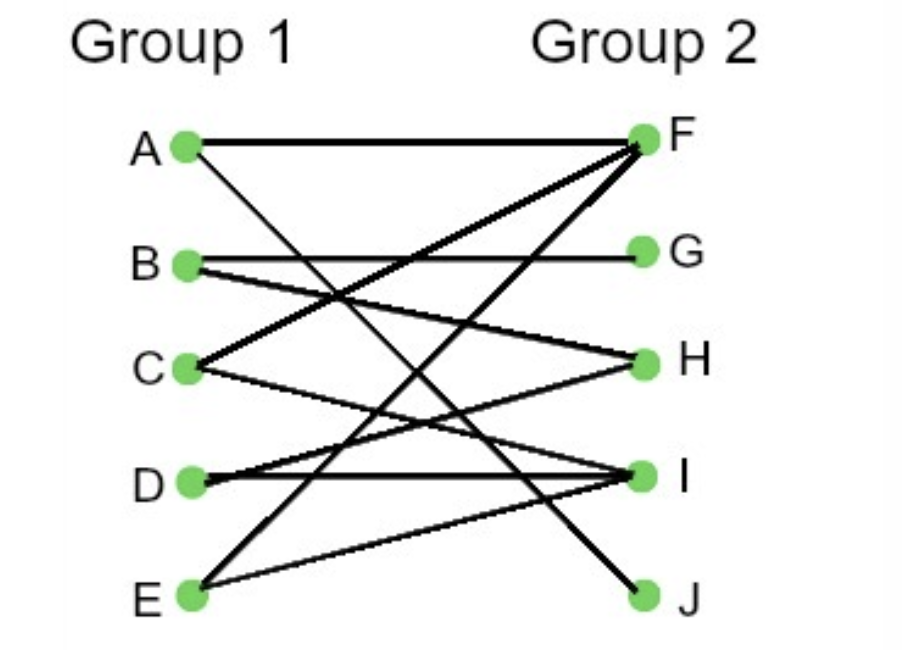

# 1. Introduction: 대규모 데이터셋의 패턴 탐색

* 데이터 마이닝 및 기계학습 분야에서 가장 근본적인 문제 중 하나는 대규모 데이터셋 내에서 빈번하게 발생하는 항목들의 패턴을 찾는 것입니다. 이를 직관적으로 이해하기 위해 대형 마트(Supermarket)의 관리자 사례를 생각해 볼 수 있습니다. 

* 마트의 관리자는 수많은 고객의 구매 영수증 데이터를 분석하여, **어떤 상품들이 주로 함께 판매되는지 그 패턴을 식별**하고자 합니다. 이러한 패턴을 파악하면 상품의 진열 위치를 최적화하거나 교차 판매(Cross-selling) 전략을 세울 수 있습니다. 하지만 현대 마트에서 발생하는 거래 데이터의 규모는 매우 방대하기 때문에, 사람이 이를 수작업으로 일일이 확인하고 패턴을 찾는 것은 불가능에 가깝습니다. 따라서 이를 효율적으로 탐색하기 위한 알고리즘과 수학적 모델링이 필수적입니다.

---

# 2. Association Rule Discovery (연관 규칙 탐색)

* 연관 규칙 탐색의 일차적인 목표는 수많은 고객들에 의해 '함께 구매되는 항목(items)'들을 식별하는 것입니다. 판매 데이터를 전처리 및 분석하여 특정 상품 간의 통계적 의존성(dependencies)을 찾아내는 접근법을 취합니다.

* 가장 널리 알려진 고전적인 연관 규칙의 예시는 다음과 같습니다:

> **"만약 어떤 고객이 기저귀(Diaper)와 우유(Milk)를 샀다면, 그 고객은 맥주(Beer)도 함께 구매할 가능성이 높다."** 

* 이러한 숨겨진 패턴을 발견한다면, 마트에서 기저귀 코너 바로 옆에 6캔들이 맥주(six-packs)가 진열되어 있는 전략적인 배치를 보더라도 전혀 놀라운 일이 아닐 것입니다.

* 일반적으로 연관 규칙은 특정 항목 집합을 구매한 사람들이 다른 특정 항목 집합도 구매하는 경향성을 나타내며, 수식적 형태로는 다음과 같이 표현할 수 있습니다:
  * **Association Rules**: "항목 집합 $\{x, y\}$를 구매한 사람들은 항목 집합 $\{z, v\}$도 구매하는 경향이 있다."  

---

# 3. The Market-Basket Model (장바구니 모델)

* 위에서 설명한 마트의 사례를 수학적으로 추상화한 것이 바로 **장바구니 모델(The Market-Basket Model)**입니다. 장바구니 모델은 기본적으로 두 거대한 집합 간의 **다대다 매핑(Many-to-many mapping)** 관계로 정의됩니다.

* 수학적 모델링을 위해 두 개의 집합을 정의해 보겠습니다.
  * 1. **Items (항목 집합, $I$)**: 마트에서 판매되는 모든 물건 등 분석 대상이 되는 대규모 항목들의 집합입니다.
  * 2. **Baskets (장바구니 집합, $B$)**: 고객이 한 번의 거래(영수증)에서 구매한 물건들의 집합입니다. 

* 이때 개별 장바구니 $b \in B$는 전체 항목 집합 $I$의 작은 부분 집합(small subset)으로 구성됩니다 ($b \subset I$).

* 다음은 5개의 장바구니로 구성된 간단한 매핑 테이블 예시입니다:

| Basket | Items |
| :--- | :--- |
| 1 | Bread, Coke, Milk |
| 2 | Beer, Bread |
| 3 | Beer, Coke, Diaper, Milk |
| 4 | Beer, Bread, Diaper, Milk |
| 5 | Coke, Diaper, Milk |

---

# 4. Frequent Itemsets & Support (빈발 항목 집합과 지지도)

* 장바구니 모델에서의 주요 목표는 함께 빈번하게 등장하는 항목들의 집합을 찾는 것, 즉 **빈발 항목 집합(Frequent Itemsets)**을 찾는 것입니다. 이를 엄밀하게 정의하기 위해 **지지도(Support)**라는 개념을 도입합니다.

* 특정 항목 집합 $I$에 대한 지지도는 집합 $I$의 모든 원소를 동시에 포함하고 있는 장바구니의 개수(혹은 비율)로 정의됩니다.
* 수식으로 표현하면, 항목 집합 $X$의 지지도 $supp(X)$는 다음과 같습니다.
$$supp(X) = |\{b \in B \mid X \subseteq b\}|$$

* 이때, 사전에 사용자가 지정한 **지지도 임계값(Support threshold)**을 $s$라고 가정해 봅시다. 
* 특정 항목 집합 $I$가 최소 $s$개 이상의 장바구니에 등장한다면 ($supp(I) \geq s$), 우리는 이 집합 $I$를 **빈발 항목 집합(Frequent Itemset)**이라고 정의합니다.

* 앞선 테이블 예시를 다시 살펴보겠습니다:
  * 만약 우리가 구하고자 하는 항목 집합이 `{Beer, Bread}`라면, 이 두 항목을 모두 포함하고 있는 장바구니는 Basket 2와 Basket 4입니다. 따라서 `{Beer, Bread}`의 지지도는 2가 됩니다.

---

# 5. 단계별 빈발 항목 집합 탐색 (Detailed Example)

* 개념을 완벽히 숙지하기 위해, 다음의 데이터셋에서 빈발 항목 집합을 유도하는 과정을 단계별로 살펴보겠습니다.
  * **전체 항목 집합(Items)**: {milk($m$), coke($c$), pepsi($p$), beer($b$), juice($j$)} 
  * **지지도 임계값($s$)**: 3 (즉, 최소 3개 이상의 장바구니에 등장해야 함) 

* 주어진 8개의 장바구니($B1 \sim B8$) 데이터는 다음과 같습니다:
  * $B1 = \{m, c, b\}$
  * $B2 = \{m, p, j\}$
  * $B3 = \{m, b\}$
  * $B4 = \{c, j\}$
  * $B5 = \{m, p, b\}$
  * $B6 = \{m, c, b, j\}$
  * $B7 = \{c, b, j\}$
  * $B8 = \{b, c\}$

* 이제 이 데이터에서 빈발 항목 집합(Frequent Itemsets)을 도출해 봅시다.

## **Step 1. 단일 항목 (1-Itemsets)의 지지도 계산**
* 먼저 각 개별 상품이 몇 개의 장바구니에 담겼는지 계산합니다.
  * $m$ (milk): B1, B2, B3, B5, B6 $\rightarrow$ 지지도 5 ($\geq 3$, 빈발함)
  * $c$ (coke): B1, B4, B6, B7, B8 $\rightarrow$ 지지도 5 ($\geq 3$, 빈발함)
  * $p$ (pepsi): B2, B5 $\rightarrow$ 지지도 2 ($< 3$, 탈락)
  * $b$ (beer): B1, B3, B5, B6, B7, B8 $\rightarrow$ 지지도 6 ($\geq 3$, 빈발함)
  * $j$ (juice): B2, B4, B6, B7 $\rightarrow$ 지지도 4 ($\geq 3$, 빈발함)

* 단일 빈발 항목 집합은 **`{m}, {c}, {b}, {j}`** 입니다.

## **Step 2. 쌍으로 구성된 항목 (2-Itemsets)의 지지도 계산**
* 살아남은 빈발 단일 항목들을 조합하여 쌍(Pair)을 만들고, 이들의 지지도를 계산합니다.
  * $\{m, c\}$: B1, B6 $\rightarrow$ 지지도 2 ($< 3$, 탈락)
  * $\{m, b\}$: B1, B3, B5, B6 $\rightarrow$ 지지도 4 ($\geq 3$, 빈발함)
  * $\{m, j\}$: B2, B6 $\rightarrow$ 지지도 2 ($< 3$, 탈락)
  * $\{c, b\}$: B1, B6, B7, B8 $\rightarrow$ 지지도 4 ($\geq 3$, 빈발함)
  * $\{c, j\}$: B4, B6, B7 $\rightarrow$ 지지도 3 ($\geq 3$, 빈발함)
  * $\{b, j\}$: B6, B7 $\rightarrow$ 지지도 2 ($< 3$, 탈락)

* 위의 탐색을 통해, 임계값 3을 넘는 최종적인 모든 빈발 항목 집합은 다음과 같이 도출됩니다:
> **Frequent itemsets: `{m}, {c}, {b}, {j}, {m, b}, {b, c}, {c, j}`** 

---

# 6. Abstraction: 장바구니 모델의 일반화 및 활용

* 장바구니 모델(Market-Basket Model)은 단순한 대형 마트의 구매 데이터를 넘어서, 다양한 형태의 데이터를 다룰 수 있는 고도로 **추상화된 모델(Abstract)**입니다. 

* 데이터가 **다대다 매핑(Many-to-many mapping)**의 구조를 띠고 있기만 하다면, 어떠한 데이터셋이든 이 모델을 적용하여 의미 있는 연관성을 찾을 수 있습니다. 반드시 물리적인 형태의 항목(items)이 장바구니(baskets) "안에(in)" 담겨있을 필요는 없습니다. 

* 위 그림처럼 Group 1 집합과 Group 2 집합 사이의 이분 그래프(Bipartite Graph) 구조를 갖는 현실 세계의 문제들은 모두 이 알고리즘의 적용 대상이 될 수 있습니다. 대표적인 예시는 다음과 같습니다:
  * 1. **주제 탐색 (Topic discovery)**: 
     * Items = 단어 (Words) 
     * Baskets = 문서 (Documents) 
     * 특정 문서들에 자주 함께 등장하는 단어들의 묶음을 찾아내어, 숨겨진 토픽을 식별합니다.
  * 2. **표절 탐지 (Plagiarism)**:
     * Items = 원본 문서들 (Documents) 
     * Baskets = 문장들 (Sentences) 
     * 동일한 문장들이 여러 문서에 공통적으로 다수 등장한다면 표절의 증거로 삼을 수 있습니다.
  * 3. **의료 데이터 및 바이오마커 식별 (Biomarkers)**:
     * Items = 약물이나 바이오마커 (Drugs) 
     * Baskets = 환자들 (Patients) 
     * 특정 환자군에서 공통으로 처방된 약물 조합이나, 발현되는 바이오마커의 빈번한 조합을 추적하여 임상적 의의를 발굴합니다.

* 이처럼 빈발 항목 탐색 알고리즘은 본질적인 추상성을 바탕으로 자연어 처리(NLP), 문서 분석, 생물정보학(Bioinformatics) 등 다양한 도메인에서 강력한 도구로 활용되고 있습니다.