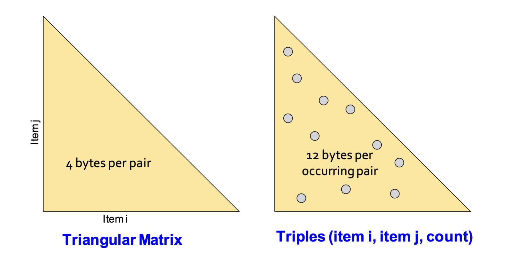

# 1. Introduction: 현실의 데이터는 너무 크다

* 지난 포스트들에서는 빈발 항목 집합(Frequent Itemsets)과 연관 규칙(Association Rules)의 개념, 그리고 결과를 유의미하게 압축하는 방법론을 다루었습니다. 이론적으로는 모든 항목 조합을 다 세어보면 될 것 같지만, 현실의 데이터 마이닝 환경에서는 **"어떻게 세어야 하는가(How to count)?"**가 가장 치명적인 문제가 됩니다.

* 이번 포스트에서는 장바구니 모델 데이터가 실제 디스크에 어떻게 저장되는지, 그리고 빈발 쌍(Frequent Pairs)을 찾기 위해 메모리 상에서 카운팅을 수행할 때 마주하게 되는 **메인 메모리 병목(Main-Memory Bottleneck)** 현상에 대해 깊이 있게 살펴보겠습니다.

---

# 2. Market-Basket Data의 표현과 연산 비용

* 대형 마트나 웹 로그와 같은 장바구니 데이터(Market-Basket Data)는 그 크기가 메인 메모리 용량을 아득히 초과할 정도로 거대합니다. 따라서 이러한 데이터는 일반적으로 분산 파일 시스템(DFS)이나 대용량 파일의 형태로 **장바구니 단위(Basket-by-basket)**로 디스크에 저장됩니다.

* 장바구니 하나하나의 크기는 작을 수 있지만, 장바구니의 총 개수와 항목(Items)의 총 가짓수는 천문학적입니다.
* 메인 메모리에 전체 데이터를 한 번에 올릴 수 없기 때문에, 알고리즘은 디스크에서 데이터를 읽어오며 연산을 수행해야 합니다.

* **Computational Cost (연산 비용의 척도)**
  * 대규모 데이터를 마이닝할 때 진정한 병목 현상은 CPU 연산 속도가 아니라 **디스크 I/O 횟수**에서 발생합니다. 따라서 연관 규칙 탐색 알고리즘의 효율성은 **데이터를 처음부터 끝까지 몇 번 스캔(Pass)하는가**에 의해 결정됩니다. 디스크 접근을 최소화하고, 한 번의 Pass에서 최대한 많은 정보를 메모리에서 처리하는 것이 핵심입니다.

---

# 3. Main-Memory Bottleneck (메인 메모리 병목)

* 장바구니 데이터를 스캔하면서 특정 항목이나 조합이 몇 번 등장했는지 카운팅(Counting)하려면, 그 결과값을 저장할 공간이 메인 메모리에 있어야 합니다. 즉, 우리가 추적하고 셀 수 있는 대상의 가짓수는 **메인 메모리의 크기**에 의해 물리적인 한계를 맞이합니다.

* 메모리가 부족하다고 해서 가상 메모리로 디스크 스와핑(Swapping in/out)을 시도하는 것은 성능 측면에서 "재앙(Disaster)"에 가깝습니다. 빈번한 디스크 I/O가 발생하여 알고리즘이 사실상 멈춰버리기 때문입니다.

* **최적화 기법: 정수 매핑(Integer Mapping)**
  * 메모리를 아끼기 위한 기초적이고 필수적인 테크닉은 항목(Item)의 이름을 문자열 그대로 쓰지 않는 것입니다. 
  * 해시 테이블(Hash table)을 구축하여, 식별된 $n$개의 서로 다른 고유 항목들을 $1$부터 $n$까지의 연속된 **정수(Integers)로 변환**합니다. 이를 통해 각 항목은 단 4바이트(int)로 표현될 수 있습니다.

---

# 4. 왜 '쌍(Pairs)'을 찾는 것이 가장 어려운가?

* 빈발 항목 집합을 탐색할 때, 가장 연산이 까다롭고 메모리를 많이 잡아먹는 단계는 바로 **빈발 쌍(Frequent pairs, 크기가 2인 부분집합)**을 찾는 과정입니다.
  * 단일 항목(1-Itemset)은 항목의 총 개수($n$)만큼만 세면 되므로 메모리 부담이 적습니다.
  * 3개 이상의 묶음(Triples, Quadruples...)은 크기가 커질수록 해당 묶음이 특정 장바구니에 온전히 포함될 **확률이 기하급수적으로(Exponentially) 감소**합니다. 즉, 빈발할 확률이 매우 낮기 때문에 고려해야 할 후보군 자체가 적습니다.
  * 반면, 2개짜리 쌍(Pairs)은 조합의 수도 $O(n^2)$으로 매우 많으면서, 동시에 빈발하게 등장할 가능성도 높습니다.

* 이러한 이유로 데이터 마이닝 알고리즘들은 우선 빈발 쌍(Pairs)을 효율적으로 찾는 문제에 집중한 뒤, 이를 확장하여 더 큰 집합을 찾도록 설계됩니다.

---

# 5. 메모리 상에서 Pairs를 카운팅하는 두 가지 접근법

* 모든 가능한 쌍 $(i, j)$의 등장 횟수(Count)를 메인 메모리에 저장해야 한다고 할 때, 다음과 같은 두 가지 대표적인 자료구조 기법이 존재합니다.

## 5.1 삼각 행렬 방법 (Triangular-Matrix Method)
* **원리**: $i < j$ 인 모든 쌍 $(i, j)$에 대해 고정된 1차원 배열(Matrix)을 만들어 카운트를 저장합니다. 
* **구조**: 쌍들은 사전식 순서(Lexicographic order)로 저장됩니다.

  > $\{1,2\}, \{1,3\}, \dots, \{1,n\}, \{2,3\}, \{2,4\}, \dots, \{n-1, n\}$

* **비용**: 각 쌍의 등장 횟수를 저장하는 데 **4바이트(정수 1개)**가 필요합니다. 배열의 인덱스 자체가 $i$와 $j$의 정보를 내포하므로 $(i, j)$ 자체를 저장할 필요가 없습니다.

## 5.2 트리플 방법 (Triples Method)
* **원리**: 실제로 장바구니에 한 번이라도 등장한 쌍에 대해서만 카운트를 저장합니다. 해시 테이블을 이용합니다.
* **구조**: $(i, j, count)$ 형태의 트리플(튜플) 구조로 저장합니다.
* **비용**: 항목 $i$ (4바이트) + 항목 $j$ (4바이트) + 등장 횟수 $c$ (4바이트) = **1쌍당 12바이트**가 필요합니다. (해시 테이블 관리를 위한 약간의 오버헤드는 별도로 존재합니다.)

---

# 6. 수학적 비교: 언제 어떤 방법이 더 유리한가?

* 두 방식의 메모리 점유율을 수식으로 비교해 보겠습니다. 전체 항목의 개수를 $n$이라고 합시다. 가능한 모든 쌍의 개수는 $\frac{n(n-1)}{2}$ 개입니다.

* 1. **Triangular-Matrix의 총 메모리**:
   $$Total Bytes = 4 \times \frac{n(n-1)}{2}$$
   * 이 방식은 실제 쌍의 등장 여부와 관계없이 **항상 고정된 메모리**를 차지합니다.

* 2. **Triples Method의 총 메모리**:
   * 전체 가능한 쌍 중에서 실제 장바구니 데이터에 한 번이라도 등장하여 $count > 0$ 인 쌍의 비율을 $p$라고 합시다.
   $$Total Bytes = 12 \times p \times \frac{n(n-1)}{2}$$

* **결론 (The $1/3$ Rule)**:
  * Triples 방법이 Triangular-Matrix 방법보다 메모리 측면에서 우수하려면 다음 부등식을 만족해야 합니다.
$$12 \times p \times \frac{n(n-1)}{2} < 4 \times \frac{n(n-1)}{2}$$
$$12p < 4 \implies p < \frac{1}{3}$$
  * 즉, **실제 데이터에 등장하는 항목 쌍의 비율($p$)이 전체 가능한 조합의 $\frac{1}{3}$ 미만일 경우**, 희소성(Sparsity)을 띠게 되므로 **Triples 방법(해시 테이블 방식)을 사용하는 것이 유리**합니다. 반대로 데이터가 빽빽하여 대부분의 조합이 한 번 이상 등장한다면 행렬 방식이 유리합니다.

---

# 7. Naïve Algorithm의 한계와 과제

* 가장 단순한 접근법(Naïve Algorithm)은 메모리 위에 위에서 언급한 구조(Matrix나 Hash Table)를 통째로 올려두고, 데이터를 한 번 스캔(1-Pass)하면서 발견되는 모든 쌍의 카운트를 1씩 올리는 것입니다.

* 만약 장바구니 $b$가 $n_b$개의 항목을 담고 있다면, 이 장바구니 하나에서만 $\frac{n_b(n_b-1)}{2}$ 개의 쌍이 생성되어 카운팅을 요구합니다. 

* 이 방법은 $n$ (전체 항목의 수)이 커지면 메모리가 $n^2$ 에 비례하여 폭발적으로 증가하기 때문에 곧바로 한계에 부딪힙니다.
  * **월마트(Wal-Mart)**: 항목 약 $100,000$개
  * **웹 페이지 분석**: 항목 약 $10,000,000,000$ (10B) 개

* 만약 아이템이 $1,000,000$ (1M) 개라고 가정해 봅시다. 쌍의 개수는 약 $\frac{10^{12}}{2}$ 개이며, Triangular Matrix 방식을 적용하여 4바이트씩만 곱해도 무려 **2 Terabytes**의 메인 메모리가 필요합니다. 10억(1B) 개라면 상상할 수도 없는 메모리가 요구됩니다.

* **"Q: 이렇게 항목이 너무 많을 때 우리는 어떻게 더 나은 탐색을 할 수 있을까요?"**
  * 메모리에 모든 조합을 올려두고 세는 Naïve 방식은 현실에서 불가능합니다. 이를 영리하게 극복하기 위해 등장한 개념이 바로 다음 포스트에서 다룰 **A-Priori 알고리즘**입니다.