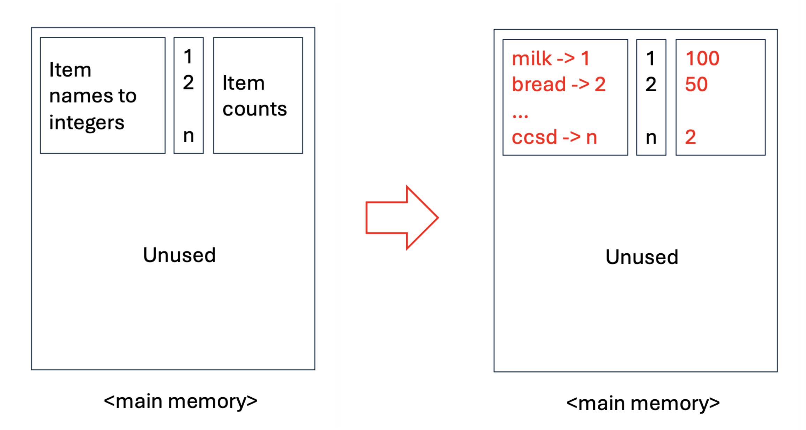
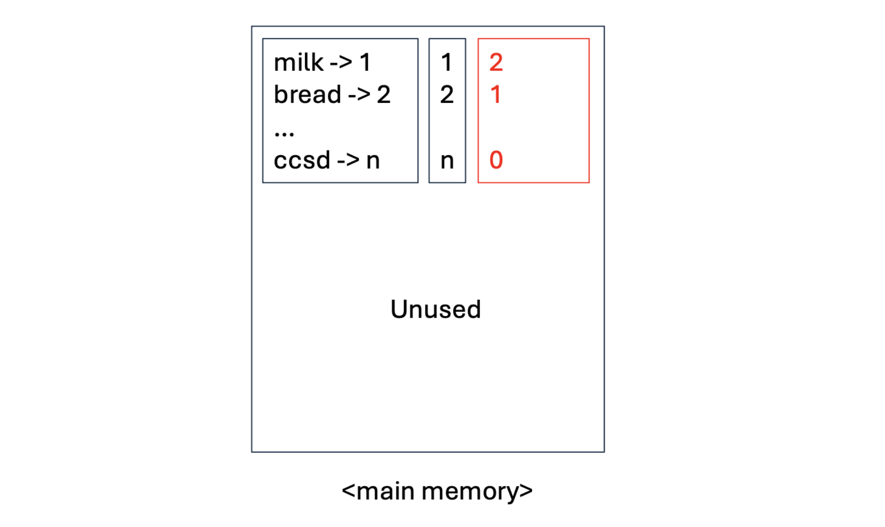
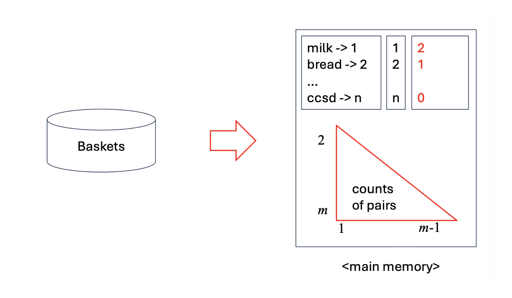
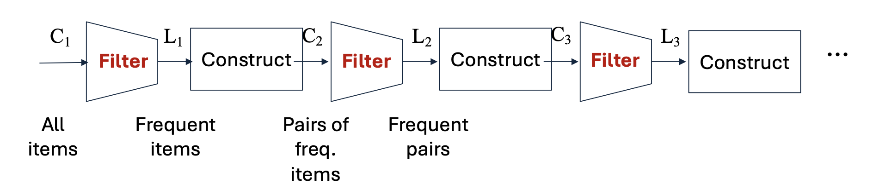

# 1. Introduction: O(n²) 메모리 장벽을 넘어서

* 이전 포스트에서는 모든 항목의 조합을 한 번에 탐색하려는 Naïve 알고리즘이 메인 메모리 병목(Main-Memory Bottleneck)으로 인해 실패하는 과정을 확인했습니다. 항목이 수십만 개 이상인 현실의 대규모 장바구니 데이터를 처리하기 위해서는 디스크 접근(Pass)을 최소화하면서도, 메모리 사용량을 지수적으로 줄일 수 있는 영리한 알고리즘이 필요합니다.

* 이러한 배경에서 등장한 것이 바로 데이터 마이닝 역사상 가장 상징적인 알고리즘 중 하나인 **A-Priori Algorithm(선험적 알고리즘)**입니다. 이 알고리즘은 **두 번의 데이터 스캔(Two-Pass Approach)**만으로 메모리 사용량을 획기적으로 통제하며, 그 기저에는 수학적 직관인 **단조성(Monotonicity)**이 자리 잡고 있습니다.

---

# 2. Key Idea: Monotonicity (단조성)

* A-Priori 알고리즘의 심장부는 '단조성(Monotonicity)'이라는 단순명료한 확률적/집합적 성질입니다.

> **단조성(Monotonicity) 원리**
> 만약 특정 항목 집합 $I$가 최소 지지도 $s$ 이상 등장하는 빈발 항목 집합(Frequent Itemset)이라면, $I$의 **모든 부분집합(Subset) $J \subseteq I$ 역시 반드시 빈발 항목 집합**이다.

* 이는 직관적으로 당연합니다. 장바구니 데이터에 우유, 맥주, 기저귀를 동시에 산 사람(집합 $I$)이 100명이라면, 최소한 우유와 맥주를 산 사람(집합 $J$)은 무조건 100명 이상일 수밖에 없기 때문입니다.

* 이 명제의 **대우(Contrapositive)**를 취하면, 조합 탐색의 가지치기(Pruning)를 위한 핵심 법칙이 도출됩니다.

> **"어떤 단일 항목 $i$가 지지도 $s$를 넘지 못한다면(빈발하지 않다면), 항목 $i$를 포함하는 그 어떠한 쌍(Pair)이나 부분집합도 절대 빈발할 수 없다."**

* 이 대우 명제를 이용하면, 우리는 처음부터 빈발하지 않은 단일 아이템들을 메모리상에서 과감히 제거해버릴 수 있습니다. 이것이 A-Priori의 핵심 전략입니다.

---

# 3. A-Priori Algorithm: 2-Pass Approach

* A-Priori는 거대한 디스크 데이터를 메모리에 효율적으로 올리기 위해 데이터를 두 번 읽는(Pass 1, Pass 2) 방식으로 동작합니다. 가장 찾기 힘든 **빈발 쌍(Frequent Pairs)**을 찾는 과정을 단계별로 살펴보겠습니다.

## 3.1 Pass 1: 단일 항목의 빈도수 측정

* 첫 번째 스캔의 목표는 개별 항목(1-Itemset)들의 등장 횟수를 세고, 이들 중 지지도 $s$를 넘는 **빈발 항목(Frequent items)**을 식별하는 것입니다.
  * 1. **테이블 1**: 데이터베이스에 존재하는 모든 문자열 항목(Item names)을 $1$부터 $n$까지의 정수(Integers)로 번역하는 매핑 테이블을 생성합니다.
  * 2. **테이블 2**: 각 항목 $1 \dots n$의 빈도를 카운팅할 1차원 정수 배열(Array of counts)을 0으로 초기화하고, 디스크에서 Baskets를 읽어 들이며 카운트를 증가시킵니다.
  * 3. 이 단계에서 요구되는 메모리 공간은 전체 항목의 개수 $n$에만 비례($O(n)$)하므로 매우 작고 안전합니다.

## 3.2 Between Pass 1 & 2: 메모리 최적화 재매핑

* Pass 1이 끝난 후, 카운트 배열을 스캔하여 빈도수가 $s$ 이상인 항목들만 남깁니다. 이렇게 살아남은 빈발 항목들의 개수를 $m$이라고 합시다 ($m \ll n$).

* 이제 다음 Pass에서 메모리를 획기적으로 줄이기 위해 **인덱스 재배열(Renumbering)**을 수행합니다.
  * 살아남은 빈발 항목 $m$개에 대해서만 $1$부터 $m$까지 새로운 연속된 정수 인덱스를 부여합니다.
  * 크기 $n$짜리 배열을 새로 생성하여, $i$번째 항목이 빈발 항목이면 새로운 번호($1 \dots m$)를 저장하고, 빈발 항목이 아니면 $0$을 저장합니다. (이렇게 하면 어떤 항목이 빈발한지 아닌지 $O(1)$로 판별 가능해집니다.)

## 3.3 Pass 2: 빈발 쌍(Pairs) 탐색

* 두 번째 스캔에서는 디스크에서 Baskets를 처음부터 다시 읽습니다. 하지만 이번에는 모든 것을 세지 않습니다.
  * 1. 각 장바구니를 읽을 때마다, 포함된 항목들 중 **"빈발 항목(재매핑된 번호가 1~m 사이인 것)"**들만 추려냅니다.
  * 2. 장바구니 내에 살아남은 빈발 항목들 사이에서만 쌍(Pairs)을 생성합니다. 단조성에 의해, 여기에 속하지 않은 항목이 포함된 쌍은 어차피 빈발할 수 없으므로 무시합니다.
  * 3. 이 쌍들의 빈도를 저장하기 위해 이전 포스트에서 배운 **삼각 행렬(Triangular matrix)**이나 **트리플(Triples)** 자료구조를 메인 메모리에 할당하여 카운팅합니다.

* 이때 소모되는 메모리는 전체 아이템의 제곱($O(n^2)$)이 아니라, 빈발 아이템 개수의 제곱($O(m^2)$)에 비례하므로 메모리 병목을 완벽히 피할 수 있습니다!

---

# 4. K-tuple의 확장: The A-Priori Pipeline

* 쌍(Pairs, 2-tuples)을 넘어 크기 $k$의 다중 항목 집합을 찾기 위해서 A-Priori 알고리즘은 **Generate-and-Test 파이프라인**을 반복합니다. 각 단계 $k$에서 우리는 두 개의 집합을 정의합니다:
  * $C_k$ (Candidate): 조건을 통과하여 빈발할 "가능성"이 있는 크기 $k$의 후보 집합
  * $L_k$ (Large/Frequent): 실제 Baskets를 카운팅한 결과, 지지도 임계값을 통과한 진정한 빈발 $k$-집합

### **Pipeline Process:**
* 1. $All \ Items \rightarrow C_1 \xrightarrow{Filter} L_1$ (이 단계가 Pass 1)
* 2. $L_1 \xrightarrow{Construct} C_2 \xrightarrow{Filter} L_2$ (이 단계가 Pass 2)
* 3. $L_2 \xrightarrow{Construct} C_3 \xrightarrow{Filter} L_3 \dots$

## 4.1 Construct 단계의 엄밀한 조건 (Example)

* $L_{k-1}$로부터 $C_k$를 생성(Construct)할 때는 단순한 조합이 아니라 **단조성 원칙을 극한으로 적용**해야 합니다. $C_k$의 후보가 되려면, 그 집합의 **모든 크기 $k-1$ 짜리 부분집합이 전부 $L_{k-1}$ 안에 존재**해야만 합니다. 하나라도 없다면 탈락입니다.

* **예제 상황:**
  * $C_1 = \{\{1\}, \{2\}, \{3\}, \{4\}, \{5\}, \dots, \{10\}\}$
  * **Filter**: 지지도 계산 후 $\rightarrow$ $L_1 = \{\{1\}, \{2\}, \{3\}, \{4\}, \{5\}\}$
  * **Construct**: $L_1$ 내에서 2개씩 짝짓기 $\rightarrow$ $C_2 = \{\{1,2\}, \{1,3\}, \dots, \{4,5\}\}$
  * **Filter**: 지지도 계산 후 $\rightarrow$ $L_2 = \{\{1,2\}, \{2,3\}, \{2,4\}, \{3,4\}, \{4,5\}\}$

* 자, 이제 $L_2$를 바탕으로 $C_3$ 후보를 생성해 봅시다.
  * **후보 $\{2, 3, 4\}$**: 이것의 크기 2짜리 부분집합은 $\{2,3\}, \{2,4\}, \{3,4\}$ 입니다. 세 개 모두 $L_2$ 안에 존재하므로 합격! **$C_3$에 편입**됩니다.
  * **후보 $\{1, 2, 3\}$**: 부분집합은 $\{1,2\}, \{1,3\}, \{2,3\}$ 입니다. 이 중 $\{1,3\}$은 $L_2$에 없습니다. 단조성 원리에 의해 합격될 리 없으므로 즉시 **기각(Prune) 및 탈락!**
  * **후보 $\{2, 4, 5\}$**: 부분집합 $\{2,5\}$가 $L_2$에 없으므로 **탈락!**

* 이러한 방식으로 후보군 $C$ 자체를 기하급수적으로 줄이는 것이 A-Priori의 강력함입니다.

---

# 5. Pop Quiz: A-Priori 알고리즘 직접 적용해 보기

* 이론을 체화하기 위해 슬라이드 마지막에 제시된 퀴즈를 직접 수행해 보겠습니다.

## **조건:**
  * 지지도 임계값 $s=3$
  * 장바구니 데이터:
    * $B1 = \{apple, butter, milk\}$
    * $B2 = \{apple, butter, banana, walnuts, milk\}$
    * $B3 = \{butter, milk\}$
    * $B4 = \{apple, milk\}$

## **[Step 1] Pass 1: $C_1$ 카운팅 및 $L_1$ 도출**
* 디스크를 1회 스캔하여 각 아이템의 등장 빈도를 셉니다.
  * $apple$: B1, B2, B4 $\rightarrow$ 3
  * $butter$: B1, B2, B3 $\rightarrow$ 3
  * $milk$: B1, B2, B3, B4 $\rightarrow$ 4
  * $banana$: B2 $\rightarrow$ 1
  * $walnuts$: B2 $\rightarrow$ 1

* 임계값 $s=3$을 적용하여 필터링($Filter$)합니다.
  * **$L_1 = \{apple, butter, milk\}$** (banana와 walnuts는 가지치기 당하여 영구 탈락합니다.)

## **[Step 2] Pass 2를 위한 $C_2$ 생성 (Construct)**
* $L_1$의 요소들을 이용해 생성 가능한 모든 쌍의 조합을 구성합니다.
  * **$C_2 = \{\{apple, butter\}, \{apple, milk\}, \{butter, milk\}\}$**

## **[Step 3] Pass 2: $C_2$ 카운팅 및 $L_2$ 도출**
* 데이터베이스를 다시 스캔하여 $C_2$에 포함된 쌍들의 빈도를 카운팅합니다.
  * $\{apple, butter\}$: B1, B2 $\rightarrow$ 2 (지지도 미달)
  * $\{apple, milk\}$: B1, B2, B4 $\rightarrow$ 3
  * $\{butter, milk\}$: B1, B2, B3 $\rightarrow$ 3

* 임계값 $s=3$을 적용하여 필터링합니다.
  * **$L_2 = \{\{apple, milk\}, \{butter, milk\}\}$**

## **[Step 4] $C_3$ 생성 시도 및 종료**
* $L_2$를 바탕으로 크기 3의 집합 $C_3$ 생성을 시도합니다. 유일한 조합은 $\{apple, butter, milk\}$ 입니다.
* 하지만 이 집합의 부분집합 중 하나인 $\{apple, butter\}$가 $L_2$에 존재하지 않습니다. 따라서 A-Priori의 단조성 규칙에 의해 후보군을 생성할 수 없습니다. 
  * **$C_3 = \emptyset$**
* 더 이상 탐색할 빈발 항목이 없으므로 알고리즘이 성공적으로 **종료**됩니다.