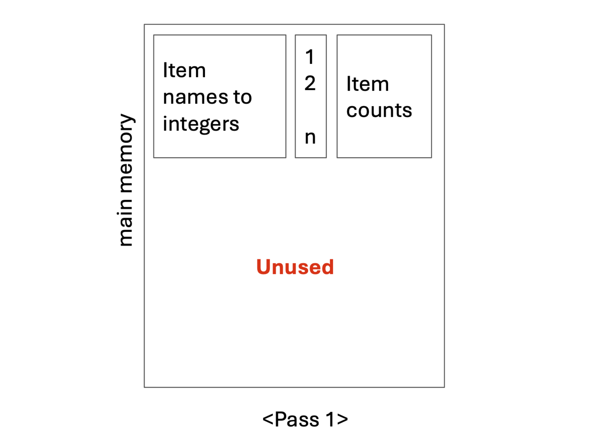
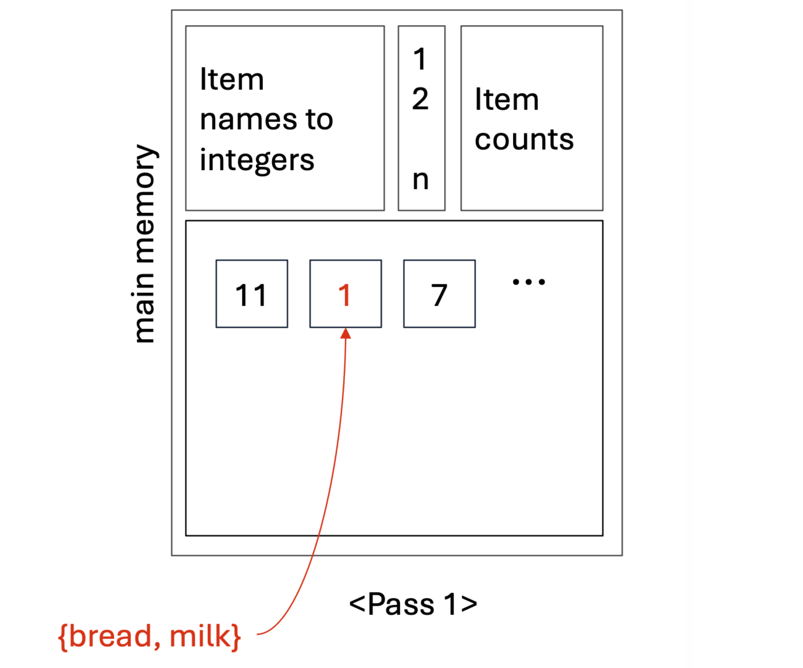
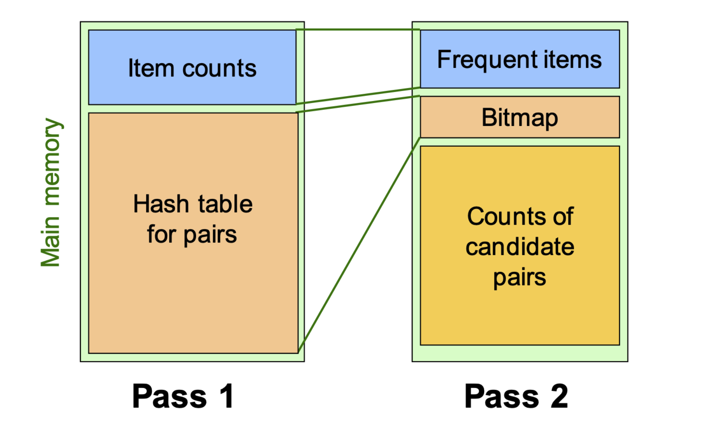

# 1. Introduction: 메모리 한계와 새로운 접근

* 데이터 마이닝에서 빈발 항목 집합(Frequent Itemsets)을 찾는 것은 연관 규칙 학습의 핵심입니다. 앞서 다루었던 기본적인 A-Priori 알고리즘은 후보 크기가 작은 경우에는 훌륭하게 작동하지만, 치명적인 전제 조건이 있습니다. 바로 후보 쌍(Candidate pairs) 집합인 $C_2$를 카운팅하는 작업이 반드시 **메인 메모리(Main Memory)** 내에서 이루어져야 한다는 점입니다.

* 만약 분석해야 할 데이터의 차원이 매우 커서 메모리가 부족해진다면 어떻게 해야 할까요? 이러한 한계를 극복하기 위해서는 생성되는 $C_2$의 크기 자체를 사전에 효과적으로 줄여주는 알고리즘이 필수적입니다. 대표적인 확장 알고리즘으로는 다음 세 가지가 있습니다.
  * 1. **PCY (Park-Chen-Yu) Algorithm**
  * 2. Multistage Algorithm
  * 3. Multihash Algorithm

* 본 포스트에서는 A-Priori의 메모리 비효율성을 개선한 **PCY 알고리즘**의 수학적 원리와 논리적 흐름을 상세히 다룹니다.

---

# 2. PCY 알고리즘의 핵심 아이디어 (Motivation)

* PCY 알고리즘의 출발점은 A-Priori 알고리즘의 **첫 번째 패스(Pass 1)에서 발생하는 메모리의 낭비**를 관찰하는 것에서 시작됩니다. 

* A-Priori의 Pass 1에서는 개별 아이템(Item)을 정수로 매핑(Item names to integers)하고, 각 개별 아이템의 빈도수(Item counts)만을 세어 메모리에 저장합니다. 이 과정에서 메인 메모리의 상당 부분은 사용되지 않고 유휴(Idle) 상태로 남게 됩니다. PCY 알고리즘은 모든 아이템 쌍을 메모리에 직접 저장할 수 없다는 점을 인지하고, 이 "비어있는 메모리 공간"을 Pass 2를 위해 미리 활용하는 전략을 취합니다.

---

# 3. 알고리즘의 작동 원리 (Mechanism)

## 3.1. Pass 1: 해시 테이블의 생성과 카운팅

* PCY 알고리즘은 Pass 1 데이터를 스캔할 때, 단일 아이템의 빈도를 세는 동시에 **아이템 쌍(Pairs)에 대한 해시 테이블(Hash table)**을 유휴 메모리에 생성합니다. 
  * 1. **버킷 할당:** 사용 가능한 메모리 크기에 맞춰 최대한 많은 수의 버킷(Bucket)을 만듭니다. 예를 들어, 4KB의 여유 메모리가 있다면 약 1,000개의 버킷을 할당할 수 있습니다.
  * 2. **해싱 작업:** 장바구니 데이터를 스캔하면서 발생하는 모든 아이템 쌍 $\{i, j\}$에 대해 해시 함수를 적용하고, 해당 쌍이 매핑되는 버킷의 카운트를 1 증가시킵니다.
  * 3. **충돌(Collision)의 수용:** 고유한 아이템 쌍의 전체 개수는 할당된 버킷의 수보다 훨씬 많기 때문에, 서로 다른 쌍이 같은 버킷에 할당되는 해시 충돌은 필연적으로 발생합니다. 이는 알고리즘 구조상 자연스러운 현상입니다.

## 3.2. 버킷 관찰과 논리적 추론 (Observations)

* 해시 테이블을 만드는 이유는 단 하나, **빈발할 가능성이 전혀 없는 쌍(infrequent pairs)을 사전에 제거**하기 위해서입니다.
* 특정 버킷 $B$의 카운트는 그 버킷으로 해싱된 "모든" 아이템 쌍의 출현 횟수 총합입니다.
* 만약 버킷 $B$의 총 카운트가 우리가 설정한 지지도 임계값(Support threshold) $s$ 이상이라면, 해당 버킷에 속한 쌍들 중 일부는 빈발 항목 집합일 *가능성*이 있습니다.
* **결정적 논리:** 반대로, 버킷 $B$의 총 카운트가 $s$ 미만이라면, 그 버킷으로 해싱된 **그 어떤 아이템 쌍도 절대 지지도 $s$를 넘을 수 없습니다**. 

## 3.3. Between Passes: 비트맵(Bitmap) 압축

* Pass 1이 끝나고 Pass 2로 넘어가기 전, 메모리 효율을 극대화하기 위해 기존의 정수형 해시 테이블을 **비트 벡터(Bit-vector)**로 변환합니다.
  * 버킷의 카운트 $\ge s$ 이면, 해당 버킷의 비트를 `1`로 기록합니다.
  * 버킷의 카운트 $< s$ 이면, 해당 버킷의 비트를 `0`으로 기록합니다.

* 일반적으로 정수형 데이터 하나가 32비트를 차지하므로, 이를 1비트의 참/거짓(1/0) 정보로 압축하면 해시 테이블이 차지하던 메모리 공간을 **$\frac{1}{32}$ 수준으로 대폭 축소**할 수 있습니다.

## 3.4. Pass 2: 후보 쌍 $C_2$의 정의

* 비트맵 압축으로 확보한 메모리 공간을 활용하여 Pass 2에서는 후보 쌍을 카운팅합니다. PCY 알고리즘에서 특정 쌍 $\{i, j\}$가 최종 후보 쌍 집합 $C_2$에 포함되기 위해서는 **두 가지 조건**을 모두 만족해야 합니다. 이것이 A-Priori와의 가장 큰 차이점입니다.
  * 1. $i$와 $j$가 모두 빈발 아이템(Frequent items)이어야 합니다.
  * 2. 쌍 $\{i, j\}$를 해싱했을 때 도달하는 버킷의 비트값이 `1` (Frequent bucket)이어야 합니다.

 

## 3.5. 구조적 특징 (Subtlety): Triples Method의 강제성

* 아이템 쌍을 카운팅할 때, 일반적인 알고리즘들은 삼각 행렬(Triangular-matrix) 구조를 사용하여 공간을 절약합니다. 그러나 **PCY 알고리즘은 삼각 행렬 방식을 사용할 수 없습니다**. 

* 그 이유는 PCY가 후보 쌍 집합 $C_2$의 **희소성(Sparsity)**을 극대화하여 비빈발 쌍을 제거하기 때문입니다. 연속적인 메모리 할당이 필요한 삼각 행렬에서, 중간에 이빨이 빠진 것처럼 비빈발 쌍을 제거하여 "압축(compact)"하는 것은 구조적으로 불가능합니다. 따라서 PCY는 항상 `[아이템1, 아이템2, 카운트]` 형태의 **Triples method**를 강제적으로 사용해야 합니다.

---

# 4. 실전 예제 (Pop Quiz Step-by-Step)

* 강의에서 제시된 퀴즈를 통해 PCY의 논리적 흐름을 완벽히 이해해 봅시다.

## **[문제 상황]**
* 전체 장바구니 집합 (Baskets): $\{1,2,3\}, \{3,4,5\}, \{2,4,5\}$ 
* 지지도 임계값 (Support threshold): $s = 2$ 
* Pass 1에서 사용하는 버킷 수: 3개 
* 해시 함수: $h(i, j) = (i \times j) \pmod 3$ 

## **Q: PCY의 Pass 2에서 실제로 카운팅되는 후보 쌍은 무엇인가요?**

## **[단계별 풀이]**

### **Step 1: 개별 아이템 카운팅 (Pass 1)**
* 각 장바구니를 스캔하여 개별 아이템의 빈도를 계산합니다.
  * Item 1: 1번
  * Item 2: 2번
  * Item 3: 2번
  * Item 4: 2번
  * Item 5: 2번

* 임계값 $s=2$이므로, **빈발 아이템(Frequent Items)은 $\{2, 3, 4, 5\}$** 입니다. (Item 1은 탈락)

### **Step 2: 해시 버킷 카운팅 (Pass 1)**
* 각 장바구니에서 발생 가능한 모든 쌍에 대해 해시 값을 계산하고 버킷 카운트를 늘립니다.
  * Basket 1 $\{1,2,3\}$: 
    * $\{1,2\} \rightarrow (1\times2) \bmod 3 = 2$
    * $\{1,3\} \rightarrow (1\times3) \bmod 3 = 0$
    * $\{2,3\} \rightarrow (2\times3) \bmod 3 = 0$
  * Basket 2 $\{3,4,5\}$:
    * $\{3,4\} \rightarrow (3\times4) \bmod 3 = 0$
    * $\{3,5\} \rightarrow (3\times5) \bmod 3 = 0$
    * $\{4,5\} \rightarrow (4\times5) \bmod 3 = 2$
  * Basket 3 $\{2,4,5\}$:
    * $\{2,4\} \rightarrow (2\times4) \bmod 3 = 2$
    * $\{2,5\} \rightarrow (2\times5) \bmod 3 = 1$
    * $\{4,5\} \rightarrow (4\times5) \bmod 3 = 2$

### **버킷별 누적 카운트 집계:**
* **Bucket 0:** $\{1,3\}, \{2,3\}, \{3,4\}, \{3,5\}$ $\rightarrow$ **Count: 4**
* **Bucket 1:** $\{2,5\}$ $\rightarrow$ **Count: 1**
* **Bucket 2:** $\{1,2\}, \{4,5\}, \{2,4\}, \{4,5\}$ $\rightarrow$ **Count: 4**

### **Step 3: 비트맵 생성 (Between Passes)**
* 임계값 $s=2$를 기준으로 버킷을 참/거짓으로 변환합니다.
  * Bucket 0 (count=4) $\ge 2 \rightarrow$ 비트맵 `1` (Frequent)
  * Bucket 1 (count=1) $< 2 \rightarrow$ 비트맵 `0` (Infrequent)
  * Bucket 2 (count=4) $\ge 2 \rightarrow$ 비트맵 `1` (Frequent)

### **Step 4: Pass 2 후보 쌍 필터링**
* $C_2$의 조건은 (1) 두 아이템 모두 빈발해야 하며, (2) 해싱된 버킷 비트가 `1`이어야 합니다.
* Step 1에서 구한 빈발 아이템 $\{2, 3, 4, 5\}$로 조합 가능한 쌍을 검사합니다.
  * $\{2,3\} \rightarrow$ Bucket 0 (비트 1) $\rightarrow$ **선택**
  * $\{2,4\} \rightarrow$ Bucket 2 (비트 1) $\rightarrow$ **선택**
  * $\{2,5\} \rightarrow$ Bucket 1 (비트 0) $\rightarrow$ 탈락
  * $\{3,4\} \rightarrow$ Bucket 0 (비트 1) $\rightarrow$ **선택**
  * $\{3,5\} \rightarrow$ Bucket 0 (비트 1) $\rightarrow$ **선택**
  * $\{4,5\} \rightarrow$ Bucket 2 (비트 1) $\rightarrow$ **선택**

## **[최종 정답]**
* 따라서 Pass 2에서 카운팅되는 최종 쌍 집합은 **$\{2,3\}, \{2,4\}, \{3,4\}, \{3,5\}, \{4,5\}$** 입니다. (A-Priori 였다면 $\{2,5\}$도 검사했겠지만, PCY는 이를 사전에 효율적으로 걸러냈습니다.)