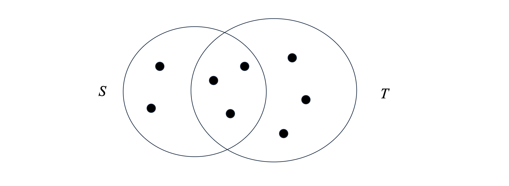

# 1. 문서의 $k$-Shingling (k-Shingling of Documents)

 *유사한 문서를 찾기 위해서는 먼저 길고 복잡한 텍스트 문서를 수학적으로 비교 가능한 형태, 즉 **"집합(Set)"**으로 변환해야 합니다. 이를 위해 사용하는 기법이 바로 **$k$-싱글링($k$-Shingling)**입니다.

## 1.1 개념과 예시
* $k$-Shingling은 하나의 문서를 길이가 $k$인 짧은 문자열(부분 문자열)들의 집합으로 표현하는 방법입니다. 이 집합에 포함된 각각의 길이 $k$짜리 문자열을 "싱글(shingle)"이라고 부릅니다. 

* 간단한 예시를 들어보겠습니다. "abcdabd"라는 문자열이 있고 $k=2$로 설정했다면, 이 문서의 2-shingles 집합은 다음과 같이 구성됩니다.
  * 1~2번째 글자: "ab"
  * 2~3번째 글자: "bc"
  * 3~4번째 글자: "cd"
  * 4~5번째 글자: "da"
  * 5~6번째 글자: "ab" (이미 집합에 있으므로 중복 제거)
  * 6~7번째 글자: "bd"
* **결과 집합:** {ab, bc, cd, da, bd}

* 이러한 방식은 단어의 의미적 유사성보다는, 어휘적(lexical) 패턴이 얼마나 겹치는지, 즉 문자가 얼마나 똑같이 쓰였는지를 식별하는 데 매우 효과적입니다. 

## 1.2 공백(Whitespace) 처리 전략
* 실제 텍스트 문서를 다룰 때는 띄어쓰기(blank), 탭(tab), 줄바꿈(newline) 등의 공백 문자를 어떻게 처리할지가 중요합니다. 일반적으로는 **연속된 모든 공백 문자를 단일 공백(single blank) 하나로 치환**하는 전처리 과정을 거쳐 노이즈를 줄입니다.

* **예시 ($k=9$):** "The plane was ready for touch down"이라는 문장을 9-shingle로 나누면 다음과 같은 집합이 만들어집니다.
  * "The plane", "he plane ", "e plane w", " plane wa", "plane was", "lane was ", "ane was r", "ne was re" 등.

---

# 2. 자카드 유사도 (Jaccard Similarity)

* 문서를 $k$-shingle들의 집합으로 변환했다면, 이제 두 집합이 얼마나 비슷한지 측정할 지표가 필요합니다. 이 때 가장 널리 쓰이는 척도가 바로 **자카드 유사도(Jaccard Similarity)**입니다.

## 2.1 자카드 유사도의 정의
* 자카드 유사도는 두 집합의 합집합 크기에 대한 교집합 크기의 비율로 정의됩니다. 즉, 두 집합이 가진 전체 고유 원소들 중에서, 공통으로 가지고 있는 원소가 차지하는 비중을 의미합니다. 수식으로는 다음과 같이 표현합니다.
$$J(S, T) = \frac{|S \cap T|}{|S \cup T|}$$
  * 여기서 $S$와 $T$는 비교하고자 하는 두 집합이며, $| \cdot |$는 집합의 크기(원소의 개수)를 나타냅니다.

## 2.2 직관적인 예시

* 위 그림의 예시를 수식에 적용해 보겠습니다.
  * 두 집합이 공유하는 원소(교집합)의 개수: $|S \cap T| = 3$
  * 두 집합에 있는 전체 고유 원소(합집합)의 개수: $|S \cup T| = 2(\text{S 전용}) + 3(\text{공통}) + 3(\text{T 전용}) = 8$
  * 따라서 자카드 유사도 $sim(S,T) = 3/8$ 이 됩니다.

---

# 3. 토큰으로서의 Shingles (Shingles as Tokens)

* $k$값을 크게 잡으면(예: $k=9$) shingle 문자열 자체가 길어져서 메모리를 많이 차지하게 됩니다. 이를 해결하기 위해 긴 문자열을 짧은 정수(Integer) 형태의 **토큰(Token)**으로 해싱(Hashing)하는 기법을 사용합니다.

## 3.1 9-Shingle 해싱 vs 4-Shingle 직접 사용
* 예를 들어 shingle을 4바이트(32비트) 정수로 해싱한다고 가정해 봅시다. 
* 그렇다면 애초에 "4-shingle을 써서 바로 4바이트 문자로 취급하면 되지 않을까?"라는 의문이 들 수 있습니다. 하지만 **9-shingle을 만들어서 4바이트로 해싱하는 것**이 훨씬 더 좋은 결과를 가져옵니다. 그 이유는 다음과 같습니다.
  * 1.  **희소성 (Sparsity):** 실제 텍스트 문서에서 가능한 4글자 조합의 대부분은 잘 등장하지 않습니다. 
  * 2.  **공간 낭비:** 따라서 고유한 4-shingle의 개수는 4바이트가 표현할 수 있는 최대 공간인 $2^{32}$개에 한참 못 미치게 됩니다 ($\ll 2^{32}$).
  * 3.  **효율성:** 반면, 길이가 더 긴 9-shingle을 추출한 뒤 이를 4바이트로 해싱(hash down)하면, 4바이트 공간의 거의 모든 해시값을 골고루 활용할 수 있어 해시 충돌(Collision)을 줄이고 데이터를 더 조밀하고 효과적으로 표현할 수 있습니다.

* 결과적으로 문서는 더 이상 문자열 집합이 아니라, 해시 함수를 통과한 **버킷 인덱스(정수)들의 집합**으로 표현됩니다.

---

# 4. 집합의 행렬 표현 (Matrix Representation of Sets)

* 이제 문서를 토큰 집합으로 만들었으니, 이를 컴퓨터가 처리하기 쉬운 구조인 **특성 행렬(Characteristic Matrix)**로 표현해 봅시다.

## 4.1 특성 행렬의 구조
* **행(Rows):** 데이터셋에 존재하는 모든 고유한 원소(Element) 또는 토큰을 나타냅니다.
* **열(Columns):** 각각의 문서(Set)를 나타냅니다.
* **값:** 원소 $e$가 문서 집합 $S$에 포함되어 있다면 ($e \in S$), 행렬의 해당 행 $e$와 열 $S$가 교차하는 위치에 **1**을 기록합니다. 포함되어 있지 않다면 **0**을 기록합니다.

## 4.2 예제와 유사도 계산
* 강의 자료에 등장하는 간단한 특성 행렬 예시를 살펴보겠습니다.

| Row (Token) | Element (문자열) | 문서 $S_1$ | 문서 $S_2$ | 문서 $S_3$ |
| :--- | :--- | :---: | :---: | :---: |
| **0** | "The plane" | 1 | 0 | 0 |
| **1** | "The cow" | 0 | 0 | 1 |
| **2** | "Alice and" | 0 | 1 | 0 |
| **3** | "Roses are" | 1 | 0 | 1 |

* 이 행렬의 열(Column)들을 비교하면 두 문서 간의 자카드 유사도를 쉽게 계산할 수 있습니다. 
* 강의 슬라이드에 제시된 질문인 **$sim(S_1, S_3) = ?$** 를 계산해 봅시다.
  * 1.  **교집합 크기 ($|S_1 \cap S_3|$):** $S_1$과 $S_3$ 모두 1인 행의 개수. 행 3("Roses are")이 유일하므로 값은 1입니다.
  * 2.  **합집합 크기 ($|S_1 \cup S_3|$):** $S_1$이나 $S_3$ 중 적어도 하나가 1인 행의 개수. 행 0, 1, 3이 해당하므로 값은 3입니다.
  * 3.  **최종 계산:** 따라서 $sim(S_1, S_3) = \frac{1}{3}$ 이 됩니다.

## 4.3 주의사항 (Warning)
* 이 특성 행렬은 직관적인 이해를 돕기 위한 개념적 모델일 뿐, **실제 시스템에서 데이터를 저장하는 방식은 아닙니다**. 실제로는 행(전체 토큰의 수)의 개수가 수십억 개에 달하지만, 하나의 문서가 포함하는 토큰은 수천 개에 불과하므로 행렬의 대부분이 0으로 채워지는 **극단적인 희소성(Sparsity)** 문제가 발생하기 때문입니다. (이 문제를 해결하기 위해 다음 포스트에서 다룰 "Minhashing" 기법이 등장하게 됩니다.)