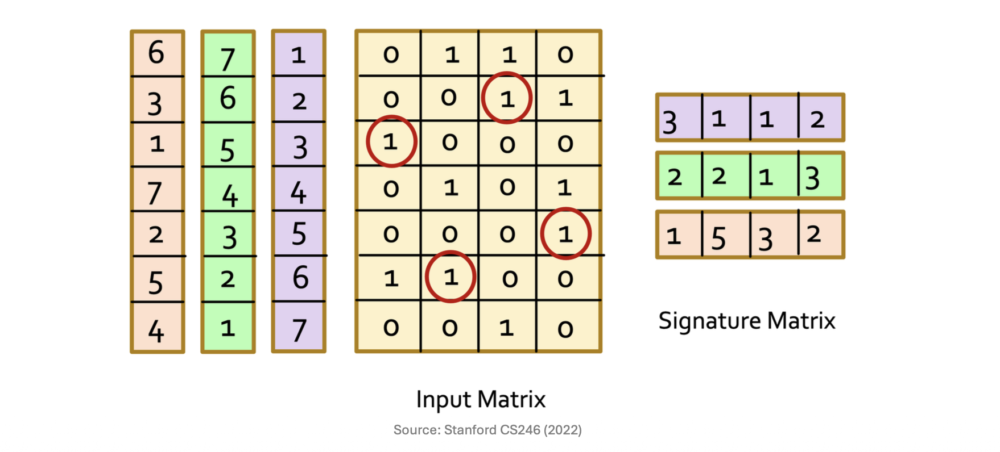

# 1. 유사도 보존 요약 (Similarity-Preserving Summaries)

* 이전 포스트에서 우리는 문서를 토큰들의 집합으로 만들고 이를 특성 행렬(Characteristic Matrix)로 표현했습니다. 하지만 수백만 개의 문서를 다룰 때, 이 특성 행렬은 크기가 너무 방대하고 극도로 희소(Sparse)해진다는 치명적인 문제가 발생합니다.

* 이 문제를 해결하기 위한 우리의 목표는 각각의 거대한 집합(열)을 훨씬 크기가 작은 표현 방식인 **서명(Signature)**으로 대체하는 것입니다. 서명을 사용하면 원본 집합을 직접 비교하지 않고도 두 서명을 비교하는 것만으로 자카드 유사도(Jaccard similarity)를 훌륭하게 추정할 수 있습니다. 

* 원칙적으로 생성된 서명의 길이가 길어질수록(즉, 더 많은 해시 함수를 사용할수록) 원본 유사도에 대한 추정의 정확도는 더욱 높아집니다. 예를 들어, 방대한 텍스트로 이루어진 "Magnitude 6.8 earthquake" 관련 기사를 단 세 개의 정수로 이루어진 `[110, 70, 93]`과 같은 짧은 서명 벡터로 압축하는 것이 바로 이 단계의 핵심입니다.

---

# 2. 민해싱(Minhashing) 알고리즘

* 거대한 특성 행렬로부터 이 "서명"을 만들어내는 기법을 **민해싱(Minhashing)**이라고 부릅니다. Minhashing은 행렬의 열(Column) 방향이 아닌, 행(Row) 방향에 무작위성을 부여하여 값을 추출합니다.

## 2.1 Minhashing의 작동 방식
* 알고리즘의 동작 과정은 다음과 같습니다.
  * 1. 특성 행렬의 전체 행(Rows)에 대해 여러 번의 **무작위 순열(Random permutations)**을 적용하여 행의 순서를 섞습니다.
  * 2. 각각의 무작위 순열이 적용된 상태에서, 각 열(집합)을 위에서 아래로 스캔합니다.
  * 3. 각 열에 대해 **처음으로 1이 등장하는 행의 인덱스(Index)**를 해당 열의 **Minhash 값**으로 정의합니다.

* 이렇게 여러 개의 무작위 순열(해시 함수)을 적용하여 얻은 Minhash 값들을 모아 행렬로 구성한 것을 **서명 행렬(Signature Matrix)**이라고 합니다. 이 서명 행렬에서 열(Columns)은 원본과 동일하게 각 문서 집합을 나타내지만, 행(Rows)은 적용한 순열(해시)의 개수만큼만 존재하게 됩니다. 결과적으로 서명 행렬은 원본 특성 행렬보다 크기가 훨씬 작아져 메모리 효율성이 극대화됩니다.

## 2.2 주의할 점 (Subtle Point)
* Minhash 값을 기록할 때, 순열이 적용된 상태에서의 **"새로운 행 번호(Permuted order)"**를 써야 하는지, 아니면 해당 행의 **"원래 행 번호(Original number)"**를 써야 하는지 헷갈릴 수 있습니다. 

* 결론부터 말씀드리면, **어느 것을 사용해도 상관없습니다**. 단지 어떤 방식을 택하든 일관성(Consistent)만 유지하면 됩니다. Minhashing이 정상적으로 작동하기 위한 유일한 조건은 "두 열(문서)이 순열 내에서 만나는 **최초의 1이 완전히 동일한 행에 위치할 때만** 같은 Minhash 값을 갖는다"는 사실이 보장되는 것이기 때문입니다.

---

# 3. Minhashing과 Jaccard 유사도의 관계 (핵심 증명)

* Minhashing이 데이터 마이닝에서 이토록 널리 쓰이는 이유는 다음과 같은 매우 놀라운 수학적 특성(Surprising property)을 가지고 있기 때문입니다.

> **정리:** 두 집합에 대해 Minhash 값이 일치할 확률은 두 집합의 Jaccard 유사도와 정확히 일치한다.
> $$P(h(S_1) = h(S_2)) = Jaccard(S_1, S_2)$$

## 3.1 수학적 증명 (Proof)
* 임의의 두 열(문서) $S_1$과 $S_2$를 비교할 때, 특성 행렬의 모든 행은 다음 세 가지 유형 중 하나로 분류할 수 있습니다.
  * **Type X:** 두 열 모두에서 값이 `1`인 행.
  * **Type Y:** 한 열은 `1`, 다른 열은 `0`인 행 (또는 그 반대).
  * **Type Z:** 두 열 모두에서 값이 `0`인 행.

* Type X에 해당하는 행의 개수를 $x$, Type Y에 해당하는 행의 개수를 $y$라고 가정해 봅시다. 
자카드 유사도는 "합집합에 대한 교집합의 비율"입니다. Type Z는 두 문서 어디에도 없는 토큰이므로 합집합과 교집합 계산에서 모두 제외됩니다. 따라서 두 문서의 **실제 Jaccard 유사도는 $x / (x + y)$**가 됩니다.

* 이제 Minhash 값이 일치할 확률을 계산해 봅시다. 
* 무작위로 행의 순서를 섞은 뒤 위에서부터 스캔하여 처음으로 1을 만나는 순간을 생각해 보세요. Minhash 값이 같으려면, 처음 만나는 1이 "둘 다 1을 가진" Type X 행이어야 합니다. 만약 Type Y 행을 먼저 만난다면, 하나는 1이고 다른 하나는 0이므로 두 열의 Minhash 값은 달라지게 됩니다. 

* 즉, $P(h(S_1) = h(S_2))$는 무작위 스캔 중에 **Type Y 행보다 Type X 행을 먼저 만날 확률**과 같습니다. 무작위 순열이므로 총 $x + y$개의 행이 첫 번째로 등장할 확률은 모두 동일합니다. 따라서 전체 $x + y$개의 행 중에서 Type X 행($x$개)이 제일 먼저 뽑힐 확률은 Jaccard 유사도와 동일한 **$x / (x + y)$**가 됩니다.

---

# 4. 서명 유사도 (Similarity of Signatures)

* 위의 증명에 따라, 생성된 서명(Signatures) 간의 유사도를 구하면 원본 집합의 Jaccard 유사도를 근사할 수 있습니다.
  * **서명 유사도:** 두 서명 벡터를 비교하여 **동일한 값을 가지는 행의 비율(Fraction of the same rows)**을 계산합니다.
  * 두 서명의 유사도에 대한 기댓값(Expected similarity)은 그 서명들이 나타내는 원본 집합 간의 Jaccard 유사도와 같습니다.

## 4.1 실제 예제 비교 (Example)
* 강의 자료에 등장하는 행렬을 통해 원본 Jaccard 유사도와 서명 유사도를 직접 비교해 봅시다.

| 비교 대상 (Columns) | 원본 Jaccard 유사도 | 서명 유사도 (Signature Sim) |
| :--- | :--- | :--- |
| **Col 1 & Col 2** | $1/4$  | $1/3$  |
| **Col 2 & Col 3** | $1/5$  | $1/3$  |
| **Col 3 & Col 4** | $1/5$  | $0$  |

* 단 3개의 순열만 사용하여 서명을 만들었기 때문에, $1/4 \approx 1/3$, $1/5 \approx 0$ 처럼 약간의 오차(Error)가 존재함을 볼 수 있습니다. 하지만 이는 표본이 작기 때문이며, 통계학의 대수의 법칙에 따라 **서명의 길이(해시 함수의 개수)를 늘릴수록 기대 오차는 작아지며** 원본 Jaccard 유사도에 수렴하게 됩니다.