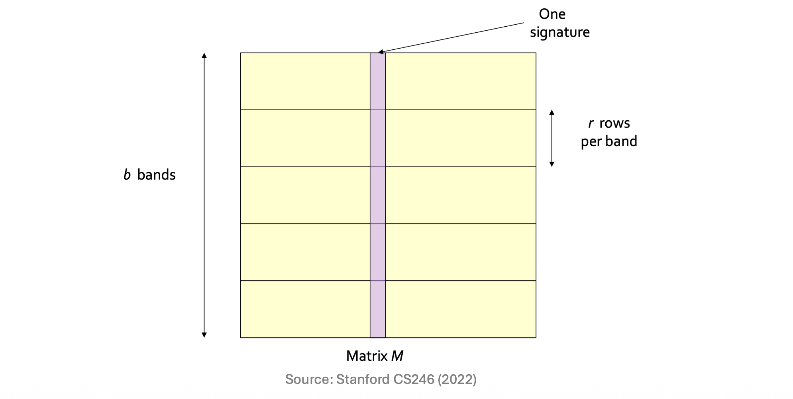
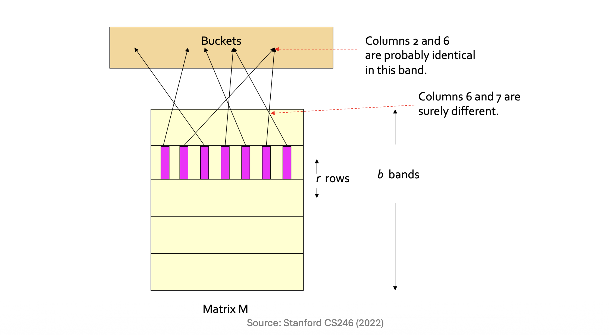

# 1. Introduction: 왜 LSH가 필요한가?

* 대규모 텍스트 데이터나 문서들을 다룰 때, 두 문서 간의 유사도를 빠르게 계산하기 위해 미니해싱(Minhashing)을 사용합니다. 하지만 미니해싱 서명(Signature)을 얻었다고 해서 모든 문제가 해결되는 것은 아닙니다. **비교해야 할 문서 쌍(Pairs)의 수 자체는 여전히 $O(N^2)$로 방대하기 때문입니다**. 

* 간단한 사고 실험을 해봅시다. 100만(1M) 개의 문서가 있고, 두 문서의 서명을 비교하는 데 단 $1\mu s$(마이크로초)가 걸린다고 가정해 보겠습니다. 
* 문서 쌍의 개수는 약 $\frac{1,000,000 \times 999,999}{2} \approx 5 \times 10^{11}$ 개이며, 이 모든 유사도를 단순히 계산하는 데만 무려 **6일**이 소요됩니다. 문서가 1,000만 개라면 수백 년이 걸릴 수도 있는 문제입니다.

* 이러한 연산 비용의 병목을 해결하기 위해 등장한 개념이 바로 **Locality-Sensitive Hashing (LSH)** 입니다. LSH의 핵심 철학은 모든 쌍을 비교하는 대신, **"유사할 가능성이 높은 쌍(Candidate pairs)만 추려내어 비교하자"**는 것입니다.

# 2. Core Concepts: 서명에서 버킷으로 (From Signatures to Buckets)

* LSH는 미니해싱된 서명 행렬을 여러 번 해싱(Hashing)하는 방식을 취합니다. 이미 미니해싱의 성질을 통해, **유사한 문서일수록 동일한 서명(Signature) 값을 더 많이 공유**한다는 것을 알고 있습니다. 

* LSH는 전체 서명을 한 번에 비교하지 않고, **서명의 일부(Subset)만을 사용하여 여러 해시 함수에 통과**시킵니다. 이 과정에서 **어느 한 번이라도 동일한 해시 버킷(Bucket)에 떨어지는 문서 쌍이 있다면, 이들을 "후보 쌍(Candidate Pair)"으로 간주**합니다.

* 물론 해시 충돌이나 확률적 특성으로 인해 두 가지 오류가 발생할 수 있습니다.
  * **거짓 양성 (False Positives):** 실제로는 유사하지 않은데 우연히 같은 버킷에 해싱되어 후보 쌍으로 묶이는 경우.
  * **거짓 음성 (False Negatives):** 실제로는 매우 유사한데 모든 해싱 과정에서 다른 버킷에 떨어져 후보 쌍에서 누락되는 경우.

* LSH의 목표는 매개변수를 스마트하게 조절하여, **거짓 음성을 0에 가깝게 만들면서 동시에 거짓 양성을 최대한 줄이는 것**입니다.

# 3. Mathematical Formulation: 대역 분할 기법 (Partition into Bands)

* 이 목표를 달성하기 위한 LSH의 대표적인 테크닉이 바로 **대역(Bands) 분할 기법**입니다.

* 행렬 $M$(각 열이 문서의 미니해시 서명인 행렬)이 주어졌을 때 다음과 같이 구조화합니다:
  * 1.  전체 행렬 $M$을 $b$개의 대역(Bands)으로 나눕니다.
  * 2.  각 대역은 $r$개의 행(Rows)을 가집니다. (즉, 전체 서명의 길이 = $b \times r$)
  * 3.  각 대역별로 열의 부분 벡터($r$개의 원소)를 매우 큰 크기 $k$를 가진 해시 테이블에 해싱합니다.
    * 충돌을 최소화하기 위해 $k$는 최대한 크게 설정하고, 대역마다 독립적인 해시 테이블을 사용합니다.)

* 만약 어떤 두 문서가 **$b$개의 대역 중 단 1개( $\ge 1$ )의 대역에서라도 같은 버킷으로 해싱된다면**, 두 문서는 유사도 계산을 위한 **후보 쌍(Candidate pair)**이 됩니다. $b$와 $r$ 값을 어떻게 조율(Tune)하느냐에 따라 필터링의 엄격함이 결정됩니다.

# 4. Detailed Derivations: 확률 모델링

* 이 대역 분할 구조가 수학적으로 어떻게 작동하는지 단계별 확률을 통해 유도해 보겠습니다.
* 두 문서 사이의 실제 유사도(자카드 유사도)를 $s$ 라고 정의합시다. ( $0 \le s \le 1$ )
* 1.  **하나의 행(Row)에서 서명이 일치할 확률:**
    * 미니해싱의 기본 성질에 의해, 두 문서의 특정 행 서명이 일치할 확률은 두 문서의 자카드 유사도인 $s$와 같습니다.
* 2.  **특정 1개의 대역(Band) 전체에서 서명이 모두 일치할 확률:**
    * 하나의 대역은 $r$개의 행으로 구성되어 있습니다. 각 행의 해시값이 독립적이라고 가정할 때, $r$개 행이 **모두** 일치할 확률은 다음과 같습니다.
    $$P(\text{match in one band}) = s^r$$
* 3.  **특정 1개의 대역에서 서명이 일치하지 않을 확률:**
    * 적어도 하나의 행이라도 서명이 다를 확률입니다.
    $$P(\text{no match in one band}) = 1 - s^r$$
* 4.  **모든 $b$개의 대역에서 서명이 한 번도 일치하지 않을 확률:**
    * 두 문서가 모든 대역에서 해시 값이 어긋나 후보 쌍으로 채택되지 못할 확률입니다.
    $$P(\text{no match in all } b \text{ bands}) = (1 - s^r)^b$$
* 5.  **최소 1개의 대역에서 서명이 일치할 확률 (최종 후보 쌍이 될 확률):**
    * 전체 확률 1에서 "모든 대역에서 일치하지 않을 확률"을 빼면, 두 문서가 LSH를 통과하여 후보 쌍이 될 최종 확률이 도출됩니다.
    $$P(\text{candidate}) = 1 - (1 - s^r)^b$$

* 이 식은 LSH의 본질을 관통하는 $S\text{-Curve}$ 방정식이며, $b$와 $r$을 조절하여 임계값(Threshold)을 디자인하는 핵심이 됩니다.

# 5. Interpretation and Intuition: 실전 예제

* 수식이 실제로 어떻게 극적인 연산량 감소를 가져오는지 구체적인 숫자로 확인해 보겠습니다.
  * 데이터셋: 문서 100,000개 ($100,000 \text{ documents}$) 
  * 전체 비교 쌍 수: 약 50억 쌍 ($5,000,000,000 \text{ pairs}$) 
  * 서명 길이: 100개 ($100 \text{ signatures}$) 
  * **분할 설정:** $b = 20 \text{ bands}$, $r = 5 \text{ rows per band}$ ($20 \times 5 = 100$) 
  * **목표:** 유사도가 80% 이상인 문서 쌍 찾기 

* 이 설정에서 거짓 양성과 거짓 음성이 어떻게 제어되는지 살펴봅시다.

### 거짓 양성 (False Positives) 방어력
* 만약 두 문서의 실제 유사도가 $s = 0.4$ (40% 유사함, 즉 목표인 80%에 미달하는 음성 데이터)라면?
  * 특정 1개 대역에서 서명이 모두 우연히 일치할 확률: $(0.4)^5 = 0.01024 \approx 0.01$ (약 1%) 
  * 최소 1개 이상의 대역에서 일치하여 **후보가 될 확률**: $1 - (1 - 0.01)^{20} \approx 1 - 0.8179 = 0.182$ (약 18.2%) 

* **해석:** 40% 밖에 유사하지 않은 문서 쌍 중 후보로 잘못 올라오는 비율은 20% 미만입니다. 즉, **불필요한 비교 연산의 80% 이상을 잘라낼 수 있습니다!** 

### 거짓 음성 (False Negatives) 예방력
* 만약 두 문서의 실제 유사도가 $s = 0.8$ (80% 유사함, 반드시 찾아야 하는 양성 데이터)라면?
  * 특정 1개 대역에서 일치할 확률: $(0.8)^5 = 0.32768 \approx 0.328$ (약 32.8%) 
  * 20개 대역에서 **단 한 번도 일치하지 않아 누락될 확률**: $(1 - 0.328)^{20} = (0.672)^{20} \approx 0.00035$ (약 0.035%) 

* **해석:** 80% 유사한 문서 쌍을 실수로 놓칠 확률은 약 $\frac{1}{3000}$ 수준에 불과합니다. **사실상 거의 모든 긍정 쌍(Positive pairs)을 완벽하게 찾아낼 수 있습니다.** 

# 6. Summary

* 미니해싱은 두 문서 간의 유사도를 추정하는 훌륭한 방법이지만, $O(N^2)$이라는 거대한 탐색 공간 자체를 줄여주지는 못합니다. 
* Locality-Sensitive Hashing (LSH)은 **대역(Bands) 분할과 확률적 해싱 메커니즘**을 통해, 전체 쌍을 모두 비교하지 않고도 유사할 확률이 높은 타겟 문서 쌍만을 효과적으로 필터링해 냅니다. LSH 수식 $1 - (1 - s^r)^b$를 이해하고 $b$와 $r$ 값을 적절히 튜닝함으로써, 시스템의 거짓 양성과 거짓 음성을 우리의 목적에 맞게 정교하게 제어할 수 있습니다.