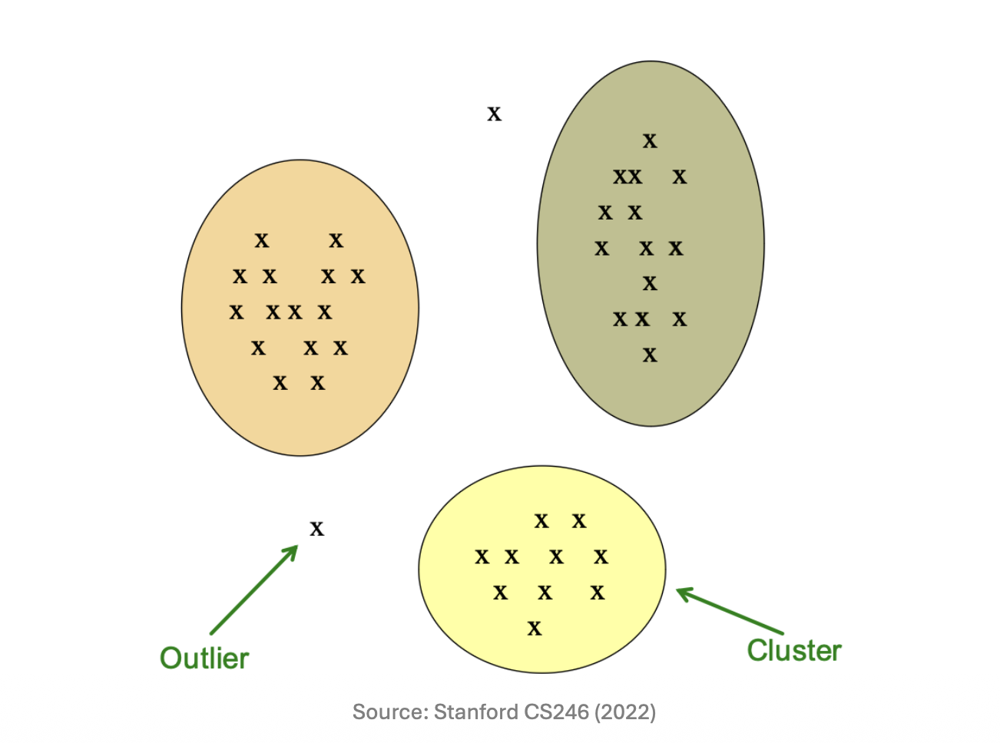
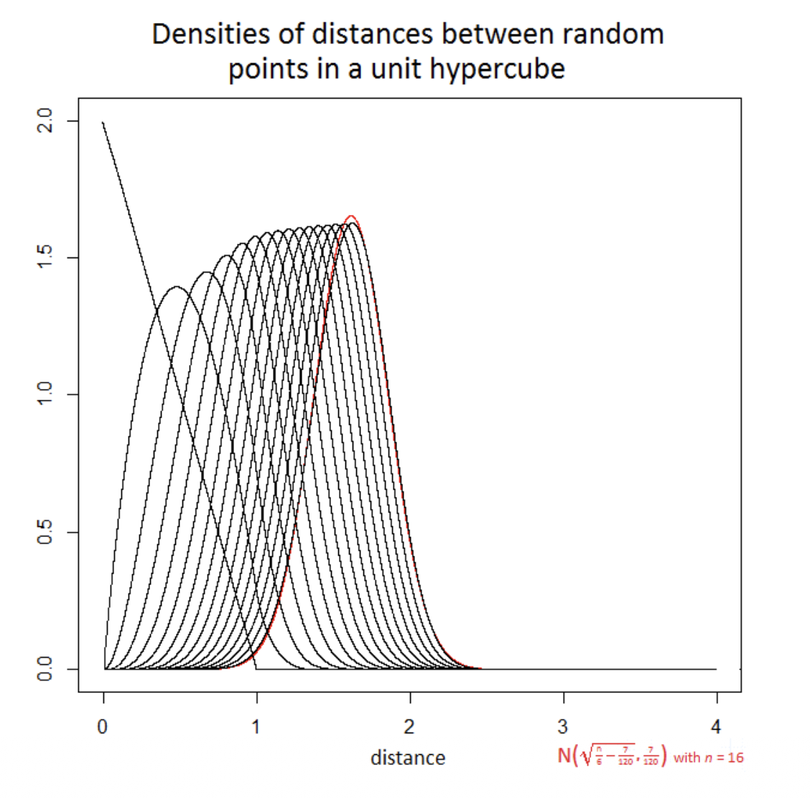
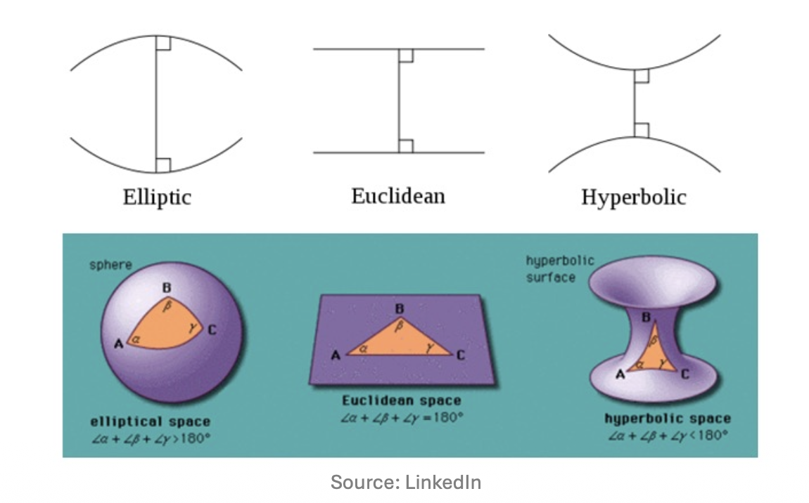

# 1. Introduction to Clustering

* **클러스터링(Clustering)**은 주어진 데이터 포인트들의 집합을 여러 개의 의미 있는 그룹(Cluster)으로 묶는 과정입니다. 성공적인 클러스터링의 핵심은 두 가지 조건을 만족하는 것입니다:
  * 1. **Intra-cluster similarity**: 같은 클러스터에 속한 데이터 포인트들은 서로 높은 유사성을 가져야 합니다 (가깝게 위치해야 함).
  * 2. **Inter-cluster dissimilarity**: 서로 다른 클러스터에 속한 데이터 포인트들은 확연히 달라야 합니다.

 

* 특히 현대의 데이터 마이닝 환경에서 우리가 다루는 데이터는 매우 방대하고(Large scale) , 수많은 변수를 포함하는 고차원(High-dimensional) 데이터이며 , 때로는 유클리드 공간으로 정의할 수 없는 비유클리드(Non-Euclidean) 공간에 존재하기도 합니다. 따라서 데이터를 어떻게 묶을 것인가를 논하기 전에, 데이터 간의 **유사성(Similarity)** 혹은 **거리(Distance)**를 어떻게 정의할 것인지가 매우 중요합니다.

# 2. Distance Measures in Euclidean Space

* 유클리드 공간 내에서 두 점의 거리를 측정하는 방법은 다양하며, 문제의 특성에 따라 적절한 거리 척도를 선택해야 합니다. 유효한 거리 척도가 되기 위해서는 비음성(Non-negativity), 동일성(Identity), 대칭성(Symmetry), 삼각 부등식(Triangle Inequality)이라는 4가지 수학적 조건을 만족해야 합니다.

* 대표적인 유클리드 공간의 거리 척도는 다음과 같습니다:
  * **Euclidean Distance (L2 Norm)**: 가장 직관적인 직선거리입니다.
    $$d_{L2}(x, y) = \sqrt{\sum_{i}(x_{i}-y_{i})^{2}}$$ 
  * **Manhattan Distance (L1 Norm)**: 각 축을 따라 이동하는 거리의 합으로, 격자 형태의 공간에서 유용합니다.
    $$d_{L1}(x, y) = \sum_{i}|x_{i}-y_{i}|$$ 
  * **L0 Distance**: 두 벡터에서 서로 값이 다른 차원의 개수를 셉니다 (강의 자료의 $x_y$는 문맥상 $y_i$의 오타로 해석됩니다). 이는 범주형 데이터나 희소 벡터의 해밍 거리(Hamming Distance)와 유사한 개념입니다.
    $$d_{L0}(x, y) = \sum_{i} \mathbb{I}(x_{i} \ne y_{i})$$ 
  * **L-Infinity Distance (Chebyshev Distance)**: 각 차원별 차이 중 가장 큰 값을 거리로 정의합니다.
    $$d_{L\infty}(x, y) = \max_{i}|x_{i}-y_{i}|$$ 

# 3. Document Clustering and Similarity Representation

* 문서(Document) 데이터를 군집화하는 상황을 가정해 보겠습니다. 문서는 텍스트의 집합이므로 이를 수학적 벡터로 변환하는 과정이 필요합니다. 가장 단순한 형태는 단어 사전에 있는 $i$번째 단어가 문서에 등장하면 $x_i = 1$, 그렇지 않으면 $0$으로 표기하는 이진 벡터 구조입니다. 

* 이러한 벡터화의 기본 아이디어는 "유사한 단어들을 공유하는 문서들은 동일한 주제(Topic)를 다루고 있을 것"이라는 가정에서 출발합니다. 여기서 주의할 점은, 우리의 목적이 단순히 "가장 비슷한 문서 쌍"을 찾는 것이 아니라, 문서들의 거시적인 **군집(Clusters)**을 형성하는 것이라는 점입니다.

* 문서를 어떻게 바라보느냐에 따라 사용하는 거리 척도도 달라집니다:
  * 문서를 **벡터(Vectors)**로 간주할 때: 벡터 간의 각도를 통해 유사도를 측정하는 **Cosine distance**를 사용합니다.
  * 문서를 단어들의 **집합(Sets)**으로 간주할 때: 교집합과 합집합의 비율을 활용하는 **Jaccard distance**를 사용합니다.
  * 문서를 공간 상의 **점(Points)**으로 간주할 때: 물리적 거리를 측정하는 **Euclidean distance**를 사용합니다.

# 4. The Curse of Dimensionality

* 데이터의 차원이 낮을 때(예: 개의 키와 몸무게라는 2차원 데이터)는 시각적으로 클러스터를 식별하기가 매우 쉽습니다. 하지만 차원이 높아지면 **차원의 저주(The Curse of Dimensionality)**라는 치명적인 문제에 직면하게 됩니다.

* 차원의 저주가 군집화에 미치는 가장 큰 악영향은 **"고차원 공간에서는 거의 모든 점의 쌍이 서로 동일하게 멀리 떨어져 있게 된다"**는 현상입니다. 거리에 따른 변별력이 사라지면 군집화를 수행할 수 없습니다.

* 이를 직관적으로 이해하기 위해 $n$차원 단위 하이퍼큐브(Unit hypercube, $[0,1]^n$) 내에서 무작위로 추출한 두 점을 생각해 봅시다.
* 이 공간에서 가능한 두 점 사이의 최대 거리(대각선)는 $\sqrt{n}$입니다. 하지만 $n \rightarrow \infty$로 갈수록, 두 점 사이의 거리의 분산은 상수로 수렴하게 됩니다.

* 예를 들어 차원이 $n = 2500$인 경우를 살펴보겠습니다.
* 이론적으로 거리는 $[0, \sqrt{2500}) = [0, 50)$의 범위를 가질 수 있습니다. 
* 그러나 실제 두 점 간 거리의 분포를 보면 놀랍게도 대부분의 거리가 $(20, 21)$ 구간에 극도로 밀집되어 나타납니다. 

* *(이유: 통계학적으로 두 난수의 차이의 제곱 기댓값은 1/6이며, 2500차원에서의 유클리드 거리의 제곱 기댓값은 2500/6 $\approx$ 416.67입니다. 이의 제곱근은 약 20.4가 되며, 중심극한정리에 의해 분산이 매우 작아져 이 값 근처에 데이터가 몰리게 됩니다.)*

 

# 5. Clustering Strategies: Approaches and Spaces
* 클러스터링은 데이터를 탐색하는 전략과 데이터가 존재하는 공간의 성질에 따라 다르게 접근해야 합니다. 

## 5.1 Hierarchical vs. Point-Assignment
* 클러스터링 알고리즘은 크게 두 가지 범주로 나눌 수 있습니다.
  * 1. **Hierarchical (계층적 군집화)** 
     * **Agglomerative (Bottom-up)**: 처음에는 각 점 하나하나를 개별 클러스터로 취급하다가, 가장 가까운 클러스터들을 반복적으로 병합해 나가는 방식입니다.
     * **Divisive (Top-down)**: 모든 데이터가 포함된 하나의 거대한 클러스터에서 시작하여, 재귀적으로 분할해 나가는 방식입니다.
  * 2. **Point Assignment (점 할당 군집화)** 
     * K-means와 같이 먼저 클러스터 집합(Centroid 등)을 유지하고, 각 포인트들을 가장 가까운 클러스터에 할당하는 방식입니다.

* 이 두 전략은 데이터의 형태에 따라 성능 차이를 보입니다. Point assignment 방식은 클러스터가 둥글고 예쁜 형태(Nice shapes)일 때 효율적입니다. 반면, 동심원 구조나 구불구불한 형태처럼 기하학적으로 복잡한(Weird shapes) 군집의 경우 중심점 기반 할당은 실패하며, 이때는 Hierarchical 방식이 훨씬 우수한 결과를 냅니다.

 

## 5.2 Euclidean vs. Non-Euclidean Space
* 공간의 성질 또한 알고리즘 선택에 영향을 줍니다.
  * **Euclidean Space**: 데이터가 실수 좌표계에 존재하므로 공간적 "위치"라는 개념이 존재하며, 여러 점들의 평균을 내어 "중심점(Centroid)"을 계산하는 것이 가능합니다. 거리 척도로는 L1, L2 Norm 등을 사용합니다.
  * **Non-Euclidean Space**: 기하학적 유클리드 공간이 아니므로 물리적인 "위치"나 점들의 "중심(Centroid)"이라는 개념을 정의하기 어렵습니다. 예를 들어 구면(Sphere) 위에서 세 점의 단순 산술 평균을 구하면, 그 결과 좌표는 구 표면이 아닌 구 내부의 허공을 가리키게 됩니다. 따라서 이 경우 점들의 집합을 요약하는 다른 방식(예: Medoid 등)이 필요하며, 거리 척도 역시 Jaccard, Hamming, Cosine 등을 사용해야 합니다.

 

# 6. Scalability: Memory Limitations

* 마지막으로 클러스터링 알고리즘은 다루는 데이터의 크기에 따라 두 가지 상황으로 분류됩니다.
  * **In-memory clustering**: 모든 데이터가 RAM(메모리)에 올라갈 수 있을 정도로 작을 때 사용합니다. K-means 알고리즘이 대표적인 예입니다.
  * **Large-data clustering**: 데이터가 너무 방대하여 메모리에 한 번에 올릴 수 없는 경우, 데이터를 배치(Batch) 단위로 나누어 로드합니다. 각 배치를 메모리에서 군집화한 뒤 전체 데이터가 아닌 **"클러스터의 요약 정보(Summaries of clusters)"**만을 메모리에 유지하는 방식으로 확장성을 확보합니다. 대표적으로 BFR과 CURE 알고리즘이 이에 해당합니다.