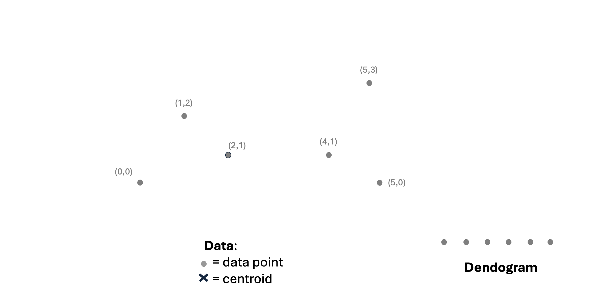
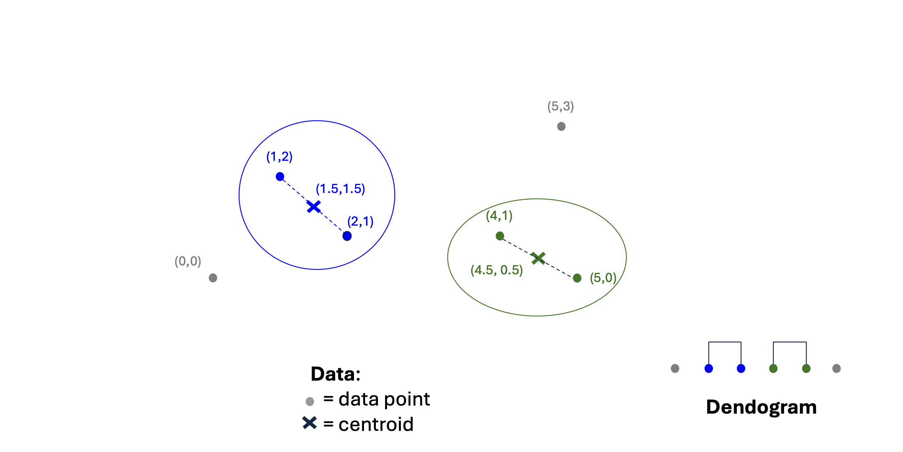
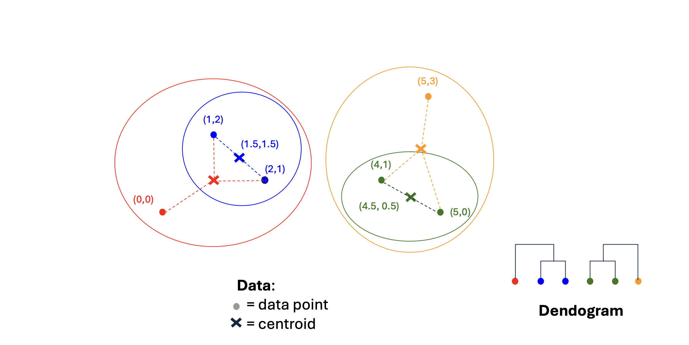
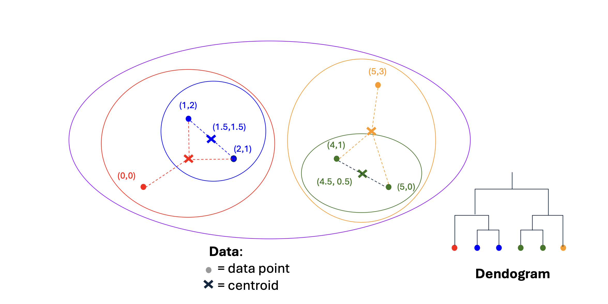

# 1. Introduction to Hierarchical Clustering

* 이전 포스트에서 우리는 클러스터링의 기본 개념과 데이터가 위치한 공간(유클리드 vs. 비유클리드)의 특성을 살펴보았습니다. 이번 포스트에서는 대표적인 군집화 기법 중 하나인 **계층적 군집화(Hierarchical Clustering)**에 대해 깊이 있게 다루어 보겠습니다.

* 계층적 군집화의 핵심 연산은 매우 직관적입니다: **"가장 가까운(nearest) 두 클러스터를 반복적으로 병합(Merge)하는 것"**입니다. 이 단순한 아이디어를 실제 알고리즘으로 구현하기 위해서는 다음 세 가지 근본적인 질문에 답해야 합니다:
  * 1. **How to represent a cluster?**: 다수의 데이터 포인트로 이루어진 클러스터를 수학적/구조적으로 어떻게 "표현"할 것인가? 
  * 2. **How to determine the nearness of clusters?**: 두 클러스터 간의 "가까움(거리)"을 어떻게 정의하고 측정할 것인가? 
  * 3. **When to stop merging clusters?**: 클러스터를 하나로 합치는 과정을 언제 멈출 것인가? 

# 2. Hierarchical Clustering in Euclidean Space

* 데이터가 유클리드 공간에 존재할 때, 앞선 질문들에 대한 대답은 비교적 명확해집니다. 유클리드 공간은 기하학적인 위치와 평균 연산이 성립하기 때문입니다.

* **Cluster Representation (클러스터 표현)**: 여러 데이터 포인트를 하나로 요약하기 위해 클러스터 내 데이터 포인트들의 산술 평균인 **중심점(Centroid)**을 계산하여 클러스터의 "위치"로 사용합니다.
* **Nearness Measurement (군집 간 거리 측정)**: 두 클러스터 사이의 거리는 각 클러스터를 대변하는 **중심점 간의 거리(Distances between centroids)**로 정의합니다.
* 알고리즘은 매 단계마다 중심점 간 거리가 가장 짧은(최단 거리인) 두 클러스터를 찾아 병합합니다.

* 이러한 병합 과정은 시각적으로 **덴드로그램(Dendrogram)**이라는 트리 구조로 나타낼 수 있습니다.  하단부의 개별 데이터 포인트들(예: (0,0), (1,2) 등)이 서로 가까운 것들끼리 먼저 병합되어 새로운 중심점을 형성하고, 이 중심점들이 다시 상위 레벨에서 병합되는 과정을 한눈에 파악할 수 있습니다.

## Example: Step-by-Step Hierarchical Clustering

* 실제 데이터 포인트들을 통해 계층적 군집화(유클리드 공간, 중심점 기반 거리 측정)가 진행되는 과정을 단계별로 살펴보겠습니다. 

* 2차원 평면상에 6개의 데이터 포인트가 주어졌다고 가정해 봅시다: $(0,0), (1,2), (2,1), (4,1), (5,0), (5,3)$.

* **Step 1: 가장 가까운 두 점의 병합**
  * 모든 점들 사이의 유클리드 거리를 계산해 보면, 거리가 가장 짧은 점들의 쌍은 $(1,2)$와 $(2,1)$입니다. 이 두 점을 하나의 클러스터로 병합합니다.
  * 새로운 클러스터를 대표하는 중심점(Centroid)은 두 점의 평균인 $C_1 = (1.5, 1.5)$가 됩니다. 위 그림의 두 번째 도식에서 이 과정과 덴드로그램의 첫 연결을 확인할 수 있습니다.

* **Step 2: 다음으로 가까운 클러스터의 병합**
  * 남은 점들과 새로운 중심점 $C_1$ 간의 거리를 다시 계산합니다. 이번에는 $(4,1)$과 $(5,0)$ 사이의 거리가 가장 가깝습니다. 
  * 이 두 점을 새로운 클러스터로 묶고, 그 중심점인 $C_2 = (4.5, 0.5)$를 계산합니다. 이제 우리에게는 두 개의 클러스터($C_1, C_2$)와 아직 묶이지 않은 두 개의 개별 점 $(0,0), (5,3)$이 있습니다. 그림의 세 번째 도식에 해당합니다.

* **Step 3: 개별 점과 기존 클러스터의 병합**
  * 다시 거리를 계산해 보면, 점 $(0,0)$은 개별 점들과 묶이는 것보다 클러스터 $C_1(1.5, 1.5)$과 묶이는 것이 가장 가깝습니다. 따라서 이들을 병합하여 $(0,0), (1,2), (2,1)$ 세 점을 포함하는 더 큰 클러스터를 만들고 새로운 무게중심을 계산합니다.
  * 마찬가지로, 점 $(5,3)$은 클러스터 $C_2(4.5, 0.5)$와 가장 가까우므로 이들을 병합하여 또 다른 큰 클러스터를 형성합니다. 그림의 네 번째, 다섯 번째 도식 과정입니다.

* **Step 4: 최종 병합 (Root 형성)**
  * 이제 공간상에는 왼쪽의 큰 클러스터와 오른쪽의 큰 클러스터, 단 두 개만이 남았습니다. 마지막으로 이 두 클러스터의 중심점 사이 거리를 계산하고 하나로 병합하여 모든 데이터 포인트를 포함하는 단일 클러스터를 완성합니다.

* 이 예시는 거리를 계산하고, 가장 가까운 개체(점 또는 클러스터)를 찾고, 중심점을 갱신하여 묶어 나가는 상향식(Agglomerative) 접근법의 직관적인 흐름을 잘 보여줍니다.

# 3. Efficiency and Time Complexity

* 계층적 군집화의 계산 복잡도를 살펴보겠습니다. 

* 가장 기본적인 형태의 알고리즘(Basic algorithm)은 매 단계마다 존재하는 모든 클러스터 쌍(Pairs of clusters) 간의 거리를 계산해야 합니다. 
* 처음 데이터 포인트가 $n$개 있을 때, 거리 계산 횟수는 대략 $n^2$에 비례합니다. 두 클러스터가 병합되어 전체 개수가 $(n-1)$개가 되면 다시 $(n-1)^2$번의 계산이 필요합니다. 이를 끝까지 반복하면 총 연산량은 다음과 같은 급수의 형태를 띱니다:
$$\text{Total Operations} \approx n^2 + (n-1)^2 + (n-2)^2 + \dots + 1^2 \approx O(n^3)$$
* 따라서 **기본 알고리즘의 시간 복잡도는 $O(n^3)$**이 됩니다. 이는 데이터 세트가 커질 경우 매우 비효율적입니다.

* 이를 개선하기 위해 **우선순위 큐(Priority Queue)** 자료구조를 도입할 수 있습니다. 한 번 계산된 거리를 큐에 저장해두고 (우선순위를 부여하여 관리), 다음 단계에서 불필요하게 이전 거리를 다시 계산(re-computing)하는 과정을 방지하면 계산 효율이 크게 증가합니다. 이 최적화된 구현 방식을 사용하면 전체 알고리즘의 시간 복잡도를 **$O(n^2 \log n)$**으로 줄일 수 있습니다.

# 4. Hierarchical Clustering in Non-Euclidean Space

* 유클리드 공간과 달리, 비유클리드 공간에서는 평균을 통한 새로운 좌표 생성(Centroid)이 불가능합니다. 우리가 가리킬 수 있는 "위치(Locations)"라는 것은 오직 **데이터 세트 내에 실재하는 포인트들 자신뿐**입니다. 따라서 클러스터 표현과 거리 측정에 대해 다른 전략이 필요하며, 크게 3가지 접근법을 고려할 수 있습니다. *(참고로 이 접근법들은 유클리드 공간에서도 유효하게 사용할 수 있습니다 )*

## Approach 1: Clustroid (클러스트로이드)
* Centroid가 군집의 무게중심을 나타내는 가상의 점(Artificial point)이라면, **Clustroid(클러스트로이드)**는 클러스터 내의 **실재하는 데이터 포인트(Existing point)** 중 다른 모든 포인트들과 가장 "가까운" 점을 선정하여 대표로 삼는 방식입니다. 

* 여기서 "가장 가깝다"는 것의 기준은 다양하게 정의할 수 있습니다:
  * 다른 모든 포인트들까지의 **최대 거리(Maximum distance)가 가장 작은 점** 
  * 다른 모든 포인트들까지의 **평균 거리(Average distance)가 가장 작은 점** 

* 클러스터의 대표로 Clustroid가 정해지면, 군집 간의 거리는 이 Clustroid 사이의 거리로 취급(Treat clustroid as if it were centroid)하여 군집화를 진행합니다.

## Approach 2: Collection of Points & Pairwise Distance
* 두 번째 접근법은 클러스터를 단일 점(Centroid/Clustroid)으로 요약하지 않고, 그 자체를 포인트들의 집합(Collection of points)으로 취급하는 방식입니다. 군집 간 거리는 다음과 같이 점 쌍(Pairs of points) 간의 거리 통계량으로 정의합니다:
  * **Minimum Distance (Single Linkage)**: 각 클러스터에서 하나씩 점을 뽑아 만들 수 있는 쌍들 중 **가장 짧은 거리**.
  * **Average Distance (Average Linkage)**: 각 클러스터에서 하나씩 점을 뽑아 만든 모든 쌍의 **거리 평균**.

## Approach 3: Cohesion & Inverse Density
* 세 번째 접근법 역시 클러스터를 포인트들의 집합으로 보고, 두 클러스터를 합쳤을 때 그 결과물이 얼마나 **응집력(Cohesive)** 있는가를 기준으로 평가합니다. 합쳐진 클러스터의 응집력 지표(값이 작을수록 응집력이 높음)를 계산하여, 가장 응집력이 높은 두 군집을 병합합니다.

* 응집력을 정의하는 수치적 개념은 다음과 같습니다:
  * 1. **Diameter (지름)**: 병합된 클러스터 내에 속한 점들 사이의 거리 중 최대값.
  * 2. **Average distance**: 병합된 클러스터 내 모든 점들 사이의 거리 평균.
  * 3. **Inverse density (역밀도)**: 클러스터의 지름이나 평균 거리를 포함된 데이터 포인트의 수(Size)로 나눈 값. 넓은 공간에 적은 수의 데이터가 있으면 역밀도가 높아(응집력 낮음)집니다.

# 5. When to Stop Merging? (정지 조건)

* 단일 군집이 될 때까지 무작정 병합을 계속하면 클러스터링의 의미가 사라집니다. 실질적으로 유의미한 군집을 도출하기 위해 병합을 멈추는 기준점(Threshold)이 필요합니다. 
  * 1. **Threshold Exceedance**: 병합된 클러스터의 지름(Diameter)이 사전에 설정한 임계값을 초과하거나, 반대로 밀도(Density)가 특정 임계값 밑으로 떨어지면 병합을 중지합니다.
  * 2. **Evidence of a "Bad" Cluster**: 억지로 서로 다른 성질의 군집을 병합하려 할 때 나타나는 구조적 붕괴 현상을 감지합니다. 예를 들어, 두 클러스터를 합쳤을 때 이전 단계들에 비해 **평균 지름(Average diameter)이 갑작스럽게 크게 증가**한다면, 이는 이질적인 그룹이 섞였다는 증거이므로 그 직전 단계에서 병합을 멈춥니다.

# 6. Summary & Exercise (Pop Quiz Solution)

## **[문제]** 
* 다음 1차원 데이터 포인트들에 대해 계층적 군집화를 수행하시오: `1, 4, 9, 16, 25, 36`".
* 단, 두 클러스터 간의 거리는 **"두 클러스터에서 각각 점을 하나씩 골랐을 때 가능한 거리의 최대값(Maximum of distances)"**으로 정의합니다 ".

## **[단계별 풀이 과정]**

* **초기 상태**: 모든 점이 각각 하나의 클러스터입니다.
  * 군집 상태: `{1}, {4}, {9}, {16}, {25}, {36}`

* **Step 1**: 인접한 클러스터 간의 거리를 계산합니다.
  * $d(1, 4) = 3$
  * $d(4, 9) = 5$
  * $d(9, 16) = 7$
  * $d(16, 25) = 9$
  * $d(25, 36) = 11$
  * 가장 거리가 짧은 `{1}`과 `{4}`를 병합합니다 (거리: 3).
  * **현재 군집**: `{1, 4}, {9}, {16}, {25}, {36}`

* **Step 2**: 갱신된 군집들 사이의 거리를 계산합니다. 여기서 거리는 **최대값(Maximum)** 기준입니다.
  * $d(\{1, 4\}, \{9\}) = \max(|1-9|, |4-9|) = 8$
  * $d(\{9\}, \{16\}) = 7$
  * $d(\{16\}, \{25\}) = 9$
  * $d(\{25\}, \{36\}) = 11$
  * 가장 거리가 짧은 `{9}`와 `{16}`을 병합합니다 (거리: 7).
  * **현재 군집**: `{1, 4}, {9, 16}, {25}, {36}`

* **Step 3**: 다시 군집 간 최대 거리를 계산합니다.
  * $d(\{1, 4\}, \{9, 16\}) = \max(|1-16|) = 15$
  * $d(\{9, 16\}, \{25\}) = \max(|9-25|) = 16$
  * $d(\{25\}, \{36\}) = 11$
  * 가장 거리가 짧은 `{25}`와 `{36}`을 병합합니다 (거리: 11).
  * **현재 군집**: `{1, 4}, {9, 16}, {25, 36}`

* **Step 4**: 남은 세 군집 간의 최대 거리를 계산합니다.
  * $d(\{1, 4\}, \{9, 16\}) = 15$
  * $d(\{9, 16\}, \{25, 36\}) = \max(|9-36|) = 27$
  * 거리가 더 짧은 `{1, 4}`와 `{9, 16}`을 병합합니다 (거리: 15).
  * **현재 군집**: `{1, 4, 9, 16}, {25, 36}`

* **Step 5 (최종 병합)**: 남은 두 군집을 하나로 병합합니다.
  * $d(\{1, 4, 9, 16\}, \{25, 36\}) = \max(|1-36|) = 35$
  * **최종 군집**: `{1, 4, 9, 16, 25, 36}`

* 이처럼 Complete Linkage 방식은 군집 내에서 가장 멀리 떨어진 데이터 포인트 간의 거리를 기준으로 병합을 진행하므로, 결과적으로 형성된 군집의 지름(Diameter)을 통제하는 효과를 가집니다.