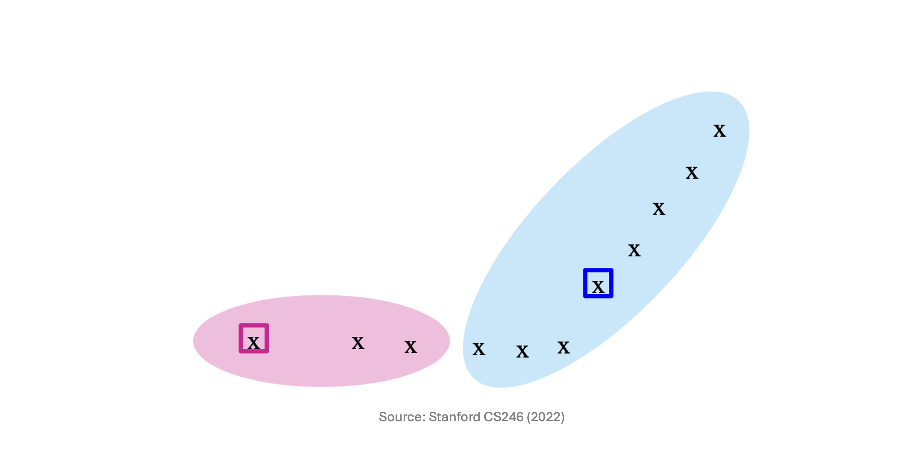
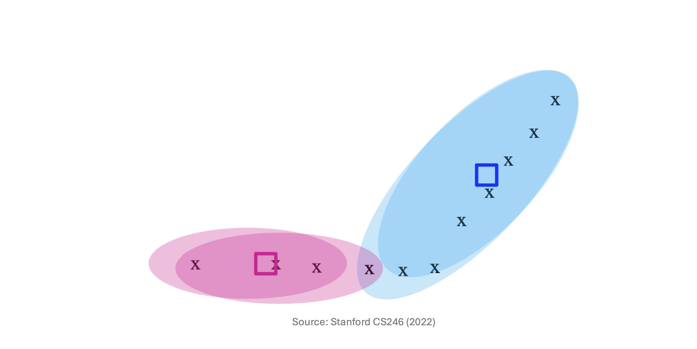
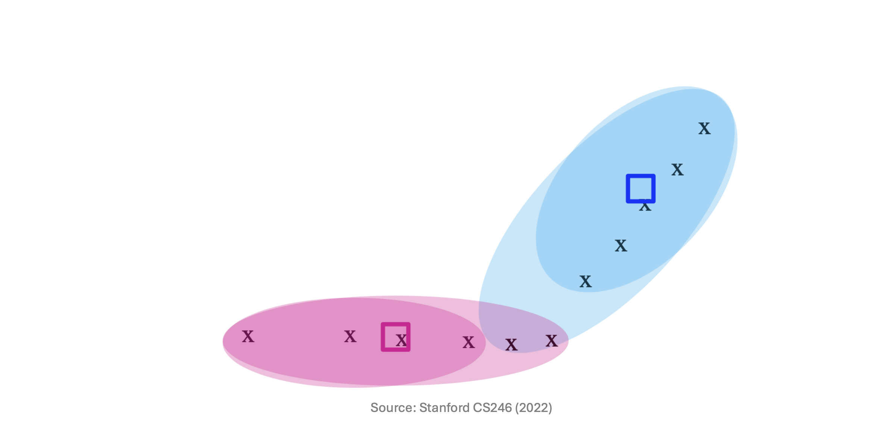
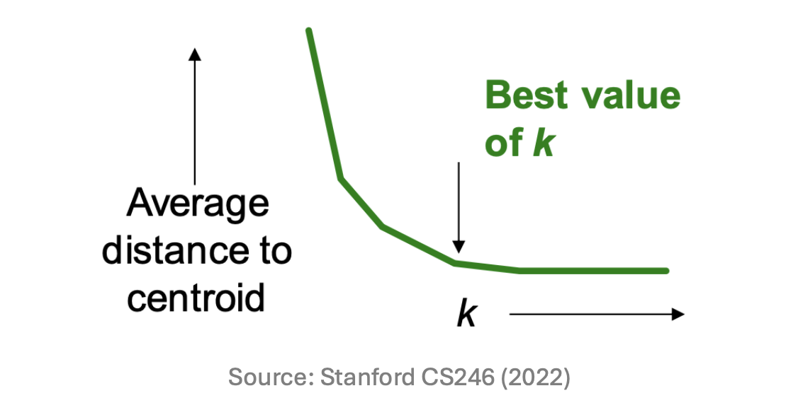
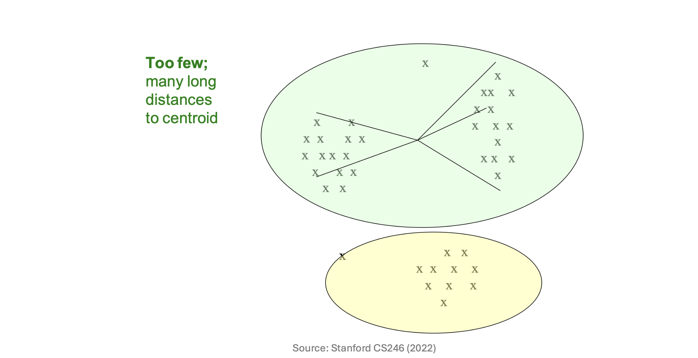
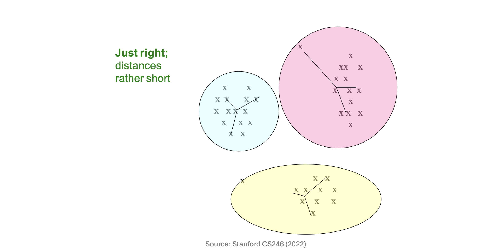
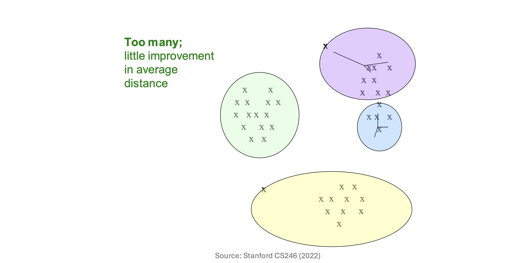

# 1. Introduction to K-means Clustering

* 계층적 군집화에 이어, 이번 포스트에서는 **점 할당(Point Assignment) 방식**의 가장 대표적인 알고리즘인 **K-means Clustering**에 대해 살펴봅니다. K-means는 데이터가 유클리드 공간(Euclidean space)에 존재하며, 군집의 개수인 $k$가 사전에 주어졌을 때 사용하는 알고리즘입니다.

* K-means 알고리즘의 궁극적인 수학적 목표는 **각 데이터 포인트에서 자신이 속한 군집 중심(Centroid)까지의 거리의 제곱합(Sum of Squared Distances, SSD)을 최소화**하는 것입니다.
이를 수식으로 표현하면 다음과 같은 목적 함수 $J$를 최소화하는 중심점 $\mu_j$와 군집 할당 $C_j$를 찾는 최적화 문제가 됩니다.

$$J = \sum_{j=1}^{k} \sum_{x \in C_j} ||x - \mu_j||^2$$

# 2. The K-means Algorithm Steps

* K-means 알고리즘은 EM(Expectation-Maximization) 알고리즘의 일종으로, 다음의 단계를 수렴할 때까지 반복하여 최적해를 찾아갑니다.
  * 1. **Initialization (초기화)**: 공간 상에 $k$개의 초기 중심점(Centers)을 임의로 선택합니다.
  * 2. **Assignment (할당)**: 각 데이터 포인트에 대해, 현재 설정된 $k$개의 중심점 중 가장 가까운(Closest) 중심점을 찾아 해당 군집으로 할당합니다.
  * 3. **Update (업데이트)**: 모든 포인트의 할당이 끝나면, 각 군집에 새로 할당된 데이터 포인트들의 산술 평균(Average)을 계산하여 해당 군집의 중심점을 새로운 위치로 갱신합니다.
  * 4. **Convergence (수렴 확인)**: 더 이상 데이터 포인트들이 속한 군집을 바꾸지 않으면(Points don't move between clusters), 알고리즘이 수렴한 것으로 판단하고 종료합니다.

# 3. Shortcoming of K-means: The Initialization Problem

* K-means는 빠르고 직관적이지만 치명적인 단점이 있습니다. 바로 **초기 중심점(Initial centroids)의 위치에 따라 알고리즘의 수렴 결과가 극도로 달라진다**는 것입니다.

* 목적 함수가 Non-convex(비볼록) 형태이기 때문에, 잘못된 초기화는 알고리즘을 최적의 해(Global Optima)가 아닌 지역 최솟값(Local Minima)에 빠뜨리게 합니다. 예를 들어, 데이터가 명확히 두 그룹으로 나뉘어 있음에도 초기 중심점 두 개가 데이터가 희소한 엉뚱한 곳에 모여서 시작한다면, 알고리즘은 의미 없는 군집을 형성한 채 멈춰버릴 수 있습니다.

# 4. K-means++: A Smarter Initialization

* 이러한 K-means의 한계를 극복하기 위해 등장한 것이 **K-means++** 알고리즘입니다. 핵심 아이디어는 **"서로 다른 클러스터에 속할 가능성이 높은, 즉 서로 최대한 멀리 떨어져 있는 포인트들을 초기 중심점으로 선택하자"**는 것입니다.

* K-means++의 초기화 과정은 다음과 같습니다:
  * 우선 작은 샘플 집합 $S$를 추출한 뒤 이들을 군집화하여 그 중심을 초기값으로 사용합니다. 이때 샘플 사이즈 $|S|$는 전체 데이터 크기가 $n$일 때 대략 $k \times \log n$에 비례하도록 설정합니다.

* 샘플 포인트를 똑똑하게 선택하기 위해 다음의 확률적 접근을 사용합니다:
  * 1. 데이터 포인트를 무작위 순서로 방문합니다.
  * 2. 현재 점 $p$에서, **"이미 선택된 샘플 포인트들 중 가장 가까운 점까지의 거리"**를 $D(p)$라고 정의합니다.
  * 3. 점 $p$를 새로운 중심점 샘플로 추가할 확률을 $D(p)^2$에 비례하게 설정합니다.

* 즉, 기존에 뽑힌 중심점들로부터 멀리 떨어져 있는 데이터 포인트일수록 다음 중심점으로 뽑힐 확률이 기하급수적으로 높아집니다. 다음 도식들을 통해 이렇게 선택된 중심점들이 어떻게 안정적인 클러스터를 형성해 나가는지 확인할 수 있습니다.

# 5. Getting the $k$ Right: The Elbow Method

* K-means를 사용하기 위해서는 사전에 군집의 개수 $k$를 알아야 하지만, 현실의 데이터 분석에서는 최적의 $k$를 알 수 없는 경우가 대부분입니다. 따라서 시행착오(Trial and error)를 통해 적절한 $k$를 추론해야 합니다.

* 최적의 $k$를 찾는 대표적인 방법은 다음과 같습니다:
  * 1. $k$의 값을 점진적으로 증가시키며 K-means를 여러 번 수행합니다.
  * 2. 각 $k$에 대해 **"중심점까지의 평균 거리 (Average distance to centroid)"**를 계산하여 그래프로 그립니다.

* 그래프의 형태를 직관적으로 분석하기 위해, 실제 데이터 분포에 서로 다른 $k$값을 적용했을 때 어떤 현상이 발생하는지 비교해 보겠습니다.

### Case 1: $k$가 너무 작을 때 (Too few)

* 현상: 억지로 큰 군집을 형성하게 되어, 중심점까지의 거리가 매우 깁니다(Many long distances).

### Case 2: 최적의 $k$일 때 (Just right)

* 현상: 각 데이터가 자신에게 잘 맞는 군집에 속하므로 거리가 전반적으로 짧아집니다(Distances rather short). 위 Elbow 그래프에서 거리가 급격하게 감소하다가 멈추는 바로 그 지점입니다.

### Case 3: $k$가 너무 클 때 (Too many)

* 현상: 이미 잘 뭉쳐있는 군집을 불필요하게 더 쪼개는 상황이므로, $k$를 늘리더라도 거리가 줄어드는 정도(Improvement)가 매우 미미해집니다. 

* 결과적으로 거리 그래프가 급격히 꺾이는 구간, 즉 팔꿈치 모양이 나타나는 지점이 바로 가장 합리적인 군집 수인 **Best value of $k$**가 됩니다.