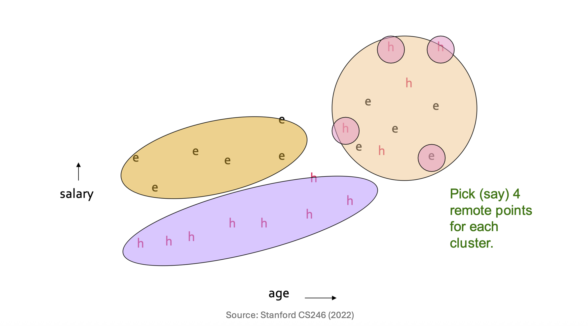
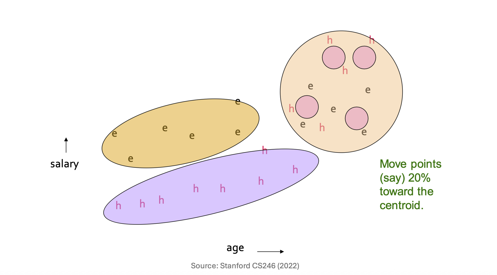

# 1. Introduction: 대용량 데이터 군집화의 과제

* 데이터 마이닝 실무에서 우리가 마주하는 가장 큰 장벽 중 하나는 **데이터의 크기**입니다. 만약 전체 데이터 셋이 너무 커서 메인 메모리(RAM)에 모두 적재할 수 없다면(Disk-resident data), 기존의 표준적인 군집화(Clustering) 알고리즘들은 정상적으로 동작하지 않거나 심각한 성능 저하를 겪게 됩니다. 

* 이번 포스트에서는 이러한 물리적 한계를 극복하고 대규모 데이터를 효과적으로 군집화하기 위해 고안된 대표적인 알고리즘들을 개괄하고, 그중 **CURE (Clustering Using REpresentatives)** 알고리즘의 동작 원리를 수학적 직관과 함께 상세히 파헤쳐 보겠습니다.

# 2. Overview of Large-Scale Clustering Algorithms

* 대규모 데이터를 처리하기 위해 데이터 마이닝 분야에서는 다음과 같은 세 가지 주요 접근법이 논의됩니다.
  * **CURE (Clustering Using REpresentatives):** 계층적 군집화(Hierarchical clustering)를 기반으로 한 가장 직관적이고 단순한 접근법입니다. 군집을 단일 중심점(Centroid)이 아닌 '여러 개의 대표점(Representative points)'으로 표현하는 것이 핵심입니다.
  * **BFR Algorithm:** 대용량 데이터를 위한 K-Means 알고리즘의 변형입니다. CURE에 비해 더 고도화되어 있지만, 그만큼 데이터의 분포에 대해 더 많은 수학적 가정(Assumptions)을 요구합니다.
  * **GRGPF Algorithm:** 비유클리드(Non-Euclidean) 공간에서 활용할 수 있는 매우 영리한(Clever) 알고리즘입니다. 중심점(Centroid) 없이도 군집의 특성을 요약해내는 특징을 가집니다.

* 본 포스트에서는 유클리드 공간을 가정하는 2-Pass 알고리즘인 **CURE**에 집중하겠습니다. 사전에 군집의 개수 $k$가 주어졌다고 가정합니다.

# 3. CURE Algorithm: Core Concepts & Motivation

* K-Means와 같은 기존 알고리즘은 하나의 군집을 **하나의 중심점(Centroid)**으로만 표현합니다. 이는 데이터가 완벽한 구형(Spherical)일 때는 잘 작동하지만, 길쭉하거나 기하학적으로 복잡한 형태의 군집을 잡아내는 데는 한계가 있습니다. 

* 반면 **CURE** 알고리즘은 단일 중심점 대신 **최대한 넓게 퍼져 있는 여러 개의 대표점(Representative points)의 집합**을 사용하여 하나의 군집을 표현합니다. 이를 통해 다양한 모양과 크기를 가진 군집을 유연하게 포착하면서도, 모든 데이터 포인트를 메모리에 올리지 않고 2번의 디스크 스캔(2-Pass)만으로 전체 군집화를 완료할 수 있습니다.

# 4. CURE Algorithm: Step-by-Step Process

* CURE 알고리즘은 크게 두 번의 데이터 패스(Pass 1, Pass 2)로 나뉘어 실행됩니다.

## Pass 1: 표본 추출 및 초기 군집화 (Memory-based)

* 첫 번째 단계의 목적은 데이터의 일부를 추출하여 메인 메모리 내에서 뼈대가 되는 초기 군집을 형성하는 것입니다. 
  * 1. **표본 추출 (Sampling):** 디스크에 있는 전체 데이터 중 무작위 표본(Random sample)을 추출하여 메인 메모리에 적재합니다.
  * 2. **계층적 군집화 (Hierarchical Clustering):** 메모리에 올라온 표본 데이터를 대상으로 계층적 군집화를 수행합니다. 두 군집 간에 가장 가까운 점들의 쌍(Close pairs of points)이 존재할 때 두 군집을 병합(Merge)해 나갑니다.
  * 3. **대표점 선정 (Picking Representative Points):** 각 군집을 대표할 점들을 선택합니다. 이때 군집 내에서 **가능한 한 서로 멀리 떨어져 분산된(Dispersed) 점**들을 표본으로 선택합니다 (예: 군집당 4개의 점).
  * 4. **대표점의 중심 이동 (Shrinkage):** 선택된 대표점들을 해당 군집의 중심점(Centroid)을 향해 일정 비율(예: 20%)만큼 이동시킵니다. 
  * 5. **최종 병합:** 이렇게 조절된 대표점들을 기준으로, 가장 가까운 대표점 쌍을 가진 군집들을 최종적으로 병합합니다.

## Pass 2: 전체 데이터 할당 (Disk Scan)

* 첫 번째 패스에서 만들어진 군집의 '대표점'들을 기준으로, 이제 전체 데이터를 스캔하며 각 포인트를 소속시킵니다.
  * 1. **전체 데이터 재스캔:** 디스크에 있는 전체 데이터 셋을 다시 한번 처음부터 끝까지 스캔합니다.
  * 2. **가장 가까운 군집 할당:** 데이터 셋의 각 포인트 $p$를 "가장 가까운 군집"에 할당합니다.
     * 포인트 $p$와 모든 군집의 모든 대표점들 사이의 거리를 계산하여 가장 가까운 대표점을 찾습니다.
     * 포인트 $p$를 해당 대표점이 속한 군집으로 최종 할당합니다.

# 5. Mathematical Formulation: 대표점의 이동 (Shrinkage)

* Pass 1의 4번째 단계인 **"대표점들을 중심 방향으로 20% 이동시킨다"**는 개념을 수학적으로 명확히 정의해보겠습니다.

* 주어진 군집 $C$에 대하여, 군집의 중심점(Centroid) $\mu$는 다음과 같이 정의됩니다.
$$\mu = \frac{1}{|C|} \sum_{x \in C} x$$

* 우리가 군집 $C$의 외곽에서 선택한 분산된 대표점 중 하나를 $p$라고 합시다. 이 대표점 $p$를 중심점 $\mu$ 방향으로 특정 비율 $\alpha$ (강의 기준 $\alpha = 0.20$) 만큼 이동시킨 새로운 대표점의 위치 $p'$는 벡터의 내분 공식에 의해 다음과 같이 유도됩니다.
  * 1. **방향 벡터 설정:** 대표점 $p$에서 중심 $\mu$로 향하는 벡터는 $(\mu - p)$ 입니다.
  * 2. **이동량 계산:** 전체 거리의 $\alpha$만큼 이동하므로 이동 벡터는 $\alpha(\mu - p)$ 가 됩니다.
  * 3. **최종 좌표 계산:** 기존 위치 $p$에 이동 벡터를 더합니다.
    $$p' = p + \alpha(\mu - p)$$
    * 이를 $p$에 대해 다시 정리하면 최종적인 수축(Shrinkage) 공식이 완성됩니다.
    $$p' = (1 - \alpha)p + \alpha\mu$$

* 결과적으로 새로운 대표점 $p'$는 원래의 대표점 $p$와 중심점 $\mu$를 $(1-\alpha) : \alpha$ 로 내분하는 지점에 위치하게 됩니다.

# 6. Interpretation and Intuition: 왜 20%를 중심 방향으로 이동시키는가?

* 가장 흥미로운 질문은 **"왜 잘 골라놓은 대표점들을 굳이 군집의 안쪽(중심 방향)으로 20%만큼 밀어 넣는가?"** 입니다. 여기에는 군집화의 품질을 극적으로 높이는 깊은 통계적 직관이 숨어 있습니다.
  * 1. **이상치(Outlier) 및 경계선 문제 완화:** 군집 내에서 '가장 분산된 점'을 고르다 보면 필연적으로 군집의 경계선(Boundary)에 아슬아슬하게 걸쳐 있거나 아예 노이즈/이상치인 점이 대표점으로 뽑힐 확률이 높습니다. 이 점들을 안쪽으로 20% 수축시키면 이상치의 영향력을 효과적으로 줄일 수 있습니다.
  * 2. **군집 밀도(Density)에 따른 차등적 축소 효과:** 넓게 퍼져 있는(Dispersed) 거대한 군집은 점들이 중심에서 멀기 때문에 20%를 이동시켰을 때의 절대적인 이동 거리가 깁니다. 즉, 크게 수축(Shrink)됩니다. 반면, 작고 조밀한(Dense) 군집은 20%를 이동시켜도 원래 위치와 큰 차이가 없습니다.
  * 3. **작고 조밀한 군집 보호:** 결과적으로 엉성하게 퍼진 노이즈성 군집은 대표점들이 안쪽으로 크게 오그라들면서 영향력이 약해지고, 작고 뚜렷한(Dense) 군집은 자신의 영역을 확고히 방어하게 됩니다. 즉, 알고리즘 자체가 작고 밀도 높은 군집을 유리하게 판별(Favor)하도록 설계된 것입니다.

# 7. Summary

* 대용량 데이터를 다루는 **CURE 알고리즘**은 데이터를 샘플링하여 뼈대를 잡는 Pass 1과 전체 데이터를 스캔하여 할당하는 Pass 2로 구성됩니다. 핵심은 단일 중심점이 아닌 **여러 개의 분산된 대표점**을 사용해 복잡한 형태의 군집을 파악한다는 점이며, 대표점들을 **중심으로 20% 수축**시키는 기발한 아이디어를 통해 이상치에 강건하고 밀도 높은 군집을 효과적으로 찾아냅니다.