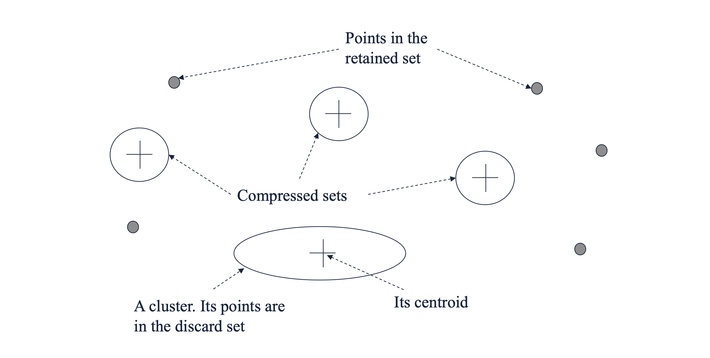
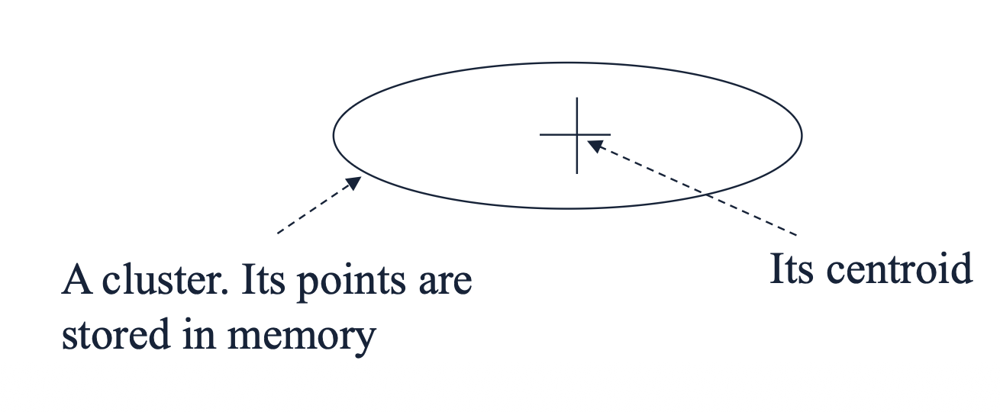

# 1. Introduction: BFR 알고리즘의 등장 배경

* 지난 포스트에서는 대규모 데이터를 군집화하기 위해 대표점(Representative points)을 활용하는 CURE 알고리즘을 살펴보았습니다. 이번에는 또 다른 접근법인 **BFR (Bradley, Fayyad, and Reina) 알고리즘**에 대해 알아봅니다. 

* BFR 알고리즘은 널리 쓰이는 K-Means 군집화 기법을 디스크 기반(Disk-resident)의 대규모 데이터 셋에 적용할 수 있도록 변형(Variant)한 알고리즘입니다. K-Means의 직관성을 유지하면서도, 데이터를 메모리에 전부 올리지 않고 효율적으로 중심점(Centroids)을 찾는 것을 첫 번째 패스(Pass 1)의 주된 목표로 삼습니다. 이후 전체 데이터를 관통하는 두 번째 패스(Pass 2)를 통해 최종적인 포인트 할당을 수행합니다.

# 2. Key Assumptions: 데이터 형태에 대한 가정

* BFR 알고리즘이 효율적으로 동작하기 위해서는 데이터 분포에 대한 명확한 수학적 가정이 필요합니다.
  * **정규 분포 및 유클리드 공간:** 군집들이 유클리드 공간 내에서 정규 분포(Normally-distributed)를 따른다고 가정합니다.
  * **축에 정렬된 타원형(Axis-aligned ellipses):** 각 군집의 형태는 축에 나란히 정렬된 타원 모양이어야 합니다.
  * **차원별 독립적 분산:** 각 차원(Dimension)에서의 표준편차(Standard deviations)는 서로 다를 수 있습니다. 이는 축에 정렬되어 있다는 가정과 결합하여, 차원 간의 공분산(Covariance)을 무시할 수 있게 해줍니다.

# 3. Main Idea: 요약 통계량 (Summary Statistics) 유지

* BFR 알고리즘의 핵심 동기(Motivation)는 **"모든 데이터를 메모리에 들고 있을 필요가 없다"**는 것입니다. 그 대신 점들의 그룹을 대표하는 **요약 통계량(Summary statistics)**만을 메모리에 유지합니다. 

* 디스크로부터 데이터를 메인 메모리가 꽉 찰 만큼씩(one main-memory-full at a time) 읽어 들입니다.
* 이전 메모리 로드 단계에서 처리한 대부분의 점들을 요약하여 압축합니다.
* 이 과정을 통해 필요한 메모리 요구량이 전체 데이터 크기 $O(data)$에서 군집의 개수에 비례하는 크기 $O(clusters)$ 수준으로 획기적으로 줄어듭니다.

* 하지만 모든 점이 완벽하게 요약되는 것은 아닙니다. 어떤 점들은 기존 군집에 속하지 못하고 떠돌 수 있습니다. 이를 효과적으로 관리하기 위해 BFR은 메모리 상의 데이터를 세 가지 클래스로 분류합니다.

# 4. Three Classes of Points: 세 가지 데이터 집합

* 알고리즘이 진행되는 동안 메모리로 들어온 모든 데이터 포인트는 다음 세 가지 집합 중 하나로 분류됩니다.
  * **Discard set (버림 집합 = 기존 군집):** 특정 군집의 중심점(Centroid)에 충분히 가까운 점들입니다. 이들은 군집의 요약 통계량에 반영된 후 메모리에서 즉시 버려집니다(Discarded).
  * **Compressed set (압축 집합 = 미니 군집):** 서로 가깝게 모여 있지만(close together), 아직 어떤 기존 군집의 중심과도 가깝지 않은 점들입니다. 이들끼리 묶어 '미니 군집'을 형성하고 통계량만 요약한 뒤 개별 점은 버리지만, 정식 군집으로 할당하지는 않습니다.
  * **Retained set (보류 집합):** 주변에 다른 점이 없어 압축 집합(미니 군집)으로 묶이지도 못하고, 기존 중심과도 먼 고립된(Isolated) 점들입니다. 이들은 향후 다른 점이 들어와 묶일 수 있도록 메모리에 원본 그대로 유지(Waiting)됩니다.

# 5. Mathematical Formulation: 2d + 1 요약 통계량

* Discard set이나 Compressed set은 개별 데이터 포인트를 지우는 대신, 오직 $2d + 1$ 개의 값(여기서 $d$는 차원의 수)만으로 해당 그룹을 요약합니다. 점들의 집합을 $C$라고 할 때, 유지하는 값은 다음과 같습니다.
  * 1. **$N$**: 해당 집합에 속한 점의 총 개수입니다. (1개의 스칼라 값)
  * 2. **$SUM$**: 각 차원별 좌표의 합을 담은 길이가 $d$인 벡터입니다. 
     $$SUM_{i} = \sum_{k \in C} x_{ki}$$
  * 3. **$SUMSQ$**: 각 차원별 좌표의 제곱합을 담은 길이가 $d$인 벡터입니다.
     $$SUMSQ_{i} = \sum_{k \in C} x_{ki}^2$$

## 5.1 통계량을 통한 중심과 분산 도출

* 이 $2d+1$ 개의 요약 정보만 있으면, 원본 데이터가 없어도 군집의 중심(Centroid)과 크기(Variance)를 언제든 계산할 수 있습니다.
  * **차원 $i$의 평균 (군집의 중심):** $SUM_{i} / N$
  * **차원 $i$의 분산 (군집의 크기):** 통계학의 기본 성질인 $Var(X) = E[X^2] - E[X]^2$ 공식을 이용합니다.
    $$Var_{i} = \frac{SUMSQ_{i}}{N} - \left( \frac{SUM_{i}}{N} \right)^2$$
  * **차원 $i$의 표준편차:** 계산된 분산의 제곱근(Square root)을 취합니다.

* 앞서 2장에서 언급한 **"축에 정렬된 타원형 군집"** 가정이 바로 여기서 결정적인 역할을 합니다. 이 가정이 성립하기 때문에 각 차원의 분산을 개별적으로 계산할 수 있습니다. 만약 이 가정이 없다면, 차원 간의 상관관계를 나타내는 $d \times d$ 크기의 방대한 공분산 행렬(Covariance matrix)을 통째로 저장하고 계산해야 하므로 메모리 효율성이 크게 떨어집니다.

# 6. Benefits: 연산의 효율성

* 이러한 $2d + 1$ 통계량 표현 방식은 군집화 과정에서의 연산을 매우 단순하게 만들어 줍니다.
  * **새로운 점 추가 (Benefit 1):** 어떤 점을 군집에 새로 추가할 때, $N$을 1 증가시키고, 해당 점의 좌표를 $SUM$ 벡터에 더하며, 좌표의 제곱값을 $SUMSQ$ 벡터에 더하기만 하면 됩니다. 전체 평균을 다시 계산하기 위해 과거의 점들을 다시 볼 필요가 없습니다.
  * **두 군집의 병합 (Benefit 2):** 두 개의 요약된 군집(예: 두 개의 미니 군집)을 하나로 합칠 때도, 단순히 두 군집의 $N$, $SUM$, $SUMSQ$ 값들을 각각 더해주기만 하면 완벽히 병합됩니다.

# 7. Pop Quiz: 손으로 직접 계산해보기

* 주어진 점들의 집합: $(5, 1), (6, 2), (7, 0)$

* 1. **$N$**: 총 3개의 점이므로 $N = 3$
* 2. **$SUM$**: 각 차원별 합
   * $SUM_{1} = 5 + 6 + 7 = 18$
   * $SUM_{2} = 1 + 2 + 0 = 3$
   * $\therefore SUM = (18, 3)$
* 3. **$SUMSQ$**: 각 차원별 제곱합
   * $SUMSQ_{1} = 5^2 + 6^2 + 7^2 = 25 + 36 + 49 = 110$
   * $SUMSQ_{2} = 1^2 + 2^2 + 0^2 = 1 + 4 + 0 = 5$
   * $\therefore SUMSQ = (110, 5)$
* 4. **첫 번째 차원(dimension 1)의 분산(Variance)**:
   $$Var_1 = \frac{110}{3} - \left(\frac{18}{3}\right)^2 = 36.66... - 6^2 = 36.66... - 36 = 0.666...$$ (즉, $\frac{2}{3}$)