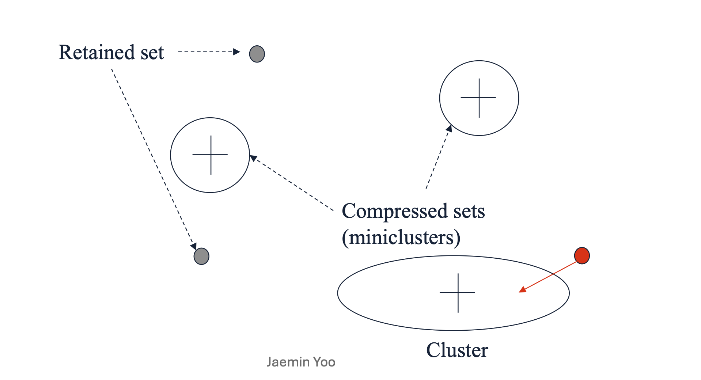
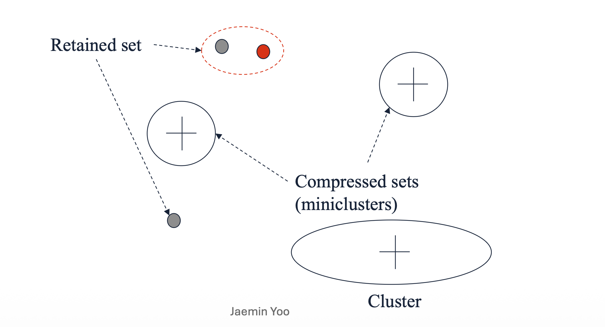
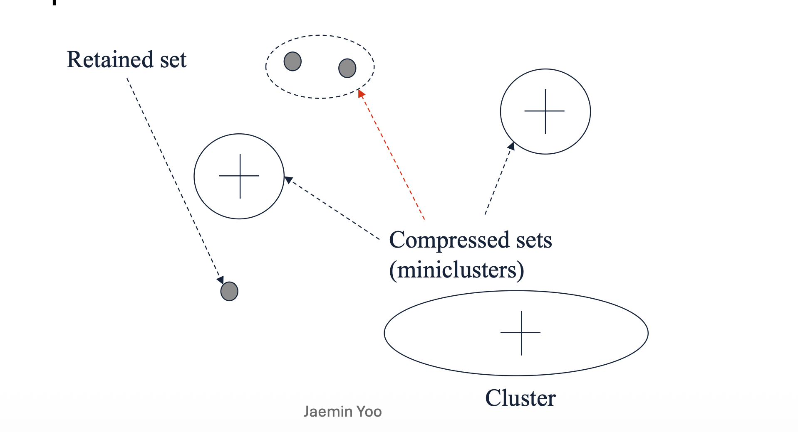
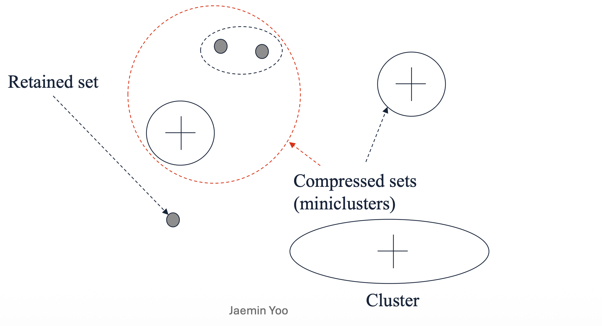
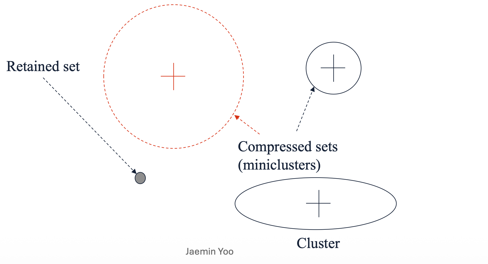
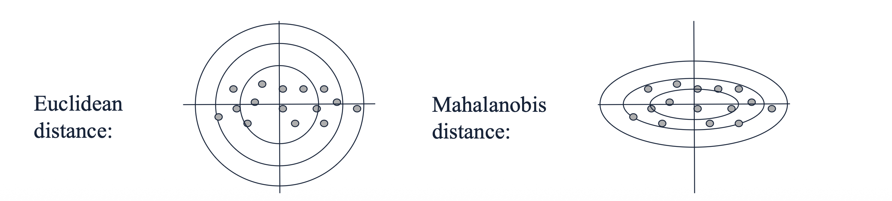
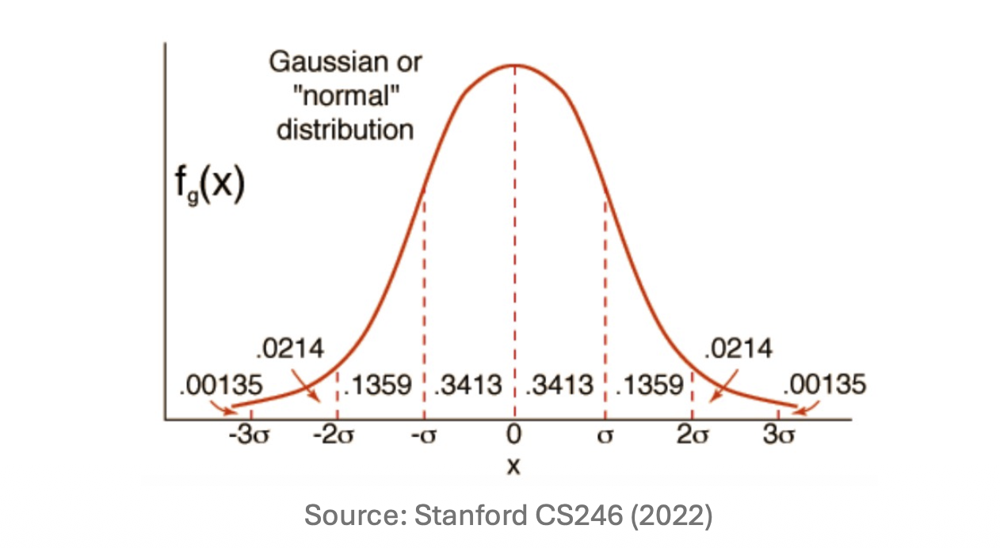

# 1. Introduction: BFR 알고리즘의 전체 흐름

* 이전 포스트에서는 BFR(Bradley, Fayyad, and Reina) 알고리즘이 대규모 데이터를 처리하기 위해 어떻게 요약 통계량(Summary Statistics)을 활용하는지, 그리고 데이터를 세 가지 집합(Discard, Compressed, Retained set)으로 어떻게 분류하는지 살펴보았습니다. 

* 이번 포스트에서는 BFR 알고리즘이 디스크에 저장된 데이터를 실제로 어떻게 청크(Chunk) 단위로 읽어 들이며 처리하는지, 그 **단계별 프로세스**를 파헤쳐 봅니다. 더불어, 새로운 데이터 포인트가 특정 군집에 속하는지 여부를 판단하는 핵심 수학적 지표인 **마할라노비스 거리(Mahalanobis Distance)**의 개념을 심도 있게 다루겠습니다.

# 2. Initialization: 초기 중심점 선정

* BFR 알고리즘은 본질적으로 K-Means의 변형이므로, 알고리즘 시작 시 $k$개의 초기 중심점(Initial Centroids)을 설정해야 합니다. 초기 중심점을 선택하는 방식은 K-Means와 유사하게 다음 세 가지 옵션을 고려할 수 있습니다.
  * **Option 1:** 전체 데이터 중 무작위로 $k$개의 점을 선택합니다.
  * **Option 2:** 작은 표본(Small sample)을 추출하여 메인 메모리에서 미리 군집화를 수행한 뒤, 그 결과로 도출된 중심점들을 사용합니다.
  * **Option 3:** 표본을 추출한 후 무작위로 첫 번째 점을 고르고, 나머지 $k-1$개의 점들은 이전에 선택된 점들로부터 최대한 멀리 떨어진(as far from the previously selected points as possible) 점들을 순차적으로 선택합니다.

# 3. Processing Chunks: 청크 단위 처리 과정

* 초기화가 끝나면, 디스크에 있는 대규모 데이터 파일에서 메모리가 허용하는 만큼의 데이터 청크(Chunk)를 순차적으로 읽어 들여 다음 단계들을 거쳐 처리합니다.

* **1. 충분히 가까운 점의 할당:** 청크 내의 각 점들에 대해, 기존 군집(Cluster)이나 미니 군집(Minicluster)의 중심점과 "충분히 가깝다면", 해당 점을 그 군집에 추가합니다. 

* **2. 잔여 점들의 군집화:** 어떤 중심점과도 충분히 가깝지 않은 점들은 기존의 보류 집합(Retained set)에 있던 점들과 함께 임의의 군집화 알고리즘을 사용하여 다시 묶어봅니다.

* **3. 새로운 미니 군집 생성:** 2번 과정의 결과로 2개 이상의 점이 새롭게 그룹을 형성하면, 이는 새로운 미니 군집(압축 집합, Compressed sets)이 됩니다. 

* **4. 기존 군집 간의 병합 시도:** 새롭게 데이터가 추가되고 요약 통계량이 갱신됨에 따라, 기존의 군집들과 미니 군집들 사이의 거리를 다시 계산합니다. 
  

* 만약 두 군집이 충분히 가까워졌다면 이들을 최종적으로 하나로 병합(Merge)합니다.

# 4. Mathematical Formulation: "충분히 가깝다"의 정의 (마할라노비스 거리)

* BFR 알고리즘의 핵심적인 질문은 **"특정 점이 중심점과 "충분히 가깝다"는 것을 어떻게 수학적으로 정의할 것인가?"** 입니다. 

* 단순한 유클리드 거리(Euclidean Distance)를 사용하면, 차원(Dimension)마다 분산이 다른 타원형 군집을 제대로 포착할 수 없습니다. 따라서 BFR은 점들의 분포가 정규 분포를 따른다는 가정을 활용하여, 차원별 표준편차로 정규화된 **마할라노비스 거리(Mahalanobis distance)**를 사용합니다.

* 특정 점 $p$와 중심점 $c$ 사이의 마할라노비스 거리는 다음과 같이 정의됩니다.
$$\text{Mahalanobis Distance} = \sqrt{\sum_{i=1}^{d} \left(\frac{p_{i}-c_{i}}{\sigma_{i}}\right)^{2}}$$
  * $d$: 데이터의 차원 수
  * $p_{i}$: 새로운 데이터 포인트의 $i$번째 차원 좌표
  * $c_{i}$: 해당 군집 중심점의 $i$번째 차원 좌표
  * $\sigma_{i}$: 해당 군집의 $i$번째 차원 표준편차 (이전 포스트의 $2d+1$ 통계량으로 도출 가능)

## 4.1 임계값 (Threshold)의 설정

* 각 포인트 $p$에 대해 가장 가까운 중심점을 찾은 뒤, 이 마할라노비스 거리가 특정 임계값(Threshold)보다 작을 때만 군집에 편입시킵니다. 

* 마할라노비스 거리는 기본적으로 정규분포의 Z-score와 유사하게 "몇 표준편차" 떨어져 있는지를 의미합니다. 예를 들어, 임계값을 4로 설정했다고 가정해 보겠습니다. 통계적으로 정규 분포에서 값이 평균으로부터 4 표준편차($4\sigma$) 이상 떨어져 있을 확률은 $10^{-6}$ 미만입니다. 즉, 거리가 4를 초과한다면 이 점은 해당 군집에 속하지 않을 확률이 압도적이므로 편입시키지 않는 것이 합리적입니다.

# 5. Merging and Finalizing: 병합 조건 및 알고리즘 종료

## 5.1 군집의 병합 조건 (When to Merge?)
* 청크 처리 4~5단계에서 두 군집을 병합할지 결정할 때, 대표적인 방법은 두 군집을 결합했을 때의 **결합 분산(variance of the combined subcluster)**을 계산하는 것입니다. 이 결합 분산이 사전에 정의된 특정 임계값 아래로 유지된다면 두 군집을 병합합니다.

## 5.2 모든 청크 처리 후의 마무리
* 데이터 파일의 모든 청크 처리가 완료된 후 메모리에 남은 **압축 집합(미니 군집)과 보류 집합(단일 점)**은, (1) 완벽한 이상치(Outliers)로 취급하여 버리거나, (2) 강제로 가장 가까운 정규 군집에 할당(Assign)하여 알고리즘을 마무리 짓습니다.