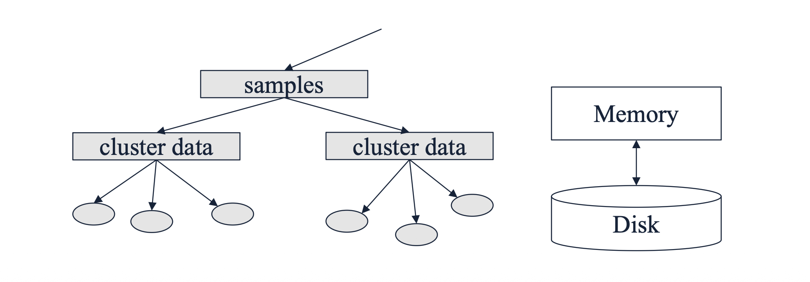
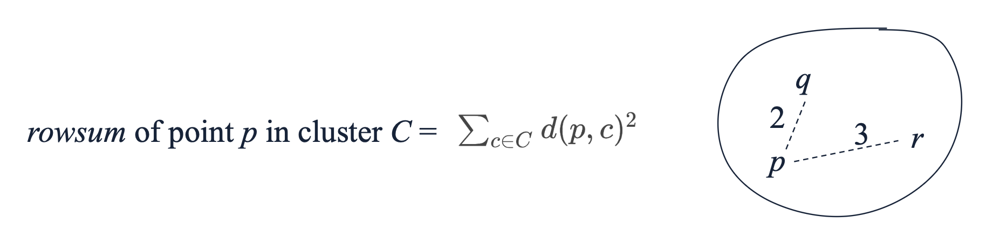
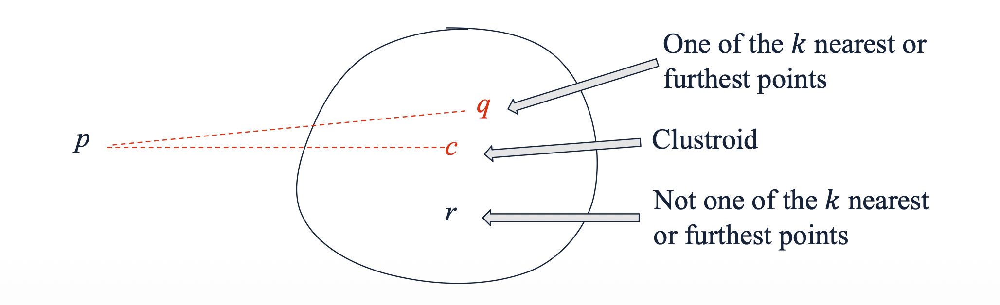
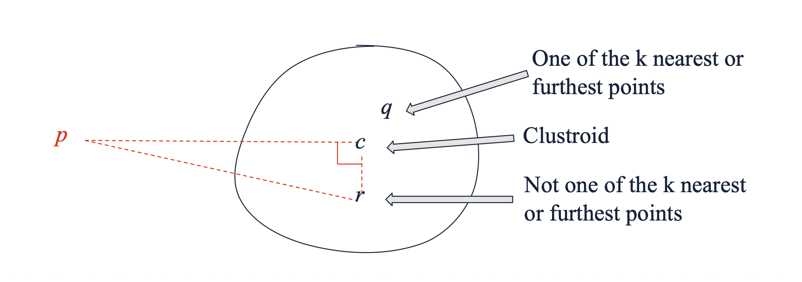
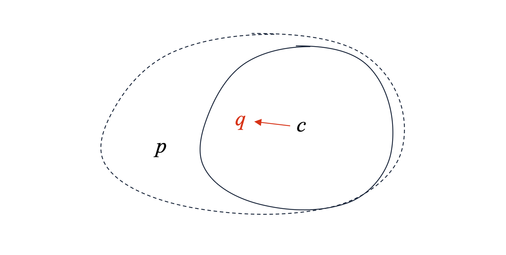

# 1. Introduction: 비유클리드 공간의 군집화 문제

* 지금까지 다룬 CURE와 BFR 알고리즘은 대규모 데이터를 훌륭하게 처리하지만, 한 가지 치명적인 한계가 있습니다. 바로 데이터가 **유클리드 공간(Euclidean space)**에 존재한다고 가정한다는 점입니다. 유클리드 공간에서는 점들의 좌표 평균을 구해 중심점(Centroid)을 쉽게 계산할 수 있습니다. 

* 하지만 문서, 그래프, 유전자 서열과 같이 좌표로 표현하기 어렵고 오직 객체 간의 거리(Distance)만 정의되는 **비유클리드 공간(Non-Euclidean space)**에서는 중심점이라는 개념 자체가 성립하지 않습니다. 이러한 환경에서 대규모 데이터를 효과적으로 군집화하기 위해 고안된 기법이 바로 **GRGPF 알고리즘**입니다.

# 2. GRGPF의 핵심: Clustroid와 트리 구조

* GRGPF 알고리즘은 유클리드 공간을 요구하지 않는 대신, 메모리 내에서 잘 선택된 표본 점(well-chosen sample points)들을 활용하여 군집을 표현합니다. 

* 또한 데이터를 단순히 평면적으로 나열하는 것이 아니라 트리(Tree) 형태로 계층화하여 조직합니다. 새로운 데이터 포인트가 들어오면, 이 계층적 트리를 따라 아래로 내려가면서(passing it down the tree) 가장 적절한 군집에 할당하는 방식을 취합니다.

# 3. Cluster Representation: 군집의 요약 표현

* 중심점(Centroid)을 계산할 수 없다면, 군집을 어떻게 요약(Summarize)해야 할까요? GRGPF 알고리즘은 특정 군집 $C$를 표현하기 위해 메모리에 다음과 같은 정보들을 유지합니다.
  * 1. **$N$**: 군집에 속한 데이터 포인트의 총 개수.
  * 2. **Clustroid $c$**: 군집을 가장 잘 대표하는 실제 데이터 포인트.
  * 3. **Clustroid의 Rowsum**: Clustroid $c$의 Rowsum 값.
  * 4. **$k$ Nearest Points**: Clustroid와 가장 가까운 $k$개의 점들과 각각의 Rowsum.
  * 5. **$k$ Farthest Points**: Clustroid와 가장 먼 $k$개의 점들과 각각의 Rowsum.

## 3.1 Rowsum과 Clustroid의 수학적 정의

* 여기서 **Rowsum**은 특정 점 $p$가 군집 내의 다른 점들과 얼마나 떨어져 있는지를 나타내는 지표입니다. 군집 $C$ 내의 점 $p$에 대한 Rowsum은 다음과 같이 해당 군집 내의 모든 점 $c \in C$ 까지의 거리의 제곱합으로 정의됩니다.

* 이러한 Rowsum 개념을 바탕으로, **Clustroid**는 해당 군집 내에서 Rowsum이 가장 작은 점(the point with the smallest rowsum)으로 정의됩니다. 즉, 군집 내의 다른 모든 점들과의 거리 제곱합이 최소가 되는 "가장 중심부에 위치한 실제 데이터 포인트"입니다.

# 4. Justification: 왜 $k$개의 점들을 추가로 저장하는가?

* 메모리를 아껴야 하는 상황에서 굳이 Clustroid와 가장 가까운 점 $k$개, 가장 먼 점 $k$개를 각각의 Rowsum과 함께 저장하는 데는 중요한 이유가 있습니다.
  * **가장 가까운 $k$개의 점 ($k$ Nearest Points):** 새로운 데이터가 군집에 추가됨에 따라 군집의 중심이 이동할 수 있습니다. 만약 기존 Clustroid가 대표성을 잃는다면, 새로운 Clustroid는 기존 Clustroid 근처에 있던 점들 중 하나가 될 확률이 매우 높습니다. 만약 어떤 점 $p$의 Rowsum이 현재 Clustroid $c$의 Rowsum보다 작아진다면($rowsum(p) < rowsum(c)$), $p$가 새로운 Clustroid로 승격됩니다.
  * **가장 먼 $k$개의 점 ($k$ Farthest Points):** 이 점들은 군집의 외곽 경계선을 파악하는 데 사용되며, 두 군집이 하나로 병합(Merge)해도 될 만큼 충분히 가까운지(close enough to merge)를 결정하는 기준으로 활용됩니다.

# 5. Adding a Point to a Cluster: 점의 추가와 갱신

* 새로운 데이터 포인트 $p$가 특정 군집에 추가될 때, 알고리즘은 디스크 전체를 스캔하지 않고 메모리 내의 요약 정보만 효율적으로 갱신해야 합니다.
  * 1. **$N$ 증가:** 군집의 크기 $N$에 1을 더합니다.
  * 2. **기존 점들의 Rowsum 갱신:** 우리가 메모리에 들고 있는 점들의 집합, 즉 $q \in \{\text{clustroid}\} \cup \{k \text{ nearest points}\} \cup \{k \text{ farthest points}\}$ 에 속한 각각의 점 $q$에 대하여, 새롭게 들어온 점 $p$와의 거리 제곱을 더하여 Rowsum을 갱신합니다.
     $$rowsum(q) \leftarrow rowsum(q) + d^2(p, q)$$

* 하지만 만약 $p$ 자체가 요약 표현(representation)에 포함되어야 한다면 어떻게 될까요? 이를 위해서는 $p$ 자신의 Rowsum을 알아야 하지만, 정의상 모든 점과의 거리를 계산해야 하므로 무거운 디스크 접근(Disk access)이 발생합니다. GRGPF는 이 문제를 아주 기발한 수학적 근사법으로 우회합니다.

# 6. Estimating the Rowsum: 차원의 저주를 활용한 기발한 근사법

* GRGPF는 고차원 공간의 기하학적 특성인 **"차원의 저주(Curse of Dimensionality)"**를 역이용합니다. 

* 데이터의 차원이 매우 높아지면, 공간 내에서 무작위로 뽑은 두 벡터가 이루는 각도는 **거의 90도(직각)**에 수렴하게 됩니다. 즉, 고차원 공간의 임의의 세 점 $p$, $c$(Clustroid), $r$(군집 내 임의의 다른 점)이 이루는 삼각형은 $\angle pcr$이 직각인 직각삼각형에 매우 가까워집니다.

* 따라서 **피타고라스의 정리(Pythagorean theorem)**에 의해 $d^2(p, r) \approx d^2(p, c) + d^2(c, r)$ 이 성립합니다. 이 성질을 이용하여 점 $p$의 실제 Rowsum을 전수조사 없이 근사(Estimation)할 수 있습니다.

$$rowsum(p) \approx \sum_{r \in C} \left[ d^2(p, c) + d^2(c, r) \right]$$

* 이를 정리하면 다음과 같은 강력한 근사 공식이 도출됩니다.
$$rowsum(p) \approx rowsum(c) + N \times d^2(p, c)$$

* 이 공식을 사용하면 새로운 점 $p$와 현재의 Clustroid $c$ 사이의 거리 한 번만 계산하면, 디스크 스캔 없이 $p$의 Rowsum을 추정할 수 있습니다.

# 7. Clustroid의 갱신과 한계

* 새로운 데이터가 계속 들어오면서 Rowsum 정보들이 갱신되다가, 어느 순간 $k$-최근접 점 중 하나인 $q$의 Rowsum이 현재 Clustroid $c$의 Rowsum보다 작아지면($rowsum(q) < rowsum(c)$), $q$가 새로운 Clustroid 자리를 차지하게 됩니다.

* 하지만 이 방식은 근사에 의존하므로 시간이 지날수록 오차가 누적될 수 있습니다. 언젠가는 진정한(True) Clustroid가 메모리에 유지 중인 $k$개의 가까운 점들 목록 안에 존재하지 않는 상황이 발생할 수도 있습니다. 따라서 알고리즘은 주기적(periodically)으로 디스크 전체 데이터를 스캔하여 군집 요약 표현(Cluster representation)을 재계산(recomputed)하여 바로잡아야 합니다.