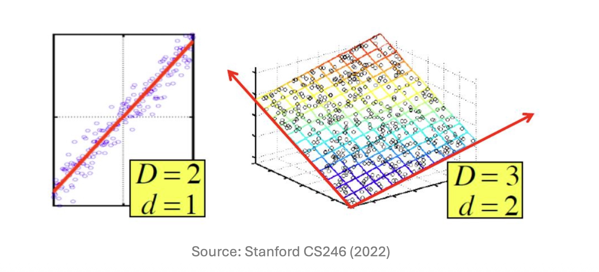
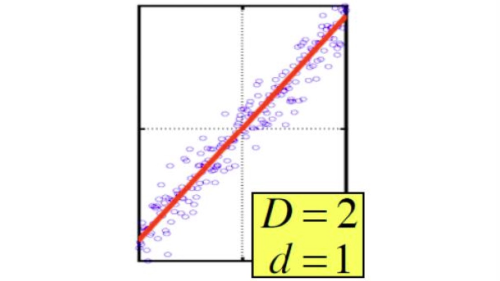

# 1. Introduction: 데이터 마이닝과 차원 축소

* 현대의 수많은 데이터 소스(Data sources)는 행렬(Matrix)의 형태로 표현될 수 있습니다. 분석의 대상이 되는 데이터를 거대한 $m \times n$ 행렬로 간주해 봅시다. 여기서 $m$은 데이터 포인트(또는 샘플/인스턴스)의 개수를 의미하며, $n$은 피처(Feature, 속성)의 개수를 의미합니다. 

* 예를 들어, 의료 및 건강 데이터셋(Health dataset)을 생각해 볼 수 있습니다. 이 데이터셋에서 각 사람(샘플)은 `<키, 몸무게, 체질량지수(BMI), 혈압, 나이, 등>`과 같은 다양한 피처의 벡터로 표현됩니다. 이러한 피처들은 분석 목적에 따라 매우 유연하게 다뤄질 수 있으며, 새롭게 생성되거나 불필요한 경우 버려질 수도 있습니다. 

* 하지만 피처의 수가 늘어날수록, 즉 데이터의 차원($n$)이 커질수록 데이터를 처리하고 분석하는 데 비용이 증가하며 노이즈가 개입할 여지가 커집니다. 따라서 데이터가 가진 본질적인 정보를 최대한 보존하면서 차원을 줄이는 **차원 축소(Dimensionality Reduction)** 기법이 데이터 마이닝의 핵심적인 전처리 과정으로 요구됩니다.

---

# 2. Core Concepts: 데이터 매니폴드(Data Manifold)와 잠재 요인

* 데이터가 표면적으로는 $n$차원 공간에 존재하더라도, 실제로 데이터가 분포하는 본질적인 구조인 **데이터 매니폴드(Data Manifold)**가 반드시 $n$차원 공간 전체를 채우는 것은 아닙니다. 

* 매니폴드의 크기(차원)는 곧 데이터에 내재된 **잠재 요인(Latent factors)**의 개수와 같습니다. 앞선 건강 데이터셋의 예시를 다시 떠올려보면, 어떤 사람을 '몸무게', '키', 'BMI'라는 3개의 피처로 표현할 수 있습니다. 그러나 BMI는 본질적으로 몸무게와 키를 통해 계산되는 값이므로, 이 3개의 변수는 완전히 독립적이지 않습니다. 즉, 3차원으로 표현되어 있지만 실제 이 데이터를 지배하는 독립적인 잠재 요인은 그보다 적습니다. 

* 우리는 차원 축소 과정을 통해 표면적인 피처들 이면에 숨어있는 진짜 **잠재 요인들을 발견**하고자 합니다.

---

# 3. Mathematical Formulation: 행렬의 랭크(Rank of a Matrix)

* 데이터에 내재된 잠재 요인의 수를 수학적으로 어떻게 정의할 수 있을까요? 선형대수학의 관점에서 이는 **행렬의 랭크(Rank of a Matrix)**와 정확히 일치합니다.

* 데이터 행렬 $M$의 랭크는 선형적으로 독립적인(linearly independent) 행(row) 또는 열(column)의 최대 개수로 정의됩니다. 여기서 **선형 독립(Independence)**이란, 행(또는 열) 벡터들의 0이 아닌 선형 결합(nonzero linear sum)으로 영벡터($\mathbf{0}$)를 만들 수 없는 상태를 의미합니다.

* 구체적인 수학적 예시를 통해 이를 유도해 보겠습니다. 3차원 공간 상에 존재하는 3개의 데이터 포인트 $A, B, C$가 행렬 $M$으로 주어졌다고 가정해 봅시다:
  $$ 
  M = \begin{bmatrix} A \\ B \\ C \end{bmatrix} = \begin{bmatrix} 1 & 2 & 1 \\ -2 & -3 & 1 \\ 3 & 5 & 0 \end{bmatrix} 
  $$

* 얼핏 보면 이 데이터는 3개의 행(샘플)과 3개의 열(피처)을 가지고 있으므로 차원이 3인 것처럼 보입니다. 하지만 이 행렬의 실질적인 랭크를 계산해 보면 다음과 같은 종속성을 발견할 수 있습니다.

## **1. 행(Row) 기준의 선형 종속성 검증:**
* 각 행을 벡터로 보았을 때, 첫 번째 행($A$)에서 두 번째 행($B$)과 세 번째 행($C$)을 빼면 영벡터가 됩니다.
$$A - B - C = [1, 2, 1] - [-2, -3, 1] - [3, 5, 0] = [0, 0, 0] = \mathbf{0}$$

* 즉, $C = A - B$로 표현될 수 있으므로, 세 번째 데이터 포인트는 앞의 두 포인트가 그리는 2차원 평면 위에 존재하게 됩니다. 

## **2. 열(Column) 기준의 선형 종속성 검증:**
* 열 벡터 단위($c_1, c_2, c_3$)로 살펴보아도 선형 종속성이 존재합니다. 
  $$5c_1 - 3c_2 + c_3 = 5\begin{bmatrix} 1 \\ -2 \\ 3 \end{bmatrix} - 3\begin{bmatrix} 2 \\ -3 \\ 5 \end{bmatrix} + \begin{bmatrix} 1 \\ 1 \\ 0 \end{bmatrix} = \begin{bmatrix} 5 \\ -10 \\ 15 \end{bmatrix} - \begin{bmatrix} 6 \\ -9 \\ 15 \end{bmatrix} + \begin{bmatrix} 1 \\ 1 \\ 0 \end{bmatrix} = \begin{bmatrix} 0 \\ 0 \\ 0 \end{bmatrix}$$

* 따라서 열 벡터 간의 선형 결합 합이 $\mathbf{0}$이 되므로, 피처 간에도 완벽한 종속 관계가 존재합니다. 

* 결론적으로 이 행렬의 선형적으로 독립인 벡터의 최대 개수는 2이므로 **랭크(Rank)는 2**가 됩니다.

---

# 4. Detailed Derivations: 기저 변환을 통한 효율적인 좌표 재작성

* 행렬의 랭크가 2라는 사실은, 3차원으로 표현된 이 데이터 포인트들을 정보 손실 없이 단 2개의 새로운 기저(basis)를 이용해 효율적으로 재작성할 수 있음을 의미합니다.

* 기존의 3차원 표준 기저 벡터(Old basis vectors)를 $e_1 = [1, 0, 0]$, $e_2 = [0, 1, 0]$, $e_3 = [0, 0, 1]$이라고 합시다. 기존 좌표계에서 데이터 포인트 $A$는 다음과 같이 표현되었습니다:
$$A = 1e_1 + 2e_2 + 1e_3$$

* 이제 선형적으로 독립적인 두 개의 행 $A$와 $B$를 새로운 기저 벡터(New basis vectors) $u_1, u_2$로 설정해 보겠습니다.
  * $u_1 = [1, 2, 1]$
  * $u_2 = [-2, -3, 1]$

* 이 새로운 기저를 사용하여 데이터 포인트 $A, B, C$의 좌표를 다시 계산해 봅시다.
  * $A$는 그 자체로 $u_1$이므로: $A = 1u_1 + 0u_2$ $\implies$ 새로운 좌표: **$[1, 0]$** 
  * $B$는 그 자체로 $u_2$이므로: $B = 0u_1 + 1u_2$ $\implies$ 새로운 좌표: **$[0, 1]$** 
  * 앞서 증명한 선형 종속성($C = A - B$)에 의해 $C$는: $C = 1u_1 - 1u_2$ $\implies$ 새로운 좌표: **$[1, -1]$** 

* 이처럼 적절한 기저를 선택함으로써 데이터의 실질적인 차원을 3차원($D=3$)에서 2차원($d=2$)으로 성공적으로 축소(Reduced)시켰습니다.

---

# 5. Interpretation and Intuition: 데이터의 '진짜 축' 발견과 노이즈

* 앞선 사례처럼 차원 축소의 궁극적인 목표는 데이터가 실제로 분포해 있는 매니폴드, 즉 **데이터의 진짜 축(actual axes)**을 발견하여 이를 따라가는 것입니다. 

* 위 그림처럼 2차원 공간에 넓게 퍼져있는 것 같아 보여도, 포인트들이 하나의 붉은 선(매니폴드)을 따라 군집해 있다면, 이 선을 새로운 축으로 삼아 각 점을 1개의 좌표로만 표현(Represent each point with 1 coordinate)할 수 있습니다.

* 앞선 3D → 2D 수식 예제에서는 랭크가 정확히 2로 떨어졌기 때문에 데이터 손실이 전혀 없는 완벽한 압축이 가능했습니다(No error if the rank is exactly equal to the reduced dimension). 

* 하지만 현실의 데이터는 어떨까요? 현실의 데이터에는 항상 노이즈가 존재하며, 데이터 포인트들이 매니폴드(붉은 선이나 평면) 위에 '정확하게' 놓여있지 않습니다 (points do not exactly lie on the line). 따라서 현실 데이터의 차원을 억지로 축소시킬 경우, 필연적으로 **약간의 오차(Error)**가 발생하게 됩니다. 현대 차원 축소 기법들(예: PCA 등)의 핵심은 결국 "어떻게 하면 이 정보 손실(Error)을 최소화하면서 차원을 압축할 수 있을 것인가"를 푸는 최적화 문제로 귀결됩니다.

---

# 6. Summary

* 데이터는 보통 행(샘플)과 열(피처)로 구성된 행렬로 표현되며, 피처가 많아질수록 분석 복잡도가 증가합니다.
* 데이터가 고차원 공간에 위치하더라도 실제 본질적 구조인 **데이터 매니폴드**는 더 낮은 차원(잠재 요인의 수)을 가질 수 있습니다.
* 수학적으로 이 잠재 요인의 수는 선형 독립인 벡터의 최대 개수인 **행렬의 랭크(Rank)**로 정의됩니다.
* 차원 축소는 기저 변환을 통해 **데이터의 실질적 축(Actual axes)**을 찾는 과정이며 , 현실 데이터에서는 점들이 매니폴드에 정확히 일치하지 않으므로 축소 과정에서 불가피하게 오차가 발생합니다.