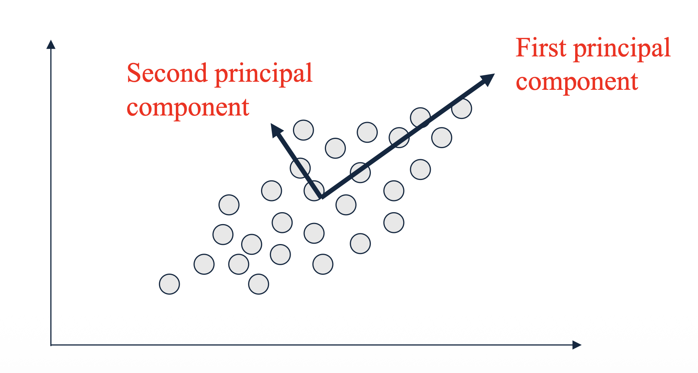
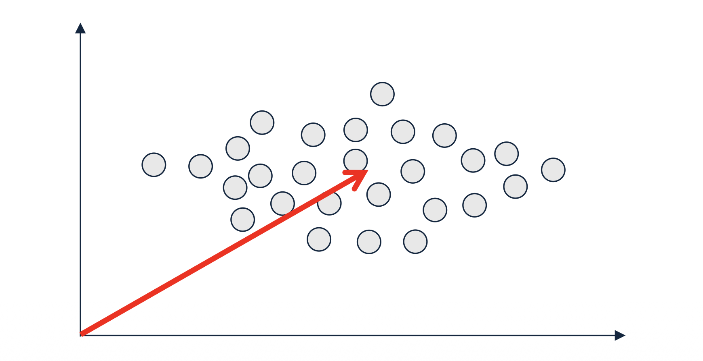

# 1. Introduction: 데이터의 핵심 축 찾기

* 지금까지 행렬의 랭크, 고유벡터의 직교성, 그리고 이를 계산하기 위한 멱차수법(Power Iteration)까지 차원 축소를 위한 선형대수학적 기초 공사를 마쳤습니다. 이제 이러한 개념들이 어떻게 현대 데이터 마이닝의 가장 핵심적인 차원 축소 기법인 **주성분 분석(Principal Component Analysis, PCA)**으로 결실을 맺는지 살펴볼 차례입니다.

* PCA는 고차원의 데이터를 분석할 때, 데이터의 정보(분산)를 최대한 보존하면서 차원을 압축하는 방법론입니다. 이번 포스트에서는 PCA가 본질적으로 어떤 최적화 문제를 풀고 있는 것인지, 그리고 왜 앞서 배운 고유벡터가 그 해답이 되는지를 수학적으로 엄밀하게 증명해 보겠습니다.

---

# 2. Core Concepts: 주성분(Principal Component)의 정의

* $n$차원으로 이루어진 데이터가 주어졌을 때, PCA는 이 데이터를 설명할 수 있는 **새로운 $n$개의 직교하는 축(axes)**을 찾습니다. 이때 새로운 축들은 다음과 같은 중요한 기준에 따라 순차적으로 결정됩니다.
  * **제1 주성분 (First Principal Component):** 데이터의 분산(Variance)이 가장 크게 나타나는 방향의 축입니다.
  * **제2 주성분 (Second Principal Component):** 제1 주성분과 직교(Orthogonal)한다는 조건 하에서, 그 다음으로 분산이 크게 나타나는 방향의 축입니다.

* 데이터의 분산이 크다는 것은 데이터 포인트들이 그 축을 따라 넓게 퍼져 있다는 뜻이며, 이는 곧 해당 축이 데이터를 구분 짓는 가장 많은 정보를 담고 있다는 것을 의미합니다.

---

# 3. Preprocessing: 평균 중심화 (Zero-Centering)의 필수성

* PCA 최적화 식을 세우기 전에 반드시 수행해야 하는 전처리 과정이 있습니다. 바로 데이터의 평균을 0으로 맞추는 **평균 중심화(Zero-centering 또는 Mean-centering)**입니다. 

* 만약 입력 데이터 행렬 $M$이 영점 중심(zero-centered)으로 맞춰져 있지 않다면 어떤 문제가 발생할까요? 

* 데이터가 원점에서 멀리 떨어져 있을 경우, 알고리즘이 찾아내는 첫 번째 주성분(First PC)은 데이터 내부의 퍼짐(분산)을 가리키는 대신, **원점으로부터 데이터의 평균 위치를 가리키는 벡터**가 될 가능성이 매우 높습니다. 이는 데이터 자체의 본질적인 형태가 아니라, 위치 편향으로 인해 생성된 인위적이고 거대한 분산(large artificial variance)을 잡아내는 꼴이 됩니다. 따라서 특성 표준화(Feature standardization)를 통해 평균을 원점으로 이동시키는 것은 PCA에서 절대적으로 필수적인 단계입니다.

---

# 4. Mathematical Formulation: 분산 최대화 문제의 정의

* 이제 평균 중심화가 완료된 $m \times n$ 데이터 행렬 $M$이 있다고 가정해 봅시다. 우리의 목표는 분산을 최대화하는 변환 행렬 $T$의 첫 번째 열(column), 즉 **제1 주성분 벡터 $t_1$**을 효율적으로 찾는 것입니다.

* 어떤 임의의 방향 벡터 $t$ (단, $||t||=1$인 단위 벡터) 위로 데이터 $M$을 정사영(projection)시켰을 때의 데이터 분산 $var(t)$는 다음과 같이 정의할 수 있습니다. (평균이 0이므로 분산 공식에서 평균을 빼는 부분은 생략됩니다).

$$var(t) \equiv \sum_{i} (M_i t - 0)^2 = ||Mt||^2 = (Mt)^T Mt = t^T M^T M t$$

* 여기서 $M_i$는 행렬 $M$의 $i$번째 행(샘플)을 의미합니다.
* 결과적으로 분산은 $t^T M^T M t$ 라는 이차 형식(Quadratic form)으로 깔끔하게 정리됩니다.

* 따라서 제1 주성분 $t_1$을 찾는 것은 다음의 최적화 문제를 푸는 것과 같습니다.

$$t_1 = \arg\max_{||t||=1} var(t) = \arg\max_{||t||=1} (t^T M^T M t)$$

---

# 5. Detailed Derivations: Rayleigh Quotient와 고유벡터

* 위의 최적화 문제를 푸는 열쇠는 **Rayleigh Quotient(레일리 몫)** 개념과 앞서 배운 고유분해(Eigendecomposition)에 있습니다. 이 해답을 찾기 위해 두 가지 관찰(Observation)을 수학적으로 증명해 보겠습니다.

## 5.1. Observation 1: 분산의 상한과 하한

* **명제:** 분산 $var(t) = t^T M^T M t$ 의 값은 항상 행렬 $M^T M$의 가장 작은 고윳값 $\lambda_{min}$ 과 가장 큰 고윳값 $\lambda_{max}$ 사이에 존재합니다.

* **증명 (Proof):**
  * 1.  먼저 $M^T M$은 형태상 항상 **대칭 행렬(Symmetric matrix)**이 됩니다. 지난 포스트에서 대칭 행렬은 정규 직교 행렬 $Q$를 통해 대각화(Diagonalizable)가 가능하다고 배웠습니다. 즉, $M^T M = Q\Lambda Q^T$ 입니다.
  * 2.  이를 분산 식에 대입해 봅니다:
      $$t^T M^T M t = t^T (Q\Lambda Q^T) t = (t^T Q) \Lambda (Q^T t)$$ 
  * 3.  여기서 $y \equiv Q^T t$ 라는 새로운 벡터를 정의해 봅시다. $y$ 역시 단위 벡터(unit vector)입니다.
      * 이유: $||y||^2 = y^T y = (Q^T t)^T (Q^T t) = t^T Q Q^T t$. 직교 행렬의 성질에 의해 $QQ^T = I$ 이므로, $t^T t = 1$ 이 됩니다.
  * 4.  이제 식을 $y$로 다시 표현하면 대각 행렬 $\Lambda$와의 곱셈이 되므로 합계 기호로 전개할 수 있습니다.
      $$y^T \Lambda y = \sum_{i} \lambda_i y_i^2$$
  * 5.  $y$가 단위 벡터이므로 $\sum_{i} y_i^2 = 1$ 입니다. 따라서 $var(t)$는 결국 **고윳값 $\lambda_i$들의 가중 평균(weighted average)** 형태가 됩니다. 어떤 수들의 가중 평균은 필연적으로 그 수들의 최솟값과 최댓값 사이에 위치하게 됩니다.

## 5.2. Observation 2: 분산이 최대화되는 조건

* **명제:** 방향 벡터 $t$가 $M^T M$의 주 고유벡터(principal eigenvector)인 $v_1$일 때, 분산은 최댓값 $\lambda_{max}$를 달성합니다 ($t = v_1$ 일 때 $var(t) = \lambda_{max}$).

* **증명 (Proof):**
  * 1.  앞선 증명에서 분산은 고윳값들의 가중 평균 $var(t) = \sum_{i} \lambda_i y_i^2$ 이 됨을 보였습니다.
  * 2.  고윳값들이 $\lambda_1 \ge \lambda_2 \ge \dots \ge \lambda_n$ 순서로 정렬되어 있다고 할 때, 이 가중 평균이 최대가 되려면 가장 큰 가중치인 $\lambda_1$에 모든 비중을 몰아주어야 합니다.
  * 3.  즉, $|y_1| = 1$ 이고 나머지 모든 $i > 1$ 에 대해 $|y_i| = 0$ 일 때 최댓값을 갖습니다.
  * 4.  $y_1$의 정의를 다시 풀어보면 다음과 같습니다.
      $$|y_1| = |(Q^T t)_1| = |v_1^T t| = 1$$ 
      * $Q$의 첫 번째 열이 $v_1$이므로 $Q^T$의 첫 번째 행과 $t$의 내적은 $v_1^T t$ 가 됩니다.
  * 5.  두 단위 벡터 $v_1$과 $t$의 내적의 절댓값이 1이 되기 위해서는 (코사인 유사도가 1 또는 -1이므로) 두 벡터가 완벽히 동일한 방향이어야 합니다. 결론적으로 **$t = v_1$** 이 성립합니다.

---

# 6. PCA의 결과물과 차원 축소 적용 (Output of PCA)

* 최적화 문제에 대한 해답(Answer)이 명확해졌습니다. 
* 변환 행렬 $T$의 첫 번째 열 $t_1$은 데이터의 **공분산 행렬(Covariance matrix)인 $M^T M$의 주 고유벡터(Principal eigenvector)**입니다. 
* 마찬가지로 두 번째 주성분 $t_2$는 $M^T M$의 두 번째 고유벡터가 되며, 이들은 이전 포스트에서 다룬 **멱차수법(Power Iteration)**을 통해 효율적으로 순차 계산할 수 있습니다.
* 이렇게 구한 $n \times n$ 변환 행렬 $T$를 원본 데이터 행렬 $M$에 곱하면, 주성분 축으로 새롭게 투영된 데이터 행렬 $M'$를 얻게 됩니다.
$$M' = M T$$

* 차원 축소(Dimensionality Reduction)는 어떻게 이루어질까요? 
* 새로운 행렬 $M'$는 열(column)의 순서대로 데이터의 분산(정보량)을 가장 많이 담고 있습니다. 따라서 전체 $n$개의 열을 모두 사용하는 대신, 가장 중요한 앞부분의 **$r$개 열(columns)만 선택(keeping)하여 남기면** 됩니다 ($r < n$). 이 과정을 통해 노이즈를 제거하고 본질적인 정보(Information)만을 유지한 채 데이터의 차원을 성공적으로 압축할 수 있습니다.