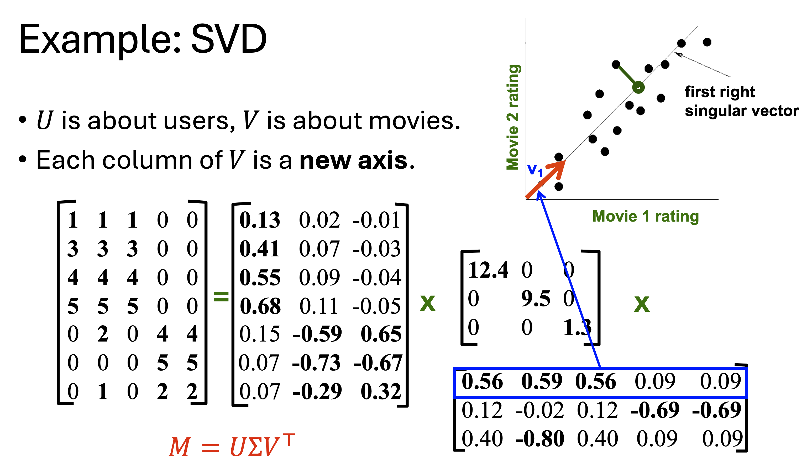
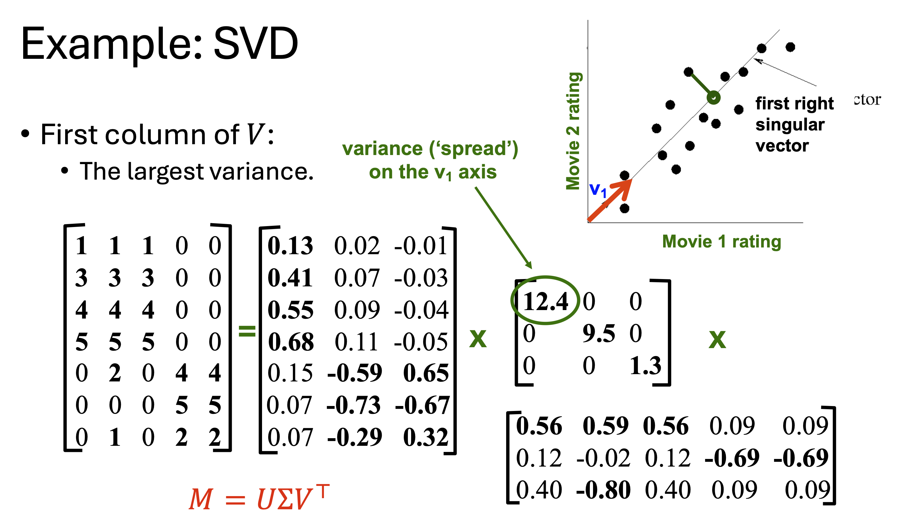
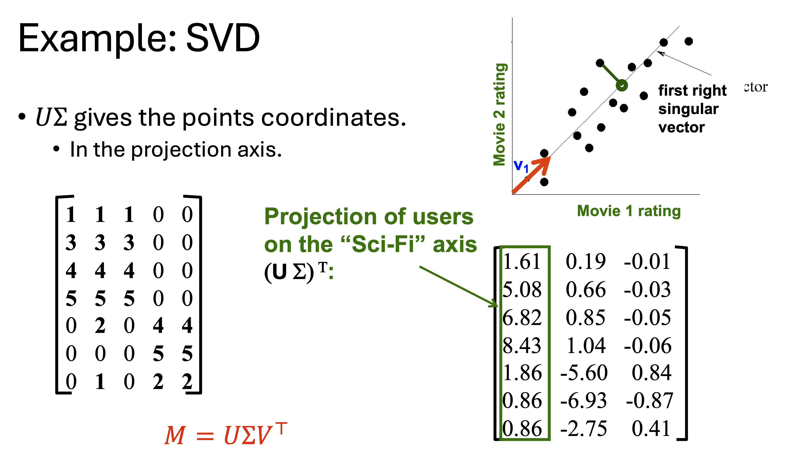
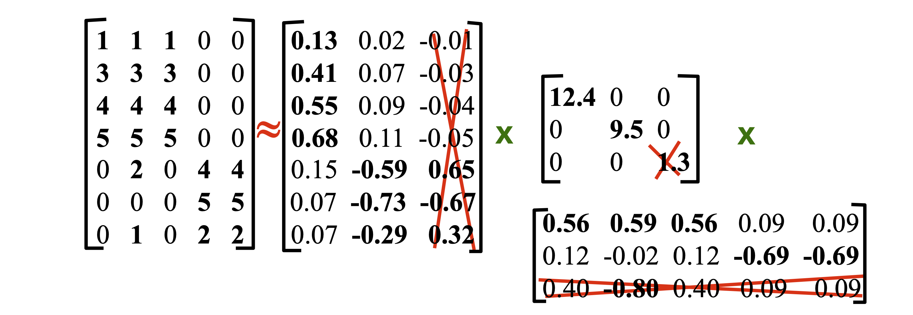
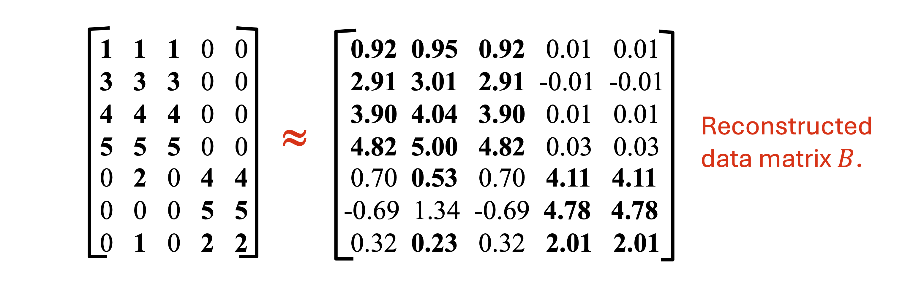
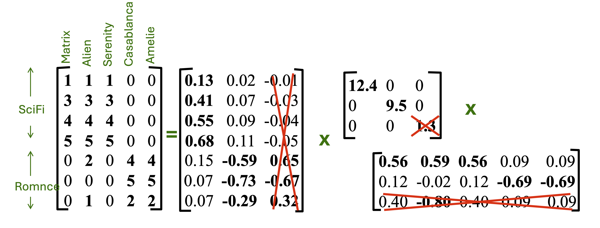
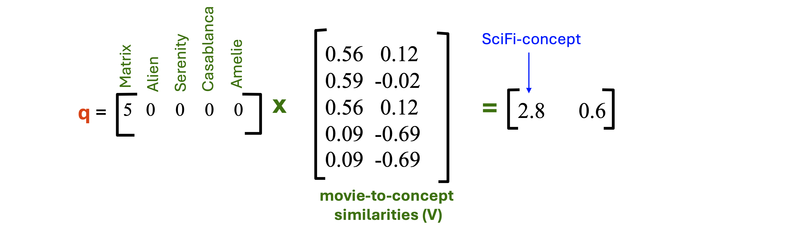

# 1. 들어가며 (Introduction)

지난 포스트에서는 특이값 분해(SVD)의 수학적 정의와 분해된 각 행렬($U, \Sigma, V$)이 데이터 마이닝 관점에서 가지는 직관적인 의미를 다루었습니다. 이번 포스트에서는 SVD를 **실제 차원 축소(Dimensionality Reduction)**에 어떻게 적용하는지 그 기하학적 메커니즘을 상세히 살펴봅니다. 

데이터의 노이즈를 제거하고 핵심 정보만을 남기는 **최적 하위 랭크 근사(Best Low-Rank Approximation)**의 수학적 원리를 이해하고, 추천 시스템 환경에서 겹치는 평가 기록이 전혀 없는 두 사용자 간의 유사도를 구하는 '잠재 공간 쿼리(Querying in Concept Space)' 기법까지 9장의 상세한 시각 자료와 함께 연결하여 학습해 보겠습니다.

---

# 2. 기하학적 직관: 데이터의 투영(Projection)

차원 축소의 핵심은 데이터를 표현하는 데 필요한 '좌표축의 수'를 줄이는 것입니다. 추천 시스템(User-Movie Matrix)을 예로 들어 기하학적인 상황을 상상해 봅시다. 특정 개념(예: Sci-Fi)에 속하는 2개의 영화가 있고, 여러 사용자가 이 영화들에 내린 평점을 2차원 평면상에 점으로 찍어본다고 가정해 보겠습니다.

데이터 점들은 평면 전체에 무작위로 흩어져 있지 않고 특정한 선형적 추세(Trend)를 따라 길게 늘어서 있습니다. 이때 SVD를 통해 얻은 **첫 번째 우측 특이 벡터 $v_1$**은 바로 **데이터의 분산(Variance)이 가장 큰 방향**을 정확히 가리킵니다. 원래는 한 사용자의 위치를 설명하기 위해 $(x, y)$ 좌표 2개가 필요했지만, 데이터 점들을 $v_1$ 축 위로 투영시키면, $v_1$ 선상에서의 위치라는 **단 1개의 좌표**만으로도 해당 사용자의 특성을 꽤 정확하게 설명할 수 있게 됩니다. 이것이 차원 축소의 본질입니다.

---

# 3. SVD를 이용한 실제 차원 축소 연산

## 3.1. 잠재 공간으로의 매핑 수식 유도

그렇다면 사용자들을 새로운 '개념 축(Concept Axis)' 위로 투영한 좌표값은 행렬 연산으로 어떻게 구할 수 있을까요? 

원본 행렬 $M$을 $M = U\Sigma V^{\top}$로 분해했을 때, 데이터 $M$을 새로운 직교 기저 행렬 $V$의 공간으로 투영하는 연산은 $M$에 $V$를 곱하는 것입니다.
$$MV = (U\Sigma V^{\top})V = U\Sigma (V^{\top}V)$$
$V$는 직교 행렬이므로 $V^{\top}V = I$ (항등 행렬)가 성립합니다. 따라서 다음과 같이 정리됩니다.
$$MV = U\Sigma$$

즉, $U\Sigma$ 행렬의 각 행(Row)은 사용자들이 새로운 잠재 개념 공간에서 가지는 투영 좌표를 의미하게 됩니다.

## 3.2. 특이값 절삭 (Truncating Singular Values)

완벽한 복원이 아닌 '차원 축소'를 수행하려면, **가장 작은 특이값들을 0으로 만드는 절삭(Truncation)** 과정을 거칩니다.

1. $\Sigma$에서 크기가 작은 하위 특이값을 0으로 지웁니다.
2. 대응하는 $U$의 열과 $V^{\top}$의 행들도 연산에서 배제(Truncate)됩니다.
3. 그 결과 노이즈가 제거된 근사 복원 행렬 $B$를 얻게 됩니다.

---

# 4. 최적 하위 랭크 근사 (Best Low-Rank Approximation)

## 4.1. 복원 오차와 근사 행렬

일부 특이값을 버렸기 때문에 복원된 행렬 $B$는 원본 행렬 $M$과 완벽히 일치하지 않습니다. 

이 둘 사이의 정보 손실량, 즉 **복원 오차(Reconstruction Error)**는 Frobenius Norm의 제곱($||M-B||_{F}^{2} = \sum (M_{ik} - B_{ik})^{2}$)으로 측정합니다. Eckart-Young-Mirsky 정리에 따르면, SVD를 통해 상위 $r$개의 특이값만 남긴 행렬 $B$는 주어진 랭크 $r$에서 원본 행렬 $M$과의 오차를 가장 최소화하는 최적의 근사 행렬입니다.

## 4.2. "에너지(Energy)" 보존과 잠재 쿼리 준비

특이값 $\sigma_i$는 해당 잠재 요인이 담고 있는 데이터의 '에너지(분산)'를 뜻하며, 총 에너지는 특이값의 제곱합($\sum \sigma_{i}^{2}$)입니다. 보통 총 에너지의 90% 이상을 보존하도록 $r$을 정합니다. 앞선 예시에서 1.3을 버려도 99% 이상의 에너지가 보존되었습니다. 버려진 에너지는 무작위적인 노이즈일 확률이 높아, 차원 축소는 일반화(Generalization) 성능을 높입니다.

---

# 5. 활용: 잠재 개념을 이용한 쿼리 (Querying Using Concepts)

차원이 축소된 행렬 공간은 추천 시스템에서 새로운 사용자나 평가 기록이 적은 사용자를 평가할 때 매우 강력한 힘을 발휘합니다.

## 5.1. 새로운 사용자의 영화 추천 예측

새로운 사용자 $q$가 'Matrix' 영화에만 5점을 주고, 나머지는 보지 않았다고 가정합시다 ($q = [5, 0, 0, 0, 0]$).

**Step 1: 잠재 개념 공간 매핑** $q \times V$ 연산을 통해 사용자가 첫 번째 잠재 개념(Sci-Fi)에 $2.8$, 두 번째 개념에 $0.6$의 선호도를 가짐을 파악했습니다.

**Step 2: 예측 평점 복원**
이 개념 선호도 점수에 다시 $V^{\top}$를 곱하면, $(qV)V^{\top} = [1.64, 1.64, 1.64, -0.162, -0.162]$ 라는 예측 결과를 얻습니다. 사용자가 보지 않았던 다른 Sci-Fi 영화(Alien, Serenity 등)들에 $1.64$라는 높은 양수 평점이 예측되므로 이를 추천할 수 있습니다.

## 5.2. 데이터 희소성 및 영점 겹침(Zero-Overlap) 문제 해결

SVD 기반 차원 축소의 가장 혁신적인 성과는 데이터 희소성 문제를 해결한다는 것입니다.

![Figure 9: 영점 겹침(Zero ratings in common) 상황에서의 유사도 도출. 사용자 $d$는 영화 평점이 [0 4 5 0 0], 사용자 $q$는 [5 0 0 0 0]으로 공통 평가 항목이 전혀 없어 원본 공간에서는 유사도가 0입니다. 하지만 점선을 따라 이들을 잠재 개념 공간으로 매핑하면 각각 [5.2, 0.4]와 [2.8, 0.6]이라는 좌표를 갖게 되며, 같은 SciFi 개념을 선호하므로 내적 시 유사도가 0이 아닌 강력한 양수 값을 띠게 되는 마법을 시각화합니다.](./images/svd_zero_overlap.png)

위 그림처럼, 사용자 $d$와 사용자 $q$는 공통으로 시청한 영화가 단 하나도 없기 때문에 전통적인 코사인 유사도를 사용하면 유사도가 0이 됩니다. 하지만 이들을 차원 축소된 잠재 개념 공간(Concept Space)으로 매핑하여 내적하면 강력한 양수($5.2 \times 2.8 + \dots > 0$) 관계가 성립합니다. 표면적으로 본 영화는 달랐지만, 심층적인 'Sci-Fi 선호'라는 잠재 성향이 같았기 때문입니다.

---

# 6. 요약 (Summary)

* **기하학적 투영과 차원 축소**: SVD는 분산이 가장 큰 축($V$)을 찾아내 데이터를 투영($U\Sigma$)하고, 하위 특이값 요소들을 제거(Truncation)함으로써 노이즈 없는 차원 축소를 실현합니다.
* **최적 하위 랭크 근사**: 보존되는 에너지율(통상 90% 이상)을 기준으로 $r$을 결정하면, 수학적으로 Frobenius Norm 오차가 최소화된 최적의 근사 행렬을 구축할 수 있습니다.
* **잠재 공간 쿼리의 위력**: 공통 평가 기록이 없는 희소(Sparse) 데이터 환경에서도, 데이터를 잠재 공간으로 투영($qV$)하면 숨겨진 선호도 유사성을 찾아내어 훌륭한 추천(Prediction)을 수행할 수 있습니다.