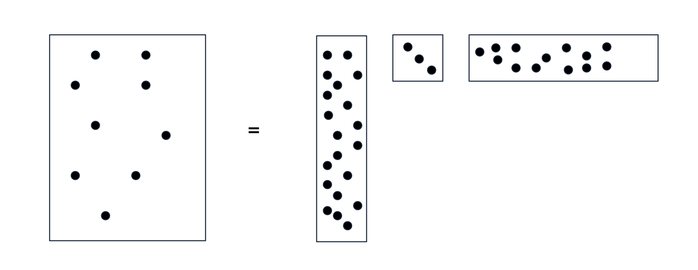
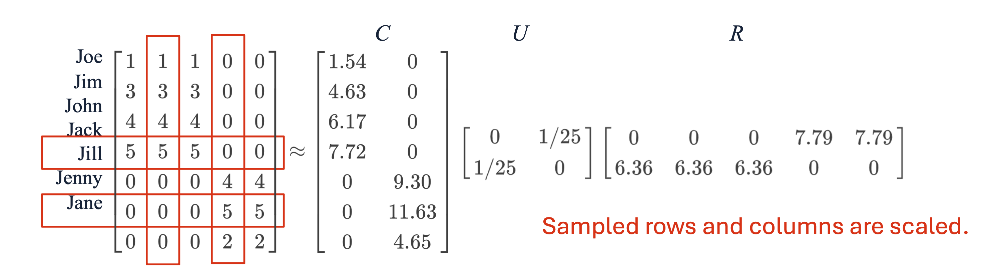
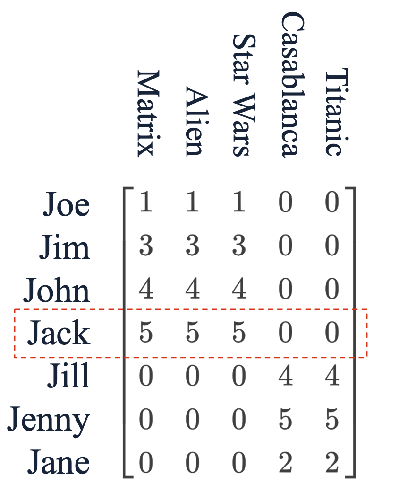
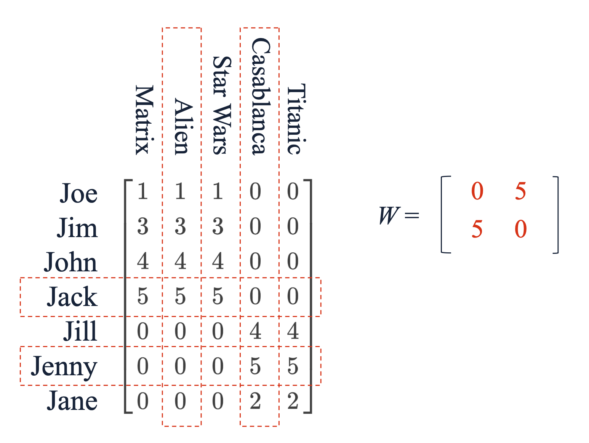

# 1. 들어가며: SVD의 현실적 한계와 희소성(Sparsity)

이전 포스트들에서 살펴본 특이값 분해(SVD)는 수학적으로 가장 최적의 하위 랭크 근사를 제공하는 강력한 기법이었습니다. 하지만 실제 데이터 마이닝 환경에서 고객-상품(Customer-Product) 관계를 나타내는 거대한 데이터 행렬 $M$은 대부분 비어있는 희소 행렬(Sparse Matrix) 형태를 띱니다. 

SVD의 치명적인 단점은, 원본 데이터가 아무리 희소하더라도 분해 결과로 나오는 좌측/우측 특이 벡터 행렬인 $U$와 $V$가 **완전한 밀집 행렬(Dense Matrix)**이 된다는 것입니다. 비록 대각 행렬인 $\Sigma$는 희소하지만 크기가 매우 작아 전체 메모리 효율성에 큰 도움이 되지 않습니다. 수십억 단위의 행과 열을 가진 데이터에서 조밀한 행렬을 메모리에 올리는 것은 컴퓨팅 자원의 낭비이자 불가능에 가깝습니다.

이러한 SVD의 한계를 극복하고, 원본 데이터의 희소성을 그대로 보존하면서 차원을 축소할 수 있는 현실적인 대안이 바로 **CUR 분해(CUR Decomposition)**입니다.

---

# 2. CUR 분해의 개념과 구조

## 2.1. 정의
CUR 분해의 목표는 복원 오차인 $||M-CUR||_{F}$를 최소화하면서 원본 행렬 $M$을 세 개의 행렬 $C, U, R$의 곱으로 근사하는 것입니다. 

$m \times n$ 크기의 원본 행렬 $M$에 대한 CUR 분해는 다음과 같이 구성됩니다:
* **$C$ ($m \times r$ 행렬)**: 원본 행렬 $M$에서 무작위로 추출한 $r$개의 **열(Columns)**들로 구성됩니다.
* **$R$ ($r \times n$ 행렬)**: 원본 행렬 $M$에서 무작위로 추출한 $r$개의 **행(Rows)**들로 구성됩니다.
* **$U$ ($r \times r$ 행렬)**: $C$와 $R$의 교집합 정보를 바탕으로 오차를 최소화하도록 수학적으로 정교하게 구성된 작은 밀집 행렬입니다.

## 2.2. 특징
CUR은 $C$와 $R$을 구성할 때 인공적인 선형 결합 축을 만드는 것이 아니라, **원본 행렬에 실제로 존재하는 행과 열을 그대로 샘플링**하여 사용합니다.

위 도식처럼 원본의 희소성(0이 많은 특성)이 유지되어 메모리 효율이 극대화됩니다. SVD와 달리 CUR은 언제나 "근사치(Approximation)"만을 제공하지만, $r$(개념의 수)이 커질수록 $M$으로 수렴한다는 이론적 배경이 존재합니다.

---

# 3. 샘플링 및 스케일링 알고리즘 (Choosing C and R)

## 3.1. 가중치 기반 샘플링 (Weighted Sampling)
행과 열을 추출할 때 모든 행/열을 균등한 확률로 뽑는 것은 최적이 아닙니다. 복원 오차를 효과적으로 줄이기 위해서는 값이 더 크고 유의미한 패턴이 많은 행/열을 더 자주 뽑아야 합니다. 

이 중요도는 행이나 열의 Frobenius Norm(원소의 제곱합)으로 측정됩니다. 
원본 행렬의 총 에너지를 $f = ||M||_{F}^{2}$ 라고 할 때, 특정 행과 열이 선택될 확률은 다음과 같습니다:
* $i$번째 행이 선택될 확률: $p_{i} = \frac{\sum_{k}m_{ik}^{2}}{f}$
* $k$번째 열이 선택될 확률: $q_{k} = \frac{\sum_{i}m_{ik}^{2}}{f}$

## 3.2. 스케일링 (Scaling)
선택된 행과 열은 샘플링의 편향을 보정하기 위해 각 원소들을 스케일링해야 합니다. $k$번째 열의 각 원소는 다음 값으로 나눕니다:
$$\text{Scaled Element} = \frac{m_{ik}}{\sqrt{r q_{k}}}$$

* **$\sqrt{r}$**: 선택하는 잠재 개념의 개수 $r$에 따라 변하는 스케일을 하나로 통일합니다.
* **$\sqrt{q_{k}}$**: 빈번하게 뽑히는 열과 그렇지 않은 열 간의 중요도 스케일을 통일해 줍니다.

### [예시 계산]
어떤 평가 행렬의 전체 프로베니우스 노름 제곱 $f=243$이라고 합시다.
Jack 행 벡터가 $[5, 5, 5, 0, 0]$이라면, 노름 제곱은 $5^2+5^2+5^2 = 75$입니다.
* Jack 행이 선택될 확률 $p = \frac{75}{243} \approx 0.309$ 입니다.
* $r=2$로 설정했다면, 분모는 $\sqrt{2 \times 0.309} \approx 0.786$이 됩니다.
* 선택된 Jack의 행은 스케일링되어 $R$ 행렬에 $[6.36, 6.36, 6.36, 0, 0]$ 으로 삽입됩니다 ($5 \div 0.786 \approx 6.36$).

---

# 4. 교차 행렬 U의 구축 (Constructing the Middle Matrix)

행렬 $C$와 $R$이 확률적으로 무작위 샘플링되었다면, 가운데 행렬 $U$는 전체 오차를 최소화하도록 결정론적(Deterministic)으로 계산됩니다.

## 4.1. 교집합 행렬 $W$와 SVD
먼저 $r \times r$ 크기의 교집합 행렬 $W$를 생성합니다. 이는 원본 행렬 $M$에서 $C$에 선택된 열 인덱스와 $R$에 선택된 행 인덱스가 교차하는 지점의 원소들로 구성됩니다.

구해진 행렬 $W$에 대해 SVD 연산을 수행하여 $W = X \Sigma Y^{\top}$를 얻습니다.

## 4.2. 무어-펜로즈 유사역행렬과 최종 산출
$U$를 구하기 위해 $\Sigma$의 무어-펜로즈 유사역행렬인 $\Sigma^{+}$를 계산합니다. 대각 원소가 $\sigma \ne 0$ 이라면 역수인 $\frac{1}{\sigma}$로 바꾸고, $0$이라면 그대로 $0$으로 둡니다.

마지막으로 도출된 성분들을 이용해 $U$ 행렬을 계산합니다:
$$U = Y (\Sigma^{+})^{2} X^{\top}$$

### [예시 계산]
* $W = \begin{bmatrix} 0 & 5 \\ 5 & 0 \end{bmatrix}$ 이므로 SVD 결과는 $X = \begin{bmatrix} 0 & 1 \\ 1 & 0 \end{bmatrix}, \Sigma = \begin{bmatrix} 5 & 0 \\ 0 & 5 \end{bmatrix}, Y^{\top} = \begin{bmatrix} 1 & 0 \\ 0 & 1 \end{bmatrix}$ 가 됩니다.
* $\Sigma^{+} = \begin{bmatrix} 1/5 & 0 \\ 0 & 1/5 \end{bmatrix}$ 입니다.
* $U = Y (\Sigma^{+})^{2} X^{\top} = \begin{bmatrix} 1 & 0 \\ 0 & 1 \end{bmatrix} \begin{bmatrix} 1/25 & 0 \\ 0 & 1/25 \end{bmatrix} \begin{bmatrix} 0 & 1 \\ 1 & 0 \end{bmatrix} = \begin{bmatrix} 0 & 1/25 \\ 1/25 & 0 \end{bmatrix}$.

---

# 5. SVD와 CUR의 기하학적 직관 비교

SVD와 CUR이 데이터를 어떻게 대표(Represent)하는지 기하학적 관점에서 뚜렷한 차이가 있습니다.

* **SVD (Centroids 역할)**: 데이터 공간의 분산을 계산하여 원래 데이터에는 존재하지 않더라도 전체를 가장 잘 설명하는 **새로운 직교 방향(New representative directions)**을 창조합니다.
* **CUR (Clustroids 역할)**: 데이터 포인트들 중에서 가장 대표성을 띠는 **실제 데이터 지점(Representative points)**을 그대로 뽑아내어 축으로 삼습니다. 

이러한 특성 덕분에 CUR은 데이터의 행과 열이 "실제 사용자"나 "실제 상품"을 지시하므로, SVD보다 결과 해석이 훨씬 직관적이고 용이하다는 실무적 강점을 지닙니다.