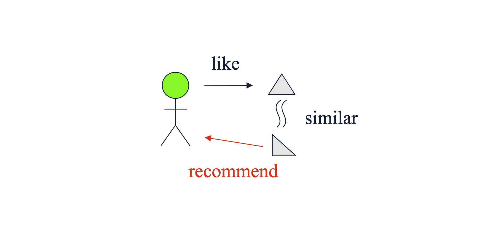
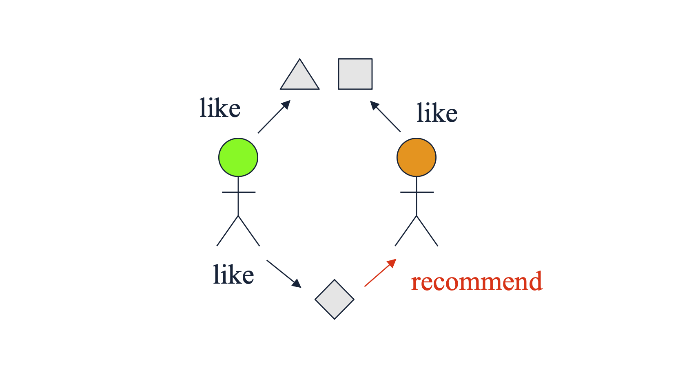

# 1. 추천 시스템(Recommender Systems) 개요

* 추천 시스템(Recommender Systems)은 사용자(User)가 직면한 수많은 선택지(Items) 중에서, 특정 사용자가 가장 선호할 만한 옵션을 예측하여 제안하는 애플리케이션의 한 종류입니다. 정보 과부하(Information Overload) 시대에 사용자의 의사결정을 돕는 핵심 기술로 자리 잡았습니다. 

* 추천 시스템은 크게 **개인화 여부**에 따라 두 가지로 분류할 수 있습니다.
  * 1. **비개인화 추천 (Non-personalized recommendations)**
     * **에디토리얼 및 수동 큐레이션 (Editorial and hand-curated):** 전문가나 플랫폼 편집자가 직접 선정한 '에디터 추천', '필수 아이템' 목록 등입니다.
     * **단순 집계 기반 (Simple aggregates):** 개인의 특성을 반영하지 않고 전체 데이터를 집계한 결과입니다. 예컨대 '주간 Top 10', '가장 많이 팔린 상품', '최근 업로드된 영상' 등이 여기에 해당합니다.
  * 2. **개인화 추천 (Personalized recommendations)**
     * **개별 사용자 맞춤형 (Tailored to individual users):** Amazon의 상품 추천, Netflix의 영화/드라마 추천, YouTube의 알고리즘 영상 추천처럼 사용자의 과거 행동 데이터, 취향, 프로필을 분석하여 각 개인에게 고유하게 맞춰진 리스트를 제공합니다.

# 2. 물리적 희소성에서 디지털 풍부함으로 (From Scarcity to Abundance)

* 추천 시스템이 현대 IT 비즈니스에서 필수적인 요소가 된 배경에는 유통 환경의 패러다임 변화가 있습니다.

* 과거 오프라인 기반의 **물리적 유통 시스템은 자원의 희소성(Scarcity)** 이라는 근본적인 한계를 지녔습니다. 물리적인 상점은 진열할 수 있는 선반 공간(Shelf space)이 제한적이기 때문에, 상업적 이윤을 극대화하기 위해 필연적으로 '가장 잘 팔리는 소수의 인기 품목(Head)' 위주로 매대를 구성해야 했습니다.

* 반면, 인터넷의 발전으로 등장한 **온라인 스토어는 무한한 풍부함(Abundance)** 을 제공합니다. Amazon과 같은 온라인 플랫폼은 수백만 권의 책을 데이터베이스화하여 사실상 존재하는 '모든 것'을 사용자에게 제공할 수 있습니다. 물리적 제약이 사라짐에 따라, 플랫폼은 획일화된 매대 대신 **모든 사용자에게 각자의 취향에 맞는 독립적이고 고유한 인터페이스(A personalized list of items)** 를 제공할 수 있게 되었습니다.

# 3. 롱테일(The Long Tail) 현상과 추천 시스템의 목표

* 온라인 스토어의 '풍부함'은 경제학적으로 **롱테일(Long Tail)** 현상을 촉발했습니다. 물리적 매장이 소수의 '인기 품목(Head)'에 집중했다면, 온라인 플랫폼은 잘 알려지지 않은 방대한 '비주류 품목(Tail)'까지 모두 포괄합니다.

* 위 그림에서 보듯, 대부분의 조회수나 판매량은 소수의 인기 아이템(Head)에서 발생하지만, 꼬리(Tail) 부분에 위치한 수많은 비주류 아이템들의 총합 역시 무시할 수 없는 거대한 시장을 형성합니다. 

* 여기서 **가장 이상적인 추천 시스템의 역할**이 도출됩니다. 대중적인 베스트셀러('Into Thin Air')는 굳이 추천하지 않아도 사용자들이 스스로 찾아낼 확률이 높습니다. 진정한 추천의 가치는 사용자가 스스로 발견하기 어렵지만 개인의 취향에는 완벽히 부합하는 **'적절한 꼬리(Proper Tails)'에 위치한 아이템(예: 'Touching the Void')을 발굴하여 연결해 주는 것**에 있습니다.

# 4. 유틸리티 행렬 (Utility Matrix)

* 추천 시스템을 수학적으로 모델링하기 위해 가장 먼저 정의해야 하는 데이터 구조가 **유틸리티 행렬(Utility Matrix)** 입니다. 이 행렬은 두 가지 핵심 엔티티인 **사용자(Users)** 와 **아이템(Items)** 간의 상호작용(선호도)을 나타냅니다.

* **사용자 집합:** $U = \{u_1, u_2, \dots, u_m\}$
* **아이템 집합:** $I = \{i_1, i_2, \dots, i_n\}$
* **유틸리티 행렬:** $R \in \mathbb{R}^{m \times n}$ 

* 행렬 $R$의 각 원소 $r_{ui}$는 사용자 $u$가 아이템 $i$에 대해 부여한 선호도(Preference)를 나타냅니다. 이 값은 1~5점 별점과 같은 순서형 집합(Ordered set)으로 구성될 수 있습니다.

| Users | HP1 | HP2 | HP3 | TW | SW1 | SW2 | SW3 |
| :---: | :---: | :---: | :---: | :---: | :---: | :---: | :---: |
| **A** | 4 | | | 5 | 1 | | |
| **B** | 5 | 5 | 4 | | | | |
| **C** | | | | 2 | 4 | 5 | |
| **D** | | 3 | | | | | 3 |

* 위 표는 사용자 A~D와 영화 아이템 HP, TW, SW 시리즈 간의 유틸리티 행렬 예시입니다. 빈칸은 관측되지 않은 평점을 의미합니다.

### 행렬의 희소성 (Sparsity)
* 유틸리티 행렬의 가장 중요한 특징은 극단적으로 **희소(Sparse)** 하다는 것입니다. 현실 세계에서 한 명의 사용자가 경험하고 평가하는 아이템은 전체 시스템에 존재하는 수백만 개의 아이템 중 극히 일부에 불과합니다. 따라서 행렬의 대부분의 항목(Entries)은 'Unknown(알 수 없음)' 상태입니다. 추천 시스템의 본질적인 기계학습 태스크는 관측된 소수의 평점 데이터를 바탕으로 이 **빈칸(Unobserved entries)들의 값을 정확하게 추론 및 예측(Matrix Completion)** 하는 것입니다.

# 5. 사용자 평점의 수집 (Gathering Ratings)

* 유틸리티 행렬을 구성하기 위해서는 사용자로부터 선호도 데이터를 수집해야 하며, 이는 수집 방식에 따라 명시적 피드백과 암시적 피드백으로 나뉩니다.

### 5.1. 명시적 피드백 (Explicit Feedback)
* 시스템이 사용자에게 아이템에 대한 평가를 직접 요구하여 얻는 데이터입니다.
  * **예시:** YouTube 시청 후의 '좋아요/싫어요' 버튼 클릭, 영화에 대한 1~5점 별점 평가 등.
  * **한계점:** 사용자는 기본적으로 능동적인 평가를 남기는 것을 귀찮아하므로(Unwilling to provide responses), 데이터 수집량이 적습니다. 또한, 평점을 남기는 행동 자체가 이미 해당 아이템에 특별히 만족했거나 극도로 불만족한 소수 집단의 특성을 반영하기 때문에 **선택 편향(Selection Bias)** 이 발생하기 쉽습니다.

### 5.2. 암시적 피드백 (Implicit Feedback)
* 사용자의 자연스러운 행동 패턴을 관찰하여 선호도를 간접적으로 학습하는 방식입니다.
  * **예시:** 사용자가 특정 영화를 끝까지 시청(Watch)했거나, 상품을 클릭하거나, 장바구니에 담는 행위 자체를 해당 아이템을 '선호(Like)'한다고 간주($r_{ui} = 1$)하는 것입니다.
  * **한계점:** 행동을 했다는 것(1)은 긍정적 신호로 해석하기 쉽지만, 행동을 하지 않았다는 것(0)이 반드시 '싫어함(Dislike)'을 의미하지는 않습니다. 단순히 해당 아이템을 몰랐을 수도 있기 때문입니다. 이처럼 **낮은 평점(부정적 선호도)을 명확하게 모델링하기가 매우 어렵다는 단점**이 있습니다.

# 6. 개인화 추천 시스템의 두 가지 주요 접근법

* 유틸리티 행렬의 빈칸을 채우기 위해, 머신러닝 기반 개인화 추천 시스템은 크게 두 가지 철학적 접근으로 나뉩니다.

### 6.1. 콘텐츠 기반 추천 (Content-based Recommendation)
* **아이템 및 사용자의 본질적인 고유 속성(Features/Profiles)** 에 집중하는 방법입니다.

* **핵심 논리:** '사용자 $u$는 과거에 자신이 좋아했던 아이템들과 **내용(Content)이 유사한** 새로운 아이템을 좋아할 것이다.'
* 영화 추천이라면 영화의 장르, 감독, 출연 배우 등의 '특성(Features)'을 분석하여 유사도를 계산합니다.

### 6.2. 협업 필터링 (Collaborative Filtering)
* 사용자와 아이템의 속성이 아닌, **사용자-아이템 간의 상호작용(Interactions, 평점 데이터 그 자체)** 에 집중하는 방법입니다.

* **핵심 논리:** '사용자 $u$와 과거에 **비슷한 평가(취향)를 공유했던 다른 사용자들**이 긍정적으로 평가한 아이템이라면, 사용자 $u$도 좋아할 것이다.'
* 아이템의 내용이 무엇인지(영화인지 책인지)는 알 필요가 없으며, 오직 유틸리티 행렬 내의 사용자 간의 패턴(User similarity) 혹은 아이템 간의 동시 소비 패턴(Item similarity)만을 활용합니다.