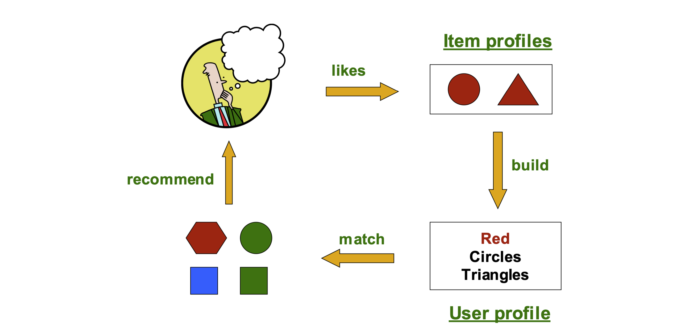
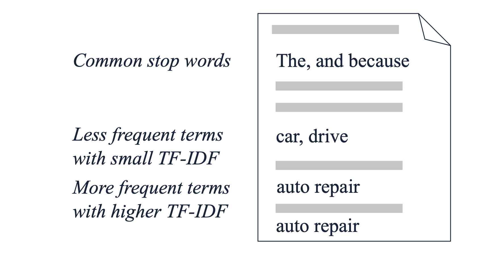
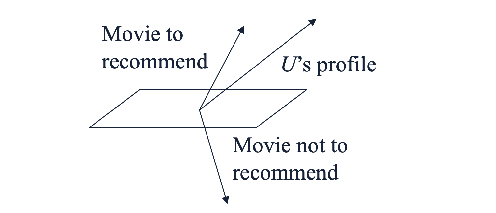

# 1. Introduction: 콘텐츠 기반 추천이란?

* 이전 포스트에서 추천 시스템의 도입 배경과 유틸리티 행렬(Utility Matrix)의 개념에 대해 다루었습니다. 이번 포스트에서는 유틸리티 행렬의 빈칸을 채우기 위한 첫 번째 주요 방법론인 **콘텐츠 기반 추천(Content-based Recommendation)** 에 대해 깊이 있게 살펴보겠습니다.

* 콘텐츠 기반 추천의 핵심 아이디어는 **'아이템 자체가 가지고 있는 고유한 프로필(Profiles)을 활용한다'**는 것입니다. 사용자가 과거에 높게 평가했던 아이템들을 분석하여, 그와 내용(Content)이 유사한 새로운 아이템을 찾아 추천합니다.

* 예를 들어 영화를 추천한다면, 영화를 구성하는 특성(Feature)인 장르, 감독, 출연 배우, 줄거리, 개봉 연도 등을 분석합니다. 사용자가 크리스토퍼 놀란 감독의 SF 영화를 즐겨 보았다면, 시스템은 놀란 감독의 다른 영화나 다른 감독의 웰메이드 SF 영화를 추천 후보로 올리게 됩니다.

* 위 도식은 콘텐츠 기반 추천의 일련의 행동 계획(Plan of Action)을 요약합니다. 아이템 프로필을 분석하고(Build), 이를 바탕으로 사용자의 취향을 요약하는 프로필을 만든 뒤, 새로운 아이템의 프로필과 매칭(Match)하여 최종 추천을 수행합니다.

---

# 2. 아이템 프로필 구축 (Item Profiles as Vectors)

* 콘텐츠 기반 추천을 알고리즘으로 구현하기 위한 첫 단계는 각 아이템을 컴퓨터가 이해할 수 있는 **특성 벡터(Feature Vector)** 로 변환하는 것입니다. 

## 2.1. 텍스트 데이터의 특성 추출: TF-IDF
* 영화나 상품과 달리, 블로그 게시글이나 뉴스 기사 같은 텍스트 문서(Document)의 경우 명확한 특성(Feature)을 정의하기가 까다롭습니다. 이때는 텍스트 마이닝 기법을 활용하여 문서에서 가장 중요한(Important) 단어들을 추출해 프로필로 삼습니다.

* 1. **불용어 제거 (Eliminate stop words):** 'The', 'and', 'because' 등 문법적 기능을 위해 자주 등장하지만 의미론적 가치가 없는 단어들을 분석에서 제외합니다.
* 2. **TF-IDF 계산 (Compute TF-IDF scores):** 단어의 중요도를 평가하기 위해 **TF-IDF(Term Frequency - Inverse Document Frequency)** 를 계산합니다. 특정 문서 내에서 자주 등장하는 단어(TF가 높음)이되, 전체 말뭉치(Corpus)에서는 드물게 등장하는 단어(IDF가 높음)일수록 그 문서를 대표하는 핵심 키워드로 간주됩니다.
* 3. **특성 선택:** TF-IDF 점수가 가장 높은 상위 $k$개의 단어를 해당 문서의 프로필 벡터를 구성하는 특성(Features)으로 사용합니다.

## 2.2. 벡터의 구성 (Encoding Features)
* 추출된 특성들을 수학적 벡터로 표현하는 방식은 데이터의 타입에 따라 다릅니다.
  * **이산형 변수 (Discrete value):** 특정 장르나 감독과 같이 상호 배타적인 범주형 데이터는 **원-핫 벡터(One-hot vector)** 로 표현합니다. 벡터의 길이 $L$은 가능한 모든 이산형 값의 개수가 됩니다.
  * **집합형 변수 (Set of values):** 영화의 출연 배우처럼 여러 값을 동시에 가질 수 있는 경우, 해당되는 여러 인덱스에 1을 부여하는 **멀티-핫 벡터(Multi-hot vector)** 를 사용합니다.
  * **연속형 변수 (Numerical value):** 평점 평균이나 영화 러닝타임 같은 수치형 데이터는 그 값을 그대로 사용합니다. 단, 다른 특성 값들과 단위 차이가 크다면 추천 결과가 특정 변수에 과적합될 수 있으므로 **스케일링(Scaling)** 을 거쳐 조정해야 합니다.

### [예시] 영화 프로필 벡터
* 다음은 배우(Actors), 감독(Director), 장르(Genre), 평균 평점(Avg. rating) 특성을 조합하여 만든 두 영화 $M_1$과 $M_2$의 프로필 벡터 예시입니다.

$$M_1: [0, 1, 1, 0, 1, 1, 0, 1 \mid 0, 1, 0 \mid 0, 1, 0 \mid 2.5]$$
$$M_2: [1, 1, 0, 1, 0, 1, 1, 0 \mid 0, 0, 1 \mid 1, 0, 0 \mid 4.1]$$

* 배우, 감독, 장르는 멀티-핫/원-핫 인코딩으로 이진수(0, 1)로 표현되었으며, 줄리아 로버츠(Julia Roberts)가 포함되어 있는지, 장르가 공상과학(Science Fiction)인지 여부가 벡터의 특정 인덱스에 매핑되어 있습니다. 마지막 차원에는 수치형 데이터인 평점이 그대로 붙어있습니다.

---

# 3. 사용자 프로필 구축 (User Profiles)

* 아이템 벡터가 준비되었다면, 다음은 **사용자 프로필(User Profile)** 을 생성할 차례입니다. 사용자 프로필은 해당 사용자가 과거에 상호작용한 아이템들의 프로필을 유틸리티 행렬을 바탕으로 집계(Aggregation)하여 만듭니다.

## 3.1. 단순 평균 (Simple Average: 이진 유틸리티 행렬)
* 만약 유틸리티 행렬이 시청 여부, 클릭 여부 등 0과 1로만 이루어진 이진(Binary) 형태라면, 사용자가 소비한 아이템 프로필들의 **단순 평균**을 구하는 것이 자연스럽습니다.

* 어떤 사용자 $U$가 위에서 정의한 영화 $M_1$과 $M_2$ (여기서는 계산 편의상 길이 8의 이진 벡터로 가정)만을 시청했다고 가정해 봅시다.
  * $M_1 = [0, 1, 1, 0, 1, 1, 0, 0]$
  * $M_2 = [1, 1, 0, 1, 0, 1, 1, 0]$

* 사용자 $U$의 프로필 $\mathbf{u}$는 두 벡터의 합을 시청한 영화의 수(2)로 나눈 값이 됩니다.
$$\mathbf{u} = \frac{M_1 + M_2}{2} = [0.5, 1, 0.5, 0.5, 0.5, 1, 0.5, 0]$$
* 이 벡터는 사용자 $U$가 어떤 배우나 장르에 평균적으로 50%, 혹은 100%의 확률로 노출되었는지를 요약해 줍니다.

## 3.2. 가중 평균 (Weighted Average: 명시적 평점 행렬)
* 유틸리티 행렬이 1~5점과 같은 평점을 포함하고 있다면, 단순히 평균을 내는 것은 합리적이지 않습니다. 싫어해서 1점을 준 영화의 특성이 사용자 프로필에 적극 반영되어서는 안 되기 때문입니다. 이 경우 **평점을 가중치(Weight)로 사용한 가중 평균**을 구합니다.

* 사용자 $U$가 영화 $M_1$에 1점을, 영화 $M_2$에 4점을 부여했다고 가정해 보겠습니다.
  * $M_1 = [0, 1, 1, 0, 1, 1, 0, 0]$ (Weight = $r_1 = 1$)
  * $M_2 = [1, 1, 0, 1, 0, 1, 1, 0]$ (Weight = $r_2 = 4$)

* 사용자 $U$의 가중 프로필 $\mathbf{u}_{weighted}$는 평점을 곱한 아이템 벡터의 합을 총 아이템 수(여기서는 2)로 나누어 도출합니다.
$$\mathbf{u}_{weighted} = \frac{1 \cdot M_1 + 4 \cdot M_2}{2}$$
  * $1 \cdot M_1 = [0, 1, 1, 0, 1, 1, 0, 0]$
  * $4 \cdot M_2 = [4, 4, 0, 4, 0, 4, 4, 0]$
  * Sum = $[4, 5, 1, 4, 1, 5, 4, 0]$
  * Divide by 2 = $[2, 2.5, 0.5, 2, 0.5, 2.5, 2, 0]$

$$\therefore \mathbf{u}_{weighted} = [2, 2.5, 0.5, 2, 0.5, 2.5, 2, 0]$$

* 결과 벡터를 보면, 높은 평점(4점)을 받은 $M_2$의 특성들이 사용자 프로필에 훨씬 지배적으로 반영되었음을 알 수 있습니다.

---

# 4. 예측 휴리스틱 (Prediction Heuristic)

* 사용자 프로필 벡터 $\mathbf{u}$와 새로운 아이템 프로필 벡터 $\mathbf{m}$이 모두 다차원 공간상의 점(또는 방향을 가진 화살표)으로 표현되었습니다. 이제 두 벡터가 얼마나 유사한지 계산하여 추천 여부를 결정합니다.

* 가장 대표적인 측정 도구는 **코사인 유사도(Cosine Distance/Similarity)** 입니다. 두 벡터의 크기(Magnitude)에 영향을 받지 않고, 두 벡터가 가리키는 **방향(각도 $\theta$)의 일치 정도**만을 측정하기 때문에 추천 시스템에 매우 적합합니다.

$$\cos(\theta) = \frac{\mathbf{u} \cdot \mathbf{m}}{\|\mathbf{u}\| \|\mathbf{m}\|}$$

* 만약 데이터베이스에 수백만 개의 아이템이 있다면, 매번 사용자 벡터와 모든 아이템 벡터 간의 코사인 유사도를 계산하는 것은 막대한 연산 비용을 요구합니다. 
* 이를 해결하기 위한 효율성 제고 기법으로 **지역 민감형 해싱(Locality-Sensitive Hashing, LSH)** 을 적용할 수 있습니다. 특히 코사인 유사도에 특화된 **무작위 초평면(Random Hyperplane) 접근법**을 사용하면, 수백만 개의 아이템 중 유사할 확률이 높은 후보(Candidate) 아이템군을 빠르게 필터링하여 실시간 추천이 가능해집니다.

---

# 5. 콘텐츠 기반 추천의 장단점 (Pros and Cons)

* 콘텐츠 기반 접근법은 고유한 강점과 명확한 한계를 동시에 지니고 있습니다.

### 장점 (Pros)
* 1. **독특한 취향 반영 (Able to recommend items to users with unique tastes):** 대중적인 인기와 무관하게, 개인의 매우 지엽적이고 특이한 취향까지 정확히 잡아내어 추천할 수 있습니다.
* 2. **아이템 콜드 스타트 문제 해결 (Able to recommend new or unpopular items):** 방금 등록되어 평점이나 조회수가 전혀 없는 신규 아이템도, 내용(Content)만 분석하면 즉시 추천이 가능합니다.
* 3. **설명 가능성 (Able to provide explanations):** 사용자에게 '이 영화를 추천하는 이유는 당신이 선호하는 'A 배우'가 출연하고 'B 장르'이기 때문입니다'라고 추천의 근거(명시적 특성)를 명확히 제시할 수 있습니다.

### 단점 (Cons)
* 1. **특성 공학의 어려움 (Finding the appropriate features may be difficult):** 텍스트나 메타데이터가 없는 이미지, 오디오, 비디오 데이터의 경우 기계가 이해할 수 있는 의미 있는 특성(Feature)을 정확히 추출하는 것 자체가 하나의 거대한 연구 과제입니다.
* 2. **사용자 콜드 스타트 문제 (New users may not have a profile):** 시스템에 갓 가입하여 아무런 상호작용 기록이 없는 신규 사용자는 프로필 벡터를 구축할 수 없으므로 맞춤형 추천이 불가능합니다.
* 3. **과적합 및 필터 버블 (Overspecialization):** 오직 사용자가 과거에 경험했던 범주 내에서만 유사한 것을 찾아 추천하므로, 사용자의 시야를 확장시키는 우연한 발견(Serendipity)을 기대하기 어렵습니다.